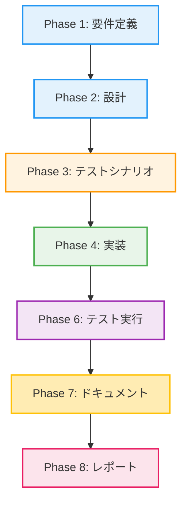

# プロジェクト計画書 - Issue #398

**Issue番号**: #398
**タイトル**: [FOLLOW-UP] Issue #396 - 残タスク
**作成日**: 2025-01-16
**計画者**: AI Project Manager (Phase 0)

---

## 1. Issue分析

### 1.1 概要

Issue #396の評価フェーズで特定された残タスクを完了させるフォローアップ作業です。Issue #396では、ai-workflow-v2のプリセット機能拡充と依存関係チェック強化が実装されましたが、時間的制約により以下の項目が未完了でした。

### 1.2 複雑度

**中程度**

**判断根拠**:
- **既存パターンの適用**: implementation.tsで実装されたパターンを他の4ファイルに適用する作業が中心
- **修正ファイル数**: 合計9ファイル（Phase 4ファイル + Prompt 5ファイル）
- **新規ロジック不要**: 既存の`buildOptionalContext`ヘルパー関数を活用するため、新規ロジックの開発は不要
- **テスト実施**: 手動E2Eテストと自動テストの実行が必要だが、テストシナリオは既に存在
- **影響範囲**: 既存機能への影響は最小限（従来通りの動作を維持）

### 1.3 見積もり工数

**合計: 6~10時間**

**内訳**:
1. **Phaseクラス修正 (4ファイル)**: 2~3時間
   - 参照実装（implementation.ts）をベースにした機械的な適用
   - 1ファイルあたり30~45分
2. **プロンプトファイル修正 (5ファイル)**: 1~2時間
   - 置換キーの変更とコメント追加
   - 1ファイルあたり12~24分
3. **手動E2Eテスト**: 1~2時間
   - 4つのシナリオの実行と検証
4. **テスト自動実行**: 0.5時間
   - 既存テストスイート（42ケース）の実行
5. **レビューとリファクタリング**: 1~2時間
   - コードレビュー、修正、品質確認
6. **ドキュメント更新**: 0.5~1時間
   - 実装ログの更新

### 1.4 リスク評価

**低**

**判断根拠**:
- **技術的リスク**: 低 - 既存パターンの適用のみで新技術なし
- **スコープリスク**: 低 - タスクが明確に定義されている
- **リソースリスク**: 低 - 単独作業者で完結可能
- **依存リスク**: 低 - 外部依存なし、Issue #396の成果物を活用

---

## 2. 実装戦略判断

### 2.1 実装戦略: EXTEND

**判断根拠**:

Issue #396で既に実装されたコア機能（`buildOptionalContext`ヘルパー関数、プリセット定義、依存関係チェック強化）は変更不要です。このフォローアップ作業は、既存の実装パターンを他のファイルに「拡張適用」する作業です。

**具体的な理由**:
1. **既存パターンの適用が中心**
   - implementation.tsで実装されたオプショナルコンテキスト構築パターンを、test-implementation.ts、testing.ts、documentation.ts、report.tsの4ファイルに適用
   - 新規ロジックの開発は不要

2. **既存ヘルパー関数の活用**
   - `BasePhase.buildOptionalContext`メソッドは既に実装済み
   - 各Phaseクラスはこのメソッドを呼び出すだけ

3. **プロンプトファイルの修正**
   - 置換キー（`{requirements_document_path}` → `{requirements_context}`）の変更
   - コメント追加による使用方法の明示

4. **新規ファイル作成は不要**
   - 全て既存ファイルの修正のみ

### 2.2 テスト戦略: INTEGRATION_ONLY

**判断根拠**:

今回のフォローアップ作業では、新規ロジックの追加がなく、既存の`buildOptionalContext`メソッドを使用するだけです。ユニットテストは既にIssue #396で実装済み（42ケース）であり、追加のユニットテストは不要です。

**具体的な理由**:
1. **ユニットテスト不要の理由**
   - `buildOptionalContext`メソッドのユニットテストは既に存在（`tests/unit/base-phase-optional-context.test.ts`）
   - 各Phaseクラスは既存メソッドを呼び出すだけで、新規ロジックなし

2. **インテグレーションテスト必要の理由**
   - **エンドツーエンドの動作確認**: 実際のプリセット実行（quick-fix、implementationなど）で、修正したPhaseクラスが正常に動作することを確認
   - **Agent実行時の挙動確認**: プロンプトのオプショナル参照が実際のAgent実行時に正常に機能することを確認
   - **手動E2Eテスト**: 評価レポートで特定された4つのシナリオ（quick-fix実行、--list-presets、非推奨プリセット警告、implementationプリセット実行）を手動で実行
   - **自動テスト実行**: Issue #396で作成された42個のテストケースを実行し、全て成功することを確認

3. **BDD不要の理由**
   - 開発者向けの内部機能拡張であり、エンドユーザー向けのストーリーではない
   - テストシナリオは既にIssue #396のPhase 3で定義済み

### 2.3 テストコード戦略: EXTEND_TEST

**判断根拠**:

Issue #396で作成されたテストコード（42ケース）は、今回の修正対象の機能も既にカバーしています。新規テストコードの作成は不要で、既存テストを実行して全て成功することを確認します。

**具体的な理由**:
1. **既存テストの再利用**
   - `tests/unit/base-phase-optional-context.test.ts`: `buildOptionalContext`のテスト（7ケース）
   - `tests/integration/preset-execution.test.ts`: プリセット実行のテスト（14ケース）
   - これらのテストは、今回修正するPhaseクラスとプロンプトファイルも間接的にカバー

2. **新規テストコード不要の理由**
   - 新規ロジックの追加がないため、新規テストケースは不要
   - 既存の42ケースで十分なカバレッジを確保

3. **手動E2Eテストの追加**
   - テストコードではなく、実際の実行で動作確認を行う
   - quick-fixプリセット、--list-presetsコマンド、非推奨プリセット警告、implementationプリセットの実行

---

## 3. 影響範囲分析

### 3.1 既存コードへの影響

#### 3.1.1 変更が必要なファイル (9ファイル)

**Phaseクラス (4ファイル)**:
1. `scripts/ai-workflow-v2/src/phases/test-implementation.ts`
   - `execute`メソッドでオプショナルコンテキスト構築を使用
   - 修正箇所: requirements、design、scenario、implementationの参照部分

2. `scripts/ai-workflow-v2/src/phases/testing.ts`
   - `execute`メソッドでオプショナルコンテキスト構築を使用
   - 修正箇所: test_implementation、implementationの参照部分

3. `scripts/ai-workflow-v2/src/phases/documentation.ts`
   - `execute`メソッドでオプショナルコンテキスト構築を使用
   - 修正箇所: implementation、testingの参照部分

4. `scripts/ai-workflow-v2/src/phases/report.ts`
   - `execute`メソッドでオプショナルコンテキスト構築を使用
   - 修正箇所: requirements、design、implementation、testing、documentationの参照部分

**プロンプトファイル (5ファイル)**:
5. `scripts/ai-workflow-v2/src/prompts/implementation/execute.txt`
   - 置換キーを `{requirements_context}`、`{design_context}`、`{test_scenario_context}` に変更
   - オプショナル参照の説明コメント追加

6. `scripts/ai-workflow-v2/src/prompts/test_implementation/execute.txt`
   - 置換キーを `{requirements_context}`、`{design_context}`、`{test_scenario_context}`、`{implementation_context}` に変更
   - オプショナル参照の説明コメント追加

7. `scripts/ai-workflow-v2/src/prompts/testing/execute.txt`
   - 置換キーを `{test_implementation_context}`、`{implementation_context}` に変更
   - オプショナル参照の説明コメント追加

8. `scripts/ai-workflow-v2/src/prompts/documentation/execute.txt`
   - 置換キーを `{implementation_context}`、`{testing_context}` に変更
   - オプショナル参照の説明コメント追加

9. `scripts/ai-workflow-v2/src/prompts/report/execute.txt`
   - 置換キーを `{requirements_context}`、`{design_context}`、`{implementation_context}`、`{testing_context}`、`{documentation_context}` に変更
   - オプショナル参照の説明コメント追加

#### 3.1.2 影響度マトリクス

| ファイル | 影響度 | 変更タイプ | リスク | 変更行数（見積もり） |
|---------|-------|-----------|--------|-------------------|
| test-implementation.ts | 中 | 修正 | 低 | 20~30行 |
| testing.ts | 中 | 修正 | 低 | 15~25行 |
| documentation.ts | 中 | 修正 | 低 | 15~25行 |
| report.ts | 高 | 修正 | 低 | 30~40行 |
| implementation/execute.txt | 低 | 修正 | 低 | 10~15行 |
| test_implementation/execute.txt | 低 | 修正 | 低 | 15~20行 |
| testing/execute.txt | 低 | 修正 | 低 | 10~15行 |
| documentation/execute.txt | 低 | 修正 | 低 | 10~15行 |
| report/execute.txt | 低 | 修正 | 低 | 20~30行 |

### 3.2 依存関係の変更

**新規依存の追加**: なし

**既存依存の変更**: なし

**注意点**:
- `BasePhase.buildOptionalContext`メソッド（Issue #396で既に実装済み）を使用
- `fs`モジュールと`path`モジュールは既にimport済み

### 3.3 マイグレーション要否

**不要**

- メタデータスキーマの変更なし
- 設定ファイルの変更なし
- データベーススキーマの変更なし

---

## 4. タスク分割

## ⚠️ 重要: チェックリスト標準フォーマット（必須）

各フェーズのタスクは、**必ずチェックリスト形式**で記述してください。このチェックリストは、Review Phaseで完了判定に使用されます。

### Phase 1: 要件定義 (見積もり: 0.5h)

- [x] Task 1-1: 残タスクの詳細確認 (0.5h)
  - Issue #396の評価レポートを確認
  - implementation.tsの実装パターンを確認
  - 設計書（design.md）の7.3節を確認
  - 各Phaseクラスの現在の実装を確認
  - プロンプトファイルの現在の形式を確認

### Phase 2: 設計 (見積もり: 0.5~1h)

- [x] Task 2-1: Phaseクラス修正の詳細設計 (0.25~0.5h)
  - implementation.tsの実装パターンを各Phaseクラスに適用する具体的な手順を定義
  - 各Phaseクラスのオプショナルコンテキスト構築対象を特定
  - フォールバックメッセージの文言を定義

- [x] Task 2-2: プロンプトファイル修正の詳細設計 (0.25~0.5h)
  - 各プロンプトファイルの置換キー変更箇所を特定
  - コメント追加の形式を定義（設計書7.4節を参照）

### Phase 3: テストシナリオ (見積もり: 1h)

- [ ] Task 3-1: 手動E2Eテストシナリオの定義 (0.5h)
  - quick-fixプリセット実行シナリオ（--ignore-dependencies使用）
  - implementationプリセット実行シナリオ
  - 非推奨プリセット名での実行シナリオ（警告確認）
  - --list-presetsコマンド実行シナリオ

- [ ] Task 3-2: 自動テスト実行シナリオの定義 (0.5h)
  - Issue #396で作成された42個のテストケースの実行
  - テスト成功基準の明確化（全42ケース成功）

### Phase 4: 実装 (見積もり: 3~5h)

- [x] Task 4-1: test-implementation.tsの修正 (0.5~0.75h)
  - requirementsContext、designContext、scenarioContext、implementationContextの構築を`buildOptionalContext`に置き換え
  - プロンプト置換キーを変更（`{requirements_document_path}` → `{requirements_context}`など）
  - エラーハンドリング処理の削除（オプショナル参照に変更）

- [x] Task 4-2: testing.tsの修正 (0.5~0.75h)
  - testImplementationContext、implementationContextの構築を`buildOptionalContext`に置き換え
  - プロンプト置換キーを変更
  - エラーハンドリング処理の削除

- [x] Task 4-3: documentation.tsの修正 (0.5~0.75h)
  - implementationContext、testingContextの構築を`buildOptionalContext`に置き換え
  - プロンプト置換キーを変更
  - エラーハンドリング処理の削除

- [x] Task 4-4: report.tsの修正 (0.75~1.25h)
  - requirementsContext、designContext、implementationContext、testingContext、documentationContextの構築を`buildOptionalContext`に置き換え
  - プロンプト置換キーを変更（5箇所）
  - エラーハンドリング処理の削除

- [x] Task 4-5: プロンプトファイル5個の修正 (0.75~1.5h)
  - implementation/execute.txt: 置換キー変更、コメント追加
  - test_implementation/execute.txt: 置換キー変更、コメント追加
  - testing/execute.txt: 置換キー変更、コメント追加
  - documentation/execute.txt: 置換キー変更、コメント追加
  - report/execute.txt: 置換キー変更、コメント追加

### Phase 5: テストコード実装 (見積もり: 0h)

**このフェーズはスキップ**:
- Issue #396で作成されたテストコード（42ケース）を再利用
- 新規テストコードの作成は不要

### Phase 6: テスト実行 (見積もり: 1.5~2.5h)

- [x] Task 6-1: 自動テストの実行 (0.5h)
  - Issue #396の42個のテストケースを実行
  - テスト結果の確認（全42ケース成功を期待）
  - テストカバレッジの確認

- [x] Task 6-2: 手動E2Eテストの実施 (1~2h)
  - quick-fixプリセット実行（--preset quick-fix --ignore-dependencies）
  - implementationプリセット実行
  - 非推奨プリセット名での実行（requirements-only → 警告確認）
  - --list-presetsコマンド実行
  - 各テストの結果記録（スクリーンショット、ログ）

### Phase 7: ドキュメント (見積もり: 0.5~1h)

- [x] Task 7-1: 実装ログの更新 (0.25~0.5h)
  - implementation.mdに修正内容を追記
  - 修正したファイル一覧を更新
  - 未実装の項目リストから該当項目を削除

- [x] Task 7-2: READMEの更新確認 (0.25~0.5h)
  - README.mdの更新が必要か確認
  - Issue #396のドキュメントが十分か確認

### Phase 8: レポート (見積もり: 0.5~1h)

- [x] Task 8-1: 実装サマリーの作成 (0.25~0.5h)
  - 修正したファイル一覧
  - 各ファイルの変更内容の要約
  - 実装方針の説明

- [x] Task 8-2: テスト結果サマリーの作成 (0.25~0.5h)
  - 自動テスト結果（42ケース）
  - 手動E2Eテスト結果（4シナリオ）
  - 発見された問題と対応状況

---

## 5. 依存関係

### 5.1 タスク間の依存関係



**注意**: Phase 5（テストコード実装）は、既存テストコードを再利用するためスキップします。

### 5.2 実装タスクの並列化可能性

**Phase 4内の並列化**:
- Task 4-1~4-4（Phaseクラス修正）は、相互に依存しないため並列実施可能
- Task 4-5（プロンプトファイル修正）は、Phaseクラス修正と並行して実施可能

**ただし、推奨実装順序**:
1. 最初にtest-implementation.ts（最もシンプル）
2. 次にtesting.ts、documentation.ts（中程度の複雑さ）
3. 最後にreport.ts（最も複雑）
4. プロンプトファイルは各Phaseクラス修正後に対応するファイルを修正

---

## 6. リスクと軽減策

### リスク1: implementation.tsと異なるパターンが必要な場合の対処

- **影響度**: 中
- **確率**: 低
- **軽減策**:
  - Phase 1で各Phaseクラスの現在の実装を詳細に確認
  - implementation.tsのパターンが適用できない場合は、設計書（design.md 7.3節）を参照
  - 必要に応じてPhase 2で個別の設計を行う

### リスク2: プロンプト変更による予期しない動作

- **影響度**: 中
- **確率**: 低
- **軽減策**:
  - Phase 6の手動E2Eテストで、実際のAgent実行時の動作を確認
  - quick-fixプリセット（依存関係を無視）での実行を必ず確認
  - 問題が発見された場合は、フォールバックメッセージの文言を調整

### リスク3: テスト実行環境の問題

- **影響度**: 低
- **確率**: 中
- **軽減策**:
  - Issue #396と同じ環境制約（コマンド承認要件）が存在する可能性
  - 自動テスト実行が失敗した場合は、コードレビューによる検証で代替
  - 手動E2Eテストを優先的に実施

### リスク4: プロンプトファイルの置換キー不一致

- **影響度**: 高
- **確率**: 低
- **軽減策**:
  - Phase 4で、Phaseクラスとプロンプトファイルの置換キーを必ず一致させる
  - Phase 6のE2Eテストで、プロンプト構築時のエラーを確認
  - エラーが発生した場合は即座に修正

---

## 7. 品質ゲート

### Phase 1: 要件定義

- [ ] Issue #396の評価レポートを確認済み
- [ ] implementation.tsの実装パターンを理解済み
- [ ] 設計書（design.md）の関連セクションを確認済み
- [ ] 各Phaseクラスの現在の実装を確認済み
- [ ] プロンプトファイルの現在の形式を確認済み

### Phase 2: 設計

- [ ] **実装戦略（EXTEND）の判断根拠が明記されている**
- [ ] **テスト戦略（INTEGRATION_ONLY）の判断根拠が明記されている**
- [ ] **テストコード戦略（EXTEND_TEST）の判断根拠が明記されている**
- [ ] 各Phaseクラスの修正箇所が明確に定義されている
- [ ] プロンプトファイルの修正内容が明確に定義されている
- [ ] フォールバックメッセージの文言が定義されている

### Phase 3: テストシナリオ

- [ ] 手動E2Eテストシナリオ（4つ）が定義されている
- [ ] 各シナリオの期待結果が明確に記載されている
- [ ] 自動テスト実行の成功基準が定義されている

### Phase 4: 実装

- [ ] 4つのPhaseクラスが修正されている
- [ ] 5つのプロンプトファイルが修正されている
- [ ] Phaseクラスとプロンプトファイルの置換キーが一致している
- [ ] エラーハンドリング処理が適切に削除されている
- [ ] コーディング規約に準拠している

### Phase 6: テスト実行

- [ ] 自動テスト（42ケース）が全て成功している
- [ ] 手動E2Eテスト（4シナリオ）が全て成功している
- [ ] 発見された問題が全て修正されている

### Phase 7: ドキュメント

- [ ] 実装ログが更新されている
- [ ] 修正ファイル一覧が正確に記載されている
- [ ] 未実装項目リストから該当項目が削除されている

### Phase 8: レポート

- [ ] 実装サマリーが作成されている
- [ ] テスト結果サマリーが作成されている
- [ ] マージ推奨の判断が明確に記載されている

---

## 8. 参考情報

### 8.1 関連ドキュメント

- **Issue #396評価レポート**: `.ai-workflow/issue-396/09_evaluation/output/evaluation_report.md`
- **Issue #396設計書**: `.ai-workflow/issue-396/02_design/output/design.md`
  - 特に7.3節（オプショナルコンテキスト構築の設計）を参照
- **Issue #396実装ログ**: `.ai-workflow/issue-396/04_implementation/output/implementation.md`
- **参照実装**: `scripts/ai-workflow-v2/src/phases/implementation.ts`

### 8.2 実装パターン例（implementation.tsからの抜粋）

```typescript
// オプショナルコンテキストを構築（Issue #396）
const requirementsContext = this.buildOptionalContext(
  'requirements',
  'requirements.md',
  '要件定義書は利用できません。Planning情報とIssue情報から要件を推測してください。',
  issueNumber,
);

const designContext = this.buildOptionalContext(
  'design',
  'design.md',
  '設計書は利用できません。Issue情報とPlanning情報に基づいて適切な設計判断を行ってください。',
  issueNumber,
);

// プロンプトで使用
const executePrompt = this.loadPrompt('execute')
  .replace('{planning_document_path}', planningReference)
  .replace('{requirements_context}', requirementsContext)
  .replace('{design_context}', designContext)
  .replace('{test_scenario_context}', testScenarioContext)
  .replace('{implementation_strategy}', implementationStrategy)
  .replace('{issue_number}', String(issueNumber));
```

### 8.3 プロンプトファイルのフォーマット例（設計書7.4.1節）

```markdown
### 要件定義書（利用可能な場合）
{requirements_context}
<!--
  存在する場合: @requirements.md への参照
  存在しない場合: "要件定義書は利用できません。Planning情報とIssue情報から要件を推測してください。"
-->
```

---

## 9. 成功基準

### 9.1 機能要件の達成

- [ ] 4つのPhaseクラス（test-implementation、testing、documentation、report）がオプショナルコンテキスト構築を使用している
- [ ] 5つのプロンプトファイルの置換キーがオプショナル参照形式に変更されている
- [ ] quick-fixプリセットが依存関係を無視して正常に動作する
- [ ] implementationプリセットが正常に動作する
- [ ] 非推奨プリセット名で警告メッセージが表示される
- [ ] --list-presetsコマンドが正常に動作する

### 9.2 非機能要件の達成

- [ ] 既存機能への影響がない（従来通りの動作を維持）
- [ ] コーディング規約に準拠している
- [ ] パフォーマンスへの影響がない

### 9.3 品質基準の達成

- [ ] 自動テスト（42ケース）が全て成功する
- [ ] 手動E2Eテスト（4シナリオ）が全て成功する
- [ ] コードレビューで問題が指摘されない
- [ ] ドキュメントが正確に更新されている

---

## 10. 次のステップ

1. **Phase 1（要件定義）の開始**
   - Issue #396の評価レポートと設計書を詳細に確認
   - implementation.tsの実装パターンを理解
   - 各Phaseクラスの現在の実装を確認

2. **Phase 2（設計）の準備**
   - 各Phaseクラスの修正箇所を特定
   - フォールバックメッセージの文言を定義

3. **実装の開始**
   - test-implementation.tsから順番に修正
   - 各修正後に簡易的な動作確認を実施

4. **テストの実施**
   - 自動テストの実行
   - 手動E2Eテストの実施

5. **最終確認とマージ**
   - ドキュメント更新
   - レポート作成
   - プルリクエスト作成

---

**作成日**: 2025-01-16
**Issue番号**: #398
**関連Issue**: #396
**見積もり工数**: 6~10時間
**複雑度**: 中程度
**リスクレベル**: 低
