# 詳細設計書 - Issue #398

**Issue番号**: #398
**タイトル**: [FOLLOW-UP] Issue #396 - 残タスク
**作成日**: 2025-01-16
**作成者**: AI Design Architect (Phase 2)

---

## 0. Planning Documentの確認

Planning Document (@.ai-workflow/issue-398/00_planning/output/planning.md) と要件定義書 (@.ai-workflow/issue-398/01_requirements/output/requirements.md) を確認し、以下の開発計画を踏まえて詳細設計を実施します。

### 開発計画の要点
- **複雑度**: 中程度
- **見積もり工数**: 6~10時間
- **リスクレベル**: 低
- **既存パターンの適用**: implementation.tsの実装パターンを4つのPhaseクラスに適用

---

## 1. 実装戦略判断（必須）

### 実装戦略: EXTEND

**判断根拠**:

1. **既存パターンの適用が中心**
   - Issue #396で既に実装された`buildOptionalContext`メソッド（base-phase.ts）を使用
   - implementation.tsで実装されたパターンを、test-implementation.ts、testing.ts、documentation.ts、report.tsの4ファイルに適用
   - 新規ロジックやヘルパー関数の開発は不要

2. **既存ファイルの修正が主な作業**
   - 新規ファイル作成: 0個
   - 既存ファイル修正: 9個（Phaseクラス4個 + プロンプトファイル5個）
   - 既存の`buildOptionalContext`メソッドを呼び出すだけで、メソッド自体の変更は不要

3. **既存機能との統合度が高い**
   - 従来のエラーハンドリングロジック（`getPhaseOutputFile` + `getAgentFileReference`）を削除
   - オプショナルコンテキスト構築パターンに置き換え
   - プロンプトファイルの置換キーを変更（`{filename_path}` → `{filename_context}`）

4. **既存のテストコードとアーキテクチャを活用**
   - Issue #396で作成された42個のテストケースを再利用
   - 既存の依存関係チェック機能（`validatePhaseDependencies`）はそのまま維持
   - 新規テストケースの作成は不要

---

## 2. テスト戦略判断（必須）

### テスト戦略: INTEGRATION_ONLY

**判断根拠**:

1. **ユニットテスト不要の理由**
   - `buildOptionalContext`メソッドのユニットテストは既に存在（`tests/unit/base-phase-optional-context.test.ts` - 7ケース）
   - 各Phaseクラスは既存メソッドを呼び出すだけで、新規ロジックの追加がない
   - プロンプトファイルの置換キー変更は純粋なテキスト置換のため、ユニットテストは不要

2. **インテグレーションテスト必要の理由**
   - **エンドツーエンドの動作確認**: 実際のプリセット実行（quick-fix、implementationなど）で、修正したPhaseクラスが正常に動作することを確認
   - **Agent実行時の挙動確認**: プロンプトのオプショナル参照が実際のAgent実行時に正常に機能することを確認
   - **手動E2Eテスト**: 評価レポートで特定された4つのシナリオ（quick-fix実行、--list-presets、非推奨プリセット警告、implementationプリセット実行）を手動で実行
   - **自動テスト実行**: Issue #396で作成された42個のテストケースを実行し、全て成功することを確認

3. **BDD不要の理由**
   - 開発者向けの内部機能拡張であり、エンドユーザー向けのストーリーではない
   - テストシナリオは既にIssue #396のPhase 3で定義済み
   - 新規のユーザーストーリーやビジネスロジックの追加はない

4. **既存テストとの整合性**
   - Issue #396で作成されたテスト戦略（UNIT + INTEGRATION）を継承
   - 今回はユニットテストは追加せず、既存のインテグレーションテストを拡張

---

## 3. テストコード戦略判断（必須）

### テストコード戦略: EXTEND_TEST

**判断根拠**:

1. **既存テストの再利用**
   - `tests/unit/base-phase-optional-context.test.ts`: `buildOptionalContext`のテスト（7ケース）
   - `tests/integration/preset-execution.test.ts`: プリセット実行のテスト（14ケース）
   - これらのテストは、今回修正するPhaseクラスとプロンプトファイルも間接的にカバー

2. **新規テストコード不要の理由**
   - 新規ロジックの追加がないため、新規テストケースは不要
   - 既存の42ケースで十分なカバレッジを確保
   - `buildOptionalContext`メソッドの動作は既にテスト済み

3. **手動E2Eテストの追加**
   - テストコードではなく、実際の実行で動作確認を行う
   - quick-fixプリセット、--list-presetsコマンド、非推奨プリセット警告、implementationプリセットの実行
   - 結果はドキュメント（test-result.md）に記録

4. **既存テストとの関連性**
   - 今回の修正は既存のテストフレームワークと完全に互換性がある
   - テストコードの変更は不要（既存テストが引き続き動作）

---

## 4. アーキテクチャ設計

### 4.1 システム全体図

```
┌─────────────────────────────────────────────────────────────┐
│                     BasePhase                               │
│  - buildOptionalContext() メソッド（Issue #396で実装済み） │
│    ・ファイル存在チェック                                   │
│    ・存在する場合: @filepath参照                            │
│    ・存在しない場合: フォールバックメッセージ               │
└──────────────────┬──────────────────────────────────────────┘
                   │ 継承
                   ↓
┌─────────────────────────────────────────────────────────────┐
│  各Phaseクラス（4個）                                        │
│  - TestImplementationPhase                                  │
│  - TestingPhase                                             │
│  - DocumentationPhase                                       │
│  - ReportPhase                                              │
│                                                             │
│  execute()メソッド内で:                                     │
│    1. buildOptionalContext()を呼び出し                      │
│    2. プロンプト置換キーに設定                              │
│    3. エラーハンドリングを削除                              │
└──────────────────┬──────────────────────────────────────────┘
                   │ プロンプト読み込み
                   ↓
┌─────────────────────────────────────────────────────────────┐
│  プロンプトファイル（5個）                                   │
│  - implementation/execute.txt                               │
│  - test_implementation/execute.txt                          │
│  - testing/execute.txt                                      │
│  - documentation/execute.txt                                │
│  - report/execute.txt                                       │
│                                                             │
│  変更内容:                                                   │
│    1. 置換キー変更（{filename_path} → {filename_context}）  │
│    2. コメント追加（オプショナル参照の説明）                 │
└─────────────────────────────────────────────────────────────┘
```

### 4.2 データフロー

```
[Phase実行開始]
      ↓
[buildOptionalContext()呼び出し]
      ↓
[ファイル存在チェック]
      ↓
      ├─ 存在する → @filepath参照を返す
      └─ 存在しない → フォールバックメッセージを返す
      ↓
[プロンプトの置換キーに設定]
      ↓
[Claude Agentにプロンプトを送信]
      ↓
[Agent実行（オプショナルコンテキストを使用）]
      ↓
[Phase完了]
```

### 4.3 コンポーネント間の関係

```mermaid
graph TD
    BasePhase[BasePhase.buildOptionalContext]
    TestImpl[TestImplementationPhase.execute]
    Testing[TestingPhase.execute]
    Doc[DocumentationPhase.execute]
    Report[ReportPhase.execute]

    Prompt1[implementation/execute.txt]
    Prompt2[test_implementation/execute.txt]
    Prompt3[testing/execute.txt]
    Prompt4[documentation/execute.txt]
    Prompt5[report/execute.txt]

    TestImpl --> BasePhase
    Testing --> BasePhase
    Doc --> BasePhase
    Report --> BasePhase

    TestImpl --> Prompt2
    Testing --> Prompt3
    Doc --> Prompt4
    Report --> Prompt5

    style BasePhase fill:#e3f2fd,stroke:#2196f3,stroke-width:2px
    style TestImpl fill:#e8f5e9,stroke:#4caf50,stroke-width:2px
    style Testing fill:#e8f5e9,stroke:#4caf50,stroke-width:2px
    style Doc fill:#e8f5e9,stroke:#4caf50,stroke-width:2px
    style Report fill:#e8f5e9,stroke:#4caf50,stroke-width:2px
    style Prompt1 fill:#fff3e0,stroke:#ff9800,stroke-width:2px
    style Prompt2 fill:#fff3e0,stroke:#ff9800,stroke-width:2px
    style Prompt3 fill:#fff3e0,stroke:#ff9800,stroke-width:2px
    style Prompt4 fill:#fff3e0,stroke:#ff9800,stroke-width:2px
    style Prompt5 fill:#fff3e0,stroke:#ff9800,stroke-width:2px
```



---

## 5. 影響範囲分析

### 5.1 既存コードへの影響

#### 5.1.1 変更が必要なファイル（9ファイル）

**Phaseクラス（4ファイル）**:

1. `scripts/ai-workflow-v2/src/phases/test-implementation.ts`
   - 影響度: 中
   - 変更タイプ: 修正
   - リスク: 低
   - 変更行数: 20~30行

2. `scripts/ai-workflow-v2/src/phases/testing.ts`
   - 影響度: 中
   - 変更タイプ: 修正
   - リスク: 低
   - 変更行数: 15~25行

3. `scripts/ai-workflow-v2/src/phases/documentation.ts`
   - 影響度: 中
   - 変更タイプ: 修正
   - リスク: 低
   - 変更行数: 15~25行

4. `scripts/ai-workflow-v2/src/phases/report.ts`
   - 影響度: 高
   - 変更タイプ: 修正
   - リスク: 低
   - 変更行数: 30~40行

**プロンプトファイル（5ファイル）**:

5. `scripts/ai-workflow-v2/src/prompts/implementation/execute.txt`
   - 影響度: 低
   - 変更タイプ: 修正
   - リスク: 低
   - 変更行数: 10~15行

6. `scripts/ai-workflow-v2/src/prompts/test_implementation/execute.txt`
   - 影響度: 低
   - 変更タイプ: 修正
   - リスク: 低
   - 変更行数: 15~20行

7. `scripts/ai-workflow-v2/src/prompts/testing/execute.txt`
   - 影響度: 低
   - 変更タイプ: 修正
   - リスク: 低
   - 変更行数: 10~15行

8. `scripts/ai-workflow-v2/src/prompts/documentation/execute.txt`
   - 影響度: 低
   - 変更タイプ: 修正
   - リスク: 低
   - 変更行数: 10~15行

9. `scripts/ai-workflow-v2/src/prompts/report/execute.txt`
   - 影響度: 低
   - 変更タイプ: 修正
   - リスク: 低
   - 変更行数: 20~30行

#### 5.1.2 変更不要なファイル

- `scripts/ai-workflow-v2/src/phases/base-phase.ts`: `buildOptionalContext`メソッドは既に実装済み（Issue #396）
- `scripts/ai-workflow-v2/src/phases/implementation.ts`: 既にオプショナルコンテキスト構築を使用（参照実装）
- テストファイル: 42個のテストケースは修正不要（そのまま実行）

### 5.2 依存関係の変更

**新規依存の追加**: なし

**既存依存の変更**: なし

**注意点**:
- `BasePhase.buildOptionalContext`メソッド（Issue #396で既に実装済み）を使用
- `fs`モジュールと`path`モジュールは既にimport済み
- 既存のPhase依存関係チェック機能（`validatePhaseDependencies`）はそのまま動作

### 5.3 マイグレーション要否

**不要**

- メタデータスキーマの変更なし
- 設定ファイルの変更なし
- データベーススキーマの変更なし
- 既存のプリセット定義（PHASE_PRESETS）の変更なし

---

## 6. 変更・追加ファイルリスト

### 6.1 新規作成ファイル

**なし**

### 6.2 修正が必要な既存ファイル

#### Phaseクラス（4ファイル）

1. `scripts/ai-workflow-v2/src/phases/test-implementation.ts`
2. `scripts/ai-workflow-v2/src/phases/testing.ts`
3. `scripts/ai-workflow-v2/src/phases/documentation.ts`
4. `scripts/ai-workflow-v2/src/phases/report.ts`

#### プロンプトファイル（5ファイル）

5. `scripts/ai-workflow-v2/src/prompts/implementation/execute.txt`
6. `scripts/ai-workflow-v2/src/prompts/test_implementation/execute.txt`
7. `scripts/ai-workflow-v2/src/prompts/testing/execute.txt`
8. `scripts/ai-workflow-v2/src/prompts/documentation/execute.txt`
9. `scripts/ai-workflow-v2/src/prompts/report/execute.txt`

### 6.3 削除が必要なファイル

**なし**

---

## 7. 詳細設計

### 7.1 Phaseクラスの修正パターン

#### 7.1.1 参照実装: implementation.ts（既に実装済み）

```typescript
// オプショナルコンテキストを構築（Issue #396）
const requirementsContext = this.buildOptionalContext(
  'requirements',
  'requirements.md',
  '要件定義書は利用できません。Planning情報とIssue情報から要件を推測してください。',
  issueNumber,
);

const designContext = this.buildOptionalContext(
  'design',
  'design.md',
  '設計書は利用できません。Issue情報とPlanning情報に基づいて適切な設計判断を行ってください。',
  issueNumber,
);

const testScenarioContext = this.buildOptionalContext(
  'test_scenario',
  'test-scenario.md',
  'テストシナリオは利用できません。実装時に適切なテスト考慮を行ってください。',
  issueNumber,
);

// プロンプトで使用
const executePrompt = this.loadPrompt('execute')
  .replace('{planning_document_path}', planningReference)
  .replace('{requirements_context}', requirementsContext)
  .replace('{design_context}', designContext)
  .replace('{test_scenario_context}', testScenarioContext)
  .replace('{implementation_strategy}', implementationStrategy)
  .replace('{issue_number}', String(issueNumber));
```

#### 7.1.2 修正ファイル1: test-implementation.ts

**現在の実装（削除対象）**:

```typescript
const requirementsFile = this.getPhaseOutputFile('requirements', 'requirements.md', issueNumber);
const designFile = this.getPhaseOutputFile('design', 'design.md', issueNumber);
const scenarioFile = this.getPhaseOutputFile('test_scenario', 'test-scenario.md', issueNumber);
const implementationFile = this.getPhaseOutputFile('implementation', 'implementation.md', issueNumber);

if (!requirementsFile || !designFile || !scenarioFile || !implementationFile) {
  return {
    success: false,
    error: '要件・設計・テストシナリオ・実装のいずれかが欠けています。',
  };
}

const requirementsReference = this.getAgentFileReference(requirementsFile);
const designReference = this.getAgentFileReference(designFile);
const scenarioReference = this.getAgentFileReference(scenarioFile);
const implementationReference = this.getAgentFileReference(implementationFile);

if (!requirementsReference || !designReference || !scenarioReference || !implementationReference) {
  return {
    success: false,
    error: 'Claude Agent から参照できないドキュメントがあります。',
  };
}
```

**新しい実装（修正後）**:

```typescript
// オプショナルコンテキストを構築（Issue #398）
const requirementsContext = this.buildOptionalContext(
  'requirements',
  'requirements.md',
  '要件定義書は利用できません。Planning情報とIssue情報から要件を推測してください。',
  issueNumber,
);

const designContext = this.buildOptionalContext(
  'design',
  'design.md',
  '設計書は利用できません。Issue情報とPlanning情報に基づいて適切な設計判断を行ってください。',
  issueNumber,
);

const scenarioContext = this.buildOptionalContext(
  'test_scenario',
  'test-scenario.md',
  'テストシナリオは利用できません。実装時に適切なテスト考慮を行ってください。',
  issueNumber,
);

const implementationContext = this.buildOptionalContext(
  'implementation',
  'implementation.md',
  '実装ログは利用できません。設計書とテストシナリオに基づいて実装してください。',
  issueNumber,
);
```

**プロンプト置換キーの変更**:

```typescript
// 変更前
const executePrompt = this.loadPrompt('execute')
  .replace('{planning_document_path}', planningReference)
  .replace('{requirements_document_path}', requirementsReference)
  .replace('{design_document_path}', designReference)
  .replace('{test_scenario_document_path}', scenarioReference)
  .replace('{implementation_document_path}', implementationReference)
  .replace('{test_strategy}', testStrategy)
  .replace('{test_code_strategy}', testCodeStrategy)
  .replace('{issue_number}', String(issueNumber));

// 変更後
const executePrompt = this.loadPrompt('execute')
  .replace('{planning_document_path}', planningReference)
  .replace('{requirements_context}', requirementsContext)
  .replace('{design_context}', designContext)
  .replace('{test_scenario_context}', scenarioContext)
  .replace('{implementation_context}', implementationContext)
  .replace('{test_strategy}', testStrategy)
  .replace('{test_code_strategy}', testCodeStrategy)
  .replace('{issue_number}', String(issueNumber));
```

#### 7.1.3 修正ファイル2: testing.ts

**現在の実装（削除対象）**:

```typescript
const testImplementationFile = this.getPhaseOutputFile('test_implementation', 'test-implementation.md', issueNumber);
const implementationFile = this.getPhaseOutputFile('implementation', 'implementation.md', issueNumber);
const scenarioFile = this.getPhaseOutputFile('test_scenario', 'test-scenario.md', issueNumber);

if (!testImplementationFile || !implementationFile || !scenarioFile) {
  return {
    success: false,
    error: 'テスト実装・実装・テストシナリオのいずれかが欠けています。',
  };
}

const testImplementationRef = this.getAgentFileReference(testImplementationFile);
const implementationRef = this.getAgentFileReference(implementationFile);
const scenarioRef = this.getAgentFileReference(scenarioFile);

if (!testImplementationRef || !implementationRef || !scenarioRef) {
  return {
    success: false,
    error: 'Claude Agent から参照できないドキュメントがあります。',
  };
}
```

**新しい実装（修正後）**:

```typescript
// オプショナルコンテキストを構築（Issue #398）
const testImplementationContext = this.buildOptionalContext(
  'test_implementation',
  'test-implementation.md',
  'テストコード実装ログは利用できません。実装コードを直接確認してテストを実行してください。',
  issueNumber,
);

const implementationContext = this.buildOptionalContext(
  'implementation',
  'implementation.md',
  '実装ログは利用できません。リポジトリの実装コードを直接確認してください。',
  issueNumber,
);

const scenarioContext = this.buildOptionalContext(
  'test_scenario',
  'test-scenario.md',
  'テストシナリオは利用できません。実装内容に基づいて適切なテストを実施してください。',
  issueNumber,
);
```

**プロンプト置換キーの変更**:

```typescript
// 変更前
const executePrompt = this.loadPrompt('execute')
  .replace('{planning_document_path}', planningReference)
  .replace('{test_implementation_document_path}', testImplementationRef)
  .replace('{implementation_document_path}', implementationRef)
  .replace('{test_scenario_document_path}', scenarioRef)
  .replace('{issue_number}', String(issueNumber));

// 変更後
const executePrompt = this.loadPrompt('execute')
  .replace('{planning_document_path}', planningReference)
  .replace('{test_implementation_context}', testImplementationContext)
  .replace('{implementation_context}', implementationContext)
  .replace('{test_scenario_context}', scenarioContext)
  .replace('{issue_number}', String(issueNumber));
```

#### 7.1.4 修正ファイル3: documentation.ts

**現在の実装（一部抜粋）**:

```typescript
const outputs = this.getPhaseOutputs(issueNumber);

const requiredPhases = ['requirements', 'design', 'test_scenario', 'implementation', 'test_result'];
for (const phase of requiredPhases) {
  if (!outputs[phase]?.exists) {
    return {
      success: false,
      error: `${phase} の成果物が見つかりません: ${outputs[phase]?.path ?? 'N/A'}`,
    };
  }
}

const replacements: Record<string, string> = {
  requirements_document_path: this.requireReference(outputs, 'requirements'),
  design_document_path: this.requireReference(outputs, 'design'),
  test_scenario_document_path: this.requireReference(outputs, 'test_scenario'),
  implementation_document_path: this.requireReference(outputs, 'implementation'),
  test_result_document_path: this.requireReference(outputs, 'test_result'),
  test_implementation_document_path: this.optionalReference(outputs, 'test_implementation'),
};
```

**修正方針**:

documentation.tsは既に`optionalReference`メソッドを使用しており、オプショナル参照の概念を部分的に実装しています。しかし、以下の問題があります：

1. `requiredPhases`で必須チェックを行っているため、前段Phaseが欠けているとエラーになる
2. `requireReference`メソッドは例外をスローするため、quick-fixプリセットで失敗する

**修正内容**:

```typescript
// execute()メソッド内
protected async execute(): Promise<PhaseExecutionResult> {
  const issueNumber = parseInt(this.metadata.data.issue_number, 10);
  const planningReference = this.getPlanningDocumentReference(issueNumber);

  // オプショナルコンテキストを構築（Issue #398）
  const implementationContext = this.buildOptionalContext(
    'implementation',
    'implementation.md',
    '実装ログは利用できません。リポジトリの実装内容を直接確認してください。',
    issueNumber,
  );

  const testingContext = this.buildOptionalContext(
    'testing',
    'test-result.md',
    'テスト結果は利用できません。実装内容に基づいてドキュメントを更新してください。',
    issueNumber,
  );

  // 参考情報（オプショナル）
  const requirementsContext = this.buildOptionalContext(
    'requirements',
    'requirements.md',
    '',
    issueNumber,
  );

  const designContext = this.buildOptionalContext(
    'design',
    'design.md',
    '',
    issueNumber,
  );

  const scenarioContext = this.buildOptionalContext(
    'test_scenario',
    'test-scenario.md',
    '',
    issueNumber,
  );

  const testImplementationContext = this.buildOptionalContext(
    'test_implementation',
    'test-implementation.md',
    '',
    issueNumber,
  );

  const executePrompt = this.loadPrompt('execute')
    .replace('{planning_document_path}', planningReference)
    .replace('{implementation_context}', implementationContext)
    .replace('{testing_context}', testingContext)
    .replace('{requirements_context}', requirementsContext)
    .replace('{design_context}', designContext)
    .replace('{test_scenario_context}', scenarioContext)
    .replace('{test_implementation_context}', testImplementationContext)
    .replace('{issue_number}', String(issueNumber));

  // ... 残りのロジック
}
```

**削除するメソッド**:
- `requireReference()`: エラーをスローするため削除
- `optionalReference()`: `buildOptionalContext`に置き換え
- `requireReferencePath()`: 不要になるため削除
- `getPhaseOutputs()`: 不要になるため削除

#### 7.1.5 修正ファイル4: report.ts

**現在の実装（一部抜粋）**:

```typescript
const outputs = this.getPhaseOutputs(issueNumber);

const requiredPhases = [
  'requirements',
  'design',
  'test_scenario',
  'implementation',
  'test_result',
  'documentation',
];

for (const phase of requiredPhases) {
  if (!outputs[phase]?.exists) {
    return {
      success: false,
      error: `${phase} の成果物が見つかりません: ${outputs[phase]?.path ?? 'N/A'}`,
    };
  }
}

const replacements: Record<string, string> = {
  requirements_document_path: this.requireReference(outputs, 'requirements'),
  design_document_path: this.requireReference(outputs, 'design'),
  test_scenario_document_path: this.requireReference(outputs, 'test_scenario'),
  implementation_document_path: this.requireReference(outputs, 'implementation'),
  test_implementation_document_path: this.optionalReference(outputs, 'test_implementation'),
  test_result_document_path: this.requireReference(outputs, 'test_result'),
  documentation_update_log_path: this.requireReference(outputs, 'documentation'),
};
```

**修正方針**:

report.tsも同様の問題があります。すべての前段Phaseをオプショナルにして、quick-fixプリセットで動作するようにします。

**修正内容**:

```typescript
// execute()メソッド内
protected async execute(): Promise<PhaseExecutionResult> {
  const issueNumber = parseInt(this.metadata.data.issue_number, 10);
  const planningReference = this.getPlanningDocumentReference(issueNumber);

  // オプショナルコンテキストを構築（Issue #398）
  const requirementsContext = this.buildOptionalContext(
    'requirements',
    'requirements.md',
    '要件定義書は利用できません。Issue情報から要件を推測してください。',
    issueNumber,
  );

  const designContext = this.buildOptionalContext(
    'design',
    'design.md',
    '設計書は利用できません。Issue情報から設計内容を推測してください。',
    issueNumber,
  );

  const implementationContext = this.buildOptionalContext(
    'implementation',
    'implementation.md',
    '実装ログは利用できません。リポジトリの実装内容を確認してください。',
    issueNumber,
  );

  const testingContext = this.buildOptionalContext(
    'testing',
    'test-result.md',
    'テスト結果は利用できません。実装内容から推測してください。',
    issueNumber,
  );

  const documentationContext = this.buildOptionalContext(
    'documentation',
    'documentation-update-log.md',
    'ドキュメント更新ログは利用できません。',
    issueNumber,
  );

  // 参考情報（オプショナル）
  const scenarioContext = this.buildOptionalContext(
    'test_scenario',
    'test-scenario.md',
    '',
    issueNumber,
  );

  const testImplementationContext = this.buildOptionalContext(
    'test_implementation',
    'test-implementation.md',
    '',
    issueNumber,
  );

  const executePrompt = this.loadPrompt('execute')
    .replace('{planning_document_path}', planningReference)
    .replace('{requirements_context}', requirementsContext)
    .replace('{design_context}', designContext)
    .replace('{implementation_context}', implementationContext)
    .replace('{testing_context}', testingContext)
    .replace('{documentation_context}', documentationContext)
    .replace('{test_scenario_context}', scenarioContext)
    .replace('{test_implementation_context}', testImplementationContext)
    .replace('{issue_number}', String(issueNumber));

  // ... 残りのロジック
}
```

**削除するメソッド**:
- `requireReference()`: エラーをスローするため削除
- `optionalReference()`: `buildOptionalContext`に置き換え
- `requireReferencePath()`: 不要になるため削除
- `getPhaseOutputs()`: 不要になるため削除

### 7.2 プロンプトファイルの修正パターン

#### 7.2.1 参照例: Issue #396設計書 7.4.1節

```markdown
### 要件定義書（利用可能な場合）
{requirements_context}
<!--
  存在する場合: @requirements.md への参照
  存在しない場合: "要件定義書は利用できません。Planning情報とIssue情報から要件を推測してください。"
-->
```

#### 7.2.2 修正ファイル5: implementation/execute.txt

**変更箇所**:

```markdown
# 変更前
### 設計書
{design_document_path}

### テストシナリオ
{test_scenario_document_path}

### 要件定義書（参考）
{requirements_document_path}

# 変更後
### 設計書（利用可能な場合）
{design_context}
<!--
  存在する場合: @design.md への参照
  存在しない場合: "設計書は利用できません。Issue情報とPlanning情報に基づいて適切な設計判断を行ってください。"
-->

### テストシナリオ（利用可能な場合）
{test_scenario_context}
<!--
  存在する場合: @test-scenario.md への参照
  存在しない場合: "テストシナリオは利用できません。実装時に適切なテスト考慮を行ってください。"
-->

### 要件定義書（利用可能な場合）
{requirements_context}
<!--
  存在する場合: @requirements.md への参照
  存在しない場合: "要件定義書は利用できません。Planning情報とIssue情報から要件を推測してください。"
-->
```

#### 7.2.3 修正ファイル6: test_implementation/execute.txt

**変更箇所**:

```markdown
# 変更前
### 設計書
{design_document_path}

### テストシナリオ
{test_scenario_document_path}

### 実装ログ
{implementation_document_path}

### 要件定義書（参考）
{requirements_document_path}

# 変更後
### 設計書（利用可能な場合）
{design_context}
<!--
  存在する場合: @design.md への参照
  存在しない場合: "設計書は利用できません。Issue情報とPlanning情報に基づいて適切な設計判断を行ってください。"
-->

### テストシナリオ（利用可能な場合）
{test_scenario_context}
<!--
  存在する場合: @test-scenario.md への参照
  存在しない場合: "テストシナリオは利用できません。実装時に適切なテスト考慮を行ってください。"
-->

### 実装ログ（利用可能な場合）
{implementation_context}
<!--
  存在する場合: @implementation.md への参照
  存在しない場合: "実装ログは利用できません。設計書とテストシナリオに基づいて実装してください。"
-->

### 要件定義書（利用可能な場合）
{requirements_context}
<!--
  存在する場合: @requirements.md への参照
  存在しない場合: "要件定義書は利用できません。Planning情報とIssue情報から要件を推測してください。"
-->
```

#### 7.2.4 修正ファイル7: testing/execute.txt

**変更箇所**:

```markdown
# 変更前
### テスト実装ログ
{test_implementation_document_path}

### 実装ログ
{implementation_document_path}

### テストシナリオ
{test_scenario_document_path}

# 変更後
### テスト実装ログ（利用可能な場合）
{test_implementation_context}
<!--
  存在する場合: @test-implementation.md への参照
  存在しない場合: "テストコード実装ログは利用できません。実装コードを直接確認してテストを実行してください。"
-->

### 実装ログ（利用可能な場合）
{implementation_context}
<!--
  存在する場合: @implementation.md への参照
  存在しない場合: "実装ログは利用できません。リポジトリの実装コードを直接確認してください。"
-->

### テストシナリオ（利用可能な場合）
{test_scenario_context}
<!--
  存在する場合: @test-scenario.md への参照
  存在しない場合: "テストシナリオは利用できません。実装内容に基づいて適切なテストを実施してください。"
-->
```

#### 7.2.5 修正ファイル8: documentation/execute.txt

**変更箇所**:

```markdown
# 変更前
### 実装ログ
{implementation_document_path}

### テスト結果
{test_result_document_path}

# 変更後
### 実装ログ（利用可能な場合）
{implementation_context}
<!--
  存在する場合: @implementation.md への参照
  存在しない場合: "実装ログは利用できません。リポジトリの実装内容を直接確認してください。"
-->

### テスト結果（利用可能な場合）
{testing_context}
<!--
  存在する場合: @test-result.md への参照
  存在しない場合: "テスト結果は利用できません。実装内容に基づいてドキュメントを更新してください。"
-->

### 要件定義書（参考・利用可能な場合）
{requirements_context}

### 設計書（参考・利用可能な場合）
{design_context}

### テストシナリオ（参考・利用可能な場合）
{test_scenario_context}

### テスト実装ログ（参考・利用可能な場合）
{test_implementation_context}
```

#### 7.2.6 修正ファイル9: report/execute.txt

**変更箇所**:

```markdown
# 変更前
### 要件定義書
{requirements_document_path}

### 設計書
{design_document_path}

### テストシナリオ
{test_scenario_document_path}

### 実装ログ
{implementation_document_path}

### テスト結果
{test_result_document_path}

### ドキュメント更新ログ
{documentation_update_log_path}

# 変更後
### 要件定義書（利用可能な場合）
{requirements_context}
<!--
  存在する場合: @requirements.md への参照
  存在しない場合: "要件定義書は利用できません。Issue情報から要件を推測してください。"
-->

### 設計書（利用可能な場合）
{design_context}
<!--
  存在する場合: @design.md への参照
  存在しない場合: "設計書は利用できません。Issue情報から設計内容を推測してください。"
-->

### 実装ログ（利用可能な場合）
{implementation_context}
<!--
  存在する場合: @implementation.md への参照
  存在しない場合: "実装ログは利用できません。リポジトリの実装内容を確認してください。"
-->

### テスト結果（利用可能な場合）
{testing_context}
<!--
  存在する場合: @test-result.md への参照
  存在しない場合: "テスト結果は利用できません。実装内容から推測してください。"
-->

### ドキュメント更新ログ（利用可能な場合）
{documentation_context}
<!--
  存在する場合: @documentation-update-log.md への参照
  存在しない場合: "ドキュメント更新ログは利用できません。"
-->

### テストシナリオ（参考・利用可能な場合）
{test_scenario_context}

### テスト実装ログ（参考・利用可能な場合）
{test_implementation_context}
```

### 7.3 フォールバックメッセージの定義

各Phaseクラスで使用するフォールバックメッセージの一覧:

| Phase名 | ファイル名 | フォールバックメッセージ |
|---------|-----------|------------------------|
| requirements | requirements.md | 要件定義書は利用できません。Planning情報とIssue情報から要件を推測してください。 |
| design | design.md | 設計書は利用できません。Issue情報とPlanning情報に基づいて適切な設計判断を行ってください。 |
| test_scenario | test-scenario.md | テストシナリオは利用できません。実装時に適切なテスト考慮を行ってください。 |
| implementation | implementation.md | 実装ログは利用できません。リポジトリの実装コードを直接確認してください。 |
| test_implementation | test-implementation.md | テストコード実装ログは利用できません。実装コードを直接確認してテストを実行してください。 |
| testing | test-result.md | テスト結果は利用できません。実装内容に基づいて適切に判断してください。 |
| documentation | documentation-update-log.md | ドキュメント更新ログは利用できません。 |

**参考情報の場合**（空文字列）:
- 参考情報として使用する場合は、フォールバックメッセージを空文字列（`''`）にする
- この場合、ファイルが存在しない時は何も出力されない

---

## 8. セキュリティ考慮事項

### 8.1 認証・認可

- **変更なし**: 既存のGitHub認証メカニズムをそのまま使用
- **アクセス制御**: Phaseクラスは既存のアクセス制御を維持

### 8.2 データ保護

- **ファイルパスの検証**: `buildOptionalContext`メソッドは既に相対パス検証を実装済み
- **ファイル存在チェック**: `fs.existsSync`による安全なファイル存在確認
- **エラーハンドリング**: 例外発生時もシステムが継続動作

### 8.3 セキュリティリスクと対策

| リスク | 対策 |
|--------|------|
| パストラバーサル攻撃 | `getAgentFileReference`メソッドで相対パス検証済み |
| ファイル不正アクセス | Phase出力ディレクトリ内のファイルのみアクセス可能 |
| 情報漏洩 | フォールバックメッセージに機密情報を含めない |

---

## 9. 非機能要件への対応

### 9.1 パフォーマンス

**NFR-P1**: 各Phaseクラスの`execute`メソッド内の`buildOptionalContext`呼び出しは、1ファイルあたり0.01秒以内に完了すること

**対応**:
- `buildOptionalContext`は単純なファイル存在チェック（`fs.existsSync`）のみ
- I/O処理は最小限（ファイル読み込みなし、パス検証のみ）
- パフォーマンス影響: ほぼゼロ（<1ms/ファイル）

**NFR-P2**: report.tsの`execute`メソッド（5個のオプショナルコンテキスト構築）は、合計0.05秒以内に完了すること

**対応**:
- 5回の`buildOptionalContext`呼び出し = 5ms以下
- 目標（50ms）を大幅に下回る

**NFR-P3**: 既存のPhase実行時間に対して、オプショナルコンテキスト構築による遅延が5%未満であること

**対応**:
- Phase実行時間の大部分はClaude Agent実行（数十秒～数分）
- オプショナルコンテキスト構築（<10ms）は無視できる
- 遅延率: <0.1%（目標5%を大幅に下回る）

### 9.2 保守性

**NFR-M1**: すべてのPhaseクラスで同じ`buildOptionalContext`パターンを使用し、コードの一貫性を確保すること

**対応**:
- 4つのPhaseクラスで統一されたパターンを使用
- 参照実装（implementation.ts）をベースにする
- コードレビューで一貫性を確認

**NFR-M2**: 各Phaseクラスのフォールバックメッセージは、そのPhaseの目的に即した内容であること

**対応**:
- 各Phaseごとに適切なフォールバックメッセージを定義（7.3節参照）
- メッセージは具体的で実行可能な指示を含む
- ユーザーが次に何をすべきか明確に記載

**NFR-M3**: プロンプトファイルのHTMLコメントは、将来のメンテナーが理解しやすい形式であること

**対応**:
- HTMLコメントに2つのケースを明記（存在する場合 / 存在しない場合）
- 具体例を記載してわかりやすくする
- Issue #396設計書の7.4節のフォーマットに準拠

### 9.3 互換性

**NFR-C1**: 既存機能（`--phase`オプション、Resume機能等）への影響がないこと

**対応**:
- `buildOptionalContext`は既存の依存関係チェック機能と独立
- Phase実行フローは変更なし
- メタデータスキーマは変更なし

**NFR-C2**: 従来通りの動作（前段Phase完了時の`@filepath`参照）が維持されること

**対応**:
- ファイルが存在する場合は`@filepath`参照を返す
- 従来の動作と完全に互換性あり

**NFR-C3**: オプショナルコンテキスト未使用のPhaseクラス（planning、requirements等）の動作に影響がないこと

**対応**:
- planning、requirements、design、test_scenarioは修正不要
- BasePhaseの変更はないため、他のPhaseに影響なし

---

## 10. 実装の順序

### 10.1 推奨実装順序

実装は以下の順序で行うことを推奨します：

**Phase 1: 最もシンプルなPhaseクラスから開始**

1. **test-implementation.ts**（最もシンプル）
   - 理由: requirements、design、scenario、implementationの4個のオプショナルコンテキスト
   - リスク: 低
   - 所要時間: 30~45分

**Phase 2: 中程度の複雑さのPhaseクラス**

2. **testing.ts**（中程度）
   - 理由: test_implementation、implementation、scenarioの3個のオプショナルコンテキスト
   - リスク: 低
   - 所要時間: 30~45分

3. **documentation.ts**（中程度）
   - 理由: implementation、testingの2個のオプショナルコンテキスト + 参考情報4個
   - リスク: 中（既存のrequireReferenceメソッド削除が必要）
   - 所要時間: 30~45分

**Phase 3: 最も複雑なPhaseクラス**

4. **report.ts**（最も複雑）
   - 理由: 5個のオプショナルコンテキスト + 参考情報2個
   - リスク: 中（最も多くのコンテキスト）
   - 所要時間: 45~60分

**Phase 4: プロンプトファイルの修正**

5. **プロンプトファイル5個の修正**
   - 各Phaseクラス修正後に対応するプロンプトファイルを修正
   - 理由: Phaseクラスとプロンプトファイルの置換キーを一致させる必要がある
   - リスク: 低
   - 所要時間: 15~30分/ファイル

### 10.2 依存関係の考慮

```
test-implementation.ts → test_implementation/execute.txt
    ↓
testing.ts → testing/execute.txt
    ↓
documentation.ts → documentation/execute.txt
    ↓
report.ts → report/execute.txt
    ↓
implementation/execute.txt（最後に修正）
```

**注意点**:
- implementation.tsは既に修正済みのため、implementation/execute.txtのみ修正
- 各Phaseクラス修正後、対応するプロンプトファイルを修正
- Phaseクラスとプロンプトファイルの置換キーを必ず一致させる

### 10.3 並列化の可能性

以下の作業は並列実施可能です（ただし推奨しない）:

- **Phaseクラス修正**: 4ファイルは相互に依存しないため並列実施可能
- **プロンプトファイル修正**: 5ファイルは相互に依存しないため並列実施可能

**推奨しない理由**:
- 順番に実施することで、エラーを早期に発見できる
- 最初のファイルで得た知見を後続のファイルに活かせる
- 一度に全て修正すると、エラー発生時の原因特定が困難

---

## 11. 品質ゲート（Phase 2）

設計書は以下の品質ゲートを満たしています：

- [x] **実装戦略（EXTEND）の判断根拠が明記されている**
  - セクション1で詳細に記載
  - 既存パターンの適用、既存ファイルの修正、既存機能との統合度を明記

- [x] **テスト戦略（INTEGRATION_ONLY）の判断根拠が明記されている**
  - セクション2で詳細に記載
  - ユニットテスト不要の理由、インテグレーションテスト必要の理由を明記

- [x] **テストコード戦略（EXTEND_TEST）の判断根拠が明記されている**
  - セクション3で詳細に記載
  - 既存テストの再利用、新規テストコード不要の理由を明記

- [x] **既存コードへの影響範囲が分析されている**
  - セクション5で詳細に記載
  - 9個の修正ファイルを特定、影響度とリスクを評価

- [x] **変更が必要なファイルがリストアップされている**
  - セクション6で詳細に記載
  - 新規作成ファイル（0個）、修正ファイル（9個）、削除ファイル（0個）を明記

- [x] **設計が実装可能である**
  - セクション7で詳細設計を記載
  - 各ファイルの変更内容を具体的なコードで示している
  - セクション10で実装順序を明記

---

## 12. 次のステップ

1. **Phase 3（テストシナリオ）の開始**
   - 手動E2Eテストシナリオの定義（4つ）
   - 自動テスト実行シナリオの定義（42ケース）

2. **Phase 4（実装）の準備**
   - 実装順序の確認（test-implementation.ts → testing.ts → documentation.ts → report.ts）
   - 各ファイルの修正箇所の確認

3. **実装の開始**
   - 推奨実装順序（セクション10.1）に従って実施
   - 各修正後に簡易的な動作確認を実施

4. **テストの実施**
   - 自動テストの実行（42ケース）
   - 手動E2Eテストの実施（4シナリオ）

5. **最終確認とマージ**
   - ドキュメント更新
   - レポート作成
   - プルリクエスト作成

---

**作成日**: 2025-01-16
**Issue番号**: #398
**関連Issue**: #396
**Planning Document**: @.ai-workflow/issue-398/00_planning/output/planning.md
**Requirements Document**: @.ai-workflow/issue-398/01_requirements/output/requirements.md
