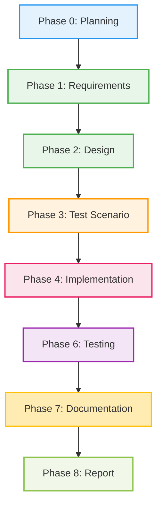

# プロジェクト計画書 - Issue #411

## Issue情報

- **Issue番号**: #411
- **タイトル**: [TASK] AI Workflow V1 (Python版) の安全な削除計画
- **URL**: https://github.com/tielec/infrastructure-as-code/issues/411
- **ラベル**: なし

## 1. Issue分析

### 複雑度: 中程度

**判定根拠**:
- 複数のカテゴリ（Jenkins、ドキュメント、依存関係）にまたがる作業
- 削除対象の影響範囲調査が必要
- ロールバック手順の検証が必要
- ただし、新規コードの実装は不要で、削除と更新が中心

### 見積もり工数: 8~12時間

**内訳**:
- Phase 1 (要件定義): 1~2h - 削除対象の特定と影響範囲分析
- Phase 2 (設計): 1~2h - 段階的削除戦略とロールバック手順の設計
- Phase 3 (テストシナリオ): 1h - バックアップと復元のテストシナリオ
- Phase 4 (実装): 3~5h - Deprecated化、ドキュメント更新、実際の削除
- Phase 5 (テストコード実装): 0h - 削除タスクのためテストコード不要
- Phase 6 (テスト実行): 1~2h - Jenkins動作確認、リンク切れチェック
- Phase 7 (ドキュメント): 0.5~1h - 変更履歴の記録
- Phase 8 (レポート): 0.5h - 削除完了報告

### リスク評価: 中

**主要リスク**:
1. **影響範囲の見落とし**: 隠れた依存関係により、削除後にJenkinsジョブやスクリプトが動作しなくなる可能性（中）
2. **ドキュメントのリンク切れ**: ドキュメント内の参照が多数存在する可能性（中）
3. **ロールバック不可**: バックアップ作成漏れによる復元失敗（低 - Issue内で明確に定義済み）

## 2. 実装戦略判断

### 実装戦略: REFACTOR

**判断根拠**:
- 新規コードの作成は不要（CREATE不適）
- 既存コードの機能拡張も不要（EXTEND不適）
- 既存システムからV1 Python版を安全に削除し、V2 TypeScript版への移行を完了させる構造改善が目的
- ディレクトリ削除、ドキュメント更新、参照削除が中心作業

### テスト戦略: INTEGRATION_ONLY

**判断根拠**:
- ユニットテスト不要: 削除作業であり、新規ロジックの追加がない
- インテグレーションテスト必須: Jenkins環境での動作確認、ドキュメントのリンク切れチェック、CI/CDパイプライン正常動作確認が必要
- BDDテスト不要: エンドユーザー向けの新機能追加ではない

**具体的なテスト観点**:
1. Jenkinsジョブの正常動作確認（V2を使用するジョブのみが存在）
2. ドキュメント内のリンク切れがないことの確認
3. V2での全機能動作確認（V1削除の影響がないこと）
4. バックアップからの復元手順の検証

### テストコード戦略: 該当なし（テストコード不要）

**判断根拠**:
- 削除作業のため、新規テストコードの作成は不要
- Phase 6（テスト実行）では手動検証とスクリプトによる自動チェックを実施

## 3. 影響範囲分析

### 既存コードへの影響

#### 削除対象
1. **ディレクトリ**: `scripts/ai-workflow/` 全体
   - Pythonスクリプト群
   - テストコード（unit, integration, e2e, BDD）
   - プロンプトファイル
   - ドキュメント（README.md, ARCHITECTURE.md等）
   - 設定ファイル（requirements.txt, pytest.ini等）

#### 更新対象
1. **Jenkinsジョブ**:
   - `jenkins/jobs/pipeline/ai-workflow/ai-workflow-orchestrator/Jenkinsfile` - V2を使用中（影響なし）
   - `jenkins/jobs/dsl/ai-workflow/ai_workflow_orchestrator.groovy` - V2を使用中（影響なし）
   - `jenkins/jobs/pipeline/_seed/job-creator/folder-config.yaml` - V1への参照がある場合は削除

2. **ドキュメント**:
   - `jenkins/README.md` - V1への参照削除（line 547付近）
   - プロジェクトルートのREADME等（必要に応じて）

### 依存関係の変更

- **新規依存の追加**: なし
- **既存依存の削除**: Python版AI Workflow関連の依存（実行時依存はなし）

### マイグレーション要否

- **データベーススキーマ変更**: なし
- **設定ファイル変更**: なし（V2は既に独立して動作中）

## 4. タスク分割

### Phase 1: 要件定義 (見積もり: 1~2h)

- [x] Task 1-1: V1を参照しているファイルの全数調査 (1h)
  - Grepで全markdownファイルから `scripts/ai-workflow` への参照を検索
  - Jenkinsジョブ（DSL、Jenkinsfile、folder-config.yaml）からV1への参照を検索
  - Ansibleプレイブック、スクリプトからV1への参照を検索
  - 調査結果をリスト化
- [x] Task 1-2: 削除リスクの評価とバックアップ戦略の確認 (0.5~1h)
  - Issueで提案されたバックアップ方法（Gitブランチ vs tar.gz）の評価
  - ロールバック手順の実現可能性確認
  - 削除後の影響範囲を最終確認

### Phase 2: 設計 (見積もり: 1~2h)

- [x] Task 2-1: 段階的削除戦略の詳細設計 (0.5~1h)
  - Phase 1（Deprecated化）の実施内容決定
  - Phase 2（Jenkinsジョブ更新）の実施内容決定（V2使用中の場合はスキップ可能）
  - Phase 3（ドキュメント更新）の対象ファイルリスト作成
  - Phase 4（実際の削除）の手順決定
- [x] Task 2-2: ロールバック手順の詳細設計 (0.5~1h)
  - バックアップブランチ名の決定（例: `archive/ai-workflow-v1-python`）
  - 復元コマンドの作成
  - ロールバックテスト計画の作成

### Phase 3: テストシナリオ (見積もり: 1h)

- [x] Task 3-1: バックアップと復元のテストシナリオ作成 (0.5h)
  - バックアップブランチ作成手順
  - 復元手順の検証シナリオ
  - 削除後の動作確認項目リスト作成
- [x] Task 3-2: 削除後の検証チェックリスト作成 (0.5h)
  - Jenkinsジョブ動作確認項目
  - ドキュメントリンク切れチェック項目
  - V2機能動作確認項目

### Phase 4: 実装 (見積もり: 3~5h)

- [ ] Task 4-1: Phase 1 - Deprecated化の実施 (1h)
  - `scripts/ai-workflow/DEPRECATED.md` 作成
  - `scripts/ai-workflow/README.md` に非推奨警告追加
  - V1使用中のJenkinsジョブがあれば非推奨警告追加（V2使用中の場合はスキップ）
- [ ] Task 4-2: Phase 2 - Jenkinsジョブの確認と更新 (0.5~1h)
  - V1を使用しているJenkinsジョブがないことを確認（既にV2使用中）
  - 必要に応じてfolder-config.yamlのV1参照を削除
- [ ] Task 4-3: Phase 3 - ドキュメント更新 (1~2h)
  - `jenkins/README.md` からV1への参照削除
  - その他のドキュメントからV1への参照削除
  - V2のREADMEに移行完了の記載追加（必要に応じて）
- [ ] Task 4-4: Phase 4 - バックアップ作成と実際の削除 (0.5~1h)
  - バックアップブランチ作成: `git checkout -b archive/ai-workflow-v1-python`
  - ブランチをリモートにプッシュ: `git push origin archive/ai-workflow-v1-python`
  - mainブランチに戻って削除実行: `git rm -rf scripts/ai-workflow/`
  - コミット作成: `[scripts] remove: AI Workflow V1 (Python版) を削除`

### Phase 5: テストコード実装 (見積もり: 0h)

- [ ] Task 5-1: テストコード不要（削除作業のため）

### Phase 6: テスト実行 (見積もり: 1~2h)

- [ ] Task 6-1: バックアップと復元の検証 (0.5h)
  - バックアップブランチからファイルが復元できることを確認
  - ロールバック手順の実行可能性を確認
- [ ] Task 6-2: 削除後の動作確認 (1~1.5h)
  - Jenkinsジョブ `AI_Workflow/ai_workflow_orchestrator` の動作確認（V2使用）
  - ドキュメントのリンク切れチェック（自動スクリプトまたは手動）
  - V2ワークフローの全機能動作確認（簡易テスト）
  - CI/CDパイプラインの正常動作確認

### Phase 7: ドキュメント (見積もり: 0.5~1h)

- [ ] Task 7-1: 変更履歴の記録 (0.5~1h)
  - CHANGELOGまたはREADMEに削除完了の記載追加
  - バックアップブランチの場所を明記
  - V2への移行が完了したことを記載

### Phase 8: レポート (見積もり: 0.5h)

- [ ] Task 8-1: 削除完了報告の作成 (0.5h)
  - Issue #411への完了コメント作成
  - 削除対象、更新対象のサマリー
  - バックアップブランチ情報
  - 動作確認結果

## 5. 依存関係

**注意**: Phase 5（テストコード実装）は削除作業のため不要

## 6. リスクと軽減策

### リスク1: 隠れた依存関係による削除後の障害

- **影響度**: 中
- **確率**: 中
- **軽減策**:
  - Phase 1でGrep検索による徹底的な参照調査を実施
  - Deprecated化フェーズ（1週間）で問題が発覚する猶予期間を設ける
  - バックアップブランチを確実に作成し、即座にロールバック可能な状態を維持

### リスク2: ドキュメントのリンク切れ

- **影響度**: 中
- **確率**: 中
- **軽減策**:
  - Phase 1で全markdownファイルから参照を検索
  - Phase 6でリンクチェッカーツール（markdownlint, link checker等）を使用
  - Phase 7でドキュメント更新履歴を明記

### リスク3: Jenkins環境でのトラブル

- **影響度**: 高
- **確率**: 低
- **軽減策**:
  - 既にV2へ移行済みであることを事前確認（Task 1-1）
  - Phase 6でJenkinsジョブの実行テストを実施
  - 削除前にDeprecated警告を1週間掲示（Issue提案の通り）

### リスク4: ロールバックの失敗

- **影響度**: 高
- **確率**: 低
- **軽減策**:
  - バックアップブランチ作成を必須化（Task 4-4）
  - Phase 6でロールバック手順の事前検証（Task 6-1）
  - Issue #411に記載のロールバックコマンドを検証

### リスク5: スコープクリープ（作業範囲の拡大）

- **影響度**: 低
- **確率**: 中
- **軽減策**:
  - Issue #411で定義された削除計画に厳密に従う
  - V2の改修や機能追加は本タスクに含めない
  - 追加作業が必要な場合は別Issueを作成

## 7. 品質ゲート

### Phase 1: 要件定義

- [x] V1を参照している全ファイルがリスト化されている
- [x] Jenkinsジョブ、DSLファイル、Jenkinsfileに V1への参照がないことを確認
- [x] ドキュメント（README.md, ARCHITECTURE.md等）のV1参照箇所を特定
- [x] バックアップ戦略が決定されている

### Phase 2: 設計

- [x] 実装戦略（REFACTOR）の判断根拠が明記されている
- [x] テスト戦略（INTEGRATION_ONLY）の判断根拠が明記されている
- [x] 段階的削除計画（4フェーズ）の詳細手順が定義されている
- [x] ロールバック手順が明確に記載されている
- [x] 各タスクに明確な完了条件（Done criteria）が定義されている

### Phase 3: テストシナリオ

- [x] バックアップ作成手順が具体的に記載されている
- [x] 復元手順の検証シナリオが作成されている
- [x] 削除後の動作確認項目リストが作成されている
- [x] Jenkinsジョブ動作確認の具体的な手順が記載されている

### Phase 4: 実装

- [ ] DEPRECATED.md が作成されている
- [ ] V1 README.md に非推奨警告が追加されている
- [ ] ドキュメントから V1への参照が削除されている
- [ ] バックアップブランチ `archive/ai-workflow-v1-python` が作成されている
- [ ] `scripts/ai-workflow/` ディレクトリが削除されている
- [ ] コミットメッセージが規約に従っている（`[scripts] remove: ...`）

### Phase 6: テスト実行

- [ ] バックアップブランチからファイルが復元できることが確認されている
- [ ] Jenkinsジョブが正常に動作することが確認されている
- [ ] ドキュメントにリンク切れがないことが確認されている
- [ ] V2ワークフローが正常に動作することが確認されている
- [ ] CI/CDパイプラインが正常に動作することが確認されている

### Phase 7: ドキュメント

- [ ] 変更履歴が記録されている
- [ ] バックアップブランチの場所が明記されている
- [ ] V2への移行完了が記載されている
- [ ] 削除内容のサマリーが記載されている

### Phase 8: レポート

- [ ] Issue #411に完了報告が投稿されている
- [ ] 削除対象と更新対象のサマリーが記載されている
- [ ] バックアップブランチ情報が記載されている
- [ ] 動作確認結果が記載されている

## 8. 成功基準

以下の条件がすべて満たされた場合、本タスクは成功とみなされます：

1. **削除完了**: `scripts/ai-workflow/` ディレクトリが完全に削除されている
2. **バックアップ確保**: `archive/ai-workflow-v1-python` ブランチが存在し、復元可能である
3. **ドキュメント更新**: V1への参照が全ドキュメントから削除されている
4. **Jenkins正常動作**: V2を使用するJenkinsジョブが正常に動作する
5. **リンク切れなし**: ドキュメント内にリンク切れが存在しない
6. **ロールバック可能**: 問題発生時に即座に復元できる手順が確立されている

## 9. 備考

### Issue #411からの追加情報

- **猶予期間**: Deprecated化後、1週間の猶予期間を設定（Issue提案の通り）
- **関連Issue**: #369（AI Workflow V2 マルチリポジトリ対応）、#405（フェーズ依存関係のオプショナル化）
- **スケジュール目安**:
  - Week 1: Phase 1（Deprecated化 + 猶予期間）
  - Week 2: Phase 2-3（Jenkins更新 + ドキュメント更新）
  - Week 3: Phase 4（削除実行 + 確認）

### プロジェクト固有の注意事項

- **CLAUDE.md遵守**: コミットメッセージは日本語で記述（`[scripts] remove: AI Workflow V1 (Python版) を削除`）
- **Git Co-Author不要**: Gitコミット時にCo-Authorクレジットは追加しない（CLAUDE.md line 364）
- **削除の不可逆性**: 削除操作は取り消せないため、バックアップを必ず作成
