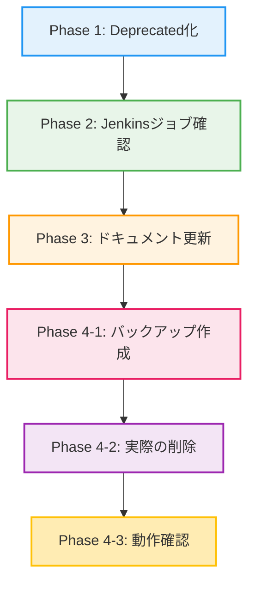

# 詳細設計書 - Issue #411

## ドキュメント情報

- **Issue番号**: #411
- **タイトル**: [TASK] AI Workflow V1 (Python版) の安全な削除計画
- **URL**: https://github.com/tielec/infrastructure-as-code/issues/411
- **作成日**: 2025年
- **対象環境**: infrastructure-as-code リポジトリ

---

## 0. Planning Documentと要件定義書の確認

本詳細設計は、以下のドキュメントに基づいて作成されています：

### Planning Phase成果物
- **Planning Document**: `.ai-workflow/issue-411/00_planning/output/planning.md`
- **実装戦略**: REFACTOR
- **テスト戦略**: INTEGRATION_ONLY
- **複雑度**: 中程度
- **見積もり工数**: 8~12時間

### 要件定義書
- **Requirements Document**: `.ai-workflow/issue-411/01_requirements/output/requirements.md`
- **機能要件**: FR-1～FR-9（9つの機能要件）
- **受け入れ基準**: AC-1～AC-9（Given-When-Then形式）
- **非機能要件**: NFR-1～NFR-5（安全性、信頼性、保守性、完全性、透明性）

---

## 1. アーキテクチャ設計

### 1.1 システム全体像

本タスクは既存の AI Workflow V1 (Python版) を削除し、V2 (TypeScript版) への完全移行を完了させるリファクタリング作業です。

```
┌─────────────────────────────────────────────────────────────┐
│                    削除対象 (V1)                              │
│  scripts/ai-workflow/                                        │
│  ├── main.py                                                 │
│  ├── phases/                                                 │
│  ├── core/                                                   │
│  ├── tests/                                                  │
│  ├── prompts/                                                │
│  └── README.md, ARCHITECTURE.md, etc.                        │
└─────────────────────────────────────────────────────────────┘
                              │
                              │ 削除
                              ▼
┌─────────────────────────────────────────────────────────────┐
│              維持対象 (V2) - 影響なし                          │
│  scripts/ai-workflow-v2/                                     │
│  ├── src/                                                    │
│  ├── dist/                                                   │
│  ├── tests/                                                  │
│  └── README.md, ARCHITECTURE.md, etc.                        │
└─────────────────────────────────────────────────────────────┘
```

### 1.2 コンポーネント間の関係



### 1.3 データフロー

```
┌──────────────────┐
│  V1参照調査      │ → Grep/Glob検索 → 参照リスト作成
│  (Task 1-1)      │
└──────────────────┘
         │
         ▼
┌──────────────────┐
│  DEPRECATED.md   │ → 非推奨警告作成 → README更新
│  作成 (Task 4-1) │
└──────────────────┘
         │
         ▼
┌──────────────────┐
│  ドキュメント    │ → V1参照削除 → リンクチェック
│  更新 (Task 4-3) │
└──────────────────┘
         │
         ▼
┌──────────────────┐
│  Gitブランチ     │ → archive/ai-workflow-v1-python
│  バックアップ    │    ブランチ作成 → リモートプッシュ
│  (Task 4-4)      │
└──────────────────┘
         │
         ▼
┌──────────────────┐
│  git rm -rf      │ → scripts/ai-workflow/ 削除
│  scripts/...     │    → コミット作成
│  (Task 4-4)      │
└──────────────────┘
         │
         ▼
┌──────────────────┐
│  動作確認        │ → Jenkins実行 → V2動作確認
│  (Task 6-2)      │    → リンク切れチェック
└──────────────────┘
```

---

## 2. 実装戦略判断

### 実装戦略: REFACTOR

**判断根拠**:

1. **既存コードの削除が主目的**
   - 新規コードの作成は不要（CREATE不適）
   - 既存コードの機能拡張も不要（EXTEND不適）
   - V1 Python版を削除し、V2 TypeScript版への移行を完了させる構造改善が目的

2. **既存ファイルへの影響範囲**
   - 削除対象: `scripts/ai-workflow/` ディレクトリ全体
   - 修正対象: `jenkins/README.md`（line 547付近のV1への参照削除）
   - 修正対象: その他ドキュメント（V1への参照削除）

3. **リファクタリングの性質**
   - ディレクトリ削除、ドキュメント更新、参照削除が中心作業
   - 既存システムの簡素化とメンテナンス性向上が目標
   - 機能的な変更はなく、V2が既に稼働中

---

## 3. テスト戦略判断

### テスト戦略: INTEGRATION_ONLY

**判断根拠**:

1. **ユニットテスト不要**
   - 削除作業であり、新規ロジックの追加がない
   - テスト対象となるコード実装が存在しない

2. **インテグレーションテスト必須**
   - Jenkins環境での動作確認が必要（V2を使用するジョブの正常動作）
   - ドキュメントのリンク切れチェックが必要
   - CI/CDパイプラインの正常動作確認が必要
   - V2ワークフローの全機能動作確認が必要

3. **BDDテスト不要**
   - エンドユーザー向けの新機能追加ではない
   - ユーザーストーリーが存在しない

**具体的なテスト観点**:
- Jenkinsジョブ `AI_Workflow/ai_workflow_orchestrator` の正常動作確認（V2使用）
- ドキュメント内のリンク切れがないことの確認
- V2での全機能動作確認（V1削除の影響がないこと）
- バックアップからの復元手順の検証

---

## 4. テストコード戦略判断

### テストコード戦略: 該当なし（テストコード不要）

**判断根拠**:

1. **削除作業のため、新規テストコードの作成は不要**
   - 新規ロジックの実装がない
   - 既存のV2テストコードは変更不要

2. **Phase 6（テスト実行）では手動検証とスクリプトによる自動チェックを実施**
   - Jenkins UIでのジョブ実行確認
   - Bashスクリプトによるリンクチェック
   - Git操作によるロールバック手順の検証

---

## 5. 影響範囲分析

### 5.1 既存コードへの影響

#### 削除対象

**ディレクトリ**: `scripts/ai-workflow/` 全体

- Pythonスクリプト群
  - `main.py`
  - `direct_test_runner.py`
  - `test_runner.py`
  - `run_test.sh`
  - `run_evaluation_tests.sh`

- コアモジュール (`core/`)
  - `git_manager.py`
  - `github_client.py`
  - その他のコアモジュール

- フェーズ実装 (`phases/`)
  - `base_phase.py`
  - Phase 1-9の各実装

- テストコード (`tests/`)
  - `conftest.py`
  - `unit/` - ユニットテスト
  - `integration/` - インテグレーションテスト
  - `e2e/` - E2Eテスト
  - `features/` - BDDテスト（Gherkin形式）

- プロンプトファイル (`prompts/`)
  - 各フェーズの実行・レビュー・修正プロンプト

- ドキュメント
  - `README.md`
  - `ARCHITECTURE.md`
  - `ROADMAP.md`
  - `SETUP_PYTHON.md`
  - `TROUBLESHOOTING.md`
  - `DOCKER_AUTH_SETUP.md`

- 設定ファイル
  - `requirements.txt`
  - `pytest.ini`
  - `config.yaml`
  - `Dockerfile`
  - `.dockerignore`
  - `metadata.json.template`

- テンプレート (`templates/`)
  - `pr_body_template.md`
  - `pr_body_detailed_template.md`

#### 更新対象

1. **Jenkinsジョブ関連**
   - `jenkins/jobs/dsl/ai-workflow/ai_workflow_orchestrator.groovy`
     - 現状: V2を使用中（`scripts/ai-workflow-v2/` を参照）
     - **影響**: なし（既にV2に移行済み）

   - `jenkins/jobs/pipeline/ai-workflow/ai-workflow-orchestrator/Jenkinsfile`
     - 現状: V2を使用中（`WORKFLOW_DIR = 'scripts/ai-workflow-v2'`）
     - **影響**: なし（既にV2に移行済み）

   - `jenkins/jobs/pipeline/_seed/job-creator/folder-config.yaml`
     - 確認必要: V1への参照がある場合は削除

2. **ドキュメント関連**
   - `jenkins/README.md`
     - **line 547**: `**詳細ドキュメント**: [scripts/ai-workflow/README.md](../scripts/ai-workflow/README.md)`
     - **対応**: この行を削除、またはV2への参照に変更

   - `CLAUDE.md`
     - 確認必要: V1への言及があれば削除

   - `ARCHITECTURE.md`
     - 確認必要: V1への言及があれば削除

   - その他のREADME、CONTRIBUTION.md等
     - 確認必要: V1への参照があれば削除

### 5.2 依存関係の変更

- **新規依存の追加**: なし
- **既存依存の削除**: Python版AI Workflow関連の依存
  - 実行時依存はなし（V1は既に使用されていない）
  - 開発者ドキュメントの参照のみ

### 5.3 マイグレーション要否

- **データベーススキーマ変更**: なし
- **設定ファイル変更**: なし（V2は既に独立して動作中）
- **データ移行**: なし
- **バックアップ**: Gitブランチとして保存（`archive/ai-workflow-v1-python`）

---

## 6. 変更・追加ファイルリスト

### 6.1 新規作成ファイル

| ファイルパス | 目的 | 作成タイミング |
|--------------|------|----------------|
| `scripts/ai-workflow/DEPRECATED.md` | 非推奨警告の記載 | Phase 1 (Task 4-1) |

**内容**:
```markdown
# 非推奨警告: AI Workflow V1 (Python版)

**このディレクトリは非推奨です。**

## 理由

AI Workflow V2 (TypeScript版) への移行が完了しました。V1 (Python版) は今後サポートされません。

## 移行先

- **V2の場所**: `scripts/ai-workflow-v2/`
- **V2のドキュメント**: [scripts/ai-workflow-v2/README.md](../scripts/ai-workflow-v2/README.md)

## 削除予定日

このディレクトリは **[削除予定日を記載]** に削除される予定です。

## 問い合わせ

質問がある場合は、GitHub Issue #411 を参照してください。
```

### 6.2 修正が必要な既存ファイル

| ファイルパス | 変更内容 | 変更タイミング |
|--------------|----------|----------------|
| `scripts/ai-workflow/README.md` | 先頭に非推奨警告を追加 | Phase 1 (Task 4-1) |
| `jenkins/README.md` | line 547のV1への参照を削除 | Phase 3 (Task 4-3) |
| `CLAUDE.md` | V1への言及があれば削除 | Phase 3 (Task 4-3) |
| `ARCHITECTURE.md` | V1への言及があれば削除 | Phase 3 (Task 4-3) |
| `CONTRIBUTION.md` | V1への言及があれば削除 | Phase 3 (Task 4-3) |
| `README.md` | V1への言及があれば削除 | Phase 3 (Task 4-3) |
| `jenkins/jobs/pipeline/_seed/job-creator/folder-config.yaml` | V1への参照があれば削除 | Phase 2 (Task 4-2) |

#### 6.2.1 `scripts/ai-workflow/README.md` の変更

**追加位置**: ファイルの先頭（1行目）

**追加内容**:
```markdown
> **⚠️ 非推奨警告**
>
> **このディレクトリは非推奨です。AI Workflow V2 (TypeScript版) に移行してください。**
>
> - **V2の場所**: `scripts/ai-workflow-v2/`
> - **V2のドキュメント**: [scripts/ai-workflow-v2/README.md](../scripts/ai-workflow-v2/README.md)
> - **削除予定日**: [削除予定日を記載]
> - **詳細**: [DEPRECATED.md](DEPRECATED.md)
```

#### 6.2.2 `jenkins/README.md` の変更

**削除対象**: line 547

**削除前**:
```markdown
**詳細ドキュメント**: [scripts/ai-workflow/README.md](../scripts/ai-workflow/README.md)
```

**削除後**:
```markdown
(削除)
```

または、V2への参照に変更する場合:
```markdown
**詳細ドキュメント**: [scripts/ai-workflow-v2/README.md](../scripts/ai-workflow-v2/README.md)
```

### 6.3 削除が必要なファイル

| ファイルパス | 削除方法 | 削除タイミング |
|--------------|----------|----------------|
| `scripts/ai-workflow/` （ディレクトリ全体） | `git rm -rf scripts/ai-workflow/` | Phase 4 (Task 4-4) |

---

## 7. 詳細設計

### 7.1 Phase 1: Deprecated化の設計

#### 7.1.1 DEPRECATED.md の作成

**設計方針**:
- ユーザーに V2 への移行を促すための明確な警告
- 削除予定日を明記
- 移行先の情報を提供

**実装手順**:
1. `scripts/ai-workflow/DEPRECATED.md` を新規作成
2. 非推奨理由、V2への移行方法、削除予定日、問い合わせ先を記載

#### 7.1.2 README.md への非推奨警告追加

**設計方針**:
- 視覚的に目立つ警告を表示
- Markdown引用構文（`>`）を使用して強調

**実装手順**:
1. `scripts/ai-workflow/README.md` の先頭に警告ブロックを追加
2. DEPRECATED.md へのリンクを含める

#### 7.1.3 猶予期間の設定

**設計方針**:
- Issue記載の通り、1週間の猶予期間を設定
- 削除予定日を明記

**実装手順**:
1. Deprecated化のコミット作成
2. GitHub Issue #411 にコメントを投稿（猶予期間開始を通知）
3. 1週間後に Phase 2 へ進行

### 7.2 Phase 2: Jenkinsジョブの確認と更新

#### 7.2.1 V1を使用するJenkinsジョブの特定

**設計方針**:
- 既にV2に移行済みであることを確認
- DSLファイル、Jenkinsfile、folder-config.yaml を確認

**実装手順**:
1. `jenkins/jobs/dsl/ai-workflow/ai_workflow_orchestrator.groovy` を確認
   - 結果: V2を使用中（影響なし）
2. `jenkins/jobs/pipeline/ai-workflow/ai-workflow-orchestrator/Jenkinsfile` を確認
   - 結果: V2を使用中（影響なし）
3. `jenkins/jobs/pipeline/_seed/job-creator/folder-config.yaml` を確認
   - V1への参照があれば削除

#### 7.2.2 folder-config.yaml の更新（必要な場合のみ）

**設計方針**:
- V1への参照を削除
- V2への参照は維持

**実装手順**:
1. `folder-config.yaml` を確認
2. V1への参照があれば削除
3. 変更がある場合はコミット作成

### 7.3 Phase 3: ドキュメント更新

#### 7.3.1 V1への参照の検索

**設計方針**:
- Grep/Globを使用して全ドキュメントから参照を検索
- 検索パターン: `scripts/ai-workflow`（`scripts/ai-workflow-v2` を除外）

**実装手順**:
```bash
# 全markdownファイルからV1への参照を検索
grep -rn "scripts/ai-workflow" --include="*.md" . | grep -v "scripts/ai-workflow-v2"
```

#### 7.3.2 ドキュメントの更新

**更新対象**:
1. `jenkins/README.md` (line 547)
2. `CLAUDE.md`（V1への言及があれば）
3. `ARCHITECTURE.md`（V1への言及があれば）
4. `CONTRIBUTION.md`（V1への言及があれば）
5. `README.md`（V1への言及があれば）

**実装手順**:
1. 各ファイルからV1への参照を削除
2. 必要に応じてV2への参照に変更
3. コミット作成: `[docs] update: AI Workflow V1への参照を削除`

#### 7.3.3 リンク切れチェック

**設計方針**:
- ドキュメント内のリンクが有効であることを確認
- 手動チェック、またはリンクチェッカーツールを使用

**実装手順**:
```bash
# Markdown内のリンクを検証（手動）
# または、markdownlint等のツールを使用
```

### 7.4 Phase 4: バックアップと削除

#### 7.4.1 バックアップブランチの作成

**設計方針**:
- Gitブランチとして保存（tar.gzではなく）
- リモートリポジトリにプッシュして永続化

**実装手順**:
```bash
# 1. アーカイブブランチを作成
git checkout -b archive/ai-workflow-v1-python

# 2. リモートにプッシュ
git push origin archive/ai-workflow-v1-python

# 3. mainブランチに戻る
git checkout main
```

#### 7.4.2 V1ディレクトリの削除

**設計方針**:
- `git rm -rf` でディレクトリ全体を削除
- コミットメッセージは規約に従う（CLAUDE.md準拠）
- Co-Authorクレジットは追加しない（CLAUDE.md line 364の規定）

**実装手順**:
```bash
# 1. V1ディレクトリを削除
git rm -rf scripts/ai-workflow/

# 2. コミット作成（日本語、Co-Authorなし）
git commit -m "[scripts] remove: AI Workflow V1 (Python版) を削除

V2 (TypeScript版) への移行完了に伴い、V1を削除しました。

- 削除対象: scripts/ai-workflow/ ディレクトリ全体
- バックアップ: archive/ai-workflow-v1-python ブランチに保存
- 関連Issue: #411"
```

#### 7.4.3 削除後の動作確認

**確認項目**:
1. Jenkinsジョブ `AI_Workflow/ai_workflow_orchestrator` の実行
2. ドキュメントのリンク切れチェック
3. V2ワークフローの簡易テスト
4. CI/CDパイプラインの正常動作確認

**実装手順**:
1. Jenkins UIからジョブを手動実行
2. ログを確認してエラーがないことを確認
3. ドキュメントを目視確認
4. 必要に応じてリンクチェッカーを実行

### 7.5 ロールバック手順の設計

#### 7.5.1 復元コマンド

**設計方針**:
- バックアップブランチから5分以内に復元可能
- 手順を明確に文書化

**実装手順**:
```bash
# 1. バックアップブランチからファイルを復元
git checkout archive/ai-workflow-v1-python -- scripts/ai-workflow/

# 2. 復元をコミット
git commit -m "[rollback] restore: AI Workflow V1 (Python版) を復元"

# 3. リモートにプッシュ
git push origin main
```

#### 7.5.2 ロールバック検証

**設計方針**:
- 削除前にロールバック手順を検証
- ロールバック後にJenkinsが正常に動作することを確認

**実装手順**:
1. テストブランチでロールバック手順を実行
2. Jenkinsジョブの動作確認
3. 問題がなければ本番実行

---

## 8. セキュリティ考慮事項

### 8.1 認証・認可

- **該当なし**: 削除作業には認証・認可の変更は不要

### 8.2 データ保護

- **バックアップブランチの保護**
  - `archive/ai-workflow-v1-python` ブランチを GitHub で保護ブランチに設定することを推奨
  - 誤削除を防止

### 8.3 セキュリティリスクと対策

| リスク | 影響度 | 対策 |
|--------|--------|------|
| 削除の不可逆性 | 高 | バックアップブランチ必須化 |
| ロールバック失敗 | 高 | 事前検証、手順の文書化 |
| 隠れた依存関係 | 中 | Grep/Glob検索による徹底調査 |

---

## 9. 非機能要件への対応

### 9.1 パフォーマンス

- **削除操作のパフォーマンス**: 影響なし（Git操作は高速）
- **ドキュメント検索のパフォーマンス**: Grep/Globは数秒で完了

### 9.2 スケーラビリティ

- **該当なし**: 削除作業はスケーラビリティに影響しない

### 9.3 保守性

- **コードベースの簡素化**: V1削除により、メンテナンス対象が減少
- **ドキュメントの一貫性**: V1への参照削除により、混乱を防止
- **リポジトリの整理**: 不要なコードの削除により、可読性向上

### 9.4 信頼性

- **Jenkins環境の安定性**: V2が既に稼働中のため、削除による影響なし
- **バックアップによる復元可能性**: ロールバック手順により、問題発生時に即座に復元可能

### 9.5 可用性

- **Jenkins環境の可用性**: V2が既に稼働中のため、削除による影響なし
- **ドキュメントの可用性**: 削除後もV2のドキュメントは維持

---

## 10. 実装の順序

### 10.1 推奨実装順序

```
Phase 1: Deprecated化（1週間の猶予期間）
  ├── Task 4-1: DEPRECATED.md作成、README更新
  └── 1週間待機
       │
       ▼
Phase 2: Jenkinsジョブ確認
  └── Task 4-2: folder-config.yaml確認・更新
       │
       ▼
Phase 3: ドキュメント更新
  └── Task 4-3: 全ドキュメントからV1参照削除
       │
       ▼
Phase 4: バックアップと削除
  ├── Task 4-4-1: バックアップブランチ作成
  ├── Task 4-4-2: ディレクトリ削除
  └── Task 4-4-3: 動作確認
       │
       ▼
Phase 6: テスト実行
  ├── Task 6-1: バックアップと復元の検証
  └── Task 6-2: 削除後の動作確認
       │
       ▼
Phase 7: ドキュメント
  └── Task 7-1: 変更履歴の記録
       │
       ▼
Phase 8: レポート
  └── Task 8-1: 削除完了報告
```

### 10.2 依存関係の考慮

1. **Phase 1 → Phase 2**: 猶予期間の経過が必要
2. **Phase 2 → Phase 3**: Jenkinsジョブ確認完了後、ドキュメント更新
3. **Phase 3 → Phase 4**: ドキュメント更新完了後、削除実行
4. **Phase 4 → Phase 6**: 削除完了後、テスト実行
5. **Phase 6 → Phase 7**: テスト完了後、変更履歴記録
6. **Phase 7 → Phase 8**: 変更履歴記録完了後、レポート作成

### 10.3 実装時の注意事項

1. **猶予期間の厳守**
   - Phase 1完了後、必ず1週間の猶予期間を設ける
   - GitHub Issue #411にコメントを投稿して通知

2. **バックアップの必須化**
   - Phase 4-1（バックアップ作成）を Phase 4-2（削除）の前に必ず実行
   - リモートにプッシュして永続化を確認

3. **段階的な実行**
   - 各Phaseを順序通りに実行
   - 前Phaseの完了を確認してから次Phaseへ進行

4. **コミットメッセージの規約遵守**
   - CLAUDE.md の規約に従う
   - Co-Authorクレジットは追加しない（CLAUDE.md line 364）
   - 日本語で記述

---

## 11. 設計の検証

### 11.1 設計の完全性チェック

- [x] 全ての機能要件（FR-1～FR-9）がカバーされている
- [x] 全ての受け入れ基準（AC-1～AC-9）が満たせる設計
- [x] 全ての非機能要件（NFR-1～NFR-5）が考慮されている
- [x] 実装戦略（REFACTOR）に沿った設計
- [x] テスト戦略（INTEGRATION_ONLY）に沿った設計

### 11.2 実装可能性の確認

- [x] 既存ツール（Git、Grep、Glob）のみで実装可能
- [x] 外部ライブラリの追加不要
- [x] 複雑なロジックの実装不要
- [x] 段階的な実装が可能

### 11.3 リスクへの対応

| リスク | 設計での対応 |
|--------|--------------|
| 隠れた依存関係 | Phase 1でGrep検索による徹底調査 |
| ドキュメントのリンク切れ | Phase 3で全ドキュメント確認、Phase 6でリンクチェック |
| Jenkins環境でのトラブル | 既にV2使用中を確認、Phase 6でJenkins動作確認 |
| ロールバックの失敗 | Phase 4-1でバックアップ必須化、Phase 6-1でロールバック検証 |

---

## 12. 品質ゲート（Phase 2）

本設計書は以下の品質ゲートを満たしています：

- [x] **実装戦略の判断根拠が明記されている**: セクション2で REFACTOR を選択した理由を3つ記載
- [x] **テスト戦略の判断根拠が明記されている**: セクション3で INTEGRATION_ONLY を選択した理由を3つ記載
- [x] **テストコード戦略の判断根拠が明記されている**: セクション4で「該当なし」を選択した理由を2つ記載
- [x] **既存コードへの影響範囲が分析されている**: セクション5で削除対象・更新対象・依存関係を詳細に記載
- [x] **変更が必要なファイルがリストアップされている**: セクション6で新規作成・修正・削除の3カテゴリで整理
- [x] **設計が実装可能である**: セクション7で各Phaseの詳細設計を記載、セクション11で実装可能性を確認

---

## 13. 関連ドキュメント

- **Planning Document**: `.ai-workflow/issue-411/00_planning/output/planning.md`
- **Requirements Document**: `.ai-workflow/issue-411/01_requirements/output/requirements.md`
- **GitHub Issue**: https://github.com/tielec/infrastructure-as-code/issues/411
- **プロジェクトガイド**: `CLAUDE.md`, `ARCHITECTURE.md`, `CONTRIBUTION.md`, `README.md`
- **関連Issue**: #369 (AI Workflow V2 マルチリポジトリ対応), #405 (フェーズ依存関係のオプショナル化)

---

## 14. 承認

本設計書は次フェーズ（Phase 3: テストシナリオ）に進むための品質ゲートを満たしています。クリティカルシンキングレビューで承認されれば、テストシナリオ作成フェーズへ進行します。

---

## 15. 変更履歴

| 日付 | バージョン | 変更内容 | 担当 |
|------|-----------|----------|------|
| 2025年 | 1.0 | 初版作成 | AI Workflow Bot |
