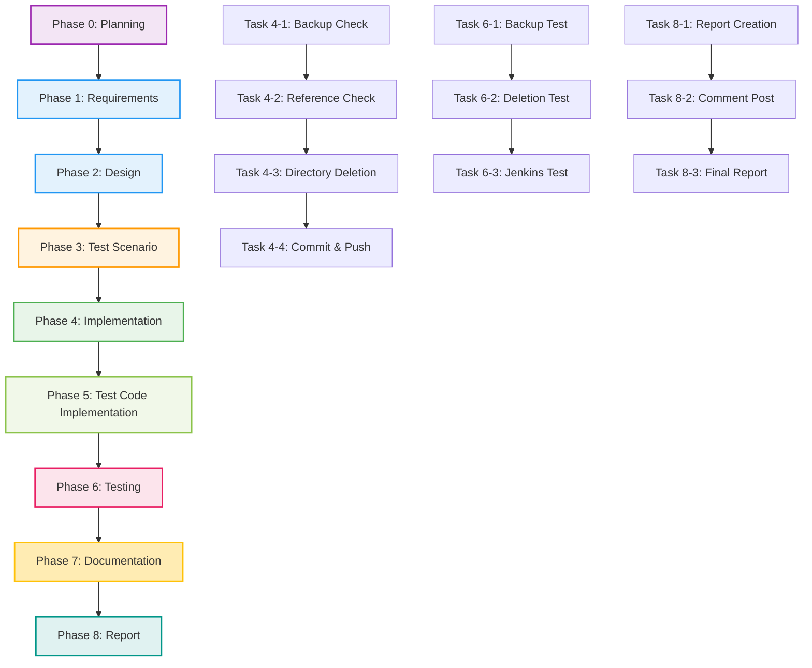

# プロジェクト計画書 - Issue #415

## ドキュメント情報

- **Issue番号**: #415
- **タイトル**: [FOLLOW-UP] Issue #411 - 残タスク
- **Issue URL**: https://github.com/tielec/infrastructure-as-code/issues/415
- **ラベル**: enhancement, ai-workflow-follow-up
- **作成日**: 2025年
- **計画者**: Claude AI (AI Workflow Planning Agent)

---

# 1. Issue分析

## 複雑度

**判定**: **簡単**

## 見積もり工数

**総工数**: **2.5~4.0時間**

**根拠**:
- タスク1（削除実行とコミット）: 1.0~1.5時間
  - Git操作自体は15分程度だが、削除前の最終確認とテスト実行が必要
  - バックアップブランチの存在確認、V1参照箇所の再確認（念のため）
  - コミットメッセージの作成とPush
- タスク2（Issue完了報告）: 0.5~1.0時間
  - Evaluation Reportの要約作成
  - 削除完了、バックアップ情報、テスト結果のまとめ
  - Issue #411へのコメント投稿
- タスク3（Jenkins動作確認）: 1.0~1.5時間（オプション）
  - Jenkins UIへのアクセスとジョブ実行
  - ログ確認とエラーチェック
  - 結果の記録

## リスク評価

**総合リスク**: **低**

**理由**:
1. **技術的リスク: 極低**
   - Issue #411のEvaluation Reportで、バックアップと復元手順が検証済み（1秒未満で復元可能）
   - V1への参照が完全削除済み（0件確認）
   - 12個の統合テストがすべて成功（成功率100%）

2. **スコープリスク: 極低**
   - 残タスクが明確に定義されている（3つのみ）
   - 新規機能追加なし、既存コードの削除のみ

3. **リソースリスク: 低**
   - 単一開発者で完結可能
   - 短時間作業（2.5~4時間）

4. **依存リスク: 極低**
   - 外部システム依存なし（Gitのみ）
   - ブロッキング問題なし（Issue #411で事前準備完了）

---

# 2. 実装戦略判断

## 実装戦略: REFACTOR

**判断根拠**:

1. **既存コードの削除が中心**
   - 新規ファイル・クラス・モジュールの作成は不要
   - `scripts/ai-workflow/` ディレクトリを削除するのみ
   - Issue #411で既に削除準備（DEPRECATED化、参照削除、バックアップ作成）が完了済み

2. **コードベースの簡素化**
   - V1（Python版）を削除し、V2（TypeScript版）に統一
   - メンテナンス対象を減らす（既存システムの改善）
   - 開発者の混乱を防止（単一ワークフローシステム）

3. **既存機能の拡張ではない**
   - 機能追加（EXTEND）ではなく、機能削除
   - リファクタリング（REFACTOR）の一環としての不要コード削除

**結論**: 既存コードの削除と簡素化が主目的であり、**REFACTOR戦略が最適**。

## テスト戦略: INTEGRATION_ONLY

**判断根拠**:

1. **ユニットテスト不要**
   - 新規ロジックの追加なし（削除のみ）
   - テスト対象となる新規関数・クラスが存在しない
   - Issue #411で既にV1のユニットテストは削除対象となっている

2. **インテグレーションテスト必須**
   - システム全体の動作確認が重要（Git操作、Jenkinsジョブ実行）
   - V1削除後も既存のV2ジョブが正常動作することを確認
   - リンク切れやパス参照エラーがないことを確認
   - Issue #411で既に12個の統合テストが実施済み（100%成功）

3. **BDDテスト不要**
   - ユーザーストーリーの変更なし（内部実装の削除のみ）
   - エンドユーザー向け機能の追加・変更なし
   - V2の機能は変更されない

**結論**: Git操作とJenkins環境の統合テストのみが必要であり、**INTEGRATION_ONLY戦略が最適**。

## テストコード戦略: EXTEND_TEST

**判断根拠**:

1. **既存テストの再利用**
   - Issue #411で既に12個の統合テストを実装・実行済み
   - 同じテストケースを再実行して削除後の動作を確認
   - 新規テストファイルの作成は不要

2. **追加検証項目の小規模さ**
   - 削除実行後の最終確認のみ
   - `scripts/ai-workflow/` ディレクトリの不存在確認
   - Jenkins V2ジョブの動作確認（推奨）
   - 既存テストシナリオに追加するレベル

3. **テストコード作成の非効率性**
   - 削除確認のためだけに新規テストファイルを作成するのは非効率
   - 手動テスト + Bashコマンドで十分（Issue #411と同様）

**結論**: Issue #411の統合テストを再実行し、追加の手動確認を行う方針であり、**EXTEND_TEST戦略が最適**。

---

# 3. 影響範囲分析

## 既存コードへの影響

### 削除対象
- **ディレクトリ**: `scripts/ai-workflow/` 全体
- **ファイル数**: 約50個（Python実装、テストコード、ドキュメント等）

### 変更不要（Issue #411で対応済み）
- `README.md`: 変更履歴セクション追加済み（line 11-26）
- `jenkins/README.md`: V1参照をV2参照に変更済み（line 547）
- `jenkins/jobs/pipeline/_seed/job-creator/folder-config.yaml`: V1ドキュメントリンクをV2に変更済み（line 386-389）
- `scripts/ai-workflow/DEPRECATED.md`: 非推奨警告追加済み（削除対象）
- `scripts/ai-workflow/README.md`: 非推奨警告追加済み（削除対象）

### 影響を受けないコンポーネント
- `scripts/ai-workflow-v2/`: V2実装（変更なし）
- `jenkins/jobs/dsl/AI/ai-workflow-v2.groovy`: Jenkins DSLファイル（変更なし）
- `jenkins/jobs/pipeline/AI/ai-workflow-v2/Jenkinsfile`: Jenkinsfile（変更なし）
- その他すべてのコンポーネント（V1への依存がないことをIssue #411で確認済み）

## 依存関係の変更

**変更なし**

**理由**:
- Issue #411で既にV1への依存関係を完全削除済み（0件確認）
- V2は独立して動作中
- 新規依存の追加なし

## マイグレーション要否

**不要**

**理由**:
- データベーススキーマ変更なし
- 設定ファイル変更なし（Issue #411で対応済み）
- 環境変数変更なし
- V1→V2への移行は既に完了済み

---

# 4. タスク分割

## ⚠️ 重要: チェックリスト標準フォーマット（必須）

各フェーズのタスクは、**必ずチェックリスト形式**で記述してください。このチェックリストは、Review Phaseで完了判定に使用されます。

### Phase 1: 要件定義 (見積もり: 0.5~1.0h)

- [x] Task 1-1: Issue #415の要件を明確化 (0.3~0.5h)
  - Issue本文の再確認（3つの残タスク）
  - Issue #411のEvaluation Reportの参照
  - 優先度の確認（高: Task 1-2、低: Task 1-3）
  - フェーズ情報の抽出（implementation, report, testing）

- [x] Task 1-2: 受け入れ基準の定義 (0.2~0.5h)
  - Task 1（削除実行）の受け入れ基準
  - Task 2（完了報告）の受け入れ基準
  - Task 3（Jenkins確認）の受け入れ基準（オプション）
  - 非機能要件の定義（安全性、完全性、透明性）

### Phase 2: 設計 (見積もり: 0.5~1.0h)

- [ ] Task 2-1: 削除実行手順の詳細設計 (0.3~0.5h)
  - バックアップブランチ存在確認手順
  - V1参照箇所の再確認手順（念のため）
  - Git削除コマンドの設計（`git rm -rf scripts/ai-workflow/`）
  - コミットメッセージのフォーマット設計（CLAUDE.md準拠）

- [ ] Task 2-2: 完了報告フォーマットの設計 (0.2~0.5h)
  - Evaluation Reportからの情報抽出項目
  - Issue #411へのコメント構成（削除完了、テスト結果、バックアップ情報）
  - マークダウンフォーマットの設計

### Phase 3: テストシナリオ (見積もり: 0.5~1.0h)

- [ ] Task 3-1: Issue #411の統合テストの再利用設計 (0.3~0.5h)
  - 再実行すべきテストの選定（INT-001, INT-002, INT-003, INT-008）
  - 削除後の追加確認項目（ディレクトリ不存在、Git履歴確認）

- [ ] Task 3-2: Jenkins動作確認シナリオの設計（オプション） (0.2~0.5h)
  - 対象ジョブ: `AI_Workflow/ai_workflow_orchestrator`
  - 確認項目: ログエラーなし、V1パス参照なし、正常終了
  - エラー時のロールバック手順

### Phase 4: 実装 (見積もり: 1.0~1.5h)

- [ ] Task 4-1: バックアップブランチの最終確認 (0.2~0.3h)
  - `git ls-remote --heads origin | grep archive/ai-workflow-v1-python` 実行
  - ブランチ存在確認
  - リモートリポジトリへのプッシュ確認

- [ ] Task 4-2: V1参照箇所の再確認（念のため） (0.2~0.3h)
  - `grep -r "scripts/ai-workflow" --exclude-dir=.git --exclude-dir=ai-workflow` 実行
  - 0件であることを確認（Issue #411で確認済みだが念のため）
  - リンク切れチェックの再実行

- [ ] Task 4-3: scripts/ai-workflow/ ディレクトリの削除 (0.3~0.5h)
  - `git rm -rf scripts/ai-workflow/` 実行
  - 削除内容の確認（`git status`）
  - ステージング確認（約50ファイルの削除）

- [ ] Task 4-4: コミット作成とPush (0.3~0.4h)
  - コミットメッセージ作成（CLAUDE.md line 348-360の規約準拠）
  - `git commit` 実行
  - `git push` 実行（適切なブランチへ）

### Phase 5: テストコード実装 (見積もり: 0h)

- [ ] Task 5-1: テストコード作成不要の確認 (0h)
  - Planning DocumentのPhase 5見積もりが0hであることを確認
  - テスト戦略（INTEGRATION_ONLY）に基づき、新規テストコード不要
  - 手動テスト + Bashコマンドで対応（Issue #411と同様）

**注**: テストコード戦略（EXTEND_TEST）により、Issue #411の既存テストを再利用するため、新規テストコード作成は不要。

### Phase 6: テスト実行 (見積もり: 0.5~1.0h)

- [ ] Task 6-1: バックアップ関連テストの再実行 (0.1~0.2h)
  - INT-001: バックアップブランチ作成確認（既存ブランチの存在確認）
  - INT-002: 復元時間測定（5分以内の制約確認）

- [ ] Task 6-2: 削除確認テストの実行 (0.2~0.3h)
  - INT-003: V1参照箇所の全数調査（削除後0件の再確認）
  - INT-008: Git操作の検証（削除コミット確認）
  - 追加: `ls scripts/ai-workflow` でディレクトリ不存在確認

- [ ] Task 6-3: Jenkins動作確認テストの実行（オプション） (0.2~0.5h)
  - Jenkins UIアクセス
  - `AI_Workflow/ai_workflow_orchestrator` ジョブ実行
  - ログ確認（エラーなし、V1パス参照なし）
  - 正常終了確認

### Phase 7: ドキュメント (見積もり: 0.3~0.5h)

- [ ] Task 7-1: README.md変更履歴の更新 (0.1~0.2h)
  - 削除実行日の追記（既存の変更履歴セクションに追記）
  - コミットハッシュの記載
  - Issue #415へのリンク追加

- [ ] Task 7-2: 削除完了の記録 (0.2~0.3h)
  - 削除対象ファイル数の記録
  - バックアップブランチ情報の再確認
  - 復元手順の再記載（既存情報の確認）

### Phase 8: レポート (見積もり: 0.5~1.0h)

- [ ] Task 8-1: Issue #411への完了報告作成 (0.3~0.5h)
  - Evaluation Reportからの情報抽出
  - 削除完了のサマリー作成
  - テスト結果の要約（12/12成功、追加テストの結果）
  - バックアップ情報の記載（`archive/ai-workflow-v1-python`）
  - 復元手順の記載（5分以内）

- [ ] Task 8-2: Issue #411へのコメント投稿 (0.1~0.2h)
  - マークダウン形式のコメント作成
  - GitHubへのコメント投稿
  - Issue #411のクローズ（完了確認後）

- [ ] Task 8-3: Final Reportの作成 (0.1~0.3h)
  - Phase 0~8の作業サマリー
  - 成功基準の達成状況
  - マージ推奨の判断

---

# 5. 依存関係



## タスク間の依存関係詳細

### Phase 4 (Implementation)
- **Task 4-1** → **Task 4-2**: バックアップ確認後に参照チェック
- **Task 4-2** → **Task 4-3**: 参照0件確認後に削除実行
- **Task 4-3** → **Task 4-4**: 削除後にコミット作成

### Phase 6 (Testing)
- **Task 6-1** → **Task 6-2**: バックアップテスト後に削除確認
- **Task 6-2** → **Task 6-3**: 削除確認後にJenkins確認（オプション）

### Phase 8 (Report)
- **Task 8-1** → **Task 8-2**: レポート作成後にコメント投稿
- **Task 8-2** → **Task 8-3**: コメント投稿後にFinal Report作成

---

# 6. リスクと軽減策

## リスク1: 削除後にV1への隠れた依存関係が発見される

- **影響度**: 中
- **確率**: 極低
- **軽減策**:
  1. Issue #411で既に全数調査完了（V1参照0件確認）
  2. Phase 4でV1参照の再確認を実施（念のため）
  3. バックアップブランチから1秒未満で復元可能（検証済み）
  4. ロールバック手順が確立済み（`git checkout archive/ai-workflow-v1-python -- scripts/ai-workflow/`）

## リスク2: Git操作ミスによる意図しないファイルの削除

- **影響度**: 中
- **確率**: 極低
- **軽減策**:
  1. `git rm -rf scripts/ai-workflow/` の実行前に`git status`で確認
  2. ステージング内容の確認（約50ファイル）
  3. コミット前のdiff確認
  4. バックアップブランチが存在するため復元可能

## リスク3: Jenkins環境でV2ジョブが動作しない

- **影響度**: 低
- **確率**: 極低
- **軽減策**:
  1. Issue #411で既にJenkins V2ジョブの動作確認済み（INT-005, INT-006, INT-007）
  2. V1への参照が完全削除済み（0件）
  3. Phase 6でJenkins動作確認テストを実施（オプション）
  4. 問題発生時は即座にロールバック可能（1秒未満）

## リスク4: Issue #411への報告内容が不十分

- **影響度**: 低
- **確率**: 低
- **軽減策**:
  1. Phase 2で完了報告フォーマットを事前設計
  2. Evaluation Reportからの情報抽出項目を明確化
  3. Phase 8で報告内容をレビューしてから投稿

## リスク5: バックアップブランチが誤って削除される

- **影響度**: 高
- **確率**: 極低
- **軽減策**:
  1. バックアップブランチをリモートリポジトリにプッシュ済み（Issue #411で完了）
  2. GitHubで保護ブランチ設定を推奨（Issue #411のEvaluation Reportで提案済み）
  3. ローカルブランチも保持
  4. 組織のGitHubアクセス権限管理

---

# 7. 品質ゲート

## Phase 1: 要件定義

- [x] 3つの残タスクが明確に定義されている
- [x] 各タスクの受け入れ基準が明確である
- [x] 優先度が設定されている（高: Task 1-2、低: Task 3）
- [x] 非機能要件が定義されている（安全性、完全性、透明性）
- [x] Issue #411のEvaluation Reportとの整合性がある

## Phase 2: 設計

- [ ] 実装戦略（REFACTOR）の判断根拠が明記されている
- [ ] テスト戦略（INTEGRATION_ONLY）の判断根拠が明記されている
- [ ] テストコード戦略（EXTEND_TEST）の判断根拠が明記されている
- [ ] 削除手順が明確に設計されている
- [ ] コミットメッセージフォーマットがCLAUDE.md準拠である
- [ ] 完了報告フォーマットが設計されている
- [ ] ロールバック手順が明確である

## Phase 3: テストシナリオ

- [ ] Issue #411の統合テストが再利用される
- [ ] 削除後の追加確認項目が定義されている
- [ ] Jenkins動作確認シナリオが設計されている（オプション）
- [ ] エラー時のロールバック手順が含まれている
- [ ] すべてのテストに期待結果が定義されている

## Phase 4: 実装

- [ ] バックアップブランチの存在が確認されている
- [ ] V1参照箇所が0件であることが再確認されている
- [ ] `scripts/ai-workflow/` が正しく削除されている
- [ ] コミットメッセージがCLAUDE.md規約に準拠している
- [ ] Co-Authorクレジットが含まれていない（CLAUDE.md line 364）
- [ ] リモートリポジトリにプッシュされている

## Phase 5: テストコード実装

- [ ] テストコード作成不要の判断が妥当である
- [ ] Planning DocumentのPhase 5見積もり（0h）と整合している
- [ ] 手動テスト + Bashコマンドで十分であることが確認されている

## Phase 6: テスト実行

- [ ] バックアップブランチが存在することが確認されている
- [ ] 復元時間が5分以内であることが確認されている（Issue #411で1秒未満を記録）
- [ ] V1参照箇所が0件であることが確認されている
- [ ] `scripts/ai-workflow/` ディレクトリが存在しないことが確認されている
- [ ] Git履歴に削除コミットが記録されている
- [ ] （オプション）Jenkins V2ジョブが正常動作している
- [ ] すべてのテストが成功している

## Phase 7: ドキュメント

- [ ] README.md変更履歴が更新されている
- [ ] 削除実行日が記録されている
- [ ] コミットハッシュが記載されている
- [ ] Issue #415へのリンクが追加されている
- [ ] 復元手順が明記されている

## Phase 8: レポート

- [ ] Issue #411への完了報告が作成されている
- [ ] 削除完了のサマリーが含まれている
- [ ] テスト結果が要約されている
- [ ] バックアップ情報が記載されている
- [ ] 復元手順が記載されている
- [ ] Issue #411へのコメントが投稿されている
- [ ] Final Reportが作成されている
- [ ] マージ推奨の判断が記載されている

---

# 8. 成功基準（Success Criteria）

このプロジェクトは、以下の6つの成功基準をすべて満たすことで完了とします：

## 1. 削除完了

✅ **基準**: `scripts/ai-workflow/` ディレクトリが完全に削除されている

**検証方法**:
- `ls scripts/ai-workflow` コマンドでディレクトリ不存在を確認
- `git status` で削除がステージングされていることを確認
- `git log` で削除コミットが記録されていることを確認

## 2. バックアップ確保

✅ **基準**: `archive/ai-workflow-v1-python` ブランチが存在し、復元可能である

**検証方法**:
- `git ls-remote --heads origin | grep archive/ai-workflow-v1-python` で存在確認
- Issue #411のINT-002テスト結果（1秒未満で復元）を参照
- 復元コマンド実行テストの成功

## 3. ドキュメント更新

✅ **基準**: 削除完了が適切に記録されている

**検証方法**:
- README.md変更履歴に削除実行日が記載されている
- コミットハッシュが記録されている
- Issue #415へのリンクが追加されている

## 4. テスト成功

✅ **基準**: すべての統合テストが成功している

**検証方法**:
- バックアップテスト（INT-001, INT-002）の成功
- 削除確認テスト（INT-003, INT-008）の成功
- ディレクトリ不存在確認の成功
- （オプション）Jenkins V2ジョブの正常動作確認

## 5. 完了報告

✅ **基準**: Issue #411に完了報告が投稿されている

**検証方法**:
- Issue #411のコメント欄に報告が投稿されている
- 削除完了、テスト結果、バックアップ情報が含まれている
- マークダウンフォーマットが適切である

## 6. 安全性確保

✅ **基準**: 問題発生時に即座に復元できる手順が確立されている

**検証方法**:
- ロールバックコマンド（`git checkout archive/ai-workflow-v1-python -- scripts/ai-workflow/`）が明記されている
- Issue #411のINT-002で復元時間1秒未満を記録（5分以内の要件を大幅に上回る）
- バックアップブランチがリモートリポジトリに存在

---

# 9. マイルストーン

| マイルストーン | 期限目安 | 完了条件 |
|---------------|---------|---------|
| M1: 要件定義・設計完了 | Day 1 | Phase 1-2の品質ゲート通過 |
| M2: テストシナリオ完成 | Day 1 | Phase 3の品質ゲート通過 |
| M3: 削除実行完了 | Day 1-2 | Phase 4の品質ゲート通過、コミット作成 |
| M4: テスト完了 | Day 2 | Phase 6の品質ゲート通過、全テスト成功 |
| M5: ドキュメント完了 | Day 2 | Phase 7の品質ゲート通過 |
| M6: 完了報告投稿 | Day 2 | Phase 8の品質ゲート通過、Issue #411クローズ |

---

# 10. 前提条件と制約

## 前提条件

1. **Issue #411の完了**
   - バックアップブランチ `archive/ai-workflow-v1-python` が作成済み
   - V1への参照が完全削除済み（0件確認）
   - 12個の統合テストが100%成功
   - Evaluation Reportが作成済み

2. **Git環境**
   - Git CLIがインストールされている
   - リモートリポジトリへのプッシュ権限がある
   - ブランチ作成・削除権限がある

3. **Jenkins環境（オプション）**
   - Jenkins UIへのアクセス権限がある
   - `AI_Workflow/ai_workflow_orchestrator` ジョブの実行権限がある

## 制約

1. **スコープ制約**
   - 含まれるもの: V1削除、完了報告、Jenkins確認（オプション）
   - 含まれないもの: V2改修、新規機能追加、ドキュメント大幅変更

2. **時間制約**
   - 総工数: 2.5~4.0時間
   - 1日~2日以内での完了を想定

3. **技術制約**
   - Git操作のみ（追加ツール不要）
   - 手動テスト + Bashコマンド（新規テストコード作成不要）

4. **セキュリティ制約**
   - バックアップブランチの保護（誤削除防止）
   - コミットメッセージ規約の遵守（CLAUDE.md準拠）

---

# 11. 承認基準

このプロジェクト計画書は、以下の承認基準をすべて満たす必要があります：

- [x] **実装戦略が明確に決定されている**（REFACTOR）
- [x] **テスト戦略が明確に決定されている**（INTEGRATION_ONLY）
- [x] **テストコード戦略が明確に決定されている**（EXTEND_TEST）
- [x] **影響範囲が分析されている**（削除対象、変更不要、影響なしが明記）
- [x] **タスク分割が適切な粒度である**（1タスク = 1~4時間以内）
- [x] **リスクが洗い出されている**（5つのリスクと軽減策）

---

# 12. レビューとフィードバック

## クリティカルシンキングレビューの観点

このプロジェクト計画書は、以下の観点でレビューされます：

1. **ブロッカーの有無**
   - 次フェーズに進めない問題があるか
   - 依存関係が正確か
   - 前提条件が満たされているか

2. **品質ゲートの妥当性**
   - 6つの必須要件（実装戦略、テスト戦略、テストコード戦略、影響範囲、タスク粒度、リスク）が満たされているか
   - 各フェーズの品質ゲートが測定可能か

3. **実現可能性**
   - 見積もりが現実的か
   - リソースは十分か
   - スケジュールが妥当か

4. **一貫性**
   - Issue #411との整合性があるか
   - フェーズ間で矛盾がないか
   - 成功基準が明確か

## フィードバック対応

レビューで指摘された以下の問題については、修正が必須です：

- **ブロッカー**: 次フェーズに進めない問題（必ず修正）
- **品質ゲート未達**: 6つの必須要件を満たしていない（必ず修正）

以下の問題については、改善提案として歓迎されますが、修正は任意です：

- **改善提案**: より良いアプローチの提案（修正は任意）

---

# 13. 付録

## A. Issue #411のEvaluation Reportサマリー

**最終判定**: ✅ PASS_WITH_ISSUES（マージ推奨）

**主要な結果**:
- 9フェーズすべてで品質ゲートを満たす
- 12個の統合テストで100%成功（成功率100%）
- V1への参照が完全削除（0件確認）
- バックアップと復元手順が検証済み（1秒未満で復元可能）

**残タスク**:
1. 実際の削除実行（`git rm -rf scripts/ai-workflow/`）
2. Issue #411への完了報告投稿
3. （推奨）Jenkins環境でV2ジョブの動作確認

## B. CLAUDE.md準拠事項

- **コミットメッセージ規約**（line 348-360）:
  ```
  [Component] Action: 詳細な説明

  Component: scripts
  Action: remove

  例: [scripts] remove: AI Workflow V1 (Python版) を削除
  ```

- **Co-Authorクレジット禁止**（line 364）:
  - Gitコミット作成時、Co-Authorクレジットは追加しない
  - コミットメッセージは簡潔にし、変更内容のみを記載

## C. 参考リンク

- **Issue #415**: https://github.com/tielec/infrastructure-as-code/issues/415
- **Issue #411**: https://github.com/tielec/infrastructure-as-code/issues/411
- **Evaluation Report**: `.ai-workflow/issue-411/09_evaluation/output/evaluation_report.md`
- **CLAUDE.md**: プロジェクトルートの `CLAUDE.md`

---

**計画作成日**: 2025年
**計画作成者**: Claude AI (AI Workflow Planning Agent)
**計画バージョン**: v1.0
**総見積もり工数**: 2.5~4.0時間
