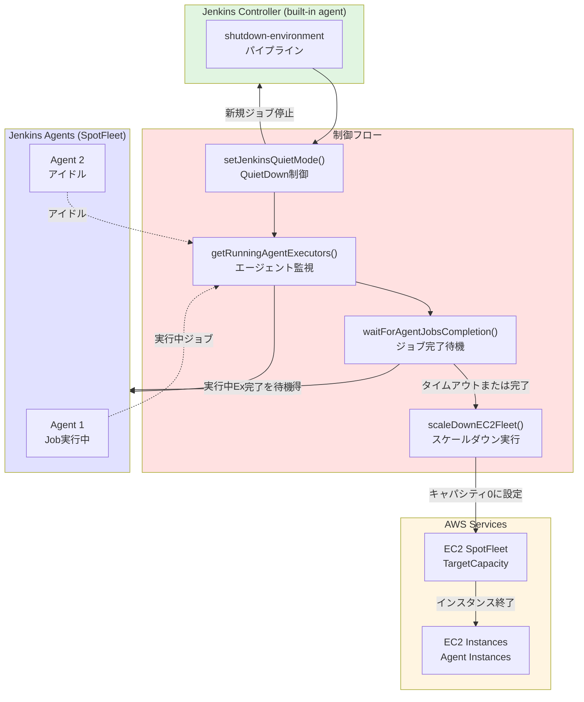
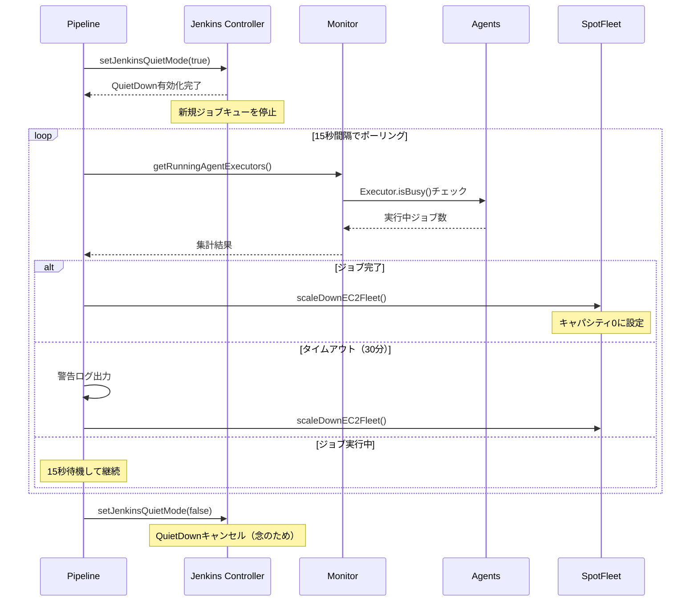
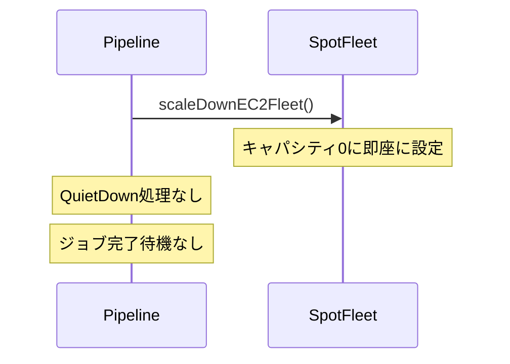
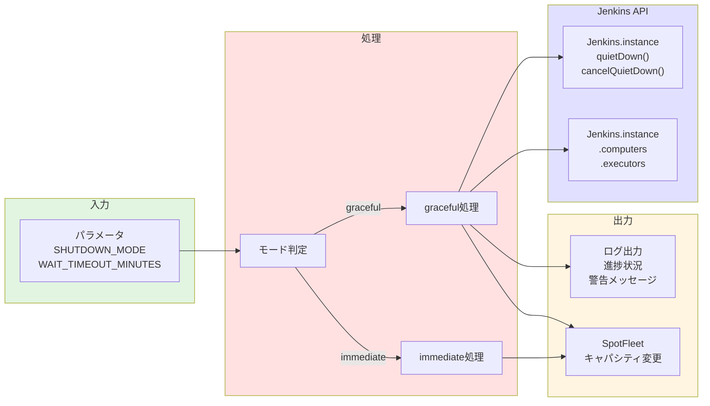
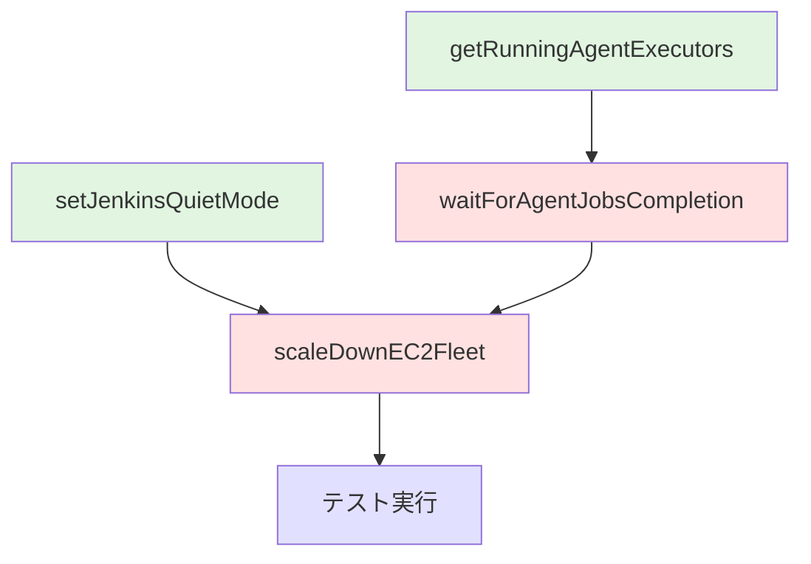

# 詳細設計書 - Issue #423

## 0. Planning Documentの確認

本詳細設計は、Planning Phase（`.ai-workflow/issue-423/00_planning/output/planning.md`）とRequirements Phase（`.ai-workflow/issue-423/01_requirements/output/requirements.md`）で策定された以下の戦略に基づいて実施します：

- **実装戦略**: EXTEND（既存Jenkinsfileの拡張）
- **テスト戦略**: INTEGRATION_ONLY（Jenkins環境での統合テストのみ）
- **テストコード戦略**: CREATE_TEST（テストシナリオドキュメントの作成）
- **複雑度**: 中程度
- **見積もり工数**: 6~8時間

Planning Documentで特定されたリスク（Script Security承認、実行中ジョブへの影響、タイムアウト設定の妥当性）を考慮して詳細設計を行います。

---

## 1. アーキテクチャ設計

### 1.1 システム全体図



### 1.2 コンポーネント間の関係

#### gracefulモードの処理フロー



#### immediateモードの処理フロー（既存）



### 1.3 データフロー



---

## 2. 実装戦略判断

### 実装戦略: EXTEND

**判断根拠**:
1. **既存ファイルの修正**: 既存の`shutdown-environment/Jenkinsfile`を拡張
2. **新規関数の追加**: 以下の3つの新規関数を実装
   - `setJenkinsQuietMode(boolean enable)`
   - `getRunningAgentExecutors()`
   - `waitForAgentJobsCompletion(timeoutMinutes)`
3. **既存関数の修正**: `scaleDownEC2Fleet()`関数のgracefulモード処理を変更
4. **ファイル構造の維持**: 新規ファイル作成は不要、1つのJenkinsfileのみを修正
5. **既存DSLの流用**: Job DSLファイル(`infrastructure_shutdown_environment_job.groovy`)の変更は不要（パラメータ定義が既に存在）

### テスト戦略: INTEGRATION_ONLY

**判断根拠**:
1. **Jenkins環境依存**: Jenkinsfileはユニットテストが困難（Jenkins API、SpotFleet APIへの依存）
2. **実環境テストの必要性**: Jenkins QuietDownやExecutor状態監視は実環境でのみ検証可能
3. **既存テストとの整合性**: 他のJenkinsfileも同様に統合テストのみで検証
4. **テストシナリオの多様性**: 以下のシナリオを網羅
   - エージェントジョブなし → 即座にスケールダウン
   - エージェントジョブ実行中 → quietDown後、ジョブ完了を待機してスケールダウン
   - gracefulモード → タイムアウト前にジョブ完了
   - immediateモード → 既存動作（即座にスケールダウン）

### テストコード戦略: CREATE_TEST

**判断根拠**:
1. **既存テストファイルの不在**: このJenkinsfileに対応するテストファイルは存在しない
2. **手動テスト手順書の作成**: Jenkinsfile自体は自動テストが困難なため、手動テスト手順書を新規作成
3. **テスト結果記録フォーマットの定義**: `.ai-workflow/issue-423/03_test_scenario/`に以下を作成
   - `test_scenarios.md`: テストケース定義
   - `test_execution_log.md`: テスト実行結果記録フォーマット
4. **再現性の確保**: dev環境での再現手順を明記

---

## 3. 影響範囲分析

### 3.1 既存コードへの影響

#### 変更が必要なファイル

1. **jenkins/jobs/pipeline/infrastructure-management/shutdown-environment/Jenkinsfile**
   - **変更内容**:
     - 新規関数3つの追加（`setJenkinsQuietMode`, `getRunningAgentExecutors`, `waitForAgentJobsCompletion`）
     - `scaleDownEC2Fleet()`関数の修正
   - **影響範囲**:
     - 行数増加: 約80-100行（新規関数）
     - 既存関数修正: `scaleDownEC2Fleet()`の内部ロジック変更

#### 影響を受けるコンポーネント

| コンポーネント | 影響内容 | 影響度 |
|--------------|---------|-------|
| **Jenkins Controller** | QuietDownモードによるビルドキュー制御 | 中 |
| **SpotFleet Agents** | 既存のスケールダウン処理（変更なし） | 低 |
| **実行中ジョブ** | gracefulモード時の完了待機 | 中 |
| **built-inエージェント** | パイプライン実行エージェント（変更なし） | なし |

### 3.2 依存関係の変更

#### 新規依存の追加

**なし** - Jenkins標準APIのみを使用

使用するJenkins API:
- `Jenkins.instance.quietDown()` - QuietDownモード有効化
- `Jenkins.instance.cancelQuietDown()` - QuietDownモードキャンセル
- `Jenkins.instance.computers` - 全ノード情報の取得
- `Computer.getExecutors()` - Executor情報の取得
- `Executor.isBusy()` - Executor実行状態の確認

#### 既存依存の変更

**なし**

既存の依存関係:
- AWS CLI v2（SpotFleet操作）
- SSM Parameter Store（リソースID取得）
- IAMロール権限（既存のまま）

### 3.3 マイグレーション要否

**不要**

理由:
- パラメータ定義の変更なし（既存の`SHUTDOWN_MODE`と`WAIT_TIMEOUT_MINUTES`を活用）
- Job DSLファイルの変更なし
- SSMパラメータ構造の変更なし
- AWS IAM権限の変更なし

---

## 4. 変更・追加ファイルリスト

### 4.1 修正が必要な既存ファイル

| ファイルパス | 変更内容 | 理由 |
|------------|---------|------|
| `jenkins/jobs/pipeline/infrastructure-management/shutdown-environment/Jenkinsfile` | 関数追加・修正 | gracefulモードの動作変更 |

### 4.2 新規作成ファイル

| ファイルパス | 内容 | 理由 |
|------------|------|------|
| `.ai-workflow/issue-423/03_test_scenario/test_scenarios.md` | テストケース定義 | 統合テストの手順書 |
| `.ai-workflow/issue-423/03_test_scenario/test_execution_log.md` | テスト実行結果記録 | テスト結果のトレーサビリティ |

### 4.3 削除が必要なファイル

**なし**

---

## 5. 詳細設計

### 5.1 関数設計

#### 5.1.1 setJenkinsQuietMode(boolean enable)

**目的**: Jenkins QuietDownモードの有効化/無効化

**関数シグネチャ**:
```groovy
/**
 * Jenkins QuietDownモードを設定
 *
 * QuietDownモードを有効にすると、新規ジョブのキューが停止され、
 * 既存のジョブのみが完了するまで実行される。
 *
 * @param enable true: QuietDownを有効化、false: QuietDownをキャンセル
 */
def setJenkinsQuietMode(boolean enable)
```

**実装詳細**:
```groovy
def setJenkinsQuietMode(boolean enable) {
    if (params.DRY_RUN) {
        echo "DRY_RUN: Jenkins QuietDownモードを${enable ? '有効化' : 'キャンセル'}します（スキップ）"
        return
    }

    try {
        if (enable) {
            // QuietDownモードを有効化
            Jenkins.instance.doQuietDown()
            echo "✓ Jenkins QuietDownモードを有効化しました"
            echo "  新規ジョブのキューは停止されました"
        } else {
            // QuietDownモードをキャンセル
            Jenkins.instance.doCancelQuietDown()
            echo "✓ Jenkins QuietDownモードをキャンセルしました"
        }
    } catch (Exception e) {
        // エラーハンドリング
        def errorMsg = "Jenkins QuietDownモードの${enable ? '有効化' : 'キャンセル'}に失敗: ${e.message}"
        echo "警告: ${errorMsg}"

        // Script Security承認が必要な場合のヘルプメッセージ
        if (e.message?.contains("RejectedAccessException")) {
            echo """
            |
            |Script Security承認が必要な可能性があります:
            |1. Jenkins管理 > In-process Script Approval を確認
            |2. 以下のメソッドを承認:
            |   - method jenkins.model.Jenkins doQuietDown
            |   - method jenkins.model.Jenkins doCancelQuietDown
            |""".stripMargin()
        }

        // gracefulモードでは処理を継続（エラーにしない）
        echo "処理を続行します"
    }
}
```

**エラーハンドリング**:
- `RejectedAccessException`: Script Security承認が必要な場合、ヘルプメッセージを出力
- その他の例外: ログ出力して処理を続行（エラーでジョブを失敗させない）

**テストケース**:
- TC-QD-01: QuietDown有効化成功
- TC-QD-02: QuietDownキャンセル成功
- TC-QD-03: Script Security承認が必要な場合のエラーハンドリング
- TC-QD-04: DRY_RUNモードでのスキップ

---

#### 5.1.2 getRunningAgentExecutors()

**目的**: SpotFleetエージェント上で実行中のExecutor数を取得

**関数シグネチャ**:
```groovy
/**
 * エージェント上で実行中のExecutor数を取得
 *
 * built-in（Jenkins Controller）を除く全エージェントのExecutorを監視し、
 * 実行中（busy）のExecutor数をカウントする。
 *
 * @return 実行中のExecutor数（整数）
 */
def getRunningAgentExecutors()
```

**実装詳細**:
```groovy
def getRunningAgentExecutors() {
    try {
        def busyExecutors = 0

        // 全コンピュータ（ノード）を取得
        def computers = Jenkins.instance.computers

        computers.each { computer ->
            def nodeName = computer.name

            // built-inエージェント（Controller）を除外
            if (nodeName == "" || nodeName == "built-in") {
                return  // continueと同義
            }

            // オフラインノードをスキップ
            if (computer.isOffline()) {
                return
            }

            // Executorの状態をチェック
            def executors = computer.getExecutors()
            executors.each { executor ->
                if (executor.isBusy()) {
                    busyExecutors++

                    // 実行中のジョブ情報をログ出力
                    def currentExecutable = executor.getCurrentExecutable()
                    if (currentExecutable) {
                        def jobName = currentExecutable.toString()
                        echo "  実行中ジョブ: ${jobName} (ノード: ${nodeName})"
                    }
                }
            }
        }

        return busyExecutors
    } catch (Exception e) {
        echo "エージェントExecutor監視でエラー: ${e.message}"

        // Script Security承認が必要な場合のヘルプメッセージ
        if (e.message?.contains("RejectedAccessException")) {
            echo """
            |
            |Script Security承認が必要な可能性があります:
            |1. Jenkins管理 > In-process Script Approval を確認
            |2. 以下のメソッドを承認:
            |   - staticMethod jenkins.model.Jenkins getInstance
            |   - method jenkins.model.Jenkins getComputers
            |   - method hudson.model.Computer getName
            |   - method hudson.model.Computer isOffline
            |   - method hudson.model.Computer getExecutors
            |   - method hudson.model.Executor isBusy
            |   - method hudson.model.Executor getCurrentExecutable
            |""".stripMargin()
        }

        // エラー時は0を返す（安全側に倒す）
        return 0
    }
}
```

**エラーハンドリング**:
- `RejectedAccessException`: Script Security承認が必要な場合、詳細なヘルプメッセージを出力
- その他の例外: ログ出力して0を返す（安全側に倒してスケールダウンを続行）

**テストケース**:
- TC-EX-01: エージェントジョブなし → 0を返す
- TC-EX-02: エージェントジョブ実行中 → 正確な数を返す
- TC-EX-03: built-inエージェントを除外
- TC-EX-04: オフラインノードをスキップ
- TC-EX-05: Script Security承認が必要な場合のエラーハンドリング

---

#### 5.1.3 waitForAgentJobsCompletion(timeoutMinutes)

**目的**: エージェント上の全ジョブが完了するまで待機

**関数シグネチャ**:
```groovy
/**
 * エージェントジョブの完了を待機
 *
 * 15秒間隔でエージェント実行中ジョブ数をポーリングし、
 * 全ジョブが完了（ゼロ）になるまで待機する。
 * タイムアウトに達した場合は警告ログを出力して処理を続行（エラーにしない）。
 *
 * @param timeoutMinutes タイムアウト時間（分）
 */
def waitForAgentJobsCompletion(timeoutMinutes)
```

**実装詳細**:
```groovy
def waitForAgentJobsCompletion(timeoutMinutes) {
    echo "=== エージェントジョブの完了を待機 ==="
    echo "タイムアウト: ${timeoutMinutes}分"

    def startTime = System.currentTimeMillis()

    try {
        timeout(time: timeoutMinutes, unit: 'MINUTES') {
            waitUntil {
                def runningCount = getRunningAgentExecutors()
                echo "残りのエージェント実行中ジョブ: ${runningCount}"

                if (runningCount == 0) {
                    echo "✓ 全エージェントジョブが完了しました"
                    return true
                }

                // 経過時間を表示
                def elapsedMinutes = (System.currentTimeMillis() - startTime) / 60000
                echo "経過時間: ${elapsedMinutes.round(1)}分"

                // 15秒待機してリトライ
                sleep(time: 15, unit: 'SECONDS')
                return false
            }
        }
    } catch (org.jenkinsci.plugins.workflow.steps.FlowInterruptedException e) {
        // タイムアウト例外のハンドリング
        if (e.message?.contains("Timeout")) {
            echo """
            |
            |警告: エージェントジョブのタイムアウト（${timeoutMinutes}分）に達しました
            |
            |SpotFleetのスケールダウンを続行します。
            |実行中のジョブは強制終了される可能性があります。
            |""".stripMargin()

            // 現在の実行中ジョブ数を最終確認
            def finalCount = getRunningAgentExecutors()
            echo "タイムアウト時の実行中ジョブ数: ${finalCount}"
        } else {
            // その他の中断（ユーザーによる手動中断など）
            echo "警告: ジョブ待機が中断されました: ${e.message}"
        }

        // タイムアウト時でもジョブは成功扱い（エラーにしない）
        echo "処理を続行します"
    } catch (Exception e) {
        echo "エージェントジョブ待機でエラー: ${e.message}"
        echo "処理を続行します"
    }
}
```

**エラーハンドリング**:
- `FlowInterruptedException` (Timeout): 警告ログを出力して処理を続行
- その他の例外: ログ出力して処理を続行

**ポーリング仕様**:
- チェック間隔: 15秒
- タイムアウト: パラメータで指定（デフォルト30分）
- ログ出力: 15秒ごとに進捗状況を出力

**テストケース**:
- TC-WAIT-01: ジョブ完了後、待機が正常に終了
- TC-WAIT-02: タイムアウト時、警告ログが出力されジョブは成功
- TC-WAIT-03: 経過時間が定期的にログ出力される
- TC-WAIT-04: ユーザー手動中断時のハンドリング

---

#### 5.1.4 scaleDownEC2Fleet()（既存関数の修正）

**目的**: SpotFleetをスケールダウン（gracefulモード時の処理フロー変更）

**変更前の処理フロー（問題のある実装）**:
1. SpotFleetキャパシティを0に設定
2. インスタンス終了を待機（`waitForSpotFleetTermination`）
3. タイムアウト時にエラー

**変更後の処理フロー（gracefulモード）**:
1. **QuietDown設定**: `setJenkinsQuietMode(true)`を呼び出し
2. **エージェントジョブ完了待機**: `waitForAgentJobsCompletion()`を呼び出し
3. **SpotFleetスケールダウン**: キャパシティを0に設定
4. **インスタンス終了待機**: 既存の`waitForSpotFleetTermination()`を実行
5. **QuietDownキャンセル**: `setJenkinsQuietMode(false)`を呼び出し（念のため）

**変更後の処理フロー（immediateモード）**:
- 既存の動作を維持（即座にキャパシティ0、インスタンス終了待機）

**実装詳細**:
```groovy
def scaleDownEC2Fleet() {
    if (!env.SPOTFLEET_REQUEST_ID || params.DRY_RUN) {
        return
    }

    echo "=== EC2 Fleet (SpotFleet) のスケールダウン ==="

    try {
        def currentCapacity = getSpotFleetCapacity(env.SPOTFLEET_REQUEST_ID)
        echo "現在のキャパシティ: ${currentCapacity}"

        if (currentCapacity != "0") {
            // gracefulモードの場合
            if (params.SHUTDOWN_MODE == 'graceful') {
                echo "--- Gracefulモードでスケールダウン ---"

                // ステップ1: QuietDown設定
                echo "ステップ1: Jenkins QuietDownモードを有効化"
                setJenkinsQuietMode(true)

                // ステップ2: エージェントジョブ完了待機
                echo "ステップ2: エージェントジョブの完了を待機"
                waitForAgentJobsCompletion(params.WAIT_TIMEOUT_MINUTES.toInteger())

                // ステップ3: SpotFleetスケールダウン
                echo "ステップ3: SpotFleetのキャパシティを0に設定"
                scaleDownSpotFleet(env.SPOTFLEET_REQUEST_ID)

                // ステップ4: インスタンス終了待機
                echo "ステップ4: インスタンスの終了を待機"
                waitForSpotFleetTermination(env.SPOTFLEET_REQUEST_ID, params.WAIT_TIMEOUT_MINUTES.toInteger())

                // ステップ5: QuietDownキャンセル（念のため）
                echo "ステップ5: Jenkins QuietDownモードをキャンセル"
                setJenkinsQuietMode(false)

            } else {
                // immediateモードの場合（既存の動作）
                echo "--- Immediateモードでスケールダウン ---"
                scaleDownSpotFleet(env.SPOTFLEET_REQUEST_ID)

                // インスタンス終了待機はスキップ
                echo "Immediateモードのため、インスタンス終了待機をスキップします"
            }
        } else {
            echo "SpotFleetのキャパシティは既に0です"
        }
    } catch (Exception e) {
        echo "SpotFleetのスケールダウンでエラー: ${e.message}"

        // gracefulモードでのエラーの場合、QuietDownをキャンセル（念のため）
        if (params.SHUTDOWN_MODE == 'graceful') {
            echo "エラー発生のため、QuietDownモードをキャンセルします"
            setJenkinsQuietMode(false)
        }

        // immediateモードではエラーを再スロー（既存の動作）
        if (params.SHUTDOWN_MODE == 'immediate') {
            error("SpotFleetのスケールダウンに失敗しました")
        } else {
            // gracefulモードでは警告ログを出力して続行
            echo "警告: SpotFleetのスケールダウンでエラーが発生しましたが、処理を続行します"
        }
    }
}
```

**エラーハンドリング**:
- gracefulモード: エラー時にQuietDownをキャンセルし、警告ログを出力して処理を続行
- immediateモード: エラー時にジョブを失敗させる（既存の動作）

**テストケース**:
- TC-SCALE-01: gracefulモードで5ステップが順番に実行される
- TC-SCALE-02: immediateモードで既存の動作が維持される
- TC-SCALE-03: gracefulモードでエラー時にQuietDownがキャンセルされる
- TC-SCALE-04: キャパシティが既に0の場合、処理がスキップされる

---

### 5.2 データ構造設計

#### 5.2.1 パラメータ定義（既存・変更なし）

| パラメータ名 | 型 | デフォルト値 | 説明 |
|------------|---|------------|------|
| `ENVIRONMENT` | choice | dev | 対象環境（dev/staging/prod） |
| `AWS_REGION` | choice | ap-northeast-1 | AWSリージョン |
| `CONFIRM_SHUTDOWN` | boolean | false | 環境停止の確認 |
| `SHUTDOWN_MODE` | choice | graceful | 停止モード（graceful/immediate） |
| `WAIT_TIMEOUT_MINUTES` | string | 30 | 待機タイムアウト（分） |
| `DRY_RUN` | boolean | false | ドライラン |

#### 5.2.2 内部データ構造

**Jenkins API返却データ**:
```groovy
// Jenkins.instance.computers の構造
[
    Computer {
        name: "built-in",
        offline: false,
        executors: [
            Executor {
                busy: true,
                currentExecutable: WorkflowRun
            }
        ]
    },
    Computer {
        name: "agent-i-0123456789abcdef",
        offline: false,
        executors: [
            Executor {
                busy: false,
                currentExecutable: null
            }
        ]
    }
]
```

**SpotFleet API返却データ（既存）**:
```json
{
  "SpotFleetRequestConfigs": [
    {
      "SpotFleetRequestConfig": {
        "TargetCapacity": 2
      }
    }
  ]
}
```

### 5.3 インターフェース設計

#### 5.3.1 Jenkins API インターフェース

| メソッド | 戻り値 | 説明 |
|---------|-------|------|
| `Jenkins.instance.doQuietDown()` | void | QuietDownモード有効化 |
| `Jenkins.instance.doCancelQuietDown()` | void | QuietDownモードキャンセル |
| `Jenkins.instance.computers` | List<Computer> | 全ノード情報の取得 |
| `Computer.getName()` | String | ノード名 |
| `Computer.isOffline()` | boolean | オフライン状態 |
| `Computer.getExecutors()` | List<Executor> | Executor一覧 |
| `Executor.isBusy()` | boolean | Executor実行状態 |
| `Executor.getCurrentExecutable()` | Run | 実行中のジョブ |

#### 5.3.2 AWS CLI インターフェース（既存・変更なし）

| コマンド | 出力 | 説明 |
|---------|------|------|
| `aws ec2 describe-spot-fleet-requests` | JSON | SpotFleet設定の取得 |
| `aws ec2 modify-spot-fleet-request` | JSON | SpotFleetキャパシティの変更 |
| `aws ec2 describe-spot-fleet-instances` | JSON | SpotFleetインスタンス一覧 |

---

## 6. セキュリティ考慮事項

### 6.1 Script Security承認

**リスク**: Jenkins.instanceの使用にはScript Approvalが必要な可能性

**対策**:
1. **事前承認の準備**: テスト環境で必要な承認項目を特定
2. **エラーメッセージの充実**: Script Security承認が必要な場合、具体的な手順をログ出力
3. **ドキュメント化**: テスト手順書に承認方法を記載

**承認が必要なメソッド**:
```
staticMethod jenkins.model.Jenkins getInstance
method jenkins.model.Jenkins doQuietDown
method jenkins.model.Jenkins doCancelQuietDown
method jenkins.model.Jenkins getComputers
method hudson.model.Computer getName
method hudson.model.Computer isOffline
method hudson.model.Computer getExecutors
method hudson.model.Executor isBusy
method hudson.model.Executor getCurrentExecutable
```

### 6.2 権限管理

**実行権限**:
- built-inエージェントでの実行（既存）
- IAMロール: EC2、SSM操作権限（既存のまま）

**影響範囲の制限**:
- QuietDownはJenkins Controller全体に影響
- 実行前に`CONFIRM_SHUTDOWN`パラメータで確認を必須化

### 6.3 認証・認可

**変更なし**:
- 既存のJenkinsジョブ実行権限に従う
- `CONFIRM_SHUTDOWN`パラメータでの二重確認

---

## 7. 非機能要件への対応

### 7.1 パフォーマンス

#### 7.1.1 ポーリング間隔

| 監視対象 | ポーリング間隔 | タイムアウト |
|---------|--------------|------------|
| エージェントExecutor | 15秒 | 30分（デフォルト） |
| SpotFleetインスタンス | 15秒 | 30分（デフォルト） |

**設計根拠**:
- 15秒間隔: Jenkins APIへの負荷を考慮（過度なポーリングを避ける）
- 30分タイムアウト: 長時間ジョブにも対応

#### 7.1.2 リソース使用量

| リソース | 使用量 | 影響 |
|---------|-------|------|
| CPU | 低（15秒ごとのAPI呼び出し） | 無視できるレベル |
| メモリ | 低（状態保持なし） | 無視できるレベル |
| ネットワーク | 低（Jenkins内部API） | 無視できるレベル |

### 7.2 スケーラビリティ

**エージェント数の制限**:
- 想定最大エージェント数: 10台
- `getRunningAgentExecutors()`のループ処理: O(n)（nはエージェント数）
- 10台程度であれば性能問題なし

**将来的な拡張**:
- エージェント数が増加した場合、並列処理の検討が必要

### 7.3 保守性

#### 7.3.1 コードの可読性

**命名規則**:
- 関数名: 動詞+名詞の明確な命名（例: `setJenkinsQuietMode`, `getRunningAgentExecutors`）
- 変数名: 意味が明確な名前（例: `busyExecutors`, `runningCount`）

**コメント**:
- 各関数にJavaDoc形式のコメントを追加
- 複雑なロジックには行コメントを追加

#### 7.3.2 エラーハンドリングの統一

**統一方針**:
- `try-catch`で例外をキャッチ
- gracefulモード: 警告ログを出力して処理を続行
- immediateモード: エラーでジョブを失敗（既存の動作）

**ログレベル**:
- 正常処理: `echo "✓ ..."`
- 警告: `echo "警告: ..."`
- エラー: `echo "エラー: ..." + error()`

---

## 8. 実装の順序

### 8.1 推奨実装順序

#### Phase 1: 新規関数の実装（優先度: 高）

```
1. setJenkinsQuietMode(boolean enable)
   - 最もシンプル
   - 他の関数への依存なし

2. getRunningAgentExecutors()
   - 独立した機能
   - waitForAgentJobsCompletion()から呼び出される

3. waitForAgentJobsCompletion(timeoutMinutes)
   - getRunningAgentExecutors()を使用
   - scaleDownEC2Fleet()から呼び出される
```

#### Phase 2: 既存関数の修正（優先度: 高）

```
4. scaleDownEC2Fleet()
   - 新規関数を統合
   - gracefulモードの処理フローを変更
```

#### Phase 3: テスト（優先度: 高）

```
5. dev環境でのテスト実行
   - 全テストケース実行
   - 不具合修正とリテスト
```

### 8.2 依存関係グラフ



**実装上の注意**:
- Phase 1の3つの関数は並行して実装可能
- Phase 2は Phase 1 完了後に着手
- Phase 3は Phase 2 完了後に着手

### 8.3 実装チェックリスト

#### Phase 1完了チェック

- [ ] `setJenkinsQuietMode()` 実装完了
- [ ] `getRunningAgentExecutors()` 実装完了
- [ ] `waitForAgentJobsCompletion()` 実装完了
- [ ] 各関数にJavaDocコメント追加
- [ ] エラーハンドリング実装

#### Phase 2完了チェック

- [ ] `scaleDownEC2Fleet()` gracefulモード処理追加
- [ ] 既存のimmediateモード動作を維持
- [ ] エラー時のQuietDownキャンセル実装

#### Phase 3完了チェック

- [ ] テストシナリオドキュメント作成
- [ ] dev環境で全テストケース実行
- [ ] テスト結果記録
- [ ] 不具合修正とリテスト

---

## 9. テスト計画

### 9.1 テストスコープ

**テスト対象**:
- 新規関数3つ（`setJenkinsQuietMode`, `getRunningAgentExecutors`, `waitForAgentJobsCompletion`）
- 修正関数1つ（`scaleDownEC2Fleet`）

**テスト環境**:
- dev環境のJenkins Controller
- dev環境のSpotFleet Agents

**テスト種別**:
- 統合テスト（手動実行）

### 9.2 テストケース概要

#### カテゴリ1: QuietDownモード制御（FR-001）

| TC ID | テストケース | 期待結果 |
|-------|------------|---------|
| TC-QD-01 | QuietDown有効化 | Jenkins UIに"Prepare for shutdown"表示 |
| TC-QD-02 | QuietDownキャンセル | 新規ジョブキューが受付可能 |
| TC-QD-03 | Script Security承認エラー | ヘルプメッセージ表示、処理続行 |
| TC-QD-04 | DRY_RUNモード | スキップログ出力 |

#### カテゴリ2: エージェント監視（FR-002）

| TC ID | テストケース | 期待結果 |
|-------|------------|---------|
| TC-EX-01 | エージェントジョブなし | 0を返す |
| TC-EX-02 | エージェントジョブ実行中 | 正確な数を返す |
| TC-EX-03 | built-in除外 | built-inが監視対象外 |
| TC-EX-04 | オフラインノードスキップ | オフラインノードを無視 |
| TC-EX-05 | Script Security承認エラー | ヘルプメッセージ表示、0を返す |

#### カテゴリ3: ジョブ完了待機（FR-003）

| TC ID | テストケース | 期待結果 |
|-------|------------|---------|
| TC-WAIT-01 | ジョブ完了後の正常終了 | 待機が正常終了 |
| TC-WAIT-02 | タイムアウト時のハンドリング | 警告ログ、ジョブ成功 |
| TC-WAIT-03 | 経過時間ログ | 15秒ごとに進捗表示 |
| TC-WAIT-04 | ユーザー手動中断 | 中断ログ、処理続行 |

#### カテゴリ4: スケールダウンフロー（FR-004）

| TC ID | テストケース | 期待結果 |
|-------|------------|---------|
| TC-SCALE-01 | gracefulモードの5ステップ実行 | 全ステップが順番に実行 |
| TC-SCALE-02 | immediateモードの既存動作 | 即座にスケールダウン |
| TC-SCALE-03 | gracefulモードのエラー時QuietDownキャンセル | QuietDownがキャンセルされる |
| TC-SCALE-04 | キャパシティ0の場合のスキップ | 処理がスキップされる |

#### カテゴリ5: エラーハンドリング（FR-005）

| TC ID | テストケース | 期待結果 |
|-------|------------|---------|
| TC-ERR-01 | タイムアウト時のジョブ成功 | SUCCESSステータス |
| TC-ERR-02 | Jenkins API失敗時のログ | エラーログ出力 |
| TC-ERR-03 | Script Security承認時のヘルプ | 承認方法の表示 |

### 9.3 テスト実行計画

#### 前提条件

1. dev環境のJenkins Controllerが起動中
2. SpotFleet Agentsが稼働中（キャパシティ1以上）
3. テスト用のダミージョブを準備（長時間実行可能）

#### テスト手順書の構成

`.ai-workflow/issue-423/03_test_scenario/test_scenarios.md`:
- 前提条件
- テストケース定義（TC-QD-01〜TC-ERR-03）
- 実行手順（パラメータ設定、実行ボタン）
- 期待結果（ログ出力、エージェント状態）

`.ai-workflow/issue-423/03_test_scenario/test_execution_log.md`:
- テスト実行日時
- 実行者
- テストケースごとの結果（Pass/Fail）
- エビデンス（ログスクリーンショット）
- 不具合記録

---

## 10. リスク管理

### 10.1 技術的リスク

#### リスク1: Script Security承認が必要

- **影響度**: 中
- **確率**: 高
- **軽減策**:
  - 事前に管理者権限でScript Consoleでテスト
  - 承認が必要な場合は手順書に記載
  - エラーメッセージに承認方法を明記
- **対応時間**: 10分程度

#### リスク2: 実行中ジョブへの影響

- **影響度**: 高
- **確率**: 低
- **軽減策**:
  - dev環境で十分なテスト
  - DRY_RUNモードでの動作確認を徹底
  - 本番環境での実行前に他ユーザーへの告知
- **対応時間**: なし（予防策のみ）

#### リスク3: タイムアウト設定の妥当性

- **影響度**: 中
- **確率**: 中
- **軽減策**:
  - デフォルト30分は妥当か検証
  - 長時間ジョブが存在する場合の考慮
  - パラメータで調整可能（既存の`WAIT_TIMEOUT_MINUTES`）
- **対応時間**: パラメータ調整のみ（即座）

#### リスク4: Jenkins Controller停止時の自己参照問題

- **影響度**: 高
- **確率**: 低
- **軽減策**:
  - built-inエージェントで実行（既存仕様）
  - Controller停止前にquietDownをキャンセル（念のため）
  - 非同期停止処理（既存実装を維持）
- **対応時間**: なし（設計で対応済み）

### 10.2 運用リスク

#### リスク5: ユーザー操作ミス

- **影響度**: 中
- **確率**: 中
- **軽減策**:
  - `CONFIRM_SHUTDOWN`パラメータで確認を必須化
  - ログメッセージを充実（進捗状況を明確に）
  - DRY_RUNモードでの事前確認を推奨
- **対応時間**: なし（予防策のみ）

---

## 11. 品質ゲート

### 11.1 設計品質ゲート

- [x] **実装戦略の判断根拠が明記されている**: セクション2で記載
- [x] **テスト戦略の判断根拠が明記されている**: セクション2で記載
- [x] **既存コードへの影響範囲が分析されている**: セクション3で記載
- [x] **変更が必要なファイルがリストアップされている**: セクション4で記載
- [x] **設計が実装可能である**: セクション5で詳細設計を記載

### 11.2 実装完了条件

- [ ] 全新規関数が実装され、JavaDocコメントが追加されている
- [ ] 既存関数の修正が完了し、既存動作が維持されている
- [ ] エラーハンドリングが全関数で実装されている
- [ ] ログ出力が適切に実装されている

### 11.3 テスト完了条件

- [ ] テストシナリオドキュメントが作成されている
- [ ] dev環境で全テストケース（TC-QD-01〜TC-ERR-03）がPassしている
- [ ] テスト結果が記録されている
- [ ] 不具合が修正されている

---

## 12. 補足情報

### 12.1 関連ドキュメント

- [Planning Document](../../00_planning/output/planning.md)
- [Requirements Document](../../01_requirements/output/requirements.md)
- [Jenkins CONTRIBUTION.md](/tmp/ai-workflow-repos-3/infrastructure-as-code/jenkins/CONTRIBUTION.md)
- [CLAUDE.md](/tmp/ai-workflow-repos-3/infrastructure-as-code/CLAUDE.md)

### 12.2 参考資料

- [Jenkins公式ドキュメント - Prepare for Shutdown](https://www.jenkins.io/doc/book/managing/prepare-for-shutdown/)
- [AWS EC2 SpotFleet Documentation](https://docs.aws.amazon.com/AWSEC2/latest/UserGuide/spot-fleet.html)
- [Jenkins Script Security Plugin](https://www.jenkins.io/doc/book/managing/script-approval/)

### 12.3 用語集

| 用語 | 定義 |
|------|------|
| **QuietDown** | Jenkinsの機能。新規ジョブの受付を停止し、既存ジョブの完了を待つモード |
| **SpotFleet** | AWS EC2のスポットインスタンスを管理する機能 |
| **built-inエージェント** | Jenkins Controller自身の実行環境 |
| **gracefulモード** | 段階的なシャットダウンモード（ジョブ完了を待つ） |
| **immediateモード** | 即座のシャットダウンモード（ジョブを待たない） |
| **Executor** | Jenkinsでジョブを実行する単位（スレッド） |

---

**作成日**: 2025年1月
**作成者**: AI Workflow Phase 2 (Design)
**レビュー状態**: レビュー待ち
