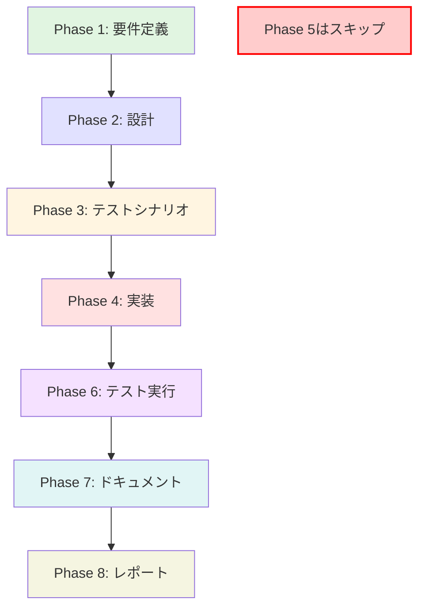

# プロジェクト計画書: Issue #431

## プロジェクト概要

**Issue番号**: #431
**タイトル**: [TASK] ドラフトPRに対するpull_request_comment_builderの実行を抑止
**URL**: https://github.com/tielec/infrastructure-as-code/issues/431

**要約**:
現在、ドラフト状態のPRに対しても `pull_request_comment_builder` ジョブが実行され、不要なOpenAI API呼び出しが発生しています。ドラフトPRの場合は処理を実行しないように修正します。

---

## 1. Issue分析

### 複雑度
**判定**: 簡単

**理由**:
- 単一の機能追加（ドラフトPR判定とスキップ処理）
- 修正対象は1ファイル（DSLファイルまたはJenkinsfile）
- 既存の類似実装が参考資料として存在（`code_quality_reflection_cloud_api_multibranch_job.groovy`）
- 新規モジュールやアーキテクチャ変更は不要

### 見積もり工数
**合計**: 3~4時間

**内訳**:
- Phase 1 (要件定義): 0.5h
- Phase 2 (設計): 0.5h
- Phase 3 (テストシナリオ): 0.5h
- Phase 4 (実装): 1~1.5h
- Phase 5 (テストコード実装): スキップ（Jenkins DSL/Groovyのユニットテストは非推奨）
- Phase 6 (テスト実行): 0.5h
- Phase 7 (ドキュメント): 0.5h
- Phase 8 (レポート): 0.5h

### リスク評価
**総合評価**: 低

**理由**:
- 既存処理への影響が限定的（追加条件のみ）
- Generic Webhook Triggerの設定変更は破壊的でない
- MultiBranchジョブでの実装例が存在（`gitHubIgnoreDraftPullRequestFilter()`）
- ロールバックが容易（DSL変更後、シードジョブ再実行）

---

## 2. 実装戦略判断

### 実装戦略: EXTEND

**判断根拠**:
- **新規ファイル作成なし**: 既存のDSLファイル（`docx_generator_pull_request_comment_builder_github_trigger_job.groovy`）に条件を追加
- **既存機能の拡張**: Generic Webhook Triggerに「ドラフトPRをフィルタリング」という条件を追加
- **アーキテクチャ変更なし**: 現在の「TriggerジョブがWebhookを受信 → 下流ジョブを起動」という構造を維持

### テスト戦略: INTEGRATION_ONLY

**判断根拠**:
- **ユニットテストは不要**: Jenkins DSL/Groovyコードは、Jenkins環境への依存が強く、ユニットテストのコストが高い（JCasC、Jenkins Test Harnessが必要）
- **インテグレーションテストが最適**: 実際のJenkins環境でシードジョブを実行し、生成されたジョブが正しく動作するか確認
- **BDDは過剰**: ユーザーストーリーが単純（「ドラフトPRをスキップする」のみ）で、BDDフレームワークを導入するメリットが少ない

**テスト方法**:
1. シードジョブでDSL変更を反映
2. ドラフトPRを作成してWebhookをトリガー
3. ジョブが起動しないことを確認（ビルド履歴に記録なし）
4. ドラフトを解除して再度Webhookをトリガー
5. ジョブが正常に起動することを確認

### テストコード戦略: EXTEND_TEST

**判断根拠**:
- **テストコード実装はスキップ**: Jenkins DSL/Groovyの自動テストは、本プロジェクトでは未導入（テストフレームワークやハーネスの設定が必要）
- **手動インテグレーションテストで十分**: 変更が小規模で、影響範囲が限定的
- **将来の拡張性**: テストフレームワークを導入する場合は、別Issueで対応（この修正のためにテスト基盤を構築するのは過剰投資）

**Phase 5はスキップ**として扱いますが、Phase 6で手動テストは実施します。

---

## 3. 影響範囲分析

### 既存コードへの影響

**変更が必要なファイル**:
1. `jenkins/jobs/dsl/docs-generator/docx_generator_pull_request_comment_builder_github_trigger_job.groovy`
   - Generic Webhook Triggerのvariable追加（`PR_DRAFT`）
   - 条件付きビルドステップで下流ジョブ呼び出しをラップ

**影響を受ける可能性のあるファイル**:
- **なし**: Jenkinsfileや下流ジョブは変更不要（Triggerジョブでフィルタリング）

### 依存関係の変更
**なし**

**理由**:
- プラグインの追加不要（Generic Webhook Trigger、Conditional BuildStep Pluginは既存）
- 外部ライブラリやスクリプトの変更なし

### マイグレーション要否
**不要**

**理由**:
- データベーススキーマ変更なし
- 設定ファイルの構造変更なし（YAMLの`job-config.yaml`は変更不要）
- 既存ジョブの再作成は不要（シードジョブ実行でDSLを再適用するだけ）

---

## 4. タスク分割

### Phase 1: 要件定義 (見積もり: 0.5h)

- [x] Task 1-1: ドラフトPR判定仕様の確認 (0.2h)
  - GitHub Webhook Payloadの`pull_request.draft`フィールドの仕様確認
  - 既存実装（MultiBranchジョブの`gitHubIgnoreDraftPullRequestFilter()`）の調査
- [x] Task 1-2: 受け入れ基準の定義 (0.3h)
  - ドラフトPRのWebhook受信時にビルドが起動しないこと
  - ドラフト解除後のWebhook受信時に正常にビルドが起動すること
  - 既存の非ドラフトPRの動作に影響がないこと

### Phase 2: 設計 (見積もり: 0.5h)

- [x] Task 2-1: 実装方針の決定 (0.2h)
  - Triggerジョブでの判定 vs Jenkinsfileでの判定を比較
  - Triggerジョブでの実装を選択（早期スキップでリソース節約）
- [x] Task 2-2: DSL変更内容の設計 (0.3h)
  - `genericVariable`の追加仕様（`PR_DRAFT`変数）
  - `conditionalSteps`の実装パターン（`stringsMatch`条件）
  - エラーハンドリング（ドラフト時のログ出力）

### Phase 3: テストシナリオ (見積もり: 0.5h)

- [x] Task 3-1: テストケースの作成 (0.3h)
  - TC1: ドラフトPR作成時にジョブが起動しないこと
  - TC2: ドラフト解除後にジョブが起動すること
  - TC3: 非ドラフトPRの通常動作が影響を受けないこと
- [x] Task 3-2: テスト環境の準備手順確認 (0.2h)
  - dev環境のJenkins接続確認
  - テスト用リポジトリの確認（`infrastructure-as-code`または専用テストリポジトリ）
  - Webhook設定の確認

### Phase 4: 実装 (見積もり: 1~1.5h)

- [x] Task 4-1: Generic Webhook Trigger変数の追加 (0.3h)
  - `PR_DRAFT`変数を`genericVariables`に追加
  - JSONPath: `$.pull_request.draft`
- [x] Task 4-2: 条件付きビルドステップの実装 (0.5~0.8h)
  - `conditionalSteps`ブロックで`downstreamParameterized`をラップ
  - 条件: `stringsMatch('$PR_DRAFT', 'false', false)`
  - ログ出力: ドラフトPR時のスキップメッセージ
- [x] Task 4-3: ビルド履歴への影響確認 (0.2~0.4h)
  - スキップ時のビルドステータス（`NOT_BUILT`または`SUCCESS`）の確認
  - Generic Webhook Triggerのログ出力（`causeString`の調整）

### Phase 5: テストコード実装 (見積もり: 0h)

**スキップ**: Jenkins DSL/Groovyの自動テストは未導入のため、手動インテグレーションテストで対応

### Phase 6: テスト実行 (見積もり: 0.5h)

- [ ] Task 6-1: シードジョブでのDSL適用 (0.1h)
  - `Admin_Jobs/job-creator`を実行してDSL変更を反映
  - ジョブ定義の更新確認（Jenkins UI）
  - **ステータス**: 未実施（テスト実施ガイドのみ作成済み）
- [ ] Task 6-2: ドラフトPRでのテスト (0.2h)
  - テストリポジトリでドラフトPRを作成
  - Webhookが送信されることを確認（GitHub Webhookログ）
  - Jenkinsジョブが起動しないことを確認（ビルド履歴）
  - **ステータス**: 未実施（テスト実施ガイドのみ作成済み）
- [ ] Task 6-3: ドラフト解除後のテスト (0.2h)
  - ドラフトを解除（Ready for review）
  - Webhookが送信されることを確認
  - Jenkinsジョブが正常に起動することを確認
  - **ステータス**: 未実施（テスト実施ガイドのみ作成済み）

### Phase 7: ドキュメント (見積もり: 0.5h)

- [ ] Task 7-1: CONTRIBUTION.mdの更新確認 (0.2h)
  - `jenkins/CONTRIBUTION.md`にドラフトPRフィルタリングのパターン追加が必要か確認
  - 必要に応じて「よくあるパターン集」セクションに追記
- [ ] Task 7-2: DSLファイルのコメント更新 (0.2h)
  - ヘッダーコメントに「ドラフトPRはスキップ」を明記
  - `conditionalSteps`の説明コメント追加
- [ ] Task 7-3: README.mdの更新確認 (0.1h)
  - `jenkins/README.md`の更新は不要（ユーザー向け機能変更ではない）

### Phase 8: レポート (見積もり: 0.5h)

- [ ] Task 8-1: 実装サマリーの作成 (0.2h)
  - 変更内容の要約
  - テスト結果のスクリーンショット（ビルド履歴、Webhookログ）
- [ ] Task 8-2: PR作成とレビュー依頼 (0.3h)
  - コミットメッセージ作成（規約に従う）
  - PRテンプレートの記入
  - レビュアーへの説明

---

## 5. 依存関係

### タスク間の依存関係図



### クリティカルパス
Phase 1 → Phase 2 → Phase 3 → Phase 4 → Phase 6 → Phase 7 → Phase 8

**Phase 5はスキップ**（テストコード実装は不要）

---

## 6. リスクと軽減策

### リスク1: Generic Webhook Triggerの`conditionalSteps`が動作しない
- **影響度**: 中
- **確率**: 低
- **軽減策**:
  - 事前調査: Job DSL APIドキュメントで`conditionalSteps`の互換性確認
  - 代替策: `regexpFilterExpression`で`opened|reopened`かつ`draft != true`のロジックを検討（ただし、正規表現のみでは複雑）
  - ロールバック: Jenkinsfileでの判定に切り替え（Phase 2で検討済み）

### リスク2: GitHub Webhookが`pull_request.draft`フィールドを送信しない
- **影響度**: 高
- **確率**: 極低
- **軽減策**:
  - 事前確認: GitHub Webhook Payloadドキュメントで仕様確認（公式ドキュメントに記載あり）
  - テスト: Phase 6でWebhookペイロードをログ出力して`draft`フィールドの存在確認
  - 代替策: GitHub APIで手動確認（Jenkinsfileで`gitUtils.getPullRequest`を使用）

### リスク3: 既存の非ドラフトPRの動作に影響
- **影響度**: 中
- **確率**: 低
- **軽減策**:
  - 条件の厳密性: `stringsMatch('$PR_DRAFT', 'false', false)`で完全一致のみ許可
  - テスト: Phase 6で既存PRの動作確認（TC3）
  - ロールバック: シードジョブで旧DSLを再適用（Gitリポジトリに履歴あり）

### リスク4: スコープクリープ（複数リポジトリへの展開）
- **影響度**: 低
- **確率**: 中
- **軽減策**:
  - スコープ明確化: Issue #431は`pull_request_comment_builder`のみが対象
  - ドキュメント化: CONTRIBUTION.mdにパターンを記載し、他ジョブへの展開は別Issueで対応
  - レビュー時の確認: PRレビューで「対象ジョブ」を明記

---

## 7. 品質ゲート

### Phase 1: 要件定義
- [ ] 受け入れ基準が明確に定義されている（3つの条件）
- [ ] GitHub Webhook Payloadの`pull_request.draft`フィールド仕様が確認されている
- [ ] 既存の類似実装（MultiBranchジョブ）の調査が完了している

### Phase 2: 設計
- [x] 実装戦略（Triggerジョブ vs Jenkinsfile）の判断根拠が明記されている
- [x] DSL変更内容（`genericVariable`と`conditionalSteps`）が具体的に設計されている
- [x] エラーハンドリング（ドラフト時のログ出力）が考慮されている

### Phase 3: テストシナリオ
- [x] 3つのテストケース（TC1~TC3）が定義されている
- [x] テスト環境の準備手順が明確である
- [x] テストデータ（ドラフトPR、非ドラフトPR）の作成方法が確認されている

### Phase 4: 実装
- [ ] Generic Webhook Trigger変数（`PR_DRAFT`）が正しく追加されている
- [ ] 条件付きビルドステップが正しく実装されている（`stringsMatch`条件）
- [ ] コードコメントが適切に記載されている

### Phase 5: テストコード実装
**スキップ** - 手動インテグレーションテストで対応

### Phase 6: テスト実行
- [ ] シードジョブでDSL変更が正常に反映されている
- [ ] TC1: ドラフトPRでジョブが起動しないことが確認されている
- [ ] TC2: ドラフト解除後にジョブが起動することが確認されている
- [ ] TC3: 非ドラフトPRの動作が影響を受けていないことが確認されている

### Phase 7: ドキュメント
- [ ] DSLファイルのコメントが更新されている
- [ ] CONTRIBUTION.mdへの追記要否が判断されている
- [ ] README.mdの更新が不要であることが確認されている

### Phase 8: レポート
- [ ] 実装サマリーが作成されている（変更内容、テスト結果）
- [ ] PRが作成され、レビュー依頼が完了している
- [ ] スクリーンショットが添付されている（ビルド履歴、Webhookログ）

---

## 8. 補足情報

### 参考資料
1. **GitHub Webhook Payload仕様**:
   https://docs.github.com/en/webhooks/webhook-events-and-payloads#pull_request
   - `pull_request.draft`: PRがドラフト状態かどうか（boolean）

2. **類似実装**:
   `jenkins/jobs/dsl/code-quality-checker/code_quality_reflection_cloud_api_multibranch_job.groovy`
   - MultiBranchジョブでの`gitHubIgnoreDraftPullRequestFilter()`の使用例

3. **Job DSL Plugin - Conditional BuildStep**:
   https://github.com/jenkinsci/job-dsl-plugin/wiki/Conditional-BuildStep-Plugin
   - `conditionalSteps`の構文とサンプル

### 実装サンプル（設計時の参考）

```groovy
// Generic Webhook Trigger変数の追加
genericVariable {
    key('PR_DRAFT')
    value('$.pull_request.draft')
    expressionType('JSONPath')
    regexpFilter('')
}

// 条件付きビルドステップ
steps {
    conditionalSteps {
        condition {
            stringsMatch('$PR_DRAFT', 'false', false)
        }
        steps {
            downstreamParameterized {
                trigger(downstreamJobName) {
                    // 既存の設定
                }
            }
        }
    }
}
```

### 関連Issue
- なし（このIssueは単独で完結）

### 承認事項
- Phase 5（テストコード実装）のスキップ承認（理由: Jenkins DSL自動テストの未導入、手動テストで十分）

---

## 9. タイムライン

| フェーズ | 見積もり時間 | 累積時間 |
|----------|--------------|----------|
| Phase 1: 要件定義 | 0.5h | 0.5h |
| Phase 2: 設計 | 0.5h | 1h |
| Phase 3: テストシナリオ | 0.5h | 1.5h |
| Phase 4: 実装 | 1~1.5h | 2.5~3h |
| Phase 5: テストコード実装 | 0h (スキップ) | 2.5~3h |
| Phase 6: テスト実行 | 0.5h | 3~3.5h |
| Phase 7: ドキュメント | 0.5h | 3.5~4h |
| Phase 8: レポート | 0.5h | 4~4.5h |
| **合計** | **4~4.5h** | - |

**推奨作業配分**:
- Day 1: Phase 1~3（設計まで完了、1.5h）
- Day 2: Phase 4~6（実装とテスト、2~2.5h）
- Day 3: Phase 7~8（ドキュメントとレポート、1h）

---

## 10. 成功基準

### 機能面
- [ ] ドラフトPRのWebhook受信時に`pull_request_comment_builder`ジョブが起動しない
- [ ] ドラフト解除後のWebhook受信時にジョブが正常に起動する
- [ ] 既存の非ドラフトPRの動作に影響がない

### 品質面
- [ ] すべての品質ゲート（Phase 1~8）が合格している
- [ ] テストケース（TC1~TC3）がすべて成功している
- [ ] コードレビューで指摘事項がゼロまたは解決済み

### ドキュメント面
- [ ] DSLファイルのコメントが更新されている
- [ ] CONTRIBUTION.mdへの追記が完了している（必要な場合）
- [ ] PRに実装サマリーとスクリーンショットが添付されている

---

**計画書作成日**: 2025-01-XX
**作成者**: Claude (AI Assistant)
**レビューステータス**: 未レビュー
**承認ステータス**: 未承認
