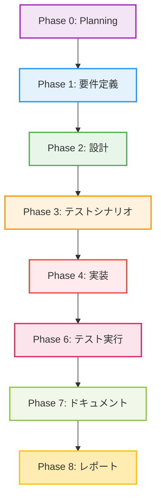

# プロジェクト計画書 - Issue #431

## Issue概要

- **Issue番号**: #431
- **タイトル**: [TASK] ドラフトPRに対するpull_request_comment_builderの実行を抑止
- **状態**: open
- **URL**: https://github.com/tielec/infrastructure-as-code/issues/431

## 1. Issue分析

### 複雑度: 簡単

**判定根拠**:
- 修正対象は2ファイルのみ（Trigger JobのDSLファイルとJenkinsfile）
- 新規機能追加ではなく、既存機能の拡張（ドラフトPRフィルタリング）
- パラメータ追加とステージ追加という定型的なパターン
- GitHub Webhook Payload構造は既知（`pull_request.draft`フィールド）
- 追加プラグイン不要、既存のGeneric Webhook Triggerプラグインで実現可能

### 見積もり工数: 2~4時間

**内訳**:
- DSLファイル修正: 30分（パラメータ1つ追加）
- Jenkinsfile修正: 1時間（ステージ1つ追加、ロジック実装）
- シードジョブ実行とテスト: 1~2時間（ドラフトPR作成、動作確認、回帰テスト）
- ドキュメント更新: 30分（CONTRIBUTION.mdに追記）

**根拠**:
- パラメータ追加はGeneric Webhook Triggerの標準的な使い方
- Jenkinsfileのステージ追加もDeclarative Pipeline内でシンプルに実装可能
- テストは実際のドラフトPR作成が必要だが、リポジトリアクセスは既にあり追加準備不要

### リスク評価: 低

**根拠**:
- 既存機能への影響が限定的（追加のみ、既存ロジック変更なし）
- ドラフトPRの場合は早期終了するため、副作用が少ない
- 非ドラフトPRの動作は変更されないため、回帰リスクが低い
- Generic Webhook Triggerプラグインは成熟しており、`pull_request.draft`フィールドは標準的なGitHub Webhook Payload

## 2. 実装戦略判断

### 実装戦略: EXTEND

**判断根拠**:
- 既存のTrigger JobとJenkinsfileを拡張する形で実装
- 新規ファイル作成は不要（既存の2ファイルのみ修正）
- 既存のGeneric Webhook Trigger設定にパラメータ1つ追加
- Jenkinsfileに新規ステージ1つ追加し、ドラフトチェックロジックを実装
- アーキテクチャ変更なし、既存のパイプラインフローに条件分岐を追加するのみ

### テスト戦略: INTEGRATION_ONLY

**判断根拠**:
- ユニットテスト不要な理由:
  - Groovyスクリプト（DSL、Jenkinsfile）はJenkinsランタイムに依存
  - 追加するロジックは単純な条件判定のみ（`if (isDraft == 'true')`）
  - 単体で切り出してテストする価値が低い
- インテグレーションテストが適切な理由:
  - GitHub Webhookからのペイロード取得とパラメータ伝播を確認する必要がある
  - Jenkinsジョブ全体の動作（Webhook受信→Trigger Job→下流ジョブ）をテストすべき
  - 実際のドラフトPR作成とWebhook送信によるEnd-to-Endテストが有効
- BDDテスト不要な理由:
  - エンドユーザー向け機能ではなく、内部的な最適化（コスト削減）
  - ユーザーストーリーというよりは技術的な改善

### テストコード戦略: EXTEND_TEST（手動）

**判断根拠**:
- CREATE_TESTではない理由:
  - Jenkins Pipeline/DSLの自動テストコードは存在しない（プロジェクトポリシー）
  - テストはJenkins環境での手動実行が標準
- EXTEND_TESTの意味:
  - 既存のテストプロセスを拡張（ドラフトPRケースを追加）
  - テストシナリオドキュメント（Phase 3）に記載
  - 手動テストケースを追加し、Phase 6で実行
- BOTH_TESTではない理由:
  - 新規テストファイル作成は不要

## 3. 影響範囲分析

### 既存コードへの影響

| ファイル | 変更内容 | 影響度 | 理由 |
|---------|---------|--------|------|
| `jenkins/jobs/dsl/docs-generator/docx_generator_pull_request_comment_builder_github_trigger_job.groovy` | パラメータ1つ追加 | 低 | 既存パラメータ取得ロジックに追記のみ、既存機能は無変更 |
| `jenkins/jobs/pipeline/docs-generator/pull-request-comment-builder/Jenkinsfile` | ステージ1つ追加 | 低 | 最初のステージとして追加、既存ステージは無変更 |

**既存ロジックへの影響なし**:
- Trigger Jobの下流ジョブ呼び出しロジックは変更なし
- Jenkinsfileの既存ステージ（パラメータ検証、環境準備、PR情報取得等）は一切変更なし
- 非ドラフトPRの動作は完全に従来通り

### 依存関係の変更

**新規依存の追加**: なし
- 既存のGeneric Webhook Triggerプラグインのみ使用
- GitHub Webhook Payloadの標準フィールド（`pull_request.draft`）のみ参照

**既存依存の変更**: なし

### マイグレーション要否

**マイグレーション不要**:
- データベーススキーマ変更なし
- 設定ファイル変更なし（job-config.yamlも不要）
- シードジョブ実行のみで反映可能

## 4. タスク分割

### Phase 1: 要件定義 (見積もり: 0.5h)

- [ ] Task 1-1: 機能要件の明確化 (0.25h)
  - ドラフトPRの判定条件を定義（`pull_request.draft == true`）
  - スキップ時の動作を定義（ビルドステータス: NOT_BUILT、説明文設定）
  - 非ドラフトPRの動作が変わらないことを確認
- [ ] Task 1-2: 受け入れ基準の策定 (0.25h)
  - ドラフトPRでジョブがスキップされること
  - 非ドラフトPRで従来通り実行されること
  - ビルド履歴にスキップ理由が記録されること

### Phase 2: 設計 (見積もり: 1h)

- [x] Task 2-1: Trigger Job設計 (0.5h)
  - Generic Webhook Trigger変数リストに`PR_DRAFT`追加
  - 下流ジョブパラメータリストに`PR_DRAFT`追加
  - JSONPathによるペイロード取得方法の確認（`$.pull_request.draft`）
- [x] Task 2-2: Jenkinsfile設計 (0.5h)
  - 「ドラフトPRチェック」ステージの詳細設計
  - ドラフト判定ロジック（`params.PR_DRAFT`または`env.PR_DRAFT`）
  - スキップ時のビルドステータス設定（`currentBuild.result = 'NOT_BUILT'`）
  - ログ出力とビルド説明文の設計

### Phase 3: テストシナリオ (見積もり: 0.5h)

- [ ] Task 3-1: インテグレーションテストシナリオ作成 (0.5h)
  - テストケース1: ドラフトPR作成時のスキップ確認
  - テストケース2: ドラフト解除時の実行確認
  - テストケース3: 非ドラフトPRの回帰テスト

### Phase 4: 実装 (見積もり: 1.5h)

- [ ] Task 4-1: Trigger JobのDSL修正 (0.5h)
  - `genericVariables`セクションに`PR_DRAFT`変数追加
  - JSONPath設定: `$.pull_request.draft`
  - `predefinedProps`に`PR_DRAFT`パラメータ追加
- [ ] Task 4-2: Jenkinsfileのステージ追加 (1h)
  - 「ドラフトPRチェック」ステージを最初のステージとして追加
  - ドラフト判定ロジック実装
  - スキップ時のビルドステータス設定
  - ログ出力とビルド説明文の設定

### Phase 5: テストコード実装 (見積もり: 0h)

- [ ] Task 5-1: テストコード実装なし (0h)
  - Jenkinsパイプラインは手動テストのみ（プロジェクトポリシー）
  - Phase 6で手動テストケースを実行

### Phase 6: テスト実行 (見積もり: 1~2h)

- [ ] Task 6-1: シードジョブ実行 (0.25h)
  - Admin_Jobs/job-creatorを実行してDSL変更を反映
  - ジョブ定義が正しく更新されたことを確認
- [ ] Task 6-2: テストケース1実行 (0.5h)
  - ドラフトPRを作成
  - Webhookが正しく送信されることを確認
  - Trigger Jobが`PR_DRAFT=true`を受信することを確認
  - Jenkinsfileでスキップされることを確認
  - ビルドステータスが`NOT_BUILT`であることを確認
- [ ] Task 6-3: テストケース2実行 (0.5h)
  - ドラフトを解除（Ready for review）
  - Webhookが正しく送信されることを確認
  - Trigger Jobが`PR_DRAFT=false`を受信することを確認
  - Jenkinsfileが全ステージを実行することを確認
  - OpenAI API呼び出しとコメント投稿が成功することを確認
- [ ] Task 6-4: テストケース3実行（回帰テスト） (0.5h)
  - 新規に非ドラフトPRを作成
  - 既存の動作と同じであることを確認
  - OpenAI API呼び出しとコメント投稿が成功することを確認

### Phase 7: ドキュメント (見積もり: 0.5h)

- [ ] Task 7-1: CONTRIBUTION.md更新 (0.5h)
  - ドラフトPRフィルタリングパターンをベストプラクティスとして追加
  - Generic Webhook Triggerでの条件判定例として記載
  - Jenkinsfileでの早期終了パターンとして記載

### Phase 8: レポート (見積もり: 0.5h)

- [ ] Task 8-1: 実装レポート作成 (0.5h)
  - 変更内容のサマリー
  - テスト結果のまとめ
  - コスト削減効果の見積もり（ドラフトPR時のOpenAI API呼び出し削減）

## 5. 依存関係

**注記**: Phase 5（テストコード実装）はスキップ（0h）のため、依存関係図から除外

## 6. リスクと軽減策

### リスク1: GitHub Webhook Payloadの`draft`フィールドが送信されない

- **影響度**: 中
- **確率**: 低
- **軽減策**:
  - GitHub公式ドキュメントで`pull_request.draft`フィールドの存在を確認済み（Pull Request Webhook Payload）
  - Phase 6のテストで実際のWebhook Payloadを確認
  - フィールドが欠落した場合でもデフォルトで`'false'`として扱われるため、非ドラフトとして処理される（安全側に倒れる）

### リスク2: Trigger JobとJenkinsfile間のパラメータ伝播失敗

- **影響度**: 中
- **確率**: 低
- **軽減策**:
  - 既存の`PR_NUMBER`、`REPO_URL`パラメータと同じパターンを使用（実績あり）
  - Phase 6のテスト実行時にパラメータ伝播を明示的に確認
  - Jenkinsビルドログに`PR_DRAFT`の値を出力して検証

### リスク3: ドラフトPRの判定ロジックのバグ

- **影響度**: 低
- **確率**: 低
- **軽減策**:
  - シンプルな文字列比較（`isDraft == 'true'`）のみで実装
  - Phase 6で3つのテストケースを実施（ドラフト、ドラフト解除、非ドラフト）
  - ドラフト判定が失敗した場合でも、既存の処理が実行されるだけで致命的な問題にはならない

### リスク4: 回帰リスク（非ドラフトPRの動作変更）

- **影響度**: 高
- **確率**: 極めて低
- **軽減策**:
  - 既存ステージに一切変更を加えない（追加のみ）
  - ドラフトチェックステージは最初に配置し、非ドラフトの場合は即座に通過
  - Phase 6のテストケース3で非ドラフトPRの回帰テストを実施

## 7. 品質ゲート

### Phase 1: 要件定義

- [ ] 機能要件が明確に記載されている
  - ドラフトPRの判定条件が定義されている
  - スキップ時の動作が定義されている
- [ ] 受け入れ基準が定義されている
  - テストケースごとの期待結果が明確

### Phase 2: 設計

- [ ] 実装戦略の判断根拠が明記されている（EXTEND）
- [ ] テスト戦略の判断根拠が明記されている（INTEGRATION_ONLY）
- [ ] テストコード戦略の判断根拠が明記されている（EXTEND_TEST/手動）
- [ ] Trigger JobとJenkinsfileの設計が詳細化されている
- [ ] パラメータ伝播の仕組みが明確

### Phase 3: テストシナリオ

- [ ] 3つのテストケースが定義されている
  - ドラフトPR作成時のスキップ
  - ドラフト解除時の実行
  - 非ドラフトPRの回帰テスト
- [ ] 各テストケースの検証項目が明確

### Phase 4: 実装

- [ ] Trigger JobのDSL修正が完了している
  - `genericVariables`に`PR_DRAFT`追加
  - `predefinedProps`に`PR_DRAFT`追加
- [ ] Jenkinsfileのステージ追加が完了している
  - 「ドラフトPRチェック」ステージが最初のステージとして追加
  - ドラフト判定ロジックが実装されている
  - ビルドステータス設定とログ出力が実装されている
- [ ] コードレビューが完了している（セルフレビュー）

### Phase 6: テスト実行

- [ ] シードジョブが正常に完了している
- [ ] テストケース1が成功している（ドラフトPRスキップ）
- [ ] テストケース2が成功している（ドラフト解除後実行）
- [ ] テストケース3が成功している（非ドラフトPR回帰テスト）
- [ ] すべてのテスト結果が文書化されている

### Phase 7: ドキュメント

- [ ] CONTRIBUTION.mdが更新されている
- [ ] ドラフトPRフィルタリングパターンが記載されている
- [ ] 変更内容が明確に説明されている

### Phase 8: レポート

- [ ] 実装レポートが作成されている
- [ ] テスト結果がまとめられている
- [ ] コスト削減効果が見積もられている

## 8. 総合品質ゲート（Phase 0必須要件）

- [x] **実装戦略が明確に決定されている**（EXTEND）
  - 判断根拠: 既存のTrigger JobとJenkinsfileを拡張、新規ファイル作成不要
- [x] **テスト戦略が明確に決定されている**（INTEGRATION_ONLY）
  - 判断根拠: GitHub Webhookからジョブ実行までのEnd-to-Endテストが必要、ユニットテスト・BDDテストは不要
- [x] **テストコード戦略が明確に決定されている**（EXTEND_TEST/手動）
  - 判断根拠: Jenkins Pipelineは手動テストが標準、既存テストプロセスにドラフトPRケースを追加
- [x] **影響範囲が分析されている**
  - 修正対象: 2ファイルのみ、既存ロジックへの影響なし
- [x] **タスク分割が適切な粒度である**（1タスク = 1~4時間）
  - 最小タスク: 0.25h（シードジョブ実行）、最大タスク: 1h（Jenkinsfile実装）
- [x] **リスクが洗い出されている**
  - 4つのリスクを特定し、すべてに軽減策を策定

## 9. 期待される効果

### コスト削減

- ドラフトPRでのOpenAI API呼び出しが不要になる
- ドラフトPR作成時のジョブ実行時間削減（約3~5分/回）

### 運用改善

- ビルド履歴でドラフトPRのスキップ理由が明確になる
- ドラフトPRでの不要なノイズ（コメント、API呼び出し）が削減される

### 拡張性

- 他の類似ジョブにも同じパターンを適用可能
- Generic Webhook Triggerでの条件判定のベストプラクティスとして活用可能

## 10. 参考情報

- **GitHub Webhook Payload**: https://docs.github.com/en/webhooks/webhook-events-and-payloads#pull_request
  - `pull_request.draft`: PRがドラフト状態かどうか（boolean）
- **Generic Webhook Triggerプラグイン**: https://plugins.jenkins.io/generic-webhook-trigger/
- **Jenkins Declarative Pipeline**: https://www.jenkins.io/doc/book/pipeline/syntax/
- **プロジェクトドキュメント**:
  - [jenkins/CONTRIBUTION.md](jenkins/CONTRIBUTION.md): Jenkinsジョブ開発規約
  - [jenkins/README.md](jenkins/README.md): Jenkinsジョブ使用方法
  - [CLAUDE.md](CLAUDE.md): プロジェクト全体のガイドライン
