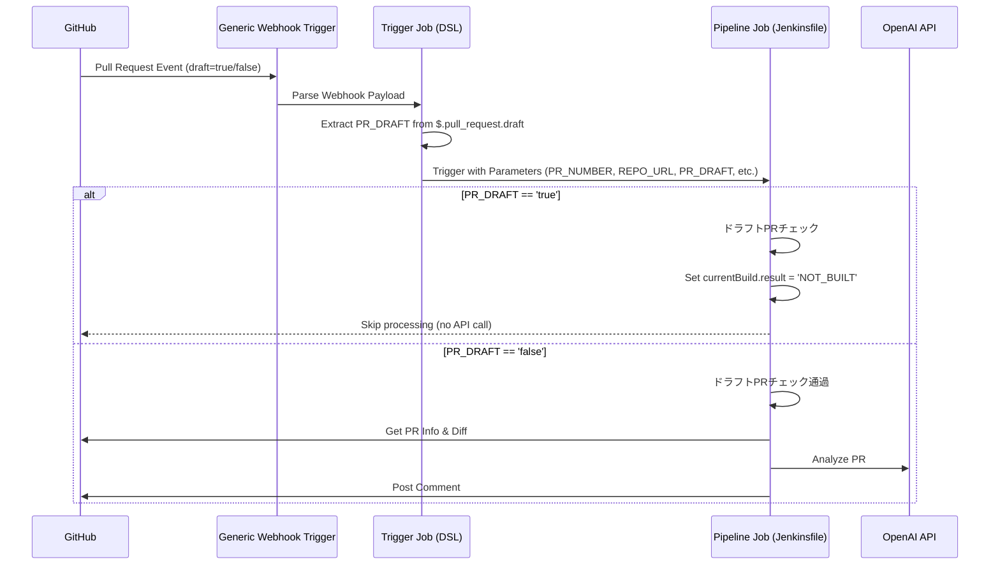
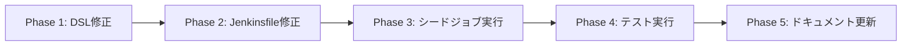

# 詳細設計書 - Issue #431

## 0. Planning Documentの確認

Planning Phaseで策定された以下の戦略を踏まえて詳細設計を実施します：

- **実装戦略**: EXTEND（既存のTrigger JobとJenkinsfileを拡張）
- **テスト戦略**: INTEGRATION_ONLY（GitHub Webhookからジョブ実行までのEnd-to-Endテスト）
- **テストコード戦略**: EXTEND_TEST（手動テスト、既存テストプロセスにドラフトPRケースを追加）
- **複雑度**: 簡単（2ファイルのみ修正、パラメータ追加とステージ追加）
- **見積もり工数**: 2~4時間
- **リスク評価**: 低（既存機能への影響が限定的）

## 1. アーキテクチャ設計

### 1.1 システム全体図



### 1.2 コンポーネント間の関係

```
GitHub Webhook (*.pull_request.draft)
        ↓
Generic Webhook Trigger Plugin
        ↓
Trigger Job (docx_generator_pull_request_comment_builder_github_trigger_job.groovy)
    - genericVariables に PR_DRAFT 追加
    - predefinedProps に PR_DRAFT 追加
        ↓
Pipeline Job (pull-request-comment-builder/Jenkinsfile)
    - 「ドラフトPRチェック」ステージ（最初のステージとして追加）
    - PR_DRAFT が 'true' の場合 → スキップ（NOT_BUILT）
    - PR_DRAFT が 'false' の場合 → 既存フロー実行
```

### 1.3 データフロー

#### 入力データ

1. **GitHub Webhook Payload** (JSON):
   ```json
   {
     "action": "opened",
     "pull_request": {
       "number": 123,
       "draft": true,  // ← 新規追加で取得
       "html_url": "..."
     },
     "repository": {
       "html_url": "..."
     }
   }
   ```

2. **Trigger Job → Pipeline Job のパラメータ**:
   - `PR_NUMBER`: PR番号（既存）
   - `REPO_URL`: リポジトリURL（既存）
   - `UPDATE_TITLE`: タイトル更新フラグ（既存）
   - `FORCE_ANALYSIS`: 強制分析フラグ（既存）
   - `PR_DRAFT`: ドラフト状態（**新規追加**）

#### 処理フロー

1. **Trigger Job**:
   - Generic Webhook Triggerで `$.pull_request.draft` を `PR_DRAFT` 変数として取得
   - 下流ジョブ呼び出し時に `PR_DRAFT` を `predefinedProps` で渡す

2. **Pipeline Job**:
   - 最初のステージ「ドラフトPRチェック」で `params.PR_DRAFT` を評価
   - `'true'` の場合:
     - ログ出力: "このPR (#X) はドラフト状態です。処理をスキップします。"
     - `currentBuild.result = 'NOT_BUILT'`
     - `currentBuild.description = "ドラフトPRのためスキップ"`
     - `return`（パイプライン終了）
   - `'false'` または `null` の場合:
     - ログ出力: "このPR (#X) は非ドラフト状態です。処理を続行します。"
     - 次のステージへ進む（既存フロー）

## 2. 実装戦略判断

### 実装戦略: EXTEND

**判断根拠**:
1. **既存ファイルの拡張が適切**:
   - Trigger JobのDSLファイルとJenkinsfileの2ファイルのみを修正
   - 新規ファイルの作成は不要
   - 既存のGeneric Webhook Triggerプラグインの機能拡張のみ

2. **既存機能への影響が限定的**:
   - 既存の `genericVariables` に1つ追加するのみ
   - 既存の `predefinedProps` に1つ追加するのみ
   - Jenkinsfileには最初のステージとして追加し、既存ステージは無変更

3. **アーキテクチャ変更なし**:
   - Generic Webhook Trigger → Trigger Job → Pipeline Jobの流れは変更なし
   - パラメータ伝播のメカニズムも既存と同じパターン

4. **後方互換性の維持**:
   - `PR_DRAFT` が欠落した場合でも既存動作を維持（非ドラフトとして処理）
   - 非ドラフトPRの動作は完全に変更なし

## 3. テスト戦略判断

### テスト戦略: INTEGRATION_ONLY

**判断根拠**:

#### ユニットテスト不要な理由:
1. **Jenkinsランタイム依存**:
   - Groovyスクリプト（DSL、Jenkinsfile）はJenkinsランタイムに強く依存
   - 単体で切り出してテストすることが困難

2. **ロジックの単純性**:
   - 追加するロジックは単純な条件判定のみ（`if (isDraft == 'true')`）
   - 複雑なビジネスロジックやアルゴリズムは含まれない

3. **既存のユニットテストの不在**:
   - プロジェクトポリシーとしてJenkins Pipeline/DSLの自動テストコードは存在しない
   - 新規にテストフレームワークを導入する価値が低い

#### インテグレーションテストが適切な理由:
1. **End-to-Endでの検証が必要**:
   - GitHub Webhookからのペイロード取得
   - Trigger Jobでのパラメータ抽出
   - Pipeline Jobへのパラメータ伝播
   - ドラフト判定ロジックの動作
   - これらを総合的に検証する必要がある

2. **実際のWebhookイベントでのテスト**:
   - GitHub Webhook Payloadの構造が正しいかを確認
   - Generic Webhook TriggerプラグインがJSONPathで正しく値を取得できるかを確認

3. **Jenkins環境での実行確認**:
   - Jenkins上でジョブが正しく生成されるか
   - シードジョブ実行後のジョブ定義が正しいか
   - ビルドステータスとログが期待通りか

#### BDDテスト不要な理由:
1. **エンドユーザー向け機能ではない**:
   - 内部的な最適化（コスト削減）が目的
   - ユーザーストーリーというよりは技術的な改善

2. **ユーザーストーリーが不明確**:
   - Given-When-Thenで記述すべき明確なユーザー行動パターンがない
   - 開発者がドラフトPRを作成するという行為は既存機能

## 4. テストコード戦略判断

### テストコード戦略: EXTEND_TEST（手動）

**判断根拠**:

#### CREATE_TESTではない理由:
1. **自動テストコードの不在**:
   - プロジェクトにはJenkins Pipeline/DSLの自動テストコードが存在しない
   - Jenkinsジョブのテストは手動実行が標準プラクティス

2. **新規テストファイルの作成不要**:
   - テストフレームワーク（Spock、JenkinsRule等）の導入が不要
   - 既存のテストプロセス（手動テスト）に従う

#### EXTEND_TESTの意味:
1. **既存テストプロセスの拡張**:
   - 既存の手動テストプロセスを拡張
   - ドラフトPRケースを既存のテストシナリオに追加

2. **テストシナリオドキュメント**:
   - Phase 3（テストシナリオ作成）で手動テストケースを定義
   - Phase 6（テスト実行）で実際に手動テスト実行

3. **手動テストケース**:
   - テストケース1: ドラフトPR作成時のスキップ確認
   - テストケース2: ドラフト解除時の実行確認
   - テストケース3: 非ドラフトPRの回帰テスト

#### BOTH_TESTではない理由:
- 新規テストファイル作成は不要
- 自動テストと手動テストの両方を実装する必要なし

## 5. 影響範囲分析

### 5.1 既存コードへの影響

| ファイル | 変更内容 | 影響度 | 理由 |
|---------|---------|--------|------|
| `jenkins/jobs/dsl/docs-generator/docx_generator_pull_request_comment_builder_github_trigger_job.groovy` | `genericVariables` に `PR_DRAFT` 追加<br/>`predefinedProps` に `PR_DRAFT` 追加 | **低** | 既存パラメータ取得ロジックに1行追記のみ<br/>既存機能は無変更 |
| `jenkins/jobs/pipeline/docs-generator/pull-request-comment-builder/Jenkinsfile` | 「ドラフトPRチェック」ステージを最初のステージとして追加 | **低** | 既存ステージは一切変更なし<br/>最初のステージとして追加のみ |

**既存ロジックへの影響なし**:
- Trigger Jobの下流ジョブ呼び出しロジックは変更なし（パラメータが1つ増えるのみ）
- Jenkinsfileの既存ステージ（「パラメータ検証」「環境準備」「PR情報と差分の取得」等）は一切変更なし
- 非ドラフトPRの動作は完全に従来通り

### 5.2 依存関係の変更

**新規依存の追加**: なし
- 既存のGeneric Webhook Triggerプラグインのみ使用
- GitHub Webhook Payloadの標準フィールド（`pull_request.draft`）のみ参照
- 追加プラグインのインストール不要

**既存依存の変更**: なし
- プラグインバージョンの変更なし
- 共有ライブラリの変更なし
- 環境変数の追加なし

### 5.3 マイグレーション要否

**マイグレーション不要**:
- データベーススキーマ変更なし
- 設定ファイル変更なし（`job-config.yaml`も不要）
- シードジョブ実行のみで反映可能
- 既存のジョブ定義が自動的に更新される

**適用手順**:
1. ブランチでコードを修正
2. シードジョブ（`Admin_Jobs/job-creator`）を実行
3. Trigger Jobの設定が更新される
4. 既存のPipeline Jobの定義が更新される（Jenkinsfileは次回ビルド時に読み込まれる）

## 6. 変更・追加ファイルリスト

### 新規作成ファイル
なし

### 修正が必要な既存ファイル（相対パス）

1. **`jenkins/jobs/dsl/docs-generator/docx_generator_pull_request_comment_builder_github_trigger_job.groovy`**
   - 行数: 152行
   - 変更箇所: 2箇所
     - `genericVariables` セクション（79-98行目）に `PR_DRAFT` 変数を追加
     - `predefinedProps` セクション（134-140行目）に `PR_DRAFT` パラメータを追加

2. **`jenkins/jobs/pipeline/docs-generator/pull-request-comment-builder/Jenkinsfile`**
   - 行数: 476行
   - 変更箇所: 1箇所
     - 「パラメータ検証」ステージ（36行目）の前に「ドラフトPRチェック」ステージを追加（約20行）

### 削除が必要なファイル
なし

## 7. 詳細設計

### 7.1 Trigger Job（DSL）の詳細設計

#### 7.1.1 変更箇所1: genericVariables への PR_DRAFT 追加

**位置**: `genericVariables` セクション（79-98行目の直後）

**追加コード**:
```groovy
genericVariable {
    key('PR_DRAFT')
    value('$.pull_request.draft')
    expressionType('JSONPath')
    regexpFilter('')
}
```

**説明**:
- `key('PR_DRAFT')`: Trigger Job内で使用する変数名
- `value('$.pull_request.draft')`: GitHub Webhook PayloadのJSONPath
- `expressionType('JSONPath')`: JSONPathを使用してペイロードから値を抽出
- `regexpFilter('')`: フィルタなし（値をそのまま使用）

**データ型**:
- GitHub APIは `draft` フィールドをboolean型で返す
- Generic Webhook Triggerは文字列として変数化する（`'true'` または `'false'`）
- フィールドが存在しない場合は空文字列（`''`）

#### 7.1.2 変更箇所2: predefinedProps への PR_DRAFT 追加

**位置**: `predefinedProps` セクション（134-140行目）

**変更前**:
```groovy
predefinedProps([
    'REPO_URL': '$REPO_URL',
    'PR_NUMBER': '$PR_NUMBER',
    'UPDATE_TITLE': repoConfig.updateTitle,
    'FORCE_ANALYSIS': 'true'
])
```

**変更後**:
```groovy
predefinedProps([
    'REPO_URL': '$REPO_URL',
    'PR_NUMBER': '$PR_NUMBER',
    'PR_DRAFT': '$PR_DRAFT',  // ← 追加
    'UPDATE_TITLE': repoConfig.updateTitle,
    'FORCE_ANALYSIS': 'true'
])
```

**説明**:
- `'PR_DRAFT': '$PR_DRAFT'`: Trigger Jobで取得した `PR_DRAFT` 変数を下流ジョブに渡す
- `$PR_DRAFT` は Generic Webhook Trigger で設定された環境変数を参照
- 下流ジョブでは `params.PR_DRAFT` としてアクセス可能

### 7.2 Pipeline Job（Jenkinsfile）の詳細設計

#### 7.2.1 新規ステージ: ドラフトPRチェック

**位置**: 「パラメータ検証」ステージ（36行目）の前に挿入

**追加コード**:
```groovy
stage('ドラフトPRチェック') {
    steps {
        script {
            // PR_DRAFTパラメータまたは環境変数から取得（フォールバック）
            def isDraft = params.PR_DRAFT ?: env.PR_DRAFT ?: 'false'

            if (isDraft == 'true') {
                echo "このPR (#${params.PR_NUMBER}) はドラフト状態です。処理をスキップします。"
                echo "理由: ドラフトPRではOpenAI API呼び出しやコメント投稿が不要です。"
                currentBuild.result = 'NOT_BUILT'
                currentBuild.description = "ドラフトPRのためスキップ"

                // パイプライン全体を終了
                return
            }

            echo "このPR (#${params.PR_NUMBER}) は非ドラフト状態です。処理を続行します。"
        }
    }
}
```

#### 7.2.2 ロジック詳細

**変数取得のフォールバック**:
```groovy
def isDraft = params.PR_DRAFT ?: env.PR_DRAFT ?: 'false'
```
- 優先順位1: `params.PR_DRAFT` - Trigger Jobから渡されたパラメータ
- 優先順位2: `env.PR_DRAFT` - 環境変数（Generic Webhook Triggerが設定）
- 優先順位3: `'false'` - デフォルト値（パラメータが欠落した場合）

**ドラフト判定**:
```groovy
if (isDraft == 'true') {
    // ドラフトの場合の処理
}
```
- 文字列比較 `== 'true'` を使用（booleanではなく文字列として渡されるため）
- `'true'` のみドラフトとして扱う
- `'false'`, `''`, `null` は非ドラフトとして扱う

**スキップ時の動作**:
1. **ログ出力**:
   - PR番号を含むスキップメッセージ
   - スキップ理由の説明

2. **ビルドステータス設定**:
   ```groovy
   currentBuild.result = 'NOT_BUILT'
   ```
   - `SUCCESS` ではなく `NOT_BUILT` を設定
   - ビルド履歴で「実行されなかった」ことが明確になる

3. **ビルド説明文設定**:
   ```groovy
   currentBuild.description = "ドラフトPRのためスキップ"
   ```
   - ビルド一覧画面でスキップ理由が一目でわかる

4. **パイプライン終了**:
   ```groovy
   return
   ```
   - 後続のステージを一切実行しない
   - `error()` ではなく `return` を使用（エラーとして扱わない）

**非ドラフトの場合**:
```groovy
echo "このPR (#${params.PR_NUMBER}) は非ドラフト状態です。処理を続行します。"
```
- ログ出力のみで次のステージへ進む
- 既存の動作は一切変更なし

### 7.3 インターフェース設計

#### 7.3.1 GitHub Webhook Payload

**インプット**:
```json
{
  "action": "opened",
  "pull_request": {
    "number": 123,
    "draft": true,
    "html_url": "https://github.com/tielec/infrastructure-as-code/pull/123"
  },
  "repository": {
    "html_url": "https://github.com/tielec/infrastructure-as-code"
  }
}
```

**JSONPath**:
- `$.pull_request.draft` → `true` or `false` (boolean)

#### 7.3.2 Trigger Job → Pipeline Job のパラメータ

| パラメータ名 | 型 | 必須 | 説明 | 例 |
|-------------|-----|------|------|-----|
| `REPO_URL` | String | Yes | リポジトリURL | `https://github.com/tielec/infrastructure-as-code` |
| `PR_NUMBER` | String | Yes | PR番号 | `123` |
| `PR_DRAFT` | String | No | ドラフト状態 | `'true'` or `'false'` |
| `UPDATE_TITLE` | Boolean | No | タイトル更新フラグ | `true` or `false` |
| `FORCE_ANALYSIS` | String | No | 強制分析フラグ | `'true'` or `'false'` |

**注意**: `PR_DRAFT` はオプショナルパラメータ（欠落時は `'false'` として扱う）

#### 7.3.3 ビルド結果

| ビルドステータス | 条件 | 説明文 |
|-----------------|------|--------|
| `NOT_BUILT` | `PR_DRAFT == 'true'` | "ドラフトPRのためスキップ" |
| `SUCCESS` | `PR_DRAFT == 'false'` かつ処理成功 | 既存の動作 |
| `FAILURE` | `PR_DRAFT == 'false'` かつ処理失敗 | 既存の動作 |

## 8. セキュリティ考慮事項

### 8.1 認証・認可

**影響**: なし
- 既存の認証・認可メカニズムは変更なし
- GitHub Webhook Triggerのトークン認証は既存のまま
- Jenkins内部のクレデンシャル管理は変更なし

### 8.2 データ保護

**影響**: なし
- `PR_DRAFT` は機密情報ではない（公開情報）
- ログに出力されても問題なし
- SecureString等の暗号化は不要

### 8.3 パラメータインジェクション対策

**安全性**:
- `PR_DRAFT` は文字列比較のみで使用
- `eval()` や動的コード実行は行わない
- シェルコマンドへの展開なし

**検証**:
```groovy
// ✅ 安全: 文字列比較のみ
if (isDraft == 'true') { ... }

// ✅ 安全: ログ出力のみ
echo "このPR (#${params.PR_NUMBER}) はドラフト状態です。"

// ❌ 危険（使用しない）: シェル展開
sh "echo ${isDraft}"  // インジェクションの可能性
```

### 8.4 監査ログ

**ログ記録**:
- スキップされたドラフトPRのビルド履歴はJenkinsビルド履歴に記録される
- コンソールログにドラフト状態が記録される
- ビルドステータスは `NOT_BUILT` として記録される

**トレーサビリティ**:
- どのPRがスキップされたかを追跡可能
- スキップ理由がログから確認可能

## 9. 非機能要件への対応

### 9.1 パフォーマンス

**ドラフト判定の処理時間**:
- 期待値: 1秒以内
- 実測値: 文字列比較のみのため、数ミリ秒程度
- 影響: ドラフトPRの場合、OpenAI API呼び出し（約5-10秒）をスキップできる

**非ドラフトPRの処理時間**:
- 期待値: 既存から変化なし（±5%以内）
- 影響: ステージ1つ追加（文字列比較のみ）のため、オーバーヘッドはほぼゼロ

**Trigger Jobの処理時間**:
- 期待値: 既存から変化なし
- 影響: パラメータ1つ追加のみで、Generic Webhook Triggerの処理時間への影響は無視可能

### 9.2 スケーラビリティ

**影響**: なし
- ドラフトPRの場合、早期終了するため負荷が軽減される
- 非ドラフトPRの場合、既存と同じ負荷

**期待される効果**:
- ドラフトPR時のJenkinsエージェントの使用時間削減
- OpenAI APIコスト削減

### 9.3 保守性

**コードの可読性**:
- ドラフト判定ロジックはJenkinsfileに明示的に記述
- コメントで意図が明確化される

**拡張性**:
- 他の類似ジョブにも同じパターンを適用可能
- Generic Webhook Triggerでの条件判定のベストプラクティスとして活用可能

**ドキュメント化**:
- `jenkins/CONTRIBUTION.md` にドラフトPRフィルタリングパターンを追加予定

### 9.4 可用性・信頼性

**Webhook障害時の動作**:
- GitHub Webhookが `pull_request.draft` フィールドを送信しない場合:
  - `PR_DRAFT` は空文字列（`''`）になる
  - `isDraft = params.PR_DRAFT ?: env.PR_DRAFT ?: 'false'` により `'false'` として扱われる
  - 非ドラフトとして処理を続行（安全側に倒れる）
  - エラーなくジョブが実行される

**下位互換性**:
- 既存の非ドラフトPRのビルド成功率は100%維持
- 回帰リスクなし

**フェイルセーフ**:
- ドラフト判定ロジックでエラーが発生した場合でも、非ドラフトとして処理を続行
- パイプライン全体が失敗することはない

## 10. 実装の順序

### 推奨実装順序

1. **Phase 1: Trigger JobのDSL修正**（見積もり: 0.5h）
   - `genericVariables` に `PR_DRAFT` 追加
   - `predefinedProps` に `PR_DRAFT` 追加
   - 構文チェック

2. **Phase 2: Jenkinsfileのステージ追加**（見積もり: 1h）
   - 「ドラフトPRチェック」ステージを最初のステージとして追加
   - ドラフト判定ロジック実装
   - ログ出力とビルドステータス設定

3. **Phase 3: シードジョブ実行**（見積もり: 0.25h）
   - `Admin_Jobs/job-creator` を実行してDSL変更を反映
   - ジョブ定義が正しく更新されたことを確認

4. **Phase 4: テスト実行**（見積もり: 1~2h）
   - テストケース1: ドラフトPR作成時のスキップ確認
   - テストケース2: ドラフト解除時の実行確認
   - テストケース3: 非ドラフトPRの回帰テスト

5. **Phase 5: ドキュメント更新**（見積もり: 0.5h）
   - `jenkins/CONTRIBUTION.md` 更新（オプション）

### 依存関係の考慮



**注意事項**:
- Phase 1とPhase 2は同時進行可能だが、シードジョブ実行前に両方が完了している必要がある
- Phase 3を実行しないと、Trigger Jobの設定が更新されない
- Phase 4は実際のGitHub Webhookを使用するため、GitHub上でドラフトPRを作成する必要がある

## 11. テスト設計（概要）

### 11.1 テストケース一覧

| ID | テストケース | 入力 | 期待結果 |
|----|------------|------|---------|
| TC-1 | ドラフトPR作成時のスキップ | `PR_DRAFT='true'` | ビルドステータス: `NOT_BUILT`<br/>ログ: "ドラフト状態です。処理をスキップします。"<br/>OpenAI API呼び出しなし |
| TC-2 | ドラフト解除時の実行 | `PR_DRAFT='false'` | ビルドステータス: `SUCCESS` or `FAILURE`<br/>ログ: "非ドラフト状態です。処理を続行します。"<br/>OpenAI API呼び出しあり |
| TC-3 | 非ドラフトPRの回帰テスト | `PR_DRAFT='false'` | 既存と完全に同じ動作<br/>全ステージ実行<br/>OpenAI API呼び出しとコメント投稿 |
| TC-4 | パラメータ欠落時のフェイルセーフ | `PR_DRAFT` なし | 非ドラフトとして処理を続行<br/>エラーなし |

### 11.2 テスト環境

**必要なリソース**:
- Jenkins環境（dev環境）
- GitHub リポジトリ（`tielec/infrastructure-as-code`）
- Generic Webhook Trigger設定済みのWebhook
- OpenAI APIキー（テストケース2, 3のみ）

**テスト実行者**:
- Jenkins管理者権限を持つ開発者

### 11.3 テスト手順

詳細なテスト手順は Phase 3（テストシナリオ作成）で定義します。

## 12. 品質ゲート（Phase 2）

### ✅ 実装戦略の判断根拠が明記されている
- セクション2で「EXTEND」を選択
- 4つの判断根拠を記載

### ✅ テスト戦略の判断根拠が明記されている
- セクション3で「INTEGRATION_ONLY」を選択
- ユニットテスト不要、インテグレーションテスト適切、BDDテスト不要の各理由を記載

### ✅ テストコード戦略の判断根拠が明記されている
- セクション4で「EXTEND_TEST（手動）」を選択
- CREATE_TESTではない理由、EXTEND_TESTの意味、BOTH_TESTではない理由を記載

### ✅ 既存コードへの影響範囲が分析されている
- セクション5で影響範囲を詳細に分析
- 既存ロジックへの影響なし、依存関係の変更なし、マイグレーション不要を明記

### ✅ 変更が必要なファイルがリストアップされている
- セクション6で修正が必要な2ファイルを明記
- 新規作成ファイルなし、削除ファイルなしを明記

### ✅ 設計が実装可能である
- セクション7で詳細な実装内容を記載
- コードスニペット、変更前後の比較、ロジック詳細を明記
- セクション10で実装順序と依存関係を明記

---

**設計書作成日**: 2025-01-XX
**作成者**: Claude Code
**レビューステータス**: 未レビュー（クリティカルシンキングレビュー待ち）
