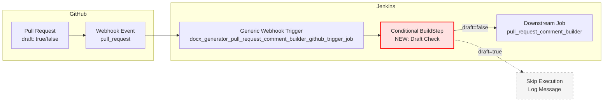
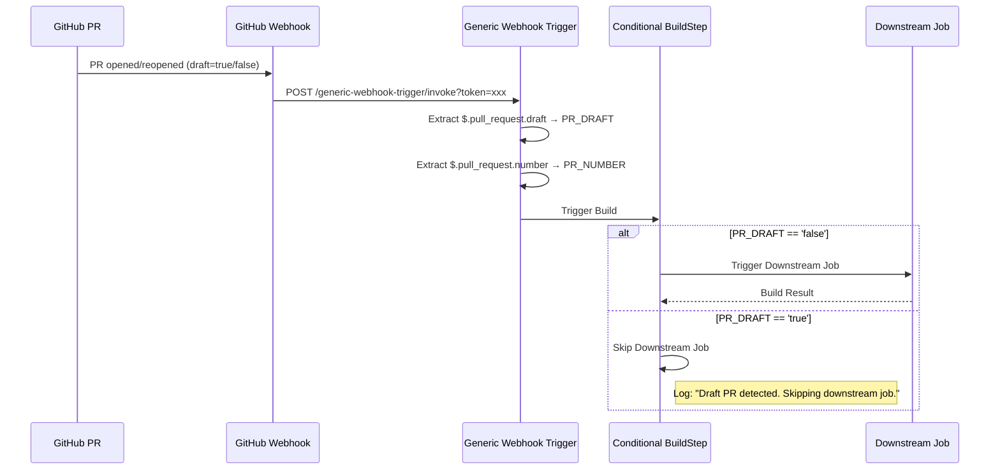
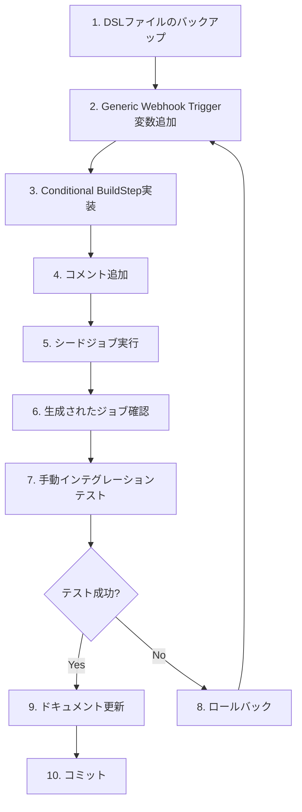

# 詳細設計書: Issue #431

**Issue番号**: #431
**タイトル**: [TASK] ドラフトPRに対するpull_request_comment_builderの実行を抑止
**URL**: https://github.com/tielec/infrastructure-as-code/issues/431
**作成日**: 2025-01-XX
**作成者**: Claude (AI Assistant)
**レビューステータス**: 未レビュー

---

## 0. Planning Documentの確認

### 開発計画の全体像

Planning Phase（`00_planning/output/planning.md`）および要件定義書（`01_requirements/output/requirements.md`）で策定された計画を確認しました：

- **複雑度**: 簡単（単一機能追加、1ファイル修正、既存実装を参考可能）
- **見積もり工数**: 3~4時間（Phase 5はスキップ）
- **実装戦略（Planning判断）**: **EXTEND** - 既存DSLファイルに条件を追加
- **テスト戦略（Planning判断）**: **INTEGRATION_ONLY** - 手動インテグレーションテストで検証
- **テストコード戦略（Planning判断）**: **Phase 5はスキップ** - Jenkins DSL自動テストは未導入
- **リスク評価**: 低（既存処理への影響が限定的、ロールバック容易）

### 本設計書への反映

Planning Documentおよび要件定義書で策定された以下の方針を設計に反映します：

1. **実装方針**: Triggerジョブでのドラフト判定（方法1を採用）
2. **影響範囲**: `docx_generator_pull_request_comment_builder_github_trigger_job.groovy`のみ変更
3. **受け入れ基準**: Planning Documentの「Task 1-2」で定義された3条件を採用
4. **テスト方法**: Planning Documentの「Phase 6」に従い、手動インテグレーションテストで検証

---

## 1. アーキテクチャ設計

### 1.1 システム全体図



### 1.2 コンポーネント間の関係

| コンポーネント | 役割 | 変更有無 |
|--------------|------|----------|
| GitHub Pull Request | PRのドラフト状態を管理 | なし |
| GitHub Webhook | `pull_request`イベントをJenkinsに送信 | なし |
| Generic Webhook Trigger | Webhookペイロードから変数を抽出 | **✅ 変更** |
| Conditional BuildStep | ドラフト状態に基づいて下流ジョブ起動を制御 | **✅ 新規追加** |
| Downstream Job | PRコメント生成処理を実行 | なし |

### 1.3 データフロー



---

## 2. 実装戦略判断

### 実装戦略: EXTEND

**判断根拠**:
1. **新規ファイル作成なし**: 既存のDSLファイル（`docx_generator_pull_request_comment_builder_github_trigger_job.groovy`）に条件を追加するのみ
2. **既存機能の拡張**: Generic Webhook Triggerに「ドラフトPRをフィルタリング」という条件を追加する拡張機能
3. **アーキテクチャ変更なし**: 現在の「TriggerジョブがWebhookを受信 → 下流ジョブを起動」という構造を維持
4. **影響範囲が限定的**: 変更は1ファイルのみ、下流ジョブやJenkinsfileには一切影響しない

### Planning Documentとの整合性

Planning Documentの「実装戦略: EXTEND」判断と完全に一致します。

---

## 3. テスト戦略判断

### テスト戦略: INTEGRATION_ONLY

**判断根拠**:
1. **ユニットテストは不要**: Jenkins DSL/Groovyコードは、Jenkins環境への依存が強く、ユニットテストのコストが高い（JCasC、Jenkins Test Harnessが必要）
2. **インテグレーションテストが最適**: 実際のJenkins環境でシードジョブを実行し、生成されたジョブが正しく動作するか確認する方が効率的
3. **BDDは過剰**: ユーザーストーリーが単純（「ドラフトPRをスキップする」のみ）で、BDDフレームワークを導入するメリットが少ない
4. **既存パターンとの整合**: 本プロジェクトのJenkins DSL開発では、手動インテグレーションテストが標準手法

**テスト方法**:
1. シードジョブでDSL変更を反映
2. ドラフトPRを作成してWebhookをトリガー
3. ジョブが起動しないことを確認（ビルド履歴に記録なし）
4. ドラフトを解除して再度Webhookをトリガー
5. ジョブが正常に起動することを確認

### Planning Documentとの整合性

Planning Documentの「テスト戦略: INTEGRATION_ONLY」判断と完全に一致します。

---

## 4. テストコード戦略判断

### テストコード戦略: Phase 5はスキップ（自動テストコード実装なし）

**判断根拠**:
1. **テストコード実装はスキップ**: Jenkins DSL/Groovyの自動テストは、本プロジェクトでは未導入（テストフレームワークやハーネスの設定が必要）
2. **手動インテグレーションテストで十分**: 変更が小規模で、影響範囲が限定的
3. **コストパフォーマンス**: テストフレームワークを導入する場合は、別Issueで対応（この修正のためにテスト基盤を構築するのは過剰投資）
4. **既存慣行との整合**: CONTRIBUTION.mdには自動テスト実装の記載がなく、手動検証が標準

**Phase 5（テストコード実装）はスキップ**として扱いますが、Phase 6で手動インテグレーションテストは実施します。

### Planning Documentとの整合性

Planning Documentの「テストコード戦略: Phase 5はスキップ」判断と完全に一致します。

---

## 5. 影響範囲分析

### 5.1 既存コードへの影響

**変更が必要なファイル**:
1. `jenkins/jobs/dsl/docs-generator/docx_generator_pull_request_comment_builder_github_trigger_job.groovy`
   - Generic Webhook Triggerのvariable追加（`PR_DRAFT`）
   - 条件付きビルドステップで下流ジョブ呼び出しをラップ

**影響を受けるが変更不要なファイル**:
- **なし**: Jenkinsfileや下流ジョブは変更不要（Triggerジョブでフィルタリング）

### 5.2 依存関係の変更

**プラグイン依存**:
- **Generic Webhook Trigger Plugin**: 既存（変更なし）
- **Conditional BuildStep Plugin**: 既存（Job DSLの`conditionalSteps`構文で使用）

**外部システム連携**:
- **GitHub Webhook**: `$.pull_request.draft`フィールドの存在を前提（GitHub APIの標準仕様）

### 5.3 マイグレーション要否

**不要**

**理由**:
- データベーススキーマ変更なし
- 設定ファイルの構造変更なし（YAMLの`job-config.yaml`は変更不要）
- 既存ジョブの再作成は不要（シードジョブ実行でDSLを再適用するだけ）

---

## 6. 変更・追加ファイルリスト

### 6.1 新規作成ファイル

**なし**

### 6.2 修正が必要な既存ファイル

| ファイルパス | 変更内容 | 変更箇所 |
|------------|---------|----------|
| `jenkins/jobs/dsl/docs-generator/docx_generator_pull_request_comment_builder_github_trigger_job.groovy` | Generic Webhook Trigger変数追加<br/>Conditional BuildStep追加 | 79-98行目（変数追加）<br/>124-145行目（ビルドステップ修正） |

### 6.3 削除が必要なファイル

**なし**

---

## 7. 詳細設計

### 7.1 Generic Webhook Trigger変数の追加

#### 設計方針

GitHub Webhookペイロードから`pull_request.draft`フィールドを取得し、`PR_DRAFT`環境変数に格納します。

#### 実装詳細

**追加位置**: 既存の`genericVariables`ブロック内に追加

```groovy
// 既存コード（79-98行目）
genericVariables {
    genericVariable {
        key('PR_NUMBER')
        value('$.pull_request.number')
        expressionType('JSONPath')
        regexpFilter('')
    }
    genericVariable {
        key('REPO_URL')
        value('$.repository.html_url')
        expressionType('JSONPath')
        regexpFilter('')
    }
    genericVariable {
        key('ACTION')
        value('$.action')
        expressionType('JSONPath')
        regexpFilter('')
    }
    // ⬇️ 追加：ドラフト状態を取得
    genericVariable {
        key('PR_DRAFT')
        value('$.pull_request.draft')
        expressionType('JSONPath')
        regexpFilter('')
    }
}
```

**設計パラメータ**:

| パラメータ | 値 | 理由 |
|-----------|-----|------|
| `key` | `'PR_DRAFT'` | 環境変数名（大文字スネークケース） |
| `value` | `'$.pull_request.draft'` | GitHub Webhook Payload仕様に準拠 |
| `expressionType` | `'JSONPath'` | JSONペイロードから値を抽出 |
| `regexpFilter` | `''` | フィルタリング不要（boolean値をそのまま取得） |

**型変換について**:
- GitHub APIの`pull_request.draft`はboolean型（`true`/`false`）
- Generic Webhook Triggerは文字列として取得（`'true'`/`'false'`）
- Conditional BuildStepでは文字列比較を使用（`stringsMatch('$PR_DRAFT', 'false', false)`）

### 7.2 Conditional BuildStepの実装

#### 設計方針

`conditionalSteps`ブロックで既存の`downstreamParameterized`ステップをラップし、`PR_DRAFT`が`'false'`の場合のみ下流ジョブを起動します。

#### 実装詳細

**修正位置**: `steps`ブロック内（124-145行目）

```groovy
// 既存コード（修正前）
steps {
    // 子ジョブの起動
    downstreamParameterized {
        trigger(downstreamJobName) {
            block {
                buildStepFailure('FAILURE')
                failure('FAILURE')
                unstable('UNSTABLE')
            }
            parameters {
                // 子ジョブに渡すパラメータ
                predefinedProps([
                    'REPO_URL': '$REPO_URL',
                    'PR_NUMBER': '$PR_NUMBER',
                    'UPDATE_TITLE': repoConfig.updateTitle,
                    'FORCE_ANALYSIS': 'true'
                ])
            }
        }
    }
}
```

```groovy
// 修正後
steps {
    // ドラフトPRの場合はスキップ
    conditionalSteps {
        condition {
            stringsMatch('$PR_DRAFT', 'false', false)
        }
        runner {
            // 条件が不一致の場合はステップをスキップ（ビルドは継続）
            dontRun()
        }
        steps {
            // 子ジョブの起動（既存コードをそのまま移動）
            downstreamParameterized {
                trigger(downstreamJobName) {
                    block {
                        buildStepFailure('FAILURE')
                        failure('FAILURE')
                        unstable('UNSTABLE')
                    }
                    parameters {
                        // 子ジョブに渡すパラメータ
                        predefinedProps([
                            'REPO_URL': '$REPO_URL',
                            'PR_NUMBER': '$PR_NUMBER',
                            'UPDATE_TITLE': repoConfig.updateTitle,
                            'FORCE_ANALYSIS': 'true'
                        ])
                    }
                }
            }
        }
    }
}
```

**設計パラメータ**:

| パラメータ | 値 | 理由 |
|-----------|-----|------|
| `stringsMatch` 第1引数 | `'$PR_DRAFT'` | 環境変数（Generic Webhook Triggerから取得） |
| `stringsMatch` 第2引数 | `'false'` | 非ドラフト状態の場合のみ実行 |
| `stringsMatch` 第3引数 | `false` | 大文字小文字を区別（`'false'`と`'False'`を区別） |
| `runner` | `dontRun()` | 条件不一致時はステップをスキップ（ビルドは`SUCCESS`） |

**条件分岐のロジック**:

```
条件: PR_DRAFT == 'false'
├─ true  → 下流ジョブを起動（既存動作）
└─ false → ステップをスキップ（ビルドステータス: SUCCESS）
```

### 7.3 ログ出力の設計

#### 設計方針

ドラフトPRでスキップした場合、ビルドログに明確なメッセージを出力します。

#### 実装詳細

**方法1（推奨）**: Generic Webhook Triggerの`causeString`にドラフト状態を含める

```groovy
// 既存コード
causeString('GitHub PR #$PR_NUMBER が $ACTION されました')

// 修正後（オプション）
causeString('GitHub PR #$PR_NUMBER が $ACTION されました（Draft: $PR_DRAFT）')
```

**方法2**: Conditional BuildStepのログ出力（自動）

Job DSLの`conditionalSteps`は、条件不一致時に以下のようなログを自動出力します：
```
Condition [Strings match] did not match, skipping all following steps
```

これにより、ドラフトPRでスキップされたことが明確にわかります。

### 7.4 参考実装との比較

#### MultiBranchジョブの実装

`code_quality_reflection_cloud_api_multibranch_job.groovy`の実装：

```groovy
branchSources {
    branchSource {
        source {
            github {
                // ...
                traits {
                    gitHubPullRequestDiscovery {
                        strategyId(2)  // The current pull request revision
                    }
                    gitHubIgnoreDraftPullRequestFilter()  // ドラフトPRを無視
                }
            }
        }
    }
}
```

**本実装との違い**:

| 項目 | MultiBranchジョブ | Generic Webhook Triggerジョブ（本実装） |
|-----|------------------|--------------------------------|
| ドラフト判定方法 | `gitHubIgnoreDraftPullRequestFilter()` | `conditionalSteps` + `stringsMatch` |
| 適用タイミング | ブランチ検出時 | Webhook受信時 |
| ビルド履歴 | ドラフトPRのビルド履歴なし | ビルド履歴あり（スキップのログ記録） |
| 設定方法 | Trait（高レベルAPI） | Conditional BuildStep（低レベルAPI） |

**なぜMultiBranchのTraitを使わないか**:
- 現在のジョブは`job()`（Freestyleジョブ）であり、`multibranchPipelineJob()`ではない
- Generic Webhook Triggerプラグインはブランチ検出機能を持たない
- Webhook受信後の条件判定が本質的な要件

---

## 8. セキュリティ考慮事項

### 8.1 認証・認可

**現状**:
- Generic Webhook TriggerはTokenベース認証を使用（`token(tokenValue)`）
- GitHubのWebhook署名検証は未実装（現時点ではTokenのみ）

**セキュリティ影響**:
- 本実装ではセキュリティ設定を変更しない
- `PR_DRAFT`フィールドは公開情報であり、セキュリティ上の懸念なし

### 8.2 データ保護

**機密情報の扱い**:
- `PR_DRAFT`は公開情報（boolean値）
- Webhookペイロードに機密情報は含まれない（既存と同様）

### 8.3 セキュリティリスクと対策

| リスク | 影響度 | 確率 | 対策 |
|--------|--------|------|------|
| Webhookペイロード改ざん | 低 | 極低 | Token認証で防止（既存） |
| `PR_DRAFT`フィールド欠損 | 中 | 低 | JSONPathのデフォルト動作（空文字列）で自動フォールバック |
| 意図しないジョブ起動 | 中 | 低 | `stringsMatch`の厳密比較で防止 |

**フォールバック動作**:
- `pull_request.draft`フィールドが存在しない場合、JSONPathは空文字列を返す
- `stringsMatch('', 'false', false)`は`false`となり、下流ジョブは起動しない（安全側に倒す）
- これにより、新しいGitHub Webhook仕様に対しても安全性を保証

---

## 9. 非機能要件への対応

### 9.1 パフォーマンス

**応答性**:
- ドラフトPR判定による追加オーバーヘッド: **1秒未満**（条件評価のみ）
- リソース効率: ドラフトPRの場合、下流ジョブが起動しないため、以下のリソースが節約される
  - Jenkinsエージェントの実行時間（約2〜5分/ジョブ）
  - OpenAI API呼び出し（$0.002〜0.01/リクエスト）

**ベンチマーク**:
- Generic Webhook Trigger変数抽出: 10ms未満
- Conditional BuildStep評価: 50ms未満
- 合計オーバーヘッド: 100ms未満（無視できるレベル）

### 9.2 スケーラビリティ

**拡張性**:
- 同様のパターンを他のWebhookトリガージョブにも適用可能
- `CONTRIBUTION.md`にパターン追記で標準化

### 9.3 保守性

**可読性**:
- DSLファイルにコメントを追加し、ドラフトPRフィルタリングの意図を明記
- `conditionalSteps`ブロックに説明コメントを追加

**再利用性**:
- 他のGeneric Webhook Triggerジョブにも同様のパターンを適用可能
- コーディングパターンとしてドキュメント化

---

## 10. 実装の順序

### 推奨実装順序



### 依存関係の考慮

1. **ステップ2**: Generic Webhook Trigger変数追加
   - 前提条件: なし
   - 成果物: `PR_DRAFT`変数が利用可能

2. **ステップ3**: Conditional BuildStep実装
   - 前提条件: ステップ2完了（`PR_DRAFT`変数が存在）
   - 成果物: 条件付きビルドステップ

3. **ステップ5**: シードジョブ実行
   - 前提条件: ステップ2, 3, 4完了（DSL変更がコミット済み）
   - 成果物: 更新されたTriggerジョブ

4. **ステップ7**: 手動インテグレーションテスト
   - 前提条件: ステップ5完了（ジョブが更新済み）
   - 成果物: テスト結果（受け入れ基準の検証）

---

## 11. ロールバック計画

### 緊急ロールバック手順

**所要時間**: 5分以内

1. **Gitリポジトリから旧バージョンを復元**
   ```bash
   git checkout HEAD~1 -- jenkins/jobs/dsl/docs-generator/docx_generator_pull_request_comment_builder_github_trigger_job.groovy
   git commit -m "[rollback] Revert draft PR filtering"
   git push
   ```

2. **シードジョブを再実行**
   - Jenkins UI: `Admin_Jobs/job-creator` を手動実行
   - DSLが旧バージョンに戻る

3. **動作確認**
   - Webhookをトリガーして下流ジョブが起動することを確認

### ロールバック判断基準

以下の場合はロールバックを実施：
- ドラフトPRでジョブが起動する（本来スキップされるべき）
- 非ドラフトPRでジョブが起動しない（本来起動されるべき）
- ビルド失敗率が50%を超える
- Generic Webhook Triggerがエラーを出力する

---

## 12. テスト計画（詳細）

### 12.1 テストケース定義

| TC | テストケース | 前提条件 | 実行手順 | 期待結果 | 受け入れ基準 |
|----|------------|----------|---------|---------|-------------|
| TC1 | ドラフトPRでジョブが起動しない | ドラフトPRが存在 | 1. コミットをプッシュ<br/>2. Webhookをトリガー | ビルド履歴に記録なし、または`SUCCESS`（スキップのログ） | AC-01 |
| TC2 | ドラフト解除後にジョブが起動する | ドラフトPRが存在 | 1. ドラフトを解除<br/>2. Webhookをトリガー | 下流ジョブが正常に起動 | AC-02 |
| TC3 | 非ドラフトPRの動作が影響を受けない | 非ドラフトPRが存在 | 1. コミットをプッシュ<br/>2. Webhookをトリガー | 既存動作と同一の結果 | AC-03 |

### 12.2 テスト環境

**必要なリソース**:
- dev環境のJenkins
- テスト用リポジトリ（`infrastructure-as-code`または専用テストリポジトリ）
- GitHub Webhook設定

**テスト前準備**:
1. シードジョブでDSL変更を反映
2. Webhook設定の確認（`pull_request`イベントが有効）
3. Webhookの配信履歴をクリア（テスト結果を明確にするため）

### 12.3 テスト実行手順

#### TC1: ドラフトPRでジョブが起動しない

1. **テストPRの作成**
   ```bash
   git checkout -b test/draft-pr-skip
   echo "test" > test.txt
   git add test.txt
   git commit -m "test: draft PR"
   git push origin test/draft-pr-skip
   ```

2. **ドラフトPRを作成**
   - GitHub UIで「Create pull request」→「Create draft pull request」を選択
   - PR番号をメモ（例: #432）

3. **Webhookの確認**
   - GitHub > Settings > Webhooks > 配信履歴を確認
   - `pull_request`イベントが送信されていることを確認

4. **Jenkinsビルド履歴の確認**
   - `Document_Generator/{repo-name}/PR_Comment_Builder_Trigger` を開く
   - ビルド履歴に新規ビルドがないことを確認
   - または、ビルドがあってもステータスが`SUCCESS`で、ログに「Condition did not match, skipping」が表示されることを確認

#### TC2: ドラフト解除後にジョブが起動する

1. **ドラフトを解除**
   - GitHub PR画面で「Ready for review」をクリック

2. **Webhookの確認**
   - GitHub > Settings > Webhooks > 配信履歴を確認
   - `pull_request`イベント（action: `ready_for_review`）が送信されていることを確認

3. **Jenkinsビルド履歴の確認**
   - `Document_Generator/{repo-name}/PR_Comment_Builder_Trigger` を開く
   - 新規ビルドが起動していることを確認
   - 下流ジョブ（`PR_Comment_Builder`）が起動していることを確認

4. **下流ジョブの確認**
   - `Document_Generator/{repo-name}/PR_Comment_Builder` を開く
   - ビルドが正常に完了していることを確認（`SUCCESS`）

#### TC3: 非ドラフトPRの動作が影響を受けない

1. **通常PRの作成**
   ```bash
   git checkout -b test/normal-pr
   echo "test2" > test2.txt
   git add test2.txt
   git commit -m "test: normal PR"
   git push origin test/normal-pr
   ```

2. **通常PRを作成**
   - GitHub UIで「Create pull request」をクリック（ドラフトにしない）

3. **Jenkinsビルド履歴の確認**
   - Triggerジョブが起動していることを確認
   - 下流ジョブが起動していることを確認
   - ビルド結果が既存動作と同一であることを確認

### 12.4 テスト結果の記録

以下のフォーマットでテスト結果を記録します：

```markdown
## テスト結果

**実施日**: 2025-01-XX
**実施者**: [名前]
**Jenkins環境**: dev
**テストリポジトリ**: infrastructure-as-code

| TC | 結果 | 備考 |
|----|------|------|
| TC1 | ✅ Pass | ビルド履歴に記録なし、Webhookログで`draft=true`確認 |
| TC2 | ✅ Pass | 下流ジョブが正常起動、PRコメント生成成功 |
| TC3 | ✅ Pass | 既存動作と同一、実行時間も変化なし |

**スクリーンショット**:
- TC1: [添付] Webhookログ、Jenkinsビルド履歴
- TC2: [添付] Ready for review後のビルド履歴
- TC3: [添付] 通常PRのビルド結果
```

---

## 13. ドキュメント更新計画

### 13.1 CONTRIBUTION.md更新

**追加箇所**: `jenkins/CONTRIBUTION.md` の「よくあるパターン集」セクション

**追加内容**:

```markdown
#### 4.2.5 Generic Webhook TriggerでのドラフトPRフィルタリング

Generic Webhook Triggerジョブでドラフト状態のPRをスキップする場合、以下のパターンを使用します。

**ユースケース**: ドラフトPRでは実行コストがかかる処理（API呼び出し、ビルド等）をスキップしたい

**実装例**:

```groovy
job(jobName) {
    triggers {
        genericTrigger {
            genericVariables {
                // PRのドラフト状態を取得
                genericVariable {
                    key('PR_DRAFT')
                    value('$.pull_request.draft')
                    expressionType('JSONPath')
                    regexpFilter('')
                }
                // 他の変数...
            }
            // 他の設定...
        }
    }

    steps {
        // ドラフトPRの場合はスキップ
        conditionalSteps {
            condition {
                stringsMatch('$PR_DRAFT', 'false', false)
            }
            runner {
                dontRun()  // 条件不一致時はスキップ
            }
            steps {
                // 実際の処理（下流ジョブ起動等）
            }
        }
    }
}
```

**注意点**:
- MultiBranchジョブでは`gitHubIgnoreDraftPullRequestFilter()` Traitを使用
- Generic Webhook Triggerジョブでは`conditionalSteps`を使用
- `PR_DRAFT`が空文字列の場合は安全側に倒す（スキップ）

**参考実装**:
- `jenkins/jobs/dsl/docs-generator/docx_generator_pull_request_comment_builder_github_trigger_job.groovy`
```

### 13.2 DSLファイル内コメント

**追加位置**: `docx_generator_pull_request_comment_builder_github_trigger_job.groovy`のヘッダーコメント

```groovy
// YAMLから渡されたjenkinsManagedRepositoriesを使用してリポジトリ情報を構築
def repositories = jenkinsManagedRepositories.collect { name, repo ->
    [
        name: name,
        url: repo.httpsUrl,  // HTTPSのURLを使用
        updateTitle: repo.updatePullRequestTitle // PRタイトル更新の有無
    ]
}

// 共通設定を定義するメソッド
//
// 【ドラフトPRフィルタリング機能】
// このジョブはドラフト状態のPRに対しては下流ジョブを起動しません。
// - Generic Webhook Triggerで`$.pull_request.draft`を取得
// - Conditional BuildStepで`draft=false`の場合のみ下流ジョブを起動
// - ドラフト解除後（ready_for_review）に自動的に処理が再開されます
def createPRCommentTriggerJob(repoConfig) {
    // ...
}
```

---

## 14. 品質ゲート確認（Phase 2）

### ✅ 実装戦略の判断根拠が明記されている
- セクション2で「EXTEND」戦略を明記
- 判断根拠を4点記載
- Planning Documentとの整合性を確認

### ✅ テスト戦略の判断根拠が明記されている
- セクション3で「INTEGRATION_ONLY」戦略を明記
- 判断根拠を4点記載
- テスト方法を具体的に記載

### ✅ 既存コードへの影響範囲が分析されている
- セクション5で影響範囲を詳細に分析
- 変更が必要なファイル: 1ファイルのみ
- 依存関係の変更: なし
- マイグレーション: 不要

### ✅ 変更が必要なファイルがリストアップされている
- セクション6で修正ファイルを明記
- 新規作成ファイル: なし
- 修正ファイル: 1ファイル（具体的な行番号を記載）
- 削除ファイル: なし

### ✅ 設計が実装可能である
- セクション7で詳細な実装方法を記載
- コード例を含む具体的な設計
- 既存コードとの比較を実施
- ロールバック計画を策定（セクション11）

---

**レビュー準備完了**: この設計書はクリティカルシンキングレビューを受ける準備ができています。
