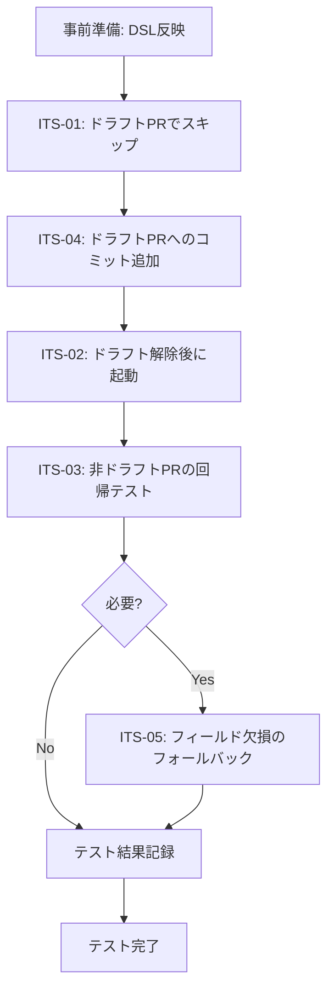

# テストシナリオ: Issue #431

**Issue番号**: #431
**タイトル**: [TASK] ドラフトPRに対するpull_request_comment_builderの実行を抑止
**URL**: https://github.com/tielec/infrastructure-as-code/issues/431
**作成日**: 2025-01-XX
**作成者**: Claude (AI Assistant)
**レビューステータス**: 未レビュー

---

## 0. Planning DocumentおよびPhase 2の確認

### テスト戦略（Phase 2で決定）

**INTEGRATION_ONLY**

**判断根拠**（Planning Document/設計書より）:
1. **ユニットテストは不要**: Jenkins DSL/Groovyコードは、Jenkins環境への依存が強く、ユニットテストのコストが高い（JCasC、Jenkins Test Harnessが必要）
2. **インテグレーションテストが最適**: 実際のJenkins環境でシードジョブを実行し、生成されたジョブが正しく動作するか確認する方が効率的
3. **BDDは過剰**: ユーザーストーリーが単純（「ドラフトPRをスキップする」のみ）で、BDDフレームワークを導入するメリットが少ない
4. **既存パターンとの整合**: 本プロジェクトのJenkins DSL開発では、手動インテグレーションテストが標準手法

### テスト範囲

本テストシナリオでは、以下のコンポーネント間の統合テストを実施します：

1. **GitHub Webhook → Jenkins Generic Webhook Trigger**
2. **Generic Webhook Trigger → Conditional BuildStep**
3. **Conditional BuildStep → Downstream Job（pull_request_comment_builder）**

**テスト方法**: 手動インテグレーションテスト（Jenkins実環境でのエンドツーエンド検証）

---

## 1. テスト戦略サマリー

### 選択されたテスト戦略

**INTEGRATION_ONLY** - 手動インテグレーションテストのみ

### テスト対象の範囲

**変更対象**:
- `jenkins/jobs/dsl/docs-generator/docx_generator_pull_request_comment_builder_github_trigger_job.groovy`
  - Generic Webhook Trigger変数追加（`PR_DRAFT`）
  - Conditional BuildStep追加（ドラフトPRフィルタリング）

**統合ポイント**:
1. GitHub Webhook → Generic Webhook Trigger（ペイロード受信と変数抽出）
2. Generic Webhook Trigger → Conditional BuildStep（条件評価）
3. Conditional BuildStep → Downstream Job（条件付き起動）

**影響範囲**:
- 既存の非ドラフトPRの動作に影響がないことを確認
- ドラフトPRでの新規動作（スキップ処理）を確認
- ドラフト解除後の動作を確認

### テストの目的

1. **機能検証**: ドラフトPRに対して下流ジョブが起動しないことを確認
2. **回帰テスト**: 既存の非ドラフトPRの動作に影響がないことを確認
3. **ライフサイクル検証**: ドラフト作成 → ドラフト解除の一連の流れで正しく動作することを確認
4. **受け入れ基準の検証**: 要件定義書のAC-01〜AC-03が満たされることを確認

---

## 2. Integrationテストシナリオ

### 2.1 テスト環境準備

#### テスト環境要件

| 項目 | 要件 |
|------|------|
| Jenkins環境 | dev環境のJenkins（Generic Webhook Trigger Plugin、Conditional BuildStep Plugin導入済み） |
| テストリポジトリ | `infrastructure-as-code`または専用テストリポジトリ |
| GitHub Webhook | `pull_request`イベントが有効（actions: `opened`, `reopened`, `synchronize`, `ready_for_review`） |
| 権限 | Jenkinsジョブ実行権限、GitHubリポジトリへのWrite権限 |

#### 事前準備手順

**ステップ1: DSL変更の反映**

1. シードジョブ（`Admin_Jobs/job-creator`）を実行
2. DSL変更が正常に反映されることを確認
   - コンソール出力で「GeneratedJob」セクションに`docx_generator_pull_request_comment_builder_github_trigger_job`が表示される
   - エラーがないことを確認

**ステップ2: Webhook設定の確認**

1. GitHub > Settings > Webhooks を開く
2. Jenkins WebhookのURLを確認（`https://{jenkins-url}/generic-webhook-trigger/invoke?token={token}`）
3. `pull_request`イベントが有効であることを確認
4. Webhook配信履歴をクリア（テスト結果を明確にするため）

**ステップ3: Jenkinsジョブ定義の確認**

1. Jenkins UI: `Document_Generator/{repo-name}/PR_Comment_Builder_Trigger` を開く
2. 「Configure」をクリック
3. Generic Webhook Trigger設定を確認
   - `PR_DRAFT`変数が追加されていることを確認（JSONPath: `$.pull_request.draft`）
4. Build Steps設定を確認
   - `conditionalSteps`ブロックで`downstreamParameterized`がラップされていることを確認
   - 条件: `Strings match` → `$PR_DRAFT` / `false`

---

### 2.2 Integration Test Scenario 1: ドラフトPRでジョブが起動しない

**シナリオID**: ITS-01
**目的**: GitHub Webhookからドラフト状態のPRイベントを受信した場合、下流ジョブ（pull_request_comment_builder）が起動しないことを検証
**受け入れ基準**: AC-01
**優先度**: 高（クリティカルパス）

#### 前提条件

- シードジョブでDSL変更が反映されている
- GitHub Webhookが正常に設定されている
- テストリポジトリへのWrite権限がある

#### テスト手順

**ステップ1: テストブランチの作成**

```bash
git checkout main
git pull origin main
git checkout -b test/draft-pr-skip-its01
echo "Test for draft PR skip" > test-its01.txt
git add test-its01.txt
git commit -m "test(ITS-01): draft PR skip scenario"
git push origin test/draft-pr-skip-its01
```

**ステップ2: ドラフトPRの作成**

1. GitHub UIでリポジトリを開く
2. 「Pull requests」→「New pull request」をクリック
3. Base: `main`, Compare: `test/draft-pr-skip-its01` を選択
4. 「Create pull request」のドロップダウンから「**Create draft pull request**」を選択
5. PR番号をメモ（例: #432）

**ステップ3: Webhookペイロードの確認**

1. GitHub > Settings > Webhooks > 「Recent Deliveries」を開く
2. 最新の`pull_request`イベント（action: `opened`）を選択
3. Payloadタブで以下を確認：
   ```json
   {
     "action": "opened",
     "pull_request": {
       "number": 432,
       "draft": true,  // ← ドラフト状態であることを確認
       ...
     }
   }
   ```
4. Responseタブで`200 OK`が返されていることを確認

**ステップ4: Jenkinsビルド履歴の確認**

1. Jenkins UI: `Document_Generator/{repo-name}/PR_Comment_Builder_Trigger` を開く
2. ビルド履歴を確認
   - **パターンA（推奨）**: ビルド履歴に新規ビルドが**ない**
   - **パターンB（許容）**: ビルド履歴に新規ビルドがあるが、ステータスが`SUCCESS`で下流ジョブが起動していない

**ステップ5: Triggerジョブのコンソール出力確認（パターンBの場合）**

1. 最新ビルドをクリック
2. 「Console Output」を開く
3. 以下のログが出力されていることを確認：
   ```
   [Generic Webhook Trigger] Received POST for ...
   ...
   PR_DRAFT = true
   ...
   [Conditional BuildStep] Condition [Strings match] did not match, skipping all following steps
   Finished: SUCCESS
   ```

**ステップ6: 下流ジョブが起動していないことを確認**

1. Jenkins UI: `Document_Generator/{repo-name}/PR_Comment_Builder` を開く
2. ビルド履歴に新規ビルド（PR #432関連）が**ない**ことを確認

#### 期待結果

| 確認項目 | 期待値 | 確認方法 |
|---------|--------|----------|
| GitHub Webhook配信成功 | `200 OK` | GitHub > Webhooks > Recent Deliveries |
| Webhookペイロードの`draft`フィールド | `true` | Webhookペイロードの確認 |
| Triggerジョブのビルド履歴 | 記録なし、またはSUCCESS（スキップのログ） | Jenkins UI > ビルド履歴 |
| Triggerジョブのコンソール出力 | `PR_DRAFT = true`<br/>`Condition did not match, skipping` | Console Output |
| 下流ジョブ（PR_Comment_Builder）のビルド履歴 | PR #432関連のビルドなし | Jenkins UI > ビルド履歴 |

#### 確認項目チェックリスト

- [ ] GitHub Webhookが正常に配信された（`200 OK`）
- [ ] Webhookペイロードに`"draft": true`が含まれている
- [ ] Triggerジョブのコンソール出力に`PR_DRAFT = true`が表示されている
- [ ] Triggerジョブのコンソール出力に「Condition did not match, skipping」が表示されている
- [ ] 下流ジョブ（PR_Comment_Builder）が起動していない
- [ ] Triggerジョブのビルドステータスが`SUCCESS`または`NOT_BUILT`である
- [ ] GitHub PR画面にJenkinsからのコメントが投稿されていない

---

### 2.3 Integration Test Scenario 2: ドラフト解除後にジョブが正常に起動する

**シナリオID**: ITS-02
**目的**: ドラフトPRを解除（Ready for review）した場合、下流ジョブが正常に起動し、既存動作と同じ結果が得られることを検証
**受け入れ基準**: AC-02
**優先度**: 高（クリティカルパス）

#### 前提条件

- ITS-01が完了している（ドラフトPR #432が存在）
- ドラフトPRに対して下流ジョブが起動していないことが確認済み

#### テスト手順

**ステップ1: ドラフトの解除**

1. GitHub UIでドラフトPR（#432）を開く
2. 「Ready for review」ボタンをクリック
3. PRのステータスが「Open」（非ドラフト）に変更されることを確認

**ステップ2: Webhookペイロードの確認**

1. GitHub > Settings > Webhooks > 「Recent Deliveries」を開く
2. 最新の`pull_request`イベント（action: `ready_for_review`）を選択
3. Payloadタブで以下を確認：
   ```json
   {
     "action": "ready_for_review",
     "pull_request": {
       "number": 432,
       "draft": false,  // ← ドラフトが解除されたことを確認
       ...
     }
   }
   ```
4. Responseタブで`200 OK`が返されていることを確認

**ステップ3: Triggerジョブのビルド履歴確認**

1. Jenkins UI: `Document_Generator/{repo-name}/PR_Comment_Builder_Trigger` を開く
2. ビルド履歴に新規ビルドが追加されていることを確認
3. ビルドステータスが`SUCCESS`であることを確認

**ステップ4: Triggerジョブのコンソール出力確認**

1. 最新ビルドをクリック
2. 「Console Output」を開く
3. 以下のログが出力されていることを確認：
   ```
   [Generic Webhook Trigger] Received POST for ...
   ...
   PR_DRAFT = false
   ...
   [Conditional BuildStep] Condition [Strings match] matched, continuing
   Building project Document_Generator/{repo-name}/PR_Comment_Builder
   Finished: SUCCESS
   ```

**ステップ5: 下流ジョブが起動したことを確認**

1. Jenkins UI: `Document_Generator/{repo-name}/PR_Comment_Builder` を開く
2. ビルド履歴に新規ビルド（PR #432関連）が追加されていることを確認
3. ビルドステータスを確認（`SUCCESS`または処理中）

**ステップ6: 下流ジョブのコンソール出力確認**

1. 下流ジョブの最新ビルドをクリック
2. 「Console Output」を開く
3. 以下が正常に実行されていることを確認：
   - PRコメント生成処理が実行されている
   - OpenAI API呼び出しが成功している
   - GitHubへのコメント投稿が成功している

**ステップ7: GitHub PR画面でコメント確認**

1. GitHub UIでPR #432を開く
2. Jenkinsからのコメントが投稿されていることを確認
   - コメント内容が期待通りであることを確認

#### 期待結果

| 確認項目 | 期待値 | 確認方法 |
|---------|--------|----------|
| GitHub Webhook配信成功 | `200 OK` | GitHub > Webhooks > Recent Deliveries |
| Webhookペイロードの`draft`フィールド | `false` | Webhookペイロードの確認 |
| Triggerジョブのビルド履歴 | 新規ビルドあり（SUCCESS） | Jenkins UI > ビルド履歴 |
| Triggerジョブのコンソール出力 | `PR_DRAFT = false`<br/>`Condition matched, continuing` | Console Output |
| 下流ジョブの起動 | PR #432関連のビルドあり | Jenkins UI > ビルド履歴 |
| 下流ジョブの処理 | OpenAI API呼び出し成功、PRコメント投稿成功 | Console Output、GitHub PR |
| GitHub PRコメント | Jenkinsからのコメントが投稿されている | GitHub PR画面 |

#### 確認項目チェックリスト

- [ ] GitHub Webhookが正常に配信された（`200 OK`、action: `ready_for_review`）
- [ ] Webhookペイロードに`"draft": false`が含まれている
- [ ] Triggerジョブのコンソール出力に`PR_DRAFT = false`が表示されている
- [ ] Triggerジョブのコンソール出力に「Condition matched, continuing」が表示されている
- [ ] 下流ジョブ（PR_Comment_Builder）が起動している
- [ ] 下流ジョブでOpenAI API呼び出しが成功している
- [ ] GitHub PR画面にJenkinsからのコメントが投稿されている
- [ ] コメント内容が既存動作と同じ形式である

---

### 2.4 Integration Test Scenario 3: 非ドラフトPRの動作に影響がない

**シナリオID**: ITS-03
**目的**: 既存の非ドラフトPR（通常のPR）に対する動作が、今回の変更で影響を受けていないことを検証（回帰テスト）
**受け入れ基準**: AC-03
**優先度**: 高（回帰テスト）

#### 前提条件

- シードジョブでDSL変更が反映されている
- GitHub Webhookが正常に設定されている
- テストリポジトリへのWrite権限がある

#### テスト手順

**ステップ1: テストブランチの作成**

```bash
git checkout main
git pull origin main
git checkout -b test/normal-pr-its03
echo "Test for normal PR regression" > test-its03.txt
git add test-its03.txt
git commit -m "test(ITS-03): normal PR regression scenario"
git push origin test/normal-pr-its03
```

**ステップ2: 通常PRの作成（非ドラフト）**

1. GitHub UIでリポジトリを開く
2. 「Pull requests」→「New pull request」をクリック
3. Base: `main`, Compare: `test/normal-pr-its03` を選択
4. 「**Create pull request**」をクリック（ドラフトにしない）
5. PR番号をメモ（例: #433）

**ステップ3: Webhookペイロードの確認**

1. GitHub > Settings > Webhooks > 「Recent Deliveries」を開く
2. 最新の`pull_request`イベント（action: `opened`）を選択
3. Payloadタブで以下を確認：
   ```json
   {
     "action": "opened",
     "pull_request": {
       "number": 433,
       "draft": false,  // ← 非ドラフトであることを確認
       ...
     }
   }
   ```
4. Responseタブで`200 OK`が返されていることを確認

**ステップ4: Triggerジョブのビルド履歴確認**

1. Jenkins UI: `Document_Generator/{repo-name}/PR_Comment_Builder_Trigger` を開く
2. ビルド履歴に新規ビルドが追加されていることを確認
3. ビルドステータスが`SUCCESS`であることを確認

**ステップ5: Triggerジョブのコンソール出力確認**

1. 最新ビルドをクリック
2. 「Console Output」を開く
3. 以下のログが出力されていることを確認：
   ```
   [Generic Webhook Trigger] Received POST for ...
   ...
   PR_DRAFT = false
   ...
   [Conditional BuildStep] Condition [Strings match] matched, continuing
   Building project Document_Generator/{repo-name}/PR_Comment_Builder
   Finished: SUCCESS
   ```

**ステップ6: 下流ジョブが起動したことを確認**

1. Jenkins UI: `Document_Generator/{repo-name}/PR_Comment_Builder` を開く
2. ビルド履歴に新規ビルド（PR #433関連）が追加されていることを確認
3. ビルドステータスを確認（`SUCCESS`または処理中）

**ステップ7: 下流ジョブのコンソール出力確認**

1. 下流ジョブの最新ビルドをクリック
2. 「Console Output」を開く
3. 以下が正常に実行されていることを確認：
   - PRコメント生成処理が実行されている
   - OpenAI API呼び出しが成功している
   - GitHubへのコメント投稿が成功している

**ステップ8: GitHub PR画面でコメント確認**

1. GitHub UIでPR #433を開く
2. Jenkinsからのコメントが投稿されていることを確認
   - コメント内容が既存の非ドラフトPRと同じ形式であることを確認

**ステップ9: 既存動作との比較（オプション）**

1. 以前の非ドラフトPRのビルドログを参照
2. 今回のビルドログと比較し、以下が同一であることを確認：
   - ビルドステップの順序
   - パラメータの受け渡し方法
   - 実行時間（大きな差異がない）

#### 期待結果

| 確認項目 | 期待値 | 確認方法 |
|---------|--------|----------|
| GitHub Webhook配信成功 | `200 OK` | GitHub > Webhooks > Recent Deliveries |
| Webhookペイロードの`draft`フィールド | `false` | Webhookペイロードの確認 |
| Triggerジョブのビルド履歴 | 新規ビルドあり（SUCCESS） | Jenkins UI > ビルド履歴 |
| Triggerジョブのコンソール出力 | `PR_DRAFT = false`<br/>`Condition matched, continuing` | Console Output |
| 下流ジョブの起動 | PR #433関連のビルドあり | Jenkins UI > ビルド履歴 |
| 下流ジョブの処理 | OpenAI API呼び出し成功、PRコメント投稿成功 | Console Output、GitHub PR |
| GitHub PRコメント | Jenkinsからのコメントが投稿されている | GitHub PR画面 |
| 既存動作との一貫性 | ビルドステップ、実行時間が既存と同等 | Console Outputの比較 |

#### 確認項目チェックリスト

- [ ] GitHub Webhookが正常に配信された（`200 OK`、action: `opened`）
- [ ] Webhookペイロードに`"draft": false`が含まれている
- [ ] Triggerジョブのコンソール出力に`PR_DRAFT = false`が表示されている
- [ ] Triggerジョブのコンソール出力に「Condition matched, continuing」が表示されている
- [ ] 下流ジョブ（PR_Comment_Builder）が起動している
- [ ] 下流ジョブでOpenAI API呼び出しが成功している
- [ ] GitHub PR画面にJenkinsからのコメントが投稿されている
- [ ] コメント内容が既存の非ドラフトPRと同じ形式である
- [ ] ビルドステップの順序が既存と同一である
- [ ] 実行時間に大きな差異がない（±10%以内）

---

### 2.5 Integration Test Scenario 4: ドラフトPRへのコミット追加時の動作

**シナリオID**: ITS-04
**目的**: ドラフトPRに対して追加コミットをプッシュした場合も、下流ジョブが起動しないことを検証（edge case）
**受け入れ基準**: AC-01（拡張）
**優先度**: 中

#### 前提条件

- ITS-01が完了している（ドラフトPR #432が存在）
- ドラフトPRがまだドラフト状態である

#### テスト手順

**ステップ1: 追加コミットのプッシュ**

```bash
git checkout test/draft-pr-skip-its01
echo "Additional change in draft PR" >> test-its01.txt
git add test-its01.txt
git commit -m "test(ITS-04): additional commit to draft PR"
git push origin test/draft-pr-skip-its01
```

**ステップ2: Webhookペイロードの確認**

1. GitHub > Settings > Webhooks > 「Recent Deliveries」を開く
2. 最新の`pull_request`イベント（action: `synchronize`）を選択
3. Payloadタブで以下を確認：
   ```json
   {
     "action": "synchronize",
     "pull_request": {
       "number": 432,
       "draft": true,  // ← まだドラフト状態であることを確認
       ...
     }
   }
   ```

**ステップ3: Jenkinsビルド履歴の確認**

1. Jenkins UI: `Document_Generator/{repo-name}/PR_Comment_Builder_Trigger` を開く
2. ビルド履歴を確認
   - ビルド履歴に新規ビルドが**ない**、またはSUCCESS（スキップのログ）

**ステップ4: 下流ジョブが起動していないことを確認**

1. Jenkins UI: `Document_Generator/{repo-name}/PR_Comment_Builder` を開く
2. ビルド履歴に新規ビルド（PR #432関連、追加コミット分）が**ない**ことを確認

#### 期待結果

| 確認項目 | 期待値 | 確認方法 |
|---------|--------|----------|
| GitHub Webhook配信成功 | `200 OK`（action: `synchronize`） | GitHub > Webhooks > Recent Deliveries |
| Webhookペイロードの`draft`フィールド | `true` | Webhookペイロードの確認 |
| Triggerジョブのビルド履歴 | 記録なし、またはSUCCESS（スキップのログ） | Jenkins UI > ビルド履歴 |
| 下流ジョブの起動 | 新規ビルドなし | Jenkins UI > ビルド履歴 |

#### 確認項目チェックリスト

- [ ] Webhookが配信された（action: `synchronize`）
- [ ] Webhookペイロードに`"draft": true`が含まれている
- [ ] 下流ジョブ（PR_Comment_Builder）が起動していない

---

### 2.6 Integration Test Scenario 5: `pull_request.draft`フィールド欠損時のフォールバック動作

**シナリオID**: ITS-05
**目的**: GitHub Webhookペイロードに`pull_request.draft`フィールドが存在しない場合のフォールバック動作を検証（edge case、セキュリティ考慮）
**受け入れ基準**: NFR-03（エラーハンドリング）
**優先度**: 低（発生確率が極低）

#### 前提条件

- シードジョブでDSL変更が反映されている
- Webhook手動トリガー機能が使用可能

#### テスト手順

**ステップ1: 手動Webhookペイロードの作成**

1. 以下の簡易ペイロード（`draft`フィールドを含まない）を作成：
   ```json
   {
     "action": "opened",
     "pull_request": {
       "number": 999,
       "title": "Test PR without draft field"
     },
     "repository": {
       "html_url": "https://github.com/tielec/infrastructure-as-code"
     }
   }
   ```

**ステップ2: Webhook手動送信**

1. 以下のコマンドでWebhookを手動送信（またはPostman等を使用）：
   ```bash
   curl -X POST "https://{jenkins-url}/generic-webhook-trigger/invoke?token={token}" \
     -H "Content-Type: application/json" \
     -d '{
       "action": "opened",
       "pull_request": {
         "number": 999,
         "title": "Test PR without draft field"
       },
       "repository": {
         "html_url": "https://github.com/tielec/infrastructure-as-code"
       }
     }'
   ```

**ステップ3: Triggerジョブのコンソール出力確認**

1. Triggerジョブの最新ビルドを開く
2. 「Console Output」を確認：
   ```
   PR_DRAFT =   // ← 空文字列または未定義
   ...
   [Conditional BuildStep] Condition [Strings match] did not match, skipping
   ```

**ステップ4: フォールバック動作の確認**

1. 下流ジョブが起動していないことを確認（安全側に倒す）

#### 期待結果

| 確認項目 | 期待値 | 確認方法 |
|---------|--------|----------|
| Triggerジョブの実行 | エラーにならずに完了 | Jenkins UI > ビルドステータス |
| `PR_DRAFT`変数 | 空文字列または未定義 | Console Output |
| Conditional BuildStepの判定 | 条件不一致（スキップ） | Console Output |
| 下流ジョブの起動 | 起動しない（安全側に倒す） | Jenkins UI > ビルド履歴 |

#### 確認項目チェックリスト

- [ ] Webhookを受信してもエラーが発生していない
- [ ] `PR_DRAFT`変数が空文字列または未定義である
- [ ] Conditional BuildStepが「条件不一致」と判定している
- [ ] 下流ジョブが起動していない（安全側に倒している）

---

## 3. テストデータ

### 3.1 テスト用PRデータ

| PR番号 | ブランチ名 | ドラフト状態 | 用途 |
|-------|-----------|------------|------|
| #432 | `test/draft-pr-skip-its01` | ドラフト → 解除 | ITS-01, ITS-02, ITS-04 |
| #433 | `test/normal-pr-its03` | 非ドラフト | ITS-03 |
| #999 | なし（手動Webhook） | フィールド欠損 | ITS-05 |

### 3.2 Webhookペイロードパターン

#### パターン1: ドラフトPR作成（ITS-01）

```json
{
  "action": "opened",
  "pull_request": {
    "number": 432,
    "draft": true,
    "title": "test(ITS-01): draft PR skip scenario",
    "html_url": "https://github.com/tielec/infrastructure-as-code/pull/432"
  },
  "repository": {
    "html_url": "https://github.com/tielec/infrastructure-as-code"
  }
}
```

#### パターン2: ドラフト解除（ITS-02）

```json
{
  "action": "ready_for_review",
  "pull_request": {
    "number": 432,
    "draft": false,
    "title": "test(ITS-01): draft PR skip scenario",
    "html_url": "https://github.com/tielec/infrastructure-as-code/pull/432"
  },
  "repository": {
    "html_url": "https://github.com/tielec/infrastructure-as-code"
  }
}
```

#### パターン3: 非ドラフトPR作成（ITS-03）

```json
{
  "action": "opened",
  "pull_request": {
    "number": 433,
    "draft": false,
    "title": "test(ITS-03): normal PR regression scenario",
    "html_url": "https://github.com/tielec/infrastructure-as-code/pull/433"
  },
  "repository": {
    "html_url": "https://github.com/tielec/infrastructure-as-code"
  }
}
```

#### パターン4: ドラフトPRへのコミット追加（ITS-04）

```json
{
  "action": "synchronize",
  "pull_request": {
    "number": 432,
    "draft": true,
    "title": "test(ITS-01): draft PR skip scenario",
    "html_url": "https://github.com/tielec/infrastructure-as-code/pull/432"
  },
  "repository": {
    "html_url": "https://github.com/tielec/infrastructure-as-code"
  }
}
```

#### パターン5: `draft`フィールド欠損（ITS-05）

```json
{
  "action": "opened",
  "pull_request": {
    "number": 999,
    "title": "Test PR without draft field"
  },
  "repository": {
    "html_url": "https://github.com/tielec/infrastructure-as-code"
  }
}
```

---

## 4. テスト環境要件

### 4.1 必要なテスト環境

| 項目 | 要件 |
|------|------|
| Jenkins環境 | dev環境のJenkins |
| Jenkinsバージョン | 2.x以上 |
| 必須プラグイン | Generic Webhook Trigger Plugin、Conditional BuildStep Plugin、Job DSL Plugin |
| テストリポジトリ | `infrastructure-as-code`（または専用テストリポジトリ） |
| GitHub Webhook設定 | `pull_request`イベント有効（actions: `opened`, `reopened`, `synchronize`, `ready_for_review`） |
| Jenkinsジョブ | `Admin_Jobs/job-creator`（シードジョブ）、`Document_Generator/{repo-name}/PR_Comment_Builder_Trigger` |

### 4.2 必要な外部サービス

| サービス | 用途 |
|---------|------|
| GitHub | PRの作成、Webhook送信 |
| OpenAI API | PRコメント生成（下流ジョブで使用） |

### 4.3 必要な権限

| 権限 | 用途 |
|------|------|
| Jenkinsジョブ実行権限 | シードジョブ実行、ビルド履歴確認 |
| GitHubリポジトリWrite権限 | PRの作成、ブランチプッシュ |
| Jenkins設定参照権限 | ジョブ定義の確認（Configure画面） |
| GitHub Webhook設定参照権限 | Webhook配信履歴の確認 |

### 4.4 モック/スタブの必要性

**不要**

理由: インテグレーションテストでは実環境（Jenkins、GitHub、OpenAI API）を使用するため、モック/スタブは使用しません。

---

## 5. テスト結果記録フォーマット

### 5.1 テスト結果サマリー

```markdown
## インテグレーションテスト結果サマリー

**実施日**: 2025-01-XX
**実施者**: [名前]
**Jenkins環境**: dev
**テストリポジトリ**: infrastructure-as-code
**DSL反映ビルド**: Admin_Jobs/job-creator #XXX

### テスト結果

| シナリオID | テストケース | 結果 | 備考 |
|-----------|------------|------|------|
| ITS-01 | ドラフトPRでジョブが起動しない | ✅ Pass / ❌ Fail | |
| ITS-02 | ドラフト解除後にジョブが正常に起動する | ✅ Pass / ❌ Fail | |
| ITS-03 | 非ドラフトPRの動作に影響がない | ✅ Pass / ❌ Fail | |
| ITS-04 | ドラフトPRへのコミット追加時の動作 | ✅ Pass / ❌ Fail | |
| ITS-05 | `draft`フィールド欠損時のフォールバック | ✅ Pass / ❌ Fail | （オプション） |

### 受け入れ基準の検証結果

| 受け入れ基準 | 対応テストケース | 結果 |
|------------|---------------|------|
| AC-01: ドラフトPRでビルドが起動しない | ITS-01, ITS-04 | ✅ Pass / ❌ Fail |
| AC-02: ドラフト解除後にビルドが正常に起動する | ITS-02 | ✅ Pass / ❌ Fail |
| AC-03: 既存の非ドラフトPRの動作に影響がない | ITS-03 | ✅ Pass / ❌ Fail |

### 総合判定

**✅ 合格 / ❌ 不合格**

### 不具合・懸念事項

- （不具合や懸念事項があれば記載）
```

### 5.2 詳細テスト結果フォーマット

各テストシナリオについて、以下の情報を記録します：

```markdown
### ITS-01: ドラフトPRでジョブが起動しない

**実施日時**: 2025-01-XX HH:MM
**実施者**: [名前]
**PR番号**: #432
**結果**: ✅ Pass / ❌ Fail

#### 確認項目チェックリスト結果

- [x] GitHub Webhookが正常に配信された（`200 OK`）
- [x] Webhookペイロードに`"draft": true`が含まれている
- [x] Triggerジョブのコンソール出力に`PR_DRAFT = true`が表示されている
- [x] Triggerジョブのコンソール出力に「Condition did not match, skipping」が表示されている
- [x] 下流ジョブ（PR_Comment_Builder）が起動していない
- [x] Triggerジョブのビルドステータスが`SUCCESS`または`NOT_BUILT`である
- [x] GitHub PR画面にJenkinsからのコメントが投稿されていない

#### スクリーンショット

- Webhook配信履歴: [添付]
- Triggerジョブのビルド履歴: [添付]
- Triggerジョブのコンソール出力: [添付]
- 下流ジョブのビルド履歴: [添付]

#### 備考

- （特記事項があれば記載）
```

---

## 6. テスト実施スケジュール

### 推奨実施順序



### 所要時間見積もり（Planning Documentより）

| フェーズ | 所要時間 |
|---------|---------|
| 事前準備（DSL反映、環境確認） | 0.1h |
| ITS-01: ドラフトPRでスキップ | 0.1h |
| ITS-04: ドラフトPRへのコミット追加 | 0.05h |
| ITS-02: ドラフト解除後に起動 | 0.1h |
| ITS-03: 非ドラフトPRの回帰テスト | 0.1h |
| ITS-05: フォールバック（オプション） | 0.05h |
| テスト結果記録 | 0.1h |
| **合計** | **0.5h**（Planning Document Phase 6と一致） |

---

## 7. 品質ゲート確認（Phase 3）

### ✅ Phase 2の戦略に沿ったテストシナリオである

- テスト戦略「INTEGRATION_ONLY」に準拠
- インテグレーションテストシナリオ（ITS-01〜ITS-05）のみを作成
- ユニットテストシナリオ、BDDシナリオは作成していない（Phase 2の判断に従う）

### ✅ 主要な正常系がカバーされている

- **ITS-02**: ドラフト解除後にジョブが正常に起動する（正常系）
- **ITS-03**: 非ドラフトPRの動作に影響がない（既存の正常系）
- これらのシナリオで、受け入れ基準AC-02、AC-03をカバー

### ✅ 主要な異常系がカバーされている

- **ITS-01**: ドラフトPRでジョブが起動しない（新規要件、スキップ処理）
- **ITS-04**: ドラフトPRへのコミット追加時の動作（edge case）
- **ITS-05**: `draft`フィールド欠損時のフォールバック（edge case、セキュリティ考慮）
- これらのシナリオで、受け入れ基準AC-01、非機能要件NFR-03をカバー

### ✅ 期待結果が明確である

- 各テストシナリオに「期待結果」テーブルを記載
- 確認項目チェックリストで検証可能な項目を明記
- スクリーンショット取得箇所を明示

---

## 8. トラブルシューティング

### 8.1 ITS-01でTriggerジョブが起動してしまう場合

**原因候補**:
1. DSL変更が反映されていない
2. `PR_DRAFT`変数が正しく取得されていない
3. Conditional BuildStepの条件が誤っている

**対処法**:
1. シードジョブ（`Admin_Jobs/job-creator`）を再実行
2. Triggerジョブの「Configure」画面で`PR_DRAFT`変数が存在することを確認
3. Conditional BuildStepの条件が`stringsMatch('$PR_DRAFT', 'false', false)`であることを確認

### 8.2 ITS-02で下流ジョブが起動しない場合

**原因候補**:
1. Webhookが配信されていない（GitHub側）
2. Conditional BuildStepの条件が厳しすぎる
3. `PR_DRAFT`変数が`false`ではなく空文字列になっている

**対処法**:
1. GitHub > Webhooks > Recent Deliveries で配信状態を確認
2. Triggerジョブのコンソール出力で`PR_DRAFT`の値を確認
3. 条件を`stringsMatch('$PR_DRAFT', 'false', false)`から`!stringsMatch('$PR_DRAFT', 'true', false)`に変更（代替策）

### 8.3 ITS-03で既存動作と異なる結果が出る場合

**原因候補**:
1. `conditionalSteps`ブロックで下流ジョブ呼び出しのパラメータが変更されている
2. ビルドステップの順序が変更されている

**対処法**:
1. DSLファイルで`downstreamParameterized`のパラメータが既存と同一であることを確認
2. Gitで変更差分を確認（`git diff HEAD~1 -- docx_generator_pull_request_comment_builder_github_trigger_job.groovy`）

---

## 9. テスト完了後のクリーンアップ

### 9.1 テスト用PRのクローズ

```bash
# PR #432（ドラフトPR）をクローズ
gh pr close 432 --comment "テスト完了。このPRはクローズします。"

# PR #433（非ドラフトPR）をクローズ
gh pr close 433 --comment "テスト完了。このPRはクローズします。"
```

### 9.2 テスト用ブランチの削除

```bash
git branch -D test/draft-pr-skip-its01
git push origin --delete test/draft-pr-skip-its01

git branch -D test/normal-pr-its03
git push origin --delete test/normal-pr-its03
```

---

**レビュー準備完了**: このテストシナリオはクリティカルシンキングレビューを受ける準備ができています。
