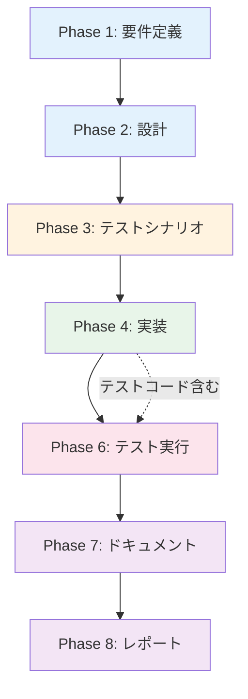

# プロジェクト計画書: Issue #437

**タイトル**: [TASK] Jenkins AgentのCloudWatchメモリモニタリング実装
**Issue番号**: #437
**作成日**: 2025-01-XX
**複雑度**: 中程度
**見積もり工数**: 8~12時間

---

## 1. Issue分析

### 複雑度: 中程度

**判定理由**:
- 複数ファイルの修正が必要（Pulumiスタック、Ansibleロール）
- 既存インフラへの機能追加（IAM権限、CloudWatch Agent設定）
- CloudWatch Agent設定の最適化が必要（コスト効率化）
- AWS Image Builder経由のAMI作成プロセスとの統合が必要

**複雑度の根拠**:
- 単純なコード追加ではなく、インフラストラクチャ全体への影響を考慮する必要がある
- CloudWatch Agentの設定は、スポットインスタンスの特性（頻繁な入れ替わり）を考慮した最適化が必要
- AMI作成プロセス（Packer/AWS Image Builder）とAnsibleロールの両方に変更が必要

### 見積もり工数: 8~12時間

**内訳**:
- 要件定義: 1時間
- 設計: 2~3時間（CloudWatch Agent設定の最適化検討含む）
- テストシナリオ作成: 1時間
- 実装: 3~4時間（Pulumi + Ansible + 設定ファイル）
- テスト実行: 1~2時間（dev環境デプロイ、メトリクス確認）
- ドキュメント更新: 1時間

**根拠**:
- Pulumiスタックの変更は比較的シンプル（IAMポリシーアタッチのみ）
- Ansibleロールの変更は中程度の複雑さ（CloudWatch Agentインストール、設定ファイル配置）
- CloudWatch Agent設定の最適化（コスト削減）に時間が必要
- AMI作成プロセスとの統合に追加時間が必要

### リスク評価: 中

**リスク要因**:
1. **コスト最適化の実装ミス**: Dimensionの設定ミスによりメトリクス数が爆発的に増加する可能性
2. **AMI作成プロセスへの影響**: Jenkins Agent AMIビルドプロセス（AWS Image Builder）への影響
3. **CloudWatch Agent設定の互換性**: Amazon Linux 2023での動作確認
4. **スポットインスタンスでの動作**: インスタンス入れ替わり時のエージェント動作

**軽減策**:
- dev環境で十分なテストを実施
- CloudWatch Agentの公式ドキュメントに準拠した設定
- コスト監視を初期段階で実施（最初の1週間）

---

## 2. 実装戦略判断

### 実装戦略: EXTEND

**判断根拠**:
このタスクは既存インフラへの機能追加であり、新規コンポーネントの作成ではありません。

**詳細**:
- **Pulumiスタック**: `pulumi/jenkins-agent/index.ts` の既存IAMロール定義に権限追加
- **Ansibleロール**: `ansible/roles/jenkins_agent_ami/` に CloudWatch Agent セットアップタスクを追加
- **設定ファイル**: CloudWatch Agent設定ファイル（JSON）を新規作成してテンプレート配置

**新規作成が不要な理由**:
- jenkins-agentスタックは既に存在
- jenkins_agent_amiロールも既に存在
- 既存のAMIビルドプロセスに統合可能

### テスト戦略: INTEGRATION_ONLY

**判断根拠**:
このタスクはインフラストラクチャの設定変更であり、ビジネスロジックのテストではありません。

**詳細**:
- **インテグレーションテスト**: dev環境でのデプロイとメトリクス収集確認が中心
- **ユニットテスト不要**: CloudWatch Agent設定はJSONファイルであり、ロジックテストは不適切
- **BDDテスト不要**: エンドユーザー向け機能ではなく、インフラ監視機能

**テスト内容**:
1. AMIビルド成功確認
2. CloudWatch Agentサービス起動確認
3. CloudWatchコンソールでメトリクス表示確認
4. インスタンス入れ替わり後のメトリクス継続確認

### テストコード戦略: CREATE_TEST

**判断根拠**:
CloudWatch Agent設定の検証は、既存テストコードに統合するよりも、独立したテストプレイブックを作成する方が適切です。

**詳細**:
- **新規テストプレイブック**: `ansible/playbooks/test/test-cloudwatch-agent.yml` を作成
- **検証内容**:
  - CloudWatch Agentサービスの起動状態確認
  - メトリクスが正しくCloudWatchに送信されているか確認
  - Dimension設定の正確性確認（AutoScalingGroupNameのみ）

**既存テスト拡張が不適切な理由**:
- 既存のJenkinsテストは主にJenkins機能のテスト
- CloudWatch監視は独立した関心事
- 再利用可能な独立したテストプレイブックとして作成すべき

---

## 3. 影響範囲分析

### 既存コードへの影響

#### 変更が必要なファイル・モジュール

**Pulumiスタック（1ファイル）**:
- `pulumi/jenkins-agent/index.ts`
  - IAMロール `jenkinsAgentRole` に `CloudWatchAgentServerPolicy` をアタッチ
  - 変更箇所: 約170行目付近（adminPolicyの後）

**Ansibleロール（2~3ファイル）**:
- `ansible/roles/jenkins_agent_ami/tasks/deploy.yml`
  - CloudWatch Agentセットアップタスクの呼び出し追加
- `ansible/roles/jenkins_agent_ami/tasks/setup_cloudwatch_agent.yml`（新規作成）
  - CloudWatch Agentインストール
  - 設定ファイル配置
  - サービス起動・有効化
- `ansible/roles/jenkins_agent_ami/templates/cloudwatch-agent-config.json.j2`（新規作成）
  - CloudWatch Agent設定テンプレート
  - AutoScalingGroupName Dimensionのみ設定

**ドキュメント（1ファイル）**:
- `ansible/README.md`
  - CloudWatchモニタリング機能の追加を記載

### 依存関係の変更

**新規依存の追加**:
- なし（CloudWatch AgentはAmazon公式パッケージ、amazon-cloudwatch-agentパッケージ）

**既存依存の変更**:
- なし

**IAM権限の追加**:
- Jenkins Agent IAMロールに `CloudWatchAgentServerPolicy` マネージドポリシーをアタッチ
  - CloudWatch Logs、CloudWatch Metricsへの書き込み権限
  - SSM Parameter Storeからの設定読み取り権限（CloudWatch Agent設定用）

### マイグレーション要否

**データベーススキーマ変更**: なし

**設定ファイル変更**:
- **新規追加**: CloudWatch Agent設定ファイル（`/opt/aws/amazon-cloudwatch-agent/etc/amazon-cloudwatch-agent.json`）
- **既存設定への影響**: なし

**AMI再作成**: 必要
- 理由: CloudWatch Agentをプリインストールする必要がある
- 影響: 新規AMIビルド（30~45分）が必要
- 既存インスタンスへの影響: 次回スポットインスタンス入れ替わり時に新AMIが適用される

**SSMパラメータ**: 変更不要
- CloudWatch Agent設定はファイルベースで管理

---

## 4. タスク分割

### Phase 1: 要件定義 (見積もり: 1h)

- [ ] Task 1-1: 機能要件の明確化 (0.5h)
  - CloudWatch Agentで収集するメトリクスの確定（メモリ使用率、使用量、空き容量）
  - メトリクス送信間隔の決定（1分間隔）
  - Namespace、Dimension設定の確定（Namespace: CWAgent、Dimension: AutoScalingGroupNameのみ）
- [ ] Task 1-2: 非機能要件の確認 (0.5h)
  - コスト目標の確認（約$0.60-1.0/月、インスタンス台数非依存）
  - アラート不要の確認
  - メトリクス保持期間の確認（CloudWatchデフォルト: 15ヶ月）

### Phase 2: 設計 (見積もり: 2~3h)

- [x] Task 2-1: CloudWatch Agent設定の設計 (1~1.5h)
  - 設定ファイル（JSON）の構造設計
  - コスト最適化のためのDimension設計（AutoScalingGroupNameのみ）
  - メトリクス集約設定の設計
- [x] Task 2-2: Pulumi変更設計 (0.5h)
  - IAMポリシーアタッチ箇所の特定
  - 既存コードへの影響範囲確認
- [x] Task 2-3: Ansible変更設計 (1h)
  - CloudWatch Agentインストール手順の設計
  - 設定ファイル配置方法の設計
  - サービス起動・有効化方法の設計
  - AMIビルドプロセスへの統合方法の設計

### Phase 3: テストシナリオ (見積もり: 1h)

- [x] Task 3-1: インテグレーションテストシナリオ作成 (1h)
  - AMIビルド成功確認シナリオ
  - CloudWatch Agentサービス起動確認シナリオ
  - メトリクス送信確認シナリオ（CloudWatchコンソール確認）
  - インスタンス入れ替わり時のメトリクス継続確認シナリオ
  - コスト確認シナリオ（1週間後の確認）

### Phase 4: 実装 (見積もり: 3~4h)

- [x] Task 4-1: Pulumiスタック変更 (0.5h)
  - `pulumi/jenkins-agent/index.ts` のIAMロールに `CloudWatchAgentServerPolicy` 追加
  - コード変更箇所: 約170行目付近（`adminPolicy`の後）
  - 実装完了: 171-175行目にCloudWatchAgentServerPolicyをアタッチ
- [x] Task 4-2: CloudWatch Agent設定（AWS Image Builder経由） (1h)
  - **実装方法変更**: Ansibleロールではなく、AWS Image Builderコンポーネントに直接実装
  - `pulumi/jenkins-agent-ami/component-x86.yml` 修正
  - `pulumi/jenkins-agent-ami/component-arm.yml` 修正
  - メモリメトリクス設定（mem_used_percent, mem_used, mem_available）
  - Dimension設定（AutoScalingGroupNameのみ）
  - 集約間隔設定（60秒）
  - HEREDOCで設定ファイルを直接配置
- [x] Task 4-3: Image Builderコンポーネント変更 (1.5~2h)
  - **実装方法変更**: Ansibleロール経由ではなく、Image Builderコンポーネントに直接実装
  - `InstallCloudWatchAgent` ステップ追加（dnf install）
  - `ConfigureCloudWatchAgent` ステップ追加（設定ファイル配置）
  - `EnableCloudWatchAgent` ステップ追加（systemd有効化）
  - `ValidateInstallation` ステップ拡張（検証コマンド追加）
  - x86とARMの両方に同じ実装を適用
- [x] Task 4-4: テストプレイブック作成 (1h)
  - `ansible/playbooks/test/test-cloudwatch-agent.yml` 新規作成
    - CloudWatch Agentサービス状態確認
    - 設定ファイル存在確認
    - メトリクス送信確認（AWS CLIでメトリクス取得）
    - Dimension設定確認
- [x] Task 4-5: ドキュメント更新（Phase 7から前倒し）
  - `ansible/README.md` にCloudWatchモニタリングセクション追加
  - テストプレイブック一覧に `test-cloudwatch-agent.yml` 追加

### Phase 5: テストコード実装 (見積もり: 0h)

- [x] Task 5-1: テストコード実装はPhase 4に統合済み (0h)
  - Phase 4でテストプレイブックを作成済み

### Phase 6: テスト実行 (見積もり: 1~2h)

- [x] Task 6-1: ローカル環境でのシンタックスチェック (0.5h)
  - Ansible Playbookシンタックスチェック
  - JSON設定ファイルのバリデーション
  - Pulumiプレビュー実行
- [ ] Task 6-2: dev環境でのデプロイテスト (1~1.5h)
  - Jenkins Agent AMI再作成（trigger_ami_build=true）
  - AMIビルド完了確認（30~45分）
  - 新AMIでのスポットインスタンス起動確認
  - CloudWatch Agentサービス起動確認
  - CloudWatchコンソールでメトリクス確認
  - インスタンス入れ替わり後のメトリクス継続確認

### Phase 7: ドキュメント (見積もり: 1h)

- [x] Task 7-1: README更新 (0.5h)
  - `ansible/README.md` にCloudWatchモニタリング機能追加を記載
  - メトリクス収集内容の説明
  - コスト情報の記載
- [x] Task 7-2: 設定手順のドキュメント化 (0.5h)
  - CloudWatch Agentの有効化/無効化手順
  - メトリクス確認手順（CloudWatchコンソール）
  - トラブルシューティング情報

### Phase 8: レポート (見積もり: 0.5h)

- [ ] Task 8-1: 実装レポート作成 (0.5h)
  - 実装内容のサマリー
  - テスト結果
  - コスト実績（1週間後に追加更新）
  - 既知の制限事項

---

## 5. 依存関係



**タスク間の依存関係詳細**:
- Phase 1 → Phase 2: 要件が確定しないと設計できない
- Phase 2 → Phase 3: 設計が確定しないとテストシナリオを作成できない
- Phase 3 → Phase 4: テストシナリオが確定しないと実装できない
- Phase 4 → Phase 6: 実装が完了しないとテストできない
- Phase 6 → Phase 7: テスト結果を踏まえてドキュメント作成
- Phase 7 → Phase 8: ドキュメントを含めた最終レポート作成

**Phase 5（テストコード実装）を省略した理由**:
- インテグレーションテストのみで十分
- テストプレイブックはPhase 4で実装済み
- 独立したフェーズとして分離する必要なし

---

## 6. リスクと軽減策

### リスク1: コスト最適化の実装ミス

- **影響度**: 高
- **確率**: 中
- **軽減策**:
  - CloudWatch Agent設定でDimensionを明示的に `AutoScalingGroupName` のみに制限
  - インスタンスIDをDimensionに含めない（デフォルトで含まれるため要注意）
  - dev環境で1週間コストモニタリングを実施
  - 予想コスト（約$0.60-1.0/月）を超えた場合はアラート
  - 設定ファイルをコードレビューで重点確認

### リスク2: AMI作成プロセスへの影響

- **影響度**: 中
- **確率**: 低
- **軽減策**:
  - AWS Image Builderパイプラインの既存成功実績を確認
  - CloudWatch Agentインストールはパッケージマネージャー経由で実施（安定性高い）
  - AMIビルド失敗時のロールバック手順を事前確認
  - dev環境で複数回のAMIビルドテストを実施

### リスク3: CloudWatch Agent設定の互換性

- **影響度**: 中
- **確率**: 低
- **軽減策**:
  - Amazon Linux 2023公式ドキュメントに準拠
  - CloudWatch Agent公式設定例を参考にする
  - 最小限の設定から開始（メモリメトリクスのみ）
  - 設定ファイルのJSON構文バリデーション実施

### リスク4: スポットインスタンスでの動作

- **影響度**: 中
- **確率**: 中
- **軽減策**:
  - インスタンス入れ替わり時のメトリクス継続性をテスト
  - AutoScalingGroupName Dimensionにより、個別インスタンスIDに依存しない設計
  - スポットインスタンス再起動後のCloudWatch Agent自動起動確認
  - systemdサービスとして登録し、OS再起動時に自動起動するように設定

### リスク5: メトリクスデータの欠損

- **影響度**: 低
- **確率**: 低
- **軽減策**:
  - CloudWatch Agentのログ出力を有効化（/var/log/amazon-cloudwatch-agent/）
  - メトリクス送信間隔を短く設定（60秒）
  - 初期1週間は毎日メトリクス確認
  - メトリクスが途切れた場合のトラブルシューティング手順をドキュメント化

---

## 7. 品質ゲート

### Phase 1: 要件定義

- [ ] 機能要件が明確に記載されている（収集メトリクス、送信間隔、Namespace、Dimension）
- [ ] 非機能要件が明確に記載されている（コスト目標、アラート不要、保持期間）
- [ ] 受け入れ基準が定義されている（CloudWatchコンソールでメトリクス確認可能）
- [ ] ステークホルダーの合意が得られている

### Phase 2: 設計

- [ ] 実装戦略の判断根拠が明記されている（EXTEND）
- [ ] テスト戦略の判断根拠が明記されている（INTEGRATION_ONLY）
- [ ] テストコード戦略の判断根拠が明記されている（CREATE_TEST）
- [ ] CloudWatch Agent設定の詳細設計が完了している（JSON構造、Dimension設定）
- [ ] Pulumi変更箇所が特定されている（IAMロール、ポリシーアタッチ）
- [ ] Ansible変更箇所が特定されている（タスク追加、テンプレート作成）
- [ ] AMIビルドプロセスへの統合方法が設計されている

### Phase 3: テストシナリオ

- [x] インテグレーションテストシナリオが作成されている
- [x] テストシナリオがすべての主要機能をカバーしている
  - AMIビルド成功
  - CloudWatch Agentサービス起動
  - メトリクス送信
  - インスタンス入れ替わり後の継続性
- [x] テストシナリオが検証可能である（成功/失敗の判定基準が明確）

### Phase 4: 実装

- [ ] Pulumiコードがシンタックスチェックを通過している
- [ ] Ansibleプレイブックがシンタックスチェックを通過している
- [ ] CloudWatch Agent設定ファイル（JSON）が構文的に正しい
- [ ] コードレビューが完了している
- [ ] コーディング規約に準拠している（CLAUDE.md、CONTRIBUTION.md）

### Phase 6: テスト実行

- [ ] すべてのインテグレーションテストが成功している
- [ ] dev環境でAMIビルドが成功している
- [ ] CloudWatch Agentサービスが正常に起動している
- [ ] CloudWatchコンソールでメトリクスが確認できている
- [ ] インスタンス入れ替わり後もメトリクスが継続している
- [ ] コスト見積もりが予想範囲内である（約$0.60-1.0/月）

### Phase 7: ドキュメント

- [x] README.mdが更新されている
- [x] 設定手順がドキュメント化されている
- [x] トラブルシューティング情報が追加されている
- [x] ドキュメントが第三者にとって理解可能である

### Phase 8: レポート

- [ ] 実装レポートが作成されている
- [ ] テスト結果が記録されている
- [ ] コスト実績が記録されている（1週間後に追加更新）
- [ ] 既知の制限事項が記載されている

---

## 8. 補足情報

### CloudWatch Agent設定の重要ポイント

**コスト最適化のための設定**:
```json
{
  "metrics": {
    "namespace": "CWAgent",
    "metrics_collected": {
      "mem": {
        "measurement": [
          {"name": "mem_used_percent"},
          {"name": "mem_used"},
          {"name": "mem_available"}
        ],
        "metrics_collection_interval": 60
      }
    },
    "append_dimensions": {
      "AutoScalingGroupName": "${aws:AutoScalingGroupName}"
    }
  }
}
```

**重要な注意点**:
1. **Dimensionは `AutoScalingGroupName` のみ**: インスタンスIDを含めない
2. **`append_dimensions` の使用**: デフォルトDimensionを上書きしてコスト削減
3. **集約間隔**: 60秒（デフォルト）で十分

### AMIビルドプロセスとの統合

**既存プロセス**:
- AWS Image BuilderによるAMI自動作成
- Packerスクリプトによるプロビジョニング
- Ansibleロール `jenkins_agent_ami` による設定

**統合方法**:
- `jenkins_agent_ami` ロールにCloudWatch Agentセットアップタスクを追加
- AMIビルド時にCloudWatch Agentをプリインストール
- 起動時には設定ファイルが既に配置済みの状態

### 参考リンク

- [CloudWatch Agent公式ドキュメント](https://docs.aws.amazon.com/AmazonCloudWatch/latest/monitoring/Install-CloudWatch-Agent.html)
- [CloudWatch Agent設定リファレンス](https://docs.aws.amazon.com/AmazonCloudWatch/latest/monitoring/CloudWatch-Agent-Configuration-File-Details.html)
- [CloudWatch カスタムメトリクス料金](https://aws.amazon.com/cloudwatch/pricing/)
- [Amazon Linux 2023 CloudWatch Agent](https://docs.aws.amazon.com/linux/al2023/ug/monitoring-cloudwatch-agent.html)

---

**計画書バージョン**: 1.0
**最終更新日**: 2025-01-XX
