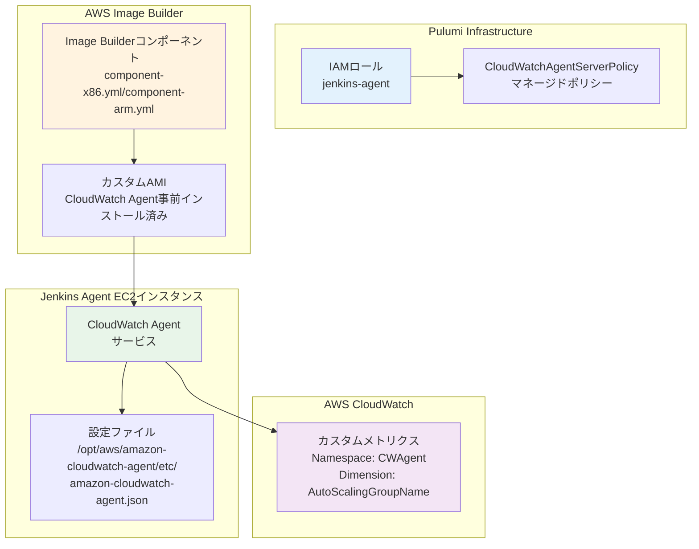
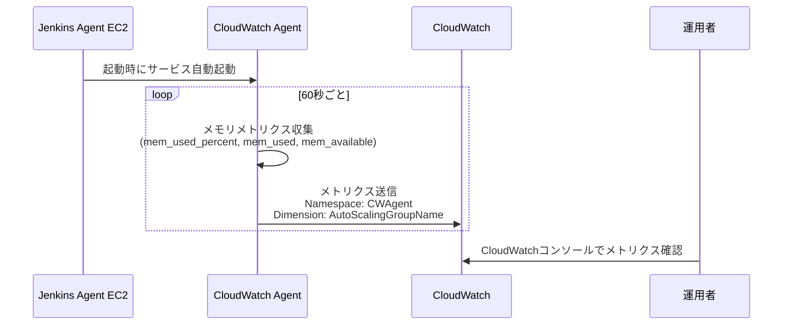
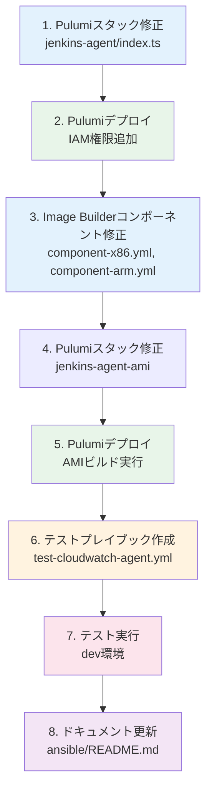

# 詳細設計書: Issue #437

**タイトル**: [TASK] Jenkins AgentのCloudWatchメモリモニタリング実装
**Issue番号**: #437
**作成日**: 2025-01-XX
**バージョン**: 1.0

---

## 0. Planning Documentの確認

Planning Phaseで策定された開発計画を確認しました：

### 実装戦略
- **EXTEND**: 既存インフラへの機能追加
  - Pulumiスタック `jenkins-agent` のIAMロール定義に権限追加
  - AWS Image Builderコンポーネント `component-x86.yml`, `component-arm.yml` にCloudWatch Agentインストール手順を追加
  - CloudWatch Agent設定ファイルをテンプレート配置

### テスト戦略
- **INTEGRATION_ONLY**: インテグレーションテストのみ実施
  - AMIビルド成功確認
  - CloudWatch Agentサービス起動確認
  - CloudWatchコンソールでメトリクス確認
  - インスタンス入れ替わり後のメトリクス継続確認

### テストコード戦略
- **CREATE_TEST**: 独立したテストプレイブックを作成
  - `ansible/playbooks/test/test-cloudwatch-agent.yml` を新規作成
  - 既存テストとは独立した関心事として管理

### 複雑度とスケジュール
- **複雑度**: 中程度
- **見積もり工数**: 8~12時間
- **主要なリスク**: コスト最適化の実装ミス、AMI作成プロセスへの影響

この計画に基づき、以下の詳細設計を実施します。

---

## 1. アーキテクチャ設計

### 1.1. システム全体図



### 1.2. コンポーネント間の関係

**デプロイ時のフロー**:
1. Pulumiスタック `jenkins-agent` をデプロイ
   - IAMロールに `CloudWatchAgentServerPolicy` をアタッチ
2. Pulumiスタック `jenkins-agent-ami` をデプロイ
   - Image Builderコンポーネントを更新（CloudWatch Agentインストール手順を追加）
   - Image Builderパイプラインを実行してカスタムAMIを作成
3. Jenkins AgentがカスタムAMIから起動
   - CloudWatch Agentサービスが自動起動
   - メトリクスの送信を開始

**ランタイム時のフロー**:
1. CloudWatch Agentがメモリメトリクスを60秒間隔で収集
2. `AutoScalingGroupName` Dimensionのみを付与してCloudWatchに送信
3. CloudWatchコンソールでメトリクスを確認可能

### 1.3. データフロー



---

## 2. 実装戦略判断

### 実装戦略: EXTEND

**判断根拠**:
このタスクは既存インフラへの機能追加であり、新規コンポーネントの作成ではありません。

**詳細**:
1. **Pulumiスタック `jenkins-agent/index.ts`**: 既存IAMロール定義に権限追加（約170行目付近）
   - `CloudWatchAgentServerPolicy` マネージドポリシーをアタッチ
   - 既存の `adminPolicy` の後に追加
2. **AWS Image Builderコンポーネント**: `component-x86.yml`, `component-arm.yml` に新規ステップを追加
   - CloudWatch Agentインストール手順を追加
   - 設定ファイル配置手順を追加
   - サービス起動・有効化手順を追加
3. **テストプレイブック**: `ansible/playbooks/test/test-cloudwatch-agent.yml` を新規作成
   - 既存テストとは独立した検証を実施

**新規スタック作成が不要な理由**:
- `jenkins-agent` スタックは既に存在
- `jenkins-agent-ami` スタックも既に存在
- 既存のAMIビルドプロセスに統合可能

---

## 3. テスト戦略判断

### テスト戦略: INTEGRATION_ONLY

**判断根拠**:
このタスクはインフラストラクチャの設定変更であり、ビジネスロジックのテストではありません。

**詳細**:
- **インテグレーションテスト**: dev環境でのデプロイとメトリクス収集確認が中心
  1. AMIビルド成功確認
  2. CloudWatch Agentサービス起動確認
  3. CloudWatchコンソールでメトリクス確認
  4. インスタンス入れ替わり後のメトリクス継続確認
- **ユニットテスト不要**: CloudWatch Agent設定はJSONファイルであり、ロジックテストは不適切
- **BDDテスト不要**: エンドユーザー向け機能ではなく、インフラ監視機能

**テスト内容**:
1. AMIビルド成功確認（AWS Image Builderパイプライン実行成功）
2. CloudWatch Agentサービス起動確認（`systemctl status amazon-cloudwatch-agent`）
3. CloudWatchコンソールでメトリクス表示確認（Namespace: `CWAgent`）
4. インスタンス入れ替わり後のメトリクス継続確認（SpotFleet入れ替わりテスト）

---

## 4. テストコード戦略判断

### テストコード戦略: CREATE_TEST

**判断根拠**:
CloudWatch Agent設定の検証は、既存テストコードに統合するよりも、独立したテストプレイブックを作成する方が適切です。

**詳細**:
- **新規テストプレイブック**: `ansible/playbooks/test/test-cloudwatch-agent.yml` を作成
- **検証内容**:
  - CloudWatch Agentサービスの起動状態確認
  - メトリクスが正しくCloudWatchに送信されているか確認
  - Dimension設定の正確性確認（`AutoScalingGroupName` のみ）

**既存テスト拡張が不適切な理由**:
- 既存のJenkinsテストは主にJenkins機能のテスト
- CloudWatch監視は独立した関心事
- 再利用可能な独立したテストプレイブックとして作成すべき

---

## 5. 影響範囲分析

### 5.1. 既存コードへの影響

#### 変更が必要なファイル

**Pulumiスタック（1ファイル）**:
- `pulumi/jenkins-agent/index.ts`
  - 変更箇所: 約170行目付近（`adminPolicy` の後）
  - 変更内容: `CloudWatchAgentServerPolicy` マネージドポリシーのアタッチ

**AWS Image Builderコンポーネント（2ファイル）**:
- `pulumi/jenkins-agent-ami/component-x86.yml`
  - 変更箇所: `build` フェーズに新規ステップを追加
  - 変更内容: CloudWatch Agentのインストール、設定、起動
- `pulumi/jenkins-agent-ami/component-arm.yml`
  - 変更箇所: `build` フェーズに新規ステップを追加
  - 変更内容: CloudWatch Agentのインストール、設定、起動（x86と同じ）

**テストプレイブック（1ファイル・新規作成）**:
- `ansible/playbooks/test/test-cloudwatch-agent.yml`
  - 新規作成
  - 内容: CloudWatch Agent動作検証

**ドキュメント（1ファイル）**:
- `ansible/README.md`
  - 変更箇所: CloudWatchモニタリング機能のセクションを追加
  - 変更内容: 機能説明、メトリクス一覧、確認手順、コスト情報

### 5.2. 依存関係の変更

**新規依存の追加**:
- CloudWatch Agentパッケージ（`amazon-cloudwatch-agent`）
  - Amazon公式パッケージ
  - `dnf install -y amazon-cloudwatch-agent` でインストール

**既存依存の変更**:
- なし

**IAM権限の追加**:
- Jenkins Agent IAMロールに `CloudWatchAgentServerPolicy` マネージドポリシーをアタッチ
  - CloudWatch Logs、CloudWatch Metricsへの書き込み権限
  - SSM Parameter Storeからの設定読み取り権限（CloudWatch Agent設定用）

### 5.3. マイグレーション要否

**データベーススキーマ変更**: なし

**設定ファイル変更**:
- **新規追加**: CloudWatch Agent設定ファイル
  - パス: `/opt/aws/amazon-cloudwatch-agent/etc/amazon-cloudwatch-agent.json`
  - 内容: メモリメトリクス収集設定、Dimension設定
- **既存設定への影響**: なし

**AMI再作成**: 必要
- 理由: CloudWatch Agentをプリインストールする必要がある
- 影響: 新規AMIビルド（30~45分）が必要
- 既存インスタンスへの影響: 次回スポットインスタンス入れ替わり時に新AMIが適用される

**SSMパラメータ**: 変更不要
- CloudWatch Agent設定はファイルベースで管理

---

## 6. 変更・追加ファイルリスト

### 6.1. 新規作成ファイル

| ファイルパス | 目的 | 説明 |
|------------|------|------|
| `ansible/playbooks/test/test-cloudwatch-agent.yml` | テストプレイブック | CloudWatch Agent動作検証 |

### 6.2. 修正が必要な既存ファイル

| ファイルパス | 変更箇所 | 変更内容 |
|------------|---------|---------|
| `pulumi/jenkins-agent/index.ts` | 約170行目付近（`adminPolicy` の後） | `CloudWatchAgentServerPolicy` マネージドポリシーのアタッチ |
| `pulumi/jenkins-agent-ami/component-x86.yml` | `build` フェーズ | CloudWatch Agentインストール・設定・起動ステップを追加 |
| `pulumi/jenkins-agent-ami/component-arm.yml` | `build` フェーズ | CloudWatch Agentインストール・設定・起動ステップを追加 |
| `ansible/README.md` | CloudWatchモニタリングセクション | 機能説明、メトリクス一覧、確認手順、コスト情報を追加 |

### 6.3. 削除が必要なファイル

なし

---

## 7. 詳細設計

### 7.1. Pulumiスタック設計（jenkins-agent/index.ts）

#### 変更箇所

```typescript
// 行番号: 約170行目付近（adminPolicyの後）

// Pulumiを使用したインフラストラクチャ管理のため、AdministratorAccessポリシーをアタッチ
// 注意: Pulumiで様々なAWSリソースを管理するため、広範な権限が必要
const adminPolicy = new aws.iam.RolePolicyAttachment(`agent-admin-policy`, {
    role: jenkinsAgentRole.name,
    policyArn: "arn:aws:iam::aws:policy/AdministratorAccess",
});

// CloudWatch Agent用のマネージドポリシーをアタッチ
const cloudWatchAgentPolicy = new aws.iam.RolePolicyAttachment(`agent-cloudwatch-policy`, {
    role: jenkinsAgentRole.name,
    policyArn: "arn:aws:iam::aws:policy/CloudWatchAgentServerPolicy",
});

// SSMパラメータストア追加権限（ダッシュボード用）
// AdministratorAccessに含まれているが、明示的に記載
const ssmParameterReadPolicy = new aws.iam.Policy(`agent-ssm-parameter-policy`, {
    // ... 既存コード
```

#### 設計のポイント

1. **ポリシーアタッチの位置**: `adminPolicy` の直後に追加
2. **リソース名**: `agent-cloudwatch-policy`（既存の命名規則に従う）
3. **マネージドポリシーARN**: `arn:aws:iam::aws:policy/CloudWatchAgentServerPolicy`
4. **コメント**: CloudWatch Agent用であることを明記

### 7.2. AWS Image Builderコンポーネント設計

#### 7.2.1. component-x86.yml / component-arm.yml

**追加するステップ**（両ファイル共通）:

```yaml
# 既存の InstallMitogen ステップの後に追加

      - name: InstallCloudWatchAgent
        action: ExecuteBash
        inputs:
          commands:
            - echo "Installing CloudWatch Agent..."
            - dnf install -y amazon-cloudwatch-agent
            - amazon-cloudwatch-agent-ctl --version

      - name: ConfigureCloudWatchAgent
        action: ExecuteBash
        inputs:
          commands:
            - echo "Configuring CloudWatch Agent..."
            - mkdir -p /opt/aws/amazon-cloudwatch-agent/etc
            - |
              cat > /opt/aws/amazon-cloudwatch-agent/etc/amazon-cloudwatch-agent.json << 'EOF'
              {
                "metrics": {
                  "namespace": "CWAgent",
                  "metrics_collected": {
                    "mem": {
                      "measurement": [
                        {"name": "mem_used_percent"},
                        {"name": "mem_used"},
                        {"name": "mem_available"}
                      ],
                      "metrics_collection_interval": 60
                    }
                  },
                  "append_dimensions": {
                    "AutoScalingGroupName": "${aws:AutoScalingGroupName}"
                  }
                }
              }
              EOF
            - cat /opt/aws/amazon-cloudwatch-agent/etc/amazon-cloudwatch-agent.json

      - name: EnableCloudWatchAgent
        action: ExecuteBash
        inputs:
          commands:
            - echo "Enabling CloudWatch Agent service..."
            - systemctl enable amazon-cloudwatch-agent
            - echo "CloudWatch Agent will start automatically on instance boot"

# 既存の CleanupCache ステップへ続く
```

**`validate` フェーズへの追加**:

```yaml
  - name: validate
    steps:
      # 既存の ValidateInstallation ステップに以下を追加
      - name: ValidateInstallation
        action: ExecuteBash
        inputs:
          commands:
            # ... 既存のコマンド
            - amazon-cloudwatch-agent-ctl --version
            - test -f /opt/aws/amazon-cloudwatch-agent/etc/amazon-cloudwatch-agent.json
            - echo "Checking CloudWatch Agent configuration..."
            - cat /opt/aws/amazon-cloudwatch-agent/etc/amazon-cloudwatch-agent.json
            - systemctl is-enabled amazon-cloudwatch-agent
```

#### 7.2.2. CloudWatch Agent設定ファイル詳細

**設定ファイルパス**: `/opt/aws/amazon-cloudwatch-agent/etc/amazon-cloudwatch-agent.json`

**設定内容**:
```json
{
  "metrics": {
    "namespace": "CWAgent",
    "metrics_collected": {
      "mem": {
        "measurement": [
          {"name": "mem_used_percent"},
          {"name": "mem_used"},
          {"name": "mem_available"}
        ],
        "metrics_collection_interval": 60
      }
    },
    "append_dimensions": {
      "AutoScalingGroupName": "${aws:AutoScalingGroupName}"
    }
  }
}
```

**重要な設計判断**:

1. **Namespace**: `CWAgent`
   - CloudWatch Agentのデフォルト
   - カスタムメトリクスとして識別可能
2. **Dimension**: `AutoScalingGroupName` のみ
   - インスタンスIDを含めない（コスト最適化）
   - スポットインスタンスが何回入れ替わってもメトリクス数が増えない
3. **メトリクス送信間隔**: 60秒
   - CloudWatch Agentのデフォルト
   - 十分な監視頻度
4. **収集メトリクス**:
   - `mem_used_percent`: メモリ使用率（パーセント）
   - `mem_used`: メモリ使用量（バイト）
   - `mem_available`: メモリ空き容量（バイト）

#### 7.2.3. コスト最適化の設計根拠

**問題点（デフォルト設定の場合）**:
```
インスタンスIDがDimensionに含まれる
↓
スポットインスタンスが10回入れ替わる
↓
10個のインスタンス × 3メトリクス = 30メトリクス
↓
30メトリクス × $0.30/メトリクス/月 = $9/月
```

**解決策（AutoScalingGroupNameのみの場合）**:
```
AutoScalingGroupNameのみをDimensionに指定
↓
スポットインスタンスが何回入れ替わっても同じDimension
↓
1個のASG × 3メトリクス = 3メトリクス
↓
3メトリクス × $0.30/メトリクス/月 = $0.90/月
```

**コスト削減効果**: 約10分の1（$9/月 → $0.90/月）

### 7.3. テストプレイブック設計

#### 7.3.1. ファイルパス

`ansible/playbooks/test/test-cloudwatch-agent.yml`

#### 7.3.2. プレイブック内容

```yaml
---
# CloudWatch Agent動作確認テストプレイブック

- name: Test CloudWatch Agent on Jenkins Agent instances
  hosts: localhost
  gather_facts: false
  vars:
    env_name: "{{ env | default('dev') }}"
    ssm_prefix: "/jenkins-infra/{{ env_name }}"
    aws_region: "{{ lookup('env', 'AWS_REGION') | default('ap-northeast-1', true) }}"

  tasks:
    - name: Get Jenkins Agent instance IDs from Spot Fleet
      ansible.builtin.include_role:
        name: aws_cli_helper
        tasks_from: execute
      vars:
        aws_command: >-
          aws ec2 describe-spot-fleet-instances
          --spot-fleet-request-id {{ lookup('aws_ssm', ssm_prefix + '/agent/spotFleetRequestId', region=aws_region) }}
          --query 'ActiveInstances[*].InstanceId'
          --output json
        operation_name: "Get Jenkins Agent instance IDs"
        parse_output: true

    - name: Set instance IDs fact
      ansible.builtin.set_fact:
        agent_instance_ids: "{{ aws_cli_result.stdout | from_json }}"

    - name: Fail if no agent instances found
      ansible.builtin.fail:
        msg: "No Jenkins Agent instances found in Spot Fleet"
      when: agent_instance_ids | length == 0

    - name: Display found instances
      ansible.builtin.debug:
        msg: "Found {{ agent_instance_ids | length }} Jenkins Agent instance(s): {{ agent_instance_ids }}"

    # テスト1: CloudWatch Agentサービス起動確認
    - name: Check CloudWatch Agent service status on each instance
      ansible.builtin.include_role:
        name: aws_cli_helper
        tasks_from: execute
      vars:
        aws_command: >-
          aws ssm send-command
          --instance-ids {{ item }}
          --document-name "AWS-RunShellScript"
          --parameters 'commands=["systemctl is-active amazon-cloudwatch-agent"]'
          --query 'Command.CommandId'
          --output text
        operation_name: "Check CloudWatch Agent service on {{ item }}"
        parse_output: true
      loop: "{{ agent_instance_ids }}"
      register: service_check_commands

    - name: Wait for service check commands to complete
      ansible.builtin.pause:
        seconds: 5

    - name: Get service check results
      ansible.builtin.include_role:
        name: aws_cli_helper
        tasks_from: execute
      vars:
        aws_command: >-
          aws ssm get-command-invocation
          --command-id {{ item.aws_cli_result.stdout | trim }}
          --instance-id {{ item.item }}
          --query 'StandardOutputContent'
          --output text
        operation_name: "Get service check result for {{ item.item }}"
        parse_output: true
      loop: "{{ service_check_commands.results }}"
      register: service_status_results

    - name: Verify CloudWatch Agent is active
      ansible.builtin.assert:
        that:
          - "'active' in item.aws_cli_result.stdout"
        fail_msg: "CloudWatch Agent service is not active on instance {{ item.item.item }}"
        success_msg: "CloudWatch Agent service is active on instance {{ item.item.item }}"
      loop: "{{ service_status_results.results }}"

    # テスト2: 設定ファイル存在確認
    - name: Check CloudWatch Agent configuration file exists
      ansible.builtin.include_role:
        name: aws_cli_helper
        tasks_from: execute
      vars:
        aws_command: >-
          aws ssm send-command
          --instance-ids {{ item }}
          --document-name "AWS-RunShellScript"
          --parameters 'commands=["test -f /opt/aws/amazon-cloudwatch-agent/etc/amazon-cloudwatch-agent.json && echo OK || echo NG"]'
          --query 'Command.CommandId'
          --output text
        operation_name: "Check config file on {{ item }}"
        parse_output: true
      loop: "{{ agent_instance_ids }}"
      register: config_check_commands

    - name: Wait for config check commands to complete
      ansible.builtin.pause:
        seconds: 5

    - name: Get config check results
      ansible.builtin.include_role:
        name: aws_cli_helper
        tasks_from: execute
      vars:
        aws_command: >-
          aws ssm get-command-invocation
          --command-id {{ item.aws_cli_result.stdout | trim }}
          --instance-id {{ item.item }}
          --query 'StandardOutputContent'
          --output text
        operation_name: "Get config check result for {{ item.item }}"
        parse_output: true
      loop: "{{ config_check_commands.results }}"
      register: config_file_results

    - name: Verify configuration file exists
      ansible.builtin.assert:
        that:
          - "'OK' in item.aws_cli_result.stdout"
        fail_msg: "CloudWatch Agent config file not found on instance {{ item.item.item }}"
        success_msg: "CloudWatch Agent config file exists on instance {{ item.item.item }}"
      loop: "{{ config_file_results.results }}"

    # テスト3: メトリクス送信確認（CloudWatch APIで確認）
    - name: Get AutoScalingGroup name
      ansible.builtin.include_role:
        name: aws_cli_helper
        tasks_from: execute
      vars:
        aws_command: >-
          aws ec2 describe-instances
          --instance-ids {{ agent_instance_ids[0] }}
          --query 'Reservations[0].Instances[0].Tags[?Key==`aws:autoscaling:groupName`].Value'
          --output text
        operation_name: "Get AutoScalingGroup name"
        parse_output: true

    - name: Set ASG name fact
      ansible.builtin.set_fact:
        asg_name: "{{ aws_cli_result.stdout | trim }}"

    - name: Wait for metrics to be sent (60 seconds)
      ansible.builtin.pause:
        seconds: 60
        prompt: "Waiting for CloudWatch Agent to send metrics..."

    - name: Check metrics in CloudWatch
      ansible.builtin.include_role:
        name: aws_cli_helper
        tasks_from: execute
      vars:
        aws_command: >-
          aws cloudwatch list-metrics
          --namespace CWAgent
          --dimensions Name=AutoScalingGroupName,Value={{ asg_name }}
          --query 'Metrics[*].MetricName'
          --output json
        operation_name: "List CloudWatch metrics for ASG {{ asg_name }}"
        parse_output: true

    - name: Set metrics fact
      ansible.builtin.set_fact:
        cloudwatch_metrics: "{{ aws_cli_result.stdout | from_json }}"

    - name: Verify required metrics exist
      ansible.builtin.assert:
        that:
          - "'mem_used_percent' in cloudwatch_metrics"
          - "'mem_used' in cloudwatch_metrics"
          - "'mem_available' in cloudwatch_metrics"
        fail_msg: "Required metrics not found in CloudWatch. Found: {{ cloudwatch_metrics }}"
        success_msg: "All required metrics are present in CloudWatch"

    # テスト4: Dimension設定確認
    - name: Verify only AutoScalingGroupName dimension is used
      ansible.builtin.include_role:
        name: aws_cli_helper
        tasks_from: execute
      vars:
        aws_command: >-
          aws cloudwatch list-metrics
          --namespace CWAgent
          --metric-name mem_used_percent
          --query 'Metrics[0].Dimensions[*].Name'
          --output json
        operation_name: "Check dimensions for mem_used_percent metric"
        parse_output: true

    - name: Set dimensions fact
      ansible.builtin.set_fact:
        metric_dimensions: "{{ aws_cli_result.stdout | from_json }}"

    - name: Verify dimension is AutoScalingGroupName only
      ansible.builtin.assert:
        that:
          - "metric_dimensions | length == 1"
          - "'AutoScalingGroupName' in metric_dimensions"
        fail_msg: "Unexpected dimensions found: {{ metric_dimensions }}. Expected only AutoScalingGroupName."
        success_msg: "Dimension configuration is correct (AutoScalingGroupName only)"

    # 最終結果表示
    - name: Display test summary
      ansible.builtin.debug:
        msg: |
          ========================================
          CloudWatch Agent Test Summary
          ========================================
          Environment: {{ env_name }}
          Tested Instances: {{ agent_instance_ids | length }}
          AutoScalingGroup: {{ asg_name }}

          ✅ CloudWatch Agent service is active
          ✅ Configuration file exists
          ✅ Metrics are being sent to CloudWatch
          ✅ Dimension configuration is correct

          Metrics found: {{ cloudwatch_metrics }}
          ========================================
```

#### 7.3.3. テストプレイブックの実行方法

```bash
# dev環境でテスト実行
cd ansible
ansible-playbook playbooks/test/test-cloudwatch-agent.yml -e "env=dev"
```

#### 7.3.4. テスト項目と期待結果

| テスト項目 | 確認方法 | 期待結果 |
|----------|---------|---------|
| CloudWatch Agentサービス起動確認 | `systemctl is-active amazon-cloudwatch-agent` | `active` が返される |
| 設定ファイル存在確認 | `/opt/aws/amazon-cloudwatch-agent/etc/amazon-cloudwatch-agent.json` の存在確認 | ファイルが存在する |
| メトリクス送信確認 | `aws cloudwatch list-metrics --namespace CWAgent` | `mem_used_percent`, `mem_used`, `mem_available` が存在 |
| Dimension設定確認 | メトリクスのDimension確認 | `AutoScalingGroupName` のみ |

### 7.4. ドキュメント更新設計

#### 7.4.1. ansible/README.md

**追加セクション**（適切な位置に挿入）:

```markdown
## CloudWatchモニタリング

### 概要
Jenkins Agentのメモリ使用状況をCloudWatchで監視できます。CloudWatch Agentを使用してメトリクスを収集し、CloudWatchコンソールで可視化します。

### 収集メトリクス

| メトリクス名 | 説明 | 単位 |
|------------|------|------|
| `mem_used_percent` | メモリ使用率 | パーセント |
| `mem_used` | メモリ使用量 | バイト |
| `mem_available` | メモリ空き容量 | バイト |

### メトリクス設定

- **Namespace**: `CWAgent`
- **Dimension**: `AutoScalingGroupName` のみ
- **送信間隔**: 60秒
- **コスト**: 約$0.60-1.0/月（固定、インスタンス台数に依存しない）

### CloudWatchコンソールでの確認手順

1. AWSコンソールでCloudWatchサービスを開く
2. 左メニューから「メトリクス」→「すべてのメトリクス」を選択
3. 「CWAgent」Namespaceを選択
4. 「AutoScalingGroupName」Dimensionを選択
5. Jenkins AgentのAutoScalingGroup名を選択
6. メトリクス（`mem_used_percent`, `mem_used`, `mem_available`）を選択してグラフ表示

### トラブルシューティング

#### メトリクスが表示されない場合

1. **CloudWatch Agentサービスの確認**:
   ```bash
   # SSM Session Managerでインスタンスに接続
   systemctl status amazon-cloudwatch-agent
   ```
   - サービスが起動していない場合: `systemctl start amazon-cloudwatch-agent`
   - サービスが有効化されていない場合: `systemctl enable amazon-cloudwatch-agent`

2. **設定ファイルの確認**:
   ```bash
   cat /opt/aws/amazon-cloudwatch-agent/etc/amazon-cloudwatch-agent.json
   ```
   - 設定ファイルが存在しない場合: AMIが古い可能性があります。最新のAMIを使用してください。

3. **IAM権限の確認**:
   - Jenkins Agent IAMロールに `CloudWatchAgentServerPolicy` がアタッチされているか確認

4. **ログの確認**:
   ```bash
   journalctl -u amazon-cloudwatch-agent -n 100
   ```

#### コストが予想より高い場合

- CloudWatchコンソールで実際のメトリクス数を確認
- Dimensionに `InstanceId` が含まれていないか確認（含まれている場合は設定ミス）
- 期待されるメトリクス数: 3個（`mem_used_percent`, `mem_used`, `mem_available`）

### テスト方法

CloudWatch Agent動作確認テストプレイブックを実行:
```bash
cd ansible
ansible-playbook playbooks/test/test-cloudwatch-agent.yml -e "env=dev"
```

このテストは以下を検証します:
- CloudWatch Agentサービスの起動状態
- 設定ファイルの存在
- メトリクスがCloudWatchに送信されているか
- Dimension設定の正確性（`AutoScalingGroupName` のみ）
```

---

## 8. セキュリティ考慮事項

### 8.1. 認証・認可

| 項目 | 実装内容 | セキュリティ対策 |
|-----|---------|----------------|
| IAM権限 | `CloudWatchAgentServerPolicy` マネージドポリシー | 最小権限の原則（CloudWatch書き込みのみ） |
| 認証方式 | IAMロールベース認証 | クレデンシャルのハードコーディングなし |
| アクセス制御 | IAMロールとインスタンスプロファイル | EC2インスタンスのみがアクセス可能 |

### 8.2. データ保護

| 項目 | 実装内容 | セキュリティ対策 |
|-----|---------|----------------|
| メトリクスデータ | CloudWatch API経由で転送 | HTTPS通信による暗号化 |
| 設定ファイル | `/opt/aws/amazon-cloudwatch-agent/etc/` に保存 | ファイルシステムレベルの権限制御（root所有） |
| 機密情報 | メトリクスには機密情報を含まない | メモリ使用量のみ（プロセス名等は含まない） |

### 8.3. セキュリティリスクと対策

| リスク | 影響度 | 対策 |
|-------|-------|------|
| IAM権限の過剰付与 | 低 | `CloudWatchAgentServerPolicy` は必要最小限の権限のみ |
| メトリクスデータの漏洩 | 低 | メモリ使用量のみで機密情報は含まれない |
| 設定ファイルの改ざん | 中 | AMI内に焼き込むことで起動時から正しい設定を保証 |
| CloudWatch Agent脆弱性 | 中 | Amazon公式パッケージを使用、定期的なAMI更新で対応 |

---

## 9. 非機能要件への対応

### 9.1. パフォーマンス

| 要件 | 目標値 | 実装内容 |
|-----|-------|---------|
| メトリクス送信間隔 | 60秒 | CloudWatch Agent設定で指定 |
| CloudWatch Agentメモリオーバーヘッド | 50MB以下 | デフォルト設定で十分 |
| CPU使用率への影響 | 1%以下 | メモリメトリクスのみ収集、軽量な処理 |
| Jenkins Agent起動時間への影響 | 5秒以下 | AMIに事前インストール済み、サービス自動起動 |

**パフォーマンス検証方法**:
- CloudWatch Agentのリソース使用状況を `top` コマンドで確認
- Jenkins Agent起動時間を比較（CloudWatch Agent有効化前後）

### 9.2. スケーラビリティ

| 項目 | 設計内容 | スケーラビリティ |
|-----|---------|----------------|
| メトリクス数 | 固定（3個） | インスタンス台数に依存しない |
| コスト | 約$0.60-1.0/月 | インスタンス台数が増えてもコストは一定 |
| Dimension設計 | `AutoScalingGroupName` のみ | スポットインスタンス入れ替わりに影響されない |

**スケーラビリティ検証方法**:
- インスタンス台数を変更してもメトリクス数が3個のままであることを確認
- CloudWatchコンソールでメトリクス数を確認

### 9.3. 保守性

| 項目 | 設計内容 | 保守性向上 |
|-----|---------|-----------|
| 設定管理 | AMI内に焼き込み | 設定の一貫性保証、手動設定不要 |
| テスト自動化 | テストプレイブック作成 | 動作確認の自動化 |
| ドキュメント | `ansible/README.md` 更新 | トラブルシューティング手順を提供 |
| バージョン管理 | AWS Image Builderコンポーネントで管理 | 変更履歴の追跡可能 |

**保守性向上のポイント**:
- CloudWatch Agent設定はAWS Image Builderコンポーネント内で管理
- 設定変更時はAMI再作成のみで反映可能
- テストプレイブックにより動作確認を自動化

---

## 10. 実装の順序

### 10.1. 推奨実装順序

以下の順序で実装することを推奨します：



### 10.2. 各ステップの詳細

#### ステップ1: Pulumiスタック修正（jenkins-agent/index.ts）

**作業内容**:
- `pulumi/jenkins-agent/index.ts` の約170行目付近に `CloudWatchAgentServerPolicy` のアタッチを追加
- シンタックスチェック実施

**所要時間**: 15分

**依存関係**: なし

#### ステップ2: Pulumiデプロイ（IAM権限追加）

**作業内容**:
```bash
cd pulumi/jenkins-agent
pulumi preview
pulumi up
```

**所要時間**: 5分

**依存関係**: ステップ1完了

**確認項目**:
- IAMロールに `CloudWatchAgentServerPolicy` がアタッチされたことを確認

#### ステップ3: Image Builderコンポーネント修正

**作業内容**:
- `pulumi/jenkins-agent-ami/component-x86.yml` に CloudWatch Agentインストール・設定・起動ステップを追加
- `pulumi/jenkins-agent-ami/component-arm.yml` に CloudWatch Agentインストール・設定・起動ステップを追加
- YAMLシンタックスチェック実施

**所要時間**: 30分

**依存関係**: ステップ2完了（IAM権限が必要）

#### ステップ4: Pulumiスタック修正（jenkins-agent-ami）

**作業内容**:
- `pulumi/jenkins-agent-ami/index.ts` のバージョン番号確認（自動インクリメント）
- 特に変更は不要（コンポーネント定義ファイルの変更が自動的に反映される）

**所要時間**: 5分

**依存関係**: ステップ3完了

#### ステップ5: Pulumiデプロイ（AMIビルド実行）

**作業内容**:
```bash
cd pulumi/jenkins-agent-ami
pulumi preview
pulumi up
```

**注意**: AMIビルドには30~45分かかります。tmuxの使用を推奨します。

**所要時間**: 30~45分

**依存関係**: ステップ4完了

**確認項目**:
- AWS Image Builderパイプラインが成功したことを確認
- 新しいAMI IDがSSMパラメータに登録されたことを確認

#### ステップ6: テストプレイブック作成

**作業内容**:
- `ansible/playbooks/test/test-cloudwatch-agent.yml` を作成
- Ansibleシンタックスチェック実施

**所要時間**: 30分

**依存関係**: ステップ5完了（AMIが必要）

#### ステップ7: テスト実行（dev環境）

**作業内容**:
```bash
cd ansible
ansible-playbook playbooks/test/test-cloudwatch-agent.yml -e "env=dev"
```

**所要時間**: 5~10分（メトリクス送信待機を含む）

**依存関係**: ステップ6完了

**確認項目**:
- すべてのテストが成功することを確認
- CloudWatchコンソールでメトリクスが表示されることを確認

#### ステップ8: ドキュメント更新

**作業内容**:
- `ansible/README.md` にCloudWatchモニタリングセクションを追加
- トラブルシューティング情報を記載

**所要時間**: 20分

**依存関係**: ステップ7完了（テスト結果を反映）

### 10.3. トラブルシューティング時の対応

各ステップでエラーが発生した場合の対応：

| ステップ | エラー内容 | 対応方法 |
|---------|----------|---------|
| 2 | Pulumiデプロイエラー | IAMポリシーARNを確認、`pulumi preview` でエラー詳細を確認 |
| 5 | AMIビルド失敗 | AWS Image Builder実行ログを確認、コンポーネント定義のYAML構文を確認 |
| 7 | テスト失敗（サービス起動） | CloudWatch Agentインストール手順を確認、AMI再ビルド |
| 7 | テスト失敗（メトリクス） | IAM権限を確認、CloudWatch Agent設定ファイルを確認 |

---

## 11. 実装後の確認事項

### 11.1. 機能確認

- [ ] CloudWatch Agentサービスが自動起動する
- [ ] CloudWatchコンソールでメトリクスが表示される
- [ ] Dimensionが `AutoScalingGroupName` のみである
- [ ] スポットインスタンス入れ替わり後もメトリクスが継続する

### 11.2. 非機能確認

- [ ] CloudWatch Agentのメモリオーバーヘッドが50MB以下である
- [ ] Jenkins Agent起動時間が大幅に増加していない（5秒以内）
- [ ] CloudWatchコンソールでメトリクス数が3個である

### 11.3. コスト確認

- [ ] CloudWatch Metricsのコストが約$0.60-1.0/月である
- [ ] 1週間後にコスト実績を確認

### 11.4. ドキュメント確認

- [ ] `ansible/README.md` が更新されている
- [ ] トラブルシューティング情報が記載されている
- [ ] テストプレイブックの実行方法が記載されている

---

## 12. 既知の制限事項

### 12.1. 技術的制限

1. **メトリクス送信間隔**: 60秒固定（CloudWatch Agentのデフォルト）
   - より短い間隔が必要な場合は設定変更が必要
2. **Dimension**: `AutoScalingGroupName` のみ
   - 個別インスタンスの識別はできない
   - ASG全体の平均値として監視
3. **アラート機能**: 実装対象外
   - メトリクス収集・可視化のみ

### 12.2. 運用上の制限

1. **AMI更新**: CloudWatch Agent設定変更時はAMI再作成が必要
   - 既存インスタンスへの即座の反映は不可
   - スポットインスタンス入れ替わり時に新設定が適用される
2. **メトリクス履歴**: CloudWatchの標準保持期間（15ヶ月）
   - より長期の保持が必要な場合は別途設定が必要
3. **手動確認**: メトリクスの確認はCloudWatchコンソールで実施
   - ダッシュボード作成は本実装のスコープ外

---

## 13. 将来的な拡張候補

### 13.1. 機能拡張

1. **追加メトリクス**:
   - CPU使用率（`cpu_usage_idle`, `cpu_usage_active`）
   - ディスク使用率（`disk_used_percent`, `disk_free`）
   - ネットワークトラフィック（`net_bytes_sent`, `net_bytes_recv`）

2. **アラート機能**:
   - メモリ使用率が80%を超えたら通知
   - CloudWatch Alarmsの設定

3. **ダッシュボード**:
   - CloudWatchダッシュボードで可視化
   - 複数メトリクスを一覧表示

### 13.2. 運用改善

1. **自動スケーリングトリガー**:
   - メモリ使用率に基づいたAutoScalingポリシー
   - スポットフリート容量の自動調整

2. **ログ収集**:
   - CloudWatch Logsへのアプリケーションログ転送
   - JenkinsビルドログのCloudWatch Logs統合

3. **カスタムメトリクス**:
   - JVMヒープメモリの監視
   - Jenkinsビルド数・成功率の監視

---

## 補足情報

### コスト最適化の重要性

本実装の最も重要な設計判断は、**Dimensionを `AutoScalingGroupName` のみに制限すること**です。

**理由**:
- Jenkins Agentはスポットインスタンスのため、頻繁に入れ替わる
- デフォルト設定ではインスタンスIDがDimensionに含まれる
- インスタンスが10回入れ替わると、30メトリクス（3メトリクス × 10インスタンス）が蓄積
- CloudWatchカスタムメトリクスは$0.30/メトリクス/月のため、約$9/月のコスト

**対策**:
- `append_dimensions` で `AutoScalingGroupName` のみを明示的に指定
- インスタンスIDを含めない設定にすることで、メトリクス数を3個に固定
- コストを約$0.90/月に削減（10分の1）

### 参考リンク

- [CloudWatch Agent 公式ドキュメント](https://docs.aws.amazon.com/AmazonCloudWatch/latest/monitoring/Install-CloudWatch-Agent.html)
- [CloudWatch Agent設定リファレンス](https://docs.aws.amazon.com/AmazonCloudWatch/latest/monitoring/CloudWatch-Agent-Configuration-File-Details.html)
- [CloudWatch カスタムメトリクス料金](https://aws.amazon.com/cloudwatch/pricing/)
- [Amazon Linux 2023 CloudWatch Agent](https://docs.aws.amazon.com/linux/al2023/ug/monitoring-cloudwatch-agent.html)

---

**設計書バージョン**: 1.0
**最終更新日**: 2025-01-XX
**レビュー状態**: 初稿（クリティカルシンキングレビュー待ち）
