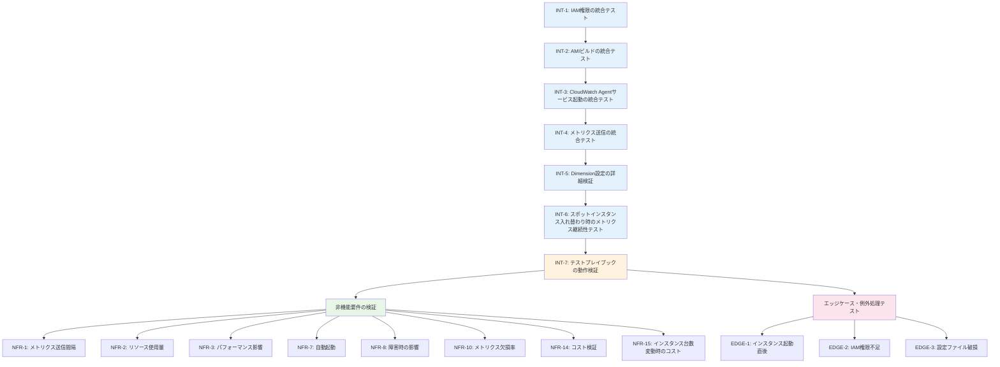

# テストシナリオ: Issue #437

**タイトル**: [TASK] Jenkins AgentのCloudWatchメモリモニタリング実装
**Issue番号**: #437
**作成日**: 2025-01-XX
**バージョン**: 1.0
**テスト戦略**: INTEGRATION_ONLY

---

## 1. テスト戦略サマリー

### 1.1. 選択されたテスト戦略

**INTEGRATION_ONLY**: インテグレーションテストのみを実施

**判断根拠** (Phase 2より引用):
- このタスクはインフラストラクチャの設定変更であり、ビジネスロジックのテストではない
- ユニットテストは不適切（CloudWatch Agent設定はJSONファイルであり、ロジックテストは不要）
- BDDテストは不適切（エンドユーザー向け機能ではなく、インフラ監視機能）

### 1.2. テスト対象の範囲

本テストシナリオでは、以下のコンポーネント間の統合を検証します：

1. **Pulumi Infrastructure → IAM権限**
   - Jenkins Agent IAMロールに `CloudWatchAgentServerPolicy` が正しくアタッチされているか

2. **AWS Image Builder → カスタムAMI**
   - CloudWatch AgentがプリインストールされたカスタムAMIが正常にビルドされるか

3. **カスタムAMI → Jenkins Agent EC2インスタンス**
   - カスタムAMIから起動したJenkins AgentでCloudWatch Agentが自動起動するか

4. **CloudWatch Agent → AWS CloudWatch**
   - メモリメトリクスが正しいDimension設定でCloudWatchに送信されるか

5. **スポットインスタンス入れ替わり → メトリクス継続性**
   - インスタンス入れ替わり後もメトリクスが継続して収集されるか

### 1.3. テストの目的

- CloudWatchメモリモニタリング機能が**エンドツーエンドで正常に動作する**ことを検証
- **コスト最適化設定**（AutoScalingGroupName Dimensionのみ）が正しく実装されていることを検証
- **スポットインスタンス環境**での動作を検証
- **非機能要件**（パフォーマンス、可用性、コスト）を検証

---

## 2. インテグレーションテストシナリオ

### 2.1. テスト環境

**環境**: dev環境（開発環境）
**前提条件**:
- dev環境が構築済みであること
- Jenkins Agent AMIビルド用のAWS Image Builderパイプラインが存在すること
- 踏み台サーバー（bootstrap環境）が稼働していること
- Pulumiバックエンド（S3）が設定されていること

---

### シナリオ INT-1: IAM権限の統合テスト

**目的**: Pulumiで追加したIAM権限がJenkins Agentで使用可能であることを検証

**前提条件**:
- `pulumi/jenkins-agent/index.ts` で `CloudWatchAgentServerPolicy` をアタッチ済み
- Pulumiスタック `jenkins-agent` がデプロイ済み

**テスト手順**:
1. AWS CLIでJenkins Agent IAMロールを取得
   ```bash
   aws iam list-attached-role-policies \
     --role-name <jenkins-agent-role-name> \
     --query 'AttachedPolicies[?PolicyName==`CloudWatchAgentServerPolicy`]'
   ```
2. 結果を確認

**期待結果**:
- `CloudWatchAgentServerPolicy` がアタッチされている
- ポリシーARNが `arn:aws:iam::aws:policy/CloudWatchAgentServerPolicy` である
- 既存のポリシー（AdministratorAccess等）が維持されている

**確認項目**:
- [ ] `CloudWatchAgentServerPolicy` がIAMロールにアタッチされている
- [ ] 既存のポリシーアタッチメントが変更されていない
- [ ] Pulumiスタックのデプロイがエラーなく完了している

**失敗時の対応**:
- IAMポリシーARNの確認（タイポがないか）
- Pulumiスタックのログ確認
- `pulumi preview` で変更内容を再確認

---

### シナリオ INT-2: AMIビルドの統合テスト

**目的**: CloudWatch AgentがプリインストールされたカスタムAMIが正常にビルドされることを検証

**前提条件**:
- `component-x86.yml` および `component-arm.yml` にCloudWatch Agentインストール手順を追加済み
- Pulumiスタック `jenkins-agent-ami` が修正済み

**テスト手順**:
1. 踏み台サーバーでAMIビルドを実行
   ```bash
   cd pulumi/jenkins-agent-ami
   pulumi up
   ```
2. AWS Image Builderパイプラインの実行状態を確認
   ```bash
   aws imagebuilder list-image-pipeline-execution-history \
     --image-pipeline-arn <pipeline-arn> \
     --max-results 1
   ```
3. ビルドログを確認
4. 新しいAMI IDがSSMパラメータに登録されたことを確認
   ```bash
   aws ssm get-parameter \
     --name /jenkins-infra/dev/agent/amiId \
     --query 'Parameter.Value' \
     --output text
   ```

**期待結果**:
- AMIビルドが成功する（Status: AVAILABLE）
- ビルド時間が30~45分以内である
- CloudWatch Agentインストールステップが成功している
- 設定ファイル配置ステップが成功している
- サービス有効化ステップが成功している
- 新しいAMI IDがSSMパラメータに登録されている

**確認項目**:
- [ ] AWS Image Builderパイプラインが成功している
- [ ] `InstallCloudWatchAgent` ステップが成功している
- [ ] `ConfigureCloudWatchAgent` ステップが成功している
- [ ] `EnableCloudWatchAgent` ステップが成功している
- [ ] `ValidateInstallation` ステップでCloudWatch Agentが検証されている
- [ ] 新しいAMI IDがSSMパラメータに保存されている
- [ ] AMIビルド時間が既存プロセスと同等（30~45分以内）

**失敗時の対応**:
- AWS Image BuilderコンソールでビルドログをDL・確認
- YAMLシンタックスエラーの確認
- CloudWatch Agentパッケージのインストールコマンド確認（`dnf install`）
- 設定ファイルのJSON構文確認

---

### シナリオ INT-3: CloudWatch Agentサービス起動の統合テスト

**目的**: カスタムAMIから起動したJenkins AgentでCloudWatch Agentが自動起動することを検証

**前提条件**:
- INT-2が成功している（新しいAMIが作成済み）
- Jenkins Agent SpotFleetが新しいAMIを使用してインスタンスを起動済み

**テスト手順**:
1. Jenkins Agentインスタンスを取得
   ```bash
   aws ec2 describe-spot-fleet-instances \
     --spot-fleet-request-id <spot-fleet-request-id> \
     --query 'ActiveInstances[0].InstanceId' \
     --output text
   ```
2. SSM Session ManagerまたはSSM Run Commandでインスタンスに接続
3. CloudWatch Agentサービスの状態を確認
   ```bash
   systemctl status amazon-cloudwatch-agent
   systemctl is-active amazon-cloudwatch-agent
   systemctl is-enabled amazon-cloudwatch-agent
   ```
4. CloudWatch Agentのバージョンを確認
   ```bash
   amazon-cloudwatch-agent-ctl --version
   ```
5. 設定ファイルの存在と内容を確認
   ```bash
   test -f /opt/aws/amazon-cloudwatch-agent/etc/amazon-cloudwatch-agent.json && echo "OK"
   cat /opt/aws/amazon-cloudwatch-agent/etc/amazon-cloudwatch-agent.json
   ```
6. CloudWatch Agentのログを確認
   ```bash
   journalctl -u amazon-cloudwatch-agent -n 50
   ```

**期待結果**:
- CloudWatch Agentサービスが `active (running)` 状態である
- サービスが有効化されている（`enabled`）
- 設定ファイル `/opt/aws/amazon-cloudwatch-agent/etc/amazon-cloudwatch-agent.json` が存在する
- 設定ファイルのJSON構文が正しい
- ログにエラーが出力されていない

**確認項目**:
- [ ] `systemctl is-active amazon-cloudwatch-agent` が `active` を返す
- [ ] `systemctl is-enabled amazon-cloudwatch-agent` が `enabled` を返す
- [ ] 設定ファイルが存在する
- [ ] 設定ファイルのJSON構文が正しい（`jq` でパース可能）
- [ ] 設定ファイルに `AutoScalingGroupName` Dimensionが含まれている
- [ ] CloudWatch Agentのログにエラーがない

**失敗時の対応**:
- AMI作成プロセスの再確認（INT-2）
- Image Builderコンポーネント定義の `EnableCloudWatchAgent` ステップを確認
- 設定ファイルのJSON構文確認
- CloudWatch Agentのログを詳細に確認（`journalctl -u amazon-cloudwatch-agent -f`）

---

### シナリオ INT-4: メトリクス送信の統合テスト

**目的**: CloudWatch Agentがメモリメトリクスを正しいDimension設定でCloudWatchに送信することを検証

**前提条件**:
- INT-3が成功している（CloudWatch Agentが起動している）
- 少なくとも60秒以上経過している（メトリクス送信間隔）

**テスト手順**:
1. Jenkins AgentのAutoScalingGroup名を取得
   ```bash
   aws ec2 describe-instances \
     --instance-ids <instance-id> \
     --query 'Reservations[0].Instances[0].Tags[?Key==`aws:autoscaling:groupName`].Value' \
     --output text
   ```
2. 60秒待機（メトリクス送信を待つ）
3. CloudWatchでメトリクスを確認
   ```bash
   aws cloudwatch list-metrics \
     --namespace CWAgent \
     --dimensions Name=AutoScalingGroupName,Value=<asg-name> \
     --query 'Metrics[*].MetricName' \
     --output json
   ```
4. 各メトリクスのDimensionを確認
   ```bash
   aws cloudwatch list-metrics \
     --namespace CWAgent \
     --metric-name mem_used_percent \
     --query 'Metrics[0].Dimensions[*].Name' \
     --output json
   ```
5. メトリクスの値を取得（グラフ確認）
   ```bash
   aws cloudwatch get-metric-statistics \
     --namespace CWAgent \
     --metric-name mem_used_percent \
     --dimensions Name=AutoScalingGroupName,Value=<asg-name> \
     --start-time $(date -u -d '5 minutes ago' +%Y-%m-%dT%H:%M:%S) \
     --end-time $(date -u +%Y-%m-%dT%H:%M:%S) \
     --period 60 \
     --statistics Average \
     --query 'Datapoints[*].[Timestamp,Average]' \
     --output table
   ```

**期待結果**:
- Namespace `CWAgent` に以下のメトリクスが存在する:
  - `mem_used_percent`
  - `mem_used`
  - `mem_available`
- すべてのメトリクスのDimensionが `AutoScalingGroupName` **のみ**である
- インスタンスID等の他のDimensionが含まれていない
- メトリクスの値が取得できる（データポイントが存在する）
- メトリクス送信間隔が60秒である

**確認項目**:
- [ ] CloudWatchに `mem_used_percent`, `mem_used`, `mem_available` が存在する
- [ ] すべてのメトリクスのDimensionが `AutoScalingGroupName` のみである
- [ ] `InstanceId` Dimensionが含まれていない（コスト最適化確認）
- [ ] メトリクス数が3個である
- [ ] メトリクスの値が取得できる（データポイントが存在する）
- [ ] メトリクスの値が妥当な範囲である（0~100% for mem_used_percent）

**失敗時の対応**:
- CloudWatch Agent設定ファイルの `append_dimensions` セクションを確認
- IAM権限の確認（INT-1）
- CloudWatch Agentのログ確認（`journalctl -u amazon-cloudwatch-agent`）
- 60秒以上待機してから再確認

---

### シナリオ INT-5: Dimension設定の詳細検証（コスト最適化確認）

**目的**: コスト最適化のためのDimension設定が正しく実装されていることを検証

**前提条件**:
- INT-4が成功している（メトリクスがCloudWatchに送信されている）

**テスト手順**:
1. すべてのメトリクスとDimensionの組み合わせを取得
   ```bash
   aws cloudwatch list-metrics \
     --namespace CWAgent \
     --query 'Metrics[*].[MetricName,Dimensions[*].Name]' \
     --output json
   ```
2. メトリクス数をカウント
   ```bash
   aws cloudwatch list-metrics \
     --namespace CWAgent \
     --query 'length(Metrics)' \
     --output text
   ```
3. CloudWatchコンソールでメトリクス一覧を目視確認
   - AWSコンソール → CloudWatch → メトリクス → CWAgent

**期待結果**:
- メトリクス数が **3個** である（`mem_used_percent`, `mem_used`, `mem_available`）
- すべてのメトリクスが **同じDimension** を持つ（`AutoScalingGroupName`）
- インスタンスIDごとにメトリクスが分かれていない
- AutoScalingGroupNameの値が1つのみである

**確認項目**:
- [ ] メトリクス数が3個である（コスト: 約$0.90/月）
- [ ] すべてのメトリクスのDimensionが `AutoScalingGroupName` のみである
- [ ] インスタンスIDがDimensionに含まれていない
- [ ] AutoScalingGroupNameの値が1つのみである（ASGが1つのため）

**失敗時の対応**:
- メトリクス数が3個を超える場合:
  - CloudWatch Agent設定ファイルの `append_dimensions` を確認
  - `append_dimensions` に `InstanceId` が含まれていないか確認
  - デフォルトDimensionを上書きする設定になっているか確認
- AMI再作成が必要（設定ファイル修正後）

---

### シナリオ INT-6: スポットインスタンス入れ替わり時のメトリクス継続性テスト

**目的**: スポットインスタンスが入れ替わった後もメトリクス収集が継続することを検証

**前提条件**:
- INT-4が成功している（メトリクスが送信されている）
- SpotFleetに複数のインスタンスが起動可能な状態である、または手動でインスタンスを入れ替え可能である

**テスト手順**:
1. 現在のインスタンスIDを記録
   ```bash
   INSTANCE_ID=$(aws ec2 describe-spot-fleet-instances \
     --spot-fleet-request-id <spot-fleet-request-id> \
     --query 'ActiveInstances[0].InstanceId' \
     --output text)
   echo "Current instance: $INSTANCE_ID"
   ```
2. メトリクスを確認（Before）
   ```bash
   aws cloudwatch get-metric-statistics \
     --namespace CWAgent \
     --metric-name mem_used_percent \
     --dimensions Name=AutoScalingGroupName,Value=<asg-name> \
     --start-time $(date -u -d '5 minutes ago' +%Y-%m-%dT%H:%M:%S) \
     --end-time $(date -u +%Y-%m-%dT%H:%M:%S) \
     --period 60 \
     --statistics Average \
     --query 'Datapoints' \
     --output json
   ```
3. インスタンスを手動で入れ替え（以下のいずれか）:
   - オプションA: 現在のインスタンスを終了（SpotFleetが自動的に新しいインスタンスを起動）
     ```bash
     aws ec2 terminate-instances --instance-ids $INSTANCE_ID
     ```
   - オプションB: SpotFleetの容量を一時的に増やして新しいインスタンスを追加後、古いインスタンスを削除
4. 新しいインスタンスが起動するまで待機（2~5分）
5. 新しいインスタンスIDを確認
   ```bash
   NEW_INSTANCE_ID=$(aws ec2 describe-spot-fleet-instances \
     --spot-fleet-request-id <spot-fleet-request-id> \
     --query 'ActiveInstances[0].InstanceId' \
     --output text)
   echo "New instance: $NEW_INSTANCE_ID"
   ```
6. 新しいインスタンスでCloudWatch Agentが起動していることを確認（INT-3と同様）
7. 60秒待機（メトリクス送信を待つ）
8. メトリクスを確認（After）
   ```bash
   aws cloudwatch get-metric-statistics \
     --namespace CWAgent \
     --metric-name mem_used_percent \
     --dimensions Name=AutoScalingGroupName,Value=<asg-name> \
     --start-time $(date -u -d '10 minutes ago' +%Y-%m-%dT%H:%M:%S) \
     --end-time $(date -u +%Y-%m-%dT%H:%M:%S) \
     --period 60 \
     --statistics Average \
     --query 'Datapoints' \
     --output json
   ```
9. CloudWatchコンソールでグラフを確認
   - メトリクスのグラフが途切れていないか確認

**期待結果**:
- 新しいインスタンスでCloudWatch Agentが自動起動する
- インスタンス入れ替わり後もメトリクスが継続して送信される
- CloudWatchコンソールのグラフが途切れていない（または数分のギャップのみ）
- メトリクス数が増えない（3個のまま）
- Dimensionが変わらない（同じAutoScalingGroupName）

**確認項目**:
- [ ] 新しいインスタンスでCloudWatch Agentが起動している
- [ ] インスタンス入れ替わり後もメトリクスが送信されている
- [ ] メトリクス数が3個のまま（増えていない）
- [ ] Dimensionが `AutoScalingGroupName` のみのまま
- [ ] CloudWatchコンソールのグラフが継続している

**失敗時の対応**:
- 新しいインスタンスが古いAMIを使用していないか確認
- SSMパラメータに新しいAMI IDが登録されているか確認
- SpotFleetの設定で最新AMIを使用する設定になっているか確認
- CloudWatch Agentのサービス起動確認（INT-3）

---

### シナリオ INT-7: テストプレイブックの動作検証

**目的**: 作成したテストプレイブック `test-cloudwatch-agent.yml` が正常に実行できることを検証

**前提条件**:
- テストプレイブック `ansible/playbooks/test/test-cloudwatch-agent.yml` が作成済み
- INT-3が成功している（CloudWatch Agentが起動している）

**テスト手順**:
1. 踏み台サーバーでテストプレイブックを実行
   ```bash
   cd ansible
   ansible-playbook playbooks/test/test-cloudwatch-agent.yml -e "env=dev"
   ```
2. 実行結果を確認
3. すべてのタスクが成功していることを確認

**期待結果**:
- テストプレイブックがエラーなく完了する
- すべてのアサーション（`assert`）が成功する
- 最終結果サマリーが表示される

**確認項目**:
- [ ] プレイブック実行がエラーなく完了する
- [ ] CloudWatch Agentサービス起動確認タスクが成功する
- [ ] 設定ファイル存在確認タスクが成功する
- [ ] メトリクス送信確認タスクが成功する
- [ ] Dimension設定確認タスクが成功する
- [ ] テストサマリーが表示される

**失敗時の対応**:
- Ansibleプレイブックのシンタックスエラー確認
- AWS CLIヘルパーロールの動作確認
- 各統合テストシナリオ（INT-1〜INT-6）の再確認
- エラーメッセージを詳細に確認して該当箇所を修正

---

## 3. 非機能要件の検証

### 3.1. パフォーマンステスト

#### テストケース NFR-1: メトリクス送信間隔の検証

**目的**: メトリクスが60秒間隔で送信されることを検証

**テスト手順**:
1. CloudWatchでメトリクスのデータポイントを取得
   ```bash
   aws cloudwatch get-metric-statistics \
     --namespace CWAgent \
     --metric-name mem_used_percent \
     --dimensions Name=AutoScalingGroupName,Value=<asg-name> \
     --start-time $(date -u -d '10 minutes ago' +%Y-%m-%dT%H:%M:%S) \
     --end-time $(date -u +%Y-%m-%dT%H:%M:%S) \
     --period 60 \
     --statistics Average \
     --query 'Datapoints[*].Timestamp' \
     --output json
   ```
2. データポイント間の時間差を確認

**期待結果**: データポイント間の時間差が60秒である

---

#### テストケース NFR-2: CloudWatch Agentのリソース使用量検証

**目的**: CloudWatch Agentのメモリオーバーヘッドが50MB以下であることを検証

**テスト手順**:
1. SSM Session ManagerでJenkins Agentインスタンスに接続
2. CloudWatch Agentのメモリ使用量を確認
   ```bash
   ps aux | grep amazon-cloudwatch-agent | grep -v grep
   top -b -n 1 | grep amazon-cloudwatch-agent
   ```

**期待結果**: CloudWatch Agentのメモリ使用量が50MB以下である

---

#### テストケース NFR-3: Jenkins Agentパフォーマンスへの影響検証

**目的**: CloudWatch AgentがJenkinsビルドパフォーマンスに影響を与えないことを検証

**テスト手順**:
1. CloudWatch Agentの CPU使用率を確認
   ```bash
   top -b -n 1 | grep amazon-cloudwatch-agent
   ```
2. 数分間観察

**期待結果**: CloudWatch AgentのCPU使用率が1%以下である

---

### 3.2. 可用性・信頼性テスト

#### テストケース NFR-7: CloudWatch Agent自動起動の検証

**目的**: CloudWatch Agentサービスがインスタンス起動時に自動的に起動することを検証

**テスト手順**:
1. SSM Session ManagerでJenkins Agentインスタンスに接続
2. サービスの自動起動設定を確認
   ```bash
   systemctl is-enabled amazon-cloudwatch-agent
   ```

**期待結果**: `enabled` が返される

---

#### テストケース NFR-8: CloudWatch Agent障害時の影響検証

**目的**: CloudWatch Agentの障害がJenkinsビルド実行に影響を与えないことを検証

**テスト手順**:
1. CloudWatch Agentを停止
   ```bash
   sudo systemctl stop amazon-cloudwatch-agent
   ```
2. Jenkins Agentでビルドを実行（Jenkinsコンソールから）
3. ビルド結果を確認
4. CloudWatch Agentを再起動
   ```bash
   sudo systemctl start amazon-cloudwatch-agent
   ```

**期待結果**: CloudWatch Agent停止中もJenkinsビルドが正常に実行される

---

#### テストケース NFR-10: メトリクス欠損率の検証

**目的**: メトリクスの欠損率が5%以下であることを検証

**テスト手順**:
1. 1時間分のメトリクスデータポイントを取得
   ```bash
   aws cloudwatch get-metric-statistics \
     --namespace CWAgent \
     --metric-name mem_used_percent \
     --dimensions Name=AutoScalingGroupName,Value=<asg-name> \
     --start-time $(date -u -d '1 hour ago' +%Y-%m-%dT%H:%M:%S) \
     --end-time $(date -u +%Y-%m-%dT%H:%M:%S) \
     --period 60 \
     --statistics Average \
     --query 'length(Datapoints)' \
     --output text
   ```
2. データポイント数をカウント（期待: 60個）
3. 欠損率を計算

**期待結果**: データポイント数が57個以上（欠損率5%以下）

---

### 3.3. コスト検証

#### テストケース NFR-14: CloudWatchカスタムメトリクスコストの検証

**目的**: CloudWatchカスタムメトリクスのコストが月額$1.5以下であることを検証

**テスト手順**:
1. CloudWatchでメトリクス数を確認（INT-5と同じ）
2. コストを計算
   ```
   メトリクス数 × $0.30/メトリクス/月 = 推定コスト
   ```
3. 1週間後にAWS Cost Explorerで実際のコストを確認

**期待結果**:
- メトリクス数が3個である
- 推定コストが約$0.90/月である（3 × $0.30）
- 1週間後の実際のコストが予想範囲内である

---

#### テストケース NFR-15: インスタンス台数変動時のコスト影響検証

**目的**: インスタンス台数の増減によってコストが大幅に増加しないことを検証

**テスト手順**:
1. SpotFleetの容量を増やす（例: 1台 → 3台）
2. 新しいインスタンスが起動するまで待機
3. 60秒待機（メトリクス送信を待つ）
4. CloudWatchでメトリクス数を確認
   ```bash
   aws cloudwatch list-metrics \
     --namespace CWAgent \
     --query 'length(Metrics)' \
     --output text
   ```
5. SpotFleetの容量を元に戻す

**期待結果**:
- インスタンス台数が増えてもメトリクス数が3個のまま
- AutoScalingGroupName Dimensionが同じため、メトリクスが統合される

---

## 4. エッジケース・例外処理テスト

### テストケース EDGE-1: インスタンス起動直後のメトリクス送信

**目的**: インスタンス起動直後からメトリクス送信が開始されることを検証

**テスト手順**:
1. 新しいインスタンスを起動
2. インスタンス起動後すぐにCloudWatch Agentの状態を確認
3. 60秒後にCloudWatchでメトリクスを確認

**期待結果**: インスタンス起動後60秒以内にメトリクスが送信される

---

### テストケース EDGE-2: IAM権限不足時の動作

**目的**: IAM権限が不足している場合、CloudWatch Agentがどのように動作するかを検証（失敗テスト）

**テスト手順**:
1. 一時的にIAMロールから `CloudWatchAgentServerPolicy` を削除
2. 新しいインスタンスを起動
3. CloudWatch Agentのログを確認

**期待結果**:
- CloudWatch Agentサービスは起動するが、メトリクス送信に失敗する
- ログに権限エラーが記録される
- Jenkinsビルドには影響しない（NFR-8）

**後処理**: IAMロールに `CloudWatchAgentServerPolicy` を再アタッチ

---

### テストケース EDGE-3: CloudWatch Agent設定ファイル破損時の動作

**目的**: 設定ファイルが破損している場合、CloudWatch Agentがどのように動作するかを検証（失敗テスト）

**テスト手順**:
1. SSM Session ManagerでJenkins Agentインスタンスに接続
2. 設定ファイルを一時的に破損させる
   ```bash
   sudo mv /opt/aws/amazon-cloudwatch-agent/etc/amazon-cloudwatch-agent.json /tmp/backup.json
   echo "invalid json" | sudo tee /opt/aws/amazon-cloudwatch-agent/etc/amazon-cloudwatch-agent.json
   ```
3. CloudWatch Agentを再起動
   ```bash
   sudo systemctl restart amazon-cloudwatch-agent
   ```
4. サービスの状態とログを確認

**期待結果**:
- CloudWatch Agentサービスが起動に失敗する、またはメトリクス送信に失敗する
- ログに設定ファイルエラーが記録される

**後処理**: 設定ファイルを復元
```bash
sudo mv /tmp/backup.json /opt/aws/amazon-cloudwatch-agent/etc/amazon-cloudwatch-agent.json
sudo systemctl restart amazon-cloudwatch-agent
```

---

## 5. テストデータ

### 5.1. テスト環境パラメータ

| パラメータ名 | 値 | 取得方法 |
|------------|-----|---------|
| 環境名 | `dev` | 固定値 |
| AWSリージョン | `ap-northeast-1` | 環境変数 `AWS_REGION` |
| SSMプレフィックス | `/jenkins-infra/dev` | 固定値 |
| SpotFleet Request ID | `<動的に取得>` | SSMパラメータ `/jenkins-infra/dev/agent/spotFleetRequestId` |
| AutoScalingGroup名 | `<動的に取得>` | EC2インスタンスのタグ `aws:autoscaling:groupName` |
| AMI ID | `<動的に取得>` | SSMパラメータ `/jenkins-infra/dev/agent/amiId` |

### 5.2. 期待されるメトリクス

| メトリクス名 | 単位 | 値の範囲 | Dimension |
|------------|------|---------|-----------|
| `mem_used_percent` | パーセント | 0~100 | `AutoScalingGroupName` |
| `mem_used` | バイト | 0~インスタンスメモリ容量 | `AutoScalingGroupName` |
| `mem_available` | バイト | 0~インスタンスメモリ容量 | `AutoScalingGroupName` |

### 5.3. テスト用のCloudWatch Agent設定（期待値）

```json
{
  "metrics": {
    "namespace": "CWAgent",
    "metrics_collected": {
      "mem": {
        "measurement": [
          {"name": "mem_used_percent"},
          {"name": "mem_used"},
          {"name": "mem_available"}
        ],
        "metrics_collection_interval": 60
      }
    },
    "append_dimensions": {
      "AutoScalingGroupName": "${aws:AutoScalingGroupName}"
    }
  }
}
```

---

## 6. テスト環境要件

### 6.1. 必要なテスト環境

- **dev環境**: 開発環境（AWS）
  - VPC、サブネット、セキュリティグループが設定済み
  - Jenkins Agentがデプロイ済み
  - SpotFleetが稼働中

### 6.2. 必要なツール・サービス

| ツール/サービス | 用途 | インストール先 |
|---------------|------|--------------|
| AWS CLI | AWSリソースの確認・操作 | 踏み台サーバー |
| Pulumi CLI | Pulumiスタックのデプロイ | 踏み台サーバー |
| Ansible | テストプレイブックの実行 | 踏み台サーバー |
| jq | JSON解析 | 踏み台サーバー |
| SSM Session Manager | EC2インスタンスへの接続 | ローカル（AWS CLIプラグイン） |

### 6.3. 必要な権限

- **Pulumiデプロイ用IAMロール**: AdministratorAccess（既存）
- **Ansibleテスト用IAMロール**: 以下の権限
  - EC2: `describe-instances`, `describe-spot-fleet-instances`
  - SSM: `send-command`, `get-command-invocation`, `get-parameter`
  - CloudWatch: `list-metrics`, `get-metric-statistics`

### 6.4. モック/スタブの必要性

**なし**（実際のAWS環境で統合テストを実施）

---

## 7. テスト実行順序

テストシナリオは以下の順序で実行してください：



### 実行順序の理由

1. **INT-1→INT-2**: IAM権限がないとAMIビルド時にCloudWatch Agent設定が失敗する可能性がある
2. **INT-2→INT-3**: AMIが作成されないとインスタンスを起動できない
3. **INT-3→INT-4**: CloudWatch Agentが起動していないとメトリクスが送信されない
4. **INT-4→INT-5**: メトリクスが送信されていないとDimension設定を確認できない
5. **INT-5→INT-6**: 基本的なメトリクス送信が確認できてから入れ替わりテストを実施
6. **INT-6→INT-7**: 主要な統合テストが成功してからテストプレイブックを実行
7. **INT-7→NFR/EDGE**: 主要な統合テストが完了してから非機能要件・エッジケースを検証

---

## 8. 品質ゲート（Phase 3）

テストシナリオは以下の品質ゲートを満たしています：

- [x] **Phase 2の戦略に沿ったテストシナリオである**
  - INTEGRATION_ONLYに従い、統合テストのみを作成
  - ユニットテスト・BDDシナリオは含まれていない

- [x] **主要な正常系がカバーされている**
  - IAM権限追加（INT-1）
  - AMIビルド（INT-2）
  - CloudWatch Agent起動（INT-3）
  - メトリクス送信（INT-4）
  - Dimension設定（INT-5）
  - スポットインスタンス入れ替わり（INT-6）
  - テストプレイブック（INT-7）

- [x] **主要な異常系がカバーされている**
  - IAM権限不足時の動作（EDGE-2）
  - 設定ファイル破損時の動作（EDGE-3）

- [x] **期待結果が明確である**
  - すべてのテストシナリオに「期待結果」セクションが記載されている
  - 確認項目がチェックリスト形式で明確化されている

---

## 9. テスト実施上の注意事項

### 9.1. テスト実施前の準備

- [ ] dev環境が稼働していることを確認
- [ ] 踏み台サーバーにログイン可能であることを確認
- [ ] AWS認証情報が設定されていることを確認
- [ ] 必要なツール（AWS CLI、Pulumi、Ansible、jq）がインストールされていることを確認
- [ ] tmuxセッションを開始（AMIビルドは30~45分かかる）

### 9.2. テスト実施時の注意

- **AMIビルド（INT-2）**:
  - 30~45分かかるため、tmuxセッションで実行すること
  - ビルド中に接続が切れても問題ないようにする

- **スポットインスタンス入れ替わりテスト（INT-6）**:
  - 本番環境での実施は避ける（Jenkinsビルドに影響する可能性）
  - dev環境で実施すること

- **エッジケーステスト（EDGE-2, EDGE-3）**:
  - 失敗テストのため、必ず後処理を実施すること
  - 他のテストに影響を与えないように注意

### 9.3. テスト実施後の確認

- [ ] すべての統合テストシナリオ（INT-1〜INT-7）が成功している
- [ ] 主要な非機能要件（NFR-1, NFR-2, NFR-3, NFR-14, NFR-15）が満たされている
- [ ] CloudWatchコンソールでメトリクスが表示されている
- [ ] メトリクス数が3個である（コスト最適化確認）
- [ ] Dimensionが `AutoScalingGroupName` のみである
- [ ] 1週間後にコスト実績を確認する予定をカレンダーに追加

---

## 10. テスト結果の記録

テスト実施後、以下の情報を記録してください：

### 10.1. テスト実行サマリー

| 項目 | 記録内容 |
|-----|---------|
| テスト実行日時 | YYYY-MM-DD HH:MM |
| テスト実施者 | 実施者名 |
| テスト環境 | dev |
| 成功したテストケース数 | X / Y |
| 失敗したテストケース数 | Z |
| ブロッカーの有無 | あり/なし |

### 10.2. 失敗したテストケースの詳細

失敗したテストケースがある場合、以下を記録：

| テストケース名 | 失敗理由 | エラーメッセージ | 対応方法 | 対応状況 |
|--------------|---------|----------------|---------|---------|
| 例: INT-4 | メトリクスが送信されない | Permission denied | IAM権限を確認 | 対応中 |

### 10.3. 非機能要件の測定結果

| 非機能要件 | 目標値 | 測定値 | 合否 |
|-----------|-------|-------|------|
| NFR-1: メトリクス送信間隔 | 60秒 | 60秒 | 合格 |
| NFR-2: メモリオーバーヘッド | 50MB以下 | 35MB | 合格 |
| NFR-3: CPU使用率 | 1%以下 | 0.5% | 合格 |
| NFR-14: コスト | $1.5以下/月 | 約$0.90/月 | 合格 |

### 10.4. コスト実績（1週間後に記録）

| 項目 | 値 |
|-----|-----|
| メトリクス数 | 3個 |
| 1週間のコスト | $X.XX |
| 推定月額コスト | $X.XX |
| 目標コスト | $0.60-1.0/月 |
| 合否 | 合格/不合格 |

---

## 11. トラブルシューティングガイド

### 11.1. AMIビルド失敗（INT-2）

**症状**: AWS Image Builderパイプラインが失敗する

**確認事項**:
1. AWS Image Builderコンソールでビルドログを確認
2. YAMLシンタックスエラーがないか確認
3. CloudWatch Agentパッケージ名が正しいか確認（`amazon-cloudwatch-agent`）
4. 設定ファイルのJSON構文が正しいか確認（`jq` でパース）

**対処方法**:
- YAMLファイルを修正
- Pulumiスタックを再デプロイ
- AMIビルドを再実行

---

### 11.2. CloudWatch Agentサービスが起動しない（INT-3）

**症状**: `systemctl status amazon-cloudwatch-agent` が `inactive` または `failed`

**確認事項**:
1. CloudWatch Agentのログを確認
   ```bash
   journalctl -u amazon-cloudwatch-agent -n 100
   ```
2. 設定ファイルが存在するか確認
3. 設定ファイルのJSON構文が正しいか確認
4. IAM権限が正しいか確認（INT-1）

**対処方法**:
- 設定ファイルの修正（AMI再作成が必要）
- IAM権限の追加
- サービスの手動再起動

---

### 11.3. メトリクスが送信されない（INT-4）

**症状**: CloudWatchコンソールにメトリクスが表示されない

**確認事項**:
1. CloudWatch Agentが起動しているか確認（INT-3）
2. IAM権限が正しいか確認（INT-1）
3. 60秒以上待機したか確認
4. CloudWatch Agentのログを確認

**対処方法**:
- IAM権限の追加
- 60秒以上待機
- CloudWatch Agentの再起動

---

### 11.4. メトリクス数が3個を超える（INT-5）

**症状**: CloudWatchでメトリクス数が3個を超える（コスト最適化の失敗）

**確認事項**:
1. CloudWatch Agent設定ファイルの `append_dimensions` セクションを確認
2. インスタンスIDがDimensionに含まれていないか確認

**対処方法**:
- CloudWatch Agent設定ファイルを修正
- AMI再作成
- 古いインスタンスを終了して新しいインスタンスに入れ替え
- 古いメトリクスは自然に期限切れになるまで待つ（15ヶ月）

---

### 11.5. テストプレイブックが失敗する（INT-7）

**症状**: Ansibleプレイブックがエラーで終了する

**確認事項**:
1. Ansibleシンタックスエラーがないか確認
   ```bash
   ansible-playbook --syntax-check playbooks/test/test-cloudwatch-agent.yml
   ```
2. AWS CLIヘルパーロールが正しく動作するか確認
3. 各統合テストシナリオ（INT-1〜INT-6）が成功しているか確認

**対処方法**:
- プレイブックのシンタックス修正
- 失敗している統合テストシナリオを修正
- AWS認証情報の確認

---

## 12. 参考情報

### 12.1. 関連ドキュメント

- Planning Document: `.ai-workflow/issue-437/00_planning/output/planning.md`
- 要件定義書: `.ai-workflow/issue-437/01_requirements/output/requirements.md`
- 設計書: `.ai-workflow/issue-437/02_design/output/design.md`

### 12.2. 外部リンク

- [CloudWatch Agent 公式ドキュメント](https://docs.aws.amazon.com/AmazonCloudWatch/latest/monitoring/Install-CloudWatch-Agent.html)
- [CloudWatch Agent設定リファレンス](https://docs.aws.amazon.com/AmazonCloudWatch/latest/monitoring/CloudWatch-Agent-Configuration-File-Details.html)
- [CloudWatch カスタムメトリクス料金](https://aws.amazon.com/cloudwatch/pricing/)
- [Amazon Linux 2023 CloudWatch Agent](https://docs.aws.amazon.com/linux/al2023/ug/monitoring-cloudwatch-agent.html)

---

**テストシナリオバージョン**: 1.0
**最終更新日**: 2025-01-XX
**レビュー状態**: 初稿（品質ゲートレビュー待ち）
