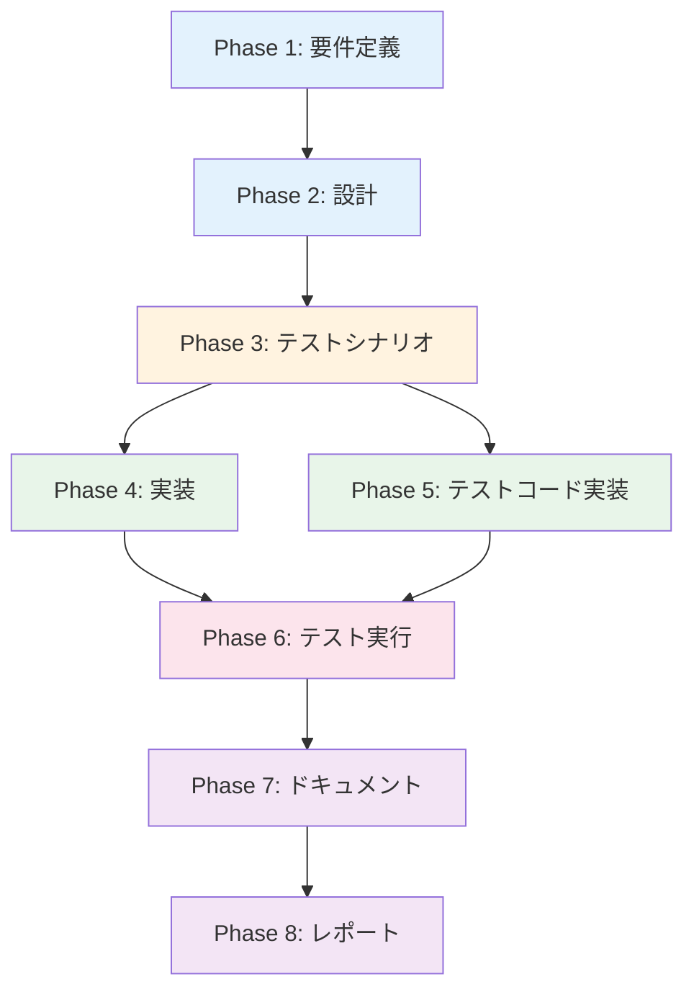

# プロジェクト計画書 - Issue #440

## 1. Issue分析

### Issue概要
- **Issue番号**: #440
- **タイトル**: [ENHANCEMENT] Jenkins Agent AMIにDockerイメージを事前プル（ジョブ起動時間短縮）
- **状態**: open
- **優先度**: Medium

### 複雑度評価
**判定**: 簡単

**根拠**:
- 2つのYAMLファイルに同じステップを追加するだけ
- 既存のコンポーネント定義構造を踏襲
- 新しいアーキテクチャ変更や複雑なロジック不要
- 影響範囲が限定的（AMIビルド時のみ）

### 見積もり工数
**合計**: 6~10時間

**根拠**:
- 既存のcomponent.ymlファイルの構造理解: 0.5h
- 実装（YAMLステップ追加）: 1~2h
- テスト（AMIビルド実行、起動時間測定）: 3~5h
- ドキュメント更新: 1~2h
- レビュー・修正: 1h

### リスク評価
**判定**: 低

**根拠**:
- 既存機能への影響なし（AMIビルド時の追加処理のみ）
- Dockerイメージプルは冪等性が保証されている
- ロールバック可能（変更前のAMIに戻すだけ）
- 最悪の場合でもビルド時間が増えるだけ

---

## 2. 実装戦略判断

### 実装戦略: EXTEND

**判断根拠**:
- 既存のcomponent-arm.ymlとcomponent-x86.ymlに新しいステップを**追加**する
- 既存のステップ構造（ExecuteBashアクション）を踏襲
- 新規ファイル作成は不要（既存YAMLファイルの拡張のみ）
- 既存のAMIビルドプロセスに機能を追加する形

**実装内容**:
- `EnableCloudWatchAgent`ステップの後に`PullDockerImages`ステップを挿入
- ARMとx86の両方で同じDockerイメージリストを使用
- systemctl start dockerを実行してからdocker pullを実行

### テスト戦略: INTEGRATION_ONLY

**判断根拠**:
- **ユニットテストは不適切**: YAMLファイルへのステップ追加のみで、テスト可能なロジックがない
- **インテグレーションテストが必須**: 以下を統合的にテストする必要がある
  - EC2 Image Builderによる実際のAMIビルド
  - Dockerサービスの起動
  - Docker Hubからのイメージプル
  - ジョブ実行時のイメージ起動時間測定
- **BDDテストは不要**: エンドユーザー向け機能ではなく、インフラレベルの改善

**テスト内容**:
1. dev環境でのAMIビルド実行
2. ビルド成功の確認
3. AMI起動後のDockerイメージ存在確認（`docker images`）
4. ジョブ実行時の起動時間測定（before/after比較）

### テストコード戦略: CREATE_TEST

**判断根拠**:
- 現時点でAMIビルドのテストコードが存在しない
- 新規にテストスクリプトを作成する必要がある
- テスト内容:
  - AMIビルド後のDockerイメージ存在確認スクリプト
  - ジョブ起動時間測定スクリプト

**テストファイル作成**:
- `.ai-workflow/issue-440/06_test/integration/test_docker_images.sh`
  - AMI起動後にSSH接続してdocker imagesコマンドを実行
  - 12種類のイメージがすべて存在することを確認
- `.ai-workflow/issue-440/06_test/integration/measure_job_startup.sh`
  - 変更前後のAMIでジョブ起動時間を測定
  - 結果を比較レポートとして出力

---

## 3. 影響範囲分析

### 既存コードへの影響

**直接的な影響**:
- `pulumi/jenkins-agent-ami/component-arm.yml` - **修正**
- `pulumi/jenkins-agent-ami/component-x86.yml` - **修正**

**間接的な影響**:
- AMIビルド時間: 30-45分 → 35-50分（+5分程度）
- AMIサイズ: 約2-3GB増加
- EBSストレージコスト: 約$0.24/月増加（開発環境のみならほぼ無視できる）

### 依存関係の変更

**新規依存の追加**: なし
- すべて既存のツール（Docker、EC2 Image Builder）を使用

**既存依存の変更**: なし
- Dockerは既にInstallDockerステップでインストール済み
- Docker Hubからのイメージプルに外部依存（インターネット接続）

### マイグレーション要否

**不要**

**理由**:
- データベーススキーマ変更なし
- 設定ファイル変更なし
- 既存のAMIは引き続き使用可能（新しいAMIビルド時のみ変更が反映される）
- 既存のJenkinsジョブやパイプラインへの変更不要

---

## 4. タスク分割

### Phase 1: 要件定義 (見積もり: 0.5~1h)

- [x] Task 1-1: Dockerイメージリストの確定 (0.5h)
  - Issueに記載された12種類のイメージを確認
  - Jenkins/jobs/pipeline配下のJenkinsfileで実際に使用されているイメージを検証
  - イメージタグの固定方針を決定（latestを使うか、バージョン固定するか）

- [x] Task 1-2: 受け入れ基準の定義 (0.5h)
  - AMIビルドが成功すること
  - ビルド後のAMIに12種類のDockerイメージがすべて存在すること
  - ジョブ起動時間が10秒未満に短縮されること（小さいイメージの場合）
  - AMIサイズ増加が3GB以内であること

### Phase 2: 設計 (見積もり: 1~1.5h)

- [x] Task 2-1: PullDockerImagesステップの設計 (0.5h)
  - ステップの挿入位置を決定（EnableCloudWatchAgentの直後を推奨）
  - エラーハンドリング方針の決定（一部イメージのプル失敗時の挙動）
  - ログ出力内容の設計

- [x] Task 2-2: ARM/x86共通化の設計 (0.5h)
  - 両アーキテクチャで同じイメージリストを使用
  - マルチアーキテクチャ対応イメージの確認（rust:1.76-slimなど）
  - プラットフォーム固有の対応が必要なイメージの洗い出し

- [x] Task 2-3: テスト設計 (0.5h)
  - インテグレーションテストのシナリオ策定
  - 測定すべきメトリクス（起動時間、AMIサイズ、ビルド時間）の定義
  - テスト用スクリプトの設計

### Phase 3: テストシナリオ (見積もり: 0.5~1h)

- [ ] Task 3-1: AMIビルドテストシナリオ作成 (0.5h)
  - dev環境でのAMIビルド手順書
  - ビルド成功確認項目リスト
  - エラー発生時の対処手順

- [ ] Task 3-2: Dockerイメージ検証シナリオ作成 (0.5h)
  - AMI起動後のSSH接続手順
  - docker imagesコマンドでの確認項目
  - 各イメージのサイズとタグ確認方法

- [ ] Task 3-3: 起動時間測定シナリオ作成 (0.5h)
  - 変更前後のAMI比較手順
  - 測定対象ジョブの選定（小・中・大のイメージを使うジョブ各1つ）
  - 測定結果のレポート形式定義

### Phase 4: 実装 (見積もり: 1~2h)

- [ ] Task 4-1: component-arm.ymlの修正 (0.5~1h)
  - EnableCloudWatchAgentステップの後にPullDockerImagesステップを追加
  - 12種類のDockerイメージのプルコマンドを記載
  - systemctl start dockerを最初に実行
  - プル完了後のdocker imagesで確認ログ出力

- [ ] Task 4-2: component-x86.ymlの修正 (0.5~1h)
  - component-arm.ymlと同じPullDockerImagesステップを追加
  - 内容が完全一致していることを確認（diff比較）

### Phase 5: テストコード実装 (見積もり: 1~1.5h)

- [ ] Task 5-1: Dockerイメージ検証スクリプト作成 (0.5~1h)
  - `.ai-workflow/issue-440/06_test/integration/test_docker_images.sh`を作成
  - EC2インスタンスIDを引数で受け取る
  - SSM Session Managerでコマンド実行
  - docker imagesの出力をパースして12種類の存在を確認
  - 結果をJSONで出力

- [ ] Task 5-2: 起動時間測定スクリプト作成 (0.5h)
  - `.ai-workflow/issue-440/06_test/integration/measure_job_startup.sh`を作成
  - Jenkins APIでジョブをトリガー
  - ジョブログからDockerイメージプル時間を抽出
  - before/after比較レポート生成

### Phase 6: テスト実行 (見積もり: 3~5h)

- [ ] Task 6-1: dev環境でAMIビルド実行 (2~3h)
  - ansible-playbook playbooks/jenkins/deploy/deploy_jenkins_agent_ami.ymlを実行
  - ビルドログの確認（PullDockerImagesステップの実行ログ）
  - エラー発生時のデバッグと修正

- [ ] Task 6-2: Dockerイメージ存在確認 (0.5h)
  - 作成したAMIからEC2インスタンスを起動
  - test_docker_images.shスクリプトを実行
  - 12種類すべてのイメージが存在することを確認

- [ ] Task 6-3: ジョブ起動時間測定 (1~1.5h)
  - 変更前AMIでベースライン測定（3種類のジョブ）
  - 変更後AMIで測定（同じ3種類のジョブ）
  - 起動時間短縮効果をレポート化

- [ ] Task 6-4: AMIサイズ・ビルド時間確認 (0.5h)
  - 変更前後のAMIサイズを比較
  - ビルド時間を比較（EC2 Image Builderのログから取得）
  - 受け入れ基準（+3GB以内、+10分以内）を満たすことを確認

### Phase 7: ドキュメント (見積もり: 1~2h)

- [ ] Task 7-1: ansible/README.mdの更新 (0.5~1h)
  - 「Jenkins Agent AMI」セクションに事前プルイメージリストを追加
  - AMIビルド時間の更新（30-45分 → 35-50分）
  - AMIサイズの記載追加（約2-3GB増加）

- [ ] Task 7-2: pulumi/jenkins-agent-ami/README.mdの作成または更新 (0.5~1h)
  - 現在存在しない場合は新規作成
  - AMIビルドプロセスの説明
  - 事前プルされるDockerイメージ一覧
  - ビルド時間とサイズのベンチマーク結果

### Phase 8: レポート (見積もり: 0.5~1h)

- [ ] Task 8-1: 実装レポート作成 (0.5~1h)
  - `.ai-workflow/issue-440/08_report/implementation_report.md`を作成
  - 実装内容のサマリー
  - テスト結果（起動時間短縮効果、AMIサイズ増加）
  - 発生した問題と解決方法
  - 今後の改善提案（イメージバージョン管理など）

---

## 5. 依存関係

### タスク間の詳細な依存関係

- **Phase 1 → Phase 2**: イメージリスト確定後に設計可能
- **Phase 2 → Phase 3, 4, 5**: 設計完了後に実装・テスト設計が可能
- **Phase 3, 4, 5 → Phase 6**: 実装とテストコード完成後にテスト実行
- **Phase 6 → Phase 7**: テスト結果を元にドキュメント更新
- **Phase 7 → Phase 8**: ドキュメント完成後に最終レポート作成

---

## 6. リスクと軽減策

### リスク1: Docker Hubのレート制限によるビルド失敗

**影響度**: 中
**確率**: 中

**説明**:
- Docker Hubは匿名ユーザーに対して6時間あたり100回のプル制限を設定
- 12種類のイメージを一度にプルする場合、他のビルドと競合する可能性

**軽減策**:
1. Docker Hubの認証を使用してレート制限を緩和（200回/6時間）
2. プル失敗時のリトライロジック追加（`|| true`で継続）
3. イメージプルを優先度順に実行（小さいイメージから）
4. ビルド時間帯をオフピーク時に設定

### リスク2: マルチアーキテクチャ対応していないイメージの存在

**影響度**: 中
**確率**: 低

**説明**:
- 一部のDockerイメージがARM64/x86_64両方に対応していない可能性
- 特にrust:1.76-slimなどがARMで利用可能か不明

**軽減策**:
1. Phase 1でDocker Hubの各イメージページを確認
2. マルチアーキテクチャ対応を公式ドキュメントで検証
3. 未対応の場合はアーキテクチャ別にイメージを分ける
4. テストビルドで早期検出

### リスク3: AMIサイズ増加によるコスト影響

**影響度**: 低
**確率**: 高

**説明**:
- 約2-3GBのサイズ増加が見込まれる
- EBSストレージコストが月額$0.24程度増加

**軽減策**:
1. dev環境のみで検証し、効果を確認後にproduction適用
2. 使用頻度の低いイメージは除外することも検討
3. 定期的なイメージクリーンアップ戦略（古いタグの削除）
4. コスト増加を Issue に明記してステークホルダーの承認を得る

### リスク4: AMIビルド時間の大幅増加

**影響度**: 低
**確率**: 中

**説明**:
- 12種類のイメージプルで5-10分程度増加する可能性
- ビルド時間が1時間を超えるとCI/CDパイプラインに影響

**軽減策**:
1. Phase 6で実測し、増加が許容範囲（+10分以内）か確認
2. 並列プルを検討（バックグラウンドプロセス）
3. 最大サイズのイメージ（rust:1.76-slim 850MB）のみ事前プル、他はオンデマンドも検討
4. ビルド頻度を調整（毎回ではなく週次など）

### リスク5: テスト環境でのSSM Session Manager接続失敗

**影響度**: 低
**確率**: 低

**説明**:
- テストスクリプトがSSM Session Managerを使用する想定
- IAM権限不足やネットワーク設定で接続できない可能性

**軽減策**:
1. Phase 5でSSM接続の事前確認
2. フォールバックとしてSSH接続も実装
3. 手動テストの手順書も用意
4. EC2インスタンスにSSMエージェントがインストール済みであることを確認（既存のcomponent.ymlで確認済み）

---

## 7. 品質ゲート

### Phase 1: 要件定義

- [x] Dockerイメージリスト（12種類）が確定している
- [x] 各イメージのマルチアーキテクチャ対応が確認されている
- [x] 受け入れ基準が明確に定義されている
- [ ] ステークホルダー（Issue作成者）の承認を得ている

### Phase 2: 設計

- [x] 実装戦略（EXTEND）の判断根拠が明記されている
- [x] テスト戦略（INTEGRATION_ONLY）の判断根拠が明記されている
- [x] テストコード戦略（CREATE_TEST）の判断根拠が明記されている
- [x] PullDockerImagesステップの挿入位置が決定している
- [x] エラーハンドリング方針が明確である

### Phase 3: テストシナリオ

- [ ] AMIビルドテストシナリオが具体的である
- [ ] Dockerイメージ検証シナリオが具体的である
- [ ] 起動時間測定シナリオが具体的である
- [ ] 測定すべきメトリクスが定義されている
- [ ] テスト成功基準が明確である

### Phase 4: 実装

- [ ] component-arm.ymlにPullDockerImagesステップが追加されている
- [ ] component-x86.ymlにPullDockerImagesステップが追加されている
- [ ] 両ファイルの内容が一致している（アーキテクチャ固有部分を除く）
- [ ] systemctl start dockerが最初に実行されている
- [ ] 12種類すべてのイメージがプルされている
- [ ] プル成功確認のログ出力がある

### Phase 5: テストコード実装

- [ ] test_docker_images.shが作成されている
- [ ] 12種類のイメージ存在確認ロジックが実装されている
- [ ] measure_job_startup.shが作成されている
- [ ] before/after比較レポート生成ロジックが実装されている
- [ ] スクリプトが実行可能権限を持っている（chmod +x）

### Phase 6: テスト実行

- [ ] dev環境でAMIビルドが成功している
- [ ] PullDockerImagesステップのログに12種類のイメージプル成功が記録されている
- [ ] test_docker_images.shが正常に実行され、すべてのイメージが存在することを確認
- [ ] 起動時間測定が完了し、短縮効果が確認されている
- [ ] AMIサイズ増加が3GB以内である
- [ ] ビルド時間増加が10分以内である

### Phase 7: ドキュメント

- [ ] ansible/README.mdに事前プルイメージリストが追加されている
- [ ] AMIビルド時間の記載が更新されている
- [ ] pulumi/jenkins-agent-ami/README.mdが作成または更新されている
- [ ] テスト結果（起動時間短縮効果）が記載されている
- [ ] ドキュメントにスペルミスや文法エラーがない

### Phase 8: レポート

- [ ] implementation_report.mdが作成されている
- [ ] 実装内容のサマリーが記載されている
- [ ] テスト結果が数値で記載されている
- [ ] 発生した問題と解決方法が記載されている
- [ ] 今後の改善提案が記載されている
- [ ] レポートが第三者にとって理解可能である

---

## 8. 補足情報

### 実装時の注意事項

1. **Dockerサービスの起動確認**
   - `systemctl start docker`の後に`sleep 5`を入れて確実に起動させる
   - または`systemctl is-active docker`で起動確認

2. **プル失敗時の処理**
   - 個別イメージのプル失敗でビルド全体を失敗させない（`|| echo "Failed to pull..."`）
   - ただし、最後に`docker images`で実際にプルされたイメージを確認

3. **イメージタグの固定**
   - `latest`タグは予期しない変更を引き起こす可能性がある
   - 可能な限りバージョン固定を推奨（例: `python:3.11-slim`は既に固定されている）

4. **ビルドログの可読性**
   - 各イメージプル前にecho文でイメージ名を出力
   - プル完了後に`docker images`で一覧表示

### 参考情報

- Docker公式ドキュメント: https://docs.docker.com/engine/reference/commandline/pull/
- Docker Hub レート制限: https://docs.docker.com/docker-hub/download-rate-limit/
- EC2 Image Builder公式ドキュメント: https://docs.aws.amazon.com/imagebuilder/

### 事前プル対象のDockerイメージ一覧（12種類）

| イメージ | タグ | サイズ（概算） | 使用箇所 |
|---------|------|--------------|----------|
| python | 3.11-slim | 130MB | diagram-generator, pull-request-comment-builder |
| node | 18-slim | 180MB | mermaid-generator |
| rust | 1.76-slim | 850MB | pr-complexity-analyzer |
| rust | slim | 850MB | (バックアップ用) |
| amazon/aws-cli | latest | 400MB | ssm-dashboard, pulumi-dashboard |
| pulumi/pulumi | latest | 100MB | pulumi-dashboard |
| ubuntu | 22.04 | 77MB | (汎用用途) |
| nikolaik/python-nodejs | python3.11-nodejs20 | 400MB | auto-insert-doxygen-comment, technical-docs-writer, etc. |

**合計**: 約2.9GB

---

## 変更履歴

- 2025-01-XX: 初版作成（Phase 0: Planning）
