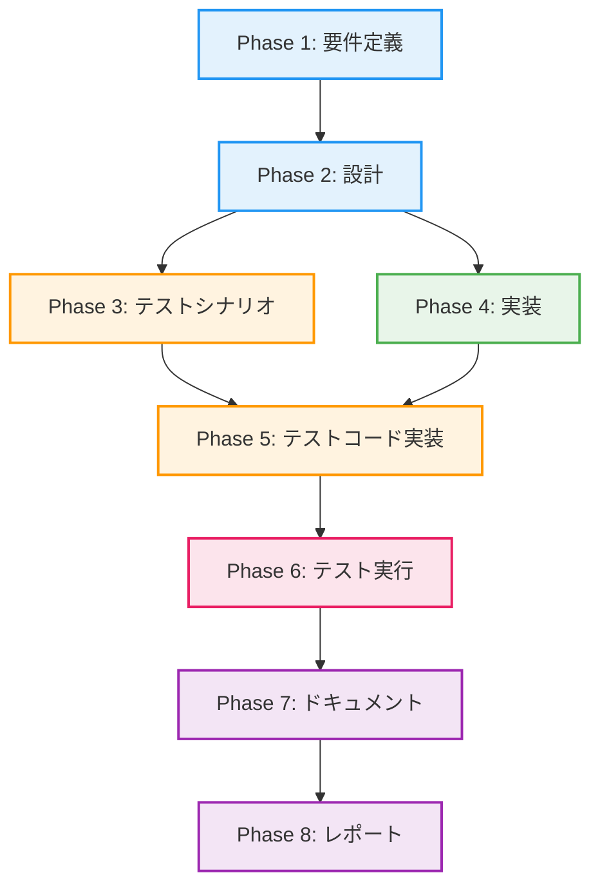

# プロジェクト計画書: Issue #445

## Issue概要

- **Issue番号**: #445
- **タイトル**: [Refactor] ファイルサイズの削減: pr_comment_generator.py
- **状態**: open
- **URL**: https://github.com/tielec/infrastructure-as-code/issues/445
- **ラベル**: auto-generated, refactor, priority:high, code-quality

---

## 1. Issue分析

### 複雑度: 複雑

**判定根拠**:
- 1985行、97関数の大規模モジュールを4つ以上のモジュールに分割
- 複数の関心事（統計処理、フォーマット、OpenAI統合、プロンプト生成）が混在
- 全依存モジュールのインポートパス更新が必要（破壊的変更）
- 互換性レイヤー（Facade）の設計・実装が必要
- 既存テストコードの移行と新規テストの追加が必要

### 見積もり工数: 80~100時間

**根拠**:
- **Phase 1（要件定義）**: 8~10h - 関数依存関係分析、モジュール境界決定
- **Phase 2（設計）**: 12~16h - 4つのモジュールのインターフェース設計、互換性レイヤー設計
- **Phase 3（テストシナリオ）**: 8~10h - 各モジュールのユニットテスト、統合テストシナリオ作成
- **Phase 4（実装）**: 32~40h - 4モジュール分割、互換性レイヤー実装、既存コードリファクタリング
- **Phase 5（テストコード実装）**: 12~16h - ユニットテスト、統合テスト実装
- **Phase 6（テスト実行）**: 4~5h - テスト実行、バグ修正、回帰テスト
- **Phase 7（ドキュメント）**: 3~4h - API仕様書、モジュール構成図、移行ガイド
- **Phase 8（レポート）**: 1~2h - 最終レポート作成、振り返り

### リスク評価: 高

**理由**:
- 破壊的変更により全依存モジュールへの影響が発生
- 関数間の依存関係が複雑で、分割境界の誤りがバグを引き起こす可能性
- OpenAI API統合部分のテストが困難（外部依存）
- 移行期間中の互換性維持が複雑

---

## 2. 実装戦略判断

### 実装戦略: REFACTOR

**判断根拠**:
- 既存の大規模モジュール（1985行、97関数）を複数の小さなモジュールに分割するリファクタリングが中心
- 新規機能の追加ではなく、既存コードの構造改善が目的
- 単一責任の原則（SRP）に基づいて関心事を分離し、保守性・テスタビリティを向上
- 4つの新規モジュール（`PRCommentStatistics`, `CommentFormatter`, `OpenAIIntegration`, `PRCommentGenerator`）を作成するが、これは既存コードの移行であり、新規作成ではない
- 互換性レイヤー（Facade）を実装し、段階的な移行を実現

### テスト戦略: ALL

**判断根拠**:
- **ユニットテスト**: 各分割モジュール（統計、フォーマット、API統合、コア生成）の独立した機能を検証
- **インテグレーションテスト**: モジュール間の連携（統計→フォーマット、コア生成→OpenAI API）を検証
- **BDDテスト**: エンドユーザーのユースケース（「PRコメント生成リクエストを送信すると、適切なコメントが返される」）を検証
- **理由**: 大規模リファクタリング（高リスク）のため、すべてのテストレベルで品質を保証する必要がある
- OpenAI API統合部分はモック化してユニットテストを実施し、実環境への影響を最小化

### テストコード戦略: BOTH_TEST

**判断根拠**:
- **CREATE_TEST**: 新規分割モジュール（`PRCommentStatistics`, `CommentFormatter`, `OpenAIIntegration`）用の新規テストファイルを作成
- **EXTEND_TEST**: 既存の統合テスト（`PRCommentGenerator`に対するテスト）を更新し、互換性レイヤーのテストを追加
- **理由**:
  - 新規モジュールは独立したテストファイルで管理し、保守性を向上
  - 既存の統合テストは互換性検証のために維持し、段階的な移行を支援
  - 両方のアプローチを組み合わせることで、リファクタリング前後の動作同一性を保証

---

## 3. 影響範囲分析

### 既存コードへの影響

**主要な影響**:
- `jenkins/jobs/pipeline/docs-generator/pull-request-comment-builder/src/pr_comment_generator.py`（1985行、97関数）
  - 4つのモジュールに分割: `statistics.py`, `formatter.py`, `openai_integration.py`, `generator.py`
  - 互換性レイヤー: `pr_comment_generator.py`をファサードとして残し、旧インポートパスをサポート

**依存モジュール**:
- PRコメント生成パイプライン（`jenkins/jobs/pipeline/docs-generator/pull-request-comment-builder/`配下）
- パイプラインスクリプト（`from pr_comment_generator import XXX`を使用しているすべてのファイル）

### 依存関係の変更

**新規依存**:
- なし（既存の依存関係を保持）

**既存依存の変更**:
- インポートパスの変更（移行期間中は互換性レイヤーで吸収）
- 旧: `from pr_comment_generator import PRCommentGenerator`
- 新: `from pr_comment_generator.generator import PRCommentGenerator`
- 互換性レイヤー: `pr_comment_generator/__init__.py`で再エクスポート

### マイグレーション要否

- **設定ファイル変更**: なし（互換性レイヤーにより不要）
- **データベーススキーマ変更**: なし
- **移行スクリプト**: 不要（段階的移行により、開発者が任意のタイミングで新インポートパスに移行可能）

---

## 4. タスク分割

### Phase 1: 要件定義 (見積もり: 8~10h)

- [ ] Task 1-1: 影響範囲の詳細調査 (2~3h)
  - `pr_comment_generator.py`をインポートしているすべてのファイルをリストアップ
  - 各ファイルのインポート箇所を特定し、影響範囲マップを作成
  - CI/CDパイプラインへの影響を調査
- [ ] Task 1-2: 関数間の依存関係分析 (3~4h)
  - 97個の関数を静的解析し、呼び出し関係をグラフ化
  - 関数をカテゴリ別に分類（統計、フォーマット、OpenAI、コア生成、ユーティリティ）
  - モジュール分割境界を決定（どの関数をどのモジュールに移行するか）
- [ ] Task 1-3: 受け入れ基準の定義 (1~1.5h)
  - 各モジュールの責務を明確化
  - 互換性レイヤーの動作要件を定義
  - テストカバレッジ目標を設定（80%以上）
- [ ] Task 1-4: リスク分析と軽減策の策定 (2~2.5h)
  - 技術的リスク（依存関係の誤り、API変更）を洗い出し
  - リソースリスク（工数超過、スキル不足）を評価
  - 各リスクに対する軽減策を文書化

### Phase 2: 設計 (見積もり: 12~16h)

- [ ] Task 2-1: PRCommentStatisticsモジュールの設計 (2~3h)
  - 統計データクラスの設計（データ構造、メソッド）
  - 統計計算ロジックの抽出対象を特定
  - public APIの定義（他モジュールから呼び出されるメソッド）
- [ ] Task 2-2: CommentFormatterモジュールの設計 (2~3h)
  - フォーマッタクラスの設計（入力・出力形式）
  - テンプレートエンジンの選定（既存の文字列結合を保持するか、Jinja2等を導入するか）
  - public APIの定義
- [ ] Task 2-3: OpenAIIntegrationモジュールの設計 (2~3h)
  - OpenAIクライアントラッパークラスの設計
  - リクエスト・レスポンス処理ロジックの抽出対象を特定
  - エラーハンドリング・リトライロジックの設計
  - モック化戦略の策定（テスト時のAPI呼び出しシミュレーション）
- [ ] Task 2-4: PRCommentGeneratorコアロジックの設計 (2~3h)
  - オーケストレーション層としての責務を明確化
  - 各モジュールへの依存関係を設計（Dependency Injection）
  - 既存のpublic APIとの互換性を確認
- [ ] Task 2-5: 互換性レイヤー（Facade）の設計 (2~3h)
  - `pr_comment_generator/__init__.py`での再エクスポート設計
  - 旧インポートパスから新インポートパスへの移行期間の設計
  - 非推奨警告（DeprecationWarning）の実装方法を決定
- [ ] Task 2-6: モジュール構成図とインターフェース仕様書の作成 (2~2h)
  - Mermaidクラス図の作成
  - 各モジュールのpublic APIドキュメント作成
  - 移行ガイドのドラフト作成

### Phase 3: テストシナリオ (見積もり: 8~10h)

- [ ] Task 3-1: PRCommentStatisticsのユニットテストシナリオ作成 (1.5~2h)
  - 統計計算ロジックの正確性テスト（閾値計算、平均・中央値計算）
  - エッジケーステスト（空データ、異常値）
- [ ] Task 3-2: CommentFormatterのユニットテストシナリオ作成 (1.5~2h)
  - フォーマット出力の正確性テスト（マークダウン形式、HTML形式）
  - 特殊文字エスケープテスト
- [ ] Task 3-3: OpenAIIntegrationのユニットテストシナリオ作成 (2~3h)
  - モックを使用したAPI呼び出しテスト
  - エラーハンドリング・リトライロジックのテスト
  - レスポンスパース処理のテスト
- [ ] Task 3-4: PRCommentGeneratorの統合テストシナリオ作成 (2~3h)
  - モジュール間連携テスト（統計→フォーマット→生成）
  - 既存のpublic APIとの互換性テスト
- [ ] Task 3-5: BDDテストシナリオ作成 (1~1.5h)
  - Given-When-Thenシナリオ（「PRコメント生成リクエストを送信すると、適切なコメントが返される」）
  - ユーザーストーリーベースのシナリオ

### Phase 4: 実装 (見積もり: 32~40h)

- [ ] Task 4-1: PRCommentStatisticsモジュールの実装 (6~8h)
  - `statistics.py`の作成
  - 統計計算ロジックの移行（関数抽出、クラス化）
  - public APIの実装
- [ ] Task 4-2: CommentFormatterモジュールの実装 (6~8h)
  - `formatter.py`の作成
  - フォーマット処理ロジックの移行
  - テンプレートエンジンの統合（必要に応じて）
- [ ] Task 4-3: OpenAIIntegrationモジュールの実装 (8~10h)
  - `openai_integration.py`の作成
  - OpenAIクライアントラッパーの実装
  - リクエスト・レスポンス処理ロジックの移行
  - エラーハンドリング・リトライロジックの実装
- [ ] Task 4-4: PRCommentGeneratorコアロジックのリファクタリング (6~8h)
  - `generator.py`の作成
  - オーケストレーション層としてのリファクタリング
  - 各モジュールへの依存注入（Dependency Injection）の実装
- [ ] Task 4-5: 互換性レイヤー（Facade）の実装 (3~4h)
  - `pr_comment_generator/__init__.py`での再エクスポート実装
  - 非推奨警告（DeprecationWarning）の追加
  - 旧インポートパスから新インポートパスへの自動変換スクリプト作成
- [ ] Task 4-6: 依存モジュールのインポートパス更新 (3~4h)
  - 影響範囲調査で特定したファイルのインポートパスを更新
  - CI/CDパイプラインスクリプトの更新

### Phase 5: テストコード実装 (見積もり: 12~16h)

- [ ] Task 5-1: PRCommentStatisticsのユニットテスト実装 (2~3h)
  - `test_statistics.py`の作成
  - 統計計算ロジックのテスト実装
- [ ] Task 5-2: CommentFormatterのユニットテスト実装 (2~3h)
  - `test_formatter.py`の作成
  - フォーマット処理のテスト実装
- [ ] Task 5-3: OpenAIIntegrationのユニットテスト実装 (3~4h)
  - `test_openai_integration.py`の作成
  - モックを使用したAPI呼び出しテスト実装
  - エラーハンドリング・リトライのテスト実装
- [ ] Task 5-4: PRCommentGeneratorの統合テスト実装 (3~4h)
  - `test_generator_integration.py`の作成
  - モジュール間連携テストの実装
- [ ] Task 5-5: BDDテスト実装 (2~3h)
  - `test_bdd_pr_comment_generation.py`の作成
  - Given-When-Thenシナリオのテスト実装

### Phase 6: テスト実行 (見積もり: 4~5h)

- [ ] Task 6-1: ユニットテストの実行と修正 (1.5~2h)
  - 各モジュールのユニットテストを実行
  - 失敗したテストの原因調査と修正
- [ ] Task 6-2: 統合テストの実行と修正 (1~1.5h)
  - 統合テストを実行
  - モジュール間連携の問題を修正
- [ ] Task 6-3: BDDテストの実行と修正 (0.5~1h)
  - BDDテストを実行
  - ユーザーストーリーレベルの問題を修正
- [ ] Task 6-4: 回帰テストの実行 (1~1.5h)
  - 既存の統合テストを実行し、互換性を確認
  - CI/CDパイプラインでの動作確認

### Phase 7: ドキュメント (見積もり: 3~4h)

- [ ] Task 7-1: API仕様書の作成 (1~1.5h)
  - 各モジュールのpublic APIをドキュメント化
  - 使用例を追加
- [ ] Task 7-2: モジュール構成図の更新 (0.5~1h)
  - Mermaidクラス図を最終版に更新
  - モジュール間の依存関係を図示
- [ ] Task 7-3: 移行ガイドの作成 (1~1.5h)
  - 旧インポートパスから新インポートパスへの移行手順を記載
  - 非推奨警告への対応方法を記載
  - FAQ（よくある質問）を追加

### Phase 8: レポート (見積もり: 1~2h)

- [ ] Task 8-1: 最終レポートの作成 (1~1.5h)
  - リファクタリング前後の比較（行数、関数数、テストカバレッジ）
  - 達成した改善効果（可読性、保守性、テスタビリティ）を記載
  - 振り返りと今後の改善提案を記載
- [ ] Task 8-2: Issue #445のクローズ (0.5h)
  - 最終レポートをIssueコメントに投稿
  - すべてのアクションアイテムが完了していることを確認
  - Issueをクローズ

---

## 5. 依存関係

**タスクレベルの依存関係**:
- Task 1-2（関数依存関係分析）→ Task 2-1~2-4（各モジュールの設計）
- Task 2-1~2-4（各モジュールの設計）→ Task 4-1~4-4（各モジュールの実装）
- Task 2-1~2-4（各モジュールの設計）→ Task 3-1~3-4（テストシナリオ作成）
- Task 4-1~4-4（各モジュールの実装）→ Task 5-1~5-4（テストコード実装）
- Task 4-5（互換性レイヤー実装）→ Task 6-4（回帰テスト）

---

## 6. リスクと軽減策

### リスク1: 関数依存関係の誤った分析による分割ミス

- **影響度**: 高
- **確率**: 中
- **軽減策**:
  - 静的解析ツール（`pydeps`, `modulegraph`）を使用して依存関係グラフを自動生成
  - 分析結果を複数人でレビューし、分割境界の妥当性を検証
  - 小規模な試験的分割（1~2モジュール）を先行実施し、問題を早期発見

### リスク2: 破壊的変更による依存モジュールへの影響

- **影響度**: 高
- **確率**: 中
- **軽減策**:
  - 互換性レイヤー（Facade）を実装し、旧インポートパスを移行期間中サポート
  - 非推奨警告（DeprecationWarning）を追加し、開発者に移行を促進
  - 段階的移行期間（最低2週間）を設け、全依存モジュールの更新を完了
  - CI/CDパイプラインで回帰テストを実施し、互換性を継続的に検証

### リスク3: OpenAI API統合部分のテストが困難

- **影響度**: 中
- **確率**: 高
- **軽減策**:
  - モックライブラリ（`unittest.mock`, `responses`）を使用してAPI呼び出しをシミュレート
  - 実API呼び出しを含む統合テストは別途実施（ステージング環境のみ）
  - OpenAI APIのレート制限・エラーレスポンスを考慮したリトライロジックを実装

### リスク4: 工数超過によるスケジュール遅延

- **影響度**: 中
- **確率**: 中
- **軽減策**:
  - タスクごとに進捗を追跡し、遅延の早期検知（1日単位でチェック）
  - 優先度の低いタスク（ドキュメント更新の一部等）を後回しにし、コア機能の実装を優先
  - 必要に応じて追加リソース（レビュアー、テストサポート）を投入

### リスク5: 互換性レイヤーの複雑化によるバグ混入

- **影響度**: 中
- **確率**: 低
- **軽減策**:
  - 互換性レイヤーのロジックを最小限に保つ（単純な再エクスポートのみ）
  - 互換性レイヤー専用のテストを追加し、旧インポートパスの動作を保証
  - 移行期間終了後は互換性レイヤーを削除し、技術的負債を残さない

### リスク6: テストカバレッジ不足による潜在バグの見逃し

- **影響度**: 中
- **確率**: 中
- **軽減策**:
  - テストカバレッジツール（`pytest-cov`）を使用し、目標80%以上を達成
  - エッジケース（空データ、異常値、API障害）を網羅的にテスト
  - コードレビュー時にテスト網羅性をチェック項目に追加

---

## 7. 品質ゲート

### Phase 1: 要件定義

- [ ] 影響を受けるすべての依存モジュールがリストアップされている
- [ ] 97個の関数の依存関係グラフが作成され、分割境界が明確に決定されている
- [ ] 受け入れ基準（各モジュールの責務、互換性要件、テストカバレッジ目標）が定義されている
- [ ] リスクと軽減策が文書化されている

### Phase 2: 設計

- [ ] 実装戦略（REFACTOR）の判断根拠が明記されている
- [ ] テスト戦略（ALL）の判断根拠が明記されている
- [ ] テストコード戦略（BOTH_TEST）の判断根拠が明記されている
- [ ] 4つのモジュール（`PRCommentStatistics`, `CommentFormatter`, `OpenAIIntegration`, `PRCommentGenerator`）のpublic APIが定義されている
- [ ] 互換性レイヤー（Facade）の設計が完了している
- [ ] モジュール構成図（Mermaidクラス図）が作成されている

### Phase 3: テストシナリオ

- [ ] 各モジュールのユニットテストシナリオが作成されている
- [ ] 統合テストシナリオが作成されている
- [ ] BDDテストシナリオ（Given-When-Then）が作成されている
- [ ] エッジケース（空データ、異常値、API障害）がカバーされている

### Phase 4: 実装

- [ ] 4つのモジュールが分割され、各モジュールのpublic APIが実装されている
- [ ] 互換性レイヤー（`pr_comment_generator/__init__.py`）が実装され、旧インポートパスが動作する
- [ ] 非推奨警告（DeprecationWarning）が追加されている
- [ ] すべての依存モジュールのインポートパスが更新されている
- [ ] コードレビューが完了し、指摘事項がすべて修正されている

### Phase 5: テストコード実装

- [ ] 各モジュールのユニットテストが実装されている
- [ ] 統合テストが実装されている
- [ ] BDDテストが実装されている
- [ ] テストカバレッジが80%以上である

### Phase 6: テスト実行

- [ ] すべてのユニットテストが成功している
- [ ] すべての統合テストが成功している
- [ ] すべてのBDDテストが成功している
- [ ] 回帰テストが成功し、互換性が確認されている
- [ ] CI/CDパイプラインでの動作確認が完了している

### Phase 7: ドキュメント

- [ ] API仕様書が作成され、使用例が追加されている
- [ ] モジュール構成図が最終版に更新されている
- [ ] 移行ガイドが作成され、FAQ（よくある質問）が追加されている

### Phase 8: レポート

- [ ] リファクタリング前後の比較（行数、関数数、テストカバレッジ）が記載されている
- [ ] 達成した改善効果（可読性、保守性、テスタビリティ）が記載されている
- [ ] 振り返りと今後の改善提案が記載されている
- [ ] Issue #445がクローズされている

---

## 8. 完了判定基準

このプロジェクトは、以下の基準をすべて満たした場合に完了とみなされます：

1. **機能要件**:
   - 4つのモジュール（`PRCommentStatistics`, `CommentFormatter`, `OpenAIIntegration`, `PRCommentGenerator`）が分割され、各モジュールが明確な責務を持つ
   - 互換性レイヤーにより、旧インポートパスから新インポートパスへの段階的移行が可能

2. **品質要件**:
   - テストカバレッジが80%以上
   - すべてのテスト（ユニット、統合、BDD）が成功
   - 回帰テストにより、既存機能との互換性が保証されている

3. **ドキュメント要件**:
   - API仕様書、モジュール構成図、移行ガイドが作成されている
   - Issue #445のすべてのアクションアイテムが完了している

4. **運用要件**:
   - CI/CDパイプラインでの動作確認が完了している
   - ステージング環境でのデプロイと動作検証が完了している

---

## 9. 次のステップ

1. **Phase 1の開始**: Task 1-1（影響範囲の詳細調査）から着手
2. **定期的な進捗確認**: 1日単位でタスクの進捗を追跡し、遅延を早期検知
3. **リスクモニタリング**: 識別されたリスクを継続的に監視し、軽減策を実施
4. **コミュニケーション**: チームメンバーとの定期的なミーティング（週1回）で進捗と課題を共有

---

## 10. 参考情報

- **プロジェクトガイドライン**: `CLAUDE.md`, `ARCHITECTURE.md`, `CONTRIBUTION.md`, `README.md`
- **Python PEP 8**: https://peps.python.org/pep-0008/
- **SOLID原則**: https://en.wikipedia.org/wiki/SOLID
- **Clean Architecture**: https://blog.cleancoder.com/uncle-bob/2012/08/13/the-clean-architecture.html
- **Facade パターン**: https://refactoring.guru/design-patterns/facade
- **Dependency Injection**: https://en.wikipedia.org/wiki/Dependency_injection

---

## 承認

- **作成者**: Claude Code
- **作成日**: 2025-01-XX
- **レビュアー**: （Phase 0 Review後に記載）
- **承認日**: （Phase 0 Review後に記載）
