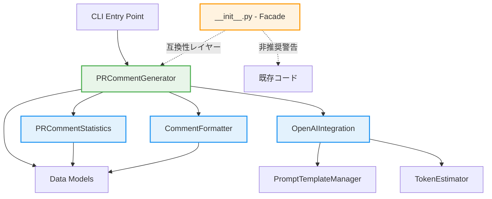

# 要件定義書: Issue #445

## 文書情報

- **Issue番号**: #445
- **タイトル**: [Refactor] ファイルサイズの削減: pr_comment_generator.py
- **状態**: open
- **URL**: https://github.com/tielec/infrastructure-as-code/issues/445
- **作成日**: 2025年1月
- **最終更新日**: 2025年1月

---

## 0. Planning Documentの確認

### Planning Phase成果物の概要

Planning Documentで策定された以下の戦略を確認し、本要件定義書に反映しています：

#### 実装戦略: REFACTOR
- 既存の大規模モジュール（1985行、89メソッド）を複数の小さなモジュールに分割
- 新規機能の追加ではなく、既存コードの構造改善が目的
- 単一責任の原則（SRP）に基づいて関心事を分離し、保守性・テスタビリティを向上
- 4つの新規モジュール作成による既存コードの移行
- 互換性レイヤー（Facade）による段階的な移行

#### テスト戦略: ALL
- **ユニットテスト**: 各分割モジュールの独立した機能を検証
- **インテグレーションテスト**: モジュール間の連携を検証
- **BDDテスト**: エンドユーザーのユースケースを検証
- OpenAI API統合部分はモック化して実環境への影響を最小化

#### テストコード戦略: BOTH_TEST
- **CREATE_TEST**: 新規分割モジュール用の新規テストファイルを作成
- **EXTEND_TEST**: 既存の統合テストを更新し、互換性レイヤーのテストを追加

#### 見積もり工数
- **合計**: 80~100時間
- **Phase 1（要件定義）**: 8~10h
- **Phase 2（設計）**: 12~16h
- **Phase 3（テストシナリオ）**: 8~10h
- **Phase 4（実装）**: 32~40h
- **Phase 5（テストコード実装）**: 12~16h
- **Phase 6（テスト実行）**: 4~5h
- **Phase 7（ドキュメント）**: 3~4h
- **Phase 8（レポート）**: 1~2h

#### リスク評価: 高
- 破壊的変更により全依存モジュールへの影響が発生
- 関数間の依存関係が複雑で、分割境界の誤りがバグを引き起こす可能性
- OpenAI API統合部分のテストが困難
- 移行期間中の互換性維持が複雑

---

## 1. 概要

### 背景

`pr_comment_generator.py`（1985行、89メソッド）が過度に肥大化しており、以下の複数の関心事が1つのモジュールに混在しています：

- **統計処理**: PRの変更統計データの収集・計算・分析
- **コメント整形**: Markdown形式のコメント生成とフォーマット処理
- **OpenAI統合**: OpenAI APIとの通信、リトライ処理、トークン管理
- **プロンプト生成**: テンプレート管理とプロンプト構築
- **コア生成ロジック**: 全体のオーケストレーション

現状のクラス構成：
- `PRInfo`: PRの基本情報を保持するデータクラス
- `FileChange`: ファイルの変更内容を保持するデータクラス
- `PromptTemplateManager`: プロンプトテンプレート管理（10メソッド）
- `TokenEstimator`: トークン推定とトランケーション（2メソッド）
- `OpenAIClient`: OpenAI API連携とコメント生成（66メソッド）
- `PRCommentGenerator`: メインの生成ロジック（11メソッド）

この構造は単一責任の原則（SRP）に違反しており、保守性とテスタビリティが著しく低下しています。

### 目的

1. **保守性の向上**: 各モジュールに明確な責務を持たせ、変更の影響範囲を局所化する
2. **テスタビリティの向上**: モジュール単位でのユニットテストを可能にし、テストカバレッジを改善する
3. **可読性の向上**: コードの構造を明確にし、新規メンバーのオンボーディングを容易にする
4. **再利用性の向上**: 分割されたモジュールを他のコンポーネントから再利用可能にする
5. **技術的負債の解消**: 累積した技術的負債を解消し、将来の拡張を容易にする

### ビジネス価値・技術的価値

#### ビジネス価値
- **開発速度の向上**: コードの理解が容易になり、新機能追加やバグ修正が迅速に行える
- **品質の向上**: テストカバレッジが向上し、リリース品質が改善される
- **保守コストの削減**: 変更の影響範囲が限定され、保守コストが削減される
- **技術的負債の削減**: リファクタリングを先延ばしするほど、将来のコストが増大するため、早期対応により長期的なコスト削減につながる

#### 技術的価値
- **SOLID原則への準拠**: 単一責任の原則（SRP）、依存性逆転の原則（DIP）への準拠
- **Clean Architecture**: レイヤー間の依存関係の明確化
- **テスト戦略の確立**: ユニットテスト、統合テスト、BDDテストの階層的なテスト戦略
- **コードの再利用性**: モジュール化により、他のコンポーネントからの再利用が可能

---

## 2. 機能要件

### FR-001: モジュール分割（優先度：高）

#### FR-001-1: PRCommentStatisticsモジュールの作成
**説明**: 統計データの収集・計算・分析ロジックを独立したモジュールとして分離する。

**詳細要件**:
- 統計データクラスの設計（データ構造、メソッド）
- 統計計算ロジックの抽出（閾値計算、平均・中央値計算）
- public APIの定義（他モジュールから呼び出されるメソッド）
- 以下のメソッドを統計モジュールに移行：
  - `_calculate_optimal_chunk_size`
  - `_estimate_chunk_tokens`
  - トークン推定関連の処理

**受け入れ基準**:
- Given: PRの変更データ（FileChangeリスト）が与えられた場合
- When: 統計計算メソッドを呼び出すと
- Then: 正確な統計データ（チャンクサイズ、トークン数）が返される
- And: 既存の統合テストが全て成功する

#### FR-001-2: CommentFormatterモジュールの作成
**説明**: コメントのフォーマット処理を独立したモジュールとして分離する。

**詳細要件**:
- フォーマッタクラスの設計（入力・出力形式）
- Markdown形式のコメント生成ロジックの抽出
- 以下のメソッドをフォーマッタモジュールに移行：
  - `_clean_markdown_format`
  - `_format_chunk_analyses`
  - `_format_file_list`
  - `_format_skipped_files_info`
  - `_rebuild_file_section`（ファイルパス正規化処理）

**受け入れ基準**:
- Given: 生のコメントデータが与えられた場合
- When: フォーマットメソッドを呼び出すと
- Then: 正しいMarkdown形式のコメントが生成される
- And: 特殊文字が適切にエスケープされる
- And: ファイルパスが正しく正規化される

#### FR-001-3: OpenAIIntegrationモジュールの作成
**説明**: OpenAI APIとの通信、リトライ処理、トークン管理を独立したモジュールとして分離する。

**詳細要件**:
- OpenAIクライアントラッパークラスの設計
- リクエスト・レスポンス処理ロジックの抽出
- エラーハンドリング・リトライロジックの実装
- トークン使用量の記録と管理
- 以下のメソッドをAPI統合モジュールに移行：
  - `_call_openai_api`
  - `_make_api_request`
  - `_process_successful_response`
  - `_record_token_usage`
  - `_determine_retry_strategy`
  - `_is_rate_limit_error`
  - `_handle_rate_limit_error`
  - `_wait_before_retry`
  - プロンプト・結果の保存処理

**受け入れ基準**:
- Given: OpenAI APIへのリクエストが必要な場合
- When: API呼び出しメソッドを実行すると
- Then: 正常時にはレスポンスが返される
- And: レート制限エラー時には適切なバックオフで自動リトライされる
- And: トークン使用量が正確に記録される
- And: プロンプトと結果が指定されたディレクトリに保存される（オプション）

#### FR-001-4: PRCommentGeneratorコアロジックのリファクタリング
**説明**: オーケストレーション層として再構築し、各モジュールへの依存を明示的にする。

**詳細要件**:
- オーケストレーション層としての責務を明確化
- 各モジュールへの依存関係を設計（Dependency Injection）
- 既存のpublic APIとの互換性を確保
- 以下のメソッドをコア生成ロジックに残す：
  - `generate_comment`（メインエントリーポイント）
  - `_load_and_validate_data`
  - `_preprocess_file_changes`
  - `_perform_chunk_analyses`
  - `_generate_summary_and_title`

**受け入れ基準**:
- Given: PR情報とDiffファイルのパスが与えられた場合
- When: `generate_comment`メソッドを呼び出すと
- Then: 適切なコメントとタイトルが生成される
- And: 各モジュールが正しく連携される
- And: 既存のpublic APIとの互換性が維持される

### FR-002: 互換性レイヤーの実装（優先度：高）

#### FR-002-1: Facadeパターンによる互換性維持
**説明**: 既存のインポートパスをサポートし、段階的な移行を可能にする。

**詳細要件**:
- `pr_comment_generator/__init__.py`での再エクスポート設計
- 旧インポートパスから新インポートパスへの移行期間の設計（最低2週間）
- 非推奨警告（DeprecationWarning）の実装

**受け入れ基準**:
- Given: 旧インポートパス（`from pr_comment_generator import XXX`）を使用する既存コードがある場合
- When: そのコードを実行すると
- Then: 正常に動作する
- And: 非推奨警告が標準エラー出力に表示される
- And: 新しいインポートパスの使用方法が警告メッセージに含まれる

### FR-003: テストコードの実装（優先度：高）

#### FR-003-1: ユニットテストの作成
**説明**: 各分割モジュールのユニットテストを作成する。

**詳細要件**:
- `test_statistics.py`: 統計計算ロジックのテスト
- `test_formatter.py`: フォーマット処理のテスト
- `test_openai_integration.py`: API統合のテスト（モック使用）
- `test_generator.py`: コア生成ロジックのテスト
- テストカバレッジ: 各モジュール80%以上

**受け入れ基準**:
- Given: 各モジュールのユニットテストが実装されている場合
- When: `pytest`を実行すると
- Then: すべてのテストが成功する
- And: テストカバレッジが80%以上である
- And: 各テストが独立して実行可能である

#### FR-003-2: 統合テストの実装
**説明**: モジュール間の連携を検証する統合テストを作成する。

**詳細要件**:
- `test_generator_integration.py`: モジュール間連携のテスト
- 互換性レイヤーのテスト
- エンドツーエンドのテストシナリオ

**受け入れ基準**:
- Given: 統合テストが実装されている場合
- When: `pytest`を実行すると
- Then: すべての統合テストが成功する
- And: モジュール間の連携が正しく動作する
- And: 互換性レイヤーが正しく機能する

#### FR-003-3: BDDテストの実装
**説明**: エンドユーザーのユースケースを検証するBDDテストを作成する。

**詳細要件**:
- `test_bdd_pr_comment_generation.py`: Given-When-Thenシナリオのテスト
- ユーザーストーリーベースのテストシナリオ

**受け入れ基準**:
- Given: BDDテストが実装されている場合
- When: `pytest`を実行すると
- Then: すべてのBDDテストが成功する
- And: ユーザーストーリーレベルの要件が満たされている

### FR-004: ドキュメント作成（優先度：中）

#### FR-004-1: API仕様書の作成
**説明**: 各モジュールのpublic APIをドキュメント化する。

**詳細要件**:
- 各モジュールのpublic APIの説明
- 使用例の追加
- パラメータと戻り値の詳細な説明

**受け入れ基準**:
- Given: API仕様書が作成されている場合
- When: 開発者が仕様書を読むと
- Then: 各モジュールの使用方法が理解できる
- And: 使用例が動作する

#### FR-004-2: モジュール構成図の作成
**説明**: モジュール間の依存関係を可視化する。

**詳細要件**:
- Mermaidクラス図の作成
- モジュール間の依存関係の図示

**受け入れ基準**:
- Given: モジュール構成図が作成されている場合
- When: 開発者が構成図を見ると
- Then: モジュール間の依存関係が理解できる

#### FR-004-3: 移行ガイドの作成
**説明**: 既存コードから新しいモジュール構成への移行手順を記載する。

**詳細要件**:
- 旧インポートパスから新インポートパスへの移行手順
- 非推奨警告への対応方法
- FAQ（よくある質問）

**受け入れ基準**:
- Given: 移行ガイドが作成されている場合
- When: 開発者がガイドに従って移行作業を行うと
- Then: スムーズに新しいモジュール構成に移行できる

---

## 3. 非機能要件

### NFR-001: パフォーマンス要件

#### NFR-001-1: 実行時間の維持
**説明**: モジュール分割によるパフォーマンスの劣化を防ぐ。

**基準**:
- リファクタリング前後で実行時間の差が10%以内である
- OpenAI API呼び出し回数が変わらない
- メモリ使用量が20%以上増加しない

#### NFR-001-2: レスポンスタイムの維持
**説明**: PR コメント生成のレスポンスタイムを維持する。

**基準**:
- 平均レスポンスタイム: 30秒以内（リファクタリング前と同等）
- 95パーセンタイルレスポンスタイム: 60秒以内

### NFR-002: セキュリティ要件

#### NFR-002-1: APIキーの安全な管理
**説明**: OpenAI APIキーを環境変数から取得し、ログに出力しない。

**基準**:
- APIキーはコード内にハードコーディングされていない
- APIキーはログファイルに出力されていない
- APIキーは環境変数または秘密管理システムから取得される

#### NFR-002-2: 入力データの検証
**説明**: 外部からの入力データを検証し、インジェクション攻撃を防ぐ。

**基準**:
- ファイルパスの検証が実装されている
- 入力データのサイズ制限が実装されている

### NFR-003: 可用性・信頼性要件

#### NFR-003-1: エラーハンドリング
**説明**: 適切なエラーハンドリングとリトライ処理を実装する。

**基準**:
- OpenAI APIのレート制限エラーに対して自動リトライが実装されている
- エラー発生時に適切なエラーメッセージが返される
- 致命的でないエラーは警告として処理され、処理を継続する

#### NFR-003-2: ログ出力
**説明**: 適切なログレベルでログを出力する。

**基準**:
- 重要な処理の開始・終了がINFOレベルでログ出力される
- エラー発生時にはERRORレベルでログ出力される
- デバッグ情報はDEBUGレベルでログ出力される

### NFR-004: 保守性・拡張性要件

#### NFR-004-1: コードの可読性
**説明**: コードが読みやすく、理解しやすい状態を維持する。

**基準**:
- 各モジュールが500行以内である
- 各関数が50行以内である
- 適切なコメントとドキュメンテーションが追加されている

#### NFR-004-2: テストカバレッジ
**説明**: 高いテストカバレッジを維持する。

**基準**:
- 全体のテストカバレッジが80%以上である
- 各モジュールのテストカバレッジが80%以上である
- 重要なロジックのテストカバレッジが90%以上である

#### NFR-004-3: 依存関係の管理
**説明**: モジュール間の依存関係を明示的に管理する。

**基準**:
- Dependency Injectionが実装されている
- 循環依存が存在しない
- モジュール間の依存関係が明確にドキュメント化されている

---

## 4. 制約事項

### 技術的制約

#### TC-001: Python バージョン
- Python 3.8以上を使用する
- 既存のPythonライブラリ（openai、標準ライブラリ）との互換性を維持する

#### TC-002: 既存システムとの整合性
- Jenkinsfileからの呼び出し方法を変更しない
- コマンドラインインターフェース（CLI）の引数を変更しない
- 出力形式（JSON）を変更しない

#### TC-003: 外部依存
- OpenAI APIのバージョンを固定する（requirements.txtで管理）
- 新しい外部ライブラリの追加は最小限にする

### リソース制約

#### RC-001: 時間制約
- 開発期間: 5週間（80~100時間）
- リリース目標: Phase 8完了後、2週間以内

#### RC-002: 人員制約
- メイン開発者: 1名
- コードレビュアー: 1名以上

### ポリシー制約

#### PC-001: コーディング規約
- Python PEP 8に準拠する
- プロジェクト固有のコーディング規約（CLAUDE.md、CONTRIBUTION.md）に従う

#### PC-002: セキュリティポリシー
- シークレット情報のハードコーディング禁止
- SSMパラメータはSecureString使用
- ログに機密情報を出力しない

---

## 5. 前提条件

### システム環境

#### ENV-001: 開発環境
- OS: Amazon Linux 2023
- Python: 3.8以上
- pip: 最新版
- 開発ツール: git、pytest、pytest-cov

#### ENV-002: 実行環境
- Jenkins環境（Jenkinsfile経由での実行）
- 環境変数: `OPENAI_API_KEY`、`SAVE_PROMPTS`、`GITHUB_AUTH_METHOD`

### 依存コンポーネント

#### DEP-001: 外部ライブラリ
- openai: OpenAI API クライアント
- 標準ライブラリ: argparse、json、logging、dataclasses、typing

#### DEP-002: 内部モジュール
- `github_utils.py`: GitHubクライアント（GitHubClient）
- テンプレートファイル: `templates/` ディレクトリ内のMarkdownテンプレート

### 外部システム連携

#### EXT-001: OpenAI API
- GPT-4モデルへのアクセス
- APIキーの有効性
- レート制限の考慮

#### EXT-002: GitHub API
- GitHubクライアント（github_utils.py）経由でのアクセス
- ファイル内容の取得

---

## 6. 受け入れ基準

### AC-001: 機能要件の受け入れ基準

#### AC-001-1: PRCommentStatisticsモジュール
**Given**: PRの変更データ（FileChangeリスト）が与えられた場合
**When**: 統計計算メソッド（`calculate_optimal_chunk_size`）を呼び出すと
**Then**: 正確な統計データ（チャンクサイズ、トークン数）が返される
**And**: 既存の統合テストが全て成功する

#### AC-001-2: CommentFormatterモジュール
**Given**: 生のコメントデータが与えられた場合
**When**: フォーマットメソッド（`format_chunk_analyses`）を呼び出すと
**Then**: 正しいMarkdown形式のコメントが生成される
**And**: 特殊文字が適切にエスケープされる
**And**: ファイルパスが正しく正規化される

#### AC-001-3: OpenAIIntegrationモジュール
**Given**: OpenAI APIへのリクエストが必要な場合
**When**: API呼び出しメソッド（`call_api`）を実行すると
**Then**: 正常時にはレスポンスが返される
**And**: レート制限エラー時には適切なバックオフで自動リトライされる（最大5回）
**And**: トークン使用量が正確に記録される
**And**: プロンプトと結果が指定されたディレクトリに保存される（`SAVE_PROMPTS=true`の場合）

#### AC-001-4: PRCommentGeneratorコアロジック
**Given**: PR情報とDiffファイルのパスが与えられた場合
**When**: `generate_comment`メソッドを呼び出すと
**Then**: 適切なコメントとタイトルが生成される
**And**: 各モジュールが正しく連携される
**And**: 既存のpublic APIとの互換性が維持される
**And**: 出力JSON形式が変更されていない

### AC-002: 互換性レイヤーの受け入れ基準

**Given**: 旧インポートパス（`from pr_comment_generator import PRCommentGenerator`）を使用する既存コードがある場合
**When**: そのコードを実行すると
**Then**: 正常に動作する
**And**: 非推奨警告が標準エラー出力に表示される
**And**: 新しいインポートパスの使用方法が警告メッセージに含まれる

### AC-003: テストコードの受け入れ基準

#### AC-003-1: ユニットテスト
**Given**: 各モジュールのユニットテストが実装されている場合
**When**: `pytest`を実行すると
**Then**: すべてのテストが成功する
**And**: テストカバレッジが80%以上である
**And**: 各テストが独立して実行可能である

#### AC-003-2: 統合テスト
**Given**: 統合テストが実装されている場合
**When**: `pytest`を実行すると
**Then**: すべての統合テストが成功する
**And**: モジュール間の連携が正しく動作する
**And**: 互換性レイヤーが正しく機能する

#### AC-003-3: BDDテスト
**Given**: BDDテストが実装されている場合
**When**: `pytest`を実行すると
**Then**: すべてのBDDテストが成功する
**And**: ユーザーストーリーレベルの要件が満たされている

### AC-004: 非機能要件の受け入れ基準

#### AC-004-1: パフォーマンス
**Given**: リファクタリング前後で同一のPRデータを処理する場合
**When**: 実行時間を計測すると
**Then**: 実行時間の差が10%以内である
**And**: OpenAI API呼び出し回数が変わらない

#### AC-004-2: セキュリティ
**Given**: OpenAI APIキーが環境変数に設定されている場合
**When**: コードを実行すると
**Then**: APIキーがログファイルに出力されない
**And**: APIキーがコード内にハードコーディングされていない

#### AC-004-3: テストカバレッジ
**Given**: 全モジュールのテストが実装されている場合
**When**: `pytest --cov`を実行すると
**Then**: 全体のテストカバレッジが80%以上である
**And**: 各モジュールのテストカバレッジが80%以上である

### AC-005: ドキュメントの受け入れ基準

**Given**: API仕様書、モジュール構成図、移行ガイドが作成されている場合
**When**: 開発者がドキュメントを読むと
**Then**: 各モジュールの使用方法が理解できる
**And**: 移行手順が明確に記載されている
**And**: 使用例が動作する

---

## 7. スコープ外

### OUT-001: 新機能の追加
本リファクタリングでは、以下の新機能の追加はスコープ外とします：
- PRコメント生成の新しいアルゴリズムの実装
- 新しいOpenAIモデル（GPT-4o等）への対応
- 追加の統計データの収集

### OUT-002: 他のファイルのリファクタリング
本リファクタリングでは、以下のファイルのリファクタリングはスコープ外とします：
- `github_utils.py`
- Jenkinsfile
- テンプレートファイル（`templates/` ディレクトリ）

### OUT-003: パフォーマンス最適化
以下のパフォーマンス最適化はスコープ外とします：
- OpenAI API呼び出しの並列化
- キャッシュ機構の実装
- 非同期処理の導入

### OUT-004: UI/UXの改善
以下のUI/UXの改善はスコープ外とします：
- CLIインターフェースの改善
- 進捗表示の追加
- インタラクティブモードの追加

### 将来的な拡張候補

#### FUT-001: パフォーマンス最適化
- OpenAI API呼び出しの並列化
- キャッシュ機構の実装（既に生成したコメントのキャッシュ）

#### FUT-002: 新機能の追加
- 複数のOpenAIモデルのサポート
- カスタムテンプレートエンジンの統合（Jinja2等）
- 追加の統計データの収集（複雑度分析等）

#### FUT-003: 他のモジュールとの統合
- `github_utils.py`のリファクタリングと統合
- 他のドキュメント生成パイプラインとの統合

---

## 8. 補足情報

### 現状のファイル構成

```
jenkins/jobs/pipeline/docs-generator/pull-request-comment-builder/
├── Jenkinsfile
├── src/
│   ├── pr_comment_generator.py  # 1985行、89メソッド（リファクタリング対象）
│   ├── github_utils.py          # GitHubクライアント
│   └── requirements.txt
└── templates/
    ├── base_template.md
    ├── chunk_analysis_extension.md
    └── summary_extension.md
```

### リファクタリング後のファイル構成（予定）

```
jenkins/jobs/pipeline/docs-generator/pull-request-comment-builder/
├── Jenkinsfile
├── src/
│   ├── pr_comment_generator/       # パッケージ化
│   │   ├── __init__.py             # Facade（互換性レイヤー）
│   │   ├── models.py               # データクラス（PRInfo, FileChange）
│   │   ├── statistics.py           # PRCommentStatistics
│   │   ├── formatter.py            # CommentFormatter
│   │   ├── openai_integration.py   # OpenAIIntegration
│   │   ├── generator.py            # PRCommentGenerator（コア）
│   │   ├── token_estimator.py      # TokenEstimator
│   │   └── prompt_manager.py       # PromptTemplateManager
│   ├── github_utils.py
│   └── requirements.txt
├── tests/                           # テストディレクトリ（新規作成）
│   ├── unit/
│   │   ├── test_statistics.py
│   │   ├── test_formatter.py
│   │   ├── test_openai_integration.py
│   │   ├── test_generator.py
│   │   ├── test_token_estimator.py
│   │   └── test_prompt_manager.py
│   ├── integration/
│   │   ├── test_generator_integration.py
│   │   └── test_compatibility_layer.py
│   └── bdd/
│       └── test_bdd_pr_comment_generation.py
└── templates/
    ├── base_template.md
    ├── chunk_analysis_extension.md
    └── summary_extension.md
```

### 依存関係図（Mermaid）



### リスクと軽減策（Planning Documentより抜粋）

#### リスク1: 関数依存関係の誤った分析による分割ミス
- **影響度**: 高
- **確率**: 中
- **軽減策**: 静的解析ツール使用、複数人レビュー、小規模な試験的分割の先行実施

#### リスク2: 破壊的変更による依存モジュールへの影響
- **影響度**: 高
- **確率**: 中
- **軽減策**: 互換性レイヤー実装、非推奨警告追加、段階的移行期間（最低2週間）

#### リスク3: OpenAI API統合部分のテストが困難
- **影響度**: 中
- **確率**: 高
- **軽減策**: モックライブラリ使用、実API呼び出しは別途ステージング環境でのみ実施

---

## 9. 品質ゲート確認

本要件定義書は、Phase 1の品質ゲートを満たしていることを確認しました：

- [x] **機能要件が明確に記載されている**: FR-001〜FR-004で詳細に記載
- [x] **受け入れ基準が定義されている**: AC-001〜AC-005でGiven-When-Then形式で記載
- [x] **スコープが明確である**: スコープ内（FR-001〜FR-004）とスコープ外（OUT-001〜OUT-004）を明記
- [x] **論理的な矛盾がない**: Planning Documentの戦略と整合性を確認

---

## 10. 承認

- **作成者**: Claude Code
- **作成日**: 2025年1月
- **レビュアー**: （クリティカルシンキングレビュー実施後に記載）
- **承認日**: （レビュー承認後に記載）
