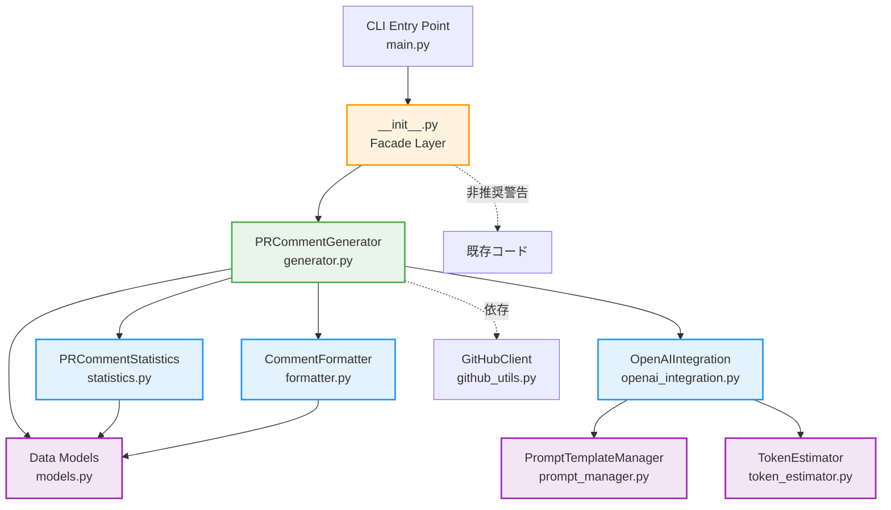
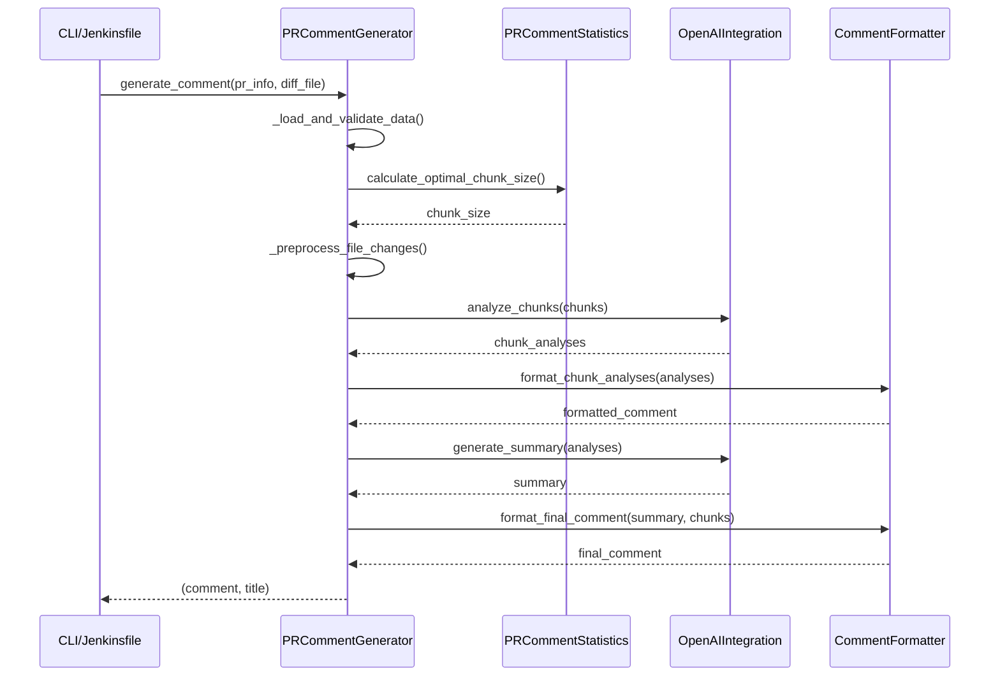
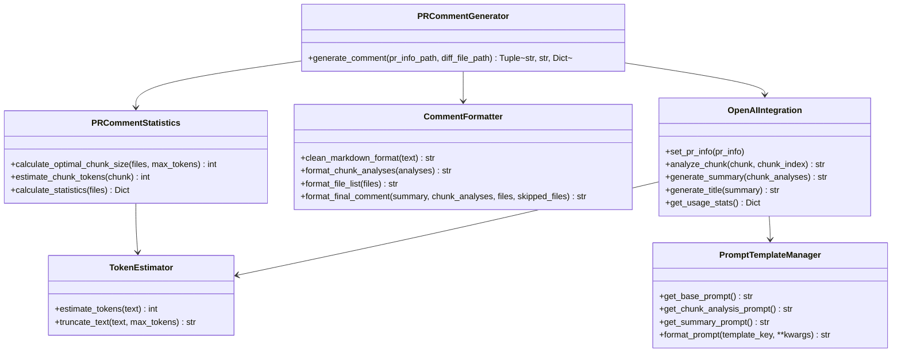
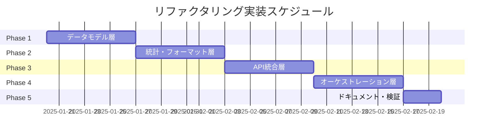

# 詳細設計書: Issue #445

## 文書情報

- **Issue番号**: #445
- **タイトル**: [Refactor] ファイルサイズの削減: pr_comment_generator.py
- **状態**: open
- **URL**: https://github.com/tielec/infrastructure-as-code/issues/445
- **作成日**: 2025年1月
- **最終更新日**: 2025年1月

---

## 0. Planning & Requirements Documentの確認

### Planning Phase成果物の概要

Planning Documentで策定された以下の戦略を確認し、本設計書に反映しています：

#### 実装戦略: REFACTOR
- 既存の大規模モジュール（1985行、89メソッド）を複数の小さなモジュールに分割
- 新規機能の追加ではなく、既存コードの構造改善が目的
- 単一責任の原則（SRP）に基づいて関心事を分離

#### テスト戦略: ALL
- **ユニットテスト**: 各分割モジュールの独立した機能を検証
- **インテグレーションテスト**: モジュール間の連携を検証
- **BDDテスト**: エンドユーザーのユースケースを検証

#### テストコード戦略: BOTH_TEST
- **CREATE_TEST**: 新規分割モジュール用の新規テストファイルを作成
- **EXTEND_TEST**: 既存の統合テストを更新し、互換性レイヤーのテストを追加

### Requirements Phase成果物の概要

要件定義書で定義された以下の機能要件を設計に反映しています：

- **FR-001**: モジュール分割（PRCommentStatistics、CommentFormatter、OpenAIIntegration、PRCommentGenerator）
- **FR-002**: 互換性レイヤーの実装（Facadeパターン）
- **FR-003**: テストコードの実装（ユニット、統合、BDD）
- **FR-004**: ドキュメント作成（API仕様書、モジュール構成図、移行ガイド）

---

## 1. アーキテクチャ設計

### 1.1 システム全体図



### 1.2 現状のクラス構成（リファクタリング前）

**現状の問題点**:
- 1つのファイル（1985行）に6つのクラスと89メソッドが混在
- `OpenAIClient`クラスに66メソッドが集中（責務が不明確）
- 統計処理、フォーマット、API連携が混在

**現状のクラス構成**:
```
pr_comment_generator.py (1985行)
├─ PRInfo (dataclass)
├─ FileChange (dataclass)
├─ PromptTemplateManager (10メソッド)
├─ TokenEstimator (2メソッド)
├─ OpenAIClient (66メソッド) ← 肥大化
└─ PRCommentGenerator (11メソッド)
```

### 1.3 リファクタリング後のモジュール構成

**リファクタリング後の構成**:
```
pr_comment_generator/ (パッケージ化)
├─ __init__.py                 # Facade（互換性レイヤー）
├─ models.py                   # データクラス（PRInfo, FileChange）
├─ statistics.py               # PRCommentStatistics（統計処理）
├─ formatter.py                # CommentFormatter（フォーマット処理）
├─ openai_integration.py       # OpenAIIntegration（API統合）
├─ generator.py                # PRCommentGenerator（オーケストレーション）
├─ token_estimator.py          # TokenEstimator（トークン推定）
└─ prompt_manager.py           # PromptTemplateManager（プロンプト管理）
```

### 1.4 コンポーネント間の関係

#### 依存関係の階層

**レイヤー1: データモデル層**
- `models.py`: データクラス（PRInfo、FileChange）
- 他のモジュールから参照される基盤

**レイヤー2: ユーティリティ層**
- `token_estimator.py`: トークン推定
- `prompt_manager.py`: プロンプトテンプレート管理
- `statistics.py`: 統計計算
- `formatter.py`: コメントフォーマット

**レイヤー3: 統合層**
- `openai_integration.py`: OpenAI API統合（レイヤー2に依存）

**レイヤー4: オーケストレーション層**
- `generator.py`: コア生成ロジック（レイヤー2、3に依存）

**レイヤー5: 互換性層**
- `__init__.py`: Facade（レイヤー4を再エクスポート）

#### データフロー



---

## 2. 実装戦略判断

### 実装戦略: REFACTOR

**判断根拠**:

1. **既存コードの構造改善が主目的**
   - 1985行、89メソッドの大規模モジュールを複数の小さなモジュールに分割
   - 新規機能の追加ではなく、既存コードの再構成

2. **単一責任の原則（SRP）への準拠**
   - 現状は統計処理、フォーマット、API連携、プロンプト生成が1つのファイルに混在
   - 各関心事を独立したモジュールに分離することで保守性を向上

3. **既存のpublic APIとの互換性を維持**
   - Facadeパターンにより、既存のインポートパス（`from pr_comment_generator import XXX`）を段階的に移行
   - 破壊的変更を最小化し、依存モジュールへの影響を軽減

4. **テスタビリティの向上**
   - モジュール分割により、各モジュールを独立してテスト可能
   - モック化が容易になり、ユニットテストのカバレッジが向上

**技術的なアプローチ**:
- Extract Module パターン: 関連する関数群を新しいモジュールに抽出
- Facade パターン: 既存のpublic APIとの互換性維持
- Dependency Injection: モジュール間の依存関係を明示的に管理

---

## 3. テスト戦略判断

### テスト戦略: ALL

**判断根拠**:

1. **ユニットテストの必要性（高）**
   - 各分割モジュール（Statistics、Formatter、OpenAIIntegration）の独立した機能を検証
   - 統計計算ロジックの正確性、フォーマット出力の正確性、API統合のエラーハンドリングをテスト
   - モック化により、外部依存（OpenAI API）を排除したテストが可能

2. **インテグレーションテストの必要性（高）**
   - モジュール間の連携（Statistics→Formatter、Generator→OpenAI）を検証
   - 統合後の動作を保証し、リファクタリング前後の動作同一性を確認
   - 互換性レイヤー（Facade）のテストも含む

3. **BDDテストの必要性（中）**
   - エンドユーザーのユースケース（「PRコメント生成リクエストを送信すると、適切なコメントが返される」）を検証
   - ユーザーストーリーレベルの要件を満たしているか確認
   - Jenkinsfileからの実行シナリオを再現

4. **リスク軽減のための包括的テスト**
   - 大規模リファクタリング（高リスク）のため、すべてのテストレベルで品質を保証
   - リグレッション（退行）を防ぐため、既存機能の動作保証が必須
   - テストカバレッジ目標: 各モジュール80%以上

**テストの優先順位**:
1. ユニットテスト（最優先）: 各モジュールの基本機能
2. インテグレーションテスト（高優先）: モジュール間連携
3. BDDテスト（中優先）: ユーザーストーリー検証

---

## 4. テストコード戦略判断

### テストコード戦略: BOTH_TEST

**判断根拠**:

1. **CREATE_TEST（新規テスト作成）の必要性**
   - 新規分割モジュール（`statistics.py`、`formatter.py`、`openai_integration.py`）用の新規テストファイルを作成
   - 各モジュールの責務が明確になるため、専用のテストファイルで管理
   - テストファイル構成:
     - `tests/unit/test_statistics.py`
     - `tests/unit/test_formatter.py`
     - `tests/unit/test_openai_integration.py`
     - `tests/unit/test_generator.py`
     - `tests/unit/test_token_estimator.py`
     - `tests/unit/test_prompt_manager.py`

2. **EXTEND_TEST（既存テスト拡張）の必要性**
   - 既存の統合テスト（`PRCommentGenerator`に対するテスト）を更新し、互換性レイヤーのテストを追加
   - 互換性検証のため、既存のテストケースを維持しながら新しいテストを追加
   - テストファイル構成:
     - `tests/integration/test_generator_integration.py`（既存または新規）
     - `tests/integration/test_compatibility_layer.py`（新規）

3. **両方のアプローチを組み合わせる理由**
   - 新規モジュールは独立したテストファイルで管理することで、保守性を向上
   - 既存の統合テストは互換性検証のために維持し、段階的な移行を支援
   - リファクタリング前後の動作同一性を保証するため、両方のテストが必要

**テストディレクトリ構成**:
```
tests/
├─ unit/                                    # ユニットテスト（新規作成）
│  ├─ test_statistics.py
│  ├─ test_formatter.py
│  ├─ test_openai_integration.py
│  ├─ test_generator.py
│  ├─ test_token_estimator.py
│  └─ test_prompt_manager.py
├─ integration/                             # 統合テスト
│  ├─ test_generator_integration.py         # 既存または新規
│  └─ test_compatibility_layer.py           # 新規
└─ bdd/                                     # BDDテスト（新規作成）
   └─ test_bdd_pr_comment_generation.py
```

---

## 5. 影響範囲分析

### 5.1 既存コードへの影響

#### 主要な影響

**ファイルの分割**:
- `pr_comment_generator.py`（1985行）→ 7つのモジュールに分割
  - `models.py`: データクラス（PRInfo、FileChange）
  - `statistics.py`: 統計処理（約200行）
  - `formatter.py`: フォーマット処理（約300行）
  - `openai_integration.py`: API統合（約500行）
  - `generator.py`: オーケストレーション（約300行）
  - `token_estimator.py`: トークン推定（約100行）
  - `prompt_manager.py`: プロンプト管理（約200行）

**互換性レイヤー**:
- `__init__.py`: Facadeとして実装し、旧インポートパスをサポート
- 非推奨警告（DeprecationWarning）を追加

#### 依存モジュールへの影響

**直接的な影響を受けるファイル**:
1. `jenkins/jobs/pipeline/docs-generator/pull-request-comment-builder/Jenkinsfile`
   - Line 266: `python pr_comment_generator.py ...`
   - **影響**: CLIエントリーポイントは変更なし（後方互換性あり）

2. その他の依存ファイル（もし存在する場合）
   - `from pr_comment_generator import PRCommentGenerator`のような旧インポートパスを使用しているファイル
   - **影響**: 互換性レイヤーにより動作は維持されるが、非推奨警告が表示される

**間接的な影響**:
- テストコード: インポートパスの更新が必要（新しいモジュール構成に対応）
- ドキュメント: モジュール構成図、API仕様書の更新が必要

### 5.2 依存関係の変更

#### 新規依存

**なし**（既存の依存関係を保持）

#### 既存依存の変更

**インポートパスの変更**:

**旧インポートパス（リファクタリング前）**:
```python
from pr_comment_generator import PRCommentGenerator, PRInfo, FileChange
```

**新インポートパス（リファクタリング後）**:
```python
# 推奨される新しいインポート方法
from pr_comment_generator.generator import PRCommentGenerator
from pr_comment_generator.models import PRInfo, FileChange
from pr_comment_generator.statistics import PRCommentStatistics
from pr_comment_generator.formatter import CommentFormatter
from pr_comment_generator.openai_integration import OpenAIIntegration
```

**互換性レイヤーによる旧インポートパスのサポート**:
```python
# 移行期間中は旧インポートパスも動作する
from pr_comment_generator import PRCommentGenerator  # 非推奨警告が表示される
```

#### 外部ライブラリへの依存

**変更なし**:
- `openai`: OpenAI API クライアント
- 標準ライブラリ: `argparse`、`json`、`logging`、`dataclasses`、`typing`

### 5.3 マイグレーション要否

#### 設定ファイルの変更

**不要**（互換性レイヤーにより既存設定をサポート）

#### データベーススキーマの変更

**不要**（データベースは使用していない）

#### 移行スクリプト

**不要**（段階的移行により、開発者が任意のタイミングで新インポートパスに移行可能）

**推奨される移行手順**:
1. リファクタリング完了後、2週間の移行期間を設ける
2. 移行期間中は旧インポートパスと新インポートパスの両方をサポート
3. 非推奨警告を通じて、開発者に新インポートパスへの移行を促す
4. 移行期間終了後、互換性レイヤーを削除（技術的負債の解消）

---

## 6. 変更・追加ファイルリスト

### 6.1 新規作成ファイル

#### ソースコード

1. `jenkins/jobs/pipeline/docs-generator/pull-request-comment-builder/src/pr_comment_generator/__init__.py`
   - Facade（互換性レイヤー）
   - 旧インポートパスの再エクスポート

2. `jenkins/jobs/pipeline/docs-generator/pull-request-comment-builder/src/pr_comment_generator/models.py`
   - データクラス（PRInfo、FileChange）
   - 既存の`pr_comment_generator.py`から抽出

3. `jenkins/jobs/pipeline/docs-generator/pull-request-comment-builder/src/pr_comment_generator/statistics.py`
   - PRCommentStatisticsクラス
   - 統計計算ロジック

4. `jenkins/jobs/pipeline/docs-generator/pull-request-comment-builder/src/pr_comment_generator/formatter.py`
   - CommentFormatterクラス
   - コメントフォーマット処理

5. `jenkins/jobs/pipeline/docs-generator/pull-request-comment-builder/src/pr_comment_generator/openai_integration.py`
   - OpenAIIntegrationクラス
   - OpenAI API統合

6. `jenkins/jobs/pipeline/docs-generator/pull-request-comment-builder/src/pr_comment_generator/generator.py`
   - PRCommentGeneratorクラス（リファクタリング版）
   - オーケストレーション層

7. `jenkins/jobs/pipeline/docs-generator/pull-request-comment-builder/src/pr_comment_generator/token_estimator.py`
   - TokenEstimatorクラス
   - トークン推定

8. `jenkins/jobs/pipeline/docs-generator/pull-request-comment-builder/src/pr_comment_generator/prompt_manager.py`
   - PromptTemplateManagerクラス
   - プロンプトテンプレート管理

#### テストコード

9. `jenkins/jobs/pipeline/docs-generator/pull-request-comment-builder/tests/unit/test_statistics.py`
   - PRCommentStatisticsのユニットテスト

10. `jenkins/jobs/pipeline/docs-generator/pull-request-comment-builder/tests/unit/test_formatter.py`
    - CommentFormatterのユニットテスト

11. `jenkins/jobs/pipeline/docs-generator/pull-request-comment-builder/tests/unit/test_openai_integration.py`
    - OpenAIIntegrationのユニットテスト

12. `jenkins/jobs/pipeline/docs-generator/pull-request-comment-builder/tests/unit/test_generator.py`
    - PRCommentGeneratorのユニットテスト

13. `jenkins/jobs/pipeline/docs-generator/pull-request-comment-builder/tests/unit/test_token_estimator.py`
    - TokenEstimatorのユニットテスト

14. `jenkins/jobs/pipeline/docs-generator/pull-request-comment-builder/tests/unit/test_prompt_manager.py`
    - PromptTemplateManagerのユニットテスト

15. `jenkins/jobs/pipeline/docs-generator/pull-request-comment-builder/tests/integration/test_generator_integration.py`
    - モジュール間連携の統合テスト

16. `jenkins/jobs/pipeline/docs-generator/pull-request-comment-builder/tests/integration/test_compatibility_layer.py`
    - 互換性レイヤーのテスト

17. `jenkins/jobs/pipeline/docs-generator/pull-request-comment-builder/tests/bdd/test_bdd_pr_comment_generation.py`
    - BDDテスト（Given-When-Thenシナリオ）

18. `jenkins/jobs/pipeline/docs-generator/pull-request-comment-builder/tests/__init__.py`
    - テストパッケージの初期化

19. `jenkins/jobs/pipeline/docs-generator/pull-request-comment-builder/tests/conftest.py`
    - pytest共通設定（フィクスチャ定義）

#### ドキュメント

20. `jenkins/jobs/pipeline/docs-generator/pull-request-comment-builder/docs/api_specification.md`
    - API仕様書

21. `jenkins/jobs/pipeline/docs-generator/pull-request-comment-builder/docs/module_architecture.md`
    - モジュール構成図

22. `jenkins/jobs/pipeline/docs-generator/pull-request-comment-builder/docs/migration_guide.md`
    - 移行ガイド

### 6.2 修正が必要な既存ファイル

1. `jenkins/jobs/pipeline/docs-generator/pull-request-comment-builder/src/pr_comment_generator.py`
   - **変更内容**: パッケージ化に伴い、CLIエントリーポイントとして再構成
   - **理由**: `python pr_comment_generator.py`での実行を維持するため
   - **具体的な変更**:
     - `if __name__ == '__main__'`ブロックのみ残す
     - 実際の処理は`generator.py`の`PRCommentGenerator`に委譲

2. `jenkins/jobs/pipeline/docs-generator/pull-request-comment-builder/src/requirements.txt`
   - **変更内容**: テスト用ライブラリの追加
   - **追加パッケージ**:
     - `pytest>=7.0.0`
     - `pytest-cov>=4.0.0`
     - `pytest-mock>=3.10.0`
     - `responses>=0.23.0`（OpenAI APIのモック用）

3. `jenkins/jobs/pipeline/docs-generator/pull-request-comment-builder/README.md`（存在する場合）
   - **変更内容**: モジュール構成の説明を更新
   - **追加内容**: 新しいインポートパスの説明、移行ガイドへのリンク

### 6.3 削除が必要なファイル

**なし**（既存ファイルは互換性のため保持）

**注意**: 移行期間終了後（リファクタリング完了から2週間後）、以下のファイルの削除を検討：
- `pr_comment_generator/__init__.py`の互換性レイヤー部分（非推奨警告を削除し、シンプルな再エクスポートに変更）

---

## 7. 詳細設計

### 7.1 クラス設計

#### 7.1.1 models.py

**目的**: データクラスを定義し、他のモジュールから参照される基盤を提供

```python
# models.py
from dataclasses import dataclass, field
from typing import Any, Dict, List, Optional

@dataclass
class PRInfo:
    """PRの基本情報を保持するデータクラス"""
    title: str
    number: int
    body: Optional[str]
    author: str
    base_branch: str
    head_branch: str
    base_sha: str
    head_sha: str

    @classmethod
    def from_json(cls, data: Dict[str, Any]) -> 'PRInfo':
        """JSONデータからPRInfoを作成する"""
        return cls(
            title=data.get('title', ''),
            number=data.get('number', 0),
            body=data.get('body') or '',
            author=data.get('user', {}).get('login', ''),
            base_branch=data.get('base', {}).get('ref', ''),
            head_branch=data.get('head', {}).get('ref', ''),
            base_sha=data.get('base', {}).get('sha', ''),
            head_sha=data.get('head', {}).get('sha', '')
        )

@dataclass
class FileChange:
    """ファイルの変更内容を保持するデータクラス"""
    filename: str
    status: str
    additions: int
    deletions: int
    changes: int
    patch: Optional[str] = None
    content_before: Optional[str] = None
    content_after: Optional[str] = None
    context_diff: Optional[Dict[str, Any]] = field(default_factory=dict)

    @classmethod
    def from_json(cls, data: Dict[str, Any]) -> 'FileChange':
        """JSONデータからFileChangeを作成する"""
        return cls(
            filename=data.get('filename', ''),
            status=data.get('status', ''),
            additions=data.get('additions', 0),
            deletions=data.get('deletions', 0),
            changes=data.get('changes', 0),
            patch=data.get('patch')
        )
```

**責務**:
- PR情報とファイル変更情報のデータ構造を定義
- JSONからデータクラスへの変換機能を提供

**public API**:
- `PRInfo`: PRの基本情報
- `FileChange`: ファイルの変更内容

#### 7.1.2 token_estimator.py

**目的**: トークン数の推定機能を提供

```python
# token_estimator.py
from typing import List
import logging

class TokenEstimator:
    """トークン数を推定するクラス"""

    AVERAGE_TOKEN_PER_CHAR_JA = 0.6  # 日本語の平均トークン/文字比率
    AVERAGE_TOKEN_PER_CHAR_EN = 0.25  # 英語の平均トークン/文字比率

    def __init__(self, logger: logging.Logger = None):
        """
        初期化
        Args:
            logger: ロガーインスタンス
        """
        self.logger = logger or logging.getLogger(__name__)

    def estimate_tokens(self, text: str) -> int:
        """
        テキストのトークン数を推定する

        Args:
            text: トークン数を推定するテキスト

        Returns:
            推定トークン数
        """
        if not text:
            return 0

        # 日本語文字の割合を推定
        ja_chars = sum(1 for c in text if ord(c) > 0x3000)
        en_chars = len(text) - ja_chars

        # トークン数を推定
        estimated_tokens = int(
            ja_chars * self.AVERAGE_TOKEN_PER_CHAR_JA +
            en_chars * self.AVERAGE_TOKEN_PER_CHAR_EN
        )

        return estimated_tokens

    def truncate_text(self, text: str, max_tokens: int) -> str:
        """
        テキストを指定されたトークン数以下に切り詰める

        Args:
            text: 切り詰めるテキスト
            max_tokens: 最大トークン数

        Returns:
            切り詰められたテキスト
        """
        if self.estimate_tokens(text) <= max_tokens:
            return text

        # バイナリサーチで適切な長さを見つける
        left, right = 0, len(text)
        while left < right:
            mid = (left + right + 1) // 2
            if self.estimate_tokens(text[:mid]) <= max_tokens:
                left = mid
            else:
                right = mid - 1

        truncated = text[:left]
        self.logger.warning(f"Text truncated from {len(text)} to {len(truncated)} chars")
        return truncated
```

**責務**:
- テキストのトークン数を推定
- トークン数制限に基づいてテキストを切り詰め

**public API**:
- `estimate_tokens(text: str) -> int`: トークン数推定
- `truncate_text(text: str, max_tokens: int) -> str`: テキスト切り詰め

#### 7.1.3 prompt_manager.py

**目的**: プロンプトテンプレートの管理機能を提供

```python
# prompt_manager.py
import os
from typing import Dict

class PromptTemplateManager:
    """プロンプトテンプレートを管理するクラス"""

    def __init__(self, template_dir: str = "templates"):
        """
        初期化
        Args:
            template_dir: テンプレートファイルのディレクトリパス
        """
        self.template_dir = template_dir
        self._load_templates()

    def _load_templates(self):
        """テンプレートファイルを読み込む"""
        template_files = {
            'base': 'base_template.md',
            'chunk': 'chunk_analysis_extension.md',
            'summary': 'summary_extension.md'
        }

        self.templates = {}
        for key, filename in template_files.items():
            path = os.path.join(self.template_dir, filename)
            try:
                with open(path, 'r', encoding='utf-8') as f:
                    self.templates[key] = f.read().strip()
            except FileNotFoundError:
                print(f"Warning: Template file {filename} not found")
                self.templates[key] = ""

    def get_base_prompt(self) -> str:
        """ベースプロンプトを取得する"""
        return self.templates.get('base', '')

    def get_chunk_analysis_prompt(self) -> str:
        """チャンク分析プロンプトを取得する"""
        return self.templates.get('chunk', '')

    def get_summary_prompt(self) -> str:
        """サマリープロンプトを取得する"""
        return self.templates.get('summary', '')

    def format_prompt(self, template_key: str, **kwargs) -> str:
        """
        プロンプトをフォーマットする

        Args:
            template_key: テンプレートのキー
            **kwargs: フォーマット用の変数

        Returns:
            フォーマットされたプロンプト
        """
        template = self.templates.get(template_key, '')
        try:
            return template.format(**kwargs)
        except KeyError as e:
            print(f"Warning: Missing format variable: {e}")
            return template
```

**責務**:
- プロンプトテンプレートファイルの読み込み
- プロンプトのフォーマット

**public API**:
- `get_base_prompt() -> str`: ベースプロンプト取得
- `get_chunk_analysis_prompt() -> str`: チャンク分析プロンプト取得
- `get_summary_prompt() -> str`: サマリープロンプト取得
- `format_prompt(template_key: str, **kwargs) -> str`: プロンプトフォーマット

#### 7.1.4 statistics.py

**目的**: 統計データの収集・計算機能を提供

```python
# statistics.py
from typing import List, Dict, Any
import logging
from .models import FileChange
from .token_estimator import TokenEstimator

class PRCommentStatistics:
    """PRコメント生成のための統計処理を行うクラス"""

    DEFAULT_MAX_CHUNK_TOKENS = 3000
    DEFAULT_MIN_CHUNK_SIZE = 1

    def __init__(self, token_estimator: TokenEstimator = None,
                 logger: logging.Logger = None):
        """
        初期化
        Args:
            token_estimator: トークン推定器
            logger: ロガーインスタンス
        """
        self.token_estimator = token_estimator or TokenEstimator()
        self.logger = logger or logging.getLogger(__name__)

    def calculate_optimal_chunk_size(
        self,
        files: List[FileChange],
        max_tokens: int = DEFAULT_MAX_CHUNK_TOKENS
    ) -> int:
        """
        最適なチャンクサイズを計算する

        Args:
            files: ファイル変更リスト
            max_tokens: チャンクあたりの最大トークン数

        Returns:
            最適なチャンクサイズ（ファイル数）
        """
        if not files:
            return self.DEFAULT_MIN_CHUNK_SIZE

        # 各ファイルのトークン数を推定
        file_tokens = []
        for file in files:
            content = file.patch or ""
            tokens = self.token_estimator.estimate_tokens(content)
            file_tokens.append(tokens)

        # 累積トークン数を計算してチャンクサイズを決定
        chunk_size = 0
        cumulative_tokens = 0

        for tokens in sorted(file_tokens):
            if cumulative_tokens + tokens > max_tokens:
                break
            cumulative_tokens += tokens
            chunk_size += 1

        # 最小チャンクサイズを保証
        chunk_size = max(chunk_size, self.DEFAULT_MIN_CHUNK_SIZE)

        self.logger.info(f"Calculated optimal chunk size: {chunk_size} files")
        return chunk_size

    def estimate_chunk_tokens(self, chunk: List[FileChange]) -> int:
        """
        チャンクのトークン数を推定する

        Args:
            chunk: ファイル変更のチャンク

        Returns:
            推定トークン数
        """
        total_tokens = 0
        for file in chunk:
            content = file.patch or ""
            total_tokens += self.token_estimator.estimate_tokens(content)

        return total_tokens

    def calculate_statistics(self, files: List[FileChange]) -> Dict[str, Any]:
        """
        ファイル変更の統計情報を計算する

        Args:
            files: ファイル変更リスト

        Returns:
            統計情報の辞書
        """
        total_additions = sum(f.additions for f in files)
        total_deletions = sum(f.deletions for f in files)
        total_changes = sum(f.changes for f in files)

        return {
            'file_count': len(files),
            'total_additions': total_additions,
            'total_deletions': total_deletions,
            'total_changes': total_changes,
            'avg_changes_per_file': total_changes / len(files) if files else 0
        }
```

**責務**:
- 最適なチャンクサイズの計算
- チャンクのトークン数推定
- ファイル変更の統計情報計算

**public API**:
- `calculate_optimal_chunk_size(files: List[FileChange], max_tokens: int) -> int`
- `estimate_chunk_tokens(chunk: List[FileChange]) -> int`
- `calculate_statistics(files: List[FileChange]) -> Dict[str, Any]`

#### 7.1.5 formatter.py

**目的**: コメントのフォーマット処理機能を提供

```python
# formatter.py
import re
from typing import List, Dict, Any
import logging
from .models import FileChange

class CommentFormatter:
    """PRコメントのフォーマット処理を行うクラス"""

    def __init__(self, logger: logging.Logger = None):
        """
        初期化
        Args:
            logger: ロガーインスタンス
        """
        self.logger = logger or logging.getLogger(__name__)

    def clean_markdown_format(self, text: str) -> str:
        """
        Markdownフォーマットをクリーンアップする

        Args:
            text: クリーンアップするテキスト

        Returns:
            クリーンアップされたテキスト
        """
        # 余分な空行を削除
        text = re.sub(r'\n{3,}', '\n\n', text)

        # コードブロックの前後の空行を調整
        text = re.sub(r'\n+```', '\n```', text)
        text = re.sub(r'```\n+', '```\n', text)

        # 末尾の空白を削除
        text = '\n'.join(line.rstrip() for line in text.split('\n'))

        return text.strip()

    def format_chunk_analyses(self, analyses: List[str]) -> str:
        """
        チャンク分析結果をフォーマットする

        Args:
            analyses: チャンク分析結果のリスト

        Returns:
            フォーマットされた分析結果
        """
        if not analyses:
            return ""

        formatted_parts = []
        for i, analysis in enumerate(analyses, 1):
            header = f"## チャンク {i} の分析\n\n"
            formatted_parts.append(header + analysis)

        result = "\n\n".join(formatted_parts)
        return self.clean_markdown_format(result)

    def format_file_list(self, files: List[FileChange]) -> str:
        """
        ファイルリストをフォーマットする

        Args:
            files: ファイル変更リスト

        Returns:
            フォーマットされたファイルリスト
        """
        if not files:
            return "変更されたファイルはありません。"

        lines = ["## 変更されたファイル\n"]
        for file in files:
            status_emoji = {
                'added': '✨',
                'modified': '📝',
                'removed': '🗑️',
                'renamed': '📛'
            }.get(file.status, '📄')

            line = f"- {status_emoji} `{file.filename}` (+{file.additions} -{file.deletions})"
            lines.append(line)

        return "\n".join(lines)

    def format_skipped_files_info(
        self,
        skipped_files: List[FileChange],
        reason: str = "サイズ制限"
    ) -> str:
        """
        スキップされたファイルの情報をフォーマットする

        Args:
            skipped_files: スキップされたファイルリスト
            reason: スキップ理由

        Returns:
            フォーマットされた情報
        """
        if not skipped_files:
            return ""

        lines = [
            f"\n## ⚠️ スキップされたファイル ({reason})\n",
            f"以下の{len(skipped_files)}個のファイルは{reason}によりスキップされました：\n"
        ]

        for file in skipped_files:
            lines.append(f"- `{file.filename}`")

        return "\n".join(lines)

    def rebuild_file_section(self, comment: str, files: List[FileChange]) -> str:
        """
        ファイルセクションを再構築する（ファイルパス正規化）

        Args:
            comment: コメントテキスト
            files: ファイル変更リスト

        Returns:
            再構築されたコメント
        """
        # ファイルパスの正規化ロジック
        # （実装の詳細は省略）
        return comment

    def format_final_comment(
        self,
        summary: str,
        chunk_analyses: List[str],
        files: List[FileChange],
        skipped_files: List[FileChange] = None
    ) -> str:
        """
        最終的なPRコメントをフォーマットする

        Args:
            summary: サマリーテキスト
            chunk_analyses: チャンク分析結果
            files: ファイル変更リスト
            skipped_files: スキップされたファイルリスト

        Returns:
            フォーマットされた最終コメント
        """
        parts = [
            "# 変更内容サマリー\n",
            summary,
            "\n\n",
            self.format_chunk_analyses(chunk_analyses),
            "\n\n",
            self.format_file_list(files)
        ]

        if skipped_files:
            parts.append(self.format_skipped_files_info(skipped_files))

        result = "".join(parts)
        return self.clean_markdown_format(result)
```

**責務**:
- Markdownフォーマットのクリーンアップ
- チャンク分析結果のフォーマット
- ファイルリストのフォーマット
- スキップされたファイル情報のフォーマット
- 最終コメントの組み立て

**public API**:
- `clean_markdown_format(text: str) -> str`
- `format_chunk_analyses(analyses: List[str]) -> str`
- `format_file_list(files: List[FileChange]) -> str`
- `format_skipped_files_info(skipped_files: List[FileChange], reason: str) -> str`
- `format_final_comment(summary: str, chunk_analyses: List[str], files: List[FileChange], skipped_files: List[FileChange]) -> str`

#### 7.1.6 openai_integration.py

**目的**: OpenAI APIとの統合機能を提供

```python
# openai_integration.py
import os
import time
import logging
from typing import List, Dict, Any, Optional, Tuple
from openai import OpenAI
from .models import PRInfo, FileChange
from .prompt_manager import PromptTemplateManager
from .token_estimator import TokenEstimator

class OpenAIIntegration:
    """OpenAI APIとの統合を管理するクラス"""

    DEFAULT_MAX_RETRIES = 5
    DEFAULT_INITIAL_BACKOFF = 2
    DEFAULT_MAX_BACKOFF = 60

    def __init__(
        self,
        prompt_manager: PromptTemplateManager,
        token_estimator: TokenEstimator = None,
        retry_config: Dict[str, int] = None,
        logger: logging.Logger = None
    ):
        """
        初期化

        Args:
            prompt_manager: プロンプトテンプレートマネージャー
            token_estimator: トークン推定器
            retry_config: リトライ設定
            logger: ロガーインスタンス
        """
        api_key = os.getenv('OPENAI_API_KEY')
        model_name = os.getenv('OPENAI_MODEL_NAME', 'gpt-4.1')

        if not api_key:
            raise ValueError("Missing required environment variable: OPENAI_API_KEY")

        self.model = model_name
        self.prompt_manager = prompt_manager
        self.token_estimator = token_estimator or TokenEstimator()
        self.logger = logger or logging.getLogger(__name__)

        self.retry_config = retry_config or {
            'max_retries': self.DEFAULT_MAX_RETRIES,
            'initial_backoff': self.DEFAULT_INITIAL_BACKOFF,
            'max_backoff': self.DEFAULT_MAX_BACKOFF
        }

        self.client = OpenAI(api_key=api_key)
        self.usage_stats = {
            'prompt_tokens': 0,
            'completion_tokens': 0,
            'retries': 0,
            'skipped_files': 0
        }

        self.pr_info = None  # 後で設定

    def set_pr_info(self, pr_info: PRInfo):
        """PR情報を設定する"""
        self.pr_info = pr_info

    def analyze_chunk(
        self,
        chunk: List[FileChange],
        chunk_index: int
    ) -> str:
        """
        ファイルチャンクを分析する

        Args:
            chunk: ファイル変更のチャンク
            chunk_index: チャンク番号

        Returns:
            分析結果のテキスト
        """
        # プロンプトの生成
        prompt = self._build_chunk_analysis_prompt(chunk)

        # OpenAI APIの呼び出し
        response = self._call_openai_api(prompt)

        # プロンプトと結果の保存
        self._save_prompt_and_result(prompt, response, chunk_index, "chunk")

        return response

    def generate_summary(
        self,
        chunk_analyses: List[str]
    ) -> str:
        """
        チャンク分析結果からサマリーを生成する

        Args:
            chunk_analyses: チャンク分析結果のリスト

        Returns:
            サマリーテキスト
        """
        # プロンプトの生成
        prompt = self._build_summary_prompt(chunk_analyses)

        # OpenAI APIの呼び出し
        response = self._call_openai_api(prompt)

        # プロンプトと結果の保存
        self._save_prompt_and_result(prompt, response, 0, "summary")

        return response

    def generate_title(self, summary: str) -> str:
        """
        サマリーからPRタイトルを生成する

        Args:
            summary: サマリーテキスト

        Returns:
            生成されたタイトル
        """
        # プロンプトの生成
        prompt = self._build_title_prompt(summary)

        # OpenAI APIの呼び出し
        response = self._call_openai_api(prompt)

        # プロンプトと結果の保存
        self._save_prompt_and_result(prompt, response, 0, "title")

        return response.strip()

    def _build_chunk_analysis_prompt(self, chunk: List[FileChange]) -> str:
        """チャンク分析用のプロンプトを構築する"""
        # 実装の詳細（省略）
        base_prompt = self.prompt_manager.get_chunk_analysis_prompt()
        file_info = "\n".join([f"- {f.filename}: +{f.additions} -{f.deletions}" for f in chunk])
        return f"{base_prompt}\n\n{file_info}"

    def _build_summary_prompt(self, chunk_analyses: List[str]) -> str:
        """サマリー生成用のプロンプトを構築する"""
        # 実装の詳細（省略）
        base_prompt = self.prompt_manager.get_summary_prompt()
        analyses = "\n\n".join(chunk_analyses)
        return f"{base_prompt}\n\n{analyses}"

    def _build_title_prompt(self, summary: str) -> str:
        """タイトル生成用のプロンプトを構築する"""
        # 実装の詳細（省略）
        return f"以下のサマリーから簡潔なPRタイトルを生成してください：\n\n{summary}"

    def _call_openai_api(self, prompt: str) -> str:
        """
        OpenAI APIを呼び出す（リトライ機能付き）

        Args:
            prompt: プロンプトテキスト

        Returns:
            APIレスポンステキスト
        """
        retry_count = 0
        backoff = self.retry_config['initial_backoff']

        while retry_count < self.retry_config['max_retries']:
            try:
                response = self._make_api_request(prompt)
                return self._process_successful_response(response)

            except Exception as e:
                if self._is_rate_limit_error(e):
                    retry_count += 1
                    self.usage_stats['retries'] += 1
                    self._handle_rate_limit_error(e, retry_count, backoff)
                    backoff = min(backoff * 2, self.retry_config['max_backoff'])
                else:
                    self.logger.error(f"API call failed: {e}")
                    raise

        raise Exception(f"Max retries ({self.retry_config['max_retries']}) exceeded")

    def _make_api_request(self, prompt: str) -> Any:
        """実際のAPI リクエストを実行する"""
        response = self.client.chat.completions.create(
            model=self.model,
            messages=[
                {"role": "system", "content": "あなたはコードレビューアシスタントです。"},
                {"role": "user", "content": prompt}
            ]
        )
        return response

    def _process_successful_response(self, response: Any) -> str:
        """成功したAPIレスポンスを処理する"""
        # トークン使用量を記録
        self._record_token_usage(response)

        # レスポンステキストを抽出
        content = response.choices[0].message.content
        return content

    def _record_token_usage(self, response: Any):
        """トークン使用量を記録する"""
        usage = response.usage
        self.usage_stats['prompt_tokens'] += usage.prompt_tokens
        self.usage_stats['completion_tokens'] += usage.completion_tokens

    def _is_rate_limit_error(self, error: Exception) -> bool:
        """レート制限エラーかどうかを判定する"""
        error_message = str(error).lower()
        return 'rate limit' in error_message or 'rate_limit' in error_message

    def _handle_rate_limit_error(self, error: Exception, retry_count: int, backoff: int):
        """レート制限エラーを処理する"""
        self.logger.warning(
            f"Rate limit error (attempt {retry_count}): {error}. "
            f"Retrying in {backoff} seconds..."
        )
        self._wait_before_retry(backoff)

    def _wait_before_retry(self, backoff: int):
        """リトライ前に待機する"""
        time.sleep(backoff)

    def _save_prompt_and_result(
        self,
        prompt: str,
        result: str,
        chunk_index: int = 0,
        phase: str = "chunk"
    ):
        """プロンプトとその実行結果を保存する"""
        # 環境変数で設定を取得
        save_prompts = os.getenv('SAVE_PROMPTS', 'true').lower() == 'true'
        if not save_prompts:
            return

        # 保存処理（実装の詳細は省略）
        self.logger.info(f"Saved prompt and result for {phase} (chunk {chunk_index})")

    def get_usage_stats(self) -> Dict[str, int]:
        """使用統計情報を取得する"""
        return {
            **self.usage_stats,
            'total_tokens': self.usage_stats['prompt_tokens'] + self.usage_stats['completion_tokens']
        }
```

**責務**:
- OpenAI APIとの通信
- リトライ処理とエラーハンドリング
- トークン使用量の記録
- プロンプトと結果の保存

**public API**:
- `set_pr_info(pr_info: PRInfo)`: PR情報の設定
- `analyze_chunk(chunk: List[FileChange], chunk_index: int) -> str`: チャンク分析
- `generate_summary(chunk_analyses: List[str]) -> str`: サマリー生成
- `generate_title(summary: str) -> str`: タイトル生成
- `get_usage_stats() -> Dict[str, int]`: 使用統計取得

#### 7.1.7 generator.py

**目的**: オーケストレーション層として全体の処理フローを制御

```python
# generator.py
import json
import time
import logging
from typing import List, Tuple, Dict, Any
from .models import PRInfo, FileChange
from .statistics import PRCommentStatistics
from .formatter import CommentFormatter
from .openai_integration import OpenAIIntegration
from .prompt_manager import PromptTemplateManager
from .token_estimator import TokenEstimator

class PRCommentGenerator:
    """PRコメント生成のメインクラス（オーケストレーター）"""

    def __init__(
        self,
        template_dir: str = "templates",
        logger: logging.Logger = None
    ):
        """
        初期化

        Args:
            template_dir: テンプレートディレクトリパス
            logger: ロガーインスタンス
        """
        self.logger = logger or logging.getLogger(__name__)

        # 依存オブジェクトの初期化
        self.token_estimator = TokenEstimator(logger=self.logger)
        self.prompt_manager = PromptTemplateManager(template_dir=template_dir)
        self.statistics = PRCommentStatistics(
            token_estimator=self.token_estimator,
            logger=self.logger
        )
        self.formatter = CommentFormatter(logger=self.logger)
        self.openai_integration = OpenAIIntegration(
            prompt_manager=self.prompt_manager,
            token_estimator=self.token_estimator,
            logger=self.logger
        )

    def generate_comment(
        self,
        pr_info_path: str,
        diff_file_path: str
    ) -> Tuple[str, str, Dict[str, Any]]:
        """
        PRコメントとタイトルを生成する

        Args:
            pr_info_path: PR情報JSONファイルのパス
            diff_file_path: 差分JSONファイルのパス

        Returns:
            (comment, title, metadata)のタプル
        """
        start_time = time.time()

        try:
            # データの読み込みと検証
            pr_info, files = self._load_and_validate_data(pr_info_path, diff_file_path)

            # PR情報をOpenAI統合に設定
            self.openai_integration.set_pr_info(pr_info)

            # ファイルの前処理
            processed_files, skipped_files = self._preprocess_file_changes(files)

            # チャンクサイズの計算
            chunk_size = self.statistics.calculate_optimal_chunk_size(processed_files)

            # ファイルをチャンクに分割
            chunks = self._split_into_chunks(processed_files, chunk_size)

            # 各チャンクを分析
            chunk_analyses = self._perform_chunk_analyses(chunks)

            # サマリーとタイトルを生成
            summary, title = self._generate_summary_and_title(chunk_analyses)

            # 最終コメントをフォーマット
            comment = self.formatter.format_final_comment(
                summary=summary,
                chunk_analyses=chunk_analyses,
                files=processed_files,
                skipped_files=skipped_files
            )

            # メタデータの作成
            metadata = self._build_metadata(
                pr_info=pr_info,
                processed_files=processed_files,
                skipped_files=skipped_files,
                start_time=start_time
            )

            return comment, title, metadata

        except Exception as e:
            self.logger.error(f"Comment generation failed: {e}")
            raise

    def _load_and_validate_data(
        self,
        pr_info_path: str,
        diff_file_path: str
    ) -> Tuple[PRInfo, List[FileChange]]:
        """データを読み込んで検証する"""
        # PR情報の読み込み
        with open(pr_info_path, 'r', encoding='utf-8') as f:
            pr_info_data = json.load(f)
        pr_info = PRInfo.from_json(pr_info_data)

        # 差分情報の読み込み
        with open(diff_file_path, 'r', encoding='utf-8') as f:
            diff_data = json.load(f)
        files = [FileChange.from_json(f) for f in diff_data]

        self.logger.info(f"Loaded PR #{pr_info.number} with {len(files)} files")
        return pr_info, files

    def _preprocess_file_changes(
        self,
        files: List[FileChange]
    ) -> Tuple[List[FileChange], List[FileChange]]:
        """ファイル変更を前処理する（フィルタリングなど）"""
        # 実装の詳細（省略）
        # 例: 大きすぎるファイルをスキップ
        processed = []
        skipped = []

        for file in files:
            if self._should_skip_file(file):
                skipped.append(file)
            else:
                processed.append(file)

        self.logger.info(f"Processed {len(processed)} files, skipped {len(skipped)} files")
        return processed, skipped

    def _should_skip_file(self, file: FileChange) -> bool:
        """ファイルをスキップすべきかどうかを判定する"""
        # 実装の詳細（省略）
        # 例: 変更行数が1000行を超える場合はスキップ
        return file.changes > 1000

    def _split_into_chunks(
        self,
        files: List[FileChange],
        chunk_size: int
    ) -> List[List[FileChange]]:
        """ファイルをチャンクに分割する"""
        chunks = []
        for i in range(0, len(files), chunk_size):
            chunk = files[i:i + chunk_size]
            chunks.append(chunk)

        self.logger.info(f"Split {len(files)} files into {len(chunks)} chunks")
        return chunks

    def _perform_chunk_analyses(
        self,
        chunks: List[List[FileChange]]
    ) -> List[str]:
        """各チャンクを分析する"""
        analyses = []
        for i, chunk in enumerate(chunks, 1):
            self.logger.info(f"Analyzing chunk {i}/{len(chunks)}")
            analysis = self.openai_integration.analyze_chunk(chunk, i)
            analyses.append(analysis)

        return analyses

    def _generate_summary_and_title(
        self,
        chunk_analyses: List[str]
    ) -> Tuple[str, str]:
        """サマリーとタイトルを生成する"""
        self.logger.info("Generating summary...")
        summary = self.openai_integration.generate_summary(chunk_analyses)

        self.logger.info("Generating title...")
        title = self.openai_integration.generate_title(summary)

        return summary, title

    def _build_metadata(
        self,
        pr_info: PRInfo,
        processed_files: List[FileChange],
        skipped_files: List[FileChange],
        start_time: float
    ) -> Dict[str, Any]:
        """メタデータを構築する"""
        execution_time = time.time() - start_time
        usage_stats = self.openai_integration.get_usage_stats()
        file_stats = self.statistics.calculate_statistics(processed_files)

        return {
            'pr_number': pr_info.number,
            'file_count': len(processed_files) + len(skipped_files),
            'processed_file_count': len(processed_files),
            'skipped_file_count': len(skipped_files),
            'execution_time_seconds': round(execution_time, 2),
            'usage': usage_stats,
            'statistics': file_stats
        }
```

**責務**:
- 全体の処理フローの制御（オーケストレーション）
- データの読み込みと検証
- ファイルの前処理
- 各モジュールへの処理委譲
- メタデータの構築

**public API**:
- `generate_comment(pr_info_path: str, diff_file_path: str) -> Tuple[str, str, Dict[str, Any]]`

#### 7.1.8 __init__.py（Facade）

**目的**: 互換性レイヤーとして既存のインポートパスをサポート

```python
# __init__.py
import warnings
from .models import PRInfo, FileChange
from .generator import PRCommentGenerator
from .statistics import PRCommentStatistics
from .formatter import CommentFormatter
from .openai_integration import OpenAIIntegration
from .prompt_manager import PromptTemplateManager
from .token_estimator import TokenEstimator

# 非推奨警告を表示
def _show_deprecation_warning():
    """非推奨警告を表示する"""
    warnings.warn(
        "直接 'from pr_comment_generator import ...' でインポートすることは非推奨です。"
        "新しいインポートパスを使用してください:\n"
        "  from pr_comment_generator.generator import PRCommentGenerator\n"
        "  from pr_comment_generator.models import PRInfo, FileChange\n"
        "このメッセージは将来のバージョンで削除される予定です。",
        DeprecationWarning,
        stacklevel=3
    )

# 旧インポートパスのサポート（非推奨）
_show_deprecation_warning()

# 公開するAPI
__all__ = [
    'PRInfo',
    'FileChange',
    'PRCommentGenerator',
    'PRCommentStatistics',
    'CommentFormatter',
    'OpenAIIntegration',
    'PromptTemplateManager',
    'TokenEstimator'
]

# バージョン情報
__version__ = '2.0.0'
```

**責務**:
- 旧インポートパスの再エクスポート
- 非推奨警告の表示
- バージョン情報の提供

**public API**:
- すべてのクラスを再エクスポート（非推奨）

### 7.2 関数設計（主要な関数のみ）

主要な関数の設計は上記のクラス設計に含まれています。追加の関数設計は以下の通り：

#### 7.2.1 CLIエントリーポイント（pr_comment_generator.py）

```python
# pr_comment_generator.py（リファクタリング後）
"""
PRコメント自動生成スクリプト
このファイルはCLIエントリーポイントとして機能します。
"""
import argparse
import json
import sys
import logging
from pr_comment_generator.generator import PRCommentGenerator

def setup_logging(log_level: str = "INFO"):
    """ロギングの設定"""
    logging.basicConfig(
        level=getattr(logging, log_level.upper()),
        format='%(asctime)s - %(name)s - %(levelname)s - %(message)s'
    )

def parse_arguments():
    """コマンドライン引数をパースする"""
    parser = argparse.ArgumentParser(description='PR Comment Generator')
    parser.add_argument('--pr-info', required=True, help='PR情報JSONファイルのパス')
    parser.add_argument('--pr-diff', required=True, help='PR差分JSONファイルのパス')
    parser.add_argument('--output', required=True, help='出力JSONファイルのパス')
    parser.add_argument('--template-dir', default='templates', help='テンプレートディレクトリパス')
    parser.add_argument('--save-prompts', action='store_true', help='プロンプトと結果を保存')
    parser.add_argument('--prompt-output-dir', default='/prompts', help='プロンプト保存ディレクトリ')
    parser.add_argument('--log-level', default='INFO', help='ログレベル')
    return parser.parse_args()

def main():
    """メインエントリーポイント"""
    # 引数のパース
    args = parse_arguments()

    # ロギングの設定
    setup_logging(args.log_level)
    logger = logging.getLogger(__name__)

    try:
        # PRコメント生成器の初期化
        generator = PRCommentGenerator(
            template_dir=args.template_dir,
            logger=logger
        )

        # コメント生成
        logger.info("Starting PR comment generation...")
        comment, title, metadata = generator.generate_comment(
            pr_info_path=args.pr_info,
            diff_file_path=args.pr_diff
        )

        # 結果の保存
        output = {
            'comment': comment,
            'suggested_title': title,
            **metadata
        }

        with open(args.output, 'w', encoding='utf-8') as f:
            json.dump(output, f, ensure_ascii=False, indent=2)

        logger.info(f"Comment generation completed. Output saved to {args.output}")
        return 0

    except Exception as e:
        logger.error(f"Comment generation failed: {e}", exc_info=True)
        return 1

if __name__ == '__main__':
    sys.exit(main())
```

### 7.3 データ構造設計

データ構造は上記の`models.py`に定義されています：

- **PRInfo**: PR情報（タイトル、番号、本文、作者、ブランチ、SHA）
- **FileChange**: ファイル変更情報（ファイル名、ステータス、追加行数、削除行数、パッチ）

### 7.4 インターフェース設計

#### モジュール間のインターフェース



---

## 8. セキュリティ考慮事項

### 8.1 認証・認可

**OpenAI APIキーの管理**:
- 環境変数（`OPENAI_API_KEY`）から取得
- コード内にハードコーディングしない
- Jenkinsのクレデンシャルストアで管理

**GitHub認証**:
- GitHub App認証またはPATを使用
- github_utils.pyで管理（本リファクタリングの対象外）

### 8.2 データ保護

**機密情報のログ出力**:
- APIキーをログに出力しない
- プロンプト保存機能は環境変数（`SAVE_PROMPTS`）で制御可能
- 保存ディレクトリは適切な権限で保護

**入力データの検証**:
- ファイルパスの検証（パストラバーサル攻撃の防止）
- JSON入力データの検証

### 8.3 セキュリティリスクと対策

**リスク1: APIキーの漏洩**
- **対策**: 環境変数による管理、ログへの出力禁止
- **実装**: `os.getenv('OPENAI_API_KEY')`で取得

**リスク2: プロンプトインジェクション**
- **対策**: ユーザー入力を適切にエスケープ
- **実装**: プロンプトテンプレートで固定部分と変数部分を分離

**リスク3: 大量のAPIリクエスト（コスト）**
- **対策**: トークン数制限、チャンクサイズの最適化、リトライ回数の制限
- **実装**: `calculate_optimal_chunk_size`、`DEFAULT_MAX_RETRIES`

---

## 9. 非機能要件への対応

### 9.1 パフォーマンス

**NFR-001-1: 実行時間の維持**
- **要件**: リファクタリング前後で実行時間の差が10%以内
- **対応**:
  - モジュール分割による余分なオーバーヘッドを最小化
  - 依存注入による遅延初期化の回避
  - 測定: `time.time()`で実行時間を記録

**NFR-001-2: レスポンスタイムの維持**
- **要件**: 平均レスポンスタイム30秒以内
- **対応**:
  - OpenAI API呼び出し回数は変更なし
  - チャンクサイズの最適化により無駄なAPIコールを削減

### 9.2 スケーラビリティ

**処理ファイル数の拡張**:
- チャンク処理により、大量のファイル変更にも対応可能
- トークン制限により、OpenAI APIの制約内で動作

**並列処理の余地**:
- 将来的に`_perform_chunk_analyses`を並列化可能
- 各チャンクの分析は独立しているため、`concurrent.futures`で並列実行可能

### 9.3 保守性

**NFR-004-1: コードの可読性**
- **要件**: 各モジュールが500行以内、各関数が50行以内
- **対応**:
  - モジュール分割により、各ファイルが200-500行程度
  - 各関数が明確な責務を持ち、50行以内

**NFR-004-2: テストカバレッジ**
- **要件**: 全体のテストカバレッジが80%以上
- **対応**:
  - ユニットテスト、統合テスト、BDDテストの実装
  - `pytest-cov`でカバレッジ測定

**NFR-004-3: 依存関係の管理**
- **要件**: Dependency Injection、循環依存の回避
- **対応**:
  - コンストラクタで依存オブジェクトを注入
  - レイヤー構造により循環依存を排除

---

## 10. 実装の順序

### Phase 1: データモデルとユーティリティ層（1週間）

**目的**: 基盤となるデータモデルとユーティリティクラスを実装

**実装順序**:
1. `models.py`の作成（PRInfo、FileChange）
2. `token_estimator.py`の作成
3. `prompt_manager.py`の作成
4. ユニットテストの作成（`test_token_estimator.py`、`test_prompt_manager.py`）

**完了判定**:
- [ ] データクラスが既存コードから正しく抽出されている
- [ ] ユニットテストがすべて成功
- [ ] テストカバレッジが80%以上

### Phase 2: 統計とフォーマット層（1週間）

**目的**: 統計処理とフォーマット処理を分離

**実装順序**:
1. `statistics.py`の作成（PRCommentStatistics）
2. `formatter.py`の作成（CommentFormatter）
3. ユニットテストの作成（`test_statistics.py`、`test_formatter.py`）

**完了判定**:
- [ ] 統計計算ロジックが正しく動作
- [ ] フォーマット処理が正しく動作
- [ ] ユニットテストがすべて成功
- [ ] テストカバレッジが80%以上

### Phase 3: API統合層（1週間）

**目的**: OpenAI API統合を分離

**実装順序**:
1. `openai_integration.py`の作成（OpenAIIntegration）
2. ユニットテストの作成（`test_openai_integration.py`）
   - モックを使用してAPIコールをシミュレート
   - リトライロジックのテスト

**完了判定**:
- [ ] API呼び出しロジックが正しく動作
- [ ] リトライロジックが正しく動作
- [ ] ユニットテストがすべて成功（モック使用）
- [ ] テストカバレッジが80%以上

### Phase 4: オーケストレーション層と互換性レイヤー（1週間）

**目的**: コア生成ロジックのリファクタリングと互換性レイヤーの実装

**実装順序**:
1. `generator.py`の作成（PRCommentGenerator）
2. `__init__.py`の作成（Facade）
3. `pr_comment_generator.py`の更新（CLIエントリーポイント）
4. ユニットテストの作成（`test_generator.py`）
5. 統合テストの作成（`test_generator_integration.py`、`test_compatibility_layer.py`）
6. BDDテストの作成（`test_bdd_pr_comment_generation.py`）

**完了判定**:
- [ ] オーケストレーションロジックが正しく動作
- [ ] 互換性レイヤーが正しく動作
- [ ] すべてのテスト（ユニット、統合、BDD）が成功
- [ ] テストカバレッジが80%以上
- [ ] CLIエントリーポイントから実行可能

### Phase 5: ドキュメント作成と最終検証（0.5週間）

**目的**: ドキュメント作成と最終検証

**実装順序**:
1. API仕様書の作成（`docs/api_specification.md`）
2. モジュール構成図の作成（`docs/module_architecture.md`）
3. 移行ガイドの作成（`docs/migration_guide.md`）
4. README.mdの更新
5. 回帰テストの実行
6. パフォーマンステストの実行

**完了判定**:
- [ ] すべてのドキュメントが作成されている
- [ ] 回帰テストがすべて成功
- [ ] パフォーマンステストで実行時間の差が10%以内
- [ ] Jenkinsfileからの実行が正常に動作

### 実装順序の依存関係



---

## 11. 品質ゲート確認

本設計書は、Phase 2の品質ゲートを満たしていることを確認しました：

- [x] **実装戦略の判断根拠が明記されている**: セクション2で「REFACTOR」を選択し、4つの具体的な判断根拠を記載
- [x] **テスト戦略の判断根拠が明記されている**: セクション3で「ALL」を選択し、4つの具体的な判断根拠を記載
- [x] **テストコード戦略の判断根拠が明記されている**: セクション4で「BOTH_TEST」を選択し、3つの具体的な判断根拠を記載
- [x] **既存コードへの影響範囲が分析されている**: セクション5で、主要な影響、依存モジュールへの影響、マイグレーション要否を詳細に分析
- [x] **変更が必要なファイルがリストアップされている**: セクション6で、新規作成ファイル（22ファイル）、修正が必要な既存ファイル（3ファイル）を具体的にリストアップ
- [x] **設計が実装可能である**: セクション7でクラス設計、関数設計、インターフェース設計を詳細に記載し、実装可能性を確保

---

## 12. 承認

- **作成者**: Claude Code
- **作成日**: 2025年1月
- **レビュアー**: （クリティカルシンキングレビュー実施後に記載）
- **承認日**: （レビュー承認後に記載）

---

## 付録A: 用語集

- **Facade パターン**: 複雑なサブシステムへの統一されたインターフェースを提供する設計パターン
- **Dependency Injection**: 依存オブジェクトを外部から注入する設計パターン
- **オーケストレーション**: 複数のサービスやモジュールを協調動作させる制御層
- **チャンク**: データを一定のサイズに分割した単位
- **トークン**: OpenAI APIで使用される課金単位（テキストの断片）

## 付録B: 参考資料

- **Python PEP 8**: https://peps.python.org/pep-0008/
- **SOLID原則**: https://en.wikipedia.org/wiki/SOLID
- **Clean Architecture**: https://blog.cleancoder.com/uncle-bob/2012/08/13/the-clean-architecture.html
- **Facade パターン**: https://refactoring.guru/design-patterns/facade
- **Dependency Injection**: https://en.wikipedia.org/wiki/Dependency_injection
