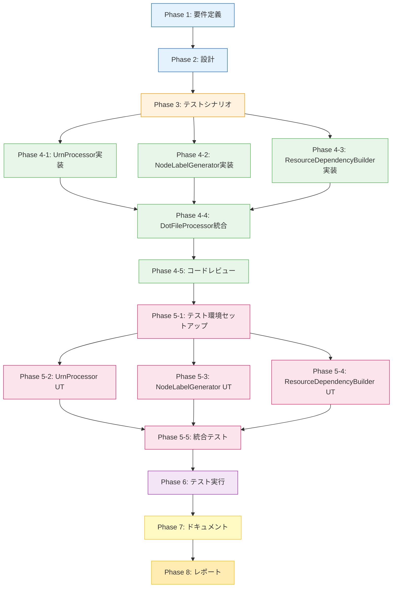

# プロジェクト計画書: Issue #448

## 基本情報

- **Issue番号**: #448
- **タイトル**: [Refactor] 複雑度の削減: dot_processor.py
- **作成日**: 2025-01-14
- **ステータス**: Planning Phase

---

## 1. Issue分析

### 複雑度判定: 中程度〜複雑

**判定根拠**:
- 単一ファイル（dot_processor.py）のリファクタリングだが、3つの新規クラスを抽出する構造的変更
- 現在のコードは617行、40以上のメソッドを持つ複雑なクラス構造
- 深いネスト構造（5レベル以上）の解消が必要
- 既存の公開APIを維持しつつ内部実装を大幅に変更する必要がある
- テストファイルが現在存在しないため、特性テストの作成から着手が必要

### 見積もり工数: 20〜28時間

**工数積算**:
- Phase 1: 要件定義 (2〜3h)
- Phase 2: 設計 (3〜4h)
- Phase 3: テストシナリオ (2〜3h)
- Phase 4: 実装 (6〜8h)
- Phase 5: テストコード実装 (4〜6h)
- Phase 6: テスト実行 (1〜2h)
- Phase 7: ドキュメント (1〜2h)
- Phase 8: レポート (1h)

**見積もり根拠**:
1. **テストファイル不在のリスク**: 現在、テストディレクトリが存在せず、特性テストの作成が必須（+3〜4h）
2. **クラス抽出の複雑性**: 3つの新規クラス（UrnProcessor、NodeLabelGenerator、ResourceDependencyBuilder）を抽出し、それぞれの責務を明確化（Phase 4で6〜8h）
3. **包括的なテスト作成**: 新規クラスごとのユニットテストと統合テストの作成（Phase 5で4〜6h）
4. **既存コードの深いネスト**: 5レベル以上のネストを早期リターンパターンで平坦化（Phase 4に含む）

### リスク評価: 中

**リスク要因**:
1. **テストカバレッジの欠如**: 既存テストがないため、リファクタリング前の振る舞いを保証する特性テストの作成が必須
2. **外部依存の不明確性**: `dot_processor.py`を利用している上位モジュールの影響範囲が不明
3. **URNパースロジックの複雑性**: 正規表現とURN形式の多様性により、エッジケースが多い可能性
4. **破壊的変更の潜在リスク**: 内部実装の大幅変更により、予期しない副作用が発生する可能性

**リスク軽減策**:
1. Phase 1で外部依存を徹底調査し、影響範囲を明確化
2. Phase 3で特性テストを優先的に作成し、リファクタリング前の振る舞いを固定
3. Phase 4で段階的リファクタリング（1クラスずつ抽出し、都度テスト実行）
4. Phase 6で統合テストと回帰テストを徹底実施

---

## 2. 実装戦略判断

### 実装戦略: **REFACTOR**

**判断根拠**:
- 新機能の追加ではなく、既存コードの構造改善が中心
- `DotFileProcessor`クラスの責務を分離し、複雑度を削減することが主目的
- 既存の公開APIは維持し、内部実装のみを変更
- Extract Classパターン、Guard Clauseパターンによるリファクタリング手法を適用
- 振る舞いは変えず、コードの保守性・可読性を向上させる

**リファクタリング対象**:
1. **URNパースロジックの分離** → `UrnProcessor`クラス
2. **ノードラベル生成の独立** → `NodeLabelGenerator`クラス
3. **依存関係処理の分離** → `ResourceDependencyBuilder`クラス
4. **制御フローの簡素化** → 早期リターンパターン適用

### テスト戦略: **UNIT_INTEGRATION**

**判断根拠**:
- **UNIT**: 新規抽出される各クラス（UrnProcessor、NodeLabelGenerator、ResourceDependencyBuilder）の単体テストが必須
  - 各クラスは独立した責務を持つため、ユニットテストで完全にカバー可能
  - URNパースロジック、ラベル生成ロジック、依存関係構築ロジックはそれぞれ独立してテスト可能
- **INTEGRATION**: リファクタリング後の`DotFileProcessor`クラスが新規クラスを統合して正しく動作するかを検証
  - 既存の公開API経由で、リファクタリング前後の振る舞い同一性を確認
  - 実際のPulumi DOTファイルを入力として、出力結果が一致することを確認

**BDD不採用の理由**:
- エンドユーザー向け機能ではなく、内部ライブラリのリファクタリング
- ユーザーストーリーよりも技術的な仕様が重視される
- ユニット + インテグレーションで十分なカバレッジが得られる

### テストコード戦略: **CREATE_TEST**

**判断根拠**:
- **現在テストファイルが存在しない**ため、新規作成が必須
- 以下のテストファイルを新規作成：
  1. `tests/unit/test_urn_processor.py` - UrnProcessorのユニットテスト
  2. `tests/unit/test_node_label_generator.py` - NodeLabelGeneratorのユニットテスト
  3. `tests/unit/test_resource_dependency_builder.py` - ResourceDependencyBuilderのユニットテスト
  4. `tests/integration/test_dot_processor.py` - DotFileProcessorの統合テスト
  5. `tests/fixtures/` - テストデータ（サンプルDOTファイル、URN等）

**EXTEND_TEST不採用の理由**:
- 既存テストファイルが存在しないため、拡張対象がない

**BOTH_TEST不採用の理由**:
- 新規作成のみで対応可能

---

## 3. 影響範囲分析

### 既存コードへの影響

#### 主要対象ファイル
1. **jenkins/jobs/pipeline/infrastructure/pulumi-stack-action/src/dot_processor.py** (617行)
   - `DotFileProcessor`クラスを3つの新規クラスに分離
   - 既存メソッドの内部実装を変更（公開APIは維持）

#### 新規作成ファイル
1. **jenkins/jobs/pipeline/infrastructure/pulumi-stack-action/src/urn_processor.py**
   - 責務: URN/URIのパース、正規化、コンポーネント抽出
   - 移行元: `DotFileProcessor.parse_urn()`, `_parse_provider_type()`

2. **jenkins/jobs/pipeline/infrastructure/pulumi-stack-action/src/node_label_generator.py**
   - 責務: リソースタイプに応じたラベル生成ロジック
   - 移行元: `DotFileProcessor.create_readable_label()`, `_format_resource_type()`

3. **jenkins/jobs/pipeline/infrastructure/pulumi-stack-action/src/resource_dependency_builder.py**
   - 責務: 依存関係グラフの構築と検証
   - 移行元: `DotFileProcessor._process_graph_line()`, `_process_node_definition()`, `_process_edge_definition()`

#### 間接的に影響を受けるファイル
以下のファイルで`dot_processor.py`をインポートしている可能性があるため、Phase 1で調査が必要：
- `graph_processor.py` (174行) - グラフ処理の上位モジュール
- `main.py` (31行) - エントリーポイント
- `report_generator.py` (150行) - レポート生成

**調査方法**: Phase 1で`from dot_processor import`または`import dot_processor`を検索

### 依存関係の変更

#### 新規依存の追加
- **なし**（既存の標準ライブラリのみ使用: `re`, `typing`）

#### 既存依存の変更
- **dot_processor.py内部の依存関係**:
  - `DotFileProcessor` → `UrnProcessor`, `NodeLabelGenerator`, `ResourceDependencyBuilder`への依存を追加
  - 依存性注入パターンを採用し、疎結合を維持

#### パッケージ構造の変更
```
jenkins/jobs/pipeline/infrastructure/pulumi-stack-action/src/
├── dot_processor.py (既存: リファクタリング対象)
├── urn_processor.py (新規: URN処理を分離)
├── node_label_generator.py (新規: ラベル生成を分離)
├── resource_dependency_builder.py (新規: 依存関係処理を分離)
├── graph_processor.py (既存: 影響確認が必要)
├── main.py (既存: 影響確認が必要)
└── ...

jenkins/jobs/pipeline/infrastructure/pulumi-stack-action/tests/ (新規作成)
├── unit/
│   ├── test_urn_processor.py
│   ├── test_node_label_generator.py
│   └── test_resource_dependency_builder.py
├── integration/
│   └── test_dot_processor.py
├── fixtures/
│   ├── sample_urns.json
│   └── sample_dot_files/
└── conftest.py (pytest設定)
```

### マイグレーション要否

#### データベーススキーマ変更
- **不要**: このモジュールはデータベースを使用しない

#### 設定ファイル変更
- **不要**: 設定ファイルの変更は不要
- ただし、`config.py`（30行）が存在するため、Phase 1で影響確認が必要

#### 環境変数の変更
- **不要**: 環境変数の追加・変更は不要

#### デプロイメント手順の変更
- **不要**: リファクタリングのため、デプロイ手順は変更なし
- Jenkinsfileに変更があれば、Phase 1で確認が必要

---

## 4. タスク分割

### Phase 1: 要件定義 (見積もり: 2〜3h)

- [x] Task 1-1: 外部依存の調査 (1〜1.5h)
  - `graph_processor.py`, `main.py`, `report_generator.py`での`dot_processor.py`の使用箇所を特定
  - インポート文とメソッド呼び出しをリストアップ
  - 公開API（変更してはいけないインターフェース）を明確化
  - Jenkinsfileでの使用状況を確認

- [x] Task 1-2: 現状のコード複雑度の定量的測定 (0.5〜1h)
  - Cyclomatic Complexity（循環的複雑度）の測定
  - ネストレベルの詳細確認（5レベル以上の箇所をすべて特定）
  - メソッド数と平均行数の計算
  - 測定結果を`requirements.md`に記録

- [x] Task 1-3: リファクタリング要件の詳細化 (0.5〜1h)
  - 各新規クラス（UrnProcessor、NodeLabelGenerator、ResourceDependencyBuilder）の責務を明確に定義
  - クラス間のインターフェース設計（メソッドシグネチャ、戻り値、例外処理）
  - Extract Classパターンの適用方針を文書化
  - Guard Clauseパターンの適用対象メソッドをリストアップ

### Phase 2: 設計 (見積もり: 3〜4h)

- [ ] Task 2-1: UrnProcessorクラスの設計 (1〜1.5h)
  - クラス責務の明確化（URN/URIのパース、正規化、コンポーネント抽出）
  - 公開メソッドのシグネチャ設計
    - `parse_urn(urn: str) -> Dict[str, str]`
    - `_parse_provider_type(provider_type: str) -> Dict[str, str]`
  - 例外処理設計（不正なURN形式の扱い）
  - データ構造設計（戻り値のDict型の詳細仕様）

- [ ] Task 2-2: NodeLabelGeneratorクラスの設計 (1〜1.5h)
  - クラス責務の明確化（リソースタイプに応じたラベル生成）
  - 公開メソッドのシグネチャ設計
    - `create_readable_label(urn_info: Dict[str, str]) -> str`
    - `_format_resource_type(resource_type: str) -> str`
  - エスケープ処理の仕様（DOT形式への対応）
  - ラベル長の制限ロジック

- [ ] Task 2-3: ResourceDependencyBuilderクラスの設計 (1〜1.5h)
  - クラス責務の明確化（依存関係グラフの構築と検証）
  - 公開メソッドのシグネチャ設計
    - `build_dependency_graph(resources: List[Dict]) -> List[str]`
  - ノードIDマッピングの管理方法
  - エッジ属性の処理ロジック

- [ ] Task 2-4: DotFileProcessorの統合設計 (0.5〜1h)
  - 新規クラスとの依存関係設計（依存性注入パターン）
  - 既存メソッドの委譲パターン設計
  - 公開APIの互換性確認
  - クラス図とシーケンス図の作成

### Phase 3: テストシナリオ (見積もり: 2〜3h)

- [x] Task 3-1: UrnProcessorのテストシナリオ作成 (0.5〜1h)
  - 正常系: 標準的なURN形式のパース
  - 準正常系: プロバイダー情報がないURN、短いURN
  - 異常系: 不正なURN形式、空文字列、None
  - エッジケース: 特殊文字を含むURN、非常に長いURN

- [x] Task 3-2: NodeLabelGeneratorのテストシナリオ作成 (0.5〜1h)
  - 正常系: 標準的なラベル生成、モジュール名付きラベル
  - 準正常系: 長いリソースタイプ名の省略、空のモジュール名
  - 異常系: 空のurn_info、不完全なurn_info
  - エッジケース: 特殊文字を含む名前、改行を含む名前

- [x] Task 3-3: ResourceDependencyBuilderのテストシナリオ作成 (0.5〜1h)
  - 正常系: 単純な依存関係グラフ、複雑な依存関係グラフ
  - 準正常系: 循環依存、依存先が存在しない
  - 異常系: 空のリソースリスト、不正なリソース形式
  - エッジケース: 大量のリソース（100+）、親子関係とプロパティ依存の混在

- [x] Task 3-4: 統合テストシナリオ作成 (0.5〜1h)
  - リファクタリング前後の振る舞い同一性テスト（特性テスト）
  - 実際のPulumi DOTファイルを使用したE2Eテスト
  - パフォーマンステスト（リファクタリング前後での処理時間比較）

### Phase 4: 実装 (見積もり: 6〜8h)

- [x] Task 4-1: UrnProcessorクラスの実装 (1.5〜2h)
  - `parse_urn()`メソッドの実装
  - `_parse_provider_type()`メソッドの実装
  - エラーハンドリングの実装
  - docstringとコメントの追加

- [x] Task 4-2: NodeLabelGeneratorクラスの実装 (1.5〜2h)
  - `create_readable_label()`メソッドの実装
  - `_format_resource_type()`メソッドの実装
  - エスケープ処理の実装
  - docstringとコメントの追加

- [x] Task 4-3: ResourceDependencyBuilderクラスの実装 (2〜2.5h)
  - `build_dependency_graph()`メソッドの実装
  - ノードIDマッピングの管理ロジック実装
  - エッジ属性処理の実装
  - docstringとコメントの追加

- [x] Task 4-4: DotFileProcessorのリファクタリング (1.5〜2h)
  - 新規クラスのインポート追加
  - 既存メソッドを新規クラスへ委譲するように変更
  - Guard Clauseパターンでネストを解消
  - 不要になったメソッドの削除
  - docstringの更新

- [x] Task 4-5: コードレビューと修正 (0.5〜1h)
  - PEP 8準拠の確認
  - 型ヒントの追加漏れチェック
  - docstringの完全性確認

### Phase 5: テストコード実装 (見積もり: 4〜6h)

- [ ] Task 5-1: テスト環境のセットアップ (0.5〜1h)
  - `tests/`ディレクトリ構造の作成
  - `conftest.py`の作成（pytest設定）
  - フィクスチャファイルの準備（sample_urns.json、sample_dot_files/）

- [ ] Task 5-2: UrnProcessorのユニットテスト実装 (1〜1.5h)
  - `test_urn_processor.py`の作成
  - 正常系テストケースの実装
  - 異常系・エッジケースのテストケース実装
  - パラメタライズドテストの活用

- [ ] Task 5-3: NodeLabelGeneratorのユニットテスト実装 (1〜1.5h)
  - `test_node_label_generator.py`の作成
  - 正常系テストケースの実装
  - 異常系・エッジケースのテストケース実装

- [ ] Task 5-4: ResourceDependencyBuilderのユニットテスト実装 (1〜1.5h)
  - `test_resource_dependency_builder.py`の作成
  - 正常系テストケースの実装
  - 異常系・エッジケースのテストケース実装

- [ ] Task 5-5: 統合テストの実装 (1〜1.5h)
  - `test_dot_processor.py`の作成
  - リファクタリング前後の振る舞い同一性テスト
  - 実際のPulumi DOTファイルを使用したE2Eテスト

### Phase 6: テスト実行 (見積もり: 1〜2h)

- [ ] Task 6-1: ユニットテストの実行 (0.5〜1h)
  - pytestの実行（全ユニットテスト）
  - カバレッジレポートの生成（目標: 90%以上）
  - 失敗したテストの修正

- [ ] Task 6-2: 統合テストの実行 (0.5〜1h)
  - 統合テストの実行
  - リファクタリング前後の比較検証
  - パフォーマンステストの実行と結果記録

### Phase 7: ドキュメント (見積もり: 1〜2h)

- [ ] Task 7-1: コードドキュメントの更新 (0.5〜1h)
  - 各新規クラスのREADME作成（使用方法、サンプルコード）
  - `dot_processor.py`のdocstring更新
  - アーキテクチャ図の更新（クラス図、シーケンス図）

- [ ] Task 7-2: プロジェクトドキュメントの更新 (0.5〜1h)
  - CONTRIBUTION.mdへのリファクタリング内容の記載
  - README.mdの更新（必要に応じて）
  - 変更履歴（CHANGELOG）の記載

### Phase 8: レポート (見積もり: 1h)

- [ ] Task 8-1: リファクタリングレポートの作成 (1h)
  - リファクタリング前後の複雑度比較（Cyclomatic Complexity、ネストレベル）
  - テストカバレッジの報告
  - パフォーマンステストの結果
  - 残存課題と今後の改善提案
  - レポートを`.ai-workflow/issue-448/08_report/output/report.md`に保存

---

## 5. 依存関係



### クリティカルパス

1. Phase 1 → Phase 2 → Phase 3: 要件定義と設計の完了が必須
2. Phase 4-1, 4-2, 4-3は並行実行可能だが、Phase 4-4（統合）は全て完了後
3. Phase 5-1（テスト環境）完了後、Phase 5-2, 5-3, 5-4は並行実行可能
4. Phase 6（テスト実行）→ Phase 7（ドキュメント）→ Phase 8（レポート）は順次実行

### 並列実行可能なタスク

- Phase 4-1, 4-2, 4-3（各クラスの実装）
- Phase 5-2, 5-3, 5-4（各ユニットテストの実装）

---

## 6. リスクと軽減策

### リスク1: テストカバレッジの欠如によるリグレッション

- **影響度**: 高
- **確率**: 中
- **軽減策**:
  1. Phase 3で特性テスト（リファクタリング前の振る舞いを固定）を優先的に作成
  2. Phase 4で段階的リファクタリング（1クラスずつ抽出し、都度テスト実行）
  3. Phase 6で統合テストと回帰テストを徹底実施
  4. カバレッジ目標を90%以上に設定し、未カバー箇所を最小化

### リスク2: 外部依存による予期しない破壊的変更

- **影響度**: 中
- **確率**: 中
- **軽減策**:
  1. Phase 1で`graph_processor.py`, `main.py`, `report_generator.py`の依存関係を徹底調査
  2. 公開API（外部から呼び出されているメソッド）を明確化し、変更禁止リストを作成
  3. Phase 4で既存の公開APIは変更せず、内部実装のみをリファクタリング
  4. Phase 6で統合テストにより外部モジュールとの連携を確認

### リスク3: URNパースロジックのエッジケース対応漏れ

- **影響度**: 中
- **確率**: 高
- **軽減策**:
  1. Phase 1で既存コードから実際のURN形式のサンプルを収集
  2. Phase 3でエッジケース（特殊文字、長いURN、不正形式）のテストシナリオを網羅的に作成
  3. Phase 5でパラメタライズドテストを活用し、多様なURN形式をテスト
  4. Phase 6でPulumi実環境から取得したDOTファイルでE2Eテストを実施

### リスク4: リファクタリング工数の見積もり超過

- **影響度**: 低
- **確率**: 中
- **軽減策**:
  1. Phase 4を4つのサブタスクに分割し、各タスクの進捗を細かく管理
  2. Phase 5のテスト実装を優先度付け（クリティカルなテストから実装）
  3. Phase 4-1完了後、すぐにPhase 5-2（UrnProcessorのテスト）を実装し、早期にフィードバックを得る
  4. 工数超過の兆候があれば、Phase 7のドキュメント作成をスコープ縮小

### リスク5: ネスト解消による可読性の低下

- **影響度**: 低
- **確率**: 低
- **軽減策**:
  1. Phase 2で早期リターンパターンの適用方針を明確化（docstringで意図を記載）
  2. Phase 4-5のコードレビューで可読性を重点的にチェック
  3. Phase 7でアーキテクチャ図とシーケンス図を作成し、全体像を可視化

---

## 7. 品質ゲート

### Phase 1: 要件定義

- [ ] 外部依存（`graph_processor.py`, `main.py`, `report_generator.py`）の調査が完了している
- [ ] 公開API（変更してはいけないインターフェース）が明確化されている
- [ ] 現状のコード複雑度が定量的に測定されている（Cyclomatic Complexity、ネストレベル）
- [ ] 各新規クラスの責務が明確に定義されている
- [ ] リファクタリング要件が文書化されている（`requirements.md`）

### Phase 2: 設計

- [ ] 実装戦略（REFACTOR）の判断根拠が明記されている
- [ ] テスト戦略（UNIT_INTEGRATION）の判断根拠が明記されている
- [ ] テストコード戦略（CREATE_TEST）の判断根拠が明記されている
- [ ] 各新規クラスの公開メソッドシグネチャが設計されている
- [ ] クラス図とシーケンス図が作成されている
- [ ] 依存性注入パターンの適用方針が明確化されている

### Phase 3: テストシナリオ

- [x] UrnProcessorのテストシナリオ（正常系、異常系、エッジケース）が作成されている
- [x] NodeLabelGeneratorのテストシナリオが作成されている
- [x] ResourceDependencyBuilderのテストシナリオが作成されている
- [x] 統合テストシナリオ（特性テスト、E2Eテスト）が作成されている
- [x] テストデータ（フィクスチャ）の準備計画が明確化されている

### Phase 4: 実装

- [ ] UrnProcessorクラスが実装され、PEP 8に準拠している
- [ ] NodeLabelGeneratorクラスが実装され、PEP 8に準拠している
- [ ] ResourceDependencyBuilderクラスが実装され、PEP 8に準拠している
- [ ] DotFileProcessorのリファクタリングが完了し、公開APIが維持されている
- [ ] 深いネスト構造（5レベル以上）が解消されている
- [ ] 全クラスにdocstringと型ヒントが追加されている

### Phase 5: テストコード実装

- [ ] テスト環境（`tests/`ディレクトリ、`conftest.py`）がセットアップされている
- [ ] 各新規クラスのユニットテストが実装されている
- [ ] 統合テスト（特性テスト、E2Eテスト）が実装されている
- [ ] テストカバレッジが測定可能な状態になっている

### Phase 6: テスト実行

- [ ] 全ユニットテストが成功している（失敗ケース0件）
- [ ] テストカバレッジが90%以上である
- [ ] 統合テストが成功している
- [ ] リファクタリング前後の振る舞い同一性が確認されている
- [ ] パフォーマンステストで性能劣化がないことが確認されている

### Phase 7: ドキュメント

- [ ] 各新規クラスのREADME（使用方法、サンプルコード）が作成されている
- [ ] アーキテクチャ図（クラス図、シーケンス図）が更新されている
- [ ] CONTRIBUTION.mdにリファクタリング内容が記載されている
- [ ] 変更履歴（CHANGELOG）が記載されている

### Phase 8: レポート

- [ ] リファクタリング前後の複雑度比較が記載されている
- [ ] テストカバレッジの報告が記載されている
- [ ] パフォーマンステストの結果が記載されている
- [ ] 残存課題と今後の改善提案が記載されている
- [ ] レポートが`.ai-workflow/issue-448/08_report/output/report.md`に保存されている

---

## 8. 成功基準

### 定量的指標

1. **Cyclomatic Complexity（循環的複雑度）の削減**
   - リファクタリング前: 推定15〜25（複雑なメソッド）
   - リファクタリング後: 各メソッドで10未満（目標）

2. **ネストレベルの削減**
   - リファクタリング前: 5レベル以上のネストが複数存在
   - リファクタリング後: 最大3レベル以下（目標）

3. **テストカバレッジ**
   - 目標: 90%以上（Statement Coverage）
   - 新規クラスは100%を目指す

4. **パフォーマンス**
   - リファクタリング後の処理時間が、リファクタリング前の±10%以内

### 定性的指標

1. **コードの可読性**
   - コードレビューで「理解しやすい」と評価される
   - 新規開発者がコードを理解するまでの時間が短縮される

2. **保守性**
   - 新機能追加時の変更箇所が明確（単一責任の原則）
   - クラスごとの独立性が高く、影響範囲が限定的

3. **テスタビリティ**
   - 各クラスのユニットテストが容易に作成できる
   - モック・スタブを使用したテストが不要（依存性が低い）

---

## 9. 次のステップ

1. **Phase 1の開始**: 外部依存の調査（Task 1-1）から着手
2. **プロジェクト計画書のレビュー**: クリティカルシンキングレビューで品質ゲートを確認
3. **ブロッカーの解消**: レビューで指摘されたブロッカーを修正
4. **Phase 2への移行**: Phase 1の品質ゲートを満たした後、設計フェーズへ移行

---

## 付録

### A. 参考ドキュメント

- **プロジェクト全体方針**: [CLAUDE.md](../../CLAUDE.md)
- **アーキテクチャ設計**: [ARCHITECTURE.md](../../ARCHITECTURE.md)
- **開発ガイドライン**: [CONTRIBUTION.md](../../CONTRIBUTION.md)
- **プロジェクト概要**: [README.md](../../README.md)

### B. リファクタリングパターン

#### Extract Class パターン
```python
# Before
class DotFileProcessor:
    def parse_urn(self, urn: str) -> Dict[str, str]:
        # URN解析ロジック
        pass

    def create_readable_label(self, urn_info: Dict) -> str:
        # ラベル生成ロジック
        pass

# After
class UrnProcessor:
    def parse_urn(self, urn: str) -> Dict[str, str]:
        # URN解析ロジック
        pass

class NodeLabelGenerator:
    def create_readable_label(self, urn_info: Dict) -> str:
        # ラベル生成ロジック
        pass

class DotFileProcessor:
    def __init__(self):
        self.urn_processor = UrnProcessor()
        self.label_generator = NodeLabelGenerator()

    def parse_urn(self, urn: str) -> Dict[str, str]:
        return self.urn_processor.parse_urn(urn)

    def create_readable_label(self, urn_info: Dict) -> str:
        return self.label_generator.create_readable_label(urn_info)
```

#### Guard Clause パターン
```python
# Before: 深いネスト
def process(data):
    if data is not None:
        if len(data) > 0:
            if data['type'] == 'valid':
                if data['status'] == 'active':
                    # 実際の処理
                    return process_data(data)
    return None

# After: 早期リターン
def process(data):
    if data is None:
        return None
    if len(data) == 0:
        return None
    if data['type'] != 'valid':
        return None
    if data['status'] != 'active':
        return None

    # 実際の処理（ネストなし）
    return process_data(data)
```

### C. 用語集

- **Cyclomatic Complexity（循環的複雑度）**: プログラムの制御フローの複雑さを表す指標。値が大きいほど複雑。
- **Extract Class パターン**: 責務の多いクラスから、特定の責務を持つ新しいクラスを抽出するリファクタリング手法。
- **Guard Clause パターン**: メソッドの先頭で事前条件をチェックし、不正な場合は早期リターンすることで、ネストを削減する手法。
- **URN（Uniform Resource Name）**: Pulumiがリソースを識別するために使用する一意の識別子。
- **特性テスト（Characterization Test）**: 既存コードの振る舞いを固定するために作成するテスト。リファクタリング時に有用。

---

## 変更履歴

| 日付 | バージョン | 変更内容 | 担当者 |
|------|-----------|---------|--------|
| 2025-01-14 | v1.0 | 初版作成 | AI Workflow System |

---

**プロジェクト計画書の作成完了**

この計画書は、Issue #448のリファクタリング作業を体系的に進めるための詳細なロードマップです。各フェーズの品質ゲートを満たすことで、高品質なリファクタリングを実現します。
