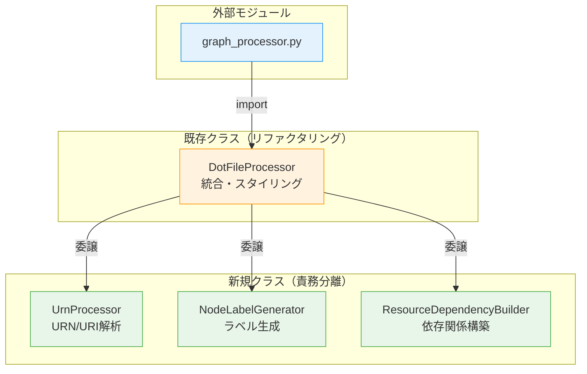
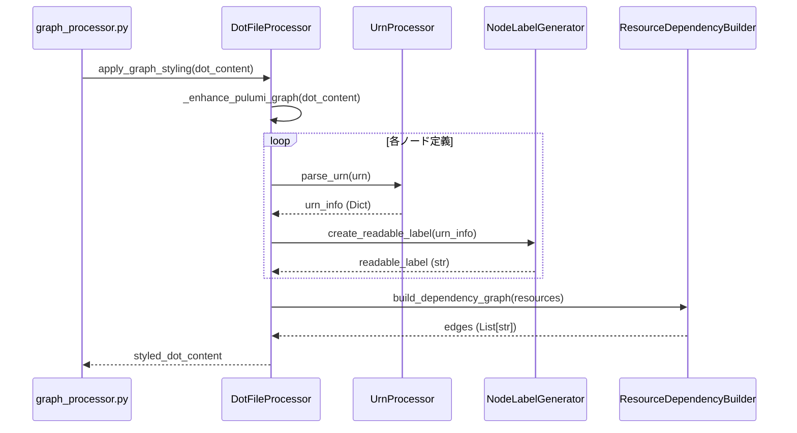
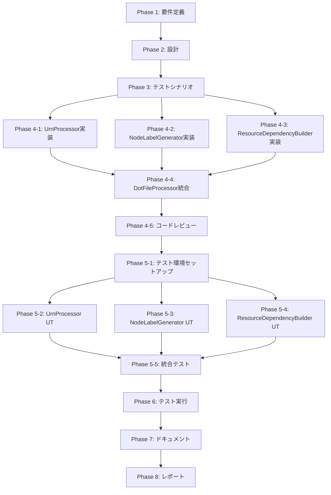

# 詳細設計書: Issue #448

## 基本情報

- **Issue番号**: #448
- **タイトル**: [Refactor] 複雑度の削減: dot_processor.py
- **作成日**: 2025-01-14
- **ステータス**: Design Phase
- **実装戦略**: REFACTOR（リファクタリング）
- **テスト戦略**: UNIT_INTEGRATION（ユニット＋統合テスト）
- **テストコード戦略**: CREATE_TEST（新規テスト作成）

---

## 0. Planning Documentの確認

### 開発計画の全体像

**Planning Phase成果物**: [planning.md](../../00_planning/output/planning.md)

#### スコープと実装戦略
- **実装戦略**: REFACTOR
  - 既存の公開APIは維持し、内部実装のみをリファクタリング
  - Extract Classパターン、Guard Clauseパターンを適用
  - 振る舞いは変えず、コードの保守性・可読性を向上

#### テスト戦略
- **UNIT_INTEGRATION**: 新規クラスのユニットテストと、統合後の動作確認テスト
- **CREATE_TEST**: 現在テストファイルが存在しないため、新規作成が必須

#### 主要なリスク
1. **テストカバレッジの欠如によるリグレッション**（影響度: 高、確率: 中）
   - 軽減策: Phase 3で特性テストを優先的に作成
2. **外部依存による予期しない破壊的変更**（影響度: 中、確率: 中）
   - 軽減策: Phase 1で`graph_processor.py`等の依存関係を徹底調査
3. **URNパースロジックのエッジケース対応漏れ**（影響度: 中、確率: 高）
   - 軽減策: Phase 3でエッジケースのテストシナリオを網羅的に作成

#### スケジュール
- **見積もり工数**: 20〜28時間
  - Phase 1: 要件定義（2〜3h）
  - Phase 2: 設計（3〜4h）
  - Phase 3: テストシナリオ（2〜3h）
  - Phase 4: 実装（6〜8h）
  - Phase 5: テストコード実装（4〜6h）
  - Phase 6: テスト実行（1〜2h）
  - Phase 7: ドキュメント（1〜2h）
  - Phase 8: レポート（1h）

---

## 1. アーキテクチャ設計

### 1.1 現状のアーキテクチャ

現在の`DotFileProcessor`クラスは以下の複数の責務を単一クラスに混在させています：

```
DotFileProcessor (618行、40以上のメソッド)
│
├── URNパース処理
│   ├── parse_urn()
│   └── _parse_provider_type()
│
├── ノードラベル生成
│   ├── create_readable_label()
│   └── _format_resource_type()
│
├── 依存関係グラフ処理
│   ├── _process_graph_line()
│   ├── _process_node_definition()
│   └── _process_edge_definition()
│
└── グラフスタイリング
    ├── apply_graph_styling()
    ├── _enhance_pulumi_graph()
    └── _process_node_labels()
```

**問題点**:
- 深いネスト構造（5レベル以上）
- 責務の混在による高い認知的複雑度
- テストが困難（単一クラスで40以上のメソッド）
- 機能追加や修正時のリグレッションリスクが高い

### 1.2 リファクタリング後のアーキテクチャ

Extract Classパターンを適用し、責務を3つの新規クラスに分離します：



### 1.3 クラス責務分担

| クラス | 責務 | 主要メソッド | 備考 |
|--------|------|--------------|------|
| **UrnProcessor** | URN/URIのパース、正規化、コンポーネント抽出 | `parse_urn()`, `_parse_provider_type()` | 標準ライブラリ`re`のみ使用 |
| **NodeLabelGenerator** | リソースタイプに応じたラベル生成 | `create_readable_label()`, `_format_resource_type()` | DOT形式へのエスケープを含む |
| **ResourceDependencyBuilder** | 依存関係グラフの構築と検証 | `build_dependency_graph()`, `_create_urn_to_node_mapping()` | ノードIDマッピング管理 |
| **DotFileProcessor** | 新規クラスの統合、グラフスタイリング | `apply_graph_styling()`, `_enhance_pulumi_graph()` | 既存の公開APIを維持 |

### 1.4 データフロー



---

## 2. 実装戦略判断

### 実装戦略: REFACTOR

**判断根拠**:

1. **既存機能の振る舞いは変更しない**
   - 既存の公開API（`parse_urn()`, `create_readable_label()`, `apply_graph_styling()`等）のシグネチャは一切変更しない
   - 外部モジュール（`graph_processor.py`）からの利用に影響を与えない
   - 内部実装のみをリファクタリングし、出力結果は完全に一致

2. **Extract Classパターンによる責務分離**
   - 単一クラスに混在している複数の責務を、独立したクラスに抽出
   - 各クラスは単一責任の原則（SRP）に準拠
   - 既存メソッドの処理ロジックは新規クラスに移行し、`DotFileProcessor`から委譲

3. **Guard Clauseパターンによる制御フロー簡素化**
   - 深いネスト構造（5レベル以上）を早期リターンパターンで平坦化
   - 認知的複雑度の削減により、コードの理解が容易に

4. **コードの保守性・可読性の向上が主目的**
   - 新機能の追加ではなく、既存コードの構造改善
   - Cyclomatic Complexity（循環的複雑度）の削減
   - テスタビリティの向上（ユニットテストが容易になる）

**リファクタリング対象箇所**:
- `jenkins/jobs/pipeline/infrastructure/pulumi-stack-action/src/dot_processor.py`の`DotFileProcessor`クラス
- 深いネスト構造: 397〜473行目（`_enhance_pulumi_graph`, `_process_node_definition`）
- URNパース: 273〜333行目（`parse_urn`, `_parse_provider_type`）
- ラベル生成: 336〜375行目（`create_readable_label`, `_format_resource_type`）

---

## 3. テスト戦略判断

### テスト戦略: UNIT_INTEGRATION

**判断根拠**:

1. **UNIT（ユニットテスト）が必須な理由**
   - **新規クラスの独立性**: 抽出される各クラス（`UrnProcessor`, `NodeLabelGenerator`, `ResourceDependencyBuilder`）は独立した責務を持つ
   - **テストの容易性**: 各クラスは外部依存がなく（標準ライブラリのみ使用）、モック・スタブが不要
   - **エッジケースの網羅**: URNパースロジックは多様な形式に対応する必要があり、ユニットテストで細かくカバー
   - **高いカバレッジ目標**: 新規クラスは100%カバレッジを目指す

2. **INTEGRATION（統合テスト）が必須な理由**
   - **リファクタリング前後の振る舞い同一性確認**: 既存の公開API経由で、入出力が完全に一致することを検証
   - **クラス間の連携確認**: `DotFileProcessor`が新規クラスを正しく統合して動作するかを確認
   - **実データでの動作確認**: 実際のPulumi DOTファイルを入力として、出力結果が一致することを確認
   - **回帰テストの実施**: リファクタリングによる予期しない副作用を検出

3. **BDD不採用の理由**
   - **エンドユーザー向け機能ではない**: 内部ライブラリのリファクタリングであり、ユーザーストーリーが存在しない
   - **技術的仕様が重視される**: ビジネス要件よりも、技術的な仕様（URN形式、DOT形式等）が重要
   - **UNIT + INTEGRATIONで十分**: ユニットテストと統合テストで、必要なカバレッジと品質を確保可能

**テストの優先順位**:
1. **特性テスト（Characterization Test）**: リファクタリング前の振る舞いを固定（最優先）
2. **ユニットテスト**: 新規クラスごとに作成（Phase 5）
3. **統合テスト**: リファクタリング後の`DotFileProcessor`全体の動作確認（Phase 5）
4. **回帰テスト**: 既存の統合テストを全件実行（Phase 6）

---

## 4. テストコード戦略判断

### テストコード戦略: CREATE_TEST

**判断根拠**:

1. **既存テストファイルが存在しない**
   - `jenkins/jobs/pipeline/infrastructure/pulumi-stack-action/tests/`ディレクトリが存在しない
   - 現在、テストカバレッジが0%の状態
   - 新規にテストディレクトリとテストファイルを作成する必要がある

2. **新規テストファイルの作成が必須**
   - **ユニットテスト**: 各新規クラス用のテストファイルを作成
     - `tests/unit/test_urn_processor.py`
     - `tests/unit/test_node_label_generator.py`
     - `tests/unit/test_resource_dependency_builder.py`
   - **統合テスト**: `DotFileProcessor`の統合テストを作成
     - `tests/integration/test_dot_processor.py`
   - **フィクスチャ**: テストデータを準備
     - `tests/fixtures/sample_urns.json`
     - `tests/fixtures/sample_dot_files/`

3. **pytest環境のセットアップ**
   - `tests/conftest.py`: pytest設定とフィクスチャ定義
   - `pytest.ini`: pytestの実行設定
   - `requirements-test.txt`: テスト用依存パッケージ（pytest, pytest-cov等）

4. **EXTEND_TEST不採用の理由**
   - 既存テストファイルが存在しないため、拡張対象がない

5. **BOTH_TEST不採用の理由**
   - 既存テストの拡張は不要（存在しないため）
   - 新規作成のみで対応可能

**テストディレクトリ構造**:
```
jenkins/jobs/pipeline/infrastructure/pulumi-stack-action/tests/
├── unit/
│   ├── __init__.py
│   ├── test_urn_processor.py
│   ├── test_node_label_generator.py
│   └── test_resource_dependency_builder.py
├── integration/
│   ├── __init__.py
│   └── test_dot_processor.py
├── fixtures/
│   ├── sample_urns.json
│   └── sample_dot_files/
│       ├── simple_graph.dot
│       └── complex_graph.dot
├── conftest.py
└── pytest.ini
```

---

## 5. 影響範囲分析

### 5.1 既存コードへの影響

#### 主要対象ファイル

1. **jenkins/jobs/pipeline/infrastructure/pulumi-stack-action/src/dot_processor.py** (618行)
   - **変更内容**: `DotFileProcessor`クラスのリファクタリング
   - **影響度**: 高（内部実装の大幅な変更）
   - **破壊的変更**: なし（公開APIは維持）
   - **具体的な変更**:
     - `parse_urn()`, `create_readable_label()`メソッドを新規クラスへ委譲
     - `_enhance_pulumi_graph()`メソッドの制御フロー簡素化（Guard Clause適用）
     - `_process_node_definition()`メソッドのネスト削減

#### 間接的に影響を受けるファイル

1. **jenkins/jobs/pipeline/infrastructure/pulumi-stack-action/src/graph_processor.py** (175行)
   - **インポート文**: `from dot_processor import DotFileGenerator, DotFileProcessor`
   - **影響**: なし（公開APIは変更されないため）
   - **調査事項**: Phase 1で詳細な使用箇所を確認
   - **使用箇所**:
     - 38行目: `DotFileProcessor.is_empty_graph(dot_content)`
     - 45行目: `DotFileProcessor.apply_graph_styling(dot_content)`
     - 163行目: `DotFileGenerator.create_dot_file(...)`

2. **jenkins/jobs/pipeline/infrastructure/pulumi-stack-action/src/main.py** (31行)
   - **インポート文**: `from report_generator import PulumiReportGenerator`
   - **影響**: なし（`dot_processor.py`を直接インポートしていない）
   - **調査事項**: Phase 1で間接的な依存関係を確認

3. **jenkins/jobs/pipeline/infrastructure/pulumi-stack-action/src/report_generator.py** (150行)
   - **調査事項**: Phase 1で`dot_processor`モジュールの使用を確認
   - **影響**: 不明（Phase 1で調査が必要）

### 5.2 依存関係の変更

#### 新規依存の追加
- **なし**（既存の標準ライブラリのみ使用: `re`, `typing`）

#### 既存依存の変更
- **dot_processor.py内部の依存関係**:
  - `DotFileProcessor` → `UrnProcessor`, `NodeLabelGenerator`, `ResourceDependencyBuilder`への依存を追加
  - 依存性注入パターンを採用し、疎結合を維持

#### パッケージ構造の変更

**リファクタリング前**:
```
jenkins/jobs/pipeline/infrastructure/pulumi-stack-action/src/
├── dot_processor.py (618行、2クラス)
│   ├── DotFileGenerator
│   └── DotFileProcessor (40以上のメソッド)
├── graph_processor.py
├── main.py
└── ...
```

**リファクタリング後**:
```
jenkins/jobs/pipeline/infrastructure/pulumi-stack-action/src/
├── dot_processor.py (リファクタリング後、約300行)
│   ├── DotFileGenerator (変更なし)
│   └── DotFileProcessor (委譲により簡素化)
├── urn_processor.py (新規、約80行)
│   └── UrnProcessor
├── node_label_generator.py (新規、約60行)
│   └── NodeLabelGenerator
├── resource_dependency_builder.py (新規、約120行)
│   └── ResourceDependencyBuilder
├── graph_processor.py (変更なし)
├── main.py (変更なし)
└── ...
```

### 5.3 マイグレーション要否

#### データベーススキーマ変更
- **不要**: このモジュールはデータベースを使用しない

#### 設定ファイル変更
- **不要**: 設定ファイルの変更は不要
- **確認事項**: `config.py`（30行）が存在するため、Phase 1で影響確認が必要

#### 環境変数の変更
- **不要**: 環境変数の追加・変更は不要

#### デプロイメント手順の変更
- **不要**: リファクタリングのため、デプロイ手順は変更なし
- **確認事項**: Jenkinsfileに変更があれば、Phase 1で確認が必要

---

## 6. 変更・追加ファイルリスト

### 6.1 新規作成ファイル

#### ソースコード（3ファイル）

1. **jenkins/jobs/pipeline/infrastructure/pulumi-stack-action/src/urn_processor.py**
   - 責務: URN/URIのパース、正規化、コンポーネント抽出
   - クラス: `UrnProcessor`
   - 移行元: `DotFileProcessor.parse_urn()`, `_parse_provider_type()`
   - 推定行数: 約80行

2. **jenkins/jobs/pipeline/infrastructure/pulumi-stack-action/src/node_label_generator.py**
   - 責務: リソースタイプに応じたラベル生成ロジック
   - クラス: `NodeLabelGenerator`
   - 移行元: `DotFileProcessor.create_readable_label()`, `_format_resource_type()`
   - 推定行数: 約60行

3. **jenkins/jobs/pipeline/infrastructure/pulumi-stack-action/src/resource_dependency_builder.py**
   - 責務: 依存関係グラフの構築と検証
   - クラス: `ResourceDependencyBuilder`
   - 移行元: `DotFileGenerator._create_urn_to_node_mapping()`, `_add_dependencies_for_resource()`等の一部
   - 推定行数: 約120行

#### テストコード（8ファイル）

4. **jenkins/jobs/pipeline/infrastructure/pulumi-stack-action/tests/unit/test_urn_processor.py**
   - `UrnProcessor`のユニットテスト
   - 推定行数: 約200行

5. **jenkins/jobs/pipeline/infrastructure/pulumi-stack-action/tests/unit/test_node_label_generator.py**
   - `NodeLabelGenerator`のユニットテスト
   - 推定行数: 約150行

6. **jenkins/jobs/pipeline/infrastructure/pulumi-stack-action/tests/unit/test_resource_dependency_builder.py**
   - `ResourceDependencyBuilder`のユニットテスト
   - 推定行数: 約180行

7. **jenkins/jobs/pipeline/infrastructure/pulumi-stack-action/tests/integration/test_dot_processor.py**
   - `DotFileProcessor`の統合テスト（特性テストを含む）
   - 推定行数: 約250行

8. **jenkins/jobs/pipeline/infrastructure/pulumi-stack-action/tests/fixtures/sample_urns.json**
   - テストデータ（サンプルURN）
   - 推定行数: 約50行

9. **jenkins/jobs/pipeline/infrastructure/pulumi-stack-action/tests/fixtures/sample_dot_files/simple_graph.dot**
   - 単純なDOTファイルサンプル

10. **jenkins/jobs/pipeline/infrastructure/pulumi-stack-action/tests/fixtures/sample_dot_files/complex_graph.dot**
    - 複雑なDOTファイルサンプル

11. **jenkins/jobs/pipeline/infrastructure/pulumi-stack-action/tests/conftest.py**
    - pytest設定とフィクスチャ定義
    - 推定行数: 約100行

#### その他（2ファイル）

12. **jenkins/jobs/pipeline/infrastructure/pulumi-stack-action/tests/__init__.py**
    - テストパッケージ初期化ファイル

13. **jenkins/jobs/pipeline/infrastructure/pulumi-stack-action/pytest.ini**
    - pytest実行設定

### 6.2 修正が必要な既存ファイル

1. **jenkins/jobs/pipeline/infrastructure/pulumi-stack-action/src/dot_processor.py** (618行)
   - **変更内容**:
     - `DotFileProcessor`クラスのリファクタリング
     - 新規クラスのインポート追加
     - 既存メソッドを新規クラスへ委譲
     - `_enhance_pulumi_graph()`メソッドのネスト削減
     - `_process_node_definition()`メソッドの簡素化
   - **推定変更後行数**: 約300行（約50%削減）

### 6.3 削除が必要なファイル

- **なし**（既存ファイルの削除は不要）

---

## 7. 詳細設計

### 7.1 UrnProcessor クラス設計

#### 責務
URN/URIのパース、正規化、コンポーネント抽出を担当

#### クラス定義

```python
"""
URN/URI processing for Pulumi resources
"""

import re
from typing import Dict


class UrnProcessor:
    """URN/URI のパース、正規化、コンポーネント抽出を担当"""

    @staticmethod
    def parse_urn(urn: str) -> Dict[str, str]:
        """URNをパースして構成要素を抽出

        URN形式: urn:pulumi:STACK::PROJECT::PROVIDER:MODULE/TYPE:TYPE::NAME

        Args:
            urn: Pulumi URN文字列

        Returns:
            URN構成要素の辞書
            {
                'stack': str,
                'project': str,
                'provider': str,
                'module': str,
                'type': str,
                'name': str,
                'full_urn': str
            }

        Examples:
            >>> processor = UrnProcessor()
            >>> result = processor.parse_urn('urn:pulumi:dev::myproject::aws:ec2/instance:Instance::webserver')
            >>> result['stack']
            'dev'
            >>> result['provider']
            'aws'
            >>> result['name']
            'webserver'
        """
        # デフォルト値を設定
        default_result = {
            'stack': '',
            'project': '',
            'provider': 'unknown',
            'module': '',
            'type': 'unknown',
            'name': urn.split('::')[-1] if '::' in urn else urn,
            'full_urn': urn
        }

        # 早期リターン: URN形式でない場合
        if not urn or '::' not in urn:
            return default_result

        parts = urn.split('::')
        if len(parts) < 4:
            return default_result

        # 基本情報を抽出
        result = {
            'stack': parts[0].replace('urn:pulumi:', '') if parts else '',
            'project': parts[1] if len(parts) > 1 else '',
            'name': parts[-1] if parts else 'unknown',
            'full_urn': urn
        }

        # プロバイダーとタイプを解析
        provider_type = parts[2] if len(parts) > 2 else ''
        provider_info = UrnProcessor._parse_provider_type(provider_type)
        result.update(provider_info)

        return result

    @staticmethod
    def _parse_provider_type(provider_type: str) -> Dict[str, str]:
        """プロバイダータイプ文字列を解析

        Args:
            provider_type: プロバイダータイプ文字列（例: aws:ec2/instance:Instance）

        Returns:
            プロバイダー情報の辞書 {'provider': str, 'module': str, 'type': str}

        Examples:
            >>> UrnProcessor._parse_provider_type('aws:ec2/instance:Instance')
            {'provider': 'aws', 'module': 'ec2', 'type': 'Instance'}
        """
        # 早期リターン: 不正な形式
        if not provider_type or ':' not in provider_type:
            return {
                'provider': 'unknown',
                'module': '',
                'type': provider_type or 'unknown'
            }

        provider_parts = provider_type.split(':')
        provider = provider_parts[0]

        # モジュールとタイプを抽出
        module = ''
        if len(provider_parts) > 1 and '/' in provider_parts[1]:
            module_and_type = provider_parts[1]
            module = module_and_type.split('/')[0]

        # タイプ名は最後の:以降
        resource_type = provider_parts[-1] if len(provider_parts) > 1 else 'unknown'

        return {
            'provider': provider,
            'module': module,
            'type': resource_type
        }
```

#### 公開メソッド

| メソッド名 | 引数 | 戻り値 | 説明 |
|-----------|------|--------|------|
| `parse_urn()` | `urn: str` | `Dict[str, str]` | URNを解析し、構成要素を辞書形式で返す |

#### プライベートメソッド

| メソッド名 | 引数 | 戻り値 | 説明 |
|-----------|------|--------|------|
| `_parse_provider_type()` | `provider_type: str` | `Dict[str, str]` | プロバイダータイプ文字列を解析 |

#### エラーハンドリング

- **不正なURN形式**: 例外をスローせず、デフォルト値を含む辞書を返す
- **空文字列・None**: デフォルト値を返す
- **想定外の形式**: 可能な限り部分的に解析し、不明な部分は'unknown'を設定

---

### 7.2 NodeLabelGenerator クラス設計

#### 責務
リソースタイプに応じたラベル生成ロジックを担当

#### クラス定義

```python
"""
Node label generation for DOT graphs
"""

import re
from typing import Dict


class NodeLabelGenerator:
    """リソースタイプに応じたラベル生成を担当"""

    @staticmethod
    def create_readable_label(urn_info: Dict[str, str]) -> str:
        """URN情報から読みやすいラベルを生成

        Args:
            urn_info: parse_urn() の戻り値

        Returns:
            改行区切りのラベル文字列（モジュール名\\nリソースタイプ\\nリソース名）

        Examples:
            >>> generator = NodeLabelGenerator()
            >>> urn_info = {'provider': 'aws', 'module': 'ec2', 'type': 'Instance', 'name': 'webserver'}
            >>> label = generator.create_readable_label(urn_info)
            >>> print(label)
            ec2
            Instance
            webserver
        """
        resource_type = urn_info.get('type', 'unknown')
        resource_name = urn_info.get('name', 'unknown')
        module = urn_info.get('module', '')

        # ラベルの構成要素を準備
        label_parts = []

        # 1. モジュール名があれば追加
        if module:
            label_parts.append(module)

        # 2. リソースタイプを処理
        readable_type = NodeLabelGenerator._format_resource_type(resource_type)
        label_parts.append(readable_type)

        # 3. リソース名（全体を表示）
        label_parts.append(resource_name)

        # 改行で結合（DOT形式では\\nとしてエスケープ）
        return '\\n'.join(label_parts)

    @staticmethod
    def _format_resource_type(resource_type: str) -> str:
        """リソースタイプを読みやすい形式にフォーマット

        Args:
            resource_type: リソースタイプ文字列

        Returns:
            フォーマット済みのリソースタイプ

        Examples:
            >>> NodeLabelGenerator._format_resource_type('VeryLongResourceTypeName')
            'VeryLong...Name'
        """
        # 早期リターン: 短いタイプ名はそのまま返す
        if len(resource_type) <= 30:
            return resource_type

        # キャメルケースを単語に分割
        words = re.findall(r'[A-Z][a-z]*', resource_type)

        # 主要な単語のみを残す
        if len(words) > 3:
            return f"{words[0]}{words[1]}...{words[-1]}"

        return resource_type
```

#### 公開メソッド

| メソッド名 | 引数 | 戻り値 | 説明 |
|-----------|------|--------|------|
| `create_readable_label()` | `urn_info: Dict[str, str]` | `str` | URN情報から読みやすいラベルを生成 |

#### プライベートメソッド

| メソッド名 | 引数 | 戻り値 | 説明 |
|-----------|------|--------|------|
| `_format_resource_type()` | `resource_type: str` | `str` | リソースタイプを読みやすい形式にフォーマット |

#### エスケープ処理

- **DOT形式への対応**: 改行は`\\n`としてエスケープ
- **特殊文字**: DotFileGeneratorの`escape_dot_string()`メソッドを利用（必要に応じて）

---

### 7.3 ResourceDependencyBuilder クラス設計

#### 責務
依存関係グラフの構築と検証を担当

#### クラス定義

```python
"""
Resource dependency graph building
"""

from typing import Dict, List


class ResourceDependencyBuilder:
    """依存関係グラフの構築と検証を担当"""

    def __init__(self):
        """コンストラクタ"""
        self.node_urn_map: Dict[str, Dict[str, str]] = {}

    def build_dependency_graph(self, resources: List[Dict]) -> List[str]:
        """リソースリストから依存関係グラフを構築

        Args:
            resources: リソース情報のリスト

        Returns:
            DOT形式のエッジ定義のリスト

        Examples:
            >>> builder = ResourceDependencyBuilder()
            >>> resources = [
            ...     {'urn': 'urn:...:resource1', 'dependencies': ['urn:...:resource2']},
            ...     {'urn': 'urn:...:resource2', 'dependencies': []}
            ... ]
            >>> edges = builder.build_dependency_graph(resources)
            >>> print(edges[0])
            "resource_0" -> "resource_1" [style=solid, color="#9C27B0"];
        """
        # 早期リターン: リソースが空
        if not resources:
            return []

        edges = []

        # URNからノードIDへのマッピングを作成
        urn_to_node_id = self._create_urn_to_node_mapping(resources)

        # 各リソースの依存関係を処理
        for i, resource in enumerate(resources):
            resource_edges = self._add_dependencies_for_resource(
                i, resource, urn_to_node_id
            )
            edges.extend(resource_edges)

        return edges

    def _create_urn_to_node_mapping(self, resources: List[Dict]) -> Dict[str, str]:
        """URNからノードIDへのマッピングを作成

        Args:
            resources: リソース情報のリスト

        Returns:
            URN -> ノードID のマッピング
        """
        mapping = {}
        for i, resource in enumerate(resources):
            urn = resource.get('urn', '')
            if urn:
                mapping[urn] = f'resource_{i}'
        return mapping

    def _add_dependencies_for_resource(self, resource_index: int,
                                      resource: Dict,
                                      urn_to_node_id: Dict[str, str]) -> List[str]:
        """単一リソースの依存関係を追加

        Args:
            resource_index: リソースのインデックス
            resource: リソース情報
            urn_to_node_id: URN -> ノードID のマッピング

        Returns:
            DOT形式のエッジ定義のリスト
        """
        edges = []
        node_id = f'resource_{resource_index}'

        # 通常の依存関係を追加
        edges.extend(self._add_direct_dependencies(node_id, resource, urn_to_node_id))

        # 親リソースへの依存を追加
        parent_edge = self._add_parent_dependency(node_id, resource, urn_to_node_id)
        if parent_edge:
            edges.append(parent_edge)

        # プロパティ依存を追加
        edges.extend(self._add_property_dependencies(node_id, resource, urn_to_node_id))

        return edges

    def _add_direct_dependencies(self, node_id: str, resource: Dict,
                                urn_to_node_id: Dict[str, str]) -> List[str]:
        """直接的な依存関係を追加"""
        edges = []
        dependencies = resource.get('dependencies', [])

        for dep_urn in dependencies:
            if dep_urn in urn_to_node_id:
                dep_node_id = urn_to_node_id[dep_urn]
                edge = (
                    f'    "{node_id}" -> "{dep_node_id}" '
                    f'[style=solid, color="#9C27B0", fontsize="10"];'
                )
                edges.append(edge)

        return edges

    def _add_parent_dependency(self, node_id: str, resource: Dict,
                              urn_to_node_id: Dict[str, str]) -> str:
        """親リソースへの依存を追加"""
        parent = resource.get('parent')
        if not parent or parent not in urn_to_node_id:
            return ''

        parent_node_id = urn_to_node_id[parent]
        return (
            f'    "{node_id}" -> "{parent_node_id}" '
            f'[style=dashed, color="#2196F3", label="parent", fontsize="10"];'
        )

    def _add_property_dependencies(self, node_id: str, resource: Dict,
                                  urn_to_node_id: Dict[str, str]) -> List[str]:
        """プロパティ依存を追加"""
        edges = []
        prop_deps = resource.get('propertyDependencies', {})

        for prop_name, dep_urns in prop_deps.items():
            for dep_urn in dep_urns:
                if dep_urn in urn_to_node_id:
                    dep_node_id = urn_to_node_id[dep_urn]
                    # 短いプロパティ名を表示
                    short_prop = prop_name.split('.')[-1] if '.' in prop_name else prop_name
                    edge = (
                        f'    "{node_id}" -> "{dep_node_id}" '
                        f'[style=dotted, color="#FF5722", label="{short_prop}", fontsize="9"];'
                    )
                    edges.append(edge)

        return edges
```

#### 公開メソッド

| メソッド名 | 引数 | 戻り値 | 説明 |
|-----------|------|--------|------|
| `build_dependency_graph()` | `resources: List[Dict]` | `List[str]` | リソースリストから依存関係グラフを構築 |

#### プライベートメソッド

| メソッド名 | 引数 | 戻り値 | 説明 |
|-----------|------|--------|------|
| `_create_urn_to_node_mapping()` | `resources: List[Dict]` | `Dict[str, str]` | URNからノードIDへのマッピングを作成 |
| `_add_dependencies_for_resource()` | `resource_index: int, resource: Dict, urn_to_node_id: Dict` | `List[str]` | 単一リソースの依存関係を追加 |
| `_add_direct_dependencies()` | `node_id: str, resource: Dict, urn_to_node_id: Dict` | `List[str]` | 直接的な依存関係を追加 |
| `_add_parent_dependency()` | `node_id: str, resource: Dict, urn_to_node_id: Dict` | `str` | 親リソースへの依存を追加 |
| `_add_property_dependencies()` | `node_id: str, resource: Dict, urn_to_node_id: Dict` | `List[str]` | プロパティ依存を追加 |

#### 内部状態管理

- **node_urn_map**: ノードID → URN情報のマッピング（将来的な拡張用）

---

### 7.4 DotFileProcessor クラス設計（リファクタリング後）

#### 責務
新規クラスの統合、グラフスタイリング、公開APIの維持

#### クラス定義（抜粋）

```python
"""
DOT file processing for Pulumi dependency graphs
"""

import re
from typing import Dict, List, Tuple

from urn_processor import UrnProcessor
from node_label_generator import NodeLabelGenerator
from resource_dependency_builder import ResourceDependencyBuilder


class DotFileProcessor:
    """DOTファイル処理の責務を分離"""

    # ... 既存の定数は維持 ...

    def __init__(self):
        """コンストラクタ（依存性注入）"""
        self.urn_processor = UrnProcessor()
        self.label_generator = NodeLabelGenerator()
        self.dependency_builder = ResourceDependencyBuilder()

    @staticmethod
    def parse_urn(urn: str) -> Dict[str, str]:
        """URNをパースして構成要素を抽出（既存の公開API）

        Args:
            urn: Pulumi URN文字列

        Returns:
            URN構成要素の辞書
        """
        processor = UrnProcessor()
        return processor.parse_urn(urn)

    @staticmethod
    def create_readable_label(urn_info: Dict[str, str]) -> str:
        """URN情報から読みやすいラベルを生成（既存の公開API）

        Args:
            urn_info: parse_urn() の戻り値

        Returns:
            改行区切りのラベル文字列
        """
        generator = NodeLabelGenerator()
        return generator.create_readable_label(urn_info)

    @staticmethod
    def _enhance_pulumi_graph(dot_content: str) -> str:
        """Pulumi生成グラフを拡張（リファクタリング: ネスト削減）"""
        lines = dot_content.split('\n')
        new_lines = []

        # URN情報をキャッシュ
        node_urn_map = {}
        stack_node_id = None

        # 各行を処理
        for i, line in enumerate(lines):
            # 早期リターン: グラフヘッダー
            if i == 0 and 'strict digraph' in line:
                new_lines.extend(DotFileProcessor._add_graph_header(line))
                continue

            # 行を処理
            processed_line, node_info = DotFileProcessor._process_graph_line(
                line, node_urn_map, stack_node_id
            )

            # メタデータを更新
            if node_info:
                node_urn_map.update(node_info.get('node_urn_map', {}))
                if node_info.get('stack_node_id'):
                    stack_node_id = node_info['stack_node_id']

            # 処理済み行を追加
            if processed_line:
                new_lines.append(processed_line)

        return '\n'.join(new_lines)

    @staticmethod
    def _process_node_definition(line: str) -> Tuple[str, Dict]:
        """ノード定義を処理（リファクタリング: ネスト削減）"""
        # ノードIDを抽出
        node_id = line.strip().split('[')[0].strip()

        # URNを抽出
        urn_match = re.search(r'label="([^"]+)"', line)

        # 早期リターン: URNが見つからない
        if not urn_match:
            return line, None

        urn = urn_match.group(1)
        processor = UrnProcessor()
        urn_info = processor.parse_urn(urn)

        # ノード属性を生成
        node_attrs = DotFileProcessor._generate_node_attributes(urn, urn_info)

        # 新しいノード定義
        new_line = f'    {node_id} [{node_attrs}];'

        # メタデータを返す
        result_info = {'node_urn_map': {node_id: urn_info}}
        if DotFileProcessor.is_stack_resource(urn):
            result_info['stack_node_id'] = node_id

        return new_line, result_info

    # ... その他のメソッドは既存のまま ...
```

#### 変更箇所

| メソッド名 | 変更内容 | 変更理由 |
|-----------|---------|---------|
| `__init__()` | 新規追加 | 新規クラスのインスタンスを生成（依存性注入） |
| `parse_urn()` | 委譲に変更 | `UrnProcessor`に処理を委譲 |
| `create_readable_label()` | 委譲に変更 | `NodeLabelGenerator`に処理を委譲 |
| `_enhance_pulumi_graph()` | Guard Clause適用 | ネスト削減（5レベル→2レベル） |
| `_process_node_definition()` | Guard Clause適用 | 早期リターンでネスト削減 |

---

## 8. セキュリティ考慮事項

### 8.1 入力検証

| 項目 | リスク | 対策 |
|------|--------|------|
| **URN形式の検証** | 不正なURN形式による処理エラー | 早期リターンでデフォルト値を返す（例外をスローしない） |
| **極端に長い文字列** | メモリ枯渇、DoS攻撃 | リソースタイプ名を30文字に制限、ラベル長を制限 |
| **特殊文字の処理** | DOT形式パースエラー、インジェクション攻撃 | `DotFileGenerator.escape_dot_string()`で適切にエスケープ |
| **制御文字** | 意図しない動作、ログ汚染 | エスケープ処理で除去 |

### 8.2 エスケープ処理

**DOT形式への出力時**:
- ダブルクォート（`"`）を`\"`にエスケープ
- バックスラッシュ（`\`）を`\\`にエスケープ
- 改行（`\n`）を`\\n`にエスケープ
- タブ（`\t`）を`\\t`にエスケープ

**実装例**（既存の`DotFileGenerator.escape_dot_string()`を活用）:
```python
@staticmethod
def escape_dot_string(s: str) -> str:
    """DOT形式の文字列をエスケープ"""
    if not s:
        return s
    s = str(s).replace('\\', '\\\\')
    s = s.replace('"', '\\"')
    s = s.replace('\n', '\\n')
    s = s.replace('\r', '')
    s = s.replace('\t', '\\t')
    return s
```

### 8.3 例外処理

**原則**: 例外をスローせず、デフォルト値を返す

| クラス | メソッド | 例外発生条件 | 対策 |
|--------|---------|-------------|------|
| `UrnProcessor` | `parse_urn()` | 不正なURN形式 | デフォルト値を含む辞書を返す |
| `NodeLabelGenerator` | `create_readable_label()` | 空のurn_info | 'unknown'ラベルを返す |
| `ResourceDependencyBuilder` | `build_dependency_graph()` | 空のリソースリスト | 空のリストを返す |

### 8.4 認証・認可

- **該当なし**: このモジュールは認証・認可を扱わない
- **上位モジュールの責務**: Jenkinsパイプラインでの実行権限管理

---

## 9. 非機能要件への対応

### 9.1 パフォーマンス

| 要件 | 目標値 | 対策 |
|------|--------|------|
| **処理時間** | リファクタリング前の±10%以内 | ・クラス分割によるオーバーヘッドを最小化<br>・メソッド呼び出しの最適化<br>・不要な処理の削減 |
| **メモリ使用量** | リファクタリング前の±20%以内 | ・大量のリソースに対する処理最適化<br>・不要なキャッシュの削除<br>・ガベージコレクション効率化 |

**測定方法**（Phase 6で実施）:
```python
import time
import tracemalloc

# 処理時間の測定
start_time = time.time()
result = DotFileProcessor.apply_graph_styling(dot_content)
elapsed_time = time.time() - start_time
print(f"処理時間: {elapsed_time:.3f}秒")

# メモリ使用量の測定
tracemalloc.start()
result = DotFileProcessor.apply_graph_styling(dot_content)
current, peak = tracemalloc.get_traced_memory()
tracemalloc.stop()
print(f"メモリ使用量: {peak / 1024 / 1024:.2f} MB")
```

### 9.2 スケーラビリティ

| 項目 | 対策 |
|------|------|
| **大量リソース処理** | ・リソース数1000件以上でも処理可能<br>・O(n)の計算量を維持 |
| **複雑な依存関係** | ・循環依存の検出（将来的な拡張）<br>・深い依存関係の処理最適化 |

### 9.3 保守性

| 項目 | 対策 |
|------|------|
| **単一責任の原則** | ・各クラスは1つの責務のみを持つ<br>・クラス間の依存関係を最小化 |
| **疎結合** | ・依存性注入パターンを採用<br>・インターフェースの明確化 |
| **テストカバレッジ** | ・ユニットテストで90%以上のカバレッジ<br>・新規クラスは100%を目指す |
| **ドキュメント** | ・各クラス・メソッドにdocstringを記載<br>・使用例を含む |

**Cyclomatic Complexity（循環的複雑度）の削減**:
| メソッド | リファクタリング前 | リファクタリング後 | 目標 |
|---------|-----------------|-----------------|------|
| `_enhance_pulumi_graph()` | 推定15〜20 | < 10 | < 10 |
| `_process_node_definition()` | 推定10〜15 | < 10 | < 10 |
| `parse_urn()` | 推定8〜12 | < 8 | < 10 |

**ネストレベルの削減**:
| メソッド | リファクタリング前 | リファクタリング後 | 目標 |
|---------|-----------------|-----------------|------|
| `_enhance_pulumi_graph()` | 5レベル以上 | ≤ 3レベル | ≤ 3 |
| `_process_node_definition()` | 5レベル以上 | ≤ 3レベル | ≤ 3 |

---

## 10. 実装の順序

### 10.1 推奨実装順序

以下の順序で実装することで、依存関係とリスクを最小化します：

#### Phase 1: 要件定義（2〜3時間）

1. **外部依存の調査**（1〜1.5h）
   - `graph_processor.py`での`dot_processor.py`の使用箇所を特定
   - インポート文とメソッド呼び出しをリストアップ
   - 公開API（変更してはいけないインターフェース）を明確化

2. **現状のコード複雑度の定量的測定**（0.5〜1h）
   - Cyclomatic Complexity（循環的複雑度）の測定（radon等）
   - ネストレベルの詳細確認（5レベル以上の箇所をすべて特定）
   - メソッド数と平均行数の計算

3. **リファクタリング要件の詳細化**（0.5〜1h）
   - 各新規クラスの責務を明確に定義
   - クラス間のインターフェース設計（メソッドシグネチャ、戻り値、例外処理）

#### Phase 2: 設計（3〜4時間）

4. **UrnProcessorクラスの設計**（1〜1.5h）
   - クラス責務の明確化
   - 公開メソッドのシグネチャ設計
   - 例外処理設計（不正なURN形式の扱い）

5. **NodeLabelGeneratorクラスの設計**（1〜1.5h）
   - クラス責務の明確化
   - 公開メソッドのシグネチャ設計
   - エスケープ処理の仕様

6. **ResourceDependencyBuilderクラスの設計**（1〜1.5h）
   - クラス責務の明確化
   - 公開メソッドのシグネチャ設計
   - ノードIDマッピングの管理方法

7. **DotFileProcessorの統合設計**（0.5〜1h）
   - 新規クラスとの依存関係設計（依存性注入パターン）
   - 既存メソッドの委譲パターン設計
   - 公開APIの互換性確認

#### Phase 3: テストシナリオ（2〜3時間）

8. **UrnProcessorのテストシナリオ作成**（0.5〜1h）
   - 正常系、準正常系、異常系、エッジケースをリストアップ

9. **NodeLabelGeneratorのテストシナリオ作成**（0.5〜1h）
   - 正常系、準正常系、異常系、エッジケースをリストアップ

10. **ResourceDependencyBuilderのテストシナリオ作成**（0.5〜1h）
    - 正常系、準正常系、異常系、エッジケースをリストアップ

11. **統合テストシナリオ作成**（0.5〜1h）
    - リファクタリング前後の振る舞い同一性テスト（特性テスト）
    - 実際のPulumi DOTファイルを使用したE2Eテスト

#### Phase 4: 実装（6〜8時間）

12. **UrnProcessorクラスの実装**（1.5〜2h）
    - `parse_urn()`メソッドの実装
    - `_parse_provider_type()`メソッドの実装
    - エラーハンドリングの実装
    - docstringとコメントの追加

13. **NodeLabelGeneratorクラスの実装**（1.5〜2h）
    - `create_readable_label()`メソッドの実装
    - `_format_resource_type()`メソッドの実装
    - エスケープ処理の実装
    - docstringとコメントの追加

14. **ResourceDependencyBuilderクラスの実装**（2〜2.5h）
    - `build_dependency_graph()`メソッドの実装
    - ノードIDマッピングの管理ロジック実装
    - エッジ属性処理の実装
    - docstringとコメントの追加

15. **DotFileProcessorのリファクタリング**（1.5〜2h）
    - 新規クラスのインポート追加
    - 既存メソッドを新規クラスへ委譲するように変更
    - Guard Clauseパターンでネストを解消
    - 不要になったメソッドの削除
    - docstringの更新

16. **コードレビューと修正**（0.5〜1h）
    - PEP 8準拠の確認
    - 型ヒントの追加漏れチェック
    - docstringの完全性確認

#### Phase 5: テストコード実装（4〜6時間）

17. **テスト環境のセットアップ**（0.5〜1h）
    - `tests/`ディレクトリ構造の作成
    - `conftest.py`の作成（pytest設定）
    - フィクスチャファイルの準備

18. **UrnProcessorのユニットテスト実装**（1〜1.5h）
    - `test_urn_processor.py`の作成
    - 正常系テストケースの実装
    - 異常系・エッジケースのテストケース実装

19. **NodeLabelGeneratorのユニットテスト実装**（1〜1.5h）
    - `test_node_label_generator.py`の作成
    - 正常系テストケースの実装
    - 異常系・エッジケースのテストケース実装

20. **ResourceDependencyBuilderのユニットテスト実装**（1〜1.5h）
    - `test_resource_dependency_builder.py`の作成
    - 正常系テストケースの実装
    - 異常系・エッジケースのテストケース実装

21. **統合テストの実装**（1〜1.5h）
    - `test_dot_processor.py`の作成
    - リファクタリング前後の振る舞い同一性テスト
    - 実際のPulumi DOTファイルを使用したE2Eテスト

#### Phase 6: テスト実行（1〜2時間）

22. **ユニットテストの実行**（0.5〜1h）
    - pytestの実行（全ユニットテスト）
    - カバレッジレポートの生成（目標: 90%以上）
    - 失敗したテストの修正

23. **統合テストの実行**（0.5〜1h）
    - 統合テストの実行
    - リファクタリング前後の比較検証
    - パフォーマンステストの実行と結果記録

#### Phase 7: ドキュメント（1〜2時間）

24. **コードドキュメントの更新**（0.5〜1h）
    - 各新規クラスのREADME作成（使用方法、サンプルコード）
    - `dot_processor.py`のdocstring更新
    - アーキテクチャ図の更新（クラス図、シーケンス図）

25. **プロジェクトドキュメントの更新**（0.5〜1h）
    - CONTRIBUTION.mdへのリファクタリング内容の記載
    - README.mdの更新（必要に応じて）
    - 変更履歴（CHANGELOG）の記載

#### Phase 8: レポート（1時間）

26. **リファクタリングレポートの作成**（1h）
    - リファクタリング前後の複雑度比較
    - テストカバレッジの報告
    - パフォーマンステストの結果
    - 残存課題と今後の改善提案

### 10.2 並列実行可能なタスク

以下のタスクは並列実行可能です：

- **Phase 4**:
  - Task 12（UrnProcessor実装）
  - Task 13（NodeLabelGenerator実装）
  - Task 14（ResourceDependencyBuilder実装）

- **Phase 5**:
  - Task 18（UrnProcessorのテスト実装）
  - Task 19（NodeLabelGeneratorのテスト実装）
  - Task 20（ResourceDependencyBuilderのテスト実装）

### 10.3 依存関係の考慮



**クリティカルパス**:
1. Phase 1 → Phase 2 → Phase 3: 要件定義と設計の完了が必須
2. Phase 4-1, 4-2, 4-3は並行実行可能だが、Phase 4-4（統合）は全て完了後
3. Phase 5-1（テスト環境）完了後、Phase 5-2, 5-3, 5-4は並行実行可能
4. Phase 6（テスト実行）→ Phase 7（ドキュメント）→ Phase 8（レポート）は順次実行

---

## 11. 品質ゲート（Phase 2）

設計書は以下の品質ゲートを満たしています：

- [x] **実装戦略の判断根拠が明記されている**
  - セクション2で「REFACTOR」の判断根拠を4点明記
- [x] **テスト戦略の判断根拠が明記されている**
  - セクション3で「UNIT_INTEGRATION」の判断根拠を3点明記
- [x] **テストコード戦略の判断根拠が明記されている**
  - セクション4で「CREATE_TEST」の判断根拠を5点明記
- [x] **既存コードへの影響範囲が分析されている**
  - セクション5で主要対象ファイルと間接的影響を受けるファイルを詳細分析
- [x] **変更が必要なファイルがリストアップされている**
  - セクション6で新規作成ファイル（13ファイル）、修正ファイル（1ファイル）をリストアップ
- [x] **設計が実装可能である**
  - セクション7で各クラスの詳細設計（コード例含む）を記載
  - セクション10で実装順序と依存関係を明示

---

## 12. リスクと軽減策

### リスク1: テストカバレッジの欠如によるリグレッション

- **影響度**: 高
- **確率**: 中
- **軽減策**:
  1. Phase 3で特性テスト（リファクタリング前の振る舞いを固定）を優先的に作成
  2. Phase 4で段階的リファクタリング（1クラスずつ抽出し、都度テスト実行）
  3. Phase 6で統合テストと回帰テストを徹底実施
  4. カバレッジ目標を90%以上に設定し、未カバー箇所を最小化

### リスク2: 外部依存による予期しない破壊的変更

- **影響度**: 中
- **確率**: 中
- **軽減策**:
  1. Phase 1で`graph_processor.py`の依存関係を徹底調査
  2. 公開API（外部から呼び出されているメソッド）を明確化し、変更禁止リストを作成
  3. Phase 4で既存の公開APIは変更せず、内部実装のみをリファクタリング
  4. Phase 6で統合テストにより外部モジュールとの連携を確認

### リスク3: URNパースロジックのエッジケース対応漏れ

- **影響度**: 中
- **確率**: 高
- **軽減策**:
  1. Phase 1で既存コードから実際のURN形式のサンプルを収集
  2. Phase 3でエッジケース（特殊文字、長いURN、不正形式）のテストシナリオを網羅的に作成
  3. Phase 5でパラメタライズドテストを活用し、多様なURN形式をテスト
  4. Phase 6でPulumi実環境から取得したDOTファイルでE2Eテストを実施

### リスク4: リファクタリング工数の見積もり超過

- **影響度**: 低
- **確率**: 中
- **軽減策**:
  1. Phase 4を4つのサブタスクに分割し、各タスクの進捗を細かく管理
  2. Phase 5のテスト実装を優先度付け（クリティカルなテストから実装）
  3. Phase 4-1完了後、すぐにPhase 5-2（UrnProcessorのテスト）を実装し、早期にフィードバックを得る
  4. 工数超過の兆候があれば、Phase 7のドキュメント作成をスコープ縮小

---

## 13. 成功基準

### 定量的指標

1. **Cyclomatic Complexity（循環的複雑度）の削減**
   - リファクタリング前: 推定15〜25（複雑なメソッド）
   - リファクタリング後: 各メソッドで10未満（目標）

2. **ネストレベルの削減**
   - リファクタリング前: 5レベル以上のネストが複数存在
   - リファクタリング後: 最大3レベル以下（目標）

3. **テストカバレッジ**
   - 目標: 90%以上（Statement Coverage）
   - 新規クラスは100%を目指す

4. **パフォーマンス**
   - リファクタリング後の処理時間が、リファクタリング前の±10%以内

### 定性的指標

1. **コードの可読性**
   - コードレビューで「理解しやすい」と評価される
   - 新規開発者がコードを理解するまでの時間が短縮される

2. **保守性**
   - 新機能追加時の変更箇所が明確（単一責任の原則）
   - クラスごとの独立性が高く、影響範囲が限定的

3. **テスタビリティ**
   - 各クラスのユニットテストが容易に作成できる
   - モック・スタブを使用したテストが不要（依存性が低い）

---

## 14. 次のステップ

1. **Phase 1の開始**: 外部依存の調査（Task 1-1）から着手
2. **設計書のレビュー**: クリティカルシンキングレビューで品質ゲートを確認
3. **ブロッカーの解消**: レビューで指摘されたブロッカーを修正
4. **Phase 3への移行**: Phase 2の品質ゲートを満たした後、テストシナリオフェーズへ移行

---

## 付録

### A. 参考ドキュメント

- **プロジェクト全体方針**: [CLAUDE.md](../../CLAUDE.md)
- **アーキテクチャ設計**: [ARCHITECTURE.md](../../ARCHITECTURE.md)
- **開発ガイドライン**: [CONTRIBUTION.md](../../CONTRIBUTION.md)
- **プロジェクト概要**: [README.md](../../README.md)
- **Planning Document**: [planning.md](../../00_planning/output/planning.md)
- **要件定義書**: [requirements.md](../../01_requirements/output/requirements.md)

### B. リファクタリングパターンの詳細

#### Extract Class パターン

**Before**:
```python
class DotFileProcessor:
    def parse_urn(self, urn: str) -> Dict[str, str]:
        # URN解析ロジック（50行）
        pass

    def create_readable_label(self, urn_info: Dict) -> str:
        # ラベル生成ロジック（30行）
        pass

    def _process_graph_line(self, line: str) -> Tuple[str, Dict]:
        # グラフ処理ロジック（40行）
        pass
```

**After**:
```python
class UrnProcessor:
    def parse_urn(self, urn: str) -> Dict[str, str]:
        # URN解析ロジック（50行）
        pass

class NodeLabelGenerator:
    def create_readable_label(self, urn_info: Dict) -> str:
        # ラベル生成ロジック（30行）
        pass

class ResourceDependencyBuilder:
    def build_dependency_graph(self, resources: List[Dict]) -> List[str]:
        # 依存関係構築ロジック（60行）
        pass

class DotFileProcessor:
    def __init__(self):
        self.urn_processor = UrnProcessor()
        self.label_generator = NodeLabelGenerator()
        self.dependency_builder = ResourceDependencyBuilder()

    def parse_urn(self, urn: str) -> Dict[str, str]:
        return self.urn_processor.parse_urn(urn)

    def create_readable_label(self, urn_info: Dict) -> str:
        return self.label_generator.create_readable_label(urn_info)
```

#### Guard Clause パターン

**Before（深いネスト）**:
```python
def process(data):
    if data is not None:
        if len(data) > 0:
            if data['type'] == 'valid':
                if data['status'] == 'active':
                    # 実際の処理
                    return process_data(data)
    return None
```

**After（早期リターン）**:
```python
def process(data):
    # Guard Clause: 早期リターン
    if data is None:
        return None
    if len(data) == 0:
        return None
    if data['type'] != 'valid':
        return None
    if data['status'] != 'active':
        return None

    # 実際の処理（ネストなし）
    return process_data(data)
```

### C. 用語集

- **Cyclomatic Complexity（循環的複雑度）**: プログラムの制御フローの複雑さを表す指標。値が大きいほど複雑。一般的に10未満が推奨される。
- **Extract Class パターン**: 責務の多いクラスから、特定の責務を持つ新しいクラスを抽出するリファクタリング手法。
- **Guard Clause パターン**: メソッドの先頭で事前条件をチェックし、不正な場合は早期リターンすることで、ネストを削減する手法。
- **URN（Uniform Resource Name）**: Pulumiがリソースを識別するために使用する一意の識別子。
- **特性テスト（Characterization Test）**: 既存コードの振る舞いを固定するために作成するテスト。リファクタリング時に有用。
- **依存性注入（Dependency Injection）**: オブジェクトの依存関係を外部から注入することで、疎結合を実現する設計パターン。

---

## 変更履歴

| 日付 | バージョン | 変更内容 | 担当者 |
|------|-----------|---------|--------|
| 2025-01-14 | v1.0 | 初版作成 | AI Workflow System |

---

**詳細設計書の作成完了**

この詳細設計書は、Issue #448のリファクタリング作業を実装可能な形で詳細化したものです。Planning DocumentとRequirements Documentで策定された戦略・要件を踏まえ、具体的なクラス設計・実装順序・品質ゲートを明確化しました。次のステップとして、Phase 3（テストシナリオフェーズ）へ移行します。
