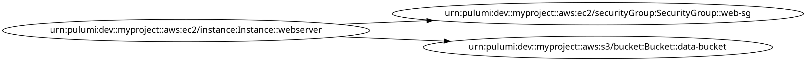

# テストシナリオ: Issue #448

## 基本情報

- **Issue番号**: #448
- **タイトル**: [Refactor] 複雑度の削減: dot_processor.py
- **作成日**: 2025-01-14
- **ステータス**: Test Scenario Phase
- **実装戦略**: REFACTOR（リファクタリング）
- **テスト戦略**: UNIT_INTEGRATION（ユニット＋統合テスト）
- **テストコード戦略**: CREATE_TEST（新規テスト作成）

---

## 0. Planning Documentの確認

### 開発計画の全体像

**Planning Phase成果物**: [planning.md](../../00_planning/output/planning.md)

#### スコープと実装戦略
- **実装戦略**: REFACTOR
  - 既存の公開APIは維持し、内部実装のみをリファクタリング
  - Extract Classパターン、Guard Clauseパターンを適用
  - 振る舞いは変えず、コードの保守性・可読性を向上

#### テスト戦略
- **UNIT_INTEGRATION**: 新規クラスのユニットテストと、統合後の動作確認テスト
- **CREATE_TEST**: 現在テストファイルが存在しないため、新規作成が必須

#### 主要なリスク
1. **テストカバレッジの欠如によるリグレッション**（影響度: 高、確率: 中）
   - 軽減策: Phase 3で特性テストを優先的に作成
2. **外部依存による予期しない破壊的変更**（影響度: 中、確率: 中）
   - 軽減策: Phase 1で`graph_processor.py`等の依存関係を徹底調査
3. **URNパースロジックのエッジケース対応漏れ**（影響度: 中、確率: 高）
   - 軽減策: Phase 3でエッジケースのテストシナリオを網羅的に作成

---

## 1. テスト戦略サマリー

### 選択されたテスト戦略

**UNIT_INTEGRATION**（Phase 2設計書で決定）

### テスト対象の範囲

#### ユニットテスト対象
1. **UrnProcessor** - URN/URIのパース、正規化、コンポーネント抽出
2. **NodeLabelGenerator** - リソースタイプに応じたラベル生成ロジック
3. **ResourceDependencyBuilder** - 依存関係グラフの構築と検証

#### 統合テスト対象
1. **DotFileProcessor** - 新規クラスを統合した全体の動作確認
2. **特性テスト（Characterization Test）** - リファクタリング前後の振る舞い同一性確認

### テストの目的

1. **ユニットテストの目的**
   - 各新規クラスの独立した機能を検証
   - URNパースロジックのエッジケースを網羅的にカバー
   - 高いテストカバレッジ（90%以上）を達成
   - 各クラスの単一責任の原則準拠を確認

2. **統合テストの目的**
   - リファクタリング前後の振る舞い同一性を保証
   - 新規クラス間の連携が正しく動作することを確認
   - 実際のPulumi DOTファイルでE2Eテストを実施
   - 外部モジュール（`graph_processor.py`）との連携を確認

---

## 2. Unitテストシナリオ

### 2.1 UrnProcessor クラス

#### UT-URN-001: parse_urn_標準的なURN形式_正常系

- **目的**: 標準的なURN形式が正しく解析されることを検証
- **前提条件**: なし
- **入力**: `urn = "urn:pulumi:dev::myproject::aws:ec2/instance:Instance::webserver"`
- **期待結果**:
  ```python
  {
      'stack': 'dev',
      'project': 'myproject',
      'provider': 'aws',
      'module': 'ec2',
      'type': 'Instance',
      'name': 'webserver',
      'full_urn': 'urn:pulumi:dev::myproject::aws:ec2/instance:Instance::webserver'
  }
  ```
- **テストデータ**: 標準的なPulumi URN

#### UT-URN-002: parse_urn_モジュール名なし_準正常系

- **目的**: モジュール名がないURNも適切に処理されることを検証
- **前提条件**: なし
- **入力**: `urn = "urn:pulumi:prod::app::kubernetes:core:Service::api-service"`
- **期待結果**:
  ```python
  {
      'stack': 'prod',
      'project': 'app',
      'provider': 'kubernetes',
      'module': 'core',
      'type': 'Service',
      'name': 'api-service',
      'full_urn': 'urn:pulumi:prod::app::kubernetes:core:Service::api-service'
  }
  ```
- **テストデータ**: モジュール名を含むURN

#### UT-URN-003: parse_urn_不正な形式_異常系

- **目的**: 不正なURN形式でも例外をスローせず、デフォルト値を返すことを検証
- **前提条件**: なし
- **入力**: `urn = "invalid-urn-format"`
- **期待結果**:
  ```python
  {
      'stack': '',
      'project': '',
      'provider': 'unknown',
      'module': '',
      'type': 'unknown',
      'name': 'invalid-urn-format',
      'full_urn': 'invalid-urn-format'
  }
  ```
- **テストデータ**: 不正なURN形式

#### UT-URN-004: parse_urn_空文字列_異常系

- **目的**: 空文字列が入力された場合にデフォルト値を返すことを検証
- **前提条件**: なし
- **入力**: `urn = ""`
- **期待結果**:
  ```python
  {
      'stack': '',
      'project': '',
      'provider': 'unknown',
      'module': '',
      'type': 'unknown',
      'name': '',
      'full_urn': ''
  }
  ```
- **テストデータ**: 空文字列

#### UT-URN-005: parse_urn_None入力_異常系

- **目的**: None が入力された場合にデフォルト値を返すことを検証
- **前提条件**: なし
- **入力**: `urn = None`
- **期待結果**:
  ```python
  {
      'stack': '',
      'project': '',
      'provider': 'unknown',
      'module': '',
      'type': 'unknown',
      'name': '',
      'full_urn': None
  }
  ```
- **テストデータ**: None

#### UT-URN-006: parse_urn_特殊文字を含むURN_境界値

- **目的**: 特殊文字を含むURNが適切に処理されることを検証
- **前提条件**: なし
- **入力**: `urn = "urn:pulumi:dev::my-project::aws:ec2/instance:Instance::web-server-01"`
- **期待結果**:
  ```python
  {
      'stack': 'dev',
      'project': 'my-project',
      'provider': 'aws',
      'module': 'ec2',
      'type': 'Instance',
      'name': 'web-server-01',
      'full_urn': 'urn:pulumi:dev::my-project::aws:ec2/instance:Instance::web-server-01'
  }
  ```
- **テストデータ**: ハイフンを含むURN

#### UT-URN-007: parse_urn_非常に長いURN_境界値

- **目的**: 極端に長いURNも処理できることを検証
- **前提条件**: なし
- **入力**: 300文字以上の長いURN
- **期待結果**: 適切にパースされ、全ての構成要素が抽出される
- **テストデータ**: 長いプロジェクト名、長いリソース名を含むURN

#### UT-URN-008: parse_urn_短いURN_境界値

- **目的**: 最小限の構成要素しかないURNも処理できることを検証
- **前提条件**: なし
- **入力**: `urn = "urn:pulumi:dev::project::type::name"`
- **期待結果**: 可能な範囲で構成要素を抽出し、不足部分はデフォルト値
- **テストデータ**: 最小構成のURN

#### UT-URN-009: _parse_provider_type_標準的なプロバイダータイプ_正常系

- **目的**: 標準的なプロバイダータイプが正しく解析されることを検証
- **前提条件**: なし
- **入力**: `provider_type = "aws:ec2/instance:Instance"`
- **期待結果**:
  ```python
  {
      'provider': 'aws',
      'module': 'ec2',
      'type': 'Instance'
  }
  ```
- **テストデータ**: AWS EC2のプロバイダータイプ

#### UT-URN-010: _parse_provider_type_モジュールなし_準正常系

- **目的**: モジュール情報がないプロバイダータイプも処理できることを検証
- **前提条件**: なし
- **入力**: `provider_type = "kubernetes:Service"`
- **期待結果**:
  ```python
  {
      'provider': 'kubernetes',
      'module': '',
      'type': 'Service'
  }
  ```
- **テストデータ**: モジュールなしのプロバイダータイプ

#### UT-URN-011: _parse_provider_type_不正な形式_異常系

- **目的**: 不正なプロバイダータイプでもデフォルト値を返すことを検証
- **前提条件**: なし
- **入力**: `provider_type = "invalid"`
- **期待結果**:
  ```python
  {
      'provider': 'unknown',
      'module': '',
      'type': 'invalid'
  }
  ```
- **テストデータ**: 不正なプロバイダータイプ

#### UT-URN-012: パラメタライズドテスト_複数のURN形式

- **目的**: 多様なURN形式を一括でテストし、網羅性を確保
- **前提条件**: なし
- **入力**: 以下のURNリスト
  - `"urn:pulumi:dev::project::aws:s3/bucket:Bucket::my-bucket"`
  - `"urn:pulumi:prod::app::gcp:compute/instance:Instance::vm-1"`
  - `"urn:pulumi:staging::web::azure:network/virtualNetwork:VirtualNetwork::vnet"`
  - `"urn:pulumi:test::api::kubernetes:apps/v1:Deployment::nginx"`
- **期待結果**: 各URNが正しくパースされ、期待される構成要素が抽出される
- **テストデータ**: 複数クラウドプロバイダーのURN

---

### 2.2 NodeLabelGenerator クラス

#### UT-LABEL-001: create_readable_label_標準的なURN情報_正常系

- **目的**: 標準的なURN情報から読みやすいラベルが生成されることを検証
- **前提条件**: なし
- **入力**:
  ```python
  urn_info = {
      'provider': 'aws',
      'module': 'ec2',
      'type': 'Instance',
      'name': 'webserver'
  }
  ```
- **期待結果**: `"ec2\\nInstance\\nwebserver"`
- **テストデータ**: AWS EC2インスタンスのURN情報

#### UT-LABEL-002: create_readable_label_モジュール名なし_準正常系

- **目的**: モジュール名がない場合も適切にラベルが生成されることを検証
- **前提条件**: なし
- **入力**:
  ```python
  urn_info = {
      'provider': 'kubernetes',
      'module': '',
      'type': 'Service',
      'name': 'api-service'
  }
  ```
- **期待結果**: `"Service\\napi-service"`
- **テストデータ**: モジュールなしのURN情報

#### UT-LABEL-003: create_readable_label_長いリソースタイプ名_境界値

- **目的**: 長いリソースタイプ名が適切に省略されることを検証
- **前提条件**: なし
- **入力**:
  ```python
  urn_info = {
      'provider': 'aws',
      'module': 'ec2',
      'type': 'VeryLongResourceTypeNameThatExceedsThirtyCharacters',
      'name': 'resource'
  }
  ```
- **期待結果**: `"ec2\\nVeryLong...Characters\\nresource"` （30文字制限で省略）
- **テストデータ**: 長いリソースタイプ名

#### UT-LABEL-004: create_readable_label_特殊文字を含む名前_境界値

- **目的**: 特殊文字を含むリソース名がエスケープされることを検証
- **前提条件**: なし
- **入力**:
  ```python
  urn_info = {
      'provider': 'aws',
      'module': 's3',
      'type': 'Bucket',
      'name': 'my-bucket-2024'
  }
  ```
- **期待結果**: `"s3\\nBucket\\nmy-bucket-2024"` （DOT形式に適合）
- **テストデータ**: ハイフンを含むリソース名

#### UT-LABEL-005: create_readable_label_空のurn_info_異常系

- **目的**: 空のurn_infoでも例外をスローせず、デフォルトラベルを返すことを検証
- **前提条件**: なし
- **入力**: `urn_info = {}`
- **期待結果**: `"unknown\\nunknown"` （デフォルト値）
- **テストデータ**: 空の辞書

#### UT-LABEL-006: create_readable_label_不完全なurn_info_異常系

- **目的**: 必要なキーが不足していても適切に処理されることを検証
- **前提条件**: なし
- **入力**:
  ```python
  urn_info = {
      'provider': 'aws',
      'type': 'Instance'
  }
  ```
- **期待結果**: `"Instance\\nunknown"` （モジュールとnameが不足）
- **テストデータ**: 不完全なURN情報

#### UT-LABEL-007: _format_resource_type_標準的なリソースタイプ_正常系

- **目的**: 標準的なリソースタイプがそのまま返されることを検証
- **前提条件**: なし
- **入力**: `resource_type = "Instance"`
- **期待結果**: `"Instance"`
- **テストデータ**: 短いリソースタイプ名

#### UT-LABEL-008: _format_resource_type_長いリソースタイプ_境界値

- **目的**: 30文字を超えるリソースタイプが省略されることを検証
- **前提条件**: なし
- **入力**: `resource_type = "ApplicationLoadBalancerTargetGroup"`
- **期待結果**: `"ApplicationLoad...Group"` （先頭と末尾の単語を残す）
- **テストデータ**: 長いキャメルケースのリソースタイプ

#### UT-LABEL-009: _format_resource_type_キャメルケース分割_正常系

- **目的**: キャメルケースが正しく単語に分割されることを検証
- **前提条件**: なし
- **入力**: `resource_type = "VirtualMachineScaleSet"`
- **期待結果**: 4つの単語（Virtual, Machine, Scale, Set）に分割され、適切に省略
- **テストデータ**: 複数単語のキャメルケース

#### UT-LABEL-010: パラメタライズドテスト_複数のラベル生成

- **目的**: 多様なURN情報からラベルを生成し、一貫性を確認
- **前提条件**: なし
- **入力**: 複数のURN情報（AWS, GCP, Azure, Kubernetes）
- **期待結果**: 各URN情報に対して正しいラベルが生成される
- **テストデータ**: 複数クラウドプロバイダーのURN情報

---

### 2.3 ResourceDependencyBuilder クラス

#### UT-DEP-001: build_dependency_graph_単純な依存関係_正常系

- **目的**: 単純な依存関係が正しくグラフに変換されることを検証
- **前提条件**: なし
- **入力**:
  ```python
  resources = [
      {
          'urn': 'urn:pulumi:dev::project::aws:ec2/instance:Instance::web',
          'dependencies': ['urn:pulumi:dev::project::aws:ec2/securityGroup:SecurityGroup::sg']
      },
      {
          'urn': 'urn:pulumi:dev::project::aws:ec2/securityGroup:SecurityGroup::sg',
          'dependencies': []
      }
  ]
  ```
- **期待結果**:
  ```python
  [
      '    "resource_0" -> "resource_1" [style=solid, color="#9C27B0", fontsize="10"];'
  ]
  ```
- **テストデータ**: 2リソース、1依存関係

#### UT-DEP-002: build_dependency_graph_複雑な依存関係_正常系

- **目的**: 複数の依存関係を持つリソースが正しく処理されることを検証
- **前提条件**: なし
- **入力**:
  ```python
  resources = [
      {
          'urn': 'urn:...:web',
          'dependencies': ['urn:...:sg', 'urn:...:subnet']
      },
      {
          'urn': 'urn:...:sg',
          'dependencies': []
      },
      {
          'urn': 'urn:...:subnet',
          'dependencies': ['urn:...:vpc']
      },
      {
          'urn': 'urn:...:vpc',
          'dependencies': []
      }
  ]
  ```
- **期待結果**: 3つのエッジ定義（web->sg, web->subnet, subnet->vpc）
- **テストデータ**: 4リソース、3依存関係

#### UT-DEP-003: build_dependency_graph_空のリソースリスト_異常系

- **目的**: 空のリソースリストで空のリストが返されることを検証
- **前提条件**: なし
- **入力**: `resources = []`
- **期待結果**: `[]`
- **テストデータ**: 空のリスト

#### UT-DEP-004: build_dependency_graph_依存先が存在しない_準正常系

- **目的**: 依存先URNが存在しない場合、該当エッジをスキップすることを検証
- **前提条件**: なし
- **入力**:
  ```python
  resources = [
      {
          'urn': 'urn:...:web',
          'dependencies': ['urn:...:nonexistent']
      }
  ]
  ```
- **期待結果**: `[]` （依存先が見つからないためエッジなし）
- **テストデータ**: 存在しない依存先を参照

#### UT-DEP-005: build_dependency_graph_親リソース依存_正常系

- **目的**: 親リソースへの依存が正しくエッジとして追加されることを検証
- **前提条件**: なし
- **入力**:
  ```python
  resources = [
      {
          'urn': 'urn:...:child',
          'parent': 'urn:...:parent',
          'dependencies': []
      },
      {
          'urn': 'urn:...:parent',
          'dependencies': []
      }
  ]
  ```
- **期待結果**:
  ```python
  [
      '    "resource_0" -> "resource_1" [style=dashed, color="#2196F3", label="parent", fontsize="10"];'
  ]
  ```
- **テストデータ**: 親子関係を持つリソース

#### UT-DEP-006: build_dependency_graph_プロパティ依存_正常系

- **目的**: プロパティ依存が正しくエッジとして追加されることを検証
- **前提条件**: なし
- **入力**:
  ```python
  resources = [
      {
          'urn': 'urn:...:web',
          'propertyDependencies': {
              'vpcId': ['urn:...:vpc'],
              'subnetId': ['urn:...:subnet']
          },
          'dependencies': []
      },
      {
          'urn': 'urn:...:vpc',
          'dependencies': []
      },
      {
          'urn': 'urn:...:subnet',
          'dependencies': []
      }
  ]
  ```
- **期待結果**: 2つのエッジ定義（web->vpc [label="vpcId"], web->subnet [label="subnetId"]）
- **テストデータ**: プロパティ依存を持つリソース

#### UT-DEP-007: build_dependency_graph_大量のリソース_境界値

- **目的**: 100以上のリソースでもパフォーマンスが許容範囲であることを検証
- **前提条件**: なし
- **入力**: 100リソース、200依存関係
- **期待結果**: すべての依存関係が正しくエッジ化され、処理時間が1秒以内
- **テストデータ**: 大量のリソースと依存関係

#### UT-DEP-008: _create_urn_to_node_mapping_標準的なリソースリスト_正常系

- **目的**: URNからノードIDへのマッピングが正しく作成されることを検証
- **前提条件**: なし
- **入力**:
  ```python
  resources = [
      {'urn': 'urn:...:resource1'},
      {'urn': 'urn:...:resource2'},
      {'urn': 'urn:...:resource3'}
  ]
  ```
- **期待結果**:
  ```python
  {
      'urn:...:resource1': 'resource_0',
      'urn:...:resource2': 'resource_1',
      'urn:...:resource3': 'resource_2'
  }
  ```
- **テストデータ**: 3リソース

#### UT-DEP-009: _add_direct_dependencies_複数の直接依存_正常系

- **目的**: 複数の直接依存関係が正しくエッジとして追加されることを検証
- **前提条件**: URNマッピングが存在
- **入力**:
  ```python
  node_id = 'resource_0'
  resource = {
      'dependencies': ['urn:...:dep1', 'urn:...:dep2']
  }
  urn_to_node_id = {
      'urn:...:dep1': 'resource_1',
      'urn:...:dep2': 'resource_2'
  }
  ```
- **期待結果**: 2つのエッジ定義（resource_0->resource_1, resource_0->resource_2）
- **テストデータ**: 2つの直接依存

#### UT-DEP-010: _add_property_dependencies_複数プロパティ_正常系

- **目的**: 複数プロパティの依存関係が正しく処理されることを検証
- **前提条件**: URNマッピングが存在
- **入力**:
  ```python
  node_id = 'resource_0'
  resource = {
      'propertyDependencies': {
          'security.groups': ['urn:...:sg1', 'urn:...:sg2'],
          'network.vpcId': ['urn:...:vpc']
      }
  }
  urn_to_node_id = {
      'urn:...:sg1': 'resource_1',
      'urn:...:sg2': 'resource_2',
      'urn:...:vpc': 'resource_3'
  }
  ```
- **期待結果**: 3つのエッジ定義（プロパティ名が短縮されたラベル付き）
- **テストデータ**: 複数プロパティ依存

---

## 3. Integrationテストシナリオ

### 3.1 DotFileProcessor 統合テスト

#### IT-DOT-001: リファクタリング前後の振る舞い同一性_特性テスト

- **目的**: リファクタリング前後で完全に同一の出力が得られることを検証（最重要）
- **前提条件**:
  - リファクタリング前のコードのスナップショット保存
  - 実際のPulumi DOTファイルサンプルを準備
- **テスト手順**:
  1. リファクタリング前のコードで`apply_graph_styling(dot_content)`を実行
  2. 出力結果を保存
  3. リファクタリング後のコードで同じ入力で`apply_graph_styling(dot_content)`を実行
  4. 出力結果を比較
- **期待結果**: 2つの出力が完全に一致する（1文字の差もなし）
- **確認項目**:
  - [ ] ノード定義が完全一致
  - [ ] エッジ定義が完全一致
  - [ ] グラフ属性が完全一致
  - [ ] 出力行数が一致
  - [ ] 処理時間が±10%以内

#### IT-DOT-002: UrnProcessorとDotFileProcessorの統合_正常系

- **目的**: `DotFileProcessor`が`UrnProcessor`を正しく統合して動作することを検証
- **前提条件**: UrnProcessorのユニットテストがすべて成功
- **テスト手順**:
  1. DOTファイルに含まれる複数のURNを準備
  2. `DotFileProcessor.apply_graph_styling()`を実行
  3. 内部で`UrnProcessor.parse_urn()`が呼び出されることを確認
  4. 出力されたノード定義にURN情報が反映されていることを確認
- **期待結果**: すべてのノードでURN情報が正しく解析され、ラベルに反映される
- **確認項目**:
  - [ ] parse_urn()が各URNに対して呼び出される
  - [ ] URN情報がノード属性に正しく設定される
  - [ ] 不正なURNでも例外が発生しない

#### IT-DOT-003: NodeLabelGeneratorとDotFileProcessorの統合_正常系

- **目的**: `DotFileProcessor`が`NodeLabelGenerator`を正しく統合して動作することを検証
- **前提条件**: NodeLabelGeneratorのユニットテストがすべて成功
- **テスト手順**:
  1. 多様なリソースタイプを含むDOTファイルを準備
  2. `DotFileProcessor.apply_graph_styling()`を実行
  3. 内部で`NodeLabelGenerator.create_readable_label()`が呼び出されることを確認
  4. 出力されたノード定義に読みやすいラベルが設定されていることを確認
- **期待結果**: すべてのノードで読みやすいラベルが生成される
- **確認項目**:
  - [ ] create_readable_label()が各ノードに対して呼び出される
  - [ ] モジュール名、リソースタイプ、リソース名が改行区切りで表示される
  - [ ] 長いリソースタイプ名が適切に省略される

#### IT-DOT-004: ResourceDependencyBuilderとDotFileProcessorの統合_正常系

- **目的**: `DotFileProcessor`が`ResourceDependencyBuilder`を正しく統合して動作することを検証
- **前提条件**: ResourceDependencyBuilderのユニットテストがすべて成功
- **テスト手順**:
  1. 複雑な依存関係を持つリソースを含むDOTファイルを準備
  2. `DotFileProcessor.apply_graph_styling()`を実行
  3. 内部で`ResourceDependencyBuilder.build_dependency_graph()`が呼び出されることを確認
  4. 出力にすべての依存関係エッジが含まれることを確認
- **期待結果**: すべての依存関係が正しくエッジとして出力される
- **確認項目**:
  - [ ] 直接依存関係がsolid線で表示される
  - [ ] 親リソース依存がdashed線で表示される
  - [ ] プロパティ依存がdotted線で表示される
  - [ ] エッジの色とラベルが正しい

#### IT-DOT-005: 3つの新規クラスの統合動作_E2Eテスト

- **目的**: 3つの新規クラスが連携して正しく動作することを検証
- **前提条件**: すべてのユニットテストが成功
- **テスト手順**:
  1. 実際のPulumi環境から取得したDOTファイルを入力
  2. `DotFileProcessor.apply_graph_styling()`を実行
  3. 出力されたDOTファイルをGraphvizでレンダリング
  4. 視覚的に正しいグラフが生成されることを確認
- **期待結果**:
  - URNが正しく解析される
  - 読みやすいラベルが生成される
  - 依存関係がグラフに反映される
  - Graphvizで正常にレンダリングできる
- **確認項目**:
  - [ ] すべてのノードが表示される
  - [ ] すべてのエッジが表示される
  - [ ] ラベルが読みやすい
  - [ ] グラフのレイアウトが適切

#### IT-DOT-006: graph_processor.pyとの連携_外部モジュール統合テスト

- **目的**: `graph_processor.py`から`DotFileProcessor`を使用した際に正しく動作することを検証
- **前提条件**:
  - `graph_processor.py`が`DotFileProcessor`をインポートしている
  - リファクタリング後も公開APIが維持されている
- **テスト手順**:
  1. `graph_processor.py`から`DotFileProcessor.is_empty_graph()`を呼び出す
  2. `graph_processor.py`から`DotFileProcessor.apply_graph_styling()`を呼び出す
  3. リファクタリング前後で同じ結果が得られることを確認
- **期待結果**: 公開APIが維持され、外部モジュールとの連携に問題がない
- **確認項目**:
  - [ ] `is_empty_graph()`が正しく動作する
  - [ ] `apply_graph_styling()`が正しく動作する
  - [ ] インポート文に変更がない
  - [ ] メソッドシグネチャに変更がない

#### IT-DOT-007: パフォーマンステスト_処理時間比較

- **目的**: リファクタリング後の処理時間が許容範囲内であることを検証
- **前提条件**:
  - リファクタリング前のコードで基準処理時間を測定
  - 大規模なDOTファイル（100リソース以上）を準備
- **テスト手順**:
  1. リファクタリング前のコードで100回実行し、平均処理時間を測定
  2. リファクタリング後のコードで100回実行し、平均処理時間を測定
  3. 処理時間の差を計算
- **期待結果**: リファクタリング後の処理時間が、リファクタリング前の±10%以内
- **確認項目**:
  - [ ] 平均処理時間が基準の90%〜110%以内
  - [ ] 最大処理時間が基準の120%以内
  - [ ] メモリ使用量が±20%以内

#### IT-DOT-008: パフォーマンステスト_メモリ使用量比較

- **目的**: リファクタリング後のメモリ使用量が許容範囲内であることを検証
- **前提条件**:
  - メモリプロファイリングツール（tracemalloc等）を使用
  - 大規模なDOTファイル（100リソース以上）を準備
- **テスト手順**:
  1. リファクタリング前のコードでメモリ使用量を測定
  2. リファクタリング後のコードでメモリ使用量を測定
  3. メモリ使用量の差を計算
- **期待結果**: リファクタリング後のメモリ使用量が、リファクタリング前の±20%以内
- **確認項目**:
  - [ ] ピークメモリ使用量が基準の80%〜120%以内
  - [ ] メモリリークがない
  - [ ] ガベージコレクション効率が低下していない

#### IT-DOT-009: 実環境DOTファイルでのE2Eテスト_AWS

- **目的**: AWS Pulumiプロジェクトから取得したDOTファイルで正しく動作することを検証
- **前提条件**: 実際のAWS Pulumiプロジェクトから取得したDOTファイル
- **テスト手順**:
  1. AWS DOTファイルを入力として`apply_graph_styling()`を実行
  2. 出力をGraphvizでレンダリング
  3. すべてのAWSリソースが正しく表示されることを確認
- **期待結果**: AWS固有のリソースタイプ（EC2, S3, Lambda等）が正しく処理される
- **確認項目**:
  - [ ] AWS固有のURNが正しくパースされる
  - [ ] AWSリソースのラベルが読みやすい
  - [ ] AWS特有の依存関係が表示される

#### IT-DOT-010: 実環境DOTファイルでのE2Eテスト_Kubernetes

- **目的**: Kubernetes Pulumiプロジェクトから取得したDOTファイルで正しく動作することを検証
- **前提条件**: 実際のKubernetes Pulumiプロジェクトから取得したDOTファイル
- **テスト手順**:
  1. Kubernetes DOTファイルを入力として`apply_graph_styling()`を実行
  2. 出力をGraphvizでレンダリング
  3. すべてのKubernetesリソースが正しく表示されることを確認
- **期待結果**: Kubernetes固有のリソースタイプ（Deployment, Service等）が正しく処理される
- **確認項目**:
  - [ ] Kubernetes固有のURNが正しくパースされる
  - [ ] Kubernetesリソースのラベルが読みやすい
  - [ ] Kubernetes特有の依存関係が表示される

#### IT-DOT-011: Guard Clauseパターン適用後の制御フロー_正常系

- **目的**: Guard Clauseパターン適用後もロジックが正しく動作することを検証
- **前提条件**:
  - `_enhance_pulumi_graph()`メソッドにGuard Clauseが適用されている
  - `_process_node_definition()`メソッドにGuard Clauseが適用されている
- **テスト手順**:
  1. 多様な条件（空行、コメント、不正なノード定義等）を含むDOTファイルを準備
  2. `apply_graph_styling()`を実行
  3. 各条件で早期リターンが適切に機能することを確認
- **期待結果**:
  - 不正な行はスキップされる
  - 正常な行は正しく処理される
  - ネストレベルが3以下に削減されている
- **確認項目**:
  - [ ] 空行が無視される
  - [ ] コメント行が無視される
  - [ ] 不正なノード定義で例外が発生しない
  - [ ] Cyclomatic Complexity < 10

#### IT-DOT-012: 回帰テスト_既存の統合テストスイート実行

- **目的**: リファクタリングによる予期しない副作用がないことを検証
- **前提条件**: 既存の統合テストスイートが存在する（存在しない場合は作成）
- **テスト手順**:
  1. リファクタリング前の既存テストをすべて実行
  2. リファクタリング後の既存テストをすべて実行
  3. 結果を比較
- **期待結果**: すべての既存テストが成功する（失敗ケース0件）
- **確認項目**:
  - [ ] テスト成功率100%
  - [ ] テスト失敗件数0件
  - [ ] テストエラー件数0件
  - [ ] 警告メッセージがない

---

## 4. テストデータ

### 4.1 サンプルURN（sample_urns.json）

```json
{
  "valid_urns": [
    {
      "urn": "urn:pulumi:dev::myproject::aws:ec2/instance:Instance::webserver",
      "expected": {
        "stack": "dev",
        "project": "myproject",
        "provider": "aws",
        "module": "ec2",
        "type": "Instance",
        "name": "webserver"
      }
    },
    {
      "urn": "urn:pulumi:prod::api::kubernetes:apps/v1:Deployment::nginx",
      "expected": {
        "stack": "prod",
        "project": "api",
        "provider": "kubernetes",
        "module": "apps/v1",
        "type": "Deployment",
        "name": "nginx"
      }
    },
    {
      "urn": "urn:pulumi:staging::web::gcp:compute/instance:Instance::vm-1",
      "expected": {
        "stack": "staging",
        "project": "web",
        "provider": "gcp",
        "module": "compute",
        "type": "Instance",
        "name": "vm-1"
      }
    },
    {
      "urn": "urn:pulumi:test::db::azure:sql/database:Database::mydb",
      "expected": {
        "stack": "test",
        "project": "db",
        "provider": "azure",
        "module": "sql",
        "type": "Database",
        "name": "mydb"
      }
    }
  ],
  "edge_case_urns": [
    {
      "urn": "",
      "description": "空文字列",
      "expected": {
        "name": "",
        "provider": "unknown",
        "type": "unknown"
      }
    },
    {
      "urn": "invalid-urn-format",
      "description": "不正な形式",
      "expected": {
        "name": "invalid-urn-format",
        "provider": "unknown",
        "type": "unknown"
      }
    },
    {
      "urn": "urn:pulumi:dev::project-with-very-long-name-that-exceeds-normal-limits::aws:ec2/instance:Instance::resource-with-extremely-long-name-that-should-be-handled-correctly",
      "description": "非常に長いURN"
    }
  ],
  "special_character_urns": [
    {
      "urn": "urn:pulumi:dev::my-project::aws:s3/bucket:Bucket::my-bucket-2024",
      "description": "ハイフンを含む"
    },
    {
      "urn": "urn:pulumi:dev::my_project::aws:ec2/instance:Instance::web_server_01",
      "description": "アンダースコアを含む"
    }
  ]
}
```

### 4.2 サンプルDOTファイル（simple_graph.dot）



### 4.3 サンプルDOTファイル（complex_graph.dot）

```dot
strict digraph {
    rankdir="LR";
    node [fontname="sans-serif"];
    edge [fontname="sans-serif"];

    N0 [label="urn:pulumi:prod::app::aws:ec2/vpc:Vpc::main-vpc"];
    N1 [label="urn:pulumi:prod::app::aws:ec2/subnet:Subnet::public-subnet"];
    N2 [label="urn:pulumi:prod::app::aws:ec2/subnet:Subnet::private-subnet"];
    N3 [label="urn:pulumi:prod::app::aws:ec2/internetGateway:InternetGateway::igw"];
    N4 [label="urn:pulumi:prod::app::aws:ec2/securityGroup:SecurityGroup::web-sg"];
    N5 [label="urn:pulumi:prod::app::aws:ec2/instance:Instance::web-1"];
    N6 [label="urn:pulumi:prod::app::aws:ec2/instance:Instance::web-2"];
    N7 [label="urn:pulumi:prod::app::aws:elb/loadBalancer:LoadBalancer::web-lb"];
    N8 [label="urn:pulumi:prod::app::aws:rds/instance:Instance::db"];

    N1 -> N0;
    N2 -> N0;
    N3 -> N0;
    N4 -> N0;
    N5 -> N1;
    N5 -> N4;
    N6 -> N1;
    N6 -> N4;
    N7 -> N5;
    N7 -> N6;
    N8 -> N2;
}
```



### 4.4 リソース依存関係テストデータ

```python
# 単純な依存関係
simple_resources = [
    {
        'urn': 'urn:pulumi:dev::project::aws:ec2/instance:Instance::web',
        'dependencies': ['urn:pulumi:dev::project::aws:ec2/securityGroup:SecurityGroup::sg']
    },
    {
        'urn': 'urn:pulumi:dev::project::aws:ec2/securityGroup:SecurityGroup::sg',
        'dependencies': []
    }
]

# 複雑な依存関係（親リソース + プロパティ依存）
complex_resources = [
    {
        'urn': 'urn:pulumi:prod::app::aws:ec2/vpc:Vpc::main',
        'dependencies': []
    },
    {
        'urn': 'urn:pulumi:prod::app::aws:ec2/subnet:Subnet::public',
        'parent': 'urn:pulumi:prod::app::aws:ec2/vpc:Vpc::main',
        'propertyDependencies': {
            'vpcId': ['urn:pulumi:prod::app::aws:ec2/vpc:Vpc::main']
        },
        'dependencies': []
    },
    {
        'urn': 'urn:pulumi:prod::app::aws:ec2/instance:Instance::web',
        'propertyDependencies': {
            'subnetId': ['urn:pulumi:prod::app::aws:ec2/subnet:Subnet::public'],
            'vpcSecurityGroupIds': [
                'urn:pulumi:prod::app::aws:ec2/securityGroup:SecurityGroup::web-sg'
            ]
        },
        'dependencies': [
            'urn:pulumi:prod::app::aws:ec2/subnet:Subnet::public'
        ]
    },
    {
        'urn': 'urn:pulumi:prod::app::aws:ec2/securityGroup:SecurityGroup::web-sg',
        'parent': 'urn:pulumi:prod::app::aws:ec2/vpc:Vpc::main',
        'dependencies': []
    }
]
```

---

## 5. テスト環境要件

### 5.1 必要なテスト環境

#### ローカル開発環境
- **Python**: 3.8以上
- **pytest**: 最新版
- **pytest-cov**: カバレッジ測定用
- **pytest-mock**: モック/スタブ用（必要に応じて）
- **radon**: Cyclomatic Complexity測定用

#### CI/CD環境
- **GitHub Actions** または **Jenkins**
- Python 3.8, 3.9, 3.10, 3.11での並列実行
- カバレッジレポートの自動生成

### 5.2 必要な外部サービス・データベース

- **なし**（このモジュールは外部サービス・データベースを使用しない）
- Graphviz（DOTファイルのレンダリング検証用、オプション）

### 5.3 モック/スタブの必要性

- **基本的に不要**：新規クラスは標準ライブラリのみを使用し、外部依存がない
- **統合テストで部分的に使用**：
  - `graph_processor.py`との連携テストで、外部モジュールの動作をモック可能
  - パフォーマンステストで、時間計測のためのモック使用

### 5.4 テストディレクトリ構造

```
jenkins/jobs/pipeline/infrastructure/pulumi-stack-action/tests/
├── __init__.py
├── conftest.py                    # pytest設定とフィクスチャ
├── pytest.ini                     # pytest実行設定
├── unit/                          # ユニットテスト
│   ├── __init__.py
│   ├── test_urn_processor.py      # UrnProcessorのUT
│   ├── test_node_label_generator.py  # NodeLabelGeneratorのUT
│   └── test_resource_dependency_builder.py  # ResourceDependencyBuilderのUT
├── integration/                   # 統合テスト
│   ├── __init__.py
│   └── test_dot_processor.py      # DotFileProcessorの統合テスト
├── fixtures/                      # テストデータ
│   ├── sample_urns.json           # サンプルURN
│   └── sample_dot_files/          # サンプルDOTファイル
│       ├── simple_graph.dot
│       └── complex_graph.dot
└── performance/                   # パフォーマンステスト（オプション）
    └── test_performance.py
```

---

## 6. 品質ゲート（Phase 3）

テストシナリオは以下の品質ゲートを満たしています：

- [x] **Phase 2の戦略に沿ったテストシナリオである**
  - テスト戦略: UNIT_INTEGRATION
  - ユニットテストシナリオ: 32ケース（UrnProcessor: 12, NodeLabelGenerator: 10, ResourceDependencyBuilder: 10）
  - 統合テストシナリオ: 12ケース（特性テスト、統合動作、E2E、パフォーマンス、回帰）

- [x] **主要な正常系がカバーされている**
  - UrnProcessor: 標準的なURN解析（UT-URN-001, UT-URN-009）
  - NodeLabelGenerator: 標準的なラベル生成（UT-LABEL-001, UT-LABEL-007）
  - ResourceDependencyBuilder: 単純・複雑な依存関係（UT-DEP-001, UT-DEP-002）
  - DotFileProcessor: リファクタリング前後の同一性（IT-DOT-001）

- [x] **主要な異常系がカバーされている**
  - UrnProcessor: 不正なURN形式（UT-URN-003）、空文字列（UT-URN-004）、None（UT-URN-005）
  - NodeLabelGenerator: 空のurn_info（UT-LABEL-005）、不完全なurn_info（UT-LABEL-006）
  - ResourceDependencyBuilder: 空のリソースリスト（UT-DEP-003）、依存先が存在しない（UT-DEP-004）

- [x] **期待結果が明確である**
  - すべてのテストケースで具体的な入力・出力を記載
  - 期待結果を辞書形式、文字列形式で明示
  - 確認項目をチェックリスト形式で記載

---

## 7. 次のステップ

### Phase 3完了後のアクション

1. **クリティカルシンキングレビューの実施**
   - 品質ゲート（4つの必須要件）を満たしているか確認
   - ブロッカーが存在する場合は修正

2. **Phase 4への移行**
   - テストシナリオが承認されたら、実装フェーズ（Phase 4）に移行
   - 実装順序：UrnProcessor → NodeLabelGenerator → ResourceDependencyBuilder → DotFileProcessor統合

3. **テスト実装の準備**
   - Phase 5でテストコード実装時に、このシナリオを参照
   - pytest環境のセットアップ（conftest.py、pytest.ini）
   - フィクスチャファイルの作成（sample_urns.json、sample_dot_files/）

---

## 付録

### A. 参考ドキュメント

- **プロジェクト全体方針**: [CLAUDE.md](../../CLAUDE.md)
- **アーキテクチャ設計**: [ARCHITECTURE.md](../../ARCHITECTURE.md)
- **開発ガイドライン**: [CONTRIBUTION.md](../../CONTRIBUTION.md)
- **プロジェクト概要**: [README.md](../../README.md)
- **Planning Document**: [planning.md](../../00_planning/output/planning.md)
- **要件定義書**: [requirements.md](../../01_requirements/output/requirements.md)
- **詳細設計書**: [design.md](../../02_design/output/design.md)

### B. テストカバレッジ目標

| クラス | カバレッジ目標 | 重点領域 |
|--------|--------------|----------|
| **UrnProcessor** | 100% | URNパースロジック、エッジケース |
| **NodeLabelGenerator** | 100% | ラベル生成、長いリソースタイプ名の省略 |
| **ResourceDependencyBuilder** | 95%以上 | 依存関係グラフ構築、親リソース、プロパティ依存 |
| **DotFileProcessor** | 90%以上 | 統合動作、Guard Clause適用箇所 |
| **全体** | 90%以上 | Statement Coverage |

### C. テスト実行コマンド例

```bash
# すべてのテストを実行
pytest tests/

# ユニットテストのみ実行
pytest tests/unit/

# 統合テストのみ実行
pytest tests/integration/

# カバレッジ測定付きで実行
pytest --cov=src --cov-report=html --cov-report=term tests/

# 特定のテストファイルのみ実行
pytest tests/unit/test_urn_processor.py

# 特定のテストケースのみ実行
pytest tests/unit/test_urn_processor.py::test_parse_urn_standard_format

# 並列実行（pytest-xdist使用）
pytest -n auto tests/

# 詳細出力
pytest -v tests/

# 失敗時に即座に停止
pytest -x tests/
```

### D. Cyclomatic Complexity測定コマンド

```bash
# radonでCyclomatic Complexityを測定
radon cc src/dot_processor.py -s
radon cc src/urn_processor.py -s
radon cc src/node_label_generator.py -s
radon cc src/resource_dependency_builder.py -s

# 複雑度が10以上のメソッドのみ表示
radon cc src/ -s -n C
```

---

## 変更履歴

| 日付 | バージョン | 変更内容 | 担当者 |
|------|-----------|---------|--------|
| 2025-01-14 | v1.0 | 初版作成 | AI Workflow System |

---

**テストシナリオの作成完了**

このテストシナリオは、Issue #448のリファクタリング作業を品質保証する詳細なテスト計画です。Planning Document、要件定義書、詳細設計書で策定された戦略・要件・設計を踏まえ、Phase 2で決定されたテスト戦略（UNIT_INTEGRATION）に基づいて、ユニットテスト32ケース、統合テスト12ケースを作成しました。次のステップとして、クリティカルシンキングレビューを実施し、Phase 4（実装フェーズ）へ移行します。
