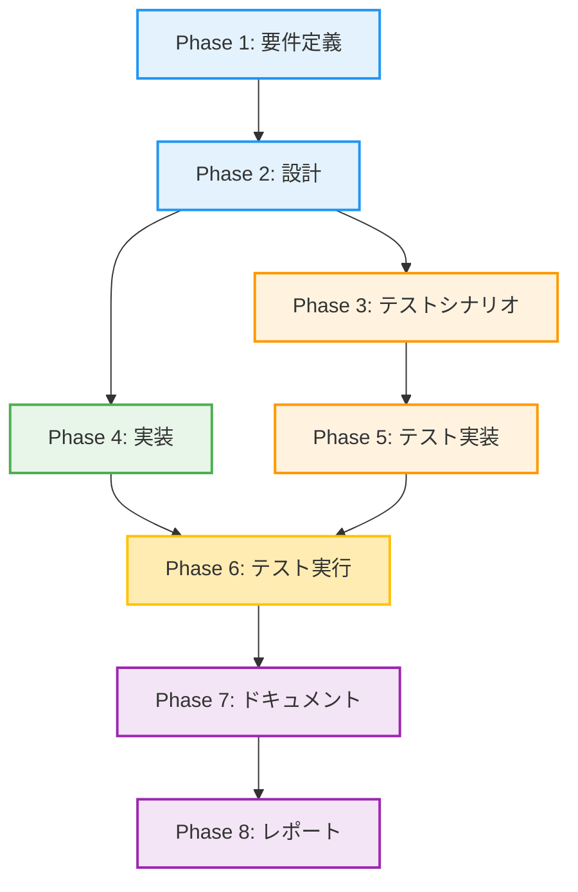

# プロジェクト計画書

**Issue**: #453
**タイトル**: [TASK] AI Workflow Orchestrator ジョブを実行モードごとに分割・リポジトリ別構成に変更
**作成日**: 2025-01-17

---

## 1. Issue分析

### 複雑度: 中程度

**判定理由**:
- 既存の単一ジョブを5つの独立したジョブに分割する構造的変更
- Job DSL、Jenkinsfile、job-config.yamlの複数ファイルにまたがる修正
- パラメータロジックの整理とリポジトリ別構成の実装が必要
- アーキテクチャレベルの変更ではなく、既存パターン（Code_Quality_Checker）の適用

### 見積もり工数: 8~12時間

**根拠**:
- 既存ジョブの分析と理解: 1~2時間
- Job DSL 5ファイルの作成: 3~5時間（1ファイル約1時間）
- job-config.yamlの更新: 1時間
- 共通Jenkinsfileの設計と実装: 2~3時間
- テストとドキュメント更新: 1~2時間

### リスク評価: 中

**リスク要因**:
1. **既存ジョブの削除による影響**: 既存の`ai_workflow_orchestrator`ジョブを使用している可能性
2. **パラメータロジックの複雑性**: EXECUTION_MODEごとに異なるパラメータセットの管理
3. **リポジトリ動的生成ロジック**: `jenkinsManagedRepositories`を使用したフォルダ構造の実装

**軽減策**:
- 既存ジョブを即座に削除せず、deprecated扱いとして残す
- Code_Quality_Checkerの実装パターンを参考に実装
- 段階的なロールアウト（開発環境で検証後に本番適用）

---

## 2. 実装戦略判断

### 実装戦略: REFACTOR

**判断根拠**:
- 既存の`ai_workflow_orchestrator.groovy`を5つのファイルに分割
- 機能追加ではなく、既存機能のリファクタリングと構造改善
- パラメータを整理し、UI/UXを改善する目的
- Code_Quality_Checkerと同じパターン（リポジトリ別構成）への統一

### テスト戦略: INTEGRATION_ONLY

**判断根拠**:
- Job DSLはGroovyコードだが、ユニットテストが困難（Jenkins環境依存）
- 実際にJenkinsでジョブを生成し、パラメータが正しく表示されるかを確認する統合テストが必要
- BDDは不要（ユーザーストーリーベースではなく、内部リファクタリング）
- テスト方法:
  1. シードジョブを実行してジョブが生成されることを確認
  2. 各ジョブのパラメータ画面を確認
  3. 各ジョブを実際に実行して動作確認

### テストコード戦略: CREATE_TEST

**判断根拠**:
- 既存の`ai_workflow_orchestrator`に専用のテストコードは存在しない
- 新規にテストシナリオドキュメントを作成（手動テスト手順書）
- Jenkins Job DSLの性質上、自動テストコードではなく手動テスト手順を記載
- テストドキュメント形式:
  - `jenkins/jobs/dsl/ai-workflow/TEST_PLAN.md`
  - 各ジョブのパラメータ検証手順
  - 各実行モードの動作確認手順

---

## 3. 影響範囲分析

### 既存コードへの影響

**変更が必要なファイル**:
1. **新規作成**:
   - `jenkins/jobs/dsl/ai-workflow/ai_workflow_all_phases_job.groovy`
   - `jenkins/jobs/dsl/ai-workflow/ai_workflow_preset_job.groovy`
   - `jenkins/jobs/dsl/ai-workflow/ai_workflow_single_phase_job.groovy`
   - `jenkins/jobs/dsl/ai-workflow/ai_workflow_rollback_job.groovy`
   - `jenkins/jobs/dsl/ai-workflow/ai_workflow_auto_issue_job.groovy`

2. **修正**:
   - `jenkins/jobs/pipeline/_seed/job-creator/job-config.yaml` - 新しいジョブ定義を追加
   - `jenkins/jobs/dsl/folders.groovy` - AI_Workflowフォルダ構造の確認（変更不要の可能性）

3. **Deprecated化**:
   - `jenkins/jobs/dsl/ai-workflow/ai_workflow_orchestrator.groovy` - コメントで非推奨を明記

4. **ドキュメント更新**:
   - `jenkins/README.md` - ジョブ一覧とパラメータ説明の更新

### Jenkinsfileの扱い

**重要**: Jenkinsfileは`ai-workflow-agent`リポジトリに存在するため、本Issue対象外
- 既存のJenkinsfile: `ai-workflow-agent/Jenkinsfile`
- このJenkinsfileはEXECUTION_MODEパラメータを受け取り、動作を分岐している
- 新しいJob DSLでは、各ジョブがEXECUTION_MODEを固定値として渡す

**対応方針**:
- Jenkinsfile自体は変更不要（既存のまま）
- Job DSLから渡すパラメータのみを調整

### 依存関係の変更

**新規依存**:
- なし（既存の依存関係をそのまま使用）

**既存依存の変更**:
- `jenkinsManagedRepositories` - リポジトリ別フォルダ生成のために使用
- `job-config.yaml` - 新しいジョブ定義を追加

### マイグレーション要否

**不要**:
- データベーススキーマ変更なし
- 既存ジョブはdeprecated扱いで残すため、既存の実行履歴は保持される
- 新しいジョブは独立して作成されるため、既存ジョブへの影響なし

---

## 4. タスク分割

### Phase 1: 要件定義 (見積もり: 1~2h)

- [ ] Task 1-1: 既存ジョブの分析 (1~1.5h)
  - `ai_workflow_orchestrator.groovy`の全パラメータを洗い出し
  - Issue本文のパラメータ対応表との整合性確認
  - `code_quality_pr_complexity_analyzer_job.groovy`のリポジトリ別構成パターンを分析

- [ ] Task 1-2: 要件の明確化 (0.5h)
  - 5つのジョブそれぞれの責務を定義
  - パラメータの必須/任意/不要を再確認
  - リポジトリ別フォルダ構造の仕様確定

### Phase 2: 設計 (見積もり: 2~3h)

- [ ] Task 2-1: Job DSL設計 (1~1.5h)
  - 5つのJob DSLファイルの構造設計
  - 共通部分とジョブ固有部分の分離設計
  - リポジトリ別生成ロジックの設計（`jenkinsManagedRepositories`使用）

- [ ] Task 2-2: パラメータ定義設計 (1~1.5h)
  - 各ジョブのパラメータリスト作成
  - パラメータのデフォルト値と説明文の整理
  - EXECUTION_MODEの固定値設定方法の決定

### Phase 3: テストシナリオ (見積もり: 1h)

- [ ] Task 3-1: 統合テストシナリオ作成 (1h)
  - シードジョブ実行テスト手順
  - 各ジョブのパラメータ画面確認手順
  - 各ジョブの実行テスト手順（DRY_RUN使用）
  - テストドキュメント: `jenkins/jobs/dsl/ai-workflow/TEST_PLAN.md`

### Phase 4: 実装 (見積もり: 3~5h)

- [ ] Task 4-1: Job DSL実装 - all_phases (0.5~1h)
  - `ai_workflow_all_phases_job.groovy`の作成
  - 14個のパラメータを定義
  - EXECUTION_MODE='all_phases'を固定値として設定

- [ ] Task 4-2: Job DSL実装 - preset (0.5~1h)
  - `ai_workflow_preset_job.groovy`の作成
  - 15個のパラメータを定義
  - PRESETパラメータを必須化

- [ ] Task 4-3: Job DSL実装 - single_phase (0.5~1h)
  - `ai_workflow_single_phase_job.groovy`の作成
  - 13個のパラメータを定義
  - START_PHASEパラメータを必須化

- [ ] Task 4-4: Job DSL実装 - rollback (0.5~1h)
  - `ai_workflow_rollback_job.groovy`の作成
  - 12個のパラメータを定義
  - ROLLBACK_TO_PHASEパラメータを必須化

- [ ] Task 4-5: Job DSL実装 - auto_issue (0.5~1h)
  - `ai_workflow_auto_issue_job.groovy`の作成
  - 8個のパラメータを定義
  - GITHUB_REPOSITORYを必須化、ISSUE_URLを除外

- [ ] Task 4-6: job-config.yaml更新 (0.5h)
  - 5つの新しいジョブ定義を追加
  - 既存の`ai_workflow_orchestrator_job`をコメントアウトまたは削除

### Phase 5: テスト実装 (見積もり: 0.5h)

- [ ] Task 5-1: テストドキュメント作成 (0.5h)
  - `TEST_PLAN.md`の作成
  - 各ジョブの検証項目リスト化
  - 期待される動作の明記

### Phase 6: テスト実行 (見積もり: 1~2h)

- [ ] Task 6-1: シードジョブ実行テスト (0.5h)
  - `Admin_Jobs/job-creator`を実行
  - エラーなくジョブが生成されることを確認
  - フォルダ構造の確認（AI_Workflow/{repository-name}/各ジョブ）

- [ ] Task 6-2: パラメータ画面確認 (0.5~1h)
  - 5つのジョブそれぞれのパラメータ画面を確認
  - 必須パラメータが正しく表示されることを確認
  - 不要なパラメータが表示されないことを確認

- [ ] Task 6-3: DRY_RUN実行テスト (0.5h)
  - 各ジョブを`DRY_RUN=true`で実行
  - エラーなく完了することを確認
  - EXECUTION_MODEが正しく渡されることをログで確認

### Phase 7: ドキュメント (見積もり: 1h)

- [ ] Task 7-1: jenkins/README.md更新 (0.5h)
  - AI_Workflowセクションの更新
  - 5つのジョブの説明追加
  - パラメータ一覧表の更新

- [ ] Task 7-2: CLAUDE.md更新確認 (0.5h)
  - Jenkins開発時の注意事項セクションを確認
  - 新しいジョブ構成についての説明追加（必要に応じて）

### Phase 8: レポート (見積もり: 0.5h)

- [ ] Task 8-1: 実装レポート作成 (0.5h)
  - 実装内容のサマリー
  - テスト結果のサマリー
  - 既知の制限事項・注意事項
  - 今後の改善提案

---

## 5. 依存関係

**クリティカルパス**:
1. Phase 1（要件定義）→ Phase 2（設計）→ Phase 4（実装）→ Phase 6（テスト実行）→ Phase 7（ドキュメント）

**並行実行可能**:
- Phase 3（テストシナリオ）とPhase 4（実装）は、Phase 2完了後に並行可能
- ただし、Phase 5（テスト実装）はPhase 3に依存

---

## 6. リスクと軽減策

### リスク1: 既存ジョブの削除による影響

- **影響度**: 高
- **確率**: 中
- **軽減策**:
  1. 既存の`ai_workflow_orchestrator`ジョブを即座に削除しない
  2. Job DSLファイルにdeprecated警告コメントを追加
  3. README.mdで移行ガイドを提供
  4. 段階的な移行期間を設ける（例: 1ヶ月）

### リスク2: パラメータロジックの複雑性

- **影響度**: 中
- **確率**: 中
- **軽減策**:
  1. Issue本文のパラメータ対応表を厳密に遵守
  2. Code_Quality_Checkerの実装パターンを参考にする
  3. テスト時にパラメータ画面のスクリーンショットを撮影
  4. レビュー時にパラメータ一覧を確認

### リスク3: リポジトリ動的生成ロジックの実装ミス

- **影響度**: 高
- **確率**: 低
- **軽減策**:
  1. `code_quality_pr_complexity_analyzer_job.groovy`を参考実装として使用
  2. `jenkinsManagedRepositories`の構造を事前に確認
  3. シードジョブ実行前にJob DSLのシンタックスチェック
  4. 開発環境で先行テスト

### リスク4: Jenkinsfile変更の必要性

- **影響度**: 中
- **確率**: 低
- **軽減策**:
  1. 既存のJenkinsfileを詳細に分析（Phase 1で実施）
  2. EXECUTION_MODEパラメータの受け取り方を確認
  3. Jenkinsfile変更が必要な場合は別Issueとして切り出す

### リスク5: テスト不足による本番環境での問題

- **影響度**: 高
- **確率**: 低
- **軽減策**:
  1. DRY_RUNモードでの事前テスト必須
  2. 各ジョブで最低1回は実際に実行テスト
  3. Jenkins管理者による最終レビュー
  4. ロールバック手順の事前準備

---

## 7. 品質ゲート

### Phase 1: 要件定義

- [ ] **Issue本文のパラメータ対応表を理解している**
- [ ] **5つのジョブそれぞれの責務が明確に定義されている**
- [ ] **Code_Quality_Checkerのリポジトリ別構成パターンを理解している**
- [ ] **既存の`ai_workflow_orchestrator`の動作を理解している**

### Phase 2: 設計

- [ ] **実装戦略（REFACTOR）の判断根拠が明記されている**
- [ ] **テスト戦略（INTEGRATION_ONLY）の判断根拠が明記されている**
- [ ] **テストコード戦略（CREATE_TEST）の判断根拠が明記されている**
- [ ] **5つのJob DSLファイルの構造が設計されている**
- [ ] **リポジトリ別生成ロジックの実装方法が決定されている**
- [ ] **各ジョブのパラメータリストが完成している**

### Phase 3: テストシナリオ

- [ ] **シードジョブ実行テスト手順が記載されている**
- [ ] **各ジョブのパラメータ画面確認手順が記載されている**
- [ ] **各ジョブのDRY_RUN実行テスト手順が記載されている**
- [ ] **テストドキュメント（TEST_PLAN.md）が作成されている**

### Phase 4: 実装

- [ ] **5つのJob DSLファイルがすべて作成されている**
- [ ] **job-config.yamlに新しいジョブ定義が追加されている**
- [ ] **各ジョブのEXECUTION_MODEが固定値として正しく設定されている**
- [ ] **Issue本文のパラメータ対応表通りにパラメータが実装されている**
- [ ] **リポジトリ別フォルダ構成が実装されている**

### Phase 5: テスト実装

- [ ] **TEST_PLAN.mdが完成している**
- [ ] **各ジョブの検証項目がリスト化されている**
- [ ] **期待される動作が明記されている**

### Phase 6: テスト実行

- [ ] **シードジョブがエラーなく完了している**
- [ ] **5つのジョブすべてが正しく生成されている**
- [ ] **フォルダ構造が期待通りになっている（AI_Workflow/{repo}/各ジョブ）**
- [ ] **各ジョブのパラメータ画面が正しく表示されている**
- [ ] **5つのジョブすべてでDRY_RUN実行が成功している**
- [ ] **EXECUTION_MODEが正しく渡されていることをログで確認している**

### Phase 7: ドキュメント

- [ ] **jenkins/README.mdが更新されている**
- [ ] **AI_Workflowセクションに5つのジョブの説明が追加されている**
- [ ] **パラメータ一覧表が更新されている**
- [ ] **移行ガイドが記載されている（既存ジョブからの移行方法）**

### Phase 8: レポート

- [ ] **実装内容のサマリーが記載されている**
- [ ] **テスト結果のサマリーが記載されている**
- [ ] **既知の制限事項・注意事項が記載されている**
- [ ] **今後の改善提案が記載されている**

---

## 8. 成功基準

このプロジェクトは以下の条件を満たした場合に成功とみなされます：

1. **機能要件**:
   - [ ] 5つのジョブ（all_phases, preset, single_phase, rollback, auto_issue）が正しく生成される
   - [ ] 各ジョブのパラメータがIssue本文の対応表通りに実装されている
   - [ ] リポジトリ別フォルダ構造（AI_Workflow/{repository-name}/各ジョブ）が実現されている
   - [ ] 各ジョブがEXECUTION_MODEを固定値として正しく渡している

2. **非機能要件**:
   - [ ] シードジョブ実行時にエラーが発生しない
   - [ ] 既存の`ai_workflow_orchestrator`ジョブへの影響がない（deprecated扱い）
   - [ ] ドキュメント（README.md）が更新されている
   - [ ] テスト手順（TEST_PLAN.md）が整備されている

3. **品質要件**:
   - [ ] すべての品質ゲートをパスしている
   - [ ] 5つのジョブすべてでDRY_RUN実行が成功している
   - [ ] コードレビューで承認されている

---

## 9. 参考情報

### 参考ファイル

1. **既存実装**:
   - `jenkins/jobs/dsl/ai-workflow/ai_workflow_orchestrator.groovy` - 現在のジョブ定義
   - `jenkins/jobs/dsl/code-quality-checker/code_quality_pr_complexity_analyzer_job.groovy` - リポジトリ別構成の参考実装

2. **設定ファイル**:
   - `jenkins/jobs/pipeline/_seed/job-creator/job-config.yaml` - ジョブ定義設定

3. **ドキュメント**:
   - `jenkins/README.md` - Jenkinsジョブの使用方法
   - `jenkins/CONTRIBUTION.md` - Jenkins開発規約
   - `CLAUDE.md` - プロジェクト全体のガイドライン

### 技術仕様

- **Jenkins**: 2.426.1以上
- **Job DSL Plugin**: 最新版
- **Groovy**: Jenkins標準のGroovyバージョン
- **Git Repository**: https://github.com/tielec/infrastructure-as-code

### 外部リンク

- [Jenkins Job DSL Plugin Documentation](https://plugins.jenkins.io/job-dsl/)
- [Jenkins Pipeline Documentation](https://www.jenkins.io/doc/book/pipeline/)

---

## 10. 次のステップ

このプロジェクト計画書が承認されたら、以下の順序で作業を進めます：

1. **Phase 1（要件定義）**: 既存ジョブの詳細分析とパラメータ対応表の検証
2. **Phase 2（設計）**: Job DSLファイルの構造設計とパラメータ定義
3. **Phase 3（テストシナリオ）**: TEST_PLAN.mdの作成
4. **Phase 4（実装）**: 5つのJob DSLファイルとjob-config.yamlの実装
5. **Phase 5（テスト実装）**: テストドキュメントの完成
6. **Phase 6（テスト実行）**: シードジョブ実行と動作確認
7. **Phase 7（ドキュメント）**: README.mdの更新
8. **Phase 8（レポート）**: 最終レポート作成とIssueへの投稿

---

**計画書作成者**: AI Workflow Agent
**レビュー待ち**: Phase 0 (Planning) Review
