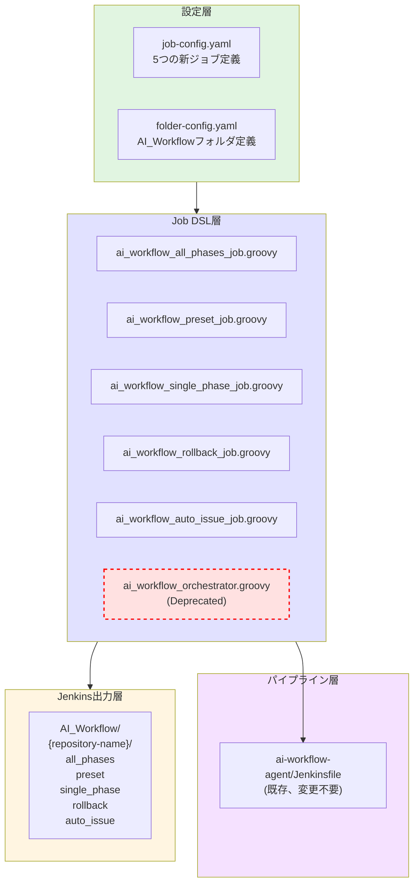
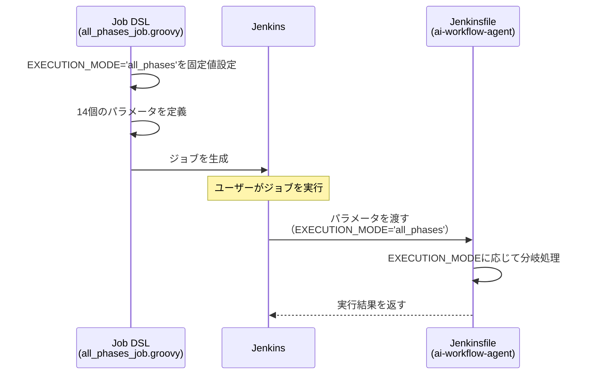
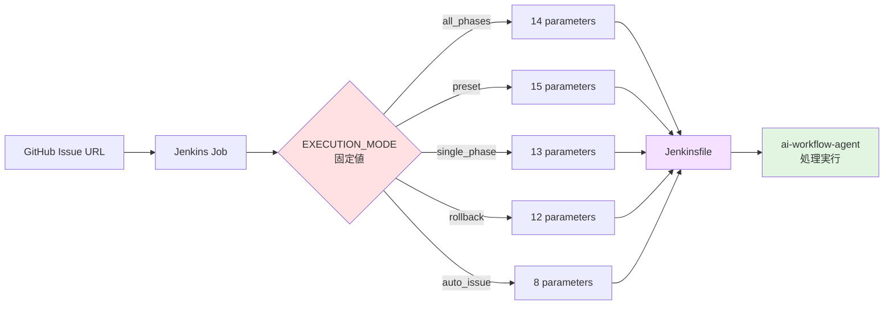

# 詳細設計書

**Issue**: #453
**タイトル**: [TASK] AI Workflow Orchestrator ジョブを実行モードごとに分割・リポジトリ別構成に変更
**作成日**: 2025-01-17
**URL**: https://github.com/tielec/infrastructure-as-code/issues/453

---

## 0. Planning/Requirements Documentの確認

### Planning Phase策定済み戦略

- **実装戦略**: REFACTOR（既存の単一ジョブを5つのジョブに分割）
- **テスト戦略**: INTEGRATION_ONLY（Jenkins環境での統合テストのみ）
- **テストコード戦略**: CREATE_TEST（手動テスト手順書を新規作成）
- **見積もり工数**: 8~12時間
- **リスク評価**: 中（既存ジョブの削除影響、パラメータロジックの複雑性）

本設計書は、Planning Phaseで策定された上記戦略に基づいて、実装可能な詳細設計を提供します。

---

## 1. アーキテクチャ設計

### 1.1 システム全体像



### 1.2 コンポーネント間の関係

#### Job DSL → Jenkinsfile のパラメータ受け渡し



#### リポジトリ別フォルダ構造の生成

```mermaid
graph LR
    A[job-config.yaml<br/>jenkins-managed-repositories] --> B[folders.groovy<br/>動的フォルダ生成]
    A --> C[Job DSL<br/>各ジョブ生成]
    B --> D[AI_Workflow/{repo}/]
    C --> E[AI_Workflow/{repo}/all_phases]
    C --> F[AI_Workflow/{repo}/preset]
    C --> G[AI_Workflow/{repo}/single_phase]
    C --> H[AI_Workflow/{repo}/rollback]
    C --> I[AI_Workflow/{repo}/auto_issue]

    style A fill:#e1f5e1
    style B fill:#e1e1ff
    style C fill:#e1e1ff
    style D fill:#fff5e1
    style E fill:#f5e1ff
    style F fill:#f5e1ff
    style G fill:#f5e1ff
    style H fill:#f5e1ff
    style I fill:#f5e1ff
```

### 1.3 データフロー



---

## 2. 実装戦略判断

### 実装戦略: REFACTOR

**判断根拠**:

1. **既存ファイルの分割**: 既存の`ai_workflow_orchestrator.groovy`を5つの独立したファイルに分割
2. **機能追加ではない**: 既存機能をそのまま維持し、パラメータを整理するリファクタリング
3. **既存パターンの適用**: `Code_Quality_Checker`と同じリポジトリ別構成パターンへの統一
4. **非推奨化**: 既存ジョブは削除せず、deprecated扱いとして残す（後方互換性維持）

**実装方針**:
- 新規ジョブの作成（5ファイル）
- job-config.yamlの更新
- folder-config.yamlの更新（動的フォルダ追加）
- 既存ジョブのdeprecated化（削除はしない）

---

## 3. テスト戦略判断

### テスト戦略: INTEGRATION_ONLY

**判断根拠**:

1. **ユニットテストの困難性**: Job DSLはGroovyコードだが、Jenkins環境依存のため単独でのユニットテストが困難
2. **統合テストの必要性**: 実際にJenkinsでジョブを生成し、パラメータが正しく表示されるかを確認する必要がある
3. **BDDの不要性**: ユーザーストーリーベースの機能追加ではなく、内部リファクタリングのため

**テスト方法**:
1. シードジョブ（`Admin_Jobs/job-creator`）を実行してジョブが正しく生成されることを確認
2. 各ジョブのパラメータ画面を確認（パラメータ数と内容が要件通りか）
3. 各ジョブを`DRY_RUN=true`で実行して動作確認

---

## 4. テストコード戦略判断

### テストコード戦略: CREATE_TEST

**判断根拠**:

1. **既存テストの不在**: `ai_workflow_orchestrator`に専用のテストコードは存在しない
2. **手動テスト手順書の作成**: Jenkins Job DSLの性質上、自動テストコードではなく手動テスト手順を記載
3. **テストドキュメント形式**: `jenkins/jobs/dsl/ai-workflow/TEST_PLAN.md`を新規作成

**テストドキュメント内容**:
- シードジョブ実行テスト手順
- 各ジョブのパラメータ検証手順
- 各実行モードの動作確認手順（DRY_RUN使用）

---

## 5. 影響範囲分析

### 5.1 既存コードへの影響

#### 変更が必要なファイル

| ファイルパス | 変更内容 | 影響度 |
|------------|---------|-------|
| `jenkins/jobs/pipeline/_seed/job-creator/job-config.yaml` | 5つの新ジョブ定義を追加 | 高 |
| `jenkins/jobs/pipeline/_seed/job-creator/folder-config.yaml` | AI_Workflowの動的フォルダルール追加 | 高 |
| `jenkins/jobs/dsl/ai-workflow/ai_workflow_orchestrator.groovy` | Deprecatedコメント追加 | 低 |
| `jenkins/README.md` | ジョブ一覧とパラメータ説明の更新 | 中 |

#### 新規作成が必要なファイル

| ファイルパス | 内容 |
|------------|------|
| `jenkins/jobs/dsl/ai-workflow/ai_workflow_all_phases_job.groovy` | all_phases実行モード用DSL |
| `jenkins/jobs/dsl/ai-workflow/ai_workflow_preset_job.groovy` | preset実行モード用DSL |
| `jenkins/jobs/dsl/ai-workflow/ai_workflow_single_phase_job.groovy` | single_phase実行モード用DSL |
| `jenkins/jobs/dsl/ai-workflow/ai_workflow_rollback_job.groovy` | rollback実行モード用DSL |
| `jenkins/jobs/dsl/ai-workflow/ai_workflow_auto_issue_job.groovy` | auto_issue実行モード用DSL |
| `jenkins/jobs/dsl/ai-workflow/TEST_PLAN.md` | 統合テスト手順書 |

### 5.2 依存関係の変更

#### 新規依存

- **なし**: 既存の依存関係をそのまま使用

#### 既存依存の変更

- **jenkinsManagedRepositories**: リポジトリ別フォルダ生成のために使用（job-config.yamlから取得）
- **folders.groovy**: AI_Workflowの動的フォルダ生成ロジックを追加

### 5.3 マイグレーション要否

**不要**: 以下の理由によりマイグレーションは不要

1. **データベーススキーマ変更なし**: Jenkinsの内部データ構造に変更なし
2. **既存ジョブの保持**: `ai_workflow_orchestrator`はdeprecated扱いで残すため、既存の実行履歴は保持される
3. **独立した新規ジョブ**: 新しいジョブは独立して作成されるため、既存ジョブへの影響なし

---

## 6. 変更・追加ファイルリスト

### 6.1 新規作成ファイル

```
jenkins/jobs/dsl/ai-workflow/
├── ai_workflow_all_phases_job.groovy         (新規)
├── ai_workflow_preset_job.groovy             (新規)
├── ai_workflow_single_phase_job.groovy       (新規)
├── ai_workflow_rollback_job.groovy           (新規)
├── ai_workflow_auto_issue_job.groovy         (新規)
└── TEST_PLAN.md                              (新規)
```

### 6.2 修正が必要な既存ファイル

```
jenkins/jobs/pipeline/_seed/job-creator/
├── job-config.yaml                           (修正: 5つの新ジョブ定義を追加)
└── folder-config.yaml                        (修正: 動的フォルダルール追加)

jenkins/jobs/dsl/ai-workflow/
└── ai_workflow_orchestrator.groovy           (修正: Deprecatedコメント追加)

jenkins/
└── README.md                                 (修正: ジョブ一覧更新)
```

### 6.3 削除が必要なファイル

**なし**: 既存ジョブは削除せず、deprecated扱いとして残す

---

## 7. 詳細設計

### 7.1 Job DSL設計

#### 7.1.1 共通設計パターン

全てのJob DSLファイルは、以下の共通パターンに従います：

```groovy
// 1. ヘッダーコメント（目的、パラメータ概要）
// 2. jenkinsManagedRepositories からリポジトリ情報を取得
// 3. 各リポジトリに対してジョブを生成（ループ処理）
//    a. ジョブ名の決定: AI_Workflow/{repository-name}/{job-name}
//    b. パラメータ定義（EXECUTION_MODEは固定値、表示しない）
//    c. パイプライン定義（ai-workflow-agentのJenkinsfileを参照）
//    d. ログローテーション設定
```

#### 7.1.2 ai_workflow_all_phases_job.groovy

```groovy
/**
 * AI Workflow All Phases Job DSL
 *
 * 全フェーズ一括実行用ジョブ（planning → evaluation）
 * EXECUTION_MODE: all_phases（固定値）
 * パラメータ数: 14個
 */

// リポジトリ情報を取得
def repositories = jenkinsManagedRepositories.collect { name, repo ->
    [
        name: name,
        url: repo.httpsUrl,
        credentialsId: repo.credentialsId
    ]
}

// 共通設定を取得
def jenkinsPipelineRepo = commonSettings['jenkins-pipeline-repo']
def jobKey = 'ai_workflow_all_phases_job'
def jobConfig = jenkinsJobsConfig[jobKey]

// 各リポジトリのジョブを作成
repositories.each { repo ->
    def jobName = "AI_Workflow/${repo.name}/${jobConfig.name}"

    pipelineJob(jobName) {
        displayName(jobConfig.displayName)

        description("""
            |# AI Workflow - All Phases Execution
            |
            |リポジトリ: ${repo.name}
            |
            |## 概要
            |全フェーズ（planning → evaluation）を順次実行します。
            |resume機能により、失敗したフェーズから再開可能です。
            |
            |## パラメータ
            |- ISSUE_URL（必須）: GitHub Issue URL
            |- DRY_RUN: ドライランモード（デフォルト: false）
            |- その他: 実行オプション、Git設定、AWS認証情報等
            |
            |## 注意事項
            |- EXECUTION_MODEは内部的に'all_phases'に固定されます
            |- コスト上限: デフォルト $5.00 USD
            """.stripMargin())

        // パラメータ定義
        parameters {
            // ========================================
            // 基本設定
            // ========================================
            stringParam('ISSUE_URL', '', '''
GitHub Issue URL（必須）

例: https://github.com/tielec/my-project/issues/123
注: Issue URL から対象リポジトリを自動判定します
            '''.stripIndent().trim())

            stringParam('BRANCH_NAME', '', '''
作業ブランチ名（任意）
空欄の場合は Issue 番号から自動生成されます
            '''.stripIndent().trim())

            choiceParam('AGENT_MODE', ['auto', 'codex', 'claude'], '''
エージェントの実行モード
- auto: Codex APIキーがあれば Codex を優先し、なければ Claude Code を使用
- codex: Codex のみを使用（CODEX_API_KEY または OPENAI_API_KEY が必要）
- claude: Claude Code のみを使用（credentials.json が必要）
            '''.stripIndent().trim())

            // ========================================
            // 実行オプション
            // ========================================
            booleanParam('DRY_RUN', false, '''
ドライランモード（API 呼び出しや Git 操作を行わず動作確認のみ実施）
            '''.stripIndent().trim())

            booleanParam('SKIP_REVIEW', false, '''
AI レビューをスキップする（検証・デバッグ用）
            '''.stripIndent().trim())

            booleanParam('FORCE_RESET', false, '''
メタデータを初期化して最初から実行する
            '''.stripIndent().trim())

            choiceParam('MAX_RETRIES', ['3', '1', '5', '10'], '''
フェーズ失敗時の最大リトライ回数
            '''.stripIndent().trim())

            booleanParam('CLEANUP_ON_COMPLETE_FORCE', false, '''
Evaluation Phase完了後にワークフローディレクトリを強制削除
詳細: Issue #2、v0.3.0で追加
            '''.stripIndent().trim())

            // ========================================
            // Git 設定
            // ========================================
            stringParam('GIT_COMMIT_USER_NAME', 'AI Workflow Bot', '''
Git コミットユーザー名
            '''.stripIndent().trim())

            stringParam('GIT_COMMIT_USER_EMAIL', 'ai-workflow@example.com', '''
Git コミットメールアドレス
            '''.stripIndent().trim())

            // ========================================
            // AWS 認証情報（Infrastructure as Code 用）
            // ========================================
            stringParam('AWS_ACCESS_KEY_ID', '', '''
AWS アクセスキー ID（任意）
Infrastructure as Code実行時に必要
            '''.stripIndent().trim())

            nonStoredPasswordParam('AWS_SECRET_ACCESS_KEY', '''
AWS シークレットアクセスキー（任意）
Infrastructure as Code実行時に必要
            '''.stripIndent().trim())

            nonStoredPasswordParam('AWS_SESSION_TOKEN', '''
AWS セッショントークン（任意）
一時的な認証情報を使用する場合
            '''.stripIndent().trim())

            // ========================================
            // その他
            // ========================================
            stringParam('COST_LIMIT_USD', '5.0', '''
ワークフローあたりのコスト上限（USD）
            '''.stripIndent().trim())

            choiceParam('LOG_LEVEL', ['INFO', 'DEBUG', 'WARNING', 'ERROR'], '''
ログレベル
- INFO: 一般的な情報
- DEBUG: 詳細ログ（デバッグ用）
- WARNING / ERROR: 警告 / エラーのみ
            '''.stripIndent().trim())
        }

        // ログローテーション
        logRotator {
            numToKeep(30)
            daysToKeep(90)
        }

        // パイプライン定義
        definition {
            cpsScm {
                scm {
                    git {
                        remote {
                            url('https://github.com/tielec/ai-workflow-agent.git')
                            credentials('github-token')
                        }
                        branch('*/main')
                    }
                }
                scriptPath('Jenkinsfile')
            }
        }

        // 環境変数（EXECUTION_MODEを固定値として設定）
        environmentVariables {
            env('EXECUTION_MODE', 'all_phases')
            env('WORKFLOW_VERSION', '0.2.0')
        }

        // プロパティ
        properties {
            disableConcurrentBuilds()
        }
    }
}
```

#### 7.1.3 ai_workflow_preset_job.groovy

**設計メモ**: all_phases_job.groovyと同様の構造ですが、以下の相違点があります：

- EXECUTION_MODE: `preset`（固定値）
- パラメータ数: 15個（PRESETパラメータを追加）
- PRESETパラメータ:
  ```groovy
  choiceParam('PRESET', ['quick-fix', 'implementation', 'testing', 'review-requirements', 'review-design', 'review-test-scenario', 'finalize'], '''
  プリセット（必須）

  - quick-fix: 軽微な修正用（Implementation → Documentation → Report）
  - implementation: 通常の実装フロー（Implementation → TestImplementation → Testing → Documentation → Report）
  - testing: テスト追加用（TestImplementation → Testing）
  - review-requirements: 要件定義レビュー用（Planning → Requirements）
  - review-design: 設計レビュー用（Planning → Requirements → Design）
  - review-test-scenario: テストシナリオレビュー用（Planning → Requirements → Design → TestScenario）
  - finalize: 最終化用（Documentation → Report → Evaluation）
  '''.stripIndent().trim())
  ```

#### 7.1.4 ai_workflow_single_phase_job.groovy

**設計メモ**: all_phases_job.groovyと同様の構造ですが、以下の相違点があります：

- EXECUTION_MODE: `single_phase`（固定値）
- パラメータ数: 13個
- 除外パラメータ: FORCE_RESET、CLEANUP_ON_COMPLETE_FORCE
- 追加パラメータ:
  ```groovy
  choiceParam('START_PHASE', ['planning', 'requirements', 'design', 'test_scenario', 'implementation', 'test_implementation', 'testing', 'documentation', 'report', 'evaluation'], '''
  開始フェーズ（必須）
  '''.stripIndent().trim())
  ```

#### 7.1.5 ai_workflow_rollback_job.groovy

**設計メモ**: all_phases_job.groovyと同様の構造ですが、以下の相違点があります：

- EXECUTION_MODE: `rollback`（固定値）
- パラメータ数: 12個
- 除外パラメータ: SKIP_REVIEW、FORCE_RESET、MAX_RETRIES、CLEANUP_ON_COMPLETE_FORCE
- 追加パラメータ:
  ```groovy
  choiceParam('ROLLBACK_TO_PHASE', ['implementation', 'planning', 'requirements', 'design', 'test_scenario', 'test_implementation', 'testing', 'documentation', 'report'], '''
  差し戻し先フェーズ（必須）

  差し戻したいフェーズを指定します。メタデータが更新され、指定されたフェーズから再実行可能になります。
  注: evaluation フェーズへの差し戻しはできません。
  '''.stripIndent().trim())

  choiceParam('ROLLBACK_TO_STEP', ['revise', 'execute', 'review'], '''
  差し戻し先ステップ（任意）

  デフォルトは revise です。
  - execute: フェーズの最初から再実行
  - review: レビューステップから再実行
  - revise: 修正ステップから再実行（差し戻し理由がプロンプトに注入されます）
  '''.stripIndent().trim())

  textParam('ROLLBACK_REASON', '', '''
  差し戻し理由（任意）

  差し戻しの理由を記述します。この内容は revise プロンプトに自動注入されます。
  空欄の場合、CI環境では差し戻しが実行されません（インタラクティブ入力が必要）。
  '''.stripIndent().trim())

  stringParam('ROLLBACK_REASON_FILE', '', '''
  差し戻し理由ファイルパス（任意）

  差し戻し理由を記述したファイルのパスを指定します。
  ROLLBACK_REASON と ROLLBACK_REASON_FILE の両方が指定された場合、ROLLBACK_REASON_FILE が優先されます。
  '''.stripIndent().trim())
  ```

#### 7.1.6 ai_workflow_auto_issue_job.groovy

**設計メモ**: all_phases_job.groovyと大きく異なる構造：

- EXECUTION_MODE: `auto_issue`（固定値）
- パラメータ数: 8個（最も少ない）
- 除外パラメータ: ISSUE_URL、BRANCH_NAME、SKIP_REVIEW、FORCE_RESET、MAX_RETRIES、CLEANUP_ON_COMPLETE_FORCE、GIT_COMMIT_*、AWS_*
- 必須パラメータ: GITHUB_REPOSITORY
- 追加パラメータ:
  ```groovy
  stringParam('GITHUB_REPOSITORY', '', '''
  GitHub リポジトリ（owner/repo）（必須）

  例: tielec/ai-workflow-agent
  '''.stripIndent().trim())

  choiceParam('AUTO_ISSUE_CATEGORY', ['bug', 'refactor', 'enhancement', 'all'], '''
  Issue検出カテゴリ

  - bug: バグ・潜在的問題の検出（Phase 1で実装済み）
  - refactor: リファクタリング候補の検出（Phase 2で実装予定）
  - enhancement: 機能拡張提案（Phase 3で実装予定）
  - all: 全カテゴリを検出
  '''.stripIndent().trim())

  stringParam('AUTO_ISSUE_LIMIT', '5', '''
  作成するIssueの最大数

  1〜50の範囲で指定してください。
  '''.stripIndent().trim())

  stringParam('AUTO_ISSUE_SIMILARITY_THRESHOLD', '0.8', '''
  重複判定の類似度閾値

  0.0〜1.0の範囲で指定してください。
  値が高いほど厳密に重複判定します（デフォルト: 0.8）。
  '''.stripIndent().trim())
  ```

### 7.2 job-config.yaml設計

```yaml
# jenkins/jobs/pipeline/_seed/job-creator/job-config.yaml

jenkins-jobs:
  # ... 既存のジョブ定義 ...

  # ========================================
  # AI Workflow Jobs（新規追加）
  # ========================================

  # All Phases Execution
  ai_workflow_all_phases_job:
    name: 'all_phases'
    displayName: 'All Phases Execution'
    dslfile: jenkins/jobs/dsl/ai-workflow/ai_workflow_all_phases_job.groovy
    jenkinsfile: Jenkinsfile  # ai-workflow-agentリポジトリのJenkinsfile

  # Preset Execution
  ai_workflow_preset_job:
    name: 'preset'
    displayName: 'Preset Execution'
    dslfile: jenkins/jobs/dsl/ai-workflow/ai_workflow_preset_job.groovy
    jenkinsfile: Jenkinsfile

  # Single Phase Execution
  ai_workflow_single_phase_job:
    name: 'single_phase'
    displayName: 'Single Phase Execution'
    dslfile: jenkins/jobs/dsl/ai-workflow/ai_workflow_single_phase_job.groovy
    jenkinsfile: Jenkinsfile

  # Rollback Execution
  ai_workflow_rollback_job:
    name: 'rollback'
    displayName: 'Rollback Execution'
    dslfile: jenkins/jobs/dsl/ai-workflow/ai_workflow_rollback_job.groovy
    jenkinsfile: Jenkinsfile

  # Auto Issue Creation
  ai_workflow_auto_issue_job:
    name: 'auto_issue'
    displayName: 'Auto Issue Creation'
    dslfile: jenkins/jobs/dsl/ai-workflow/ai_workflow_auto_issue_job.groovy
    jenkinsfile: Jenkinsfile

  # ========================================
  # Deprecated Job（既存、コメントアウトまたは削除）
  # ========================================
  # ai_workflow_orchestrator_job:
  #   name: 'ai_workflow_orchestrator'
  #   displayName: 'AI Workflow Orchestrator (Deprecated)'
  #   dslfile: jenkins/jobs/dsl/ai-workflow/ai_workflow_orchestrator.groovy
  #   jenkinsfile: jenkins/jobs/pipeline/ai-workflow/ai-workflow-orchestrator/Jenkinsfile
```

### 7.3 folder-config.yaml設計

```yaml
# jenkins/jobs/pipeline/_seed/job-creator/folder-config.yaml

folders:
  # ... 既存のフォルダ定義 ...

  # AI駆動開発フォルダ（既存、説明を更新）
  - path: "AI_Workflow"
    displayName: "50. [AI] AI駆動開発"
    description: |
      このフォルダーには、AI駆動開発自動化ワークフローのジョブが含まれています。

      ### 概要
      GitHub IssueからPR作成まで、Claude AIが自動的に開発プロセスを実行します。
      実行モードごとにジョブが分割され、リポジトリ別に整理されています。

      ### ジョブ構成
      各リポジトリ配下に以下のジョブが配置されます：
      * **all_phases** - 全フェーズ一括実行（planning → evaluation）
      * **preset** - プリセット実行（quick-fix, implementation等）
      * **single_phase** - 単一フェーズ実行
      * **rollback** - フェーズ差し戻し実行
      * **auto_issue** - AIによる自動Issue作成

      ### パラメータ削減効果
      実行モードごとの分割により、パラメータ数を24個 → 8〜15個に削減しました。

      ### 主な機能
      * **自動要件定義** - GitHub Issueから要件定義書を生成
      * **自動設計** - 詳細設計書とアーキテクチャドキュメントを生成
      * **自動テストシナリオ** - BDD形式のテストシナリオを生成
      * **自動実装** - コードの自動生成と既存コードの拡張
      * **自動テスト** - テストの実行と結果検証
      * **自動ドキュメント** - README、APIドキュメントを生成

      ### 必要な認証情報
      * **claude-api-key**: Claude API キー（Jenkinsクレデンシャル）
      * **github-token**: GitHub Token（Jenkinsクレデンシャル）

dynamic_folders:
  # ... 既存の動的フォルダルール ...

  # AI Workflowのリポジトリ別フォルダ（新規追加）
  - parent_path: "AI_Workflow"
    source: "jenkins-managed-repositories"
    template:
      path_suffix: "{name}"
      displayName: "AI Workflow - {name}"
      description: |
        {name}リポジトリのAI駆動開発ワークフロージョブ

        ### 提供ジョブ
        * **all_phases** - 全フェーズ一括実行（14パラメータ）
        * **preset** - プリセット実行（15パラメータ）
        * **single_phase** - 単一フェーズ実行（13パラメータ）
        * **rollback** - フェーズ差し戻し実行（12パラメータ）
        * **auto_issue** - 自動Issue作成（8パラメータ）

        ### 実行モード
        各ジョブは実行モードが固定されており、必要なパラメータのみを表示します。

        ### 推奨の使い方
        1. **通常の開発**: `preset` → `implementation`を選択
        2. **軽微な修正**: `preset` → `quick-fix`を選択
        3. **テストのみ追加**: `preset` → `testing`を選択
        4. **特定フェーズのみ**: `single_phase`でフェーズを指定
        5. **レビュー修正**: `rollback`で差し戻し先を指定
        6. **Issue探索**: `auto_issue`でバグや改善点を検出
```

### 7.4 既存ジョブのdeprecated化

```groovy
// jenkins/jobs/dsl/ai-workflow/ai_workflow_orchestrator.groovy

/**
 * ⚠️ DEPRECATED: このジョブは非推奨です
 *
 * 新しいジョブ構成に移行してください：
 * - AI_Workflow/{repository-name}/all_phases
 * - AI_Workflow/{repository-name}/preset
 * - AI_Workflow/{repository-name}/single_phase
 * - AI_Workflow/{repository-name}/rollback
 * - AI_Workflow/{repository-name}/auto_issue
 *
 * 削除予定日: 2025年2月17日（1ヶ月後）
 *
 * 移行ガイド: jenkins/README.md参照
 */

pipelineJob('AI_Workflow/ai_workflow_orchestrator') {
    description('''
⚠️ **このジョブは非推奨です** ⚠️

実行モードごとに分割された新しいジョブに移行してください：

**新しいジョブ**:
- AI_Workflow/{repository-name}/all_phases - 全フェーズ一括実行
- AI_Workflow/{repository-name}/preset - プリセット実行
- AI_Workflow/{repository-name}/single_phase - 単一フェーズ実行
- AI_Workflow/{repository-name}/rollback - フェーズ差し戻し
- AI_Workflow/{repository-name}/auto_issue - 自動Issue作成

**メリット**:
- パラメータ数が24個 → 8〜15個に削減
- リポジトリごとにジョブが整理
- 必要なパラメータのみ表示

**削除予定日**: 2025年2月17日

**移行方法**: jenkins/README.md の「AI_Workflowジョブの移行ガイド」を参照

---

# 旧ジョブ説明（以下、既存のまま）

AI駆動開発ワークフロー
...（既存の説明）
    '''.stripIndent())

    // ... 既存のパラメータ定義はそのまま ...
}
```

---

## 8. セキュリティ考慮事項

### 8.1 認証・認可

**既存の設計を継承**:
- GitHub認証: `github-token` クレデンシャルを使用（既存と同じ）
- AWS認証情報: `nonStoredPasswordParam`で安全に扱う（既存と同じ）

**新しいリスク**:
- **なし**: セキュリティ設計は既存ジョブと同等

### 8.2 データ保護

**機密情報の取り扱い**:
- AWS_SECRET_ACCESS_KEY: `nonStoredPasswordParam`使用（実行後にメモリから削除）
- AWS_SESSION_TOKEN: `nonStoredPasswordParam`使用
- API Key: Jenkinsfileで`withCredentials`経由で取得（Job DSLには記載しない）

### 8.3 セキュリティリスクと対策

| リスク | 影響度 | 対策 |
|--------|--------|------|
| パラメータの誤設定 | 低 | DSLファイルでのパラメータ型チェック |
| クレデンシャル漏洩 | 高 | `nonStoredPasswordParam`の使用、ログマスキング |
| 未承認の実行 | 中 | Jenkins権限設定（既存の設定を継承）|

---

## 9. 非機能要件への対応

### 9.1 パフォーマンス

**シードジョブ実行時間**:
- **目標**: 5分以内
- **根拠**: リポジトリ数が増えても（10リポジトリ = 50ジョブ）、合理的な時間で完了
- **対策**:
  - Job DSLの最適化（不要な処理の削減）
  - リポジトリループの効率化

**ジョブ実行時間**:
- **変更なし**: パラメータ整理のみで、実行時間に影響なし

### 9.2 スケーラビリティ

**リポジトリ数の拡大**:
- **現状**: 2リポジトリ（infrastructure-as-code、ai-workflow-agent）→ 10ジョブ
- **拡張**: 10リポジトリ → 50ジョブ（想定内）
- **設計**: 動的フォルダ生成により、リポジトリ追加時の手動作業なし

### 9.3 保守性

**コードの再利用性**:
- **共通パターン**: 5つのJob DSLファイルは共通構造に従う
- **変数化**: パラメータ定義は共通変数から取得可能（将来の拡張）

**ドキュメント**:
- **DSLファイル**: ヘッダーコメントで目的と概要を記載
- **README.md**: 各ジョブの使用方法を詳細に記載

---

## 10. 実装の順序

実装は以下の順序で進めることを推奨します：

### Phase 1: 設計完了と承認（0.5h）
1. ✅ 本設計書のレビューと承認
2. ✅ 品質ゲートの確認

### Phase 2: 基盤整備（1h）
1. folder-config.yamlの更新（動的フォルダルール追加）
2. folders.groovyの動作確認（動的フォルダが生成されるか）

### Phase 3: Job DSL実装（4〜5h）
1. ai_workflow_all_phases_job.groovyの作成
2. ai_workflow_preset_job.groovyの作成
3. ai_workflow_single_phase_job.groovyの作成
4. ai_workflow_rollback_job.groovyの作成
5. ai_workflow_auto_issue_job.groovyの作成

### Phase 4: 設定ファイル更新（1h）
1. job-config.yamlの更新（5つの新ジョブ定義を追加）
2. ai_workflow_orchestrator.groovyのdeprecated化

### Phase 5: テスト手順書作成（0.5h）
1. TEST_PLAN.mdの作成

### Phase 6: 統合テスト（1〜2h）
1. シードジョブ実行テスト
2. パラメータ画面確認
3. DRY_RUN実行テスト

### Phase 7: ドキュメント更新（1h）
1. jenkins/README.mdの更新（ジョブ一覧、パラメータ表、移行ガイド）

**総見積もり時間**: 8〜10時間（Planning Documentの見積もり8〜12時間内）

---

## 11. 品質ゲート確認

### Phase 2品質ゲート（必須要件）

- [x] **実装戦略の判断根拠が明記されている**: セクション2で明記（REFACTOR、既存ファイル分割）
- [x] **テスト戦略の判断根拠が明記されている**: セクション3で明記（INTEGRATION_ONLY、Jenkins環境依存）
- [x] **テストコード戦略の判断根拠が明記されている**: セクション4で明記（CREATE_TEST、手動テスト手順書）
- [x] **既存コードへの影響範囲が分析されている**: セクション5で詳細分析（変更ファイル、新規ファイル、依存関係）
- [x] **変更が必要なファイルがリストアップされている**: セクション6でリスト化（新規作成、修正、削除）
- [x] **設計が実装可能である**: セクション7で実装可能なコードスニペット提供

**判定**: ✅ 全ての品質ゲートをクリア

---

## 12. リスクと軽減策

### リスク1: パラメータ定義の不一致

**影響度**: 高
**確率**: 中
**軽減策**:
1. Issue本文のパラメータ対応表を厳密に遵守
2. 各Job DSLファイルのヘッダーコメントにパラメータ数を明記
3. TEST_PLAN.mdでパラメータ数を検証

### リスク2: リポジトリ動的生成の失敗

**影響度**: 高
**確率**: 低
**軽減策**:
1. `code_quality_pr_complexity_analyzer_job.groovy`を参考に実装
2. シードジョブ実行前に構文チェック
3. dev環境で先行テスト

### リスク3: 既存ジョブの削除による影響

**影響度**: 中
**確率**: 低
**軽減策**:
1. 既存ジョブは削除せず、deprecated扱いで残す
2. README.mdで移行ガイドを提供
3. 1ヶ月の移行期間を設ける

---

## 13. 成功基準

このプロジェクトは以下の条件を満たした場合に成功とみなされます：

### 機能要件
- [ ] 5つのジョブ（all_phases、preset、single_phase、rollback、auto_issue）が正しく生成される
- [ ] 各ジョブのパラメータがIssue本文の対応表通りに実装されている
- [ ] リポジトリ別フォルダ構造（AI_Workflow/{repository-name}/各ジョブ）が実現されている
- [ ] 各ジョブがEXECUTION_MODEを固定値として正しく渡している

### 非機能要件
- [ ] シードジョブ実行時にエラーが発生しない
- [ ] 既存の`ai_workflow_orchestrator`ジョブへの影響がない（deprecated扱い）
- [ ] ドキュメント（README.md）が更新されている
- [ ] テスト手順（TEST_PLAN.md）が整備されている

### 品質要件
- [ ] すべての品質ゲートをパスしている
- [ ] 5つのジョブすべてでDRY_RUN実行が成功している
- [ ] コードレビューで承認されている

---

## 14. 付録

### 14.1 パラメータ対応表（再掲）

| パラメータ | all_phases | preset | single_phase | rollback | auto_issue |
|-----------|:----------:|:------:|:------------:|:--------:|:----------:|
| **基本設定** | | | | | |
| ISSUE_URL | ✅ 必須 | ✅ 必須 | ✅ 必須 | ✅ 必須 | ❌ 不要 |
| GITHUB_REPOSITORY | ❌ | ❌ | ❌ | ❌ | ✅ 必須 |
| BRANCH_NAME | ⚪ 任意 | ⚪ 任意 | ⚪ 任意 | ⚪ 任意 | ❌ 不要 |
| AGENT_MODE | ✅ | ✅ | ✅ | ✅ | ✅ |
| **実行制御** | | | | | |
| ~~EXECUTION_MODE~~ | 固定値 | 固定値 | 固定値 | 固定値 | 固定値 |
| PRESET | ❌ | ✅ 必須 | ❌ | ❌ | ❌ |
| START_PHASE | ❌ | ❌ | ✅ 必須 | ❌ | ❌ |
| **Rollback設定** | | | | | |
| ROLLBACK_TO_PHASE | ❌ | ❌ | ❌ | ✅ 必須 | ❌ |
| ROLLBACK_TO_STEP | ❌ | ❌ | ❌ | ⚪ 任意 | ❌ |
| ROLLBACK_REASON | ❌ | ❌ | ❌ | ⚪ 任意 | ❌ |
| ROLLBACK_REASON_FILE | ❌ | ❌ | ❌ | ⚪ 任意 | ❌ |
| **Auto Issue設定** | | | | | |
| AUTO_ISSUE_CATEGORY | ❌ | ❌ | ❌ | ❌ | ✅ |
| AUTO_ISSUE_LIMIT | ❌ | ❌ | ❌ | ❌ | ⚪ 任意 |
| AUTO_ISSUE_SIMILARITY_THRESHOLD | ❌ | ❌ | ❌ | ❌ | ⚪ 任意 |
| **実行オプション** | | | | | |
| DRY_RUN | ✅ | ✅ | ✅ | ✅ | ✅ |
| SKIP_REVIEW | ✅ | ✅ | ✅ | ❌ | ❌ |
| FORCE_RESET | ✅ | ✅ | ❌ | ❌ | ❌ |
| MAX_RETRIES | ✅ | ✅ | ✅ | ❌ | ❌ |
| CLEANUP_ON_COMPLETE_FORCE | ✅ | ✅ | ❌ | ❌ | ❌ |
| **Git設定** | | | | | |
| GIT_COMMIT_USER_NAME | ✅ | ✅ | ✅ | ✅ | ❌ |
| GIT_COMMIT_USER_EMAIL | ✅ | ✅ | ✅ | ✅ | ❌ |
| **AWS認証情報** | | | | | |
| AWS_ACCESS_KEY_ID | ⚪ 任意 | ⚪ 任意 | ⚪ 任意 | ⚪ 任意 | ❌ |
| AWS_SECRET_ACCESS_KEY | ⚪ 任意 | ⚪ 任意 | ⚪ 任意 | ⚪ 任意 | ❌ |
| AWS_SESSION_TOKEN | ⚪ 任意 | ⚪ 任意 | ⚪ 任意 | ⚪ 任意 | ❌ |
| **その他** | | | | | |
| COST_LIMIT_USD | ✅ | ✅ | ✅ | ✅ | ✅ |
| LOG_LEVEL | ✅ | ✅ | ✅ | ✅ | ✅ |

### 14.2 参考ファイルパス

**既存実装**:
- `jenkins/jobs/dsl/ai-workflow/ai_workflow_orchestrator.groovy`
- `jenkins/jobs/dsl/code-quality-checker/code_quality_pr_complexity_analyzer_job.groovy`

**設定ファイル**:
- `jenkins/jobs/pipeline/_seed/job-creator/job-config.yaml`
- `jenkins/jobs/pipeline/_seed/job-creator/folder-config.yaml`

**ドキュメント**:
- `jenkins/README.md`
- `jenkins/CONTRIBUTION.md`
- `CLAUDE.md`

---

**設計書作成者**: AI Workflow Agent
**レビュー待ち**: Phase 2 (Design) Review
