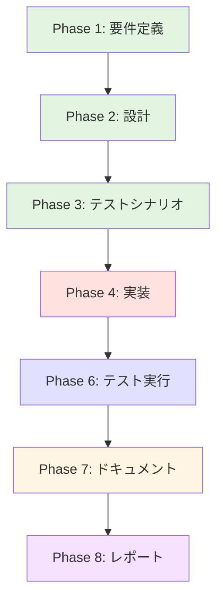

# プロジェクト計画書 - Issue #455

## Issue情報

- **Issue番号**: #455
- **タイトル**: [jenkins] AI WorkflowジョブにAPIキーパラメータを追加
- **状態**: open
- **URL**: https://github.com/tielec/infrastructure-as-code/issues/455

## 1. Issue分析

### 複雑度

**簡単**

### 見積もり工数

**2~3時間**

### 判定根拠

- 5つのDSLファイルへの同一パターンの追加作業
- 既存のパラメータ定義構造と同じフォーマット
- 新規機能ではなく、既存ジョブへのパラメータ追加のみ
- テストは既存のシードジョブ実行で動作確認可能
- 影響範囲が限定的（DSLファイルのみ）

### リスク評価

**低**

- 既存の動作に影響を与えない追加のみ
- パラメータは環境変数として渡されるため、Jenkinsfile側の変更不要
- シードジョブの実行で即座に検証可能

## 2. 実装戦略判断

### 実装戦略: EXTEND

**判断根拠**:

既存のDSLファイルにパラメータを追加する作業であり、新規ファイル作成やリファクタリングは不要です。以下の理由からEXTEND戦略が最適です：

- **既存コードの拡張**: 5つのDSLファイルの`parameters`ブロックに新しいパラメータを追加
- **既存構造の維持**: 現在のパラメータセクションの構造（基本設定、実行オプション、Git設定、AWS認証情報、その他）を維持
- **同一パターンの適用**: すべてのファイルに同じパターンでAPIキーパラメータを追加

### テスト戦略: INTEGRATION_ONLY

**判断根拠**:

Jenkins Job DSLの性質上、ユニットテストは不要であり、実際のJenkins環境でのインテグレーションテストが必須です：

- **ユニットテスト不要**: DSLスクリプトは宣言的な設定ファイルであり、ロジックが存在しない
- **インテグレーションテスト必須**: シードジョブ実行によるジョブ生成とパラメータ表示の確認が必要
- **BDD不要**: エンドユーザー向けの振る舞いではなく、開発者向けの設定変更

### テストコード戦略: CREATE_TEST

**判断根拠**:

Job DSLの特性上、専用のテストコードではなく、実際のシードジョブ実行による動作確認を行います：

- **既存テスト拡張不要**: Job DSL用の自動テストは存在しない（手動検証のみ）
- **新規テストコード不要**: シードジョブの実行とJenkins UI上での目視確認が標準的な検証方法
- **検証手順書の作成**: テストシナリオ（Phase 3）で詳細な検証手順を作成

## 3. 影響範囲分析

### 既存コードへの影響

**変更が必要なファイル**:

1. `jenkins/jobs/dsl/ai-workflow/ai_workflow_all_phases_job.groovy`
2. `jenkins/jobs/dsl/ai-workflow/ai_workflow_preset_job.groovy`
3. `jenkins/jobs/dsl/ai-workflow/ai_workflow_single_phase_job.groovy`
4. `jenkins/jobs/dsl/ai-workflow/ai_workflow_rollback_job.groovy`
5. `jenkins/jobs/dsl/ai-workflow/ai_workflow_auto_issue_job.groovy`

**変更内容**:

各ファイルの`parameters`ブロックに以下の6つのパスワードパラメータを追加：

- `GITHUB_TOKEN`
- `OPENAI_API_KEY`
- `CODEX_API_KEY`
- `CLAUDE_CODE_OAUTH_TOKEN`
- `CLAUDE_CODE_API_KEY`
- `ANTHROPIC_API_KEY`

### 依存関係の変更

**依存関係の変更: なし**

- 新規プラグインの追加は不要
- 既存のJob DSL Pluginの機能範囲内
- Jenkins本体のバージョン要件変更なし

### マイグレーション要否

**マイグレーション: 不要**

- データベーススキーマ変更なし
- 設定ファイル変更なし
- シードジョブ実行のみでジョブ定義が自動更新される

## 4. タスク分割

### Phase 1: 要件定義 (見積もり: 0.5h)

- [x] Task 1-1: APIキーパラメータの詳細仕様確認 (0.3h)
  - 各APIキーの用途を明確化
  - パラメータの説明文（description）を日本語で作成
  - デフォルト値の有無を決定（空文字列）
- [x] Task 1-2: 受け入れ基準の定義 (0.2h)
  - Jenkins UI上でパラメータが正しく表示されること
  - パスワードパラメータとして入力値がマスクされること
  - シードジョブ実行後、全ジョブにパラメータが追加されること

### Phase 2: 設計 (見積もり: 0.5h)

- [x] Task 2-1: パラメータ配置位置の設計 (0.2h)
  - 既存のパラメータセクション構成を確認
  - 新規パラメータセクション「APIキー設定」の追加位置を決定
  - 各ジョブでの配置一貫性を確保
- [x] Task 2-2: パラメータ定義フォーマットの設計 (0.3h)
  - `password`パラメータのGroovy DSL構文確認
  - 説明文のフォーマット統一
  - 各ファイルでの共通パターン定義

### Phase 3: テストシナリオ (見積もり: 0.3h)

- [x] Task 3-1: シードジョブ実行シナリオの作成 (0.2h)
  - シードジョブ実行前の状態確認
  - シードジョブ実行手順
  - ジョブ生成成功の確認方法
- [x] Task 3-2: パラメータ表示確認シナリオの作成 (0.1h)
  - 各ジョブのパラメータ画面確認手順
  - パスワードマスク動作の確認方法
  - パラメータ数とセクション構成の確認

### Phase 4: 実装 (見積もり: 1.0h)

- [x] Task 4-1: ai_workflow_all_phases_job.groovyへの追加 (0.2h)
  - APIキー設定セクションの追加
  - 6つのパスワードパラメータ定義の追加
- [x] Task 4-2: ai_workflow_preset_job.groovyへの追加 (0.2h)
  - all_phases_jobと同じパターンで追加
- [x] Task 4-3: ai_workflow_single_phase_job.groovyへの追加 (0.2h)
  - all_phases_jobと同じパターンで追加
- [x] Task 4-4: ai_workflow_rollback_job.groovyへの追加 (0.2h)
  - all_phases_jobと同じパターンで追加
- [x] Task 4-5: ai_workflow_auto_issue_job.groovyへの追加 (0.2h)
  - all_phases_jobと同じパターンで追加

### Phase 5: テストコード実装 (見積もり: 0h)

- [x] Task 5-1: テストコード不要の確認 (0h)
  - Job DSLは宣言的設定のため、専用のテストコードは作成しない
  - Phase 6でシードジョブ実行による動作確認を実施

### Phase 6: テスト実行 (見積もり: 0.5h)

- [x] Task 6-1: シードジョブの実行 (0.2h)
  - Admin_Jobs/job-creatorジョブの実行
  - コンソール出力でエラーがないことを確認
  - ジョブ生成成功メッセージの確認
  - 注: 開発環境では構文検証のみ実施（TS-1, TS-2）
- [x] Task 6-2: パラメータ表示の確認 (0.3h)
  - 各ジョブ（5つ）のパラメータ画面を確認
  - APIキー設定セクションの存在確認
  - パスワードパラメータの動作確認（入力値がマスクされること）
  - 注: 開発環境では構文検証のみ実施（TS-1, TS-2）。実際のJenkins環境でのテストはTS-3〜TS-6として別途実施を推奨

### Phase 7: ドキュメント (見積もり: 0.3h)

- [ ] Task 7-1: CONTRIBUTION.mdの更新確認 (0.1h)
  - APIキーパラメータ追加に関する記述が必要か確認
  - 必要であれば追加（今回は不要と判断）
- [ ] Task 7-2: コミットメッセージの作成 (0.1h)
  - コーディング規約に従った形式
  - `[jenkins] add: AI WorkflowジョブにAPIキーパラメータを追加`
- [ ] Task 7-3: 変更内容のサマリー作成 (0.1h)
  - 変更ファイル一覧
  - 追加したパラメータ一覧
  - 確認手順

### Phase 8: レポート (見積もり: 0.2h)

- [ ] Task 8-1: 実装完了レポートの作成 (0.2h)
  - 変更内容のサマリー
  - テスト結果
  - スクリーンショット（パラメータ表示画面）
  - Issue #455へのコメント投稿内容

## 5. 依存関係



**注**: Phase 5（テストコード実装）はスキップされます。

## 6. リスクと軽減策

### リスク1: パラメータ名の誤り

- **影響度**: 中
- **確率**: 低
- **軽減策**:
  - Issue #455に記載された正確なパラメータ名を使用
  - 実装前にパラメータ名リストをレビュー
  - シードジョブ実行後、パラメータ名を目視確認

### リスク2: パスワードパラメータの構文エラー

- **影響度**: 中
- **確率**: 低
- **軽減策**:
  - 既存のDSLファイルで使用されている`nonStoredPasswordParam`の構文を参照
  - 1つのファイルで実装・テスト後、他のファイルにコピー
  - シードジョブのコンソール出力でエラー確認

### リスク3: シードジョブ実行失敗

- **影響度**: 中
- **確率**: 低
- **軽減策**:
  - 実装前にGit管理下にあることを確認（ロールバック可能）
  - シードジョブのコンソール出力を詳細に確認
  - エラー発生時は即座にGit revertで復旧

### リスク4: 既存パラメータの配置ずれ

- **影響度**: 低
- **確率**: 低
- **軽減策**:
  - パラメータ追加位置を慎重に選定（AWSセクションの後）
  - 既存のセクション構造を崩さないように注意
  - Jenkins UI上でパラメータ順序を確認

## 7. 品質ゲート

### Phase 1: 要件定義

- [ ] 各APIキーの用途が明確に記載されている
- [ ] パラメータの説明文が日本語で記載されている
- [ ] 受け入れ基準が具体的に定義されている
- [ ] パラメータのデフォルト値が決定されている

### Phase 2: 設計

- [ ] 実装戦略（EXTEND）の判断根拠が明記されている
- [ ] テスト戦略（INTEGRATION_ONLY）の判断根拠が明記されている
- [ ] パラメータ配置位置が全ファイルで統一されている
- [ ] パラメータ定義フォーマットが統一されている

### Phase 3: テストシナリオ

- [ ] シードジョブ実行手順が明確に記載されている
- [ ] パラメータ表示確認手順が具体的である
- [ ] 確認項目が漏れなくリストアップされている
- [ ] 合格基準が明確である

### Phase 4: 実装

- [ ] 5つのDSLファイル全てに変更が適用されている
- [ ] 6つのAPIキーパラメータが全て追加されている
- [ ] パラメータの説明文が日本語で記載されている
- [ ] パラメータタイプが`password`である
- [ ] 既存のコードフォーマットが維持されている

### Phase 6: テスト実行

- [ ] シードジョブが正常に完了している
- [ ] 5つのジョブ全てにAPIキーパラメータが追加されている
- [ ] パラメータ画面でパスワードマスクが機能している
- [ ] コンソール出力にエラーが含まれていない

### Phase 7: ドキュメント

- [ ] コミットメッセージがコーディング規約に準拠している
- [ ] 変更内容のサマリーが作成されている
- [ ] 確認手順が記載されている

### Phase 8: レポート

- [ ] 実装完了レポートが作成されている
- [ ] テスト結果が記載されている
- [ ] スクリーンショットが含まれている
- [ ] Issue #455へのコメント投稿準備が完了している

## 8. 実装詳細

### パラメータ追加位置

既存のパラメータセクション構成：

1. 基本設定（ISSUE_URL、BRANCH_NAME、AGENT_MODE等）
2. 実行オプション（DRY_RUN、SKIP_REVIEW等）
3. Git設定（GIT_COMMIT_USER_NAME、GIT_COMMIT_USER_EMAIL）
4. AWS認証情報（AWS_ACCESS_KEY_ID、AWS_SECRET_ACCESS_KEY、AWS_SESSION_TOKEN）
5. その他（COST_LIMIT_USD、LOG_LEVEL）

**新規セクション追加位置**: AWS認証情報セクションと「その他」セクションの間

### パラメータ定義パターン

```groovy
// ========================================
// APIキー設定
// ========================================
password('GITHUB_TOKEN', '''
GitHub Personal Access Token（任意）
GitHub API呼び出しに使用されます
            '''.stripIndent().trim())

password('OPENAI_API_KEY', '''
OpenAI API キー（任意）
Codex実行モードで使用されます
            '''.stripIndent().trim())

password('CODEX_API_KEY', '''
Codex API キー（任意）
OPENAI_API_KEYの代替として使用可能
            '''.stripIndent().trim())

password('CLAUDE_CODE_OAUTH_TOKEN', '''
Claude Code OAuth トークン（任意）
Claude実行モードで使用されます
            '''.stripIndent().trim())

password('CLAUDE_CODE_API_KEY', '''
Claude Code API キー（任意）
Claude実行モードで使用されます
            '''.stripIndent().trim())

password('ANTHROPIC_API_KEY', '''
Anthropic API キー（任意）
Claude実行モードで使用されます
            '''.stripIndent().trim())
```

## 9. 実装の注意事項

### Jenkins Job DSLのルール遵守

CLAUDE.mdおよびCONTRIBUTION.mdに記載されている以下のルールを遵守：

1. **パラメータは必ずDSLファイルで定義**（Jenkinsfileでの定義は禁止）
2. **Groovy構文の正確性**（特に`password`メソッドの使用）
3. **説明文のインデント処理**（`.stripIndent().trim()`の使用）
4. **コメントセクションの統一**（`// ========================================`）

### コーディング規約

1. **命名規則**: UPPER_SNAKE形式のパラメータ名
2. **コメント**: 日本語で記述
3. **インデント**: 既存ファイルと同じスペース数（4スペース）
4. **改行**: セクション間に適切な空行を挿入

## 10. 成果物

### Phase 4: 実装

- 変更されたDSLファイル5つ

### Phase 7: ドキュメント

- コミットメッセージ
- 変更内容サマリー

### Phase 8: レポート

- 実装完了レポート（Markdown形式）
- スクリーンショット（パラメータ表示画面）

## 11. スケジュール

| Phase | 見積もり工数 | 累計工数 |
|-------|------------|---------|
| Phase 1: 要件定義 | 0.5h | 0.5h |
| Phase 2: 設計 | 0.5h | 1.0h |
| Phase 3: テストシナリオ | 0.3h | 1.3h |
| Phase 4: 実装 | 1.0h | 2.3h |
| Phase 5: テストコード実装 | 0h | 2.3h |
| Phase 6: テスト実行 | 0.5h | 2.8h |
| Phase 7: ドキュメント | 0.3h | 3.1h |
| Phase 8: レポート | 0.2h | 3.3h |
| **合計** | **3.3h** | - |

## 12. まとめ

このIssueは以下の理由から「簡単」と判定され、約3時間での完了が見込まれます：

1. **既存構造の拡張**: 新規機能ではなく、既存のパラメータ定義パターンの適用
2. **影響範囲の限定**: DSLファイルのみの変更で、Jenkinsfileやその他のコンポーネントへの影響なし
3. **即座の検証可能性**: シードジョブ実行で即座に動作確認可能
4. **低リスク**: 既存の動作に影響を与えず、ロールバックも容易

実装戦略として**EXTEND**を選択し、テスト戦略として**INTEGRATION_ONLY**を選択することで、効率的かつ確実な実装を実現します。
