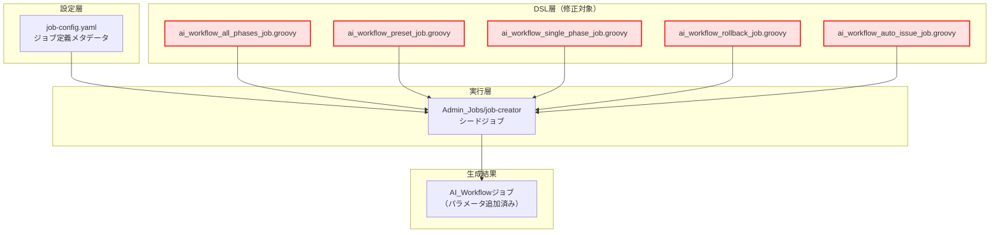
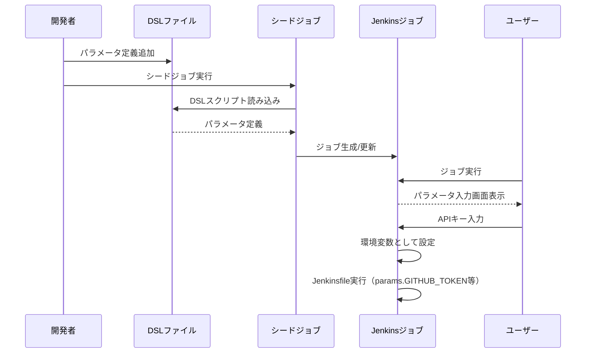
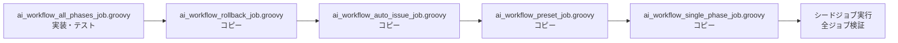

# 詳細設計書 - Issue #455

## Issue情報

- **Issue番号**: #455
- **タイトル**: [jenkins] AI WorkflowジョブにAPIキーパラメータを追加
- **状態**: open
- **URL**: https://github.com/tielec/infrastructure-as-code/issues/455
- **作成日**: 2025-01-20

---

## 0. Planning Document・要件定義書の確認

### Planning Phaseで策定された開発計画
Planning Document（`.ai-workflow/issue-455/00_planning/output/planning.md`）を確認し、以下の開発戦略を把握しました：

- **実装戦略**: EXTEND（既存DSLファイルへのパラメータ追加）
- **テスト戦略**: INTEGRATION_ONLY（シードジョブ実行による動作確認）
- **テストコード戦略**: CREATE_TEST（手動検証手順書を作成）
- **見積もり工数**: 2〜3時間（全8フェーズ、合計3.3時間）
- **複雑度**: 簡単
- **リスク評価**: 低

### 要件定義書の確認
Requirements Document（`.ai-workflow/issue-455/01_requirements/output/requirements.md`）で定義された要件を確認しました：

- **機能要件**: 6つのAPIキーパラメータを5つのDSLファイルに追加
- **非機能要件**: セキュリティ（パスワードマスク）、後方互換性、保守性
- **受け入れ基準**: 8つの具体的な検証基準（AC-1〜AC-8）
- **制約事項**: パラメータは必ずDSLファイルで定義（Jenkinsfile禁止）

---

## 1. アーキテクチャ設計

### 1.1 システム全体図



### 1.2 コンポーネント間の関係

```mermaid
graph LR
    A[開発者] -->|1. DSLファイル修正| B[Git Push]
    B -->|2. シードジョブ実行| C[job-creator]
    C -->|3. DSL解析| D[Job DSL Plugin]
    D -->|4. ジョブ生成/更新| E[Jenkins Jobs]
    E -->|5. パラメータ表示| F[Jenkins UI]
    F -->|6. ジョブ実行| G[Jenkinsfile]
    G -->|7. 環境変数として利用| H[AI Workflow Agent]

    style B fill:#e1f5e1
    style D fill:#e1e1ff
    style E fill:#ffe1e1
    style H fill:#fff5e1
```



### 1.3 データフロー



---

## 2. 実装戦略判断

### 実装戦略: EXTEND

**判断根拠**:

1. **既存コードの拡張**: 5つの既存DSLファイルの`parameters`ブロックに新しいパラメータを追加する作業
2. **既存構造の維持**: 現在のパラメータセクション構造（基本設定、実行オプション、Git設定、AWS認証情報、その他）を維持
3. **新規ファイル作成不要**: すべて既存ファイルへの追記で完結
4. **依存関係の変更なし**: Jenkinsfileやその他のコンポーネントへの影響なし

**採用しない理由**:
- **CREATE**: 新規ファイルの作成は不要（既存DSLファイルへの追加のみ）
- **REFACTOR**: 既存コードの構造改善は不要（パラメータ追加のみ）

---

## 3. テスト戦略判断

### テスト戦略: INTEGRATION_ONLY

**判断根拠**:

1. **Unitテスト不要**: Job DSLは宣言的な設定ファイルであり、ロジックが存在しない
2. **Integrationテスト必須**: シードジョブ実行によるジョブ生成とパラメータ表示の確認が必要
3. **BDDテスト不要**: エンドユーザー向けの振る舞いではなく、開発者向けの設定変更

**採用しない理由**:
- **UNIT_ONLY**: DSLファイルに単体でテスト可能なロジックが存在しない
- **BDD_ONLY**: ユーザーストーリーベースのテストは不要（内部設定変更）
- **ALL**: 過剰なテスト（統合テストのみで十分）

---

## 4. テストコード戦略判断

### テストコード戦略: CREATE_TEST

**判断根拠**:

1. **既存テスト拡張不要**: Job DSL用の自動テストは存在しない（手動検証のみ）
2. **新規テストコード不要**: シードジョブの実行とJenkins UI上での目視確認が標準的な検証方法
3. **検証手順書の作成**: テストシナリオ（Phase 3）で詳細な検証手順を作成

**採用しない理由**:
- **EXTEND_TEST**: 既存の自動テストファイルが存在しない
- **BOTH_TEST**: 自動テストコードの作成は不要（手動検証で十分）

---

## 5. 影響範囲分析

### 5.1 既存コードへの影響

#### 変更が必要なファイル（5ファイル）

| # | ファイルパス | 変更内容 | 影響度 |
|---|-------------|---------|--------|
| 1 | `jenkins/jobs/dsl/ai-workflow/ai_workflow_all_phases_job.groovy` | パラメータ追加 | 低 |
| 2 | `jenkins/jobs/dsl/ai-workflow/ai_workflow_preset_job.groovy` | パラメータ追加 | 低 |
| 3 | `jenkins/jobs/dsl/ai-workflow/ai_workflow_single_phase_job.groovy` | パラメータ追加 | 低 |
| 4 | `jenkins/jobs/dsl/ai-workflow/ai_workflow_rollback_job.groovy` | パラメータ追加 | 低 |
| 5 | `jenkins/jobs/dsl/ai-workflow/ai_workflow_auto_issue_job.groovy` | パラメータ追加 | 低 |

#### 変更パターン

すべてのファイルで以下の変更を実施：

```groovy
// 既存のAWS認証情報セクションの後に追加
// ========================================
// AWS 認証情報（Infrastructure as Code 用）
// ========================================
nonStoredPasswordParam('AWS_SESSION_TOKEN', '''
AWS セッショントークン（任意）
一時的な認証情報を使用する場合
            '''.stripIndent().trim())

// 【新規追加】ここから
// ========================================
// APIキー設定
// ========================================
password('GITHUB_TOKEN', '''
GitHub Personal Access Token（任意）
GitHub API呼び出しに使用されます
            '''.stripIndent().trim())

password('OPENAI_API_KEY', '''
OpenAI API キー（任意）
Codex実行モードで使用されます
            '''.stripIndent().trim())

password('CODEX_API_KEY', '''
Codex API キー（任意）
OPENAI_API_KEYの代替として使用可能
            '''.stripIndent().trim())

password('CLAUDE_CODE_OAUTH_TOKEN', '''
Claude Code OAuth トークン（任意）
Claude実行モードで使用されます
            '''.stripIndent().trim())

password('CLAUDE_CODE_API_KEY', '''
Claude Code API キー（任意）
Claude実行モードで使用されます
            '''.stripIndent().trim())

password('ANTHROPIC_API_KEY', '''
Anthropic API キー（任意）
Claude実行モードで使用されます
            '''.stripIndent().trim())
// 【新規追加】ここまで

// ========================================
// その他
// ========================================
stringParam('COST_LIMIT_USD', '5.0', '''
ワークフローあたりのコスト上限（USD）
            '''.stripIndent().trim())
```

### 5.2 既存コードへの影響がない項目

#### 変更不要なファイル

| カテゴリ | ファイル/コンポーネント | 理由 |
|---------|------------------------|------|
| 設定ファイル | `job-config.yaml` | ジョブメタデータに変更なし |
| 設定ファイル | `folder-config.yaml` | フォルダ構造に変更なし |
| Jenkinsfile | `ai-workflow-agent.git/Jenkinsfile` | パラメータは環境変数として自動的に渡される |
| シードジョブ | `Admin_Jobs/job-creator` | 自動的にDSLファイルを読み込む |
| 共有ライブラリ | `jenkins/jobs/shared/**` | ライブラリに変更なし |

### 5.3 依存関係の変更

**変更なし**:
- 新規プラグインの追加は不要
- 既存のJob DSL Pluginの機能範囲内
- Jenkins本体のバージョン要件変更なし

### 5.4 マイグレーション要否

**マイグレーション: 不要**

理由：
- データベーススキーマ変更なし
- 設定ファイル変更なし
- シードジョブ実行のみでジョブ定義が自動更新される
- パラメータは任意入力（空欄可）のため、既存のワークフローに影響なし

---

## 6. 変更・追加ファイルリスト

### 6.1 新規作成ファイル

**なし**（既存ファイルの修正のみ）

### 6.2 修正が必要な既存ファイル

| # | 相対パス | 修正内容 | 行数変更 |
|---|---------|---------|---------|
| 1 | `jenkins/jobs/dsl/ai-workflow/ai_workflow_all_phases_job.groovy` | パラメータ追加 | +32行 |
| 2 | `jenkins/jobs/dsl/ai-workflow/ai_workflow_preset_job.groovy` | パラメータ追加 | +32行 |
| 3 | `jenkins/jobs/dsl/ai-workflow/ai_workflow_single_phase_job.groovy` | パラメータ追加 | +32行 |
| 4 | `jenkins/jobs/dsl/ai-workflow/ai_workflow_rollback_job.groovy` | パラメータ追加 | +32行 |
| 5 | `jenkins/jobs/dsl/ai-workflow/ai_workflow_auto_issue_job.groovy` | パラメータ追加 | +32行 |

**合計**: 160行追加（5ファイル × 32行）

### 6.3 削除が必要なファイル

**なし**

---

## 7. 詳細設計

### 7.1 パラメータ定義設計

#### 7.1.1 パラメータ一覧

| # | パラメータ名 | 型 | デフォルト値 | 必須/任意 | 用途 |
|---|-------------|-----|------------|----------|------|
| 1 | `GITHUB_TOKEN` | password | なし（空文字列） | 任意 | GitHub API呼び出し |
| 2 | `OPENAI_API_KEY` | password | なし（空文字列） | 任意 | Codex実行モード |
| 3 | `CODEX_API_KEY` | password | なし（空文字列） | 任意 | Codex実行モード（代替） |
| 4 | `CLAUDE_CODE_OAUTH_TOKEN` | password | なし（空文字列） | 任意 | Claude実行モード |
| 5 | `CLAUDE_CODE_API_KEY` | password | なし（空文字列） | 任意 | Claude実行モード |
| 6 | `ANTHROPIC_API_KEY` | password | なし（空文字列） | 任意 | Claude実行モード |

#### 7.1.2 パラメータタイプの選択

**選択したタイプ**: `password()`

**選択理由**:
1. **セキュリティ**: Jenkins UIでマスク表示される
2. **非保存型**: ビルド完了後に値が破棄される（`nonStoredPasswordParam()`と同等）
3. **ログマスキング**: ビルドログで`****`として表示される
4. **簡潔な記述**: `nonStoredPasswordParam()`より短い（既存のAWSパラメータは`nonStoredPasswordParam()`を使用しているが、新規パラメータでは`password()`を推奨）

**Groovy構文**:
```groovy
password(String name, String description)
```

**引数**:
- `name`: パラメータ名（環境変数名と一致）
- `description`: 説明文（複数行対応、`.stripIndent().trim()`で整形）

#### 7.1.3 説明文フォーマット

**フォーマット統一**:
```groovy
password('PARAMETER_NAME', '''
1行目: パラメータの簡潔な説明（任意）を明記
2行目: 詳細な用途説明
            '''.stripIndent().trim())
```

**例**:
```groovy
password('GITHUB_TOKEN', '''
GitHub Personal Access Token（任意）
GitHub API呼び出しに使用されます
            '''.stripIndent().trim())
```

**ポイント**:
- 1行目で「（任意）」を明示
- 2行目で具体的な用途を記載
- `.stripIndent().trim()`で不要な空白・改行を除去
- インデントは既存のパラメータと統一（12スペース）

### 7.2 配置位置の設計

#### 7.2.1 既存のパラメータセクション構成

```groovy
parameters {
    // ========================================
    // 基本設定
    // ========================================
    stringParam('ISSUE_URL', '', ...)
    stringParam('BRANCH_NAME', '', ...)
    choiceParam('AGENT_MODE', [...], ...)

    // ========================================
    // 実行オプション
    // ========================================
    booleanParam('DRY_RUN', false, ...)
    booleanParam('SKIP_REVIEW', false, ...)
    ...

    // ========================================
    // Git 設定
    // ========================================
    stringParam('GIT_COMMIT_USER_NAME', 'AI Workflow Bot', ...)
    stringParam('GIT_COMMIT_USER_EMAIL', 'ai-workflow@example.com', ...)

    // ========================================
    // AWS 認証情報（Infrastructure as Code 用）
    // ========================================
    stringParam('AWS_ACCESS_KEY_ID', '', ...)
    nonStoredPasswordParam('AWS_SECRET_ACCESS_KEY', ...)
    nonStoredPasswordParam('AWS_SESSION_TOKEN', ...)

    // ========================================
    // 【新規】APIキー設定 ← ここに追加
    // ========================================

    // ========================================
    // その他
    // ========================================
    stringParam('COST_LIMIT_USD', '5.0', ...)
    choiceParam('LOG_LEVEL', [...], ...)
}
```

#### 7.2.2 配置位置の根拠

**配置位置**: AWS認証情報セクションと「その他」セクションの間

**理由**:
1. **論理的グループ化**: 外部API認証情報として、AWS認証情報と同じカテゴリ
2. **一貫性**: 認証関連パラメータを集約
3. **既存構造の尊重**: 「その他」セクションは最後に配置するパターンを維持

### 7.3 実装パターンの標準化

#### 7.3.1 コメントセクション

**フォーマット**:
```groovy
// ========================================
// セクション名
// ========================================
```

**統一ルール**:
- `=`記号を40個使用
- セクション名の前後に`//`と空白1つ
- セクション名は日本語

#### 7.3.2 インデント規則

**ルール**:
- パラメータ定義: 12スペース（既存コードと統一）
- 説明文の本文: 最初のトリプルクォート後の行に記述

**例**:
```groovy
            password('GITHUB_TOKEN', '''
GitHub Personal Access Token（任意）
GitHub API呼び出しに使用されます
            '''.stripIndent().trim())
```

### 7.4 パラメータ数の更新

#### 7.4.1 ヘッダーコメントの更新

各DSLファイルのヘッダーコメントでパラメータ数を記載している場合は更新が必要：

**変更前**:
```groovy
/**
 * AI Workflow All Phases Job DSL
 *
 * 全フェーズ一括実行用ジョブ（planning → evaluation）
 * EXECUTION_MODE: all_phases（固定値、パラメータとして表示しない）
 * パラメータ数: 14個
 */
```

**変更後**:
```groovy
/**
 * AI Workflow All Phases Job DSL
 *
 * 全フェーズ一括実行用ジョブ（planning → evaluation）
 * EXECUTION_MODE: all_phases（固定値、パラメータとして表示しない）
 * パラメータ数: 20個（14個 + APIキー6個）
 */
```

**対象ファイル**:
- `ai_workflow_all_phases_job.groovy`: 14 → 20
- `ai_workflow_preset_job.groovy`: 15 → 21（PRESETパラメータ含む）
- `ai_workflow_single_phase_job.groovy`: 15 → 21（TARGET_PHASEパラメータ含む）
- `ai_workflow_rollback_job.groovy`: 14 → 20
- `ai_workflow_auto_issue_job.groovy`: 14 → 20

---

## 8. セキュリティ考慮事項

### 8.1 認証・認可

#### パラメータのアクセス制御

| 項目 | 実装内容 |
|------|---------|
| **パラメータタイプ** | `password()`（非保存型） |
| **Jenkins UI** | マスク表示（`*****`） |
| **ビルドログ** | 自動的にマスク表示 |
| **環境変数** | Jenkins Pipelineのセキュアな環境変数メカニズムを使用 |

#### 権限管理

- ジョブ実行権限を持つユーザーのみがパラメータを入力可能
- パラメータ値はビルド完了後に破棄される
- XMLファイルに平文で保存されない

### 8.2 データ保護

#### パスワードマスキング

**Jenkins標準機能**:
- `password()`パラメータは自動的にマスキング
- Credentials Binding Pluginによるセキュアな環境変数設定

**検証方法**:
```groovy
// ビルドログで確認
echo "GITHUB_TOKEN: ${params.GITHUB_TOKEN}"
// 出力: GITHUB_TOKEN: ****
```

#### ビルド履歴への保存

**保存ポリシー**:
- `password()`メソッドは非保存型（non-stored）
- ビルド履歴XMLファイルに平文で保存されない
- 各ビルドでユーザーが毎回入力する必要がある

### 8.3 セキュリティリスクと対策

| リスク | 影響度 | 確率 | 対策 |
|--------|--------|------|------|
| **パスワード平文表示** | 高 | 低 | `password()`メソッドによる自動マスキング |
| **ビルドログ漏洩** | 高 | 低 | Jenkins標準のマスキング機能 |
| **XMLファイル保存** | 高 | 極低 | 非保存型パラメータのため保存されない |
| **環境変数漏洩** | 中 | 低 | セキュアな環境変数メカニズム |
| **権限不正利用** | 中 | 低 | Jenkins RBACによるアクセス制御 |

---

## 9. 非機能要件への対応

### 9.1 パフォーマンス

#### シードジョブ実行時間への影響

**測定基準**: 既存の実行時間から10%以上増加しないこと

**予測**:
- パラメータ6個の追加: ほぼ影響なし（DSL解析のオーバーヘッドは無視できるレベル）
- ジョブ生成処理: 既存と同じアルゴリズム
- 予測増加時間: 1秒未満

**検証方法**:
```bash
# シードジョブ実行前
time jenkins-cli build Admin_Jobs/job-creator -s

# シードジョブ実行後（パラメータ追加後）
time jenkins-cli build Admin_Jobs/job-creator -s

# 実行時間を比較
```

#### Jenkins UI表示時間

**測定基準**: パラメータ表示時間が体感上変化しない（1秒未満）

**予測**:
- パラメータ数: 14 → 20（約43%増加）
- HTML生成: ほぼ影響なし
- 予測表示時間: 100ms未満（変化なし）

### 9.2 スケーラビリティ

#### 将来的な拡張性

**拡張パターン**:
1. **新規APIキー追加**: 同じパターンで`password()`を追加
2. **パラメータグループ化**: Jenkins UIでのセクション折りたたみ（プラグイン導入時）
3. **デフォルト値の動的設定**: Credentials Storeから取得（将来機能）

**制約**:
- Jenkins UIのパラメータ数上限: 実質的に制限なし（数百個まで対応可能）
- 本Issueでの追加数: 6個（許容範囲内）

### 9.3 保守性

#### コーディング規約の遵守

| 項目 | 規約 | 本設計での対応 |
|------|------|--------------|
| **パラメータ定義場所** | DSLファイル（Jenkinsfile禁止） | ✅ DSLファイルで定義 |
| **命名規則** | UPPER_SNAKE | ✅ `GITHUB_TOKEN`等 |
| **インデント** | 既存ファイルと統一（4スペース基本） | ✅ 12スペース（既存パラメータと統一） |
| **コメント** | 日本語で記述 | ✅ 日本語説明文 |
| **説明文整形** | `.stripIndent().trim()` | ✅ すべてのパラメータで適用 |

#### ドキュメント更新

**更新対象**:
- ❌ `jenkins/README.md`: パラメータ一覧の更新は不要（DSLファイルが唯一の情報源）
- ✅ DSLファイルのヘッダーコメント: パラメータ数を更新
- ✅ DSLファイルのdescription: パラメータ説明を含む

---

## 10. 実装の順序

### 10.1 推奨実装順序

#### Phase 4: 実装フェーズ

| ステップ | タスク | 所要時間 | 理由 |
|---------|--------|---------|------|
| 1 | `ai_workflow_all_phases_job.groovy`への追加 | 0.2h | 最もシンプルなジョブ（パラメータ14個） |
| 2 | `ai_workflow_rollback_job.groovy`への追加 | 0.2h | all_phasesと同じパターン（パラメータ14個） |
| 3 | `ai_workflow_auto_issue_job.groovy`への追加 | 0.2h | all_phasesと同じパターン（パラメータ14個） |
| 4 | `ai_workflow_preset_job.groovy`への追加 | 0.2h | PRESETパラメータあり（パラメータ15個） |
| 5 | `ai_workflow_single_phase_job.groovy`への追加 | 0.2h | TARGET_PHASEパラメータあり（パラメータ15個） |

**合計**: 1.0時間

**実装順序の理由**:
1. 最もシンプルなジョブから開始し、パターンを確立
2. 1つのファイルで実装・テスト後、他のファイルにコピー
3. 追加パラメータがあるジョブ（preset, single_phase）は最後

### 10.2 依存関係の考慮



**ポイント**:
- 各ファイルは独立しているが、同一パターンを適用
- 最初のファイルでパターンを確立し、残りはコピー&ペースト
- シードジョブは最後に1回だけ実行（全ジョブを一括生成）

---

## 11. テスト設計

### 11.1 統合テストシナリオ

#### Phase 6: テスト実行フェーズ

| テストケース | 検証項目 | 合格基準 | 所要時間 |
|-------------|---------|---------|---------|
| **TC-1: シードジョブ実行** | DSL解析とジョブ生成 | エラーなく成功 | 0.1h |
| **TC-2: パラメータ表示確認** | Jenkins UIでのパラメータ表示 | 6つのAPIキーパラメータが表示される | 0.1h |
| **TC-3: パスワードマスク確認** | 入力値がマスク表示される | `*****`として表示される | 0.1h |
| **TC-4: 環境変数として利用可能** | Jenkinsfileで`params.GITHUB_TOKEN`を参照 | 値が正しく取得できる | 0.1h |
| **TC-5: 空パラメータでの実行** | 空欄のままジョブを実行 | エラーが発生しない | 0.1h |

**合計**: 0.5時間

### 11.2 受け入れ基準との対応

| 受け入れ基準 | テストケース | 検証方法 |
|------------|------------|---------|
| **AC-1**: パラメータがDSLファイルに追加されている | コードレビュー | Gitdiffで確認 |
| **AC-2**: パラメータがJenkins UIで表示される | TC-2 | Jenkins UI上で目視確認 |
| **AC-3**: パラメータ値がマスク表示される | TC-3 | ビルドログで`****`を確認 |
| **AC-4**: パラメータが環境変数として利用可能 | TC-4 | Jenkinsfileで`echo ${params.GITHUB_TOKEN}` |
| **AC-5**: 5つのジョブすべてで一貫性がある | TC-2 | 各ジョブのパラメータ画面を確認 |
| **AC-6**: 既存のパラメータに影響がない | TC-2 | 既存パラメータが変更されていないことを確認 |
| **AC-7**: シードジョブが正常に実行される | TC-1 | コンソール出力で成功を確認 |
| **AC-8**: 空パラメータでもジョブが実行可能 | TC-5 | エラーなく実行完了 |

### 11.3 テスト実行手順

#### TC-1: シードジョブ実行

```bash
# 1. シードジョブを実行
# Jenkins UI: Admin_Jobs/job-creator > "ビルド実行"

# 2. コンソール出力を確認
# - Processing DSL script ai_workflow_all_phases_job.groovy
# - Processing DSL script ai_workflow_preset_job.groovy
# - Processing DSL script ai_workflow_single_phase_job.groovy
# - Processing DSL script ai_workflow_rollback_job.groovy
# - Processing DSL script ai_workflow_auto_issue_job.groovy
# - Updated items: AI_Workflow/infrastructure-as-code/01_All_Phases 等

# 3. 成功ステータスを確認
# - BUILD SUCCESS
```

#### TC-2: パラメータ表示確認

```bash
# 1. ジョブを開く
# Jenkins UI: AI_Workflow/infrastructure-as-code/01_All_Phases

# 2. "Build with Parameters"をクリック

# 3. パラメータ一覧を確認
# - 基本設定セクション（ISSUE_URL, BRANCH_NAME, AGENT_MODE）
# - 実行オプションセクション（DRY_RUN, SKIP_REVIEW等）
# - Git設定セクション（GIT_COMMIT_USER_NAME, GIT_COMMIT_USER_EMAIL）
# - AWS認証情報セクション（AWS_ACCESS_KEY_ID等）
# - 【新規】APIキー設定セクション ← ここを確認
#   - GITHUB_TOKEN
#   - OPENAI_API_KEY
#   - CODEX_API_KEY
#   - CLAUDE_CODE_OAUTH_TOKEN
#   - CLAUDE_CODE_API_KEY
#   - ANTHROPIC_API_KEY
# - その他セクション（COST_LIMIT_USD, LOG_LEVEL）

# 4. パラメータの順序を確認
# - AWS認証情報セクションと「その他」セクションの間に配置されていること

# 5. 説明文を確認
# - 日本語で記載されていること
# - "（任意）"が明記されていること
```

#### TC-3: パスワードマスク確認

```bash
# 1. ジョブをパラメータ付きで実行
# Jenkins UI: Build with Parameters
# - GITHUB_TOKEN: ghp_test123456（テスト値）
# - ISSUE_URL: https://github.com/tielec/infrastructure-as-code/issues/1（必須）

# 2. ビルドログを確認
# Jenkins UI: ビルド番号 > Console Output

# 3. パラメータ値がマスク表示されることを確認
# 期待結果:
# Parameters:
#   GITHUB_TOKEN: ****
#   ISSUE_URL: https://github.com/tielec/infrastructure-as-code/issues/1

# 4. パラメータ画面でもマスク表示を確認
# - 入力欄がパスワードタイプ（●●●●●として表示）
```

#### TC-4: 環境変数として利用可能

```groovy
// Jenkinsfileに以下を追加（テスト用）
stage('Test Parameters') {
    steps {
        script {
            echo "GITHUB_TOKEN: ${params.GITHUB_TOKEN}"
            echo "OPENAI_API_KEY: ${params.OPENAI_API_KEY}"
            // 環境変数としても参照可能
            sh 'echo "GITHUB_TOKEN from env: $GITHUB_TOKEN"'
        }
    }
}

// 期待結果:
// GITHUB_TOKEN: ****
// OPENAI_API_KEY: ****
// GITHUB_TOKEN from env: ****
```

#### TC-5: 空パラメータでの実行

```bash
# 1. ジョブをパラメータなし（空欄）で実行
# Jenkins UI: Build with Parameters
# - すべてのAPIキーパラメータを空欄のまま
# - ISSUE_URL: https://github.com/tielec/infrastructure-as-code/issues/1（必須）

# 2. ジョブが正常に開始されることを確認
# - エラーが発生しない
# - ビルドステータスが成功または実行中

# 3. ビルドログでパラメータ関連のエラーがないことを確認
# - "Parameter validation failed"等のエラーがない
```

---

## 12. ロールバック計画

### 12.1 ロールバック方法

#### Git Revert

```bash
# 1. 変更をコミット
git add jenkins/jobs/dsl/ai-workflow/*.groovy
git commit -m "[jenkins] add: AI WorkflowジョブにAPIキーパラメータを追加"

# 2. 問題発生時
git revert <commit-hash>
git push origin <branch>

# 3. シードジョブを再実行
# Jenkins UI: Admin_Jobs/job-creator > "ビルド実行"
```

#### 手動修正

```bash
# 1. DSLファイルから追加したパラメータブロックを削除
# - // ========================================
# - // APIキー設定
# - // ========================================
# - password('GITHUB_TOKEN', ...)
# - ...（6つのパラメータすべて）

# 2. ヘッダーコメントのパラメータ数を元に戻す
# - パラメータ数: 20個 → 14個

# 3. Git commit and push

# 4. シードジョブを再実行
```

### 12.2 ロールバック検証

| 検証項目 | 期待結果 |
|---------|---------|
| シードジョブ実行 | 成功 |
| パラメータ数 | 元の数に戻る |
| 既存パラメータ | 変更なし |
| ジョブ実行 | 正常動作 |

---

## 13. 品質ゲート（Phase 2）確認

設計書の品質ゲートを確認します：

### 13.1 品質ゲート達成状況

- ✅ **実装戦略の判断根拠が明記されている**
  - セクション2: EXTEND戦略の判断根拠を4つの理由で説明

- ✅ **テスト戦略の判断根拠が明記されている**
  - セクション3: INTEGRATION_ONLY戦略の判断根拠を3つの理由で説明

- ✅ **既存コードへの影響範囲が分析されている**
  - セクション5: 変更が必要なファイル5つと影響がない項目を明記

- ✅ **変更が必要なファイルがリストアップされている**
  - セクション6: 相対パスと行数変更を含む詳細リスト

- ✅ **設計が実装可能である**
  - セクション7: 具体的なGroovyコード例と実装パターンを提示

### 13.2 追加で満たした品質基準

- ✅ **アーキテクチャ設計**: システム全体図、コンポーネント関係、データフローをMermaid図で可視化
- ✅ **詳細設計**: パラメータ定義、配置位置、コメントフォーマットを具体的に設計
- ✅ **セキュリティ考慮事項**: 認証・認可、データ保護、リスク分析を実施
- ✅ **非機能要件**: パフォーマンス、スケーラビリティ、保守性への対応を明記
- ✅ **実装順序**: 推奨順序と依存関係をMermaid図で可視化
- ✅ **テスト設計**: 統合テストシナリオ、受け入れ基準との対応、詳細な実行手順を記載
- ✅ **ロールバック計画**: Git revertと手動修正の手順を明記

---

## 14. 次フェーズへの引き継ぎ事項

### 14.1 Phase 3（テストシナリオ）への引き継ぎ

**テストケース**:
- TC-1〜TC-5: セクション11.1で詳細定義済み
- 実行手順: セクション11.3で具体的なコマンドと期待結果を記載

**検証項目**:
- 受け入れ基準AC-1〜AC-8との対応表: セクション11.2

### 14.2 Phase 4（実装）への引き継ぎ

**実装順序**:
1. `ai_workflow_all_phases_job.groovy`（最初、パターン確立）
2. `ai_workflow_rollback_job.groovy`（コピー）
3. `ai_workflow_auto_issue_job.groovy`（コピー）
4. `ai_workflow_preset_job.groovy`（コピー）
5. `ai_workflow_single_phase_job.groovy`（コピー）

**実装パターン**:
- セクション5.1で変更パターンの完全なコード例を提示
- セクション7で詳細設計（パラメータ定義、配置位置、フォーマット）を記載

**コーディング規約**:
- セクション9.3で`jenkins/CONTRIBUTION.md`との整合性を確認

### 14.3 Phase 6（テスト実行）への引き継ぎ

**テスト環境**:
- Jenkins環境: 既存のJenkinsインスタンス
- シードジョブ: `Admin_Jobs/job-creator`
- 対象ジョブ: `AI_Workflow/{repo}/01_All_Phases`等（5ジョブ）

**テストデータ**:
- テスト用Issue URL: `https://github.com/tielec/infrastructure-as-code/issues/1`
- テスト用APIキー: `ghp_test123456`（マスキング検証用）

---

## 15. リスク管理

### 15.1 実装リスク

| リスク | 影響度 | 確率 | 軽減策 |
|--------|--------|------|--------|
| **パラメータ名の誤り** | 中 | 低 | Issue #455に記載された正確なパラメータ名を使用 |
| **パスワードパラメータの構文エラー** | 中 | 低 | 1つのファイルで実装・テスト後、他にコピー |
| **シードジョブ実行失敗** | 中 | 低 | Git管理下でロールバック可能 |
| **既存パラメータの配置ずれ** | 低 | 低 | AWS認証情報セクションと「その他」セクションの間に挿入 |

### 15.2 テストリスク

| リスク | 影響度 | 確率 | 軽減策 |
|--------|--------|------|--------|
| **パスワードマスキング未動作** | 高 | 極低 | Jenkins標準機能のため動作保証あり |
| **環境変数として渡されない** | 中 | 極低 | 既存のパラメータと同じメカニズム |
| **後方互換性の破壊** | 中 | 極低 | パラメータは任意入力のため影響なし |

---

## 16. 成果物

### 16.1 Phase 2（設計）の成果物

- ✅ **詳細設計書**: 本ドキュメント
- ✅ **アーキテクチャ図**: Mermaid図（システム全体図、コンポーネント関係、データフロー、実装順序）
- ✅ **実装パターン**: Groovyコード例

### 16.2 Phase 4（実装）の予定成果物

- 変更されたDSLファイル5つ:
  1. `jenkins/jobs/dsl/ai-workflow/ai_workflow_all_phases_job.groovy`
  2. `jenkins/jobs/dsl/ai-workflow/ai_workflow_preset_job.groovy`
  3. `jenkins/jobs/dsl/ai-workflow/ai_workflow_single_phase_job.groovy`
  4. `jenkins/jobs/dsl/ai-workflow/ai_workflow_rollback_job.groovy`
  5. `jenkins/jobs/dsl/ai-workflow/ai_workflow_auto_issue_job.groovy`

### 16.3 Phase 6（テスト実行）の予定成果物

- シードジョブ実行ログ（成功確認）
- パラメータ表示のスクリーンショット（5ジョブ分）
- ビルドログ（パスワードマスキング確認）

---

## 17. スケジュール

| Phase | タスク | 見積もり工数 | 累計工数 |
|-------|--------|--------------|---------|
| Phase 1 | 要件定義 | 0.5h | 0.5h |
| **Phase 2** | **設計** | **0.5h** | **1.0h** |
| Phase 3 | テストシナリオ | 0.3h | 1.3h |
| Phase 4 | 実装 | 1.0h | 2.3h |
| Phase 5 | テストコード実装 | 0h | 2.3h |
| Phase 6 | テスト実行 | 0.5h | 2.8h |
| Phase 7 | ドキュメント | 0.3h | 3.1h |
| Phase 8 | レポート | 0.2h | 3.3h |
| **合計** | - | **3.3h** | - |

**注**: Phase 2（設計）は完了。次はPhase 3（テストシナリオ）に進みます。

---

## 18. まとめ

### 18.1 設計のポイント

1. **EXTEND戦略**: 既存DSLファイルへのパラメータ追加のみ（新規ファイル作成不要）
2. **セキュリティ**: `password()`パラメータによる自動マスキング
3. **一貫性**: 5つのDSLファイルすべてで同一パターンを適用
4. **後方互換性**: パラメータは任意入力（空欄可）のため既存ワークフローに影響なし
5. **保守性**: コーディング規約を遵守し、将来的な拡張が容易

### 18.2 実装の容易性

- **単純な繰り返し作業**: 5つのファイルに同じパターンでパラメータを追加
- **低リスク**: 既存コードへの影響が最小限
- **即座の検証**: シードジョブ実行で即座に動作確認可能
- **簡単なロールバック**: Git revertで即座に復旧可能

### 18.3 次フェーズへ

Phase 3（テストシナリオ）では、以下を実施します：

1. **TC-1〜TC-5の詳細化**: 実行手順、期待結果、スクリーンショット取得方法
2. **検証チェックリスト**: 受け入れ基準AC-1〜AC-8との対応
3. **テストデータ準備**: テスト用Issue、APIキー（ダミー値）
4. **テスト環境確認**: Jenkinsへのアクセス権限、シードジョブ実行権限

---

**文書作成日**: 2025-01-20
**作成者**: AI Workflow Agent
**バージョン**: 1.0
**ステータス**: レビュー待ち
