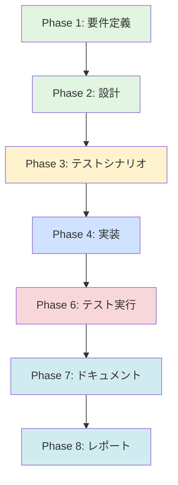

# プロジェクト計画書 - Issue #456

**作成日**: 2025年1月17日
**Issue番号**: #456
**タイトル**: [jenkins] AI Workflow用の汎用フォルダを追加
**Issue URL**: https://github.com/tielec/infrastructure-as-code/issues/456

---

## 1. Issue分析

### 複雑度判定

**複雑度**: 簡単

**判定根拠**:
- 既存のフォルダ構造定義に新しいフォルダ定義を追加するだけ
- 既存のDSLスクリプト（`folders.groovy`）は変更不要
- 既存の動的フォルダ生成メカニズムを再利用
- 新規ファイル作成やアーキテクチャ変更は不要

### 見積もり工数

**総工数**: 3~4時間

**内訳**:
- Phase 1（要件定義）: 0.5時間
- Phase 2（設計）: 0.5時間
- Phase 3（テストシナリオ）: 0.5時間
- Phase 4（実装）: 1~1.5時間
- Phase 5（テストコード実装）: スキップ（DSL定義のため不要）
- Phase 6（テスト実行）: 0.5時間
- Phase 7（ドキュメント）: 0.5時間
- Phase 8（レポート）: 0.5時間

**見積もり根拠**:
- 単一のYAMLファイル修正のみ（`folder-config.yaml`）
- 既存の動的フォルダ生成パターンを踏襲
- 複雑なロジックや条件分岐なし
- シードジョブ実行で即座に反映可能

### リスク評価

**リスクレベル**: 低

**理由**:
- 既存の動作を変更せず、追加のみ
- 影響範囲が限定的（フォルダ構造のみ）
- ロールバックが容易（YAMLファイルを元に戻すだけ）
- 既存ジョブへの影響なし

---

## 2. 実装戦略判断

### 実装戦略: EXTEND

**判断根拠**:
- **新規ファイル作成は不要**: 既存の`folder-config.yaml`に定義を追加
- **既存コード拡張が中心**: 静的フォルダ定義リストに3つのフォルダを追加
- **構造改善は不要**: 既存の動的フォルダ生成パターンを使用しない（汎用フォルダは静的定義）

本タスクは、既存のフォルダ定義リストに新しいエントリを追加する「機能拡張」であり、EXTENDが最適です。

### テスト戦略: INTEGRATION_ONLY

**判断根拠**:
- **ユニットテスト不要**: ロジックが存在しない（YAML定義のみ）
- **インテグレーションテスト必須**: シードジョブ実行による実環境確認が必要
  - Jenkins UIでフォルダが正しく作成されるか確認
  - フォルダの階層構造が正しいか確認
  - displayNameとdescriptionが正しく設定されるか確認
- **BDDテスト不要**: エンドユーザー向けのビジネスロジックではない

シードジョブを実行してJenkins上で実際にフォルダが作成されることを確認するインテグレーションテストのみで十分です。

### テストコード戦略: なし

**判断根拠**:
- **YAML定義のため自動テスト不要**: Job DSLがYAML定義を読み込んで処理するため、テストコードは不要
- **手動確認で十分**: Jenkins UIでフォルダ作成結果を目視確認
- **既存テストの拡張も不要**: フォルダ定義のテストコードは存在しない

本タスクはテストコードの作成が不要なため、「なし」と判断します。

---

## 3. 影響範囲分析

### 既存コードへの影響

**変更が必要なファイル**:
1. `jenkins/jobs/pipeline/_seed/job-creator/folder-config.yaml`
   - 静的フォルダ定義リスト（`folders`）に3つのフォルダを追加

**変更不要なファイル**:
- `jenkins/jobs/dsl/folders.groovy` - 既存のロジックで対応可能
- 既存のDSLファイル（`ai_workflow_*.groovy`等） - フォルダ追加のみで影響なし

### 依存関係の変更

**新規依存の追加**: なし

**既存依存の変更**: なし

**依存関係**:
- シードジョブ（`Admin_Jobs/job-creator`）の実行が必要

### マイグレーション要否

**マイグレーション不要**

**理由**:
- データベーススキーマ変更なし
- 設定ファイルの追記のみ（破壊的変更なし）
- 既存フォルダには影響しない

---

## 4. タスク分割

### Phase 1: 要件定義 (見積もり: 0.5h)

- [ ] Task 1-1: Issue内容の精査 (0.2h)
  - Issue #456の要求事項を確認
  - 追加するフォルダの用途を明確化
  - ブランチ構成（develop 1つ、main 2つ）の意図を理解
- [ ] Task 1-2: 受け入れ基準の定義 (0.3h)
  - フォルダ命名規則の決定
  - フォルダdescriptionの内容検討
  - 成功基準の明確化（Jenkins UIでの表示確認）

### Phase 2: 設計 (見積もり: 0.5h)

- [x] Task 2-1: フォルダ構造設計 (0.3h)
  - 3つのフォルダのパス設計（`AI_Workflow/develop`、`AI_Workflow/main-1`、`AI_Workflow/main-2`等）
  - displayNameの設計（わかりやすい表示名）
  - descriptionの設計（用途説明文の作成）
- [x] Task 2-2: YAML構造設計 (0.2h)
  - `folder-config.yaml`への追加箇所の特定
  - 既存フォルダとの一貫性確認
  - インデントと構文の確認

### Phase 3: テストシナリオ (見積もり: 0.5h)

- [x] Task 3-1: インテグレーションテストシナリオ作成 (0.5h)
  - シードジョブ実行前の事前確認項目
  - シードジョブ実行手順の文書化
  - 成功基準のチェックリスト作成（フォルダ作成確認、プロパティ確認）
  - エラー発生時のロールバック手順

### Phase 4: 実装 (見積もり: 1~1.5h)

- [ ] Task 4-1: folder-config.yamlの編集 (0.5~1h)
  - `folders`セクションに3つのフォルダ定義を追加
  - YAML構文の検証（インデント、特殊文字エスケープ）
  - コメントの追加（追加理由、Issue番号）
- [ ] Task 4-2: シンタックスチェック (0.5h)
  - YAMLファイルのパース確認（yamlllintまたはオンラインバリデータ）
  - Git差分確認（変更箇所の最終確認）
  - コミットメッセージの作成

### Phase 5: テストコード実装 (見積もり: スキップ)

**スキップ理由**: YAML定義のため、自動テストコードは不要。手動確認（Phase 6）で十分。

### Phase 6: テスト実行 (見積もり: 0.5h)

- [ ] Task 6-1: シードジョブの実行 (0.2h)
  - `Admin_Jobs/job-creator`ジョブの実行
  - ビルドログの確認（エラー・警告の有無）
  - フォルダ作成メッセージの確認
- [ ] Task 6-2: Jenkins UIでの確認 (0.3h)
  - 3つのフォルダが正しく作成されたことを確認
  - displayNameが意図通りに表示されているか確認
  - descriptionがフォルダページに表示されているか確認
  - フォルダの階層構造が正しいか確認

### Phase 7: ドキュメント (見積もり: 0.5h)

- [ ] Task 7-1: CHANGELOG更新 (0.2h)
  - 変更内容の記載（フォルダ3つ追加）
  - Issue番号のリンク追加
- [ ] Task 7-2: README更新確認 (0.3h)
  - `jenkins/README.md`の更新要否確認
  - 更新不要の場合はその理由を記録
  - 必要に応じてフォルダ一覧表の更新

### Phase 8: レポート (見積もり: 0.5h)

- [ ] Task 8-1: 実装結果レポート作成 (0.3h)
  - 実装内容のサマリー
  - テスト結果の記録
  - スクリーンショット（Jenkins UIのフォルダ表示）
- [ ] Task 8-2: Issue完了コメント投稿 (0.2h)
  - 完了報告の作成
  - 確認手順の提示
  - クローズ準備

---

## 5. 依存関係

**注**: Phase 5（テストコード実装）はスキップのため、グラフから除外しています。

**重要な依存関係**:
- Phase 2の設計完了後にPhase 3のテストシナリオ作成可能
- Phase 4の実装完了後にPhase 6のテスト実行可能
- 全フェーズは基本的に直列実行（並列化の余地なし）

---

## 6. リスクと軽減策

### リスク1: YAML構文エラー

- **影響度**: 中
- **確率**: 低
- **軽減策**:
  - 実装前にYAML構文を十分に確認
  - オンラインYAMLバリデータでパース確認
  - Git差分確認でインデントミスを検出
  - シードジョブ実行前にDSLスクリプトのシンタックスチェック実行

### リスク2: シードジョブ実行失敗

- **影響度**: 中
- **確率**: 低
- **軽減策**:
  - 事前にシードジョブのログを確認（既存フォルダの作成が成功しているか）
  - ドライラン相当の確認（YAMLファイルのみをコミットし、Jenkins UIで手動確認）
  - エラー発生時は即座にロールバック（Gitコミットを戻す）

### リスク3: 命名規則の不統一

- **影響度**: 低
- **確率**: 低
- **軽減策**:
  - Phase 2の設計段階で既存フォルダの命名規則を確認
  - 一貫性のある命名（例：`develop-generic`、`main-generic-1`等）
  - レビュー時に命名規則をチェック

### リスク4: 既存フォルダとの競合

- **影響度**: 低
- **確率**: 非常に低
- **軽減策**:
  - `folder-config.yaml`の既存定義を確認し、重複パスがないことを確認
  - 動的フォルダ生成ルール（`dynamic_folders`）との競合がないことを確認
  - テスト実行時にフォルダ一覧を確認

---

## 7. 品質ゲート

### Phase 1: 要件定義

- [ ] 追加するフォルダの用途が明確に記載されている
- [ ] 受け入れ基準（成功条件）が定義されている
- [ ] ブランチ構成（develop 1つ、main 2つ）の意図が理解されている
- [ ] ステークホルダー（開発チーム）の確認が完了している

### Phase 2: 設計

- [x] 実装戦略の判断根拠が明記されている（EXTEND）
- [x] テスト戦略の判断根拠が明記されている（INTEGRATION_ONLY）
- [x] テストコード戦略の判断根拠が明記されている（なし）
- [x] 3つのフォルダのパス、displayName、descriptionが設計されている
- [x] 既存フォルダとの命名規則の一貫性が確認されている

### Phase 3: テストシナリオ

- [x] インテグレーションテストの手順が明確に記載されている
- [x] 成功基準のチェックリストが作成されている
- [x] ロールバック手順が文書化されている
- [x] シードジョブ実行前の事前確認項目がリストアップされている

### Phase 4: 実装

- [ ] `folder-config.yaml`に3つのフォルダ定義が追加されている
- [ ] YAML構文エラーがない（バリデータで確認済み）
- [ ] コメントに追加理由とIssue番号が記載されている
- [ ] Git差分が正しい（意図しない変更がない）
- [ ] コミットメッセージが適切（`[jenkins] add: AI Workflow用の汎用フォルダを追加 (#456)`）

### Phase 5: テストコード実装

- [ ] スキップ判断が適切（YAML定義のため自動テスト不要）

### Phase 6: テスト実行

- [ ] シードジョブが成功している（ビルドステータス: SUCCESS）
- [ ] 3つのフォルダがJenkins UIに表示されている
- [ ] displayNameが意図通りに表示されている
- [ ] descriptionがフォルダページに表示されている
- [ ] フォルダの階層構造が正しい（`AI_Workflow/develop`等）
- [ ] 既存フォルダに影響がない

### Phase 7: ドキュメント

- [ ] CHANGELOG.mdが更新されている（変更内容、Issue番号）
- [ ] README.md更新の要否が判断されている
- [ ] 必要に応じてドキュメントが更新されている
- [ ] ドキュメントの整合性が確認されている

### Phase 8: レポート

- [ ] 実装結果レポートが作成されている
- [ ] テスト結果が記録されている（スクリーンショット含む）
- [ ] Issue完了コメントが投稿されている
- [ ] Issueがクローズされている

---

## 8. 特記事項

### 汎用フォルダの設計方針

Issue #456では「特定リポジトリに依存しない汎用的なフォルダ」の追加が要求されています。これは以下を意味します：

1. **動的フォルダ生成を使用しない**
   - 現在の`dynamic_folders`機能はリポジトリごとにフォルダを自動生成
   - 汎用フォルダは特定リポジトリに紐付かないため、静的定義（`folders`セクション）に追加

2. **ブランチ別の使い分け**
   - **develop用（1つ）**: ai-workflow-agentの最新バージョン（開発中機能のテスト）
   - **main用（2つ）**: ai-workflow-agentの安定バージョン（本番利用）
   - main用が2つある理由は、複数の安定バージョンを並行利用するため（推測）

3. **命名案**（Phase 2で最終決定）
   - `AI_Workflow/develop-generic` - develop用汎用フォルダ
   - `AI_Workflow/main-generic-1` - main用汎用フォルダ（1つ目）
   - `AI_Workflow/main-generic-2` - main用汎用フォルダ（2つ目）

### シードジョブの実行タイミング

- **実装完了後**: `folder-config.yaml`のコミット後にシードジョブを実行
- **自動実行なし**: シードジョブは手動実行のみ（定期実行やWebhookトリガーなし）
- **実行場所**: Jenkins UI > `Admin_Jobs/job-creator` > "Build Now"

### ロールバック手順

もしシードジョブ実行後に問題が発覚した場合：

1. Gitコミットを戻す: `git revert <commit-hash>`
2. シードジョブを再実行
3. Jenkins UIでフォルダが削除されることを確認（Job DSLの削除機能）

---

## 9. 成果物チェックリスト

### 必須成果物

- [ ] 更新された`folder-config.yaml`
- [ ] テスト結果レポート（スクリーンショット含む）
- [ ] 実装結果サマリー（Issue完了コメント）
- [ ] CHANGELOG.md更新（該当する場合）

### オプション成果物

- [ ] README.md更新（フォルダ一覧表の更新が必要な場合）
- [ ] トラブルシューティングガイド（問題が発生した場合）

---

## 10. レビューチェックリスト

### コードレビュー

- [ ] YAML構文が正しい
- [ ] インデントが一貫している（スペース2つ）
- [ ] 既存フォルダとの命名規則が一貫している
- [ ] descriptionがわかりやすい
- [ ] Issue番号がコミットメッセージに含まれている

### 機能レビュー

- [ ] 3つのフォルダが正しく作成されている
- [ ] フォルダの用途が明確
- [ ] developとmainの区別が明確
- [ ] 既存フォルダに影響がない

### ドキュメントレビュー

- [ ] CHANGELOG.mdが適切に更新されている
- [ ] README.mdの更新要否が判断されている
- [ ] ドキュメントの整合性が保たれている

---

## 11. 完了条件（Definition of Done）

本プロジェクトは以下の条件をすべて満たした場合に完了とみなします：

1. [ ] `folder-config.yaml`に3つのフォルダ定義が追加されている
2. [ ] シードジョブが成功している
3. [ ] Jenkins UIで3つのフォルダが確認できる
4. [ ] フォルダのdisplayNameとdescriptionが正しく表示されている
5. [ ] 既存フォルダに影響がない
6. [ ] テスト結果レポートが作成されている
7. [ ] ドキュメントが適切に更新されている（必要な場合）
8. [ ] Issue #456にクローズコメントが投稿されている
9. [ ] すべての品質ゲートを通過している
10. [ ] コードレビューが完了している

---

## 12. タイムライン（想定スケジュール）

| フェーズ | 所要時間 | 累積時間 |
|---------|---------|---------|
| Phase 1: 要件定義 | 0.5h | 0.5h |
| Phase 2: 設計 | 0.5h | 1.0h |
| Phase 3: テストシナリオ | 0.5h | 1.5h |
| Phase 4: 実装 | 1~1.5h | 2.5~3.0h |
| Phase 5: テストコード実装 | スキップ | - |
| Phase 6: テスト実行 | 0.5h | 3.0~3.5h |
| Phase 7: ドキュメント | 0.5h | 3.5~4.0h |
| Phase 8: レポート | 0.5h | 4.0~4.5h |

**総工数**: 3.5~4.5時間（バッファ含む）

---

## 13. 連絡先・エスカレーション

### 質問・相談先

- **技術的質問**: プロジェクトメンテナー（@infrastructure-team）
- **仕様確認**: Issue作成者

### エスカレーション基準

以下の場合はエスカレーション：

1. 見積もりを50%以上超過する場合
2. ブロッカーが発生し、24時間以内に解決できない場合
3. セキュリティ上の懸念が発生した場合

---

**計画書作成日**: 2025年1月17日
**計画書バージョン**: v1.0
**次回レビュー予定**: Phase 4実装完了時
