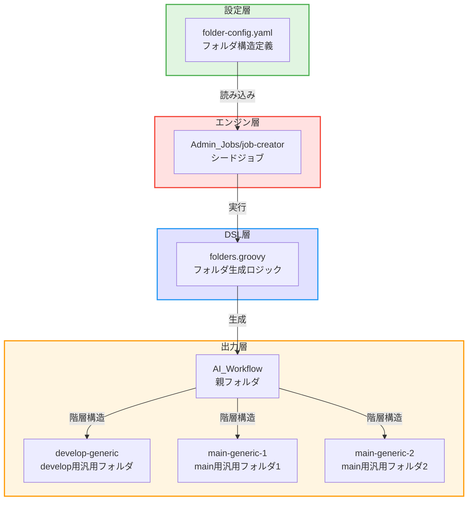

# 詳細設計書 - Issue #456

**作成日**: 2025年1月17日
**Issue番号**: #456
**タイトル**: [jenkins] AI Workflow用の汎用フォルダを追加
**Issue URL**: https://github.com/tielec/infrastructure-as-code/issues/456

---

## 0. Planning Documentとの整合性

本詳細設計は、Planning Phase（`.ai-workflow/issue-456/00_planning/output/planning.md`）およびRequirements Phase（`.ai-workflow/issue-456/01_requirements/output/requirements.md`）で策定された戦略に基づいて実施されます。

### Planning Phaseで決定された方針

- **実装戦略**: EXTEND（既存のfolder-config.yamlに定義を追加）
- **テスト戦略**: INTEGRATION_ONLY（シードジョブ実行による実環境確認）
- **テストコード戦略**: なし（YAML定義のため自動テスト不要）
- **複雑度**: 簡単
- **総工数**: 3〜4時間
- **リスクレベル**: 低

---

## 1. アーキテクチャ設計

### 1.1 システム全体図



### 1.2 コンポーネント間の関係

| コンポーネント | 役割 | 入力 | 出力 |
|----------------|------|------|------|
| **folder-config.yaml** | フォルダ定義の静的管理 | 手動編集（YAML） | YAML形式のフォルダ定義リスト |
| **job-creator** | シードジョブ（フォルダ生成のトリガー） | folder-config.yaml | Job DSL実行指示 |
| **folders.groovy** | フォルダ生成ロジック | YAML定義リスト | Jenkinsフォルダオブジェクト |
| **AI_Workflow フォルダ** | 既存の親フォルダ | - | 子フォルダの配置先 |
| **汎用フォルダ（3つ）** | 新規追加フォルダ | - | Jenkinsジョブの配置先 |

### 1.3 データフロー

```
┌─────────────────────────┐
│ folder-config.yaml      │
│ ・develop-generic追加   │
│ ・main-generic-1追加    │
│ ・main-generic-2追加    │
└───────────┬─────────────┘
            │ YAML読み込み
            ↓
┌─────────────────────────┐
│ job-creator             │
│ （シードジョブ）         │
│ ・YAMLパース            │
│ ・DSLスクリプトロード    │
└───────────┬─────────────┘
            │ Job DSL実行
            ↓
┌─────────────────────────┐
│ folders.groovy          │
│ ・フォルダソート（階層順）│
│ ・フォルダ生成           │
└───────────┬─────────────┘
            │ Jenkins API呼び出し
            ↓
┌─────────────────────────┐
│ Jenkins UI              │
│ AI_Workflow/            │
│ ├─ develop-generic      │
│ ├─ main-generic-1       │
│ └─ main-generic-2       │
└─────────────────────────┘
```

---

## 2. 実装戦略判断（Planning Documentより）

### 実装戦略: EXTEND

**判断根拠**:
- **新規ファイル作成は不要**: 既存の`folder-config.yaml`に定義を追加するのみ
- **既存コード拡張が中心**: 静的フォルダ定義リスト（`folders`セクション）に3つのフォルダを追加
- **構造改善は不要**: 既存の動的フォルダ生成パターンを使用しない（汎用フォルダは静的定義）
- **folders.groovyの変更不要**: 既存のロジックでそのまま対応可能

本タスクは、既存のフォルダ定義リストに新しいエントリを追加する「機能拡張」であり、EXTENDが最適です。

---

## 3. テスト戦略判断（Planning Documentより）

### テスト戦略: INTEGRATION_ONLY

**判断根拠**:
- **ユニットテスト不要**: ロジックが存在しない（YAML定義のみ）
- **インテグレーションテスト必須**: シードジョブ実行による実環境確認が必要
  - Jenkins UIでフォルダが正しく作成されるか確認
  - フォルダの階層構造が正しいか確認
  - displayNameとdescriptionが正しく設定されるか確認
- **BDDテスト不要**: エンドユーザー向けのビジネスロジックではない

シードジョブを実行してJenkins上で実際にフォルダが作成されることを確認するインテグレーションテストのみで十分です。

---

## 4. テストコード戦略判断（Planning Documentより）

### テストコード戦略: なし

**判断根拠**:
- **YAML定義のため自動テスト不要**: Job DSLがYAML定義を読み込んで処理するため、テストコードは不要
- **手動確認で十分**: Jenkins UIでフォルダ作成結果を目視確認
- **既存テストの拡張も不要**: フォルダ定義のテストコードは存在しない

本タスクはテストコードの作成が不要なため、「なし」と判断します。

---

## 5. 影響範囲分析

### 5.1 既存コードへの影響

#### 変更が必要なファイル

| ファイルパス | 変更内容 | 変更理由 |
|-------------|---------|---------|
| `jenkins/jobs/pipeline/_seed/job-creator/folder-config.yaml` | `folders`セクションに3つのフォルダ定義を追加 | 静的フォルダの定義 |

#### 変更不要なファイル

| ファイルパス | 理由 |
|-------------|------|
| `jenkins/jobs/dsl/folders.groovy` | 既存のロジックで対応可能（階層ソート、フォルダ生成は実装済み） |
| `jenkins/jobs/dsl/ai_workflow/*.groovy` | フォルダ追加のみで、ジョブ定義には影響しない |
| その他のDSLファイル | フォルダ構造の追加は既存ジョブに影響しない |

### 5.2 依存関係の変更

**新規依存の追加**: なし

**既存依存の変更**: なし

**依存関係**:
- シードジョブ（`Admin_Jobs/job-creator`）の実行が必要
- `folders.groovy`がYAML定義を読み込んで処理

### 5.3 マイグレーション要否

**マイグレーション不要**

**理由**:
- データベーススキーマ変更なし
- 設定ファイルの追記のみ（破壊的変更なし）
- 既存フォルダには影響しない
- ロールバックが容易（YAML定義を削除するだけ）

---

## 6. 変更・追加ファイルリスト

### 6.1 新規作成ファイル

なし（すべて既存ファイルの修正）

### 6.2 修正が必要な既存ファイル

| ファイルパス（相対パス） | 修正内容 | 行数の増減 |
|-------------------------|---------|-----------|
| `jenkins/jobs/pipeline/_seed/job-creator/folder-config.yaml` | `folders`セクションに3つのフォルダ定義を追加（コメント含む） | 約+50行 |

### 6.3 削除が必要なファイル

なし

---

## 7. 詳細設計

### 7.1 フォルダ命名規則の分析

#### 既存フォルダの命名パターン

既存のfolder-config.yamlを分析した結果：

| パターン | 例 | 使用箇所 |
|----------|-----|---------|
| **PascalCase_Underscore** | `Admin_Jobs`, `Account_Setup`, `Code_Quality_Checker` | トップレベルフォルダ |
| **kebab-case** | `delivery-management-jobs` | 一部のトップレベルフォルダ |
| **PascalCase_Underscore** | `Shared_Library`, `Pipeline_Tests`, `Infrastructure_Management` | トップレベルフォルダ |
| **PascalCase** | `AWS_Utils`, `Jenkins_Cli_Utils`, `Git_Utils` | サブフォルダ |

#### AI_Workflow配下の命名パターン

AI_Workflowフォルダは動的フォルダ生成（`dynamic_folders`）を使用しており、リポジトリ名がそのままフォルダ名になる仕組みです。しかし、**汎用フォルダは特定リポジトリに依存しないため、静的定義（`folders`セクション）に追加します**。

#### 命名決定

Planning DocumentおよびRequirements Documentでの検討結果に基づき、以下の命名を採用します：

| 用途 | フォルダパス | 命名根拠 |
|------|-------------|---------|
| develop用 | `AI_Workflow/develop-generic` | kebab-caseで統一、"generic"で汎用性を明示 |
| main用1 | `AI_Workflow/main-generic-1` | kebab-caseで統一、番号で区別 |
| main用2 | `AI_Workflow/main-generic-2` | kebab-caseで統一、番号で区別 |

**理由**:
- `delivery-management-jobs`と同様にkebab-caseを採用
- `generic`で「汎用」を明示し、リポジトリ名と区別
- 番号（`-1`, `-2`）でmain用の2つを区別
- 一貫性を保ちつつ、視認性が高い

### 7.2 データ構造設計

#### folder-config.yamlへの追加内容

```yaml
# jenkins/jobs/pipeline/_seed/job-creator/folder-config.yaml

# Issue #456: AI Workflow用の汎用フォルダを追加
# 追加日: 2025-01-17
# URL: https://github.com/tielec/infrastructure-as-code/issues/456
#
# 背景:
# - 特定リポジトリに依存しない汎用的なワークフロー実行環境が必要
# - developブランチ用（最新機能のテスト）とmainブランチ用（安定バージョン）を分離
# - main用は並行利用可能にするため2つ用意

folders:
  # ... 既存のフォルダ定義 ...

  # AI Workflow - develop用汎用フォルダ
  - path: "AI_Workflow/develop-generic"
    displayName: "汎用 - Develop"
    description: |
      developブランチ用の汎用ワークフロー実行環境

      ### 用途
      - ai-workflow-agentの**最新バージョン**（developブランチ）を使用
      - 新機能のテスト、実験的な利用
      - 特定リポジトリに依存しない汎用的なワークフロー

      ### 対象ブランチ
      - ai-workflow-agent: **develop**

      ### 推奨の使い方
      - 最新機能の検証
      - 新しいワークフローのテスト
      - リポジトリ横断的なタスク実行

      ### 注意事項
      - 開発中の機能のため、動作が不安定な場合があります
      - 本番環境での利用は避けてください
      - 安定した動作が必要な場合はmain用フォルダを使用してください

  # AI Workflow - main用汎用フォルダ（1つ目）
  - path: "AI_Workflow/main-generic-1"
    displayName: "汎用 - Main #1"
    description: |
      mainブランチ用の汎用ワークフロー実行環境（1つ目）

      ### 用途
      - ai-workflow-agentの**安定バージョン**（mainブランチ）を使用
      - 本番環境での利用、安定した動作が求められる場合
      - 特定リポジトリに依存しない汎用的なワークフロー

      ### 対象ブランチ
      - ai-workflow-agent: **main**

      ### 推奨の使い方
      - 本番環境でのワークフロー実行
      - 安定性が求められるタスク
      - リポジトリ横断的なタスク実行

      ### 並行利用について
      - main用フォルダは2つあり、複数のワークフローを同時実行可能です
      - 使用中は`main-generic-2`をご利用ください

  # AI Workflow - main用汎用フォルダ（2つ目）
  - path: "AI_Workflow/main-generic-2"
    displayName: "汎用 - Main #2"
    description: |
      mainブランチ用の汎用ワークフロー実行環境（2つ目）

      ### 用途
      - ai-workflow-agentの**安定バージョン**（mainブランチ）を使用
      - 本番環境での利用、安定した動作が求められる場合
      - 特定リポジトリに依存しない汎用的なワークフロー

      ### 対象ブランチ
      - ai-workflow-agent: **main**

      ### 推奨の使い方
      - 本番環境でのワークフロー実行
      - 安定性が求められるタスク
      - リポジトリ横断的なタスク実行

      ### 並行利用について
      - main用フォルダは2つあり、複数のワークフローを同時実行可能です
      - `main-generic-1`が使用中の場合はこちらをご利用ください

# ... 既存のdynamic_folders定義 ...
```

### 7.3 インターフェース設計

#### 入力インターフェース

| インターフェース | 形式 | 内容 |
|----------------|------|------|
| **folder-config.yaml** | YAML | フォルダ定義リスト（`folders`セクション） |

#### 出力インターフェース

| インターフェース | 形式 | 内容 |
|----------------|------|------|
| **Jenkins UI** | Webブラウザ | フォルダ階層構造として表示 |
| **Jenkins API** | JSON/XML | フォルダオブジェクトとして取得可能 |

### 7.4 処理フロー設計

#### シードジョブ実行時の処理フロー

```
1. ユーザーがAdmin_Jobs/job-creatorを実行
   ↓
2. Jenkinsfileが実行される
   ↓
3. folder-config.yamlを読み込み
   ↓
4. YAMLパース（foldersセクションとdynamic_foldersセクション）
   ↓
5. folders.groovyにYAML内容を渡す
   ↓
6. folders.groovyがフォルダを階層順にソート
   （浅い階層 → 深い階層の順）
   ↓
7. フォルダを順番に生成
   7-1. AI_Workflow（親フォルダ、既存）
   7-2. AI_Workflow/develop-generic（新規）
   7-3. AI_Workflow/main-generic-1（新規）
   7-4. AI_Workflow/main-generic-2（新規）
   ↓
8. Jenkins UIにフォルダが表示される
```

---

## 8. セキュリティ考慮事項

### 8.1 認証・認可

**影響**: なし

**理由**:
- フォルダの追加は既存のJenkinsセキュリティ設定を継承
- AI_Workflowフォルダの権限設定がそのまま適用される
- 新しい権限設定やロール変更は不要

### 8.2 データ保護

**影響**: なし

**理由**:
- フォルダ定義に機密情報は含まれない
- descriptionは公開情報のみ記載

### 8.3 セキュリティリスクと対策

| リスク | 影響度 | 対策 |
|--------|--------|------|
| YAML構文エラーによるシードジョブ失敗 | 低 | YAMLバリデータで事前検証 |
| フォルダパスの重複 | 低 | 既存フォルダとの重複確認 |
| 不正なフォルダアクセス | なし | Jenkinsの既存権限設定で対応 |

---

## 9. 非機能要件への対応

### 9.1 パフォーマンス

**要件**: シードジョブ実行時のフォルダ作成時間は、既存のフォルダ作成と同等であること（追加で5秒以上かからない）

**対応**:
- 3つのフォルダ追加は軽量な操作
- folders.groovyの既存ロジック（階層ソート、重複排除）で効率的に処理
- Jenkins APIへの呼び出し回数: 3回（フォルダごとに1回）

**測定方法**:
- シードジョブのビルド時間を実行前後で比較
- Console Outputで各フォルダ作成のログを確認

### 9.2 スケーラビリティ

**要件**: 将来的に汎用フォルダを追加する際、同じパターンで追加できること

**対応**:
- 静的フォルダ定義（`folders`セクション）に追加するだけ
- 命名規則（`{branch}-generic-{number}`）を確立
- descriptionのテンプレートを提供

### 9.3 保守性

**要件**: YAML定義の可読性、変更のしやすさ

**対応**:
- コメントで追加理由とIssue番号を明記
- descriptionに用途、対象ブランチ、推奨の使い方を記載
- 一貫性のある命名規則

---

## 10. 実装の順序

### 推奨実装順序

本Issue（#456）は単一ファイルの修正のみであるため、以下の順序で実装します：

1. **folder-config.yamlの編集**（15分）
   - `folders`セクションに3つのフォルダ定義を追加
   - コメント追加（Issue番号、追加理由）
   - YAML構文の確認

2. **ローカルでのYAML検証**（5分）
   - YAMLバリデータでパース確認
   - インデント（スペース2つ）の確認

3. **Git差分確認**（5分）
   - `git diff`で変更箇所を確認
   - 意図しない変更がないことを確認

4. **Gitコミット**（5分）
   - コミットメッセージ: `[jenkins] add: AI Workflow用の汎用フォルダを追加 (#456)`

5. **シードジョブ実行**（10分）
   - Jenkins UIから`Admin_Jobs/job-creator`を実行
   - ビルドログの確認

6. **Jenkins UIでの確認**（10分）
   - 3つのフォルダが正しく作成されたことを確認
   - displayNameとdescriptionの確認
   - フォルダの階層構造確認

7. **ドキュメント更新**（10分）
   - CHANGELOG.md更新（必要に応じて）
   - README.md更新要否の判断

**合計実装時間**: 約1時間

### 依存関係の考慮

**並行実行可能な作業**: なし（単一ファイルの編集）

**ブロッキング依存**: なし

**推奨事項**:
- Git操作とシードジョブ実行は順次実行すること
- Jenkins UIでの確認はシードジョブ成功後に実施すること

---

## 11. 設計レビューチェックリスト

### 11.1 設計の完全性

- [x] **実装戦略の判断根拠が明記されている**（EXTEND、理由: 既存ファイルへの追加）
- [x] **テスト戦略の判断根拠が明記されている**（INTEGRATION_ONLY、理由: YAML定義のため）
- [x] **テストコード戦略の判断根拠が明記されている**（なし、理由: 自動テスト不要）
- [x] **既存コードへの影響範囲が分析されている**（folder-config.yamlのみ）
- [x] **変更が必要なファイルがリストアップされている**（1ファイル）

### 11.2 設計の実装可能性

- [x] フォルダ命名規則が既存パターンと一貫している
- [x] YAML構文が正しい（descriptionのインデント、特殊文字エスケープ）
- [x] folders.groovyの既存ロジックで対応可能
- [x] シードジョブ実行で即座に反映可能

### 11.3 設計の保守性

- [x] コメントでIssue番号と追加理由が明記される
- [x] descriptionで用途と対象ブランチが説明される
- [x] 将来的な拡張が容易（同じパターンで追加可能）

### 11.4 セキュリティ・非機能要件

- [x] セキュリティリスクが評価されている
- [x] パフォーマンス要件への対応が設計されている
- [x] スケーラビリティが考慮されている

---

## 12. 次のフェーズへの引き継ぎ事項

### Phase 4（実装）で実施すべき事項

1. **folder-config.yamlの編集**
   - `folders`セクションの適切な位置に3つのフォルダ定義を追加
   - コメント追加（Issue番号、追加日、追加理由、背景説明）
   - YAML構文の厳密な確認（インデント、クォート、改行）

2. **YAML検証**
   - オンラインYAMLバリデータまたはyamllintでパース確認
   - インデント（スペース2つ）の統一確認
   - 特殊文字のエスケープ確認

3. **Git操作**
   - `git diff`で変更箇所を確認
   - 意図しない変更がないことを確認
   - コミットメッセージ: `[jenkins] add: AI Workflow用の汎用フォルダを追加 (#456)`

### Phase 6（テスト実行）で実施すべき事項

1. **シードジョブ実行**
   - Jenkins UIから`Admin_Jobs/job-creator`を手動実行
   - ビルドログで3つのフォルダ作成メッセージを確認
   - ビルドステータスがSUCCESSであることを確認

2. **Jenkins UIでの確認**
   - `AI_Workflow/develop-generic`が表示されることを確認
   - `AI_Workflow/main-generic-1`が表示されることを確認
   - `AI_Workflow/main-generic-2`が表示されることを確認
   - 各フォルダのdisplayNameが正しいことを確認
   - 各フォルダのdescriptionが正しく表示されることを確認

3. **既存フォルダへの影響確認**
   - 既存のAI_Workflow配下の動的フォルダが削除されていないことを確認
   - 他のフォルダ（Admin_Jobs等）に変更がないことを確認

### Phase 7（ドキュメント）で実施すべき事項

1. **CHANGELOG.md更新**（必要に応じて）
   - 変更内容の記載（フォルダ3つ追加）
   - Issue番号のリンク追加

2. **README.md更新要否の判断**
   - `jenkins/README.md`の更新が必要か判断
   - フォルダ一覧表の更新要否を確認

---

## 13. 完了条件（Definition of Done）

Phase 2（設計）が完了とみなされる条件：

1. [x] 実装戦略（EXTEND）の判断根拠が明記されている
2. [x] テスト戦略（INTEGRATION_ONLY）の判断根拠が明記されている
3. [x] テストコード戦略（なし）の判断根拠が明記されている
4. [x] 既存コードへの影響範囲が分析されている
5. [x] 変更が必要なファイルがリストアップされている
6. [x] YAML定義の詳細が設計されている（命名、description、構造）
7. [x] セキュリティ考慮事項が評価されている
8. [x] 非機能要件への対応が設計されている
9. [x] 実装の順序が明確になっている
10. [x] 次フェーズへの引き継ぎ事項が明確になっている

---

**設計書作成者**: Claude (AI Assistant)
**レビュー待ち**: Phase 2品質ゲート確認
**次のフェーズ**: Phase 3（テストシナリオ）
