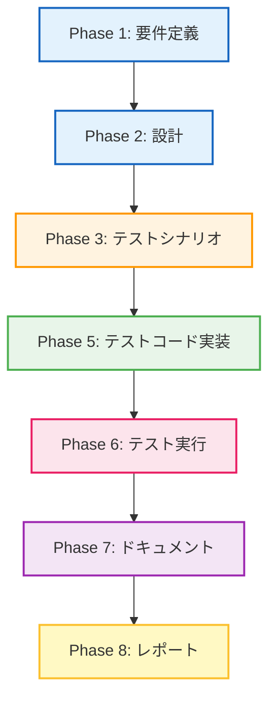

# プロジェクト計画書: dot_processor.py - Phase 1: 基盤整備

## Issue情報

- **Issue番号**: #460
- **タイトル**: [Refactor] dot_processor.py - Phase 1: 基盤整備
- **親Issue**: #448
- **状態**: open
- **URL**: https://github.com/tielec/infrastructure-as-code/issues/460

## 1. Issue分析

### 複雑度: 中程度

**判定根拠**:
- 対象ファイル: `dot_processor.py`（617行、2クラス構成）
- 既存のテストインフラが存在しない（新規テストフレームワーク構築が必要）
- 特性テスト（Characterization Test）の作成が必要
- 既存コードの振る舞いを保証するための詳細な分析が必要
- 単一ファイルの分析だが、複雑なロジックを含む（DOT形式処理、URN解析、グラフ生成）

### 見積もり工数: 12~16時間

**工数内訳**:
- Phase 1 (要件定義): 2~3時間
  - 既存コードの振る舞い分析
  - テストシナリオの洗い出し
- Phase 2 (設計): 2~3時間
  - テストフレームワーク設計
  - 特性テスト戦略の策定
- Phase 3 (テストシナリオ): 2~3時間
  - テストケースの詳細設計
- Phase 4 (実装): 0時間（Phase 1では実装なし）
- Phase 5 (テストコード実装): 3~4時間
  - pytest環境のセットアップ
  - 特性テストの実装
- Phase 6 (テスト実行): 1~2時間
  - テスト実行とカバレッジ測定
- Phase 7 (ドキュメント): 1~1.5時間
  - 振る舞い記録ドキュメントの作成
- Phase 8 (レポート): 0.5~1時間
  - Phase 1完了レポートの作成

### リスク評価: 中

**リスク要因**:
- **テストインフラ未整備**: 既存テストが存在せず、ゼロから構築が必要
- **外部依存の複雑性**: DOT形式処理、JSON解析、複雑な文字列エスケープロジック
- **網羅性の担保**: 特性テストで全ての振る舞いを記録できない可能性
- **テストデータ準備**: 実際のPulumiデータ構造を模したテストデータが必要

## 2. 実装戦略判断

### 実装戦略: REFACTOR

**判断根拠**:
- **Phase 1の特性**: 既存コードの振る舞いを保証するテストを作成するフェーズ
- **コード変更なし**: 実装フェーズ（Phase 4）は存在せず、コード変更は一切行わない
- **基盤整備**: 後続フェーズ（Phase 2以降）でのリファクタリングに備えた準備
- **特性テストの役割**: 既存の振る舞いをテストコードとして記録し、将来のリファクタリング時の安全網を構築

### テスト戦略: UNIT_ONLY

**判断根拠**:
- **ユニットテスト中心**: `dot_processor.py`は単一モジュールで、他のシステムとの統合は限定的
- **外部依存なし**: ファイルI/O以外の外部依存（データベース、API等）が存在しない
- **BDD不要**: ユーザーストーリーではなく、技術的な振る舞い保証が目的
- **インテグレーション不要**: Jenkins Pipeline内での統合テストは後続フェーズで実施

**テスト種別**:
- **特性テスト（Characterization Test）**: 既存の振る舞いを記録
- **ユニットテスト**: 各メソッドの入出力を検証

### テストコード戦略: CREATE_TEST

**判断根拠**:
- **新規テスト作成**: 既存のテストファイルが存在しない
- **テストフレームワーク構築**: pytest環境を新規にセットアップ
- **テストディレクトリ構造**: 新規作成が必要
  ```
  jenkins/jobs/pipeline/infrastructure/pulumi-stack-action/
  ├── src/
  │   └── dot_processor.py
  └── tests/
      ├── __init__.py
      ├── conftest.py
      ├── test_dot_processor.py
      └── fixtures/
          └── test_data/
  ```

## 3. 影響範囲分析

### 既存コードへの影響: なし

**理由**:
- Phase 1はテスト作成のみで、既存コードの変更は一切行わない
- `dot_processor.py`の振る舞いは変更されない

### 依存関係の変更: 新規テスト依存の追加

**追加する依存関係**:
```python
# テストフレームワーク
pytest==7.4.3
pytest-cov==4.1.0

# テストユーティリティ
pytest-mock==3.12.0  # モック機能
```

**既存の実行時依存**:
- 変更なし（既存の`dot_processor.py`の依存関係は維持）

### マイグレーション要否: なし

**理由**:
- データベーススキーマ変更なし
- 設定ファイル変更なし
- API変更なし

### 影響を受ける可能性のあるコンポーネント

**直接影響**:
- `jenkins/jobs/pipeline/infrastructure/pulumi-stack-action/src/dot_processor.py`（テスト対象）

**間接影響**:
- `jenkins/jobs/pipeline/infrastructure/pulumi-stack-action/src/report_generator.py`（将来のリファクタリング時）
- `jenkins/jobs/pipeline/infrastructure/pulumi-stack-action/src/graph_processor.py`（将来のリファクタリング時）

## 4. タスク分割

### Phase 1: 要件定義 (見積もり: 2~3h)

- [ ] Task 1-1: 既存コードの静的分析 (0.5~1h)
  - `dot_processor.py`の全メソッドをリストアップ
  - 各メソッドの責務を文書化
  - 公開メソッド vs プライベートメソッドの分類
  - 依存関係マップの作成

- [ ] Task 1-2: 振る舞いの洗い出し (1~1.5h)
  - `DotFileGenerator`クラスの主要振る舞い（DOT生成、エスケープ処理）
  - `DotFileProcessor`クラスの主要振る舞い（URN解析、グラフスタイル適用）
  - エッジケースの特定（空文字列、特殊文字、不正なURN等）
  - 期待される出力形式の文書化

- [ ] Task 1-3: テスト対象メソッドの優先順位付け (0.5h)
  - 公開APIの特定（`create_dot_file`, `apply_graph_styling`等）
  - リスクの高いメソッドの特定（複雑なロジック、エッジケース処理）
  - カバレッジ目標の設定（80%以上）

### Phase 2: 設計 (見積もり: 2~3h)

- [x] Task 2-1: テストフレームワーク設計 (1~1.5h)
  - pytest設定ファイル（`pytest.ini`）の設計
  - テストディレクトリ構造の設計
  - フィクスチャ戦略の策定
  - カバレッジ測定設定（`.coveragerc`）

- [x] Task 2-2: 特性テスト戦略の策定 (1~1.5h)
  - Golden Masterテストパターンの適用方針
  - テストデータの準備戦略（実際のPulumiデータをサンプリング）
  - アサーション戦略（完全一致 vs パターンマッチング）
  - リグレッション検出メカニズム

### Phase 3: テストシナリオ (見積もり: 2~3h)

- [ ] Task 3-1: `DotFileGenerator`のテストシナリオ (1~1.5h)
  - `escape_dot_string`: 特殊文字エスケープの検証
  - `create_dot_file`: DOTファイル生成の完全検証
  - プロバイダー別色設定の検証
  - 依存関係グラフの検証

- [ ] Task 3-2: `DotFileProcessor`のテストシナリオ (1~1.5h)
  - `parse_urn`: URN解析の網羅的検証
  - `apply_graph_styling`: グラフスタイル適用の検証
  - `is_empty_graph`: 空グラフ判定の検証
  - エッジケーステストシナリオ（不正なURN、空文字列等）

### Phase 4: 実装 (見積もり: 0h)

**Phase 1では実装フェーズは存在しない**
- 既存コードの変更は一切行わない
- テストコード作成のみ（Phase 5で実施）

### Phase 5: テストコード実装 (見積もり: 3~4h)

- [ ] Task 5-1: テスト環境のセットアップ (0.5~1h)
  - `tests/`ディレクトリの作成
  - `conftest.py`の作成（共通フィクスチャ）
  - `pytest.ini`の作成
  - `.coveragerc`の作成

- [ ] Task 5-2: `DotFileGenerator`のテストコード (1~1.5h)
  - `test_escape_dot_string`: エスケープ処理のテスト
  - `test_create_dot_file`: DOT生成の特性テスト
  - `test_provider_colors`: プロバイダー色設定のテスト
  - `test_add_resource_dependencies`: 依存関係追加のテスト

- [ ] Task 5-3: `DotFileProcessor`のテストコード (1~1.5h)
  - `test_parse_urn`: URN解析の特性テスト
  - `test_apply_graph_styling`: スタイル適用のテスト
  - `test_is_empty_graph`: 空グラフ判定のテスト
  - `test_create_readable_label`: ラベル生成のテスト

### Phase 6: テスト実行 (見積もり: 1~2h)

- [ ] Task 6-1: テスト実行とデバッグ (0.5~1h)
  - 全テストの実行
  - 失敗テストのデバッグと修正
  - テストの安定性確認（複数回実行）

- [ ] Task 6-2: カバレッジ測定と分析 (0.5~1h)
  - カバレッジレポートの生成（HTML形式）
  - カバレッジ80%以上の達成確認
  - 未カバー箇所の分析と追加テストの検討

### Phase 7: ドキュメント (見積もり: 1~1.5h)

- [ ] Task 7-1: 振る舞い記録ドキュメントの作成 (0.5~0.75h)
  - `CHARACTERIZATION_TEST.md`の作成
  - 各メソッドの期待動作の文書化
  - エッジケースの振る舞いの記録
  - テスト実行方法の記載

- [ ] Task 7-2: テストREADMEの作成 (0.5~0.75h)
  - `tests/README.md`の作成
  - テスト構造の説明
  - テスト実行コマンドの記載
  - カバレッジレポート生成方法の記載

### Phase 8: レポート (見積もり: 0.5~1h)

- [ ] Task 8-1: Phase 1完了レポートの作成 (0.5~1h)
  - 達成事項のサマリー
  - カバレッジレポートの添付
  - 発見した問題点の記録
  - Phase 2への引き継ぎ事項の記載

## 5. 依存関係



### フェーズ間の依存関係詳細

- **Phase 1 → Phase 2**: 要件定義で洗い出した振る舞いを基に設計を行う
- **Phase 2 → Phase 3**: 設計したテストフレームワークを基にテストシナリオを作成
- **Phase 3 → Phase 5**: テストシナリオを基にテストコードを実装
- **Phase 5 → Phase 6**: 実装したテストを実行してカバレッジを測定
- **Phase 6 → Phase 7**: テスト結果を基に振る舞いをドキュメント化
- **Phase 7 → Phase 8**: ドキュメントを含めた完了レポートを作成

### 注意: Phase 4（実装）は存在しない

Phase 1では既存コードの変更を一切行わないため、Phase 4（実装フェーズ）は存在しません。

## 6. リスクと軽減策

### リスク1: テストインフラ構築の遅延

- **影響度**: 高
- **確率**: 中
- **軽減策**:
  - pytest環境のセットアップを最優先で実施
  - サンプルテストを早期に作成して環境を検証
  - CI/CD統合は後回しにし、ローカル実行を優先

### リスク2: 特性テストの網羅性不足

- **影響度**: 高
- **確率**: 中
- **軽減策**:
  - カバレッジ目標を80%以上に設定
  - 公開APIを最優先でテスト
  - エッジケースリストを事前に作成
  - コードレビューで網羅性を検証

### リスク3: テストデータ準備の困難さ

- **影響度**: 中
- **確率**: 中
- **軽減策**:
  - 実際のPulumiデータをサンプリング（`stack-export.json`等）
  - 最小限のテストデータから開始
  - フィクスチャの段階的な拡充
  - モックデータの活用

### リスク4: 複雑なロジックの理解不足

- **影響度**: 中
- **確率**: 低
- **軽減策**:
  - コードの静的分析を丁寧に実施
  - 各メソッドの責務を文書化
  - 不明点は親Issue (#448)にて質問
  - ペアプログラミングやコードレビューの活用

### リスク5: カバレッジ目標未達

- **影響度**: 中
- **確率**: 低
- **軽減策**:
  - 段階的なカバレッジ向上（60% → 70% → 80%）
  - カバレッジレポートの定期的な確認
  - 未カバー箇所の優先順位付け
  - 複雑なプライベートメソッドは公開メソッド経由でテスト

### リスク6: テスト実行時間の増大

- **影響度**: 低
- **確率**: 低
- **軽減策**:
  - テストの並列実行（`pytest -n auto`）
  - 重いテストはマーク付け（`@pytest.mark.slow`）
  - CI/CDでのテスト実行時間を監視

## 7. 品質ゲート

### Phase 1: 要件定義

- [ ] 全メソッドがリストアップされている
- [ ] 各メソッドの責務が明確に記載されている
- [ ] 主要な振る舞いが文書化されている
- [ ] エッジケースが特定されている
- [ ] テスト対象メソッドの優先順位が決定されている

### Phase 2: 設計

- [x] 実装戦略の判断根拠が明記されている（REFACTOR）
- [x] テスト戦略の判断根拠が明記されている（UNIT_ONLY）
- [x] テストコード戦略の判断根拠が明記されている（CREATE_TEST）
- [x] テストディレクトリ構造が設計されている
- [x] フィクスチャ戦略が定義されている
- [x] カバレッジ測定設定が設計されている

### Phase 3: テストシナリオ

- [ ] `DotFileGenerator`の全公開メソッドのテストシナリオが定義されている
- [ ] `DotFileProcessor`の全公開メソッドのテストシナリオが定義されている
- [ ] エッジケースのテストシナリオが定義されている
- [ ] アサーション戦略が明確である
- [ ] テストデータ準備方針が定義されている

### Phase 5: テストコード実装

- [ ] pytest環境が正常にセットアップされている
- [ ] `conftest.py`に共通フィクスチャが実装されている
- [ ] `DotFileGenerator`のテストコードが実装されている
- [ ] `DotFileProcessor`のテストコードが実装されている
- [ ] 全テストがPEP 8準拠である
- [ ] テストコードにドキュメント文字列が記載されている

### Phase 6: テスト実行

- [ ] 全テストがパスしている
- [ ] テストが安定している（複数回実行で同じ結果）
- [ ] カバレッジ80%以上を達成している
- [ ] カバレッジレポート（HTML）が生成されている
- [ ] 未カバー箇所が文書化されている

### Phase 7: ドキュメント

- [ ] `CHARACTERIZATION_TEST.md`が作成されている
- [ ] 各メソッドの期待動作が記載されている
- [ ] エッジケースの振る舞いが記録されている
- [ ] `tests/README.md`が作成されている
- [ ] テスト実行方法が明確に記載されている

### Phase 8: レポート

- [ ] Phase 1完了レポートが作成されている
- [ ] 達成事項が明確に記載されている
- [ ] カバレッジレポートが添付されている
- [ ] 発見した問題点が記録されている
- [ ] Phase 2への引き継ぎ事項が明確である

## 8. テクニカルノート

### 対象コードの特徴

**`dot_processor.py`の構成**:
- **行数**: 617行
- **クラス数**: 2クラス
  - `DotFileGenerator`: DOTファイル生成の責務
  - `DotFileProcessor`: DOTファイル処理の責務
- **公開メソッド数**: 約10個
- **プライベートメソッド数**: 約15個

**主要な機能**:
1. **DOT形式生成**: Graphviz形式の依存関係グラフを生成
2. **URN解析**: Pulumi URN形式の文字列を解析
3. **グラフスタイル適用**: プロバイダー別の色設定、ノード/エッジのスタイリング
4. **エスケープ処理**: DOT形式用の特殊文字エスケープ

### テストフレームワーク選定理由

**pytest選定理由**:
- Python標準のテストフレームワーク
- 豊富なプラグインエコシステム（pytest-cov等）
- シンプルな構文（アサーションが直感的）
- フィクスチャによる柔軟なテストデータ管理

### カバレッジ目標の根拠

**80%以上を目標とする理由**:
- 業界標準（一般的なOSSプロジェクトの目標値）
- 100%は非現実的（防御的コード、エラーハンドリング等）
- リファクタリングの安全網として十分

**カバレッジ対象**:
- 全公開メソッド: 100%
- プライベートメソッド: 70%以上
- エッジケース処理: 100%

## 9. 完了条件

### Phase 1全体の完了条件（Issue #460の完了条件）

- [ ] 既存テストが全てパスすること（新規作成テストを含む）
- [ ] 特性テストにより主要な振る舞いが保証されていること
- [ ] リファクタリング前のベースラインが確立されていること（カバレッジ80%以上）
- [ ] カバレッジレポートが生成されていること
- [ ] 振る舞い記録ドキュメントが作成されていること
- [ ] 全品質ゲートを満たしていること

### 各フェーズの完了条件

各フェーズの完了条件は、セクション「7. 品質ゲート」を参照してください。

## 10. 次フェーズへの引き継ぎ

### Phase 2（本リファクタリング）への準備

Phase 1完了後、以下の成果物をPhase 2に引き継ぎます：

1. **テストコード**: 特性テストとユニットテスト
2. **カバレッジレポート**: 未カバー箇所の分析結果
3. **振る舞い記録ドキュメント**: リファクタリング時の参照資料
4. **発見した問題点**: リファクタリング対象候補

### Phase 2で実施すべき事項

- コードの構造改善（クラス分割、メソッド抽出等）
- 複雑度の低減（Cyclomatic Complexity削減）
- コメントの改善
- 型ヒントの追加

---

**作成日**: 2025-01-19
**最終更新**: 2025-01-19
**作成者**: Claude Code (AI Workflow Phase 0)
**レビュー状態**: 未レビュー
