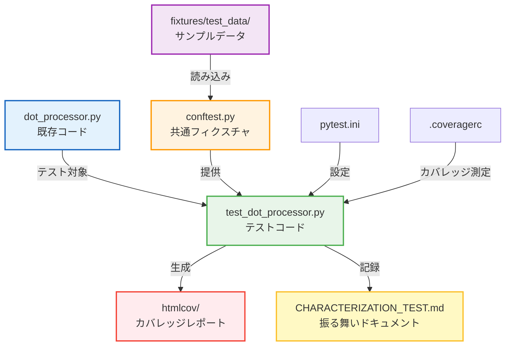

# 設計書: dot_processor.py - Phase 1: 基盤整備

## Issue情報

- **Issue番号**: #460
- **タイトル**: [Refactor] dot_processor.py - Phase 1: 基盤整備
- **親Issue**: #448
- **状態**: open
- **URL**: https://github.com/tielec/infrastructure-as-code/issues/460
- **作成日**: 2025-01-19

---

## 0. Planning Documentと要件定義の確認

### 開発計画の概要（Planning Documentより）

- **実装戦略**: REFACTOR
  - Phase 1では既存コードの変更は一切行わない
  - 特性テスト（Characterization Test）によって既存の振る舞いを記録
  
- **テスト戦略**: UNIT_ONLY
  - 単一モジュール（`dot_processor.py`）を対象
  - カバレッジ目標: 80%以上

- **テストコード戦略**: CREATE_TEST
  - 新規テストフレームワーク（pytest）を構築

### 要件定義書の確認

要件定義書（`requirements.md`）から、以下の機能要件を確認しました：

- **FR-001**: テストフレームワークの構築（pytest環境）
- **FR-002**: `DotFileGenerator`クラスの特性テスト作成
- **FR-003**: `DotFileProcessor`クラスの特性テスト作成
- **FR-004**: エッジケースのテストシナリオ作成
- **FR-005**: テストデータの準備
- **FR-006**: カバレッジ測定（80%以上）
- **FR-007**: テスト実行の安定性

---

## 1. アーキテクチャ設計

### 1.1 システム全体図

```
┌─────────────────────────────────────────────────────────────┐
│                 Phase 1: 基盤整備                            │
│                                                              │
│  ┌───────────────────────────────────────────────────────┐  │
│  │ 既存コード（変更なし）                                  │  │
│  │  jenkins/jobs/pipeline/infrastructure/                 │  │
│  │    pulumi-stack-action/src/dot_processor.py           │  │
│  │                                                         │  │
│  │  ├── DotFileGenerator                                  │  │
│  │  │   ├── escape_dot_string()                          │  │
│  │  │   ├── create_dot_file()                            │  │
│  │  │   └── _add_* (private methods)                     │  │
│  │  │                                                      │  │
│  │  └── DotFileProcessor                                  │  │
│  │      ├── parse_urn()                                   │  │
│  │      ├── apply_graph_styling()                         │  │
│  │      ├── is_empty_graph()                              │  │
│  │      ├── create_readable_label()                       │  │
│  │      └── is_stack_resource()                           │  │
│  └───────────────────────────────────────────────────────┘  │
│                           ↑                                  │
│                           │ テストによる振る舞い保証         │
│                           │                                  │
│  ┌───────────────────────────────────────────────────────┐  │
│  │ 新規作成: テストインフラ                                │  │
│  │  jenkins/jobs/pipeline/infrastructure/                 │  │
│  │    pulumi-stack-action/tests/                          │  │
│  │                                                         │  │
│  │  ├── __init__.py                                       │  │
│  │  ├── conftest.py        (共通フィクスチャ)             │  │
│  │  ├── test_dot_processor.py (テストコード)              │  │
│  │  └── fixtures/                                         │  │
│  │      └── test_data/      (サンプルデータ)             │  │
│  │          ├── sample_urns.json                          │  │
│  │          ├── sample_resources.json                     │  │
│  │          └── sample_dot_strings.json                   │  │
│  └───────────────────────────────────────────────────────┘  │
│                                                              │
│  ┌───────────────────────────────────────────────────────┐  │
│  │ テスト設定ファイル                                      │  │
│  │  jenkins/jobs/pipeline/infrastructure/                 │  │
│  │    pulumi-stack-action/                                │  │
│  │                                                         │  │
│  │  ├── pytest.ini          (pytest設定)                  │  │
│  │  └── .coveragerc         (カバレッジ設定)              │  │
│  └───────────────────────────────────────────────────────┘  │
│                                                              │
│  ┌───────────────────────────────────────────────────────┐  │
│  │ ドキュメント                                            │  │
│  │  jenkins/jobs/pipeline/infrastructure/                 │  │
│  │    pulumi-stack-action/                                │  │
│  │                                                         │  │
│  │  ├── CHARACTERIZATION_TEST.md (振る舞い記録)           │  │
│  │  └── tests/README.md     (テスト実行方法)             │  │
│  └───────────────────────────────────────────────────────┘  │
└─────────────────────────────────────────────────────────────┘
```

### 1.2 コンポーネント間の関係



### 1.3 データフロー

```
[テスト実行]
    ↓
[pytest] → [conftest.py] → [フィクスチャ読み込み]
    ↓                           ↓
    ↓                    [test_data/*.json]
    ↓                           ↓
[test_dot_processor.py] ← ────┘
    ↓
[dot_processor.py] (既存コードを呼び出し)
    ↓
[アサーション検証]
    ↓
[pytest-cov] → [カバレッジ測定]
    ↓
[htmlcov/index.html] (レポート生成)
```

---

## 2. 実装戦略判断

### 実装戦略: REFACTOR

**判断根拠**:

1. **Phase 1の特性**: 本フェーズは親Issue #448のリファクタリング計画の第一段階であり、既存コードの振る舞いを保証するテストを作成するフェーズである
2. **コード変更なし**: Planning Documentおよび要件定義書で明確に「Phase 1では既存コードの変更は一切行わない」と定義されている
3. **特性テストの役割**: 既存の振る舞いをテストコードとして記録し、将来のリファクタリング時（Phase 2以降）の安全網を構築することが主目的
4. **基盤整備フェーズ**: リファクタリングの準備段階であり、コード改善は後続フェーズで実施

**補足説明**:
- CREATE戦略ではない理由: 既存の`dot_processor.py`が存在し、その振る舞いを記録することが目的
- EXTEND戦略ではない理由: 既存コードを拡張・修正するのではなく、テストコードを新規作成する
- REFACTOR戦略が適切な理由: リファクタリングの準備段階として、既存コードの振る舞いを保証するテストを作成

---

## 3. テスト戦略判断

### テスト戦略: UNIT_ONLY

**判断根拠**:

1. **ユニットテスト中心**: `dot_processor.py`は単一モジュールで、他のシステムとの統合は限定的
2. **外部依存なし**: ファイルI/O以外の外部依存（データベース、API、ネットワーク等）が存在しない
3. **BDD不要**: ユーザーストーリーではなく、技術的な振る舞い保証が目的（特性テスト）
4. **インテグレーション不要**: 
   - `dot_processor.py`は独立したモジュールで、他のモジュールとの統合は`graph_processor.py`等で行われる
   - Jenkins Pipeline内での統合テストは後続フェーズで実施
5. **Planning Documentとの整合**: Planning Documentで「UNIT_ONLY」と明記されている

**補足説明**:
- **特性テストとユニットテストの関係**: 特性テストは「既存の振る舞いを記録するユニットテスト」であり、UNIT_ONLY戦略に含まれる
- **カバレッジ目標**: ユニットテストで80%以上のカバレッジを達成することで、主要な振る舞いを保証

---

## 4. テストコード戦略判断

### テストコード戦略: CREATE_TEST

**判断根拠**:

1. **既存テストファイルが存在しない**: `jenkins/jobs/pipeline/infrastructure/pulumi-stack-action/tests/`ディレクトリは存在しない
2. **テストフレームワーク未整備**: pytest環境、テストディレクトリ構造、フィクスチャなど、すべてゼロから構築が必要
3. **要件定義書との整合**: FR-001で「テストフレームワークの構築」が明記されている
4. **Planning Documentとの整合**: Planning Documentで「CREATE_TEST（新規テスト作成）」と明記されている

**補足説明**:
- EXTEND_TEST戦略ではない理由: 既存のテストファイルが存在しないため、拡張の対象がない
- BOTH_TEST戦略ではない理由: 既存テストがないため、新規作成のみが必要

---

## 5. 影響範囲分析

### 5.1 既存コードへの影響

**影響度**: なし

**理由**:
- Phase 1はテスト作成のみで、既存コードの変更は一切行わない
- `dot_processor.py`の振る舞いは変更されない
- 既存のJenkins Pipeline、Pulumi Stack Actionの動作に影響なし

### 5.2 依存関係の変更

**新規追加する依存関係**:

```python
# テストフレームワーク
pytest==7.4.3
pytest-cov==4.1.0

# テストユーティリティ
pytest-mock==3.12.0  # モック機能（オプション）
```

**既存の実行時依存**:
- 変更なし（既存の`dot_processor.py`の依存関係は維持）

### 5.3 マイグレーション要否

**マイグレーション**: 不要

**理由**:
- データベーススキーマ変更なし
- 設定ファイル変更なし
- API変更なし
- 既存コードの振る舞い変更なし

### 5.4 影響を受ける可能性のあるコンポーネント

**直接影響**:
- `jenkins/jobs/pipeline/infrastructure/pulumi-stack-action/src/dot_processor.py`（テスト対象）

**間接影響**:
- `jenkins/jobs/pipeline/infrastructure/pulumi-stack-action/src/report_generator.py`（将来のリファクタリング時）
- `jenkins/jobs/pipeline/infrastructure/pulumi-stack-action/src/graph_processor.py`（将来のリファクタリング時）

---

## 6. 変更・追加ファイルリスト

### 6.1 新規作成ファイル

```
jenkins/jobs/pipeline/infrastructure/pulumi-stack-action/
├── tests/
│   ├── __init__.py                          # テストパッケージ初期化
│   ├── conftest.py                          # pytest共通フィクスチャ
│   ├── test_dot_processor.py                # メインテストコード
│   ├── fixtures/
│   │   ├── __init__.py
│   │   └── test_data/
│   │       ├── sample_urns.json             # サンプルURNデータ
│   │       ├── sample_resources.json        # サンプルリソースデータ
│   │       └── sample_dot_strings.json      # サンプルDOT文字列
│   └── README.md                            # テスト実行方法
├── pytest.ini                                # pytest設定ファイル
├── .coveragerc                               # カバレッジ設定ファイル
└── CHARACTERIZATION_TEST.md                  # 振る舞い記録ドキュメント
```

### 6.2 修正が必要な既存ファイル

**なし**（Phase 1では既存コードの変更は一切行わない）

### 6.3 削除が必要なファイル

**なし**

---

## 7. 詳細設計

### 7.1 テストディレクトリ構造設計

```
jenkins/jobs/pipeline/infrastructure/pulumi-stack-action/
├── src/
│   └── dot_processor.py                      # 既存コード（変更なし）
└── tests/                                     # 新規作成
    ├── __init__.py
    ├── conftest.py
    ├── test_dot_processor.py
    ├── fixtures/
    │   ├── __init__.py
    │   └── test_data/
    │       ├── sample_urns.json
    │       ├── sample_resources.json
    │       └── sample_dot_strings.json
    └── README.md
```

### 7.2 テストファイル設計

#### 7.2.1 `tests/__init__.py`

```python
"""
dot_processor.py用のテストパッケージ

このパッケージには、dot_processor.pyの既存の振る舞いを記録する
特性テスト（Characterization Test）が含まれています。
"""
```

#### 7.2.2 `tests/conftest.py` - 共通フィクスチャ

```python
"""
pytest共通フィクスチャ

テストデータの準備、共通のセットアップ/ティアダウン処理を定義。
"""
import json
import pytest
from pathlib import Path


@pytest.fixture(scope="session")
def test_data_dir():
    """テストデータディレクトリのパスを返す"""
    return Path(__file__).parent / "fixtures" / "test_data"


@pytest.fixture(scope="session")
def sample_urns(test_data_dir):
    """サンプルURNデータを読み込む"""
    with open(test_data_dir / "sample_urns.json", "r", encoding="utf-8") as f:
        return json.load(f)


@pytest.fixture(scope="session")
def sample_resources(test_data_dir):
    """サンプルリソースデータを読み込む"""
    with open(test_data_dir / "sample_resources.json", "r", encoding="utf-8") as f:
        return json.load(f)


@pytest.fixture(scope="session")
def sample_dot_strings(test_data_dir):
    """サンプルDOT文字列を読み込む"""
    with open(test_data_dir / "sample_dot_strings.json", "r", encoding="utf-8") as f:
        return json.load(f)


@pytest.fixture
def dot_file_generator():
    """DotFileGeneratorインスタンスを返す"""
    # 既存コードのインポート方法に応じて調整
    from src.dot_processor import DotFileGenerator
    return DotFileGenerator()


@pytest.fixture
def dot_file_processor():
    """DotFileProcessorインスタンスを返す"""
    # 既存コードのインポート方法に応じて調整
    from src.dot_processor import DotFileProcessor
    return DotFileProcessor()
```

#### 7.2.3 `tests/test_dot_processor.py` - メインテストコード

**構成**:

```python
"""
dot_processor.py の特性テスト（Characterization Test）

このテストは、既存のdot_processor.pyの振る舞いを記録し、
将来のリファクタリング時に振る舞いが維持されていることを検証します。
"""
import pytest


# =============================================================================
# DotFileGenerator クラスのテスト
# =============================================================================

class TestDotFileGeneratorEscaping:
    """DotFileGenerator - エスケープ処理のテスト"""
    
    def test_escape_dot_string_with_double_quotes(self, dot_file_generator):
        """ダブルクォートのエスケープ"""
        # Given: ダブルクォートを含む文字列
        # When: escape_dot_string()を呼び出す
        # Then: エスケープされた文字列が返される
        pass
    
    def test_escape_dot_string_with_backslash(self, dot_file_generator):
        """バックスラッシュのエスケープ"""
        pass
    
    def test_escape_dot_string_with_newline(self, dot_file_generator):
        """改行のエスケープ"""
        pass
    
    def test_escape_dot_string_with_tab(self, dot_file_generator):
        """タブのエスケープ"""
        pass
    
    def test_escape_dot_string_with_empty_string(self, dot_file_generator):
        """空文字列の処理"""
        pass
    
    def test_escape_dot_string_with_unicode(self, dot_file_generator):
        """Unicode文字の処理"""
        pass


class TestDotFileGeneratorCreation:
    """DotFileGenerator - DOTファイル生成のテスト"""
    
    def test_create_dot_file_basic(self, dot_file_generator, sample_resources):
        """基本的なDOTファイル生成"""
        # Given: サンプルのスタック名、リソース、プロバイダー情報
        # When: create_dot_file()を呼び出す
        # Then: 有効なDOT形式の文字列リストが返される
        pass
    
    def test_create_dot_file_with_20_resources(self, dot_file_generator):
        """最大20リソースの処理"""
        pass
    
    def test_create_dot_file_with_21_resources(self, dot_file_generator):
        """21リソース以上の処理（最初の20個のみ）"""
        pass
    
    def test_create_dot_file_with_empty_resources(self, dot_file_generator):
        """空リソースの処理"""
        pass
    
    def test_create_dot_file_provider_colors_aws(self, dot_file_generator):
        """AWSプロバイダーの色設定"""
        pass
    
    def test_create_dot_file_provider_colors_azure(self, dot_file_generator):
        """Azureプロバイダーの色設定"""
        pass
    
    def test_create_dot_file_provider_colors_unknown(self, dot_file_generator):
        """未定義プロバイダーのデフォルト色設定"""
        pass


# =============================================================================
# DotFileProcessor クラスのテスト
# =============================================================================

class TestDotFileProcessorUrnParsing:
    """DotFileProcessor - URN解析のテスト"""
    
    def test_parse_urn_valid_aws(self, dot_file_processor, sample_urns):
        """正常なAWS URNの解析"""
        # Given: 正しいURN形式の文字列
        # When: parse_urn()を呼び出す
        # Then: 辞書形式で構成要素が返される
        pass
    
    def test_parse_urn_valid_azure(self, dot_file_processor, sample_urns):
        """正常なAzure URNの解析"""
        pass
    
    def test_parse_urn_invalid_format(self, dot_file_processor):
        """不正なURN形式の処理"""
        pass
    
    def test_parse_urn_empty_string(self, dot_file_processor):
        """空文字列の処理"""
        pass
    
    def test_parse_urn_partial_urn(self, dot_file_processor):
        """部分的なURNの処理"""
        pass


class TestDotFileProcessorGraphStyling:
    """DotFileProcessor - グラフスタイル適用のテスト"""
    
    def test_apply_graph_styling_pulumi_generated(
        self, dot_file_processor, sample_dot_strings
    ):
        """Pulumi生成グラフ（strict digraph）の処理"""
        # Given: Pulumi生成のDOT文字列
        # When: apply_graph_styling()を呼び出す
        # Then: スタイル拡張されたDOT文字列が返される
        pass
    
    def test_apply_graph_styling_custom_generated(
        self, dot_file_processor, sample_dot_strings
    ):
        """自前生成グラフ（digraph G）の処理"""
        pass


class TestDotFileProcessorGraphValidation:
    """DotFileProcessor - グラフ検証のテスト"""
    
    def test_is_empty_graph_empty(self, dot_file_processor):
        """空グラフの判定"""
        # Given: 空グラフの文字列
        # When: is_empty_graph()を呼び出す
        # Then: Trueが返される
        pass
    
    def test_is_empty_graph_minimal(self, dot_file_processor):
        """最小グラフ（30文字未満）の判定"""
        pass
    
    def test_is_empty_graph_non_empty(self, dot_file_processor):
        """非空グラフの判定"""
        pass


class TestDotFileProcessorLabelCreation:
    """DotFileProcessor - ラベル生成のテスト"""
    
    def test_create_readable_label_basic(self, dot_file_processor):
        """基本的なラベル生成"""
        # Given: URN情報辞書
        # When: create_readable_label()を呼び出す
        # Then: 改行区切りの読みやすいラベル文字列が返される
        pass
    
    def test_create_readable_label_long_name(self, dot_file_processor):
        """長いリソース名の省略処理"""
        pass
    
    def test_create_readable_label_with_module(self, dot_file_processor):
        """モジュール名の表示"""
        pass


class TestDotFileProcessorResourceIdentification:
    """DotFileProcessor - リソース識別のテスト"""
    
    def test_is_stack_resource_true(self, dot_file_processor, sample_urns):
        """スタックリソースの判定"""
        pass
    
    def test_is_stack_resource_false(self, dot_file_processor, sample_urns):
        """通常リソースの判定"""
        pass


# =============================================================================
# エッジケースのテスト
# =============================================================================

class TestEdgeCases:
    """エッジケースのテスト"""
    
    def test_extreme_long_urn(self, dot_file_processor):
        """極端に長いURN（1000文字以上）"""
        pass
    
    def test_special_characters_in_resource_name(self, dot_file_generator):
        """リソース名に特殊文字を含む場合"""
        pass
    
    def test_provider_name_case_sensitivity(self, dot_file_generator):
        """プロバイダー名の大文字小文字"""
        pass
```

### 7.3 テストデータ設計

#### 7.3.1 `fixtures/test_data/sample_urns.json`

```json
{
  "valid_aws_urn": "urn:pulumi:dev::myproject::aws:s3/bucket:Bucket::my-bucket",
  "valid_azure_urn": "urn:pulumi:dev::myproject::azure:storage/storageAccount:StorageAccount::mystorage",
  "valid_gcp_urn": "urn:pulumi:dev::myproject::gcp:storage/bucket:Bucket::my-bucket",
  "valid_kubernetes_urn": "urn:pulumi:dev::myproject::kubernetes:core/v1:Namespace::my-namespace",
  "stack_urn": "urn:pulumi:dev::myproject::pulumi:pulumi:Stack::dev",
  "invalid_urn_no_separator": "invalid-urn",
  "invalid_urn_partial": "urn:pulumi:dev",
  "empty_urn": "",
  "long_urn": "urn:pulumi:dev::myproject::aws:s3/bucket:Bucket::<1000文字のリソース名>"
}
```

#### 7.3.2 `fixtures/test_data/sample_resources.json`

```json
{
  "basic_resource": {
    "type": "aws:s3/bucket:Bucket",
    "urn": "urn:pulumi:dev::myproject::aws:s3/bucket:Bucket::my-bucket",
    "dependencies": [],
    "parent": null,
    "propertyDependencies": {}
  },
  "resource_with_dependencies": {
    "type": "aws:s3/bucketObject:BucketObject",
    "urn": "urn:pulumi:dev::myproject::aws:s3/bucketObject:BucketObject::my-object",
    "dependencies": ["urn:pulumi:dev::myproject::aws:s3/bucket:Bucket::my-bucket"],
    "parent": null,
    "propertyDependencies": {
      "bucket": ["urn:pulumi:dev::myproject::aws:s3/bucket:Bucket::my-bucket"]
    }
  },
  "minimal_resource": {
    "type": "aws:s3/bucket:Bucket",
    "urn": "urn:pulumi:dev::myproject::aws:s3/bucket:Bucket::minimal"
  },
  "resources_list_20": [],
  "resources_list_21": []
}
```

#### 7.3.3 `fixtures/test_data/sample_dot_strings.json`

```json
{
  "pulumi_generated_graph": "strict digraph {\n  node1 [label=\"Resource1\"];\n  node2 [label=\"Resource2\"];\n  node1 -> node2;\n}",
  "custom_generated_graph": "digraph G {\n  node1 [label=\"Resource1\"];\n  node2 [label=\"Resource2\"];\n  node1 -> node2;\n}",
  "empty_graph": "digraph G {}",
  "minimal_graph": "digraph G { a; }"
}
```

### 7.4 pytest設定ファイル設計

#### 7.4.1 `pytest.ini`

```ini
[pytest]
# テスト検索パターン
python_files = test_*.py
python_classes = Test*
python_functions = test_*

# テストディレクトリ
testpaths = tests

# 出力設定
addopts =
    -v
    --strict-markers
    --tb=short
    --color=yes

# カスタムマーカー
markers =
    slow: テスト実行時間が長いテスト（1秒以上）
    edge_case: エッジケースのテスト
    characterization: 特性テスト
```

#### 7.4.2 `.coveragerc`

```ini
[run]
source = src
omit =
    tests/*
    */site-packages/*

[report]
precision = 2
show_missing = True
skip_covered = False

[html]
directory = htmlcov
```

### 7.5 ドキュメント設計

#### 7.5.1 `tests/README.md`

```markdown
# dot_processor.py テストドキュメント

## 概要

このディレクトリには、`dot_processor.py`の特性テスト（Characterization Test）が含まれています。

## テスト構造

```
tests/
├── __init__.py
├── conftest.py                # 共通フィクスチャ
├── test_dot_processor.py      # メインテストコード
├── fixtures/
│   └── test_data/             # サンプルデータ
└── README.md                  # このファイル
```

## テスト実行方法

### 基本的な実行

```bash
# すべてのテストを実行
pytest tests/

# 詳細な出力
pytest tests/ -v

# 並列実行（高速化）
pytest tests/ -n auto
```

### カバレッジ測定

```bash
# カバレッジ測定（ターミナル出力）
pytest --cov=src --cov-report=term tests/

# カバレッジ測定（HTMLレポート生成）
pytest --cov=src --cov-report=html tests/

# HTMLレポートを開く
open htmlcov/index.html  # macOS
xdg-open htmlcov/index.html  # Linux
```

### 特定のテストのみ実行

```bash
# クラス単位
pytest tests/test_dot_processor.py::TestDotFileGeneratorEscaping

# テストケース単位
pytest tests/test_dot_processor.py::TestDotFileGeneratorEscaping::test_escape_dot_string_with_double_quotes

# マーカー指定
pytest tests/ -m "characterization"
pytest tests/ -m "edge_case"
```

## テストの種類

### 特性テスト（Characterization Test）

既存の振る舞いを記録するテスト。将来のリファクタリング時に振る舞いが維持されていることを検証します。

### エッジケーステスト

異常系や境界値のテスト。空文字列、極端に長い入力、不正な形式など。

## トラブルシューティング

### テストが失敗する場合

1. 既存コードの振る舞いが変更されていないか確認
2. テストデータが正しく読み込まれているか確認
3. Pythonパスが正しく設定されているか確認

### カバレッジが目標値（80%）に達しない場合

1. 未カバーのメソッドを確認: `htmlcov/index.html`を開く
2. 優先順位の高いメソッドから追加テストを作成
3. プライベートメソッドは公開メソッド経由でテスト
```

#### 7.5.2 `CHARACTERIZATION_TEST.md` - 振る舞い記録ドキュメント

```markdown
# dot_processor.py 振る舞い記録ドキュメント

## 概要

このドキュメントは、`dot_processor.py`の既存の振る舞いを記録したものです。リファクタリング時にこの振る舞いが維持されていることを確認するために使用します。

## DotFileGenerator クラス

### `escape_dot_string(s: str) -> str`

**目的**: DOT形式用の特殊文字エスケープ

**期待動作**:
- ダブルクォート (`"`) → `\"`
- バックスラッシュ (`\`) → `\\`
- 改行 (`\n`) → `\\n`
- タブ (`\t`) → `\\t`
- 空文字列 → 空文字列（エラーなし）
- Unicode文字 → そのまま出力（エラーなし）

**エッジケース**:
- None値: （実際の振る舞いをテスト後に記録）
- 極端に長い文字列（10000文字以上）: （実際の振る舞いをテスト後に記録）

### `create_dot_file(stack_name, resources, resource_providers) -> List[str]`

**目的**: DOTファイル生成

**期待動作**:
- ヘッダー: `digraph G {`で開始
- スタックノード: 中央に配置
- プロバイダーノード: 色設定適用
- リソース: 最大20個まで処理
- 依存関係: エッジとして表現
- フッター: `}`で終了

**エッジケース**:
- 空リソース: （実際の振る舞いをテスト後に記録）
- 21個以上のリソース: 最初の20個のみ処理
- 未定義プロバイダー: デフォルト色を適用

### プロバイダー色設定

**定義済みプロバイダー**:
- AWS: `#FFF3E0`, `#EF6C00`
- Azure: `#E3F2FD`, `#1565C0`
- GCP: `#E8F5E9`, `#43A047`
- Kubernetes: `#F3E5F5`, `#8E24AA`

**デフォルト色**: （実際の色をテスト後に記録）

## DotFileProcessor クラス

### `parse_urn(urn: str) -> Dict[str, str]`

**目的**: Pulumi URN形式の解析

**期待動作**:
- 正常なURN: 辞書形式で構成要素を返す
  - `stack`, `project`, `provider`, `type`, `name`を含む
- 不正なURN: デフォルト値を含む辞書を返す（エラーなし）
- 空文字列: デフォルト値を含む辞書を返す（エラーなし）

**エッジケース**:
- 部分的なURN: （実際の振る舞いをテスト後に記録）
- 極端に長いURN: （実際の振る舞いをテスト後に記録）

### `apply_graph_styling(dot_content: str) -> str`

**目的**: グラフスタイル適用

**期待動作**:
- Pulumi生成グラフ（`strict digraph`）: スタイル拡張
- 自前生成グラフ（`digraph G {`）: スタイル拡張なし（または最小限）

**エッジケース**:
- 空グラフ: （実際の振る舞いをテスト後に記録）

### `is_empty_graph(dot_content: str) -> bool`

**目的**: 空グラフ判定

**期待動作**:
- `digraph G {}`: `True`
- 30文字未満: `True`
- それ以外: `False`

### `create_readable_label(urn_info: Dict) -> str`

**目的**: 読みやすいラベル生成

**期待動作**:
- 改行区切りで`type`, `name`, `module`を表示
- 長いリソース名: 省略処理

**エッジケース**:
- モジュール名が空: （実際の振る舞いをテスト後に記録）

### `is_stack_resource(urn: str) -> bool`

**目的**: スタックリソース判定

**期待動作**:
- スタックURN（`pulumi:pulumi:Stack`）: `True`
- 通常リソースURN: `False`

---

**注意**: このドキュメントは、テスト実装後に実際の振る舞いを記録して完成させます。
```

---

## 8. セキュリティ考慮事項

### 8.1 テストデータのセキュリティ

**対策**:
- テストデータに実際のクレデンシャル、APIキー、シークレットを含めない
- 実際のAWS URN、プロジェクト名を使用する場合は匿名化
- サンプルデータはダミー値を使用

**実装方針**:
- `sample_urns.json`: 架空のプロジェクト名（`myproject`）とリソース名を使用
- `sample_resources.json`: 実際のAWSリソースIDは含めない
- 実際の環境データを使用する場合は、スクリプトで匿名化処理を実施

### 8.2 認証・認可

**該当なし**: Phase 1はローカルでのテスト作成のみで、認証・認可の機能は含まれない

### 8.3 データ保護

**対策**:
- テストコード、テストデータはGit管理（公開リポジトリの場合は機密情報を含めない）
- カバレッジレポート（`htmlcov/`）は`.gitignore`に追加

---

## 9. 非機能要件への対応

### 9.1 パフォーマンス

**目標**: 
- 全テスト実行時間: 30秒以内（NFR-001）
- 単一テストケース: 1秒以内

**対策**:
- フィクスチャの`scope="session"`活用（テストデータの読み込みを1回のみ）
- 並列実行のサポート（`pytest -n auto`）
- 重いテストは`@pytest.mark.slow`でマーク

### 9.2 保守性

**可読性**（NFR-002）:
- テストケース名は「何をテストするか」を明確に記述
- 各テストにドキュメント文字列（docstring）を記載
- Given-When-Then形式でコメントを記述

**独立性**（NFR-003）:
- 各テストケースは独立して実行可能
- テストケース間で状態を共有しない
- フィクスチャは適切にクリーンアップ

**コーディング規約**（NFR-004）:
- PEP 8準拠
- 行長制限（100文字推奨、最大120文字）
- 適切なインデント、スペーシング

### 9.3 拡張性

**テストフレームワークの拡張性**（NFR-005）:
- 新規テストケースの追加が容易
- フィクスチャの再利用が可能
- テストユーティリティ関数の共通化

**将来的な統合**（NFR-006）:
- CI/CDパイプライン（Jenkins）への統合を考慮
- JUnit XML形式のレポート出力をサポート（`pytest --junitxml=report.xml`）

---

## 10. 実装の順序

以下の順序で実装を進めることを推奨します：

### Phase 5: テストコード実装

#### ステップ1: テスト環境のセットアップ（0.5~1h）

1. ディレクトリ構造の作成
   ```bash
   mkdir -p jenkins/jobs/pipeline/infrastructure/pulumi-stack-action/tests/fixtures/test_data
   ```

2. 設定ファイルの作成
   - `pytest.ini`
   - `.coveragerc`

3. 初期化ファイルの作成
   - `tests/__init__.py`
   - `tests/fixtures/__init__.py`

4. 依存関係のインストール
   ```bash
   pip3 install pytest==7.4.3 pytest-cov==4.1.0 pytest-mock==3.12.0
   ```

#### ステップ2: テストデータの準備（0.5~1h）

1. サンプルデータの作成
   - `fixtures/test_data/sample_urns.json`
   - `fixtures/test_data/sample_resources.json`
   - `fixtures/test_data/sample_dot_strings.json`

2. 実際のPulumiデータからサンプリング（オプション）

#### ステップ3: 共通フィクスチャの実装（0.5h）

1. `tests/conftest.py`の実装
   - テストデータ読み込みフィクスチャ
   - インスタンス生成フィクスチャ

#### ステップ4: `DotFileGenerator`のテストコード（1~1.5h）

1. エスケープ処理のテスト（`TestDotFileGeneratorEscaping`）
2. DOTファイル生成のテスト（`TestDotFileGeneratorCreation`）
3. プロバイダー色設定のテスト

#### ステップ5: `DotFileProcessor`のテストコード（1~1.5h）

1. URN解析のテスト（`TestDotFileProcessorUrnParsing`）
2. グラフスタイル適用のテスト（`TestDotFileProcessorGraphStyling`）
3. グラフ検証のテスト（`TestDotFileProcessorGraphValidation`）
4. ラベル生成のテスト（`TestDotFileProcessorLabelCreation`）
5. リソース識別のテスト（`TestDotFileProcessorResourceIdentification`）

#### ステップ6: エッジケースのテストコード（0.5~1h）

1. 極端な入力値のテスト（`TestEdgeCases`）
2. 異常系のテスト

### Phase 6: テスト実行（1~2h）

#### ステップ7: テスト実行とデバッグ（0.5~1h）

1. 全テストの実行
   ```bash
   pytest tests/ -v
   ```

2. 失敗テストのデバッグと修正

3. テストの安定性確認（複数回実行）
   ```bash
   pytest tests/ -v --count=3
   ```

#### ステップ8: カバレッジ測定と分析（0.5~1h）

1. カバレッジレポートの生成
   ```bash
   pytest --cov=src --cov-report=html --cov-report=term tests/
   ```

2. カバレッジ80%以上の達成確認

3. 未カバー箇所の分析と追加テストの検討

### Phase 7: ドキュメント（1~1.5h）

#### ステップ9: 振る舞い記録ドキュメントの作成（0.5~0.75h）

1. `CHARACTERIZATION_TEST.md`の作成
2. 各メソッドの期待動作の文書化
3. エッジケースの振る舞いの記録

#### ステップ10: テストREADMEの作成（0.5~0.75h）

1. `tests/README.md`の作成
2. テスト構造の説明
3. テスト実行コマンドの記載
4. カバレッジレポート生成方法の記載

### Phase 8: レポート（0.5~1h）

#### ステップ11: Phase 1完了レポートの作成（0.5~1h）

1. 達成事項のサマリー
2. カバレッジレポートの添付
3. 発見した問題点の記録
4. Phase 2への引き継ぎ事項の記載

---

## 11. 実装時の注意事項

### 11.1 既存コードのインポート

既存の`dot_processor.py`のインポート方法は、実際のディレクトリ構造に応じて調整が必要です：

```python
# Option 1: 相対インポート（推奨）
from src.dot_processor import DotFileGenerator, DotFileProcessor

# Option 2: 絶対パス指定（sys.pathを調整）
import sys
from pathlib import Path
sys.path.insert(0, str(Path(__file__).parent.parent / "src"))
from dot_processor import DotFileGenerator, DotFileProcessor
```

### 11.2 テストデータの準備

実際のPulumiデータからサンプリングする場合：

```bash
# Pulumiスタックからリソース情報をエクスポート
pulumi stack export > stack-export.json

# サンプルデータとして一部を抽出（手動またはスクリプトで）
```

### 11.3 カバレッジ目標の達成

カバレッジ80%以上を達成するために：

1. **優先順位の高いメソッド**:
   - 全公開メソッド: 100%
   - エッジケース処理: 100%

2. **プライベートメソッド**:
   - 公開メソッド経由でテスト（直接テストしない）
   - 目標: 70%以上

3. **段階的なカバレッジ向上**:
   - 60% → 70% → 80% と段階的に向上
   - カバレッジレポートの定期的な確認

### 11.4 テストの冪等性

テストは複数回実行しても同じ結果が得られるように：

- ファイル操作を避ける（読み込みのみ）
- 外部APIを呼び出さない
- 時刻依存の処理を避ける
- テスト間で状態を共有しない

---

## 12. 品質ゲート（Phase 2: 設計）

設計書は以下の品質ゲートを満たしています：

- [x] **実装戦略の判断根拠が明記されている**: セクション2で「REFACTOR」戦略の判断根拠を4つ記載
- [x] **テスト戦略の判断根拠が明記されている**: セクション3で「UNIT_ONLY」戦略の判断根拠を5つ記載
- [x] **テストコード戦略の判断根拠が明記されている**: セクション4で「CREATE_TEST」戦略の判断根拠を4つ記載
- [x] **既存コードへの影響範囲が分析されている**: セクション5で影響範囲を詳細に分析
- [x] **変更が必要なファイルがリストアップされている**: セクション6で新規作成ファイルをリストアップ
- [x] **設計が実装可能である**: セクション7で詳細設計、セクション10で実装順序を明記

---

## 13. 次フェーズへの引き継ぎ

### Phase 3（テストシナリオ）への準備

本設計書で定義した以下の項目を、Phase 3で具体的なテストシナリオとして詳細化します：

1. **テストケースの詳細化**:
   - セクション7.2.3で定義したテストクラスごとに、具体的な入力値、期待値を定義

2. **アサーション戦略**:
   - 完全一致（`assert result == expected`）
   - パターンマッチング（正規表現、部分一致）
   - 構造検証（辞書のキー存在確認、リストの長さ確認）

3. **Golden Masterテスト**:
   - 既存コードの出力を「正解」として記録
   - リファクタリング後に同じ出力が得られることを検証

### Phase 5（テストコード実装）への準備

本設計書で定義した以下の項目を、Phase 5で実装します：

1. **テストファイル**:
   - セクション7.2で定義した構造に従って実装

2. **テストデータ**:
   - セクション7.3で定義したJSON形式のサンプルデータを作成

3. **設定ファイル**:
   - セクション7.4で定義した`pytest.ini`、`.coveragerc`を作成

---

**作成日**: 2025-01-19  
**最終更新**: 2025-01-19  
**作成者**: Claude Code (AI Workflow Phase 2)  
**レビュー状態**: 未レビュー  
**次フェーズ**: Phase 3（テストシナリオ）

## Turn 3: 実行完了

**ステータス**: success
**所要時間**: 195871ms
**ターン数**: 6

# 設計書: dot_processor.py - Phase 1: 基盤整備

## Issue情報

- **Issue番号**: #460
- **タイトル**: [Refactor] dot_processor.py - Phase 1: 基盤整備
- **親Issue**: #448
- **状態**: open
- **URL**: https://github.com/tielec/infrastructure-as-code/issues/460
- **作成日**: 2025-01-19

---

## 0. Planning Documentと要件定義の確認

### 開発計画の概要（Planning Documentより）

- **実装戦略**: REFACTOR
  - Phase 1では既存コードの変更は一切行わない
  - 特性テスト（Characterization Test）によって既存の振る舞いを記録
  
- **テスト戦略**: UNIT_ONLY
  - 単一モジュール（`dot_processor.py`）を対象
  - カバレッジ目標: 80%以上

- **テストコード戦略**: CREATE_TEST
  - 新規テストフレームワーク（pytest）を構築

### 要件定義書の確認

要件定義書（`requirements.md`）から、以下の機能要件を確認しました：

- **FR-001**: テストフレームワークの構築（pytest環境）
- **FR-002**: `DotFileGenerator`クラスの特性テスト作成
- **FR-003**: `DotFileProcessor`クラスの特性テスト作成
- **FR-004**: エッジケースのテストシナリオ作成
- **FR-005**: テストデータの準備
- **FR-006**: カバレッジ測定（80%以上）
- **FR-007**: テスト実行の安定性

---

## 1. アーキテクチャ設計

### 1.1 システム全体図

```
┌─────────────────────────────────────────────────────────────┐
│                 Phase 1: 基盤整備                            │
│                                                              │
│  ┌───────────────────────────────────────────────────────┐  │
│  │ 既存コード（変更なし）                                  │  │
│  │  jenkins/jobs/pipeline/infrastructure/                 │  │
│  │    pulumi-stack-action/src/dot_processor.py           │  │
│  │                                                         │  │
│  │  ├── DotFileGenerator                                  │  │
│  │  │   ├── escape_dot_string()                          │  │
│  │  │   ├── create_dot_file()                            │  │
│  │  │   └── _add_* (private methods)                     │  │
│  │  │                                                      │  │
│  │  └── DotFileProcessor                                  │  │
│  │      ├── parse_urn()                                   │  │
│  │      ├── apply_graph_styling()                         │  │
│  │      ├── is_empty_graph()                              │  │
│  │      ├── create_readable_label()                       │  │
│  │      └── is_stack_resource()                           │  │
│  └───────────────────────────────────────────────────────┘  │
│                           ↑                                  │
│                           │ テストによる振る舞い保証         │
│                           │                                  │
│  ┌───────────────────────────────────────────────────────┐  │
│  │ 新規作成: テストインフラ                                │  │
│  │  jenkins/jobs/pipeline/infrastructure/                 │  │
│  │    pulumi-stack-action/tests/                          │  │
│  │                                                         │  │
│  │  ├── __init__.py                                       │  │
│  │  ├── conftest.py        (共通フィクスチャ)             │  │
│  │  ├── test_dot_processor.py (テストコード)              │  │
│  │  └── fixtures/                                         │  │
│  │      └── test_data/      (サンプルデータ)             │  │
│  │          ├── sample_urns.json                          │  │
│  │          ├── sample_resources.json                     │  │
│  │          └── sample_dot_strings.json                   │  │
│  └───────────────────────────────────────────────────────┘  │
│                                                              │
│  ┌───────────────────────────────────────────────────────┐  │
│  │ テスト設定ファイル                                      │  │
│  │  jenkins/jobs/pipeline/infrastructure/                 │  │
│  │    pulumi-stack-action/                                │  │
│  │                                                         │  │
│  │  ├── pytest.ini          (pytest設定)                  │  │
│  │  └── .coveragerc         (カバレッジ設定)              │  │
│  └───────────────────────────────────────────────────────┘  │
│                                                              │
│  ┌───────────────────────────────────────────────────────┐  │
│  │ ドキュメント                                            │  │
│  │  jenkins/jobs/pipeline/infrastructure/                 │  │
│  │    pulumi-stack-action/                                │  │
│  │                                                         │  │
│  │  ├── CHARACTERIZATION_TEST.md (振る舞い記録)           │  │
│  │  └── tests/README.md     (テスト実行方法)             │  │
│  └───────────────────────────────────────────────────────┘  │
└─────────────────────────────────────────────────────────────┘
```

### 1.2 コンポーネント間の関係


### 1.3 データフロー

```
[テスト実行]
    ↓
[pytest] → [conftest.py] → [フィクスチャ読み込み]
    ↓                           ↓
    ↓                    [test_data/*.json]
    ↓                           ↓
[test_dot_processor.py] ← ────┘
    ↓
[dot_processor.py] (既存コードを呼び出し)
    ↓
[アサーション検証]
    ↓
[pytest-cov] → [カバレッジ測定]
    ↓
[htmlcov/index.html] (レポート生成)
```

---

## 2. 実装戦略判断

### 実装戦略: REFACTOR

**判断根拠**:

1. **Phase 1の特性**: 本フェーズは親Issue #448のリファクタリング計画の第一段階であり、既存コードの振る舞いを保証するテストを作成するフェーズである
2. **コード変更なし**: Planning Documentおよび要件定義書で明確に「Phase 1では既存コードの変更は一切行わない」と定義されている
3. **特性テストの役割**: 既存の振る舞いをテストコードとして記録し、将来のリファクタリング時（Phase 2以降）の安全網を構築することが主目的
4. **基盤整備フェーズ**: リファクタリングの準備段階であり、コード改善は後続フェーズで実施

**補足説明**:
- CREATE戦略ではない理由: 既存の`dot_processor.py`が存在し、その振る舞いを記録することが目的
- EXTEND戦略ではない理由: 既存コードを拡張・修正するのではなく、テストコードを新規作成する
- REFACTOR戦略が適切な理由: リファクタリングの準備段階として、既存コードの振る舞いを保証するテストを作成

---

## 3. テスト戦略判断

### テスト戦略: UNIT_ONLY

**判断根拠**:

1. **ユニットテスト中心**: `dot_processor.py`は単一モジュールで、他のシステムとの統合は限定的
2. **外部依存なし**: ファイルI/O以外の外部依存（データベース、API、ネットワーク等）が存在しない
3. **BDD不要**: ユーザーストーリーではなく、技術的な振る舞い保証が目的（特性テスト）
4. **インテグレーション不要**: 
   - `dot_processor.py`は独立したモジュールで、他のモジュールとの統合は`graph_processor.py`等で行われる
   - Jenkins Pipeline内での統合テストは後続フェーズで実施
5. **Planning Documentとの整合**: Planning Documentで「UNIT_ONLY」と明記されている

**補足説明**:
- **特性テストとユニットテストの関係**: 特性テストは「既存の振る舞いを記録するユニットテスト」であり、UNIT_ONLY戦略に含まれる
- **カバレッジ目標**: ユニットテストで80%以上のカバレッジを達成することで、主要な振る舞いを保証

---

## 4. テストコード戦略判断

### テストコード戦略: CREATE_TEST

**判断根拠**:

1. **既存テストファイルが存在しない**: `jenkins/jobs/pipeline/infrastructure/pulumi-stack-action/tests/`ディレクトリは存在しない
2. **テストフレームワーク未整備**: pytest環境、テストディレクトリ構造、フィクスチャなど、すべてゼロから構築が必要
3. **要件定義書との整合**: FR-001で「テストフレームワークの構築」が明記されている
4. **Planning Documentとの整合**: Planning Documentで「CREATE_TEST（新規テスト作成）」と明記されている

**補足説明**:
- EXTEND_TEST戦略ではない理由: 既存のテストファイルが存在しないため、拡張の対象がない
- BOTH_TEST戦略ではない理由: 既存テストがないため、新規作成のみが必要

---

## 5. 影響範囲分析

### 5.1 既存コードへの影響

**影響度**: なし

**理由**:
- Phase 1はテスト作成のみで、既存コードの変更は一切行わない
- `dot_processor.py`の振る舞いは変更されない
- 既存のJenkins Pipeline、Pulumi Stack Actionの動作に影響なし

### 5.2 依存関係の変更

**新規追加する依存関係**:

```python
# テストフレームワーク
pytest==7.4.3
pytest-cov==4.1.0

# テストユーティリティ
pytest-mock==3.12.0  # モック機能（オプション）
```

**既存の実行時依存**:
- 変更なし（既存の`dot_processor.py`の依存関係は維持）

### 5.3 マイグレーション要否

**マイグレーション**: 不要

**理由**:
- データベーススキーマ変更なし
- 設定ファイル変更なし
- API変更なし
- 既存コードの振る舞い変更なし

### 5.4 影響を受ける可能性のあるコンポーネント

**直接影響**:
- `jenkins/jobs/pipeline/infrastructure/pulumi-stack-action/src/dot_processor.py`（テスト対象）

**間接影響**:
- `jenkins/jobs/pipeline/infrastructure/pulumi-stack-action/src/report_generator.py`（将来のリファクタリング時）
- `jenkins/jobs/pipeline/infrastructure/pulumi-stack-action/src/graph_processor.py`（将来のリファクタリング時）

---

## 6. 変更・追加ファイルリスト

### 6.1 新規作成ファイル

```
jenkins/jobs/pipeline/infrastructure/pulumi-stack-action/
├── tests/
│   ├── __init__.py                          # テストパッケージ初期化
│   ├── conftest.py                          # pytest共通フィクスチャ
│   ├── test_dot_processor.py                # メインテストコード
│   ├── fixtures/
│   │   ├── __init__.py
│   │   └── test_data/
│   │       ├── sample_urns.json             # サンプルURNデータ
│   │       ├── sample_resources.json        # サンプルリソースデータ
│   │       └── sample_dot_strings.json      # サンプルDOT文字列
│   └── README.md                            # テスト実行方法
├── pytest.ini                                # pytest設定ファイル
├── .coveragerc                               # カバレッジ設定ファイル
└── CHARACTERIZATION_TEST.md                  # 振る舞い記録ドキュメント
```

### 6.2 修正が必要な既存ファイル

**なし**（Phase 1では既存コードの変更は一切行わない）

### 6.3 削除が必要なファイル

**なし**

---

## 7. 詳細設計

### 7.1 テストディレクトリ構造設計

```
jenkins/jobs/pipeline/infrastructure/pulumi-stack-action/
├── src/
│   └── dot_processor.py                      # 既存コード（変更なし）
└── tests/                                     # 新規作成
    ├── __init__.py
    ├── conftest.py
    ├── test_dot_processor.py
    ├── fixtures/
    │   ├── __init__.py
    │   └── test_data/
    │       ├── sample_urns.json
    │       ├── sample_resources.json
    │       └── sample_dot_strings.json
    └── README.md
```

### 7.2 テストファイル設計

#### 7.2.1 `tests/__init__.py`

```python
"""
dot_processor.py用のテストパッケージ

このパッケージには、dot_processor.pyの既存の振る舞いを記録する
特性テスト（Characterization Test）が含まれています。
"""
```

#### 7.2.2 `tests/conftest.py` - 共通フィクスチャ

```python
"""
pytest共通フィクスチャ

テストデータの準備、共通のセットアップ/ティアダウン処理を定義。
"""
import json
import pytest
from pathlib import Path


@pytest.fixture(scope="session")
def test_data_dir():
    """テストデータディレクトリのパスを返す"""
    return Path(__file__).parent / "fixtures" / "test_data"


@pytest.fixture(scope="session")
def sample_urns(test_data_dir):
    """サンプルURNデータを読み込む"""
    with open(test_data_dir / "sample_urns.json", "r", encoding="utf-8") as f:
        return json.load(f)


@pytest.fixture(scope="session")
def sample_resources(test_data_dir):
    """サンプルリソースデータを読み込む"""
    with open(test_data_dir / "sample_resources.json", "r", encoding="utf-8") as f:
        return json.load(f)


@pytest.fixture(scope="session")
def sample_dot_strings(test_data_dir):
    """サンプルDOT文字列を読み込む"""
    with open(test_data_dir / "sample_dot_strings.json", "r", encoding="utf-8") as f:
        return json.load(f)


@pytest.fixture
def dot_file_generator():
    """DotFileGeneratorインスタンスを返す"""
    # 既存コードのインポート方法に応じて調整
    from src.dot_processor import DotFileGenerator
    return DotFileGenerator()


@pytest.fixture
def dot_file_processor():
    """DotFileProcessorインスタンスを返す"""
    # 既存コードのインポート方法に応じて調整
    from src.dot_processor import DotFileProcessor
    return DotFileProcessor()
```

#### 7.2.3 `tests/test_dot_processor.py` - メインテストコード

**構成**:

```python
"""
dot_processor.py の特性テスト（Characterization Test）

このテストは、既存のdot_processor.pyの振る舞いを記録し、
将来のリファクタリング時に振る舞いが維持されていることを検証します。
"""
import pytest


# =============================================================================
# DotFileGenerator クラスのテスト
# =============================================================================

class TestDotFileGeneratorEscaping:
    """DotFileGenerator - エスケープ処理のテスト"""
    
    def test_escape_dot_string_with_double_quotes(self, dot_file_generator):
        """ダブルクォートのエスケープ"""
        # Given: ダブルクォートを含む文字列
        # When: escape_dot_string()を呼び出す
        # Then: エスケープされた文字列が返される
        pass
    
    def test_escape_dot_string_with_backslash(self, dot_file_generator):
        """バックスラッシュのエスケープ"""
        pass
    
    def test_escape_dot_string_with_newline(self, dot_file_generator):
        """改行のエスケープ"""
        pass
    
    def test_escape_dot_string_with_tab(self, dot_file_generator):
        """タブのエスケープ"""
        pass
    
    def test_escape_dot_string_with_empty_string(self, dot_file_generator):
        """空文字列の処理"""
        pass
    
    def test_escape_dot_string_with_unicode(self, dot_file_generator):
        """Unicode文字の処理"""
        pass


class TestDotFileGeneratorCreation:
    """DotFileGenerator - DOTファイル生成のテスト"""
    
    def test_create_dot_file_basic(self, dot_file_generator, sample_resources):
        """基本的なDOTファイル生成"""
        # Given: サンプルのスタック名、リソース、プロバイダー情報
        # When: create_dot_file()を呼び出す
        # Then: 有効なDOT形式の文字列リストが返される
        pass
    
    def test_create_dot_file_with_20_resources(self, dot_file_generator):
        """最大20リソースの処理"""
        pass
    
    def test_create_dot_file_with_21_resources(self, dot_file_generator):
        """21リソース以上の処理（最初の20個のみ）"""
        pass
    
    def test_create_dot_file_with_empty_resources(self, dot_file_generator):
        """空リソースの処理"""
        pass
    
    def test_create_dot_file_provider_colors_aws(self, dot_file_generator):
        """AWSプロバイダーの色設定"""
        pass
    
    def test_create_dot_file_provider_colors_azure(self, dot_file_generator):
        """Azureプロバイダーの色設定"""
        pass
    
    def test_create_dot_file_provider_colors_unknown(self, dot_file_generator):
        """未定義プロバイダーのデフォルト色設定"""
        pass


# =============================================================================
# DotFileProcessor クラスのテスト
# =============================================================================

class TestDotFileProcessorUrnParsing:
    """DotFileProcessor - URN解析のテスト"""
    
    def test_parse_urn_valid_aws(self, dot_file_processor, sample_urns):
        """正常なAWS URNの解析"""
        # Given: 正しいURN形式の文字列
        # When: parse_urn()を呼び出す
        # Then: 辞書形式で構成要素が返される
        pass
    
    def test_parse_urn_valid_azure(self, dot_file_processor, sample_urns):
        """正常なAzure URNの解析"""
        pass
    
    def test_parse_urn_invalid_format(self, dot_file_processor):
        """不正なURN形式の処理"""
        pass
    
    def test_parse_urn_empty_string(self, dot_file_processor):
        """空文字列の処理"""
        pass
    
    def test_parse_urn_partial_urn(self, dot_file_processor):
        """部分的なURNの処理"""
        pass


class TestDotFileProcessorGraphStyling:
    """DotFileProcessor - グラフスタイル適用のテスト"""
    
    def test_apply_graph_styling_pulumi_generated(
        self, dot_file_processor, sample_dot_strings
    ):
        """Pulumi生成グラフ（strict digraph）の処理"""
        # Given: Pulumi生成のDOT文字列
        # When: apply_graph_styling()を呼び出す
        # Then: スタイル拡張されたDOT文字列が返される
        pass
    
    def test_apply_graph_styling_custom_generated(
        self, dot_file_processor, sample_dot_strings
    ):
        """自前生成グラフ（digraph G）の処理"""
        pass


class TestDotFileProcessorGraphValidation:
    """DotFileProcessor - グラフ検証のテスト"""
    
    def test_is_empty_graph_empty(self, dot_file_processor):
        """空グラフの判定"""
        # Given: 空グラフの文字列
        # When: is_empty_graph()を呼び出す
        # Then: Trueが返される
        pass
    
    def test_is_empty_graph_minimal(self, dot_file_processor):
        """最小グラフ（30文字未満）の判定"""
        pass
    
    def test_is_empty_graph_non_empty(self, dot_file_processor):
        """非空グラフの判定"""
        pass


class TestDotFileProcessorLabelCreation:
    """DotFileProcessor - ラベル生成のテスト"""
    
    def test_create_readable_label_basic(self, dot_file_processor):
        """基本的なラベル生成"""
        # Given: URN情報辞書
        # When: create_readable_label()を呼び出す
        # Then: 改行区切りの読みやすいラベル文字列が返される
        pass
    
    def test_create_readable_label_long_name(self, dot_file_processor):
        """長いリソース名の省略処理"""
        pass
    
    def test_create_readable_label_with_module(self, dot_file_processor):
        """モジュール名の表示"""
        pass


class TestDotFileProcessorResourceIdentification:
    """DotFileProcessor - リソース識別のテスト"""
    
    def test_is_stack_resource_true(self, dot_file_processor, sample_urns):
        """スタックリソースの判定"""
        pass
    
    def test_is_stack_resource_false(self, dot_file_processor, sample_urns):
        """通常リソースの判定"""
        pass


# =============================================================================
# エッジケースのテスト
# =============================================================================

class TestEdgeCases:
    """エッジケースのテスト"""
    
    def test_extreme_long_urn(self, dot_file_processor):
        """極端に長いURN（1000文字以上）"""
        pass
    
    def test_special_characters_in_resource_name(self, dot_file_generator):
        """リソース名に特殊文字を含む場合"""
        pass
    
    def test_provider_name_case_sensitivity(self, dot_file_generator):
        """プロバイダー名の大文字小文字"""
        pass
```

### 7.3 テストデータ設計

#### 7.3.1 `fixtures/test_data/sample_urns.json`

```json
{
  "valid_aws_urn": "urn:pulumi:dev::myproject::aws:s3/bucket:Bucket::my-bucket",
  "valid_azure_urn": "urn:pulumi:dev::myproject::azure:storage/storageAccount:StorageAccount::mystorage",
  "valid_gcp_urn": "urn:pulumi:dev::myproject::gcp:storage/bucket:Bucket::my-bucket",
  "valid_kubernetes_urn": "urn:pulumi:dev::myproject::kubernetes:core/v1:Namespace::my-namespace",
  "stack_urn": "urn:pulumi:dev::myproject::pulumi:pulumi:Stack::dev",
  "invalid_urn_no_separator": "invalid-urn",
  "invalid_urn_partial": "urn:pulumi:dev",
  "empty_urn": "",
  "long_urn": "urn:pulumi:dev::myproject::aws:s3/bucket:Bucket::<1000文字のリソース名>"
}
```

#### 7.3.2 `fixtures/test_data/sample_resources.json`

```json
{
  "basic_resource": {
    "type": "aws:s3/bucket:Bucket",
    "urn": "urn:pulumi:dev::myproject::aws:s3/bucket:Bucket::my-bucket",
    "dependencies": [],
    "parent": null,
    "propertyDependencies": {}
  },
  "resource_with_dependencies": {
    "type": "aws:s3/bucketObject:BucketObject",
    "urn": "urn:pulumi:dev::myproject::aws:s3/bucketObject:BucketObject::my-object",
    "dependencies": ["urn:pulumi:dev::myproject::aws:s3/bucket:Bucket::my-bucket"],
    "parent": null,
    "propertyDependencies": {
      "bucket": ["urn:pulumi:dev::myproject::aws:s3/bucket:Bucket::my-bucket"]
    }
  },
  "minimal_resource": {
    "type": "aws:s3/bucket:Bucket",
    "urn": "urn:pulumi:dev::myproject::aws:s3/bucket:Bucket::minimal"
  },
  "resources_list_20": [],
  "resources_list_21": []
}
```

#### 7.3.3 `fixtures/test_data/sample_dot_strings.json`

```json
{
  "pulumi_generated_graph": "strict digraph {\n  node1 [label=\"Resource1\"];\n  node2 [label=\"Resource2\"];\n  node1 -> node2;\n}",
  "custom_generated_graph": "digraph G {\n  node1 [label=\"Resource1\"];\n  node2 [label=\"Resource2\"];\n  node1 -> node2;\n}",
  "empty_graph": "digraph G {}",
  "minimal_graph": "digraph G { a; }"
}
```

### 7.4 pytest設定ファイル設計

#### 7.4.1 `pytest.ini`

```ini
[pytest]
# テスト検索パターン
python_files = test_*.py
python_classes = Test*
python_functions = test_*

# テストディレクトリ
testpaths = tests

# 出力設定
addopts =
    -v
    --strict-markers
    --tb=short
    --color=yes

# カスタムマーカー
markers =
    slow: テスト実行時間が長いテスト（1秒以上）
    edge_case: エッジケースのテスト
    characterization: 特性テスト
```

#### 7.4.2 `.coveragerc`

```ini
[run]
source = src
omit =
    tests/*
    */site-packages/*

[report]
precision = 2
show_missing = True
skip_covered = False

[html]
directory = htmlcov
```

### 7.5 ドキュメント設計

#### 7.5.1 `tests/README.md`

```markdown
# dot_processor.py テストドキュメント

## 概要

このディレクトリには、`dot_processor.py`の特性テスト（Characterization Test）が含まれています。

## テスト構造

```
tests/
├── __init__.py
├── conftest.py                # 共通フィクスチャ
├── test_dot_processor.py      # メインテストコード
├── fixtures/
│   └── test_data/             # サンプルデータ
└── README.md                  # このファイル
```

## テスト実行方法

### 基本的な実行

```bash
# すべてのテストを実行
pytest tests/

# 詳細な出力
pytest tests/ -v

# 並列実行（高速化）
pytest tests/ -n auto
```

### カバレッジ測定

```bash
# カバレッジ測定（ターミナル出力）
pytest --cov=src --cov-report=term tests/

# カバレッジ測定（HTMLレポート生成）
pytest --cov=src --cov-report=html tests/

# HTMLレポートを開く
open htmlcov/index.html  # macOS
xdg-open htmlcov/index.html  # Linux
```

### 特定のテストのみ実行

```bash
# クラス単位
pytest tests/test_dot_processor.py::TestDotFileGeneratorEscaping

# テストケース単位
pytest tests/test_dot_processor.py::TestDotFileGeneratorEscaping::test_escape_dot_string_with_double_quotes

# マーカー指定
pytest tests/ -m "characterization"
pytest tests/ -m "edge_case"
```

## テストの種類

### 特性テスト（Characterization Test）

既存の振る舞いを記録するテスト。将来のリファクタリング時に振る舞いが維持されていることを検証します。

### エッジケーステスト

異常系や境界値のテスト。空文字列、極端に長い入力、不正な形式など。

## トラブルシューティング

### テストが失敗する場合

1. 既存コードの振る舞いが変更されていないか確認
2. テストデータが正しく読み込まれているか確認
3. Pythonパスが正しく設定されているか確認

### カバレッジが目標値（80%）に達しない場合

1. 未カバーのメソッドを確認: `htmlcov/index.html`を開く
2. 優先順位の高いメソッドから追加テストを作成
3. プライベートメソッドは公開メソッド経由でテスト
```

#### 7.5.2 `CHARACTERIZATION_TEST.md` - 振る舞い記録ドキュメント

```markdown
# dot_processor.py 振る舞い記録ドキュメント

## 概要

このドキュメントは、`dot_processor.py`の既存の振る舞いを記録したものです。リファクタリング時にこの振る舞いが維持されていることを確認するために使用します。

## DotFileGenerator クラス

### `escape_dot_string(s: str) -> str`

**目的**: DOT形式用の特殊文字エスケープ

**期待動作**:
- ダブルクォート (`"`) → `\"`
- バックスラッシュ (`\`) → `\\`
- 改行 (`\n`) → `\\n`
- タブ (`\t`) → `\\t`
- 空文字列 → 空文字列（エラーなし）
- Unicode文字 → そのまま出力（エラーなし）

**エッジケース**:
- None値: （実際の振る舞いをテスト後に記録）
- 極端に長い文字列（10000文字以上）: （実際の振る舞いをテスト後に記録）

### `create_dot_file(stack_name, resources, resource_providers) -> List[str]`

**目的**: DOTファイル生成

**期待動作**:
- ヘッダー: `digraph G {`で開始
- スタックノード: 中央に配置
- プロバイダーノード: 色設定適用
- リソース: 最大20個まで処理
- 依存関係: エッジとして表現
- フッター: `}`で終了

**エッジケース**:
- 空リソース: （実際の振る舞いをテスト後に記録）
- 21個以上のリソース: 最初の20個のみ処理
- 未定義プロバイダー: デフォルト色を適用

### プロバイダー色設定

**定義済みプロバイダー**:
- AWS: `#FFF3E0`, `#EF6C00`
- Azure: `#E3F2FD`, `#1565C0`
- GCP: `#E8F5E9`, `#43A047`
- Kubernetes: `#F3E5F5`, `#8E24AA`

**デフォルト色**: （実際の色をテスト後に記録）

## DotFileProcessor クラス

### `parse_urn(urn: str) -> Dict[str, str]`

**目的**: Pulumi URN形式の解析

**期待動作**:
- 正常なURN: 辞書形式で構成要素を返す
  - `stack`, `project`, `provider`, `type`, `name`を含む
- 不正なURN: デフォルト値を含む辞書を返す（エラーなし）
- 空文字列: デフォルト値を含む辞書を返す（エラーなし）

**エッジケース**:
- 部分的なURN: （実際の振る舞いをテスト後に記録）
- 極端に長いURN: （実際の振る舞いをテスト後に記録）

### `apply_graph_styling(dot_content: str) -> str`

**目的**: グラフスタイル適用

**期待動作**:
- Pulumi生成グラフ（`strict digraph`）: スタイル拡張
- 自前生成グラフ（`digraph G {`）: スタイル拡張なし（または最小限）

**エッジケース**:
- 空グラフ: （実際の振る舞いをテスト後に記録）

### `is_empty_graph(dot_content: str) -> bool`

**目的**: 空グラフ判定

**期待動作**:
- `digraph G {}`: `True`
- 30文字未満: `True`
- それ以外: `False`

### `create_readable_label(urn_info: Dict) -> str`

**目的**: 読みやすいラベル生成

**期待動作**:
- 改行区切りで`type`, `name`, `module`を表示
- 長いリソース名: 省略処理

**エッジケース**:
- モジュール名が空: （実際の振る舞いをテスト後に記録）

### `is_stack_resource(urn: str) -> bool`

**目的**: スタックリソース判定

**期待動作**:
- スタックURN（`pulumi:pulumi:Stack`）: `True`
- 通常リソースURN: `False`

---

**注意**: このドキュメントは、テスト実装後に実際の振る舞いを記録して完成させます。
```

---

## 8. セキュリティ考慮事項

### 8.1 テストデータのセキュリティ

**対策**:
- テストデータに実際のクレデンシャル、APIキー、シークレットを含めない
- 実際のAWS URN、プロジェクト名を使用する場合は匿名化
- サンプルデータはダミー値を使用

**実装方針**:
- `sample_urns.json`: 架空のプロジェクト名（`myproject`）とリソース名を使用
- `sample_resources.json`: 実際のAWSリソースIDは含めない
- 実際の環境データを使用する場合は、スクリプトで匿名化処理を実施

### 8.2 認証・認可

**該当なし**: Phase 1はローカルでのテスト作成のみで、認証・認可の機能は含まれない

### 8.3 データ保護

**対策**:
- テストコード、テストデータはGit管理（公開リポジトリの場合は機密情報を含めない）
- カバレッジレポート（`htmlcov/`）は`.gitignore`に追加

---

## 9. 非機能要件への対応

### 9.1 パフォーマンス

**目標**: 
- 全テスト実行時間: 30秒以内（NFR-001）
- 単一テストケース: 1秒以内

**対策**:
- フィクスチャの`scope="session"`活用（テストデータの読み込みを1回のみ）
- 並列実行のサポート（`pytest -n auto`）
- 重いテストは`@pytest.mark.slow`でマーク

### 9.2 保守性

**可読性**（NFR-002）:
- テストケース名は「何をテストするか」を明確に記述
- 各テストにドキュメント文字列（docstring）を記載
- Given-When-Then形式でコメントを記述

**独立性**（NFR-003）:
- 各テストケースは独立して実行可能
- テストケース間で状態を共有しない
- フィクスチャは適切にクリーンアップ

**コーディング規約**（NFR-004）:
- PEP 8準拠
- 行長制限（100文字推奨、最大120文字）
- 適切なインデント、スペーシング

### 9.3 拡張性

**テストフレームワークの拡張性**（NFR-005）:
- 新規テストケースの追加が容易
- フィクスチャの再利用が可能
- テストユーティリティ関数の共通化

**将来的な統合**（NFR-006）:
- CI/CDパイプライン（Jenkins）への統合を考慮
- JUnit XML形式のレポート出力をサポート（`pytest --junitxml=report.xml`）

---

## 10. 実装の順序

以下の順序で実装を進めることを推奨します：

### Phase 5: テストコード実装

#### ステップ1: テスト環境のセットアップ（0.5~1h）

1. ディレクトリ構造の作成
   ```bash
   mkdir -p jenkins/jobs/pipeline/infrastructure/pulumi-stack-action/tests/fixtures/test_data
   ```

2. 設定ファイルの作成
   - `pytest.ini`
   - `.coveragerc`

3. 初期化ファイルの作成
   - `tests/__init__.py`
   - `tests/fixtures/__init__.py`

4. 依存関係のインストール
   ```bash
   pip3 install pytest==7.4.3 pytest-cov==4.1.0 pytest-mock==3.12.0
   ```

#### ステップ2: テストデータの準備（0.5~1h）

1. サンプルデータの作成
   - `fixtures/test_data/sample_urns.json`
   - `fixtures/test_data/sample_resources.json`
   - `fixtures/test_data/sample_dot_strings.json`

2. 実際のPulumiデータからサンプリング（オプション）

#### ステップ3: 共通フィクスチャの実装（0.5h）

1. `tests/conftest.py`の実装
   - テストデータ読み込みフィクスチャ
   - インスタンス生成フィクスチャ

#### ステップ4: `DotFileGenerator`のテストコード（1~1.5h）

1. エスケープ処理のテスト（`TestDotFileGeneratorEscaping`）
2. DOTファイル生成のテスト（`TestDotFileGeneratorCreation`）
3. プロバイダー色設定のテスト

#### ステップ5: `DotFileProcessor`のテストコード（1~1.5h）

1. URN解析のテスト（`TestDotFileProcessorUrnParsing`）
2. グラフスタイル適用のテスト（`TestDotFileProcessorGraphStyling`）
3. グラフ検証のテスト（`TestDotFileProcessorGraphValidation`）
4. ラベル生成のテスト（`TestDotFileProcessorLabelCreation`）
5. リソース識別のテスト（`TestDotFileProcessorResourceIdentification`）

#### ステップ6: エッジケースのテストコード（0.5~1h）

1. 極端な入力値のテスト（`TestEdgeCases`）
2. 異常系のテスト

### Phase 6: テスト実行（1~2h）

#### ステップ7: テスト実行とデバッグ（0.5~1h）

1. 全テストの実行
   ```bash
   pytest tests/ -v
   ```

2. 失敗テストのデバッグと修正

3. テストの安定性確認（複数回実行）
   ```bash
   pytest tests/ -v --count=3
   ```

#### ステップ8: カバレッジ測定と分析（0.5~1h）

1. カバレッジレポートの生成
   ```bash
   pytest --cov=src --cov-report=html --cov-report=term tests/
   ```

2. カバレッジ80%以上の達成確認

3. 未カバー箇所の分析と追加テストの検討

### Phase 7: ドキュメント（1~1.5h）

#### ステップ9: 振る舞い記録ドキュメントの作成（0.5~0.75h）

1. `CHARACTERIZATION_TEST.md`の作成
2. 各メソッドの期待動作の文書化
3. エッジケースの振る舞いの記録

#### ステップ10: テストREADMEの作成（0.5~0.75h）

1. `tests/README.md`の作成
2. テスト構造の説明
3. テスト実行コマンドの記載
4. カバレッジレポート生成方法の記載

### Phase 8: レポート（0.5~1h）

#### ステップ11: Phase 1完了レポートの作成（0.5~1h）

1. 達成事項のサマリー
2. カバレッジレポートの添付
3. 発見した問題点の記録
4. Phase 2への引き継ぎ事項の記載

---

## 11. 実装時の注意事項

### 11.1 既存コードのインポート

既存の`dot_processor.py`のインポート方法は、実際のディレクトリ構造に応じて調整が必要です：

```python
# Option 1: 相対インポート（推奨）
from src.dot_processor import DotFileGenerator, DotFileProcessor

# Option 2: 絶対パス指定（sys.pathを調整）
import sys
from pathlib import Path
sys.path.insert(0, str(Path(__file__).parent.parent / "src"))
from dot_processor import DotFileGenerator, DotFileProcessor
```

### 11.2 テストデータの準備

実際のPulumiデータからサンプリングする場合：

```bash
# Pulumiスタックからリソース情報をエクスポート
pulumi stack export > stack-export.json

# サンプルデータとして一部を抽出（手動またはスクリプトで）
```

### 11.3 カバレッジ目標の達成

カバレッジ80%以上を達成するために：

1. **優先順位の高いメソッド**:
   - 全公開メソッド: 100%
   - エッジケース処理: 100%

2. **プライベートメソッド**:
   - 公開メソッド経由でテスト（直接テストしない）
   - 目標: 70%以上

3. **段階的なカバレッジ向上**:
   - 60% → 70% → 80% と段階的に向上
   - カバレッジレポートの定期的な確認

### 11.4 テストの冪等性

テストは複数回実行しても同じ結果が得られるように：

- ファイル操作を避ける（読み込みのみ）
- 外部APIを呼び出さない
- 時刻依存の処理を避ける
- テスト間で状態を共有しない

---

## 12. 品質ゲート（Phase 2: 設計）

設計書は以下の品質ゲートを満たしています：

- [x] **実装戦略の判断根拠が明記されている**: セクション2で「REFACTOR」戦略の判断根拠を4つ記載
- [x] **テスト戦略の判断根拠が明記されている**: セクション3で「UNIT_ONLY」戦略の判断根拠を5つ記載
- [x] **テストコード戦略の判断根拠が明記されている**: セクション4で「CREATE_TEST」戦略の判断根拠を4つ記載
- [x] **既存コードへの影響範囲が分析されている**: セクション5で影響範囲を詳細に分析
- [x] **変更が必要なファイルがリストアップされている**: セクション6で新規作成ファイルをリストアップ
- [x] **設計が実装可能である**: セクション7で詳細設計、セクション10で実装順序を明記

---

## 13. 次フェーズへの引き継ぎ

### Phase 3（テストシナリオ）への準備

本設計書で定義した以下の項目を、Phase 3で具体的なテストシナリオとして詳細化します：

1. **テストケースの詳細化**:
   - セクション7.2.3で定義したテストクラスごとに、具体的な入力値、期待値を定義

2. **アサーション戦略**:
   - 完全一致（`assert result == expected`）
   - パターンマッチング（正規表現、部分一致）
   - 構造検証（辞書のキー存在確認、リストの長さ確認）

3. **Golden Masterテスト**:
   - 既存コードの出力を「正解」として記録
   - リファクタリング後に同じ出力が得られることを検証

### Phase 5（テストコード実装）への準備

本設計書で定義した以下の項目を、Phase 5で実装します：

1. **テストファイル**:
   - セクション7.2で定義した構造に従って実装

2. **テストデータ**:
   - セクション7.3で定義したJSON形式のサンプルデータを作成

3. **設定ファイル**:
   - セクション7.4で定義した`pytest.ini`、`.coveragerc`を作成

---

**作成日**: 2025-01-19  
**最終更新**: 2025-01-19  
**作成者**: Claude Code (AI Workflow Phase 2)  
**レビュー状態**: 未レビュー  
**次フェーズ**: Phase 3（テストシナリオ）


---

**経過時間**: 197742ms
**開始**: 2025-12-04T07:45:08.336Z
**終了**: 2025-12-04T07:48:26.078Z