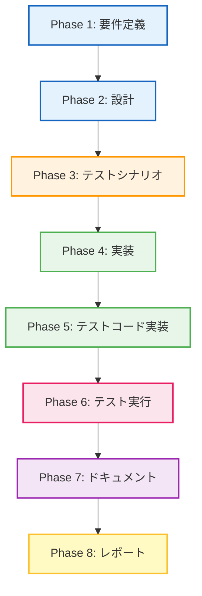

# プロジェクト計画書: dot_processor.py - Phase 2-1: UrnProcessorクラスの抽出

## Issue情報

- **Issue番号**: #461
- **タイトル**: [Refactor] dot_processor.py - Phase 2-1: UrnProcessorクラスの抽出
- **親Issue**: #448
- **依存Issue**: #460 (Phase 1: 基盤整備)
- **状態**: open
- **URL**: https://github.com/tielec/infrastructure-as-code/issues/461

## 1. Issue分析

### 複雑度: 中程度

**判定根拠**:
- 新規ファイル作成: `urn_processor.py`（クラス抽出型リファクタリング）
- 既存ファイル修正: `dot_processor.py`（URNパースロジックの削除と呼び出し変更）
- 新規テストファイル作成: `test_urn_processor.py`
- 既存テストの更新が必要（`test_dot_processor.py`）
- 依存Issue #460で構築されたテストインフラを活用可能
- 単一責務の明確なクラス抽出（URN/URI処理に特化）
- 複雑なロジックの移行（URNパース、URI正規化、コンポーネント抽出）

### 見積もり工数: 10~14時間

**工数内訳**:
- Phase 1 (要件定義): 1.5~2時間
  - URNパースロジックの責務分析
  - 抽出対象メソッドの特定
  - インターフェース設計の準備
- Phase 2 (設計): 2~3時間
  - `UrnProcessor`クラスのインターフェース設計
  - `DotFileProcessor`からの分離戦略
  - 後方互換性の検討
- Phase 3 (テストシナリオ): 1.5~2時間
  - 新規テストケースの設計
  - 既存テストの更新計画
- Phase 4 (実装): 2.5~3.5時間
  - `urn_processor.py`の実装
  - `dot_processor.py`の修正
- Phase 5 (テストコード実装): 1.5~2時間
  - `test_urn_processor.py`の実装
  - 既存テストの更新
- Phase 6 (テスト実行): 0.5~1時間
  - 全テストの実行と検証
  - カバレッジ測定（80%以上）
- Phase 7 (ドキュメント): 0.5~1時間
  - クラス分割ドキュメントの作成
  - インターフェースドキュメントの更新
- Phase 8 (レポート): 0.5~0.5時間
  - Phase 2-1完了レポートの作成

### リスク評価: 中

**リスク要因**:
- **既存コードへの影響**: `DotFileProcessor`の複数メソッドから呼び出されているロジックの抽出
- **テストの網羅性**: 抽出後の`UrnProcessor`単独での動作保証
- **統合テストの必要性**: `DotFileProcessor`と`UrnProcessor`間の統合が正常に動作するか
- **カバレッジ維持**: クラス分割後も全体で80%以上のカバレッジを維持

## 2. 実装戦略判断

### 実装戦略: REFACTOR

**判断根拠**:
- **クラス抽出型リファクタリング**: 既存の`DotFileProcessor`からURN処理の責務を新規クラス`UrnProcessor`に分離
- **既存コードの構造改善**: 単一責務の原則（SRP）に基づくクラス分割
- **機能追加なし**: 外部から見た振る舞いは変更されない（内部構造のみ変更）
- **テストによる安全網**: Phase 1で構築されたテストインフラを活用し、リファクタリングの正当性を保証

**抽出対象メソッド**:
- `parse_urn()`: URNをパースして構成要素を抽出
- `_parse_provider_type()`: プロバイダータイプ文字列を解析
- `create_readable_label()`: URN情報から読みやすいラベルを生成
- `_format_resource_type()`: リソースタイプを読みやすい形式にフォーマット
- `is_stack_resource()`: スタックリソースかどうかを判定

**残すメソッド（`DotFileProcessor`）**:
- `is_empty_graph()`: グラフ検証
- `apply_graph_styling()`: グラフスタイル適用
- `_enhance_pulumi_graph()`: Pulumi生成グラフの拡張
- その他のDOT処理関連メソッド

### テスト戦略: UNIT_INTEGRATION

**判断根拠**:
- **ユニットテスト（新規）**: `UrnProcessor`単独での動作を検証
  - 全公開メソッドのテスト
  - エッジケース（不正なURN、空文字列等）の検証
  - カバレッジ80%以上を目標
- **インテグレーションテスト（既存テスト活用）**: `DotFileProcessor`が`UrnProcessor`を正しく使用しているか検証
  - 既存の`test_dot_processor.py`のテストが引き続きパスすること
  - `DotFileProcessor`と`UrnProcessor`間の統合が正常に動作すること
  - エンドツーエンドの振る舞いが変わっていないことを確認

**BDD不要の理由**:
- ユーザーストーリーではなく、技術的なリファクタリング
- 外部から見た振る舞いは変更されない

### テストコード戦略: BOTH_TEST

**判断根拠**:
- **CREATE_TEST（新規テストファイル）**: `test_urn_processor.py`を新規作成
  - `UrnProcessor`単独のユニットテスト
  - 全公開メソッドの網羅的テスト
  - エッジケースのテスト
- **EXTEND_TEST（既存テストの更新）**: `test_dot_processor.py`を更新
  - `DotFileProcessor`のテストを継続実行（統合テストとして機能）
  - `UrnProcessor`の呼び出し部分のテストを追加（必要に応じて）
  - 既存のテストケースは維持（振る舞い変更がないため）

## 3. 影響範囲分析

### 既存コードへの影響: 中程度

**変更ファイル**:
1. **新規作成**: `jenkins/jobs/pipeline/infrastructure/pulumi-stack-action/src/urn_processor.py`
   - `UrnProcessor`クラスの実装
   - URN/URI処理ロジックの集約
2. **修正**: `jenkins/jobs/pipeline/infrastructure/pulumi-stack-action/src/dot_processor.py`
   - URN処理メソッドの削除
   - `UrnProcessor`のインポート追加
   - `UrnProcessor`の呼び出しへの置き換え

**影響を受けるメソッド（`DotFileProcessor`）**:
- `_process_node_definition()`: `parse_urn()`の呼び出し → `UrnProcessor.parse_urn()`に変更
- `_generate_resource_node_attributes()`: `create_readable_label()`の呼び出し → `UrnProcessor.create_readable_label()`に変更
- `_shorten_pulumi_label()`: `parse_urn()`, `create_readable_label()`, `is_stack_resource()`の呼び出し → `UrnProcessor`のメソッドに変更

### 依存関係の変更: 新規モジュール依存の追加

**新規依存関係**:
- `dot_processor.py` → `urn_processor.py`（新規）

**既存の依存関係**:
- 変更なし（`re`, `typing`等の標準ライブラリ依存は維持）

### マイグレーション要否: なし

**理由**:
- 内部構造のみの変更（外部APIは変更されない）
- データベーススキーマ変更なし
- 設定ファイル変更なし
- 外部から見た`DotFileProcessor`のインターフェースは維持

### 影響を受ける可能性のあるコンポーネント

**直接影響**:
- `jenkins/jobs/pipeline/infrastructure/pulumi-stack-action/src/dot_processor.py`（修正）
- `jenkins/jobs/pipeline/infrastructure/pulumi-stack-action/tests/test_dot_processor.py`（統合テストとして継続）

**間接影響**:
- `jenkins/jobs/pipeline/infrastructure/pulumi-stack-action/src/report_generator.py`（`dot_processor.py`を使用している可能性）
- `jenkins/jobs/pipeline/infrastructure/pulumi-stack-action/src/graph_processor.py`（`dot_processor.py`を使用している可能性）

**影響なし**:
- 外部から`DotFileProcessor`を使用しているコード（インターフェースが維持されるため）

## 4. タスク分割

### Phase 1: 要件定義 (見積もり: 1.5~2h)

- [x] Task 1-1: URN処理ロジックの抽出範囲の特定 (0.5~0.75h)
  - `dot_processor.py`内のURN関連メソッドをリストアップ
  - 抽出対象メソッドと残すメソッドの明確化
  - 依存関係マップの作成（メソッド間の呼び出し関係）
  - 抽出によるメリットの明確化

- [x] Task 1-2: `UrnProcessor`クラスの責務定義 (0.5~0.75h)
  - URNパース（Pulumi URN形式の解析）
  - URI正規化（URN情報の正規化と整形）
  - コンポーネント抽出（プロバイダー、モジュール、タイプ、名前の抽出）
  - ラベル生成（読みやすいラベルの生成）
  - リソース判定（スタックリソースの判定等）

- [x] Task 1-3: インターフェース要件の洗い出し (0.5~0.5h)
  - 公開メソッドのシグネチャ設計
  - 入力形式の定義（URN文字列、URN情報辞書等）
  - 出力形式の定義（辞書、文字列、bool等）
  - エラーハンドリング方針（不正なURNの扱い）

### Phase 2: 設計 (見積もり: 2~3h)

- [x] Task 2-1: `UrnProcessor`クラスの詳細設計 (1~1.5h)
  - クラス構造の設計（静的メソッド vs インスタンスメソッド）
  - メソッドシグネチャの確定
  - 型ヒントの設計（`Dict[str, str]`, `str`, `bool`等）
  - ドキュメント文字列の設計
  - エッジケース処理の設計（空URN、不正フォーマット等）

- [x] Task 2-2: `DotFileProcessor`の修正設計 (0.75~1h)
  - `UrnProcessor`のインポート戦略
  - メソッド呼び出しの置き換え設計
  - 後方互換性の検討（外部インターフェースの維持）
  - テストへの影響分析

- [x] Task 2-3: テストアーキテクチャ設計 (0.25~0.5h)
  - `test_urn_processor.py`の構造設計
  - フィクスチャの再利用戦略（`conftest.py`の活用）
  - 統合テストの設計（既存`test_dot_processor.py`の活用）
  - カバレッジ目標の設定（80%以上）

### Phase 3: テストシナリオ (見積もり: 1.5~2h)

- [ ] Task 3-1: `UrnProcessor`のテストシナリオ設計 (1~1.5h)
  - `parse_urn()`: 正常系（AWS, Azure, GCP, Kubernetes URN）、異常系（不正フォーマット、空文字列）
  - `_parse_provider_type()`: プロバイダータイプ解析の検証
  - `create_readable_label()`: ラベル生成の検証（モジュールあり/なし、長いタイプ名）
  - `_format_resource_type()`: タイプ名フォーマットの検証
  - `is_stack_resource()`: スタックリソース判定の検証
  - エッジケース: 極端に長いURN、特殊文字、境界値テスト

- [ ] Task 3-2: 統合テストシナリオ設計 (0.5~0.5h)
  - `test_dot_processor.py`の既存テストが引き続きパスすること
  - `DotFileProcessor`と`UrnProcessor`の統合動作の検証
  - エンドツーエンドのDOT生成が正常に動作すること

### Phase 4: 実装 (見積もり: 2.5~3.5h)

- [x] Task 4-1: `urn_processor.py`の実装 (1.5~2h)
  - ファイルヘッダーの作成（モジュールドキュメント）
  - `UrnProcessor`クラスの定義
  - `parse_urn()`の実装（`DotFileProcessor`から移行）
  - `_parse_provider_type()`の実装（`DotFileProcessor`から移行）
  - `create_readable_label()`の実装（`DotFileProcessor`から移行）
  - `_format_resource_type()`の実装（`DotFileProcessor`から移行）
  - `is_stack_resource()`の実装（`DotFileProcessor`から移行）
  - 型ヒントの追加
  - ドキュメント文字列の記載

- [x] Task 4-2: `dot_processor.py`の修正 (1~1.5h)
  - `from urn_processor import UrnProcessor`のインポート追加
  - URN関連メソッドの削除
  - `UrnProcessor`の呼び出しへの置き換え
    - `parse_urn()` → `UrnProcessor.parse_urn()`
    - `create_readable_label()` → `UrnProcessor.create_readable_label()`
    - `is_stack_resource()` → `UrnProcessor.is_stack_resource()`
  - コードの整合性確認（インポート、型ヒント等）

### Phase 5: テストコード実装 (見積もり: 1.5~2h)

- [x] Task 5-1: `test_urn_processor.py`の実装 (1~1.5h)
  - ファイルヘッダーの作成
  - テストクラスの構成設計
    - `TestUrnProcessorParsing`: URNパースのテスト
    - `TestUrnProcessorLabelCreation`: ラベル生成のテスト
    - `TestUrnProcessorResourceIdentification`: リソース判定のテスト
  - 各テストケースの実装（正常系、異常系、エッジケース）
  - `conftest.py`のフィクスチャ活用
  - アサーションの実装

- [x] Task 5-2: 既存テスト（`test_dot_processor.py`）の検証 (0.5~0.5h)
  - 既存テストが引き続きパスすることを確認
  - 必要に応じてテストを調整（インポートエラー等の修正）
  - 統合テストとしての意義を確認

### Phase 6: テスト実行 (見積もり: 0.5~1h)

- [ ] Task 6-1: 全テストの実行 (0.25~0.5h)
  - `test_urn_processor.py`の実行
  - `test_dot_processor.py`の実行（統合テストとして）
  - 全テストがパスすることを確認
  - テストの安定性確認（複数回実行）

- [ ] Task 6-2: カバレッジ測定 (0.25~0.5h)
  - `urn_processor.py`のカバレッジ測定（80%以上を確認）
  - `dot_processor.py`のカバレッジ維持確認
  - 全体カバレッジレポートの生成
  - 未カバー箇所の分析

### Phase 7: ドキュメント (見積もり: 0.5~1h)

- [ ] Task 7-1: クラス分割ドキュメントの作成 (0.25~0.5h)
  - リファクタリング記録の作成
  - 抽出したクラスの責務説明
  - 設計判断の記録
  - 影響範囲の記録

- [ ] Task 7-2: インターフェースドキュメントの更新 (0.25~0.5h)
  - `UrnProcessor`のAPIドキュメント作成
  - `DotFileProcessor`のAPIドキュメント更新
  - 使用例の追加

### Phase 8: レポート (見積もり: 0.5~0.5h)

- [ ] Task 8-1: Phase 2-1完了レポートの作成 (0.5~0.5h)
  - 達成事項のサマリー
  - カバレッジレポートの添付
  - 発見した問題点の記録
  - Phase 2-2への引き継ぎ事項

## 5. 依存関係

### フェーズ間の依存関係詳細

- **Phase 1 → Phase 2**: 抽出対象メソッドと責務を明確化した上で、クラス設計を行う
- **Phase 2 → Phase 3**: 設計されたクラス構造を基にテストシナリオを作成
- **Phase 3 → Phase 4**: テストシナリオを基に実装を行う（TDD的アプローチ）
- **Phase 4 → Phase 5**: 実装されたコードに対してテストコードを作成
- **Phase 5 → Phase 6**: テストコードを実行して検証
- **Phase 6 → Phase 7**: テスト結果を基にドキュメントを作成
- **Phase 7 → Phase 8**: ドキュメントを含めた完了レポートを作成

### タスク間の依存関係

- **Task 4-1（urn_processor.py実装）→ Task 4-2（dot_processor.py修正）**: `UrnProcessor`が実装されてから`DotFileProcessor`の修正が可能
- **Task 4-2 → Task 5-2（既存テスト検証）**: `DotFileProcessor`の修正が完了してから既存テストを実行

## 6. リスクと軽減策

### リスク1: 既存テストが失敗する

- **影響度**: 高
- **確率**: 中
- **軽減策**:
  - Phase 1で構築された特性テストを活用し、振る舞い変更を早期検出
  - 小さな単位でリファクタリングを進める（メソッド単位）
  - 各ステップでテストを実行して即座に問題を特定
  - コミットを細かく行い、問題発生時に巻き戻し可能にする

### リスク2: `UrnProcessor`のカバレッジ不足

- **影響度**: 中
- **確率**: 中
- **軽減策**:
  - Phase 3でテストシナリオを網羅的に設計
  - カバレッジ測定を頻繁に実施（Phase 6で確認）
  - エッジケースを優先的にテスト
  - `conftest.py`のフィクスチャを活用してテストデータ準備を効率化

### リスク3: インターフェース設計の不備

- **影響度**: 中
- **確率**: 低
- **軽減策**:
  - Phase 2で詳細設計を十分に行う
  - 型ヒントを活用して入出力を明確化
  - ドキュメント文字列で仕様を明記
  - コードレビューでインターフェースを検証

### リスク4: `DotFileProcessor`との統合問題

- **影響度**: 高
- **確率**: 低
- **軽減策**:
  - 既存の`test_dot_processor.py`を統合テストとして活用
  - Phase 6で統合テストを徹底的に実行
  - エンドツーエンドのDOT生成フローを検証
  - 問題発生時は即座にロールバック可能にする

### リスク5: 後続フェーズへの影響

- **影響度**: 中
- **確率**: 低
- **軽減策**:
  - Phase 2-1を独立した単位として完結させる
  - Phase 2-2以降に依存しない設計にする
  - 引き継ぎドキュメントを明確に記載
  - 問題点や改善点をレポートに記録

### リスク6: 実装工数のオーバー

- **影響度**: 低
- **確率**: 中
- **軽減策**:
  - タスク粒度を細かくして進捗を可視化
  - 各タスクで見積もりと実績を記録
  - ブロッカーが発生した場合は早期にエスカレーション
  - 優先度の低いタスクは後回し（ドキュメント整備等）

## 7. 品質ゲート

### Phase 1: 要件定義

- [x] URN処理ロジックの抽出範囲が明確に定義されている
- [x] `UrnProcessor`クラスの責務が明確に記載されている
- [x] 抽出対象メソッドと残すメソッドがリストアップされている
- [x] インターフェース要件が洗い出されている
- [x] 依存関係マップが作成されている

### Phase 2: 設計

- [x] 実装戦略の判断根拠が明記されている（REFACTOR）
- [x] テスト戦略の判断根拠が明記されている（UNIT_INTEGRATION）
- [x] テストコード戦略の判断根拠が明記されている（BOTH_TEST）
- [x] `UrnProcessor`クラスの詳細設計が完了している
- [x] メソッドシグネチャが確定している
- [x] 型ヒントが設計されている
- [x] `DotFileProcessor`の修正設計が完了している
- [x] 後方互換性が考慮されている

### Phase 3: テストシナリオ

- [ ] `UrnProcessor`の全公開メソッドのテストシナリオが定義されている
- [ ] 正常系、異常系、エッジケースのシナリオが網羅されている
- [ ] 統合テストシナリオが定義されている
- [ ] アサーション戦略が明確である
- [ ] テストデータ準備方針が定義されている

### Phase 4: 実装

- [ ] `urn_processor.py`が実装されている
- [ ] 全メソッドに型ヒントが付与されている
- [ ] 全メソッドにドキュメント文字列が記載されている
- [ ] `dot_processor.py`が修正されている
- [ ] URN関連メソッドが削除されている
- [ ] `UrnProcessor`の呼び出しが正しく置き換えられている
- [ ] コードがPEP 8準拠である

### Phase 5: テストコード実装

- [x] `test_urn_processor.py`が実装されている
- [x] 全公開メソッドのテストが実装されている
- [x] エッジケースのテストが実装されている
- [x] 既存テスト（`test_dot_processor.py`）が正常に動作する
- [x] テストコードにドキュメント文字列が記載されている

### Phase 6: テスト実行

- [ ] 全テスト（新規 + 既存）がパスしている
- [ ] `urn_processor.py`のカバレッジが80%以上である
- [ ] 全体カバレッジが80%以上を維持している
- [ ] テストが安定している（複数回実行で同じ結果）
- [ ] カバレッジレポート（HTML）が生成されている

### Phase 7: ドキュメント

- [ ] クラス分割ドキュメントが作成されている
- [ ] 抽出したクラスの責務が記載されている
- [ ] 設計判断が記録されている
- [ ] `UrnProcessor`のAPIドキュメントが作成されている
- [ ] `DotFileProcessor`のAPIドキュメントが更新されている

### Phase 8: レポート

- [ ] Phase 2-1完了レポートが作成されている
- [ ] 達成事項が明確に記載されている
- [ ] カバレッジレポートが添付されている
- [ ] 発見した問題点が記録されている
- [ ] Phase 2-2への引き継ぎ事項が明確である

## 8. テクニカルノート

### 抽出対象メソッドの詳細

**`DotFileProcessor`から抽出するメソッド**:

1. **`parse_urn(urn: str) -> Dict[str, str]`**
   - URNをパースして構成要素を抽出
   - 抽出する要素: stack, project, provider, module, type, name, full_urn
   - エラーハンドリング: 不正なURNの場合はデフォルト値を返す

2. **`_parse_provider_type(provider_type: str) -> Dict[str, str]`**
   - プロバイダータイプ文字列を解析
   - 抽出する要素: provider, module, type
   - エッジケース: コロンなし、モジュールなし

3. **`create_readable_label(urn_info: Dict[str, str]) -> str`**
   - URN情報から読みやすいラベルを生成
   - 改行区切りのラベル文字列を返す
   - モジュール名の有無に対応

4. **`_format_resource_type(resource_type: str) -> str`**
   - リソースタイプを読みやすい形式にフォーマット
   - 長いタイプ名の省略処理
   - キャメルケースの単語分割

5. **`is_stack_resource(urn: str) -> bool`**
   - スタックリソースかどうかを判定
   - `pulumi:pulumi:Stack`を含むかチェック

### クラス設計の方針

**`UrnProcessor`クラスの特徴**:
- **静的メソッド中心**: ステートレスな処理のため、`@staticmethod`を活用
- **型ヒント**: 全メソッドに型ヒントを付与（可読性向上、IDE補完）
- **ドキュメント文字列**: 各メソッドの仕様を明記
- **エラーハンドリング**: 不正な入力に対してもデフォルト値を返す（例外を投げない）

**`DotFileProcessor`の修正方針**:
- **インポート追加**: `from urn_processor import UrnProcessor`
- **メソッド削除**: URN関連メソッドをすべて削除
- **呼び出し置き換え**: `self.parse_urn()` → `UrnProcessor.parse_urn()`
- **インターフェース維持**: 外部から見た振る舞いは変更しない

### テスト戦略の詳細

**ユニットテスト（`test_urn_processor.py`）**:
- **テストクラス構成**:
  - `TestUrnProcessorParsing`: URNパースのテスト
  - `TestUrnProcessorLabelCreation`: ラベル生成のテスト
  - `TestUrnProcessorResourceIdentification`: リソース判定のテスト
- **カバレッジ目標**: 80%以上
- **フィクスチャ活用**: `conftest.py`の`sample_urns`フィクスチャを活用

**統合テスト（既存`test_dot_processor.py`）**:
- **役割**: `DotFileProcessor`と`UrnProcessor`の統合動作を検証
- **期待動作**: 既存のテストケースが引き続きパスすること
- **追加テスト**: 必要に応じて統合テストケースを追加

### カバレッジ目標の根拠

**80%以上を目標とする理由**:
- Phase 1で達成したカバレッジレベルを維持
- 新規クラス（`UrnProcessor`）の全公開メソッドをカバー
- リファクタリングの安全性を保証

**カバレッジ対象**:
- `urn_processor.py`: 80%以上（全公開メソッド100%、プライベートメソッド70%以上）
- `dot_processor.py`: Phase 1と同等以上のカバレッジを維持

## 9. 完了条件

### Phase 2-1全体の完了条件（Issue #461の完了条件）

- [ ] `UrnProcessor`クラスが単独で動作すること
- [ ] 単体テストのカバレッジが80%以上であること
- [ ] 既存の統合テスト（`test_dot_processor.py`）が全てパスすること
- [ ] `DotFileProcessor`から`UrnProcessor`への呼び出しが正しく動作すること
- [ ] エンドツーエンドのDOT生成フローが正常に動作すること
- [ ] カバレッジレポートが生成されていること
- [ ] クラス分割ドキュメントが作成されていること
- [ ] 全品質ゲートを満たしていること

### 各フェーズの完了条件

各フェーズの完了条件は、セクション「7. 品質ゲート」を参照してください。

## 10. 次フェーズへの引き継ぎ

### Phase 2-2（次のリファクタリング）への準備

Phase 2-1完了後、以下の成果物をPhase 2-2に引き継ぎます：

1. **新規クラス**: `UrnProcessor`（URN/URI処理に特化）
2. **テストコード**: `test_urn_processor.py`（ユニットテスト）
3. **カバレッジレポート**: `urn_processor.py`のカバレッジ分析結果
4. **リファクタリング記録**: クラス分割の設計判断と影響範囲
5. **発見した問題点**: 次のリファクタリング対象候補

### Phase 2-2で実施すべき事項（予想）

- 次のクラス抽出（例: `DotStyleProcessor`）
- 残りの`DotFileProcessor`のリファクタリング
- 複雑度の低減（Cyclomatic Complexity削減）
- コメントと型ヒントの充実化

---

**作成日**: 2025-01-19
**最終更新**: 2025-01-19
**作成者**: Claude Code (AI Workflow Phase 0)
**レビュー状態**: 未レビュー
