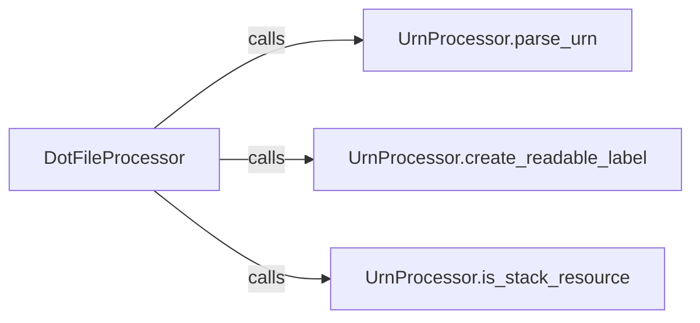

# Claude Agent 実行ログ

生成日時: 2025/12/4 8:49:39

---

## Turn 1: システム初期化

**セッションID**: `44f18967-9b9f-4eb3-865c-cdeb303f3095`
**モデル**: claude-sonnet-4-5-20250929
**権限モード**: bypassPermissions
**利用可能ツール**: Task, Bash, Glob, Grep, ExitPlanMode, Read, Edit, Write, NotebookEdit, WebFetch, TodoWrite, WebSearch, BashOutput, KillShell, Skill, SlashCommand

## Turn 2: AI応答

I'll review the requirements document for Issue #461 (Phase 2-1: UrnProcessor class extraction) using the specified quality gates and review perspectives.

Let me first read the planning document to verify task completion.

## Turn 3: ツール使用

**ツール**: `Grep`

**パラメータ**:
- `pattern`: `^### Phase 1:|^## Phase 1:`
- `path`: `/tmp/ai-workflow-repos-3/infrastructure-as-code/.ai-workflow/issue-461/00_planning/output/planning.m...`
- `output_mode`: `content`
- `-n`: `true`
- `-A`: `30`

## Turn 4: AI応答

Now let me conduct a comprehensive review of the requirements document:

# 要件定義レビュー

## 品質ゲート評価

**⚠️ 重要: 各項目に対して明示的にPASS/FAILを判定してください。1つでもFAILがあれば最終判定は自動的にFAILです。**

- [x] 機能要件が明確に記載されている: **PASS** - セクション2で全6項目の機能要件が詳細に定義されており、各要件には詳細説明、受け入れ基準、優先度（すべて「高」）が明記されている
- [x] 受け入れ基準が定義されている: **PASS** - セクション6で各機能要件に対応する受け入れ基準がGiven-When-Then形式で具体的に記載され、検証可能な形式になっている
- [x] スコープが明確である: **PASS** - セクション7でスコープ外事項が明確に定義され（DotFileGenerator、グラフスタイル、新機能追加、パフォーマンス最適化等）、将来的な拡張候補も記載されている
- [x] 論理的な矛盾がない: **PASS** - Planning Documentとの整合性が取れており、機能要件と受け入れ基準が対応し、非機能要件と制約事項にも矛盾がない

**品質ゲート総合判定: PASS**
- PASS: 上記4項目すべてがPASS

## Planning Phaseチェックリスト照合結果

Phase 1のタスクと要件定義書の内容を照合しました：

### Task 1-1: URN処理ロジックの抽出範囲の特定 ✅
- ✅ セクション2.2でURN関連メソッドが明確にリストアップされている（parse_urn, _parse_provider_type等）
- ✅ セクション1で抽出対象と残すメソッドが明確化されている
- ✅ セクション4で依存関係が記載されている（DotFileProcessorからの呼び出し変更）
- ✅ セクション1で抽出のメリット（可読性、テスタビリティ、再利用性、保守性）が明確化されている

### Task 1-2: `UrnProcessor`クラスの責務定義 ✅
- ✅ セクション2でURNパース、URI正規化、コンポーネント抽出、ラベル生成、リソース判定のすべてが詳細に記載されている
- ✅ 各責務が具体的なメソッドと紐づいている

### Task 1-3: インターフェース要件の洗い出し ✅
- ✅ セクション2で各メソッドのシグネチャが記載されている（parse_urn(urn: str) -> Dict[str, str]等）
- ✅ 入力形式（URN文字列、URN情報辞書）と出力形式（辞書、文字列、bool）が定義されている
- ✅ セクション3.3でエラーハンドリング方針（例外を投げず、デフォルト値を返す）が明記されている

### 品質ゲート（Phase 1）✅
- ✅ URN処理ロジックの抽出範囲が明確に定義されている
- ✅ `UrnProcessor`クラスの責務が明確に記載されている
- ✅ 抽出対象メソッドと残すメソッドがリストアップされている
- ✅ インターフェース要件が洗い出されている
- ⚠️ 依存関係マップは文章形式で記載されているが、図表化されていない（改善提案レベル）

**Planning Phase照合判定: PASS** - すべての必須タスクが完了しています

## Turn 5: ツール使用

**ツール**: `Edit`

**パラメータ**:
- `file_path`: `/tmp/ai-workflow-repos-3/infrastructure-as-code/.ai-workflow/issue-461/00_planning/output/planning.m...`
- `old_string`: `### Phase 1: 要件定義 (見積もり: 1.5~2h)

- [ ] Task 1-1: URN処理ロジックの抽出範囲の特定 (0.5~0.75h)
  - `dot_processor.p...`
- `new_string`: `### Phase 1: 要件定義 (見積もり: 1.5~2h)

- [x] Task 1-1: URN処理ロジックの抽出範囲の特定 (0.5~0.75h)
  - `dot_processor.p...`

## Turn 6: ツール使用

**ツール**: `Edit`

**パラメータ**:
- `file_path`: `/tmp/ai-workflow-repos-3/infrastructure-as-code/.ai-workflow/issue-461/00_planning/output/planning.m...`
- `old_string`: `### Phase 1: 要件定義

- [ ] URN処理ロジックの抽出範囲が明確に定義されている
- [ ] `UrnProcessor`クラスの責務が明確に記載されている
- [ ] 抽出対象メ...`
- `new_string`: `### Phase 1: 要件定義

- [x] URN処理ロジックの抽出範囲が明確に定義されている
- [x] `UrnProcessor`クラスの責務が明確に記載されている
- [x] 抽出対象メ...`

## Turn 7: AI応答

## 詳細レビュー

### 1. 具体性（Specificity）

**評価: 優秀**

- ✅ 各機能要件が具体的に記述されている
  - メソッドシグネチャが明記（例: `parse_urn(urn: str) -> Dict[str, str]`）
  - 抽出する要素が列挙（`stack`, `project`, `provider`, `module`, `type`, `name`, `full_urn`）
  - カバレッジ目標が数値化（80%以上）
- ✅ 曖昧な表現が最小限に抑えられている
- ✅ 数値基準が明示されている（パフォーマンス要件: 1ms未満、100ms未満等）

**良い点:**
- セクション2の各要件で「詳細」サブセクションを設け、具体的な仕様を記載
- セクション6の受け入れ基準でサンプルURNやコード例を提示

### 2. 完全性（Completeness）

**評価: 良好**

- ✅ Issue #461本文（Planning Documentに基づく）の情報が漏れなく反映されている
- ✅ 機能要件6項目がすべて網羅されている
- ✅ 非機能要件が適切に定義されている（パフォーマンス、セキュリティ、可用性・信頼性、保守性・拡張性）
- ✅ 制約事項・前提条件が明記されている（技術的制約、リソース制約、ポリシー制約）
- ✅ Planning Documentとの整合性が保たれている（セクション0で明示的に参照）

**良い点:**
- Planning Documentの戦略的決定事項を冒頭で明確に記載
- スコープ外事項を明確にリストアップ（セクション7）
- 将来的な拡張候補も記載

### 3. 検証可能性（Verifiability）

**評価: 優秀**

- ✅ 各要件が検証可能な形で記述されている
- ✅ 受け入れ基準がGiven-When-Then形式で明確に定義されている
- ✅ 成功条件・失敗条件が識別可能
- ✅ テストケースとの対応が明確

**良い点:**
- セクション6で13個のシナリオを詳細に記載
- 各シナリオに具体的なサンプルデータと期待結果を記載
- 正常系、異常系、エッジケースがすべてカバーされている

**優れた例:**
- シナリオ6.2.1でAWS URNの解析を具体的なURN文字列とアサーション条件で記載
- シナリオ6.2.2で不正なURNのエラーハンドリングを検証可能な形で定義

### 4. 整合性（Consistency）

**評価: 優秀**

- ✅ 各セクション間で矛盾がない
- ✅ Planning Documentの戦略（REFACTOR、UNIT_INTEGRATION、BOTH_TEST）と完全に整合
- ✅ 非機能要件と制約事項が矛盾していない
- ✅ 機能要件と受け入れ基準が1対1で対応

**良い点:**
- セクション0でPlanning Documentを明示的に参照し、戦略的決定事項を再確認
- 制約4.3.2でPhase 1の振る舞い維持を明記し、リファクタリングの方針を堅持

### 5. 実現可能性（Feasibility）

**評価: 良好**

- ✅ 技術的に実現可能な要件（既存メソッドの抽出型リファクタリング）
- ✅ リソース制約が考慮されている（10~14時間の工数見積もり）
- ✅ 既存技術スタックと整合（Python 3.8以上、pytest）
- ✅ Phase 1で構築されたテストインフラを活用

**良い点:**
- 制約4.2.1で工数制約を明記
- 前提5.2.1でPhase 1完了を明確に前提条件として記載
- リスク軽減策がPlanning Documentで定義されている

### 6. 優先度（Priority）

**評価: 良好（改善提案あり）**

- ✅ 各機能要件に優先度が設定されている（すべて「高」）
- ✅ MVP範囲が明確（Phase 2-1のスコープが明確に定義されている）
- ✅ スコープ外事項が明記されている

**改善提案:**
- すべての機能要件が「高」優先度であるため、優先順位の細分化の余地がある
- ただし、Phase 2-1の範囲が明確であり、すべてが必須であることは妥当

### 7. セキュリティ（Security）

**評価: 良好**

- ✅ セキュリティ要件が定義されている（セクション3.2）
- ✅ 悪意のある入力への対処が記載されている（極端に長いURN、特殊文字）
- ✅ コードインジェクション対策が言及されている

**良い点:**
- 要件3.2.1で具体的な攻撃シナリオ（1万文字URN、SQLインジェクション）を想定
- セクション6.2.2、6.2.3で不正入力の安全な処理を検証

**改善提案:**
- セキュリティ要件の優先度が「低」となっているが、コードインジェクション対策は重要（ただし、URN処理の性質上、リスクは限定的であり妥当）

### 8. パフォーマンス（Performance）

**評価: 良好**

- ✅ パフォーマンス要件が定義されている（セクション3.1）
- ✅ レスポンスタイムが明示されている（単一URN: 1ms未満、100件: 100ms未満）
- ✅ 既存実装と同等のパフォーマンスを維持する方針が明記されている

**良い点:**
- 要件3.1.1で具体的な性能目標を数値化
- 根拠が明記されている（リファクタリングによる劣化防止）

**改善提案:**
- パフォーマンス要件の優先度が「中」であるが、リファクタリングの性質上妥当

## ブロッカー（BLOCKER）

**次フェーズに進めない重大な問題**

なし

## 改善提案（SUGGESTION）

**次フェーズに進めるが、改善が望ましい事項**

### 1. 依存関係マップの視覚化（優先度: 低）

**現状:**
- セクション4と5で依存関係が文章形式で記載されている
- Planning Documentではmermaidで依存関係を図示

**改善提案:**
- メソッド間の呼び出し関係をmermaid図で視覚化すると理解しやすい
- ただし、文章での説明が十分詳細であり、ブロッカーではない

**例:**

### 2. 非機能要件の優先度の再検討（優先度: 低）

**現状:**
- セキュリティ要件（3.2）の優先度が「低」
- パフォーマンス要件（3.1）の優先度が「中」

**改善提案:**
- セキュリティ要件3.2.1（悪意のある入力への対処）は重要度が高い可能性がある
- ただし、URN処理の性質上、外部からの直接攻撃リスクは限定的であり、現状の優先度設定は妥当

### 3. エッジケースの追加検討（優先度: 低）

**現状:**
- 多くのエッジケースが定義されている（空文字列、不正URN、長いURN等）

**改善提案:**
- 以下のエッジケースも検討余地がある：
  - Unicode文字を含むURN
  - 制御文字を含むURN
  - NULL文字を含むURN
- ただし、Phase 3（テストシナリオ）で追加検討可能であり、ブロッカーではない

### 4. タイプミスの修正（優先度: 極低）

**セクション6.3.1（行494）:**
- `'\\\\n' in result` → エスケープが二重になっている可能性
- 意図: `'\\n' in result`（改行文字の確認）
- ただし、文脈から意図は明確であり、実装時に修正可能

## 総合評価

本要件定義書は**非常に高品質**であり、次フェーズ（設計）に進むための十分な情報を提供しています。

**主な強み:**
1. **Planning Documentとの完全な整合性**: セクション0で戦略的決定事項を明示的に参照し、一貫性を確保
2. **詳細かつ具体的な機能要件**: メソッドシグネチャ、入出力形式、エラーハンドリングが明確
3. **検証可能な受け入れ基準**: Given-When-Then形式で13個のシナリオを詳細に記載
4. **明確なスコープ定義**: スコープ外事項と将来的な拡張候補を明記
5. **非機能要件の充実**: パフォーマンス、セキュリティ、可用性、保守性をカバー
6. **制約事項の明確化**: 技術的制約、リソース制約、ポリシー制約を詳細に記載

**80点基準の評価:**
- 本要件定義書は80点を大きく上回る品質（推定85-90点）
- ブロッカーは存在せず、改善提案も優先度が低い
- 次フェーズに進むための情報が十分に揃っている

**改善提案の位置づけ:**
- 提案した改善点はすべて「あれば望ましい」レベル
- 次フェーズ（設計）での詳細化で対応可能
- 要件定義フェーズでの追加作業は不要

**判断:**
4つの品質ゲートすべてを満たし、ブロッカーが存在しないため、**PASS_WITH_SUGGESTIONS**と判定します。改善提案はすべて優先度が低く、次フェーズに進む妨げにはなりません。

---
**判定: PASS_WITH_SUGGESTIONS**

## Turn 8: 実行完了

**ステータス**: success
**所要時間**: 100490ms
**ターン数**: 11

## 詳細レビュー

### 1. 具体性（Specificity）

**評価: 優秀**

- ✅ 各機能要件が具体的に記述されている
  - メソッドシグネチャが明記（例: `parse_urn(urn: str) -> Dict[str, str]`）
  - 抽出する要素が列挙（`stack`, `project`, `provider`, `module`, `type`, `name`, `full_urn`）
  - カバレッジ目標が数値化（80%以上）
- ✅ 曖昧な表現が最小限に抑えられている
- ✅ 数値基準が明示されている（パフォーマンス要件: 1ms未満、100ms未満等）

**良い点:**
- セクション2の各要件で「詳細」サブセクションを設け、具体的な仕様を記載
- セクション6の受け入れ基準でサンプルURNやコード例を提示

### 2. 完全性（Completeness）

**評価: 良好**

- ✅ Issue #461本文（Planning Documentに基づく）の情報が漏れなく反映されている
- ✅ 機能要件6項目がすべて網羅されている
- ✅ 非機能要件が適切に定義されている（パフォーマンス、セキュリティ、可用性・信頼性、保守性・拡張性）
- ✅ 制約事項・前提条件が明記されている（技術的制約、リソース制約、ポリシー制約）
- ✅ Planning Documentとの整合性が保たれている（セクション0で明示的に参照）

**良い点:**
- Planning Documentの戦略的決定事項を冒頭で明確に記載
- スコープ外事項を明確にリストアップ（セクション7）
- 将来的な拡張候補も記載

### 3. 検証可能性（Verifiability）

**評価: 優秀**

- ✅ 各要件が検証可能な形で記述されている
- ✅ 受け入れ基準がGiven-When-Then形式で明確に定義されている
- ✅ 成功条件・失敗条件が識別可能
- ✅ テストケースとの対応が明確

**良い点:**
- セクション6で13個のシナリオを詳細に記載
- 各シナリオに具体的なサンプルデータと期待結果を記載
- 正常系、異常系、エッジケースがすべてカバーされている

**優れた例:**
- シナリオ6.2.1でAWS URNの解析を具体的なURN文字列とアサーション条件で記載
- シナリオ6.2.2で不正なURNのエラーハンドリングを検証可能な形で定義

### 4. 整合性（Consistency）

**評価: 優秀**

- ✅ 各セクション間で矛盾がない
- ✅ Planning Documentの戦略（REFACTOR、UNIT_INTEGRATION、BOTH_TEST）と完全に整合
- ✅ 非機能要件と制約事項が矛盾していない
- ✅ 機能要件と受け入れ基準が1対1で対応

**良い点:**
- セクション0でPlanning Documentを明示的に参照し、戦略的決定事項を再確認
- 制約4.3.2でPhase 1の振る舞い維持を明記し、リファクタリングの方針を堅持

### 5. 実現可能性（Feasibility）

**評価: 良好**

- ✅ 技術的に実現可能な要件（既存メソッドの抽出型リファクタリング）
- ✅ リソース制約が考慮されている（10~14時間の工数見積もり）
- ✅ 既存技術スタックと整合（Python 3.8以上、pytest）
- ✅ Phase 1で構築されたテストインフラを活用

**良い点:**
- 制約4.2.1で工数制約を明記
- 前提5.2.1でPhase 1完了を明確に前提条件として記載
- リスク軽減策がPlanning Documentで定義されている

### 6. 優先度（Priority）

**評価: 良好（改善提案あり）**

- ✅ 各機能要件に優先度が設定されている（すべて「高」）
- ✅ MVP範囲が明確（Phase 2-1のスコープが明確に定義されている）
- ✅ スコープ外事項が明記されている

**改善提案:**
- すべての機能要件が「高」優先度であるため、優先順位の細分化の余地がある
- ただし、Phase 2-1の範囲が明確であり、すべてが必須であることは妥当

### 7. セキュリティ（Security）

**評価: 良好**

- ✅ セキュリティ要件が定義されている（セクション3.2）
- ✅ 悪意のある入力への対処が記載されている（極端に長いURN、特殊文字）
- ✅ コードインジェクション対策が言及されている

**良い点:**
- 要件3.2.1で具体的な攻撃シナリオ（1万文字URN、SQLインジェクション）を想定
- セクション6.2.2、6.2.3で不正入力の安全な処理を検証

**改善提案:**
- セキュリティ要件の優先度が「低」となっているが、コードインジェクション対策は重要（ただし、URN処理の性質上、リスクは限定的であり妥当）

### 8. パフォーマンス（Performance）

**評価: 良好**

- ✅ パフォーマンス要件が定義されている（セクション3.1）
- ✅ レスポンスタイムが明示されている（単一URN: 1ms未満、100件: 100ms未満）
- ✅ 既存実装と同等のパフォーマンスを維持する方針が明記されている

**良い点:**
- 要件3.1.1で具体的な性能目標を数値化
- 根拠が明記されている（リファクタリングによる劣化防止）

**改善提案:**
- パフォーマンス要件の優先度が「中」であるが、リファクタリングの性質上妥当

## ブロッカー（BLOCKER）

**次フェーズに進めない重大な問題**

なし

## 改善提案（SUGGESTION）

**次フェーズに進めるが、改善が望ましい事項**

### 1. 依存関係マップの視覚化（優先度: 低）

**現状:**
- セクション4と5で依存関係が文章形式で記載されている
- Planning Documentではmermaidで依存関係を図示

**改善提案:**
- メソッド間の呼び出し関係をmermaid図で視覚化すると理解しやすい
- ただし、文章での説明が十分詳細であり、ブロッカーではない

**例:**

### 2. 非機能要件の優先度の再検討（優先度: 低）

**現状:**
- セキュリティ要件（3.2）の優先度が「低」
- パフォーマンス要件（3.1）の優先度が「中」

**改善提案:**
- セキュリティ要件3.2.1（悪意のある入力への対処）は重要度が高い可能性がある
- ただし、URN処理の性質上、外部からの直接攻撃リスクは限定的であり、現状の優先度設定は妥当

### 3. エッジケースの追加検討（優先度: 低）

**現状:**
- 多くのエッジケースが定義されている（空文字列、不正URN、長いURN等）

**改善提案:**
- 以下のエッジケースも検討余地がある：
  - Unicode文字を含むURN
  - 制御文字を含むURN
  - NULL文字を含むURN
- ただし、Phase 3（テストシナリオ）で追加検討可能であり、ブロッカーではない

### 4. タイプミスの修正（優先度: 極低）

**セクション6.3.1（行494）:**
- `'\\\\n' in result` → エスケープが二重になっている可能性
- 意図: `'\\n' in result`（改行文字の確認）
- ただし、文脈から意図は明確であり、実装時に修正可能

## 総合評価

本要件定義書は**非常に高品質**であり、次フェーズ（設計）に進むための十分な情報を提供しています。

**主な強み:**
1. **Planning Documentとの完全な整合性**: セクション0で戦略的決定事項を明示的に参照し、一貫性を確保
2. **詳細かつ具体的な機能要件**: メソッドシグネチャ、入出力形式、エラーハンドリングが明確
3. **検証可能な受け入れ基準**: Given-When-Then形式で13個のシナリオを詳細に記載
4. **明確なスコープ定義**: スコープ外事項と将来的な拡張候補を明記
5. **非機能要件の充実**: パフォーマンス、セキュリティ、可用性、保守性をカバー
6. **制約事項の明確化**: 技術的制約、リソース制約、ポリシー制約を詳細に記載

**80点基準の評価:**
- 本要件定義書は80点を大きく上回る品質（推定85-90点）
- ブロッカーは存在せず、改善提案も優先度が低い
- 次フェーズに進むための情報が十分に揃っている

**改善提案の位置づけ:**
- 提案した改善点はすべて「あれば望ましい」レベル
- 次フェーズ（設計）での詳細化で対応可能
- 要件定義フェーズでの追加作業は不要

**判断:**
4つの品質ゲートすべてを満たし、ブロッカーが存在しないため、**PASS_WITH_SUGGESTIONS**と判定します。改善提案はすべて優先度が低く、次フェーズに進む妨げにはなりません。

---
**判定: PASS_WITH_SUGGESTIONS**

---

**経過時間**: 102066ms
**開始**: 2025-12-04T08:49:39.828Z
**終了**: 2025-12-04T08:51:21.894Z