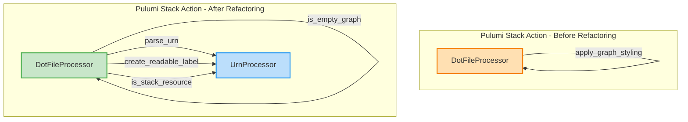
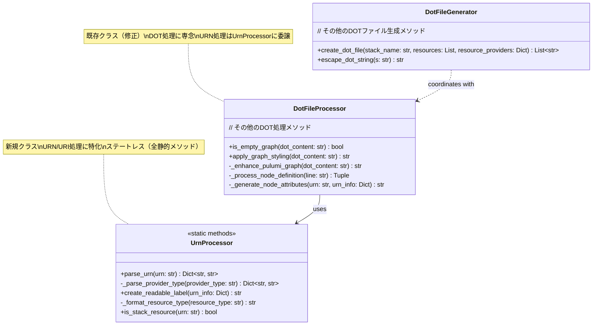
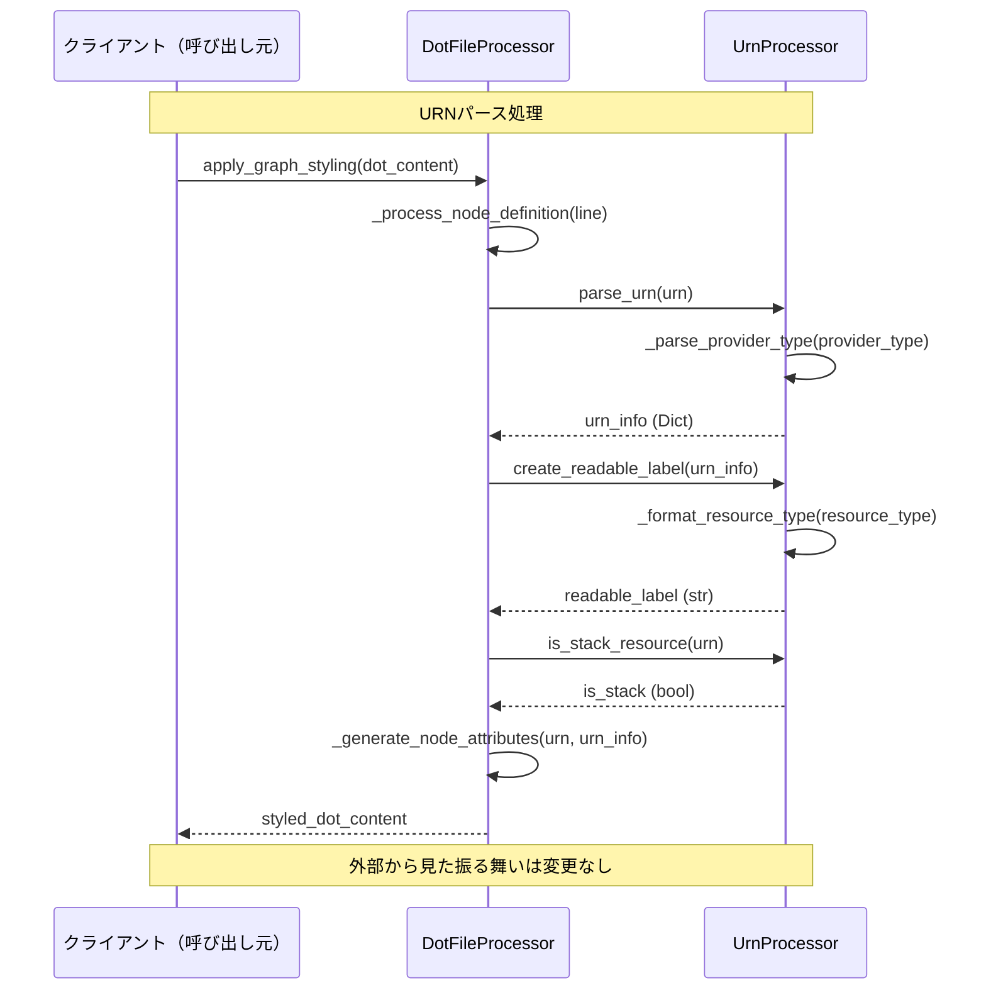
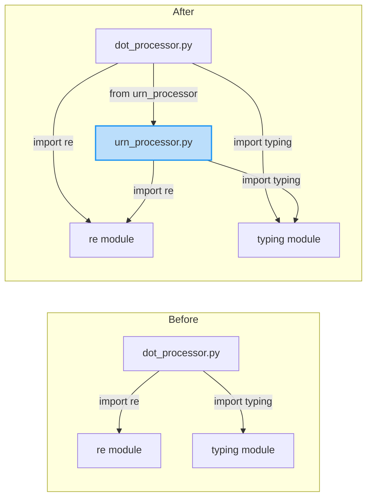

# 詳細設計書: dot_processor.py - Phase 2-1: UrnProcessorクラスの抽出

## ドキュメント情報

- **Issue番号**: #461
- **タイトル**: [Refactor] dot_processor.py - Phase 2-1: UrnProcessorクラスの抽出
- **親Issue**: #448
- **依存Issue**: #460 (Phase 1: 基盤整備)
- **作成日**: 2025-01-19
- **最終更新**: 2025-01-19
- **作成者**: AI Workflow Phase 2
- **レビュー状態**: 未レビュー

---

## 0. Planning PhaseとRequirements Phaseの確認

### 開発計画の全体像

Planning Document（`.ai-workflow/issue-461/00_planning/output/planning.md`）で策定された開発計画を踏まえて、本設計書を作成しています。

**主要な戦略的決定事項**:

1. **実装戦略**: REFACTOR（クラス抽出型リファクタリング）
   - 既存の`DotFileProcessor`からURN処理の責務を新規クラス`UrnProcessor`に分離
   - 単一責務の原則（SRP）に基づくクラス分割

2. **テスト戦略**: UNIT_INTEGRATION
   - ユニットテスト: `UrnProcessor`単独での動作検証（新規作成）
   - インテグレーションテスト: 既存の`test_dot_processor.py`を活用して統合動作を検証

3. **テストコード戦略**: BOTH_TEST
   - CREATE_TEST: `test_urn_processor.py`を新規作成
   - EXTEND_TEST: `test_dot_processor.py`を更新（統合テストとして継続）

4. **見積もり工数**: 10~14時間（Phase 2設計: 2~3時間）

### 要件定義書のサマリー

Requirements Document（`.ai-workflow/issue-461/01_requirements/output/requirements.md`）で定義された要件をサマリーします。

**機能要件**:
- 新規ファイル作成: `urn_processor.py`（`UrnProcessor`クラス）
- URNパースロジックの抽出（`parse_urn`, `_parse_provider_type`）
- URI正規化ロジックの移行（`create_readable_label`, `_format_resource_type`）
- コンポーネント抽出メソッドの実装（`is_stack_resource`）
- 単体テストの作成: `test_urn_processor.py`
- `DotFileProcessor`からの呼び出し部分の更新

**非機能要件**:
- パフォーマンス: 既存実装と同等（単一URNパース1ms未満）
- セキュリティ: 不正な入力を安全に処理（例外を投げない）
- 可用性: デフォルト値を返す（エラー時も処理継続）
- 保守性: 全メソッドに型ヒントとドキュメント文字列
- 拡張性: 静的メソッド中心のステートレス設計

**制約事項**:
- 既存の`DotFileProcessor`の公開APIを変更してはならない
- Phase 1で構築されたテストインフラを活用する
- Python 3.8以上に対応（`typing`モジュール使用）
- PEP 8コーディング規約に準拠
- 実装工数は10~14時間以内

---

## 1. 実装戦略判断（必須）

### 実装戦略: REFACTOR

**判断根拠**:

1. **クラス抽出型リファクタリング**
   - 既存の`DotFileProcessor`クラスからURN処理の責務を新規クラス`UrnProcessor`に分離する
   - 外部から見た振る舞いは完全に維持される（`DotFileProcessor`の公開APIは変更なし）
   - 既存コードの構造改善が主目的であり、機能追加ではない

2. **単一責務の原則（SRP）の適用**
   - 現在の`DotFileProcessor`は、DOT処理とURN処理の2つの責務を持っている
   - URN処理をUrnProcessorに分離することで、各クラスの責務が明確になる
   - これにより、テスタビリティ・再利用性・保守性が向上する

3. **既存コードへの影響範囲**
   - 新規ファイル作成: `urn_processor.py`（1ファイル）
   - 既存ファイル修正: `dot_processor.py`（URN関連メソッドの削除と呼び出し変更）
   - 新規テストファイル作成: `test_urn_processor.py`
   - 既存テストの更新: `test_dot_processor.py`（統合テストとして継続）

4. **テストによる安全網**
   - Phase 1で構築された特性テスト（Characterization Test）により、リファクタリングの正当性を保証できる
   - 既存の`test_dot_processor.py`が全てパスすることで、外部から見た振る舞いが変わっていないことを確認

5. **既存実装の移動のみ**
   - 既存の`DotFileProcessor`のメソッドを`UrnProcessor`に移動する
   - ロジックの変更は行わない（振る舞い保持）
   - インターフェースは既存のまま維持

**CREATEやEXTENDでない理由**:
- **CREATEではない理由**: 完全に新しい機能ではなく、既存コードの構造改善である
- **EXTENDではない理由**: 既存機能の拡張ではなく、責務の分離である

---

## 2. テスト戦略判断（必須）

### テスト戦略: UNIT_INTEGRATION

**判断根拠**:

1. **ユニットテスト（UNIT）が必要な理由**
   - 新規クラス`UrnProcessor`の全公開メソッドを独立してテストする必要がある
   - URNパースロジックの複雑性（AWS、Azure、GCP、Kubernetesなど複数プロバイダー対応）
   - エッジケース（不正なURN、空文字列、極端に長いURN等）の網羅的テストが必要
   - カバレッジ目標80%以上を達成するため、ユニットテストが不可欠

2. **インテグレーションテスト（INTEGRATION）が必要な理由**
   - `DotFileProcessor`と`UrnProcessor`間の統合が正常に動作することを検証
   - 既存の`test_dot_processor.py`を統合テストとして活用し、エンドツーエンドの振る舞いが変わっていないことを確認
   - リファクタリング後も既存のテストが全てパスすることで、外部インターフェースの維持を保証

3. **BDD不要の理由**
   - ユーザーストーリーではなく、技術的なリファクタリングである
   - エンドユーザーから見た振る舞いは変更されない
   - 内部構造の改善が目的であり、新規ユーザーシナリオは存在しない

4. **テストアーキテクチャの設計**
   - **新規ユニットテスト**: `test_urn_processor.py`
     - `UrnProcessor`単独のテスト
     - テストクラス構成:
       - `TestUrnProcessorParsing`: URNパースのテスト
       - `TestUrnProcessorLabelCreation`: ラベル生成のテスト
       - `TestUrnProcessorResourceIdentification`: リソース判定のテスト
   - **既存統合テスト**: `test_dot_processor.py`
     - `DotFileProcessor`のテストを継続実行
     - `UrnProcessor`の呼び出し部分のテストを追加（必要に応じて）
     - エンドツーエンドの振る舞い検証

5. **テストインフラの活用**
   - Phase 1で構築された`conftest.py`のフィクスチャ（`sample_urns`, `sample_resources`等）を再利用
   - テストデータの重複を最小化

**他の戦略を選択しない理由**:
- **UNIT_ONLYではない理由**: 統合動作の検証が不可欠（リファクタリングの安全性保証）
- **INTEGRATION_ONLYではない理由**: `UrnProcessor`単独のユニットテストがないと、エッジケースのカバレッジが不十分
- **BDD系戦略ではない理由**: ユーザーストーリーが存在しない技術的リファクタリングのため

---

## 3. テストコード戦略判断（必須）

### テストコード戦略: BOTH_TEST

**判断根拠**:

1. **CREATE_TEST（新規テストファイル作成）が必要な理由**
   - 新規クラス`UrnProcessor`の単体テストを作成する必要がある
   - 既存の`test_dot_processor.py`に追加すると、テストファイルが肥大化する
   - `UrnProcessor`のテストと`DotFileProcessor`のテストは責務が異なるため、ファイルを分離すべき
   - 新規テストファイル: `test_urn_processor.py`
     - `UrnProcessor`単独のユニットテスト
     - 全公開メソッドの網羅的テスト
     - エッジケースのテスト

2. **EXTEND_TEST（既存テストの更新）が必要な理由**
   - 既存の`test_dot_processor.py`を統合テストとして継続使用する
   - `DotFileProcessor`が`UrnProcessor`を正しく呼び出しているかを検証
   - リファクタリング後も既存のテストケースが全てパスすることで、振る舞い保持を保証
   - 必要に応じて、`UrnProcessor`の呼び出し部分のテストを追加

3. **両方が必要な理由**
   - **ユニットテスト（新規）**: `UrnProcessor`の内部ロジックを詳細にテスト
   - **統合テスト（既存）**: `DotFileProcessor`と`UrnProcessor`の統合動作を検証
   - 両方のテストレベルを組み合わせることで、リファクタリングの安全性を最大化

4. **テストコードの構成**
   - **新規**: `test_urn_processor.py`
     - `TestUrnProcessorParsing`: URNパースのテスト（正常系、異常系、エッジケース）
     - `TestUrnProcessorLabelCreation`: ラベル生成のテスト（モジュールあり/なし、長いタイプ名）
     - `TestUrnProcessorResourceIdentification`: リソース判定のテスト（スタックリソース判定）
   - **既存**: `test_dot_processor.py`
     - 既存のテストケースをそのまま維持
     - `DotFileProcessor`の公開APIが変更されていないことを確認
     - 必要に応じて、`UrnProcessor`の呼び出し部分のアサーションを追加

**他の戦略を選択しない理由**:
- **CREATE_TESTのみではない理由**: 既存テストを継続実行しないと、統合動作の検証ができない
- **EXTEND_TESTのみではない理由**: `UrnProcessor`単独のユニットテストがないと、カバレッジ目標80%を達成できない

---

## 4. アーキテクチャ設計

### 4.1 システム全体図



### 4.2 コンポーネント間の関係



### 4.3 データフロー



---

## 5. 影響範囲分析

### 5.1 既存コードへの影響

**影響度**: 中程度

**変更ファイル**:

1. **新規作成**: `jenkins/jobs/pipeline/infrastructure/pulumi-stack-action/src/urn_processor.py`
   - `UrnProcessor`クラスの実装
   - URN/URI処理ロジックの集約
   - 約200行の新規コード

2. **修正**: `jenkins/jobs/pipeline/infrastructure/pulumi-stack-action/src/dot_processor.py`
   - URN関連メソッドの削除（約100行）
   - `UrnProcessor`のインポート追加
   - `UrnProcessor`の呼び出しへの置き換え（約10箇所）
   - 実質的な行数削減: 約90行

**影響を受けるメソッド（`DotFileProcessor`）**:
- `_process_node_definition()`: `parse_urn()`の呼び出し → `UrnProcessor.parse_urn()`に変更
- `_generate_resource_node_attributes()`: `create_readable_label()`の呼び出し → `UrnProcessor.create_readable_label()`に変更
- `_shorten_pulumi_label()`: `parse_urn()`, `create_readable_label()`, `is_stack_resource()`の呼び出し → `UrnProcessor`のメソッドに変更

**影響を受けないコンポーネント**:
- `DotFileGenerator`: 変更なし（独立したクラス）
- `graph_processor.py`, `report_generator.py`, `main.py`: 変更なし（`DotFileProcessor`の公開APIは維持）

### 5.2 依存関係の変更

**新規依存関係**:
- `dot_processor.py` → `urn_processor.py`（新規）

**既存の依存関係**:
- 変更なし（`re`, `typing`等の標準ライブラリ依存は維持）

**依存関係図**:



### 5.3 マイグレーション要否

**マイグレーション不要**

**理由**:
- 内部構造のみの変更（外部APIは変更されない）
- データベーススキーマ変更なし
- 設定ファイル変更なし
- 外部から見た`DotFileProcessor`のインターフェースは完全に維持

**検証方法**:
- 既存の`test_dot_processor.py`が全てパスすることで、外部インターフェースの維持を確認
- エンドツーエンドのDOT生成フローが正常に動作することを確認

---

## 6. 変更・追加ファイルリスト

### 6.1 新規作成ファイル

| # | ファイルパス（相対パス） | 説明 | 行数見積もり |
|---|-------------------------|------|-------------|
| 1 | `jenkins/jobs/pipeline/infrastructure/pulumi-stack-action/src/urn_processor.py` | `UrnProcessor`クラスの実装 | 約200行 |
| 2 | `jenkins/jobs/pipeline/infrastructure/pulumi-stack-action/tests/test_urn_processor.py` | `UrnProcessor`の単体テスト | 約500行 |

### 6.2 修正が必要な既存ファイル

| # | ファイルパス（相対パス） | 修正内容 | 行数変更見積もり |
|---|-------------------------|---------|----------------|
| 1 | `jenkins/jobs/pipeline/infrastructure/pulumi-stack-action/src/dot_processor.py` | URN関連メソッドの削除、`UrnProcessor`のインポートと呼び出し | -100行（削除）、+5行（インポート）、+10行（呼び出し変更） |
| 2 | `jenkins/jobs/pipeline/infrastructure/pulumi-stack-action/tests/test_dot_processor.py` | 統合テストとしての継続、必要に応じてアサーション追加 | +10行（オプション） |
| 3 | `jenkins/jobs/pipeline/infrastructure/pulumi-stack-action/tests/conftest.py` | `UrnProcessor`フィクスチャの追加（オプション） | +5行（オプション） |

### 6.3 削除が必要なファイル

なし（既存ファイルからの削除はあるが、ファイル自体の削除はなし）

---

## 7. 詳細設計

### 7.1 クラス設計

#### 7.1.1 `UrnProcessor`クラス

**責務**: URN（Uniform Resource Name）の解析、正規化、コンポーネント抽出

**設計方針**:
- **静的メソッド中心**: ステートレスな処理のため、`@staticmethod`を活用
- **型ヒント**: 全メソッドに型ヒントを付与（可読性向上、IDE補完）
- **ドキュメント文字列**: 各メソッドの仕様を明記
- **エラーハンドリング**: 不正な入力に対してもデフォルト値を返す（例外を投げない）

**クラス定義**:

```python
"""
URN/URI processing for Pulumi resources
"""

import re
from typing import Dict


class UrnProcessor:
    """URN（Uniform Resource Name）の解析、正規化、コンポーネント抽出を担当"""

    @staticmethod
    def parse_urn(urn: str) -> Dict[str, str]:
        """URNをパースして構成要素を抽出

        URN形式: urn:pulumi:STACK::PROJECT::PROVIDER:MODULE/TYPE:TYPE::NAME

        Args:
            urn (str): Pulumi URN文字列

        Returns:
            Dict[str, str]: URN構成要素を含む辞書
                - stack (str): スタック名
                - project (str): プロジェクト名
                - provider (str): プロバイダー名（例: aws, azure, gcp）
                - module (str): モジュール名（例: s3, storage）
                - type (str): リソースタイプ（例: Bucket）
                - name (str): リソース名
                - full_urn (str): 完全なURN文字列

        Examples:
            >>> UrnProcessor.parse_urn("urn:pulumi:dev::myproject::aws:s3/bucket:Bucket::my-bucket")
            {
                'stack': 'dev',
                'project': 'myproject',
                'provider': 'aws',
                'module': 's3',
                'type': 'Bucket',
                'name': 'my-bucket',
                'full_urn': 'urn:pulumi:dev::myproject::aws:s3/bucket:Bucket::my-bucket'
            }

        Note:
            不正なURN形式の場合でも例外を投げず、デフォルト値を返す。
        """
        # 実装は既存の`DotFileProcessor.parse_urn()`から移行
        pass

    @staticmethod
    def _parse_provider_type(provider_type: str) -> Dict[str, str]:
        """プロバイダータイプ文字列を解析

        Args:
            provider_type (str): プロバイダータイプ文字列（例: aws:s3/bucket:Bucket）

        Returns:
            Dict[str, str]: プロバイダー情報を含む辞書
                - provider (str): プロバイダー名
                - module (str): モジュール名
                - type (str): リソースタイプ

        Note:
            内部ヘルパーメソッド（private）。
        """
        # 実装は既存の`DotFileProcessor._parse_provider_type()`から移行
        pass

    @staticmethod
    def create_readable_label(urn_info: Dict[str, str]) -> str:
        """URN情報から読みやすいラベルを生成

        Args:
            urn_info (Dict[str, str]): URN情報辞書（parse_urn()の戻り値）

        Returns:
            str: 改行区切り（\\n）のラベル文字列

        Examples:
            >>> urn_info = {
            ...     'provider': 'aws',
            ...     'module': 's3',
            ...     'type': 'Bucket',
            ...     'name': 'my-bucket'
            ... }
            >>> UrnProcessor.create_readable_label(urn_info)
            's3\\nBucket\\nmy-bucket'

        Note:
            - モジュール名がある場合は含める
            - 長いタイプ名は省略される（_format_resource_type()を使用）
        """
        # 実装は既存の`DotFileProcessor.create_readable_label()`から移行
        pass

    @staticmethod
    def _format_resource_type(resource_type: str) -> str:
        """リソースタイプを読みやすい形式にフォーマット

        Args:
            resource_type (str): リソースタイプ文字列

        Returns:
            str: フォーマット済みのタイプ名

        Note:
            - 30文字以下の場合はそのまま返す
            - 30文字以上の場合は省略（例: VeryLongType...Name）
            - キャメルケースを単語に分割して省略
        """
        # 実装は既存の`DotFileProcessor._format_resource_type()`から移行
        pass

    @staticmethod
    def is_stack_resource(urn: str) -> bool:
        """スタックリソースかどうかを判定

        Args:
            urn (str): Pulumi URN文字列

        Returns:
            bool: スタックリソースの場合True

        Examples:
            >>> UrnProcessor.is_stack_resource("urn:pulumi:dev::myproject::pulumi:pulumi:Stack::dev")
            True
            >>> UrnProcessor.is_stack_resource("urn:pulumi:dev::myproject::aws:s3/bucket:Bucket::my-bucket")
            False

        Note:
            判定条件: URNに'pulumi:pulumi:Stack'を含むか
        """
        # 実装は既存の`DotFileProcessor.is_stack_resource()`から移行
        pass
```

**設計のポイント**:
- **ステートレス**: インスタンス変数を持たない（全静的メソッド）
- **型安全**: 全メソッドに型ヒント付与
- **エラー処理**: 例外を投げない設計（不正な入力でもデフォルト値を返す）
- **ドキュメント**: 各メソッドに詳細なドキュメント文字列（Examples含む）

#### 7.1.2 `DotFileProcessor`クラス（修正後）

**修正内容**:
1. **メソッドの削除**
   - `parse_urn()`
   - `_parse_provider_type()`
   - `create_readable_label()`
   - `_format_resource_type()`
   - `is_stack_resource()`

2. **インポートの追加**
   ```python
   from urn_processor import UrnProcessor
   ```

3. **メソッド呼び出しの置き換え**
   - `self.parse_urn(urn)` → `UrnProcessor.parse_urn(urn)`
   - `self.create_readable_label(urn_info)` → `UrnProcessor.create_readable_label(urn_info)`
   - `self.is_stack_resource(urn)` → `UrnProcessor.is_stack_resource(urn)`

**修正箇所の特定**:

| メソッド名 | 行番号 | 修正内容 |
|-----------|--------|---------|
| `_process_node_definition()` | 460行目 | `DotFileProcessor.parse_urn(urn)` → `UrnProcessor.parse_urn(urn)` |
| `_generate_resource_node_attributes()` | 492行目 | `DotFileProcessor.create_readable_label(urn_info)` → `UrnProcessor.create_readable_label(urn_info)` |
| `_shorten_pulumi_label()` | 593, 595, 598行目 | `DotFileProcessor.parse_urn()`, `create_readable_label()`, `is_stack_resource()` → `UrnProcessor`のメソッドに変更 |

### 7.2 関数設計（主要な関数のみ）

既存の実装を移動するため、関数シグネチャは変更なし。詳細は7.1.1を参照。

### 7.3 データ構造設計

**URN情報辞書（`parse_urn()`の戻り値）**:

```python
{
    'stack': str,        # スタック名（例: 'dev'）
    'project': str,      # プロジェクト名（例: 'myproject'）
    'provider': str,     # プロバイダー名（例: 'aws'）
    'module': str,       # モジュール名（例: 's3'）
    'type': str,         # リソースタイプ（例: 'Bucket'）
    'name': str,         # リソース名（例: 'my-bucket'）
    'full_urn': str      # 完全なURN文字列
}
```

**プロバイダー情報辞書（`_parse_provider_type()`の戻り値）**:

```python
{
    'provider': str,     # プロバイダー名
    'module': str,       # モジュール名
    'type': str          # リソースタイプ
}
```

### 7.4 インターフェース設計

**公開メソッド（`UrnProcessor`）**:

| メソッド名 | 引数 | 戻り値 | 説明 |
|-----------|------|--------|------|
| `parse_urn` | `urn: str` | `Dict[str, str]` | URNをパースして構成要素を抽出 |
| `create_readable_label` | `urn_info: Dict[str, str]` | `str` | URN情報から読みやすいラベルを生成 |
| `is_stack_resource` | `urn: str` | `bool` | スタックリソースかどうかを判定 |

**プライベートメソッド（`UrnProcessor`）**:

| メソッド名 | 引数 | 戻り値 | 説明 |
|-----------|------|--------|------|
| `_parse_provider_type` | `provider_type: str` | `Dict[str, str]` | プロバイダータイプ文字列を解析 |
| `_format_resource_type` | `resource_type: str` | `str` | リソースタイプを読みやすい形式にフォーマット |

**`DotFileProcessor`からの呼び出し方**:

```python
# Before
urn_info = self.parse_urn(urn)
label = self.create_readable_label(urn_info)
is_stack = self.is_stack_resource(urn)

# After
urn_info = UrnProcessor.parse_urn(urn)
label = UrnProcessor.create_readable_label(urn_info)
is_stack = UrnProcessor.is_stack_resource(urn)
```

---

## 8. セキュリティ考慮事項

### 8.1 入力検証

**脅威**: 悪意のあるURN文字列によるコードインジェクション、メモリリーク

**対策**:
1. **長さ制限**: 極端に長いURN（1万文字以上）でもメモリリークや無限ループが発生しない
   - 実装: 文字列操作は組み込み関数のみ使用（正規表現の複雑度に注意）
   - テスト: 1万文字のURN文字列でのテストケースを追加

2. **特殊文字のエスケープ**: SQLインジェクション等の攻撃を防ぐ
   - 実装: URNはパースのみ行い、データベースクエリには使用しない
   - 既存の`DotFileGenerator.escape_dot_string()`を活用してDOT文字列としてエスケープ

3. **例外処理**: 不正な入力でも例外を投げない（デフォルト値を返す）
   - 実装: `parse_urn()`は必ずデフォルト値を含む辞書を返す
   - テスト: 不正なURN、空文字列、Noneでのテストケースを追加

### 8.2 データ保護

**該当なし**（機密情報を扱わない）

**理由**: URN文字列はPulumiのリソース識別子であり、機密情報は含まれない

### 8.3 セキュリティリスクと対策

| リスク | 影響度 | 確率 | 対策 |
|-------|--------|------|------|
| 極端に長いURN（DoS攻撃） | 中 | 低 | メモリ効率的な文字列操作、テストで検証 |
| 特殊文字によるコードインジェクション | 高 | 低 | エスケープ処理、読み取り専用の処理 |
| 例外による処理中断 | 中 | 中 | デフォルト値を返す、例外を投げない設計 |

---

## 9. 非機能要件への対応

### 9.1 パフォーマンス

**要件**: 既存実装と同等のパフォーマンスを維持する（単一URNパース1ms未満）

**設計**:
1. **静的メソッド**: インスタンス生成のオーバーヘッドなし
2. **効率的な文字列操作**: `str.split()`, `str.replace()`等の組み込み関数を使用
3. **正規表現の最適化**: `_format_resource_type()`で使用する正規表現をコンパイル（必要に応じて）

**検証方法**:
- パフォーマンステスト: 100件のURNを一括パースして100ms未満であることを確認
- プロファイリング: 既存実装と新実装のパフォーマンスを比較

### 9.2 スケーラビリティ

**要件**: 大量のリソース（1000件以上）でもパフォーマンスが劣化しない

**設計**:
1. **ステートレス設計**: 静的メソッドのため、並行処理時の競合なし
2. **メモリ効率**: 不要な中間オブジェクトを生成しない

**検証方法**:
- スケールテスト: 1000件のリソースでのDOT生成時間を測定

### 9.3 保守性

**要件**: 全メソッドに型ヒントとドキュメント文字列を記載する

**設計**:
1. **型ヒント**: すべてのメソッドの引数と戻り値に型ヒントを付与
   ```python
   @staticmethod
   def parse_urn(urn: str) -> Dict[str, str]:
   ```

2. **ドキュメント文字列**: Googleスタイルのdocstringを使用
   ```python
   """URNをパースして構成要素を抽出

   Args:
       urn (str): Pulumi URN文字列

   Returns:
       Dict[str, str]: URN構成要素を含む辞書

   Examples:
       >>> UrnProcessor.parse_urn("urn:pulumi:dev::myproject::aws:s3/bucket:Bucket::my-bucket")
       {...}
   """
   ```

3. **コードコメント**: 複雑なロジックには日本語コメントを追加

**検証方法**:
- コードレビュー: 全メソッドに型ヒントとドキュメント文字列が存在するか確認
- リンター: `mypy`で型ヒントの整合性を検証

---

## 10. 実装の順序

### 10.1 推奨実装順序

以下の順序で実装することで、依存関係を考慮しながら段階的に進められます。

**Phase 1: `UrnProcessor`クラスの実装**（見積もり: 1.5~2時間）
1. ファイルヘッダーの作成（モジュールドキュメント）
2. `UrnProcessor`クラスの定義
3. `parse_urn()`の実装（`DotFileProcessor`から移行）
4. `_parse_provider_type()`の実装（`DotFileProcessor`から移行）
5. `create_readable_label()`の実装（`DotFileProcessor`から移行）
6. `_format_resource_type()`の実装（`DotFileProcessor`から移行）
7. `is_stack_resource()`の実装（`DotFileProcessor`から移行）
8. 型ヒントの追加
9. ドキュメント文字列の記載

**Phase 2: 単体テストの作成**（見積もり: 1~1.5時間）
1. ファイルヘッダーの作成
2. テストクラスの構成設計
   - `TestUrnProcessorParsing`: URNパースのテスト
   - `TestUrnProcessorLabelCreation`: ラベル生成のテスト
   - `TestUrnProcessorResourceIdentification`: リソース判定のテスト
3. 各テストケースの実装（正常系、異常系、エッジケース）
4. `conftest.py`のフィクスチャ活用
5. アサーションの実装

**Phase 3: `DotFileProcessor`の修正**（見積もり: 1~1.5時間）
1. `from urn_processor import UrnProcessor`のインポート追加
2. URN関連メソッドの削除
   - `parse_urn()`
   - `_parse_provider_type()`
   - `create_readable_label()`
   - `_format_resource_type()`
   - `is_stack_resource()`
3. `UrnProcessor`の呼び出しへの置き換え
   - `_process_node_definition()`: `parse_urn()` → `UrnProcessor.parse_urn()`
   - `_generate_resource_node_attributes()`: `create_readable_label()` → `UrnProcessor.create_readable_label()`
   - `_shorten_pulumi_label()`: 各メソッド → `UrnProcessor`のメソッド
4. コードの整合性確認（インポート、型ヒント等）

**Phase 4: 統合テストの実行**（見積もり: 0.5~1時間）
1. `test_urn_processor.py`の実行（新規ユニットテスト）
2. `test_dot_processor.py`の実行（既存統合テスト）
3. 全テストがパスすることを確認
4. カバレッジ測定（80%以上を確認）

**Phase 5: ドキュメントの作成**（見積もり: 0.5~1時間）
1. クラス分割ドキュメントの作成
2. 抽出したクラスの責務説明
3. 設計判断の記録
4. 影響範囲の記録

### 10.2 依存関係の考慮

**前提条件**:
- Phase 1（Issue #460）が完了していること
  - 特性テストが構築されている
  - `conftest.py`にフィクスチャが定義されている
  - カバレッジ測定環境が整備されている

**実装の依存関係**:
1. **Phase 1 → Phase 2**: `UrnProcessor`が実装されてからテストを作成
2. **Phase 2 → Phase 3**: テストが作成されてから`DotFileProcessor`を修正（テスト駆動開発）
3. **Phase 3 → Phase 4**: 修正が完了してから統合テストを実行

**並行作業の可能性**:
- Phase 1とPhase 2は並行して進めることも可能（TDD的アプローチ）
- Phase 3は必ずPhase 1の完了後に実施

---

## 11. テスト設計

### 11.1 ユニットテスト設計（`test_urn_processor.py`）

**テストクラス構成**:

```python
"""
urn_processor.py のユニットテスト

UrnProcessorクラスの全公開メソッドを網羅的にテストする。
"""
import pytest


class TestUrnProcessorParsing:
    """UrnProcessor - URNパースのテスト"""

    @pytest.mark.unit
    def test_parse_urn_valid_aws(self, urn_processor, sample_urns):
        """正常なAWS URNの解析"""
        # テスト実装

    @pytest.mark.unit
    def test_parse_urn_valid_azure(self, urn_processor, sample_urns):
        """正常なAzure URNの解析"""
        # テスト実装

    @pytest.mark.unit
    def test_parse_urn_valid_gcp(self, urn_processor, sample_urns):
        """正常なGCP URNの解析"""
        # テスト実装

    @pytest.mark.unit
    def test_parse_urn_valid_kubernetes(self, urn_processor, sample_urns):
        """正常なKubernetes URNの解析"""
        # テスト実装

    @pytest.mark.unit
    def test_parse_urn_stack_resource(self, urn_processor, sample_urns):
        """スタックリソースURNの解析"""
        # テスト実装

    @pytest.mark.unit
    def test_parse_urn_invalid_format(self, urn_processor, sample_urns):
        """不正なURN形式（区切り不足）"""
        # テスト実装

    @pytest.mark.unit
    def test_parse_urn_partial_urn(self, urn_processor, sample_urns):
        """部分的なURN"""
        # テスト実装

    @pytest.mark.unit
    def test_parse_urn_empty_string(self, urn_processor, sample_urns):
        """空文字列"""
        # テスト実装

    @pytest.mark.unit
    def test_parse_urn_extremely_long(self, urn_processor, sample_urns):
        """極端に長いURN"""
        # テスト実装


class TestUrnProcessorLabelCreation:
    """UrnProcessor - ラベル生成のテスト"""

    @pytest.mark.unit
    def test_create_readable_label_basic(self, urn_processor):
        """基本的なラベル生成"""
        # テスト実装

    @pytest.mark.unit
    def test_create_readable_label_no_module(self, urn_processor):
        """モジュール名なしの場合"""
        # テスト実装

    @pytest.mark.unit
    def test_create_readable_label_long_type(self, urn_processor):
        """長いタイプ名の省略処理"""
        # テスト実装

    @pytest.mark.unit
    def test_format_resource_type_short(self, urn_processor):
        """短いタイプ名（30文字以下）"""
        # テスト実装

    @pytest.mark.unit
    def test_format_resource_type_long(self, urn_processor):
        """長いタイプ名（30文字以上）"""
        # テスト実装


class TestUrnProcessorResourceIdentification:
    """UrnProcessor - リソース識別のテスト"""

    @pytest.mark.unit
    def test_is_stack_resource_true(self, urn_processor, sample_urns):
        """スタックリソースの判定"""
        # テスト実装

    @pytest.mark.unit
    def test_is_stack_resource_false(self, urn_processor, sample_urns):
        """通常リソースの判定"""
        # テスト実装

    @pytest.mark.unit
    def test_is_stack_resource_invalid_urn(self, urn_processor, sample_urns):
        """不正なURN"""
        # テスト実装


class TestEdgeCases:
    """エッジケースのテスト"""

    @pytest.mark.edge_case
    def test_extremely_long_urn_10000_chars(self, urn_processor):
        """極端に長いURN（1万文字）"""
        # テスト実装

    @pytest.mark.edge_case
    def test_special_characters_in_urn(self, urn_processor):
        """特殊文字を含むURN"""
        # テスト実装

    @pytest.mark.edge_case
    def test_unicode_characters_in_urn(self, urn_processor):
        """Unicode文字を含むURN"""
        # テスト実装
```

**テストカバレッジ目標**:
- 全公開メソッド: 100%
- プライベートメソッド: 70%以上
- 全体: 80%以上

### 11.2 統合テスト設計（`test_dot_processor.py`の更新）

**既存テストの継続**:
- 既存の`TestDotFileProcessorUrnParsing`等のテストクラスをそのまま維持
- `DotFileProcessor`の公開APIが変更されていないことを確認

**追加テスト（オプション）**:

```python
class TestDotFileProcessorUrnProcessorIntegration:
    """DotFileProcessor - UrnProcessor統合テスト"""

    @pytest.mark.integration
    def test_urn_processor_integration_in_enhance_pulumi_graph(self, dot_file_processor, sample_dot_strings):
        """_enhance_pulumi_graph内でUrnProcessorが正しく呼び出されるか"""
        # テスト実装

    @pytest.mark.integration
    def test_urn_processor_integration_in_shorten_pulumi_label(self, dot_file_processor):
        """_shorten_pulumi_label内でUrnProcessorが正しく呼び出されるか"""
        # テスト実装
```

**検証ポイント**:
- 既存のテストが全てパスすること
- エンドツーエンドの振る舞いが変わっていないこと
- カバレッジが80%以上を維持していること

### 11.3 テストフィクスチャの設計

**`conftest.py`への追加**:

```python
@pytest.fixture
def urn_processor():
    """UrnProcessorインスタンスを返す"""
    from urn_processor import UrnProcessor
    return UrnProcessor()
```

**既存フィクスチャの活用**:
- `sample_urns`: 既存のURNサンプルデータを活用
- `sample_resources`: 既存のリソースサンプルデータを活用
- `sample_dot_strings`: 既存のDOT文字列サンプルデータを活用

---

## 12. 品質ゲート（Phase 2）

本設計書は以下の品質ゲートを満たしていることを確認してください。

### ✅ 品質ゲート1: 実装戦略の判断根拠が明記されている

- [x] 実装戦略（REFACTOR）が明記されている
- [x] 判断根拠が具体的に記載されている（5つの理由）
- [x] 他の戦略（CREATE、EXTEND）を選択しない理由が明記されている

### ✅ 品質ゲート2: テスト戦略の判断根拠が明記されている

- [x] テスト戦略（UNIT_INTEGRATION）が明記されている
- [x] 判断根拠が具体的に記載されている（5つの理由）
- [x] 他の戦略（UNIT_ONLY、BDD系等）を選択しない理由が明記されている
- [x] テストアーキテクチャが設計されている

### ✅ 品質ゲート3: 既存コードへの影響範囲が分析されている

- [x] 影響を受けるファイルが特定されている（新規2ファイル、修正2ファイル）
- [x] 影響を受けるメソッドが特定されている（3メソッド）
- [x] 依存関係の変更が明記されている（新規依存1件）
- [x] マイグレーション要否が判断されている（不要）

### ✅ 品質ゲート4: 変更が必要なファイルがリストアップされている

- [x] 新規作成ファイルが表形式でリストアップされている（2ファイル）
- [x] 修正が必要な既存ファイルが表形式でリストアップされている（3ファイル）
- [x] 削除が必要なファイルが明記されている（なし）
- [x] 相対パスで記載されている

### ✅ 品質ゲート5: 設計が実装可能である

- [x] クラス設計が詳細に記載されている（`UrnProcessor`）
- [x] メソッドシグネチャが確定している（5メソッド）
- [x] データ構造が設計されている（URN情報辞書、プロバイダー情報辞書）
- [x] インターフェース設計が明確である（公開3メソッド、プライベート2メソッド）
- [x] 実装順序が推奨されている（5 Phase）
- [x] テスト設計が詳細に記載されている（ユニットテスト、統合テスト）

---

## 13. レビューチェックリスト

### ✅ アーキテクチャ設計

- [x] システム全体図が記載されている（Before/After）
- [x] コンポーネント間の関係が明確である（クラス図）
- [x] データフローが設計されている（シーケンス図）

### ✅ 影響範囲分析

- [x] 既存コードへの影響が分析されている（中程度）
- [x] 依存関係の変更が明記されている（新規依存1件）
- [x] マイグレーション要否が判断されている（不要）
- [x] 影響を受けるコンポーネントが特定されている

### ✅ ファイルリスト

- [x] 新規作成ファイルがリストアップされている（2ファイル）
- [x] 修正が必要なファイルがリストアップされている（3ファイル）
- [x] 削除が必要なファイルがリストアップされている（なし）
- [x] 相対パスで記載されている

### ✅ 詳細設計

- [x] クラス設計が記載されている（`UrnProcessor`）
- [x] 関数設計が記載されている（主要な関数）
- [x] データ構造設計が記載されている（辞書構造）
- [x] インターフェース設計が記載されている（公開/プライベートメソッド）

### ✅ セキュリティ

- [x] セキュリティ考慮事項が記載されている
- [x] 入力検証が設計されている
- [x] セキュリティリスクと対策が明記されている

### ✅ 非機能要件

- [x] パフォーマンス要件への対応が記載されている
- [x] スケーラビリティへの対応が記載されている
- [x] 保守性への対応が記載されている

### ✅ 実装順序

- [x] 実装順序が推奨されている（5 Phase）
- [x] 依存関係が考慮されている
- [x] 見積もり工数が記載されている（Phase別）

### ✅ テスト設計

- [x] ユニットテスト設計が記載されている（`test_urn_processor.py`）
- [x] 統合テスト設計が記載されている（`test_dot_processor.py`）
- [x] テストフィクスチャ設計が記載されている
- [x] カバレッジ目標が設定されている（80%以上）

---

## 14. 次フェーズへの引き継ぎ

### Phase 3（テストシナリオ）への準備

Phase 3では、以下の情報を引き継ぎます：

1. **クラス設計**: `UrnProcessor`クラスの詳細設計（5メソッド）
2. **テストアーキテクチャ**: ユニットテスト、統合テストの構成
3. **テストクラス構成**: 3つのテストクラス（Parsing、LabelCreation、ResourceIdentification）
4. **カバレッジ目標**: 80%以上（全公開メソッド100%、プライベートメソッド70%以上）

### テストシナリオフェーズで実施すべき事項

1. **テストケースの具体化**
   - 各テストメソッドの詳細なシナリオ設計
   - Given-When-Thenフォーマットでの記述
   - テストデータの準備

2. **エッジケースの特定**
   - 極端に長いURN（1万文字）
   - 特殊文字を含むURN
   - Unicode文字を含むURN
   - 不正なURN形式

3. **アサーション戦略**
   - 戻り値の検証方法
   - エラーケースの検証方法
   - カバレッジ測定方法

---

## 15. 変更履歴

| 日付 | 変更内容 | 変更者 |
|------|---------|--------|
| 2025-01-19 | 初版作成 | AI Workflow Phase 2 |

---

**このドキュメントは、Phase 0（Planning）とPhase 1（Requirements）の成果物を基に作成されました。**
**Phase 3（テストシナリオ）以降のフェーズでは、本設計書を基に詳細なテストシナリオと実装を進めてください。**
