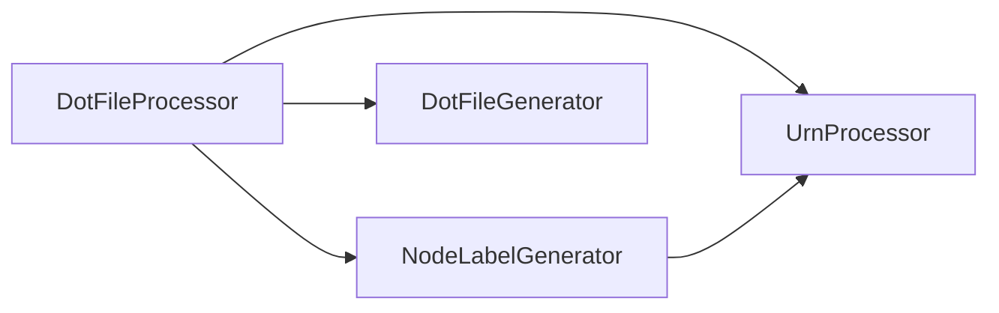
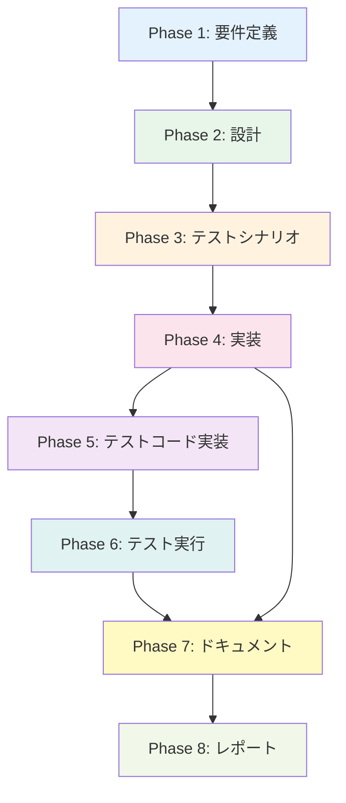

# Phase 0: プロジェクト計画書

**Issue**: #462 - [Refactor] dot_processor.py - Phase 2-2: NodeLabelGeneratorクラスの抽出
**作成日**: 2025-01-XX
**担当者**: AI Agent

---

## 📋 1. Issue分析

### 複雑度判定: **中程度**

**判定理由**:
- 新規クラスの作成（`NodeLabelGenerator`）と既存クラスからのロジック抽出
- 複数ファイルの修正が必要（dot_processor.py、新規ファイル2つ）
- 既存の統合テストとの整合性確認が必要
- ただし、アーキテクチャの大きな変更はなく、ロジックの分離が中心
- Phase 2-1 (UrnProcessor抽出) と同様のパターンで実施可能

### 見積もり工数: **10~14時間**

**根拠**:
- **要件定義** (1h): Issue内容の分析、既存コードのラベル生成ロジックの特定
- **設計** (2~3h): クラス設計、メソッド分割、インターフェース定義、責務の明確化
- **テストシナリオ** (1~2h): 単体テストシナリオ作成、カバレッジ目標80%以上
- **実装** (3~4h): NodeLabelGenerator新規作成、DotFileProcessorからのロジック抽出、統合
- **テストコード実装** (2~3h): test_node_label_generator.py作成、既存テスト更新
- **テスト実行** (0.5~1h): 単体テスト、統合テスト、カバレッジ確認
- **ドキュメント** (0.5~1h): クラスdocstring、README更新（必要に応じて）

**Phase 2-1との比較**:
- UrnProcessor抽出と同様の作業パターン
- ラベル生成ロジックはURN処理よりも複雑性が低い
- ただし、リソースタイプごとのカスタムラベル対応により若干の時間増

### リスク評価: **低〜中**

**リスク要因**:
- 既存の統合テストへの影響（低）
- ラベル生成ロジックの完全な抽出漏れ（中）
- カスタムラベル対応の仕様不明確さ（中）

---

## 🎯 2. 実装戦略判断

### 実装戦略: **REFACTOR**

**判断根拠**:
- 既存の`DotFileProcessor`クラスからラベル生成ロジックを抽出する作業が中心
- 新規クラス`NodeLabelGenerator`を作成するが、既存ロジックの再編成がメイン
- 機能追加や新規サブシステム構築ではなく、既存コードの構造改善が目的
- Phase 2-1 (UrnProcessor抽出) と同様のリファクタリングパターン
- **対象メソッド**:
  - `_generate_node_attributes()`
  - `_generate_stack_node_attributes()`
  - `_generate_resource_node_attributes()`
  - その他、ラベル生成に関連する処理

**CREATE要素**:
- `node_label_generator.py`の新規作成
- `test_node_label_generator.py`の新規作成

**EXTEND要素**:
- なし（機能拡張ではなく、既存機能の分離）

**REFACTOR要素**:
- `DotFileProcessor`からのロジック抽出
- 責務の分離（Single Responsibility Principle）
- メソッド呼び出しの置き換え

---

### テスト戦略: **UNIT_INTEGRATION**

**判断根拠**:
- **UNIT (単体テスト) - 必須**:
  - 新規クラス`NodeLabelGenerator`の単体テスト
  - 各メソッドの動作検証（リソースタイプ別ラベル生成）
  - エッジケース（長いラベル、特殊文字、カスタムラベル）
  - カバレッジ80%以上の達成
  - 既存の`test_dot_processor.py`のラベル関連テストを参考に作成

- **INTEGRATION (統合テスト) - 必須**:
  - `DotFileProcessor`との統合動作確認
  - 既存の統合テストが全てパスすることの検証
  - ラベル生成結果が既存と同一であることの検証
  - Phase 2-1で作成された`UrnProcessor`との協調動作確認

- **BDD不要の理由**:
  - エンドユーザー向け機能ではなく、内部ロジックのリファクタリング
  - ユーザーストーリーが存在しない（開発者向けの構造改善）
  - 既存の機能が維持されていることの検証が中心

**テストレベル詳細**:
```
UNIT_INTEGRATION
  ├─ UNIT (80%以上のカバレッジ)
  │   ├─ NodeLabelGenerator.generate_label() - 基本ラベル生成
  │   ├─ NodeLabelGenerator.generate_stack_label() - スタックラベル
  │   ├─ NodeLabelGenerator.generate_resource_label() - リソースラベル
  │   ├─ NodeLabelGenerator.format_label() - ラベルフォーマット
  │   ├─ エッジケース（長いラベル、特殊文字、空文字列）
  │   └─ カスタムラベル対応
  └─ INTEGRATION
      ├─ DotFileProcessor統合テスト（既存テストの全パス）
      ├─ ラベル生成結果の一致検証
      └─ UrnProcessorとの協調動作
```

---

### テストコード戦略: **BOTH_TEST**

**判断根拠**:
- **CREATE_TEST (新規テストファイル作成)**:
  - `test_node_label_generator.py`を新規作成
  - NodeLabelGeneratorクラスの単体テスト
  - 理由: 新規クラスに対応する専用テストファイルが必要

- **EXTEND_TEST (既存テストファイル拡張)**:
  - `test_dot_processor.py`の一部更新
  - DotFileProcessorとNodeLabelGeneratorの統合動作確認
  - 既存のラベル関連テストが引き続きパスすることの確認
  - 理由: 既存クラスの動作が変更されていないことを保証

**両方が必要な理由**:
- 新規クラス（NodeLabelGenerator）には専用の単体テストが必要
- 既存クラス（DotFileProcessor）は新規クラスを呼び出すように変更されるため、統合テストの更新が必要
- Phase 2-1と同様のパターン（UrnProcessorでもBOTH_TESTを採用）

---

## 🔍 3. 影響範囲分析

### 既存コードへの影響

#### 修正が必要なファイル

1. **`src/dot_processor.py`** (既存ファイル - 修正)
   - ラベル生成ロジックの削除
   - `NodeLabelGenerator`のインポート
   - ラベル生成処理の呼び出し先を`NodeLabelGenerator`に変更
   - 影響度: **中** - メソッド数は減るが、呼び出し箇所の更新が必要

2. **`src/node_label_generator.py`** (新規ファイル)
   - 新規クラスの実装
   - 影響度: **低** - 新規作成のため既存コードへの影響なし

3. **`tests/test_node_label_generator.py`** (新規ファイル)
   - 単体テストの実装
   - 影響度: **低** - 新規作成のため既存テストへの影響なし

4. **`tests/test_dot_processor.py`** (既存ファイル - 部分更新)
   - 統合テストの更新（必要に応じて）
   - 影響度: **低** - 既存テストは基本的にそのまま動作するはず

5. **`tests/conftest.py`** (既存ファイル - 軽微な更新)
   - `node_label_generator`フィクスチャの追加
   - 影響度: **低** - フィクスチャの追加のみ

#### 影響を受けるメソッド（dot_processor.py内）

抽出対象メソッド:
- `_generate_node_attributes()` → `NodeLabelGenerator.generate_label()`に移行
- `_generate_stack_node_attributes()` → `NodeLabelGenerator.generate_stack_label()`に移行
- `_generate_resource_node_attributes()` → `NodeLabelGenerator.generate_resource_label()`に移行
- その他、ラベルフォーマット関連の処理

呼び出し元メソッド（更新が必要）:
- `_process_node_definition()` - NodeLabelGeneratorの呼び出しに変更

### 依存関係の変更

#### 新規依存の追加

```python
# dot_processor.py に追加
from node_label_generator import NodeLabelGenerator
```

#### 既存依存の変更

- **なし** - 既存のインポート文は変更不要
- `UrnProcessor`への依存は継続（NodeLabelGeneratorもUrnProcessorを利用する可能性あり）

#### 依存関係図



**Phase 2-1からの変化**:
```
Before (Phase 2-1):
  DotFileProcessor --> UrnProcessor

After (Phase 2-2):
  DotFileProcessor --> NodeLabelGenerator --> UrnProcessor
  DotFileProcessor --> UrnProcessor (直接呼び出しも継続)
```

### マイグレーション要否

#### データベーススキーマ変更: **不要**

- データベースを使用していないため、マイグレーション不要

#### 設定ファイル変更: **不要**

- 設定ファイルの変更は不要
- 既存の`PROVIDER_COLORS`などの設定は`NodeLabelGenerator`に移行する可能性あり

#### 環境変数変更: **不要**

- 環境変数の追加・変更は不要

#### 破壊的変更: **なし**

- 外部APIは変更されない（内部実装の再編成のみ）
- 既存の呼び出し元コードは影響を受けない
- DOT形式の出力結果は変更されない

---

## 📝 4. タスク分割

### Phase 1: 要件定義 (見積もり: 1h)

- [ ] Task 1-1: Issue内容の詳細分析 (0.5h)
  - Issue #462の完了条件の確認
  - 親Issue #448のPhase 2-2要件の確認
  - Phase 2-1 (UrnProcessor) の実装パターンの参照

- [ ] Task 1-2: 既存コードのラベル生成ロジック特定 (0.5h)
  - `dot_processor.py`内のラベル生成関連メソッドのリストアップ
  - ラベル生成の入力・出力データ構造の確認
  - リソースタイプごとのラベルフォーマット定義の確認
  - `PROVIDER_COLORS`などの定数の確認

### Phase 2: 設計 (見積もり: 2~3h)

- [ ] Task 2-1: NodeLabelGeneratorクラス設計 (1~1.5h)
  - クラスの責務定義（Single Responsibility Principle）
  - メソッド一覧とシグネチャ設計
  - 入力・出力のデータ構造設計
  - UrnProcessorとの協調設計

- [ ] Task 2-2: リソースタイプ別ラベルフォーマット設計 (0.5~1h)
  - スタックノードラベル
  - リソースノードラベル
  - プロバイダー別カラー設定の移行
  - カスタムラベル対応の設計

- [ ] Task 2-3: DotFileProcessorとの統合設計 (0.5h)
  - NodeLabelGenerator呼び出し箇所の特定
  - メソッドシグネチャの変更点の明確化
  - エラーハンドリング設計

### Phase 3: テストシナリオ (見積もり: 1~2h)

- [ ] Task 3-1: NodeLabelGenerator単体テストシナリオ作成 (0.5~1h)
  - 正常系: 各リソースタイプのラベル生成
  - 異常系: 不正な入力、空文字列、None
  - エッジケース: 長いラベル、特殊文字、Unicode
  - カスタムラベル対応のテストケース

- [ ] Task 3-2: 統合テストシナリオ作成 (0.5~1h)
  - DotFileProcessorとの統合動作確認
  - ラベル生成結果の既存との一致検証
  - UrnProcessorとの協調動作確認
  - 既存テストの全パス確認

### Phase 4: 実装 (見積もり: 3~4h)

- [ ] Task 4-1: NodeLabelGeneratorクラスの基本実装 (1~1.5h)
  - `node_label_generator.py`ファイル作成
  - クラス定義とdocstring
  - 基本メソッドの実装（generate_label, generate_stack_label, generate_resource_label）

- [ ] Task 4-2: リソースタイプ別ラベル生成ロジック実装 (1~1.5h)
  - スタックノードラベル生成
  - リソースノードラベル生成
  - ラベルフォーマット処理（長いラベルの省略、特殊文字エスケープ）
  - プロバイダー別カラー設定の統合

- [ ] Task 4-3: DotFileProcessorからのロジック抽出と統合 (0.5~1h)
  - ラベル生成メソッドの削除
  - NodeLabelGeneratorのインポート
  - 呼び出し箇所の更新
  - 既存の統合テスト実行による動作確認

### Phase 5: テストコード実装 (見積もり: 2~3h)

- [ ] Task 5-1: test_node_label_generator.py新規作成 (1~1.5h)
  - テストファイル作成
  - 基本的なラベル生成テスト
  - スタックラベルとリソースラベルのテスト
  - エッジケーステスト

- [ ] Task 5-2: カスタムラベル対応テスト実装 (0.5~1h)
  - カスタムラベルフォーマットのテスト
  - プロバイダー別色設定のテスト
  - 長いラベルの省略テスト

- [ ] Task 5-3: conftest.pyの更新 (0.5h)
  - `node_label_generator`フィクスチャの追加
  - 既存フィクスチャの動作確認

### Phase 6: テスト実行 (見積もり: 0.5~1h)

- [ ] Task 6-1: 単体テスト実行 (0.25~0.5h)
  - `pytest tests/test_node_label_generator.py -v`実行
  - 全テストケースのパス確認
  - カバレッジ測定（80%以上）

- [ ] Task 6-2: 統合テスト実行 (0.25~0.5h)
  - `pytest tests/test_dot_processor.py -v`実行
  - 既存テストの全パス確認
  - ラベル生成結果の一致検証

### Phase 7: ドキュメント (見積もり: 0.5~1h)

- [ ] Task 7-1: NodeLabelGeneratorクラスのdocstring作成 (0.25~0.5h)
  - クラスレベルのdocstring
  - 各メソッドのdocstring（引数、戻り値、例）
  - 使用例の記載

- [ ] Task 7-2: コードコメントの追加 (0.25~0.5h)
  - 複雑なロジックへのコメント
  - TODO/FIXMEの確認と解決

### Phase 8: レポート (見積もり: 0.5h)

- [ ] Task 8-1: 完了レポート作成 (0.5h)
  - 実装内容のサマリー
  - テスト結果の記載
  - カバレッジレポート
  - 残課題の洗い出し（あれば）

---

## 🔗 5. 依存関係

### タスク間の依存関係



### 外部依存関係

#### Phase 2-1 (Issue #461) への依存

- **依存内容**: `UrnProcessor`クラスの完成
- **依存理由**: NodeLabelGeneratorはURN情報を使用してラベルを生成する
- **対策**: Phase 2-1完了済み（urn_processor.pyが存在することを確認済み）

#### Phase 2-3 への影響

- **影響内容**: ResourceDependencyBuilderクラスの抽出
- **影響理由**: NodeLabelGeneratorが完成することで、DotFileProcessorのメソッド数がさらに削減される
- **メリット**: Phase 2-2完了により、Phase 2-3の作業範囲が明確になる

---

## ⚠️ 6. リスクと軽減策

### リスク1: ラベル生成ロジックの抽出漏れ

- **影響度**: 中
- **確率**: 中
- **軽減策**:
  - Phase 1でラベル生成関連メソッドを完全にリストアップ
  - Phase 4でコードレビューを実施
  - Phase 6で既存の統合テストが全パスすることを確認
  - ラベル生成結果を既存実装と比較する自動テストを追加

### リスク2: カスタムラベル対応の仕様不明確さ

- **影響度**: 中
- **確率**: 中
- **軽減策**:
  - Issue #462の「カスタムラベル対応」の詳細を確認（必要に応じて質問）
  - Phase 2で仕様を明確化し、設計ドキュメントに記載
  - 拡張可能な設計にする（将来の変更に対応可能）
  - 最小限の実装から始め、後から拡張可能にする

### リスク3: 既存テストへの影響

- **影響度**: 低
- **確率**: 低
- **軽減策**:
  - Phase 4で段階的に実装（まずNodeLabelGenerator作成、次に統合）
  - Phase 6で既存テストを全実行
  - 既存テストが失敗した場合は、原因を特定して修正
  - Phase 2-1と同様のパターンで実装（既に成功しているアプローチ）

### リスク4: UrnProcessorとの協調不備

- **影響度**: 中
- **確率**: 低
- **軽減策**:
  - Phase 2でUrnProcessorとのインターフェース設計を明確化
  - Phase 3でUrnProcessorとの統合テストシナリオを作成
  - Phase 5でUrnProcessorのモックを使用した単体テストを実装
  - Phase 6でUrnProcessorとの協調動作を確認

### リスク5: カバレッジ目標（80%以上）未達

- **影響度**: 中
- **確率**: 低
- **軽減策**:
  - Phase 3でテストシナリオを網羅的に作成
  - Phase 5でカバレッジ測定ツールを使用
  - カバレッジが80%未満の場合は、Phase 5に戻ってテストを追加
  - エッジケースとエラーケースを重点的にテスト

### リスク6: 長いラベルの省略処理の不備

- **影響度**: 低
- **確率**: 低
- **軽減策**:
  - Phase 3で長いラベルのテストケースを作成
  - Phase 5でエッジケース（極端に長いラベル）をテスト
  - 既存の実装を参考に、省略ロジックを正確に移行

---

## ✅ 7. 品質ゲート

### Phase 1: 要件定義

- [ ] Issue #462の完了条件が明確に理解されている
- [ ] 親Issue #448のPhase 2-2要件が確認されている
- [ ] 既存コードのラベル生成ロジックが完全にリストアップされている
- [ ] Phase 2-1 (UrnProcessor) の実装パターンが参照されている

### Phase 2: 設計

- [ ] **実装戦略（REFACTOR）の判断根拠が明記されている** ✅
- [ ] **テスト戦略（UNIT_INTEGRATION）の判断根拠が明記されている** ✅
- [ ] **テストコード戦略（BOTH_TEST）の判断根拠が明記されている** ✅
- [ ] NodeLabelGeneratorクラスの責務が明確に定義されている
- [ ] メソッドシグネチャがすべて設計されている
- [ ] UrnProcessorとのインターフェースが明確である
- [ ] DotFileProcessorとの統合方法が設計されている

### Phase 3: テストシナリオ

- [ ] 単体テストシナリオがすべて作成されている
- [ ] 統合テストシナリオがすべて作成されている
- [ ] エッジケースが網羅的にカバーされている
- [ ] カバレッジ目標（80%以上）を達成できるシナリオである

### Phase 4: 実装

- [ ] NodeLabelGeneratorクラスが正しく実装されている
- [ ] リソースタイプ別ラベル生成が実装されている
- [ ] DotFileProcessorからのロジック抽出が完了している
- [ ] コードが読みやすく、保守可能である
- [ ] docstringがすべてのメソッドに記載されている

### Phase 5: テストコード実装

- [ ] test_node_label_generator.pyが作成されている
- [ ] すべてのテストシナリオが実装されている
- [ ] conftest.pyが更新されている
- [ ] テストコードが読みやすく、保守可能である

### Phase 6: テスト実行

- [ ] 単体テストがすべてパスしている
- [ ] カバレッジが80%以上である
- [ ] 既存の統合テストがすべてパスしている
- [ ] ラベル生成結果が既存実装と一致している

### Phase 7: ドキュメント

- [ ] NodeLabelGeneratorのdocstringが完成している
- [ ] 複雑なロジックにコメントが追加されている
- [ ] README（必要に応じて）が更新されている

### Phase 8: レポート

- [ ] 完了レポートが作成されている
- [ ] テスト結果が記載されている
- [ ] カバレッジレポートが添付されている
- [ ] 残課題が明確である（あれば）

---

## 📊 8. 成功基準

### 必須条件（Must Have）

1. **NodeLabelGeneratorクラスが単独で動作すること**
   - 入力: URN情報、リソースタイプ
   - 出力: フォーマット済みラベル文字列
   - エラーハンドリングが適切である

2. **単体テストのカバレッジが80%以上であること**
   - `pytest --cov=node_label_generator --cov-report=term`
   - カバレッジレポートを確認

3. **既存の統合テストが全てパスすること**
   - `pytest tests/test_dot_processor.py -v`
   - すべてのテストケースがパス
   - ラベル生成結果が既存と同一

### 推奨条件（Should Have）

1. **カスタムラベル対応が実装されていること**
   - リソースタイプごとのカスタムフォーマット
   - プロバイダー別色設定の統合

2. **コードの可読性が向上していること**
   - メソッド数の削減（DotFileProcessor）
   - Single Responsibility Principleの遵守

3. **Phase 2-3の準備が整っていること**
   - ResourceDependencyBuilderクラス抽出の準備
   - 依存関係ロジックの整理

---

## 🗓️ 9. スケジュール

| Phase | タスク | 見積もり | 累積時間 |
|-------|--------|----------|----------|
| Phase 1 | 要件定義 | 1h | 1h |
| Phase 2 | 設計 | 2~3h | 3~4h |
| Phase 3 | テストシナリオ | 1~2h | 4~6h |
| Phase 4 | 実装 | 3~4h | 7~10h |
| Phase 5 | テストコード実装 | 2~3h | 9~13h |
| Phase 6 | テスト実行 | 0.5~1h | 9.5~14h |
| Phase 7 | ドキュメント | 0.5~1h | 10~15h |
| Phase 8 | レポート | 0.5h | 10.5~15.5h |

**合計見積もり**: 10.5~15.5時間（中央値: 13時間）

---

## 📚 10. 参考情報

### 関連Issue

- **親Issue**: #448 - リファクタリング全体計画
- **前提Issue**: #460 (Phase 1: 基盤整備)
- **並行Issue**: #461 (Phase 2-1: UrnProcessor) - **完了済み**

### 参考実装

- `urn_processor.py` - Phase 2-1で作成されたクラス（参考パターン）
- `dot_processor.py` - 既存のラベル生成ロジック
- `test_dot_processor.py` - 既存のテストコード

### ドキュメント

- [CLAUDE.md](CLAUDE.md) - プロジェクトのコーディングガイドライン
- [ARCHITECTURE.md](ARCHITECTURE.md) - アーキテクチャ設計思想（該当しない場合）
- [CONTRIBUTION.md](CONTRIBUTION.md) - 開発ガイドライン

---

## 🔖 11. 備考

### Phase 2-1からの学び

- **成功パターン**:
  - 既存テストを維持しながら段階的にリファクタリング
  - 単体テストと統合テストの両方を実装
  - conftest.pyにフィクスチャを追加して再利用性を向上

- **適用すべき点**:
  - UrnProcessorと同様の静的メソッド設計
  - docstringの詳細な記載
  - エッジケースの網羅的なテスト

### カスタムラベル対応の仕様

- Issue #462に「カスタムラベル対応の実装」と記載されているが、具体的な仕様は不明
- Phase 2で仕様を明確化する必要がある
- 最小限の実装から始め、後から拡張可能な設計にする

### Phase 2-3への準備

- NodeLabelGenerator抽出完了後、DotFileProcessorに残るロジック:
  - 依存関係構築ロジック（ResourceDependencyBuilder抽出対象）
  - DOT形式生成ロジック（DotFileGenerator - 既に分離済み）

---

**このプロジェクト計画書は、Phase 0の成果物です。Phase 1開始前に、クリティカルシンキングレビューを実施してください。**
