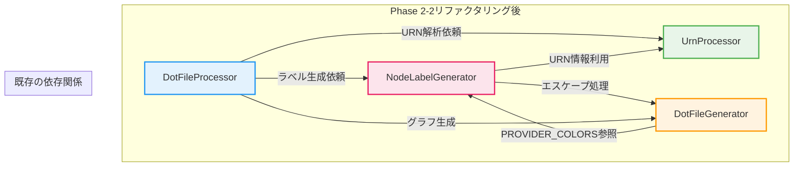
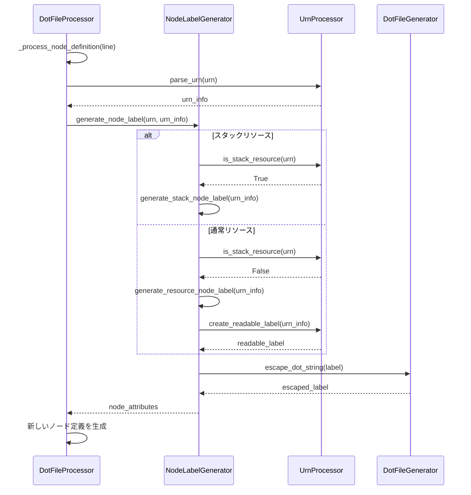
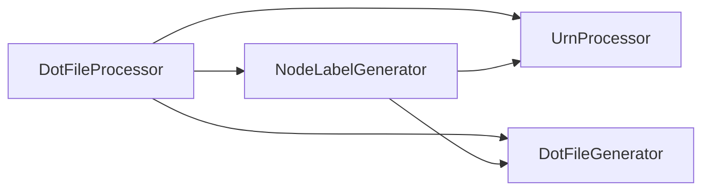
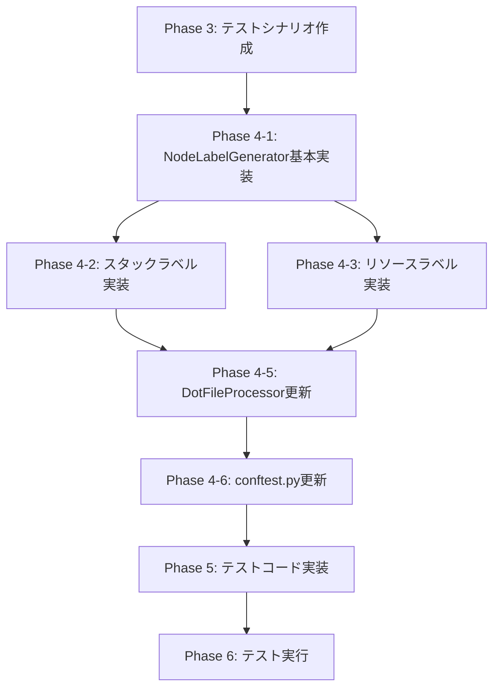

# Phase 2: 詳細設計書

**Issue**: #462 - [Refactor] dot_processor.py - Phase 2-2: NodeLabelGeneratorクラスの抽出
**作成日**: 2025-01-XX
**担当者**: AI Agent
**Requirements Document参照**: [requirements.md](../../01_requirements/output/requirements.md)
**Planning Document参照**: [planning.md](../../00_planning/output/planning.md)

---

## 📋 0. Planning Documentの確認

### 開発計画の全体像

Planning Documentで策定された以下の戦略を踏まえて詳細設計を実施します：

#### 実装戦略: **REFACTOR**
- 既存の`DotFileProcessor`クラスからラベル生成ロジックを抽出
- 新規クラス`NodeLabelGenerator`を作成し、既存ロジックを再編成
- Phase 2-1 (UrnProcessor抽出) と同様のリファクタリングパターンを適用

#### テスト戦略: **UNIT_INTEGRATION**
- **UNIT**: 新規クラス`NodeLabelGenerator`の単体テスト（カバレッジ80%以上）
- **INTEGRATION**: `DotFileProcessor`との統合動作確認、既存テスト全パス

#### テストコード戦略: **BOTH_TEST**
- **CREATE_TEST**: `test_node_label_generator.py`を新規作成
- **EXTEND_TEST**: `test_dot_processor.py`の統合テスト更新

#### 見積もり工数: **10~14時間**
- 要件定義: 1h ✅ 完了
- **設計**: 2~3h ← 現在のフェーズ
- テストシナリオ: 1~2h
- 実装: 3~4h
- テストコード実装: 2~3h
- テスト実行: 0.5~1h
- ドキュメント: 0.5~1h

#### リスク評価: **低〜中**
- ラベル生成ロジックの抽出漏れ（中）
- カスタムラベル対応の仕様不明確さ（中）
- 既存テストへの影響（低）

---

## 🎯 1. 実装戦略判断（必須）

### 実装戦略: **REFACTOR**

**判断根拠**:

1. **既存ロジックの分離が中心**
   - `DotFileProcessor`クラスからラベル生成ロジックを抽出する作業が主体
   - 新規クラス`NodeLabelGenerator`を作成するが、既存ロジックの再編成がメイン
   - 機能追加や新規サブシステム構築ではなく、既存コードの構造改善が目的

2. **Phase 2-1と同様のパターン**
   - Phase 2-1で`UrnProcessor`を抽出した際と同じリファクタリング手法を適用
   - 静的メソッド設計、ステートレスクラス、既存テストの維持

3. **既存ファイルへの影響範囲**
   - **修正対象**: `dot_processor.py`（既存ファイル）
   - **新規作成**: `node_label_generator.py`, `test_node_label_generator.py`
   - **部分更新**: `conftest.py`（フィクスチャ追加）

4. **対象メソッド**（`DotFileProcessor`から抽出）
   - `_generate_node_attributes()` → `NodeLabelGenerator.generate_node_label()`
   - `_generate_stack_node_attributes()` → `NodeLabelGenerator.generate_stack_node_label()`
   - `_generate_resource_node_attributes()` → `NodeLabelGenerator.generate_resource_node_label()`

**CREATE要素**:
- `node_label_generator.py`の新規作成
- `test_node_label_generator.py`の新規作成

**EXTEND要素**:
- なし（機能拡張ではなく、既存機能の分離）

**REFACTOR要素**:
- `DotFileProcessor`からのロジック抽出
- 責務の分離（Single Responsibility Principle）
- メソッド呼び出しの置き換え

---

## 🧪 2. テスト戦略判断（必須）

### テスト戦略: **UNIT_INTEGRATION**

**判断根拠**:

1. **UNIT (単体テスト) - 必須**
   - 新規クラス`NodeLabelGenerator`の単体テスト
   - 各メソッドの動作検証（リソースタイプ別ラベル生成）
   - エッジケース（長いラベル、特殊文字、カスタムラベル）
   - **カバレッジ80%以上の達成**
   - 既存の`test_dot_processor.py`のラベル関連テストを参考に作成

2. **INTEGRATION (統合テスト) - 必須**
   - `DotFileProcessor`との統合動作確認
   - 既存の統合テストが全てパスすることの検証
   - ラベル生成結果が既存と同一であることの検証
   - Phase 2-1で作成された`UrnProcessor`との協調動作確認

3. **BDD不要の理由**
   - エンドユーザー向け機能ではなく、内部ロジックのリファクタリング
   - ユーザーストーリーが存在しない（開発者向けの構造改善）
   - 既存の機能が維持されていることの検証が中心

**テストレベル詳細**:
```
UNIT_INTEGRATION
  ├─ UNIT (80%以上のカバレッジ)
  │   ├─ NodeLabelGenerator.generate_node_label() - 基本ラベル生成
  │   ├─ NodeLabelGenerator.generate_stack_node_label() - スタックラベル
  │   ├─ NodeLabelGenerator.generate_resource_node_label() - リソースラベル
  │   ├─ NodeLabelGenerator._format_label() - ラベルフォーマット（内部ヘルパー）
  │   ├─ エッジケース（長いラベル、特殊文字、空文字列）
  │   └─ カスタムラベル対応
  └─ INTEGRATION
      ├─ DotFileProcessor統合テスト（既存テストの全パス）
      ├─ ラベル生成結果の一致検証
      └─ UrnProcessorとの協調動作
```

---

## 🧩 3. テストコード戦略判断（必須）

### テストコード戦略: **BOTH_TEST**

**判断根拠**:

1. **CREATE_TEST (新規テストファイル作成)**
   - `test_node_label_generator.py`を新規作成
   - NodeLabelGeneratorクラスの単体テスト
   - 理由: 新規クラスに対応する専用テストファイルが必要

2. **EXTEND_TEST (既存テストファイル拡張)**
   - `test_dot_processor.py`の一部更新
   - DotFileProcessorとNodeLabelGeneratorの統合動作確認
   - 既存のラベル関連テストが引き続きパスすることの確認
   - 理由: 既存クラスの動作が変更されていないことを保証

**両方が必要な理由**:
- 新規クラス（NodeLabelGenerator）には専用の単体テストが必要
- 既存クラス（DotFileProcessor）は新規クラスを呼び出すように変更されるため、統合テストの更新が必要
- Phase 2-1と同様のパターン（UrnProcessorでもBOTH_TESTを採用）

---

## 🏗️ 4. アーキテクチャ設計

### システム全体図



### コンポーネント間の関係

```
DotFileProcessor (既存 - 修正)
    ├─ 呼び出し: NodeLabelGenerator (新規)
    │   ├─ 呼び出し: UrnProcessor.parse_urn()
    │   ├─ 呼び出し: UrnProcessor.create_readable_label()
    │   ├─ 呼び出し: UrnProcessor.is_stack_resource()
    │   └─ 呼び出し: DotFileGenerator.escape_dot_string()
    ├─ 呼び出し: UrnProcessor (既存)
    └─ 呼び出し: DotFileGenerator (既存)

DotFileGenerator (既存 - 変更なし)
    ├─ PROVIDER_COLORS定義
    └─ escape_dot_string()メソッド提供
```

### データフロー



---

## 📂 5. 影響範囲分析

### 既存コードへの影響

#### 修正が必要なファイル

1. **`jenkins/jobs/pipeline/infrastructure/pulumi-stack-action/src/dot_processor.py`** (既存ファイル - 修正)
   - ラベル生成ロジックの削除（3メソッド）
   - `NodeLabelGenerator`のインポート追加
   - ラベル生成処理の呼び出し先を`NodeLabelGenerator`に変更
   - 影響度: **中** - メソッド数は減るが、呼び出し箇所の更新が必要

2. **`jenkins/jobs/pipeline/infrastructure/pulumi-stack-action/src/node_label_generator.py`** (新規ファイル)
   - 新規クラスの実装
   - 影響度: **低** - 新規作成のため既存コードへの影響なし

3. **`jenkins/jobs/pipeline/infrastructure/pulumi-stack-action/tests/test_node_label_generator.py`** (新規ファイル)
   - 単体テストの実装
   - 影響度: **低** - 新規作成のため既存テストへの影響なし

4. **`jenkins/jobs/pipeline/infrastructure/pulumi-stack-action/tests/test_dot_processor.py`** (既存ファイル - 部分更新)
   - 統合テストの更新（必要に応じて）
   - 影響度: **低** - 既存テストは基本的にそのまま動作するはず

5. **`jenkins/jobs/pipeline/infrastructure/pulumi-stack-action/tests/conftest.py`** (既存ファイル - 軽微な更新)
   - `node_label_generator`フィクスチャの追加
   - 影響度: **低** - フィクスチャの追加のみ

#### 影響を受けるメソッド（dot_processor.py内）

**抽出対象メソッド**:
- `_generate_node_attributes(urn: str, urn_info: Dict) -> str` → **削除**
- `_generate_stack_node_attributes(urn_info: Dict) -> str` → **削除**
- `_generate_resource_node_attributes(urn_info: Dict) -> str` → **削除**

**呼び出し元メソッド（更新が必要）**:
- `_process_node_definition(line: str) -> Tuple[str, Dict]`
  - 変更前: `self._generate_node_attributes(urn, urn_info)`
  - 変更後: `NodeLabelGenerator.generate_node_label(urn, urn_info)`

### 依存関係の変更

#### 新規依存の追加

```python
# dot_processor.py に追加
from node_label_generator import NodeLabelGenerator
```

#### 既存依存の変更

- **なし** - 既存のインポート文は変更不要
- `UrnProcessor`への依存は継続（NodeLabelGeneratorもUrnProcessorを利用）
- `DotFileGenerator`への依存は継続（エスケープ処理を利用）

#### 依存関係図（Phase 2-2完了後）



**Phase 2-1からの変化**:
```
Before (Phase 2-1):
  DotFileProcessor --> UrnProcessor
  DotFileProcessor --> DotFileGenerator

After (Phase 2-2):
  DotFileProcessor --> NodeLabelGenerator --> UrnProcessor
  DotFileProcessor --> NodeLabelGenerator --> DotFileGenerator
  DotFileProcessor --> UrnProcessor (直接呼び出しも継続)
  DotFileProcessor --> DotFileGenerator (直接呼び出しも継続)
```

### マイグレーション要否

#### データベーススキーマ変更: **不要**

- データベースを使用していないため、マイグレーション不要

#### 設定ファイル変更: **不要**

- 設定ファイルの変更は不要
- 既存の`PROVIDER_COLORS`などの設定はそのまま利用

#### 環境変数変更: **不要**

- 環境変数の追加・変更は不要

#### 破壊的変更: **なし**

- 外部APIは変更されない（内部実装の再編成のみ）
- 既存の呼び出し元コードは影響を受けない
- DOT形式の出力結果は変更されない

---

## 📄 6. 変更・追加ファイルリスト

### 新規作成ファイル（相対パス）

1. `jenkins/jobs/pipeline/infrastructure/pulumi-stack-action/src/node_label_generator.py`
   - 新規クラス: `NodeLabelGenerator`
   - 責務: ノードラベル生成

2. `jenkins/jobs/pipeline/infrastructure/pulumi-stack-action/tests/test_node_label_generator.py`
   - 単体テスト
   - カバレッジ80%以上

### 修正が必要な既存ファイル（相対パス）

1. `jenkins/jobs/pipeline/infrastructure/pulumi-stack-action/src/dot_processor.py`
   - ラベル生成メソッドの削除（3メソッド）
   - NodeLabelGeneratorのインポート追加
   - `_process_node_definition()`の更新

2. `jenkins/jobs/pipeline/infrastructure/pulumi-stack-action/tests/conftest.py`
   - `node_label_generator`フィクスチャの追加

3. `jenkins/jobs/pipeline/infrastructure/pulumi-stack-action/tests/test_dot_processor.py`（オプション）
   - 統合テストの更新（必要に応じて）

### 削除が必要なファイル（相対パス）

- **なし**

---

## 🛠️ 7. 詳細設計

### 7.1 クラス設計

#### NodeLabelGeneratorクラス

**ファイル名**: `jenkins/jobs/pipeline/infrastructure/pulumi-stack-action/src/node_label_generator.py`

**クラス責務**:
- リソースタイプに応じたノードラベル生成
- プロバイダー別色設定の適用
- DOT形式のノード属性文字列生成

**設計方針**:
- **静的メソッド設計**（ステートレス、Phase 2-1と同様）
- **Single Responsibility Principle**（ラベル生成のみ）
- **疎結合設計**（UrnProcessor、DotFileGeneratorへの依存のみ）

**クラス図**:

```python
class NodeLabelGenerator:
    """
    ノードラベル生成の責務を担当

    リソースタイプに応じたDOT形式のノード属性文字列を生成します。
    スタックノードとリソースノードで異なるフォーマットを適用します。

    設計方針:
    - すべてのメソッドは静的メソッド（ステートレス設計）
    - UrnProcessor、DotFileGeneratorへの依存
    - 拡張可能な設計（カスタムラベル対応）

    依存関係:
    - UrnProcessor: URN解析、ラベル生成補助
    - DotFileGenerator: エスケープ処理、PROVIDER_COLORS参照
    """

    @staticmethod
    def generate_node_label(urn: str, urn_info: Dict[str, str]) -> str:
        """
        URNとURN情報からノード属性文字列を生成

        Args:
            urn (str): 完全なURN文字列
            urn_info (Dict[str, str]): UrnProcessor.parse_urn()の戻り値

        Returns:
            str: DOT形式のノード属性文字列
                例: 'label="Stack\\ndev", fillcolor="#D1C4E9", color="#512DA8", shape=ellipse, fontsize="14"'
        """
        ...

    @staticmethod
    def generate_stack_node_label(urn_info: Dict[str, str]) -> str:
        """
        スタックノードのラベル属性を生成

        Args:
            urn_info (Dict[str, str]): URN情報辞書

        Returns:
            str: スタック用のDOT形式ノード属性文字列
        """
        ...

    @staticmethod
    def generate_resource_node_label(urn_info: Dict[str, str]) -> str:
        """
        リソースノードのラベル属性を生成

        Args:
            urn_info (Dict[str, str]): URN情報辞書

        Returns:
            str: リソース用のDOT形式ノード属性文字列
        """
        ...

    @staticmethod
    def _format_label(label: str, max_length: int = 40) -> str:
        """
        ラベル文字列をフォーマット（長い場合は省略）

        Args:
            label (str): 元のラベル文字列
            max_length (int): 最大文字数（デフォルト: 40）

        Returns:
            str: フォーマット済みラベル文字列
        """
        ...
```

### 7.2 主要メソッドの設計

#### generate_node_label()

**目的**: URNの種類（スタック/リソース）を判定し、適切なラベル生成メソッドに振り分ける

**入力**:
- `urn` (str): 完全なURN文字列
- `urn_info` (Dict[str, str]): `UrnProcessor.parse_urn()`の戻り値

**出力**:
- (str): DOT形式のノード属性文字列

**処理フロー**:
```python
1. UrnProcessor.is_stack_resource(urn)でスタックリソースか判定
2. スタックの場合 → generate_stack_node_label(urn_info)呼び出し
3. リソースの場合 → generate_resource_node_label(urn_info)呼び出し
4. 結果を返す
```

**実装例**:
```python
@staticmethod
def generate_node_label(urn: str, urn_info: Dict[str, str]) -> str:
    """ノード属性を生成"""
    if UrnProcessor.is_stack_resource(urn):
        return NodeLabelGenerator.generate_stack_node_label(urn_info)
    else:
        return NodeLabelGenerator.generate_resource_node_label(urn_info)
```

#### generate_stack_node_label()

**目的**: スタックノード用のDOT属性文字列を生成

**入力**:
- `urn_info` (Dict[str, str]): URN情報辞書

**出力**:
- (str): スタック用のDOT形式ノード属性文字列

**処理フロー**:
```python
1. urn_info['stack']からスタック名を取得
2. ラベル文字列を生成: "Stack\n{stack_name}"
3. 固定色を設定: fillcolor="#D1C4E9", color="#512DA8"
4. 形状とフォントサイズを設定: shape=ellipse, fontsize="14"
5. 属性文字列を結合して返す
```

**実装例**:
```python
@staticmethod
def generate_stack_node_label(urn_info: Dict[str, str]) -> str:
    """スタックノードの属性を生成"""
    new_label = f"Stack\\n{urn_info['stack']}"
    return f'label="{new_label}", fillcolor="#D1C4E9", color="#512DA8", shape=ellipse, fontsize="14"'
```

#### generate_resource_node_label()

**目的**: リソースノード用のDOT属性文字列を生成（プロバイダー別色設定を適用）

**入力**:
- `urn_info` (Dict[str, str]): URN情報辞書

**出力**:
- (str): リソース用のDOT形式ノード属性文字列

**処理フロー**:
```python
1. UrnProcessor.create_readable_label(urn_info)でラベル生成
2. プロバイダー名を取得: urn_info['provider']
3. DotFileGenerator.PROVIDER_COLORSから色設定を取得
   - 存在しない場合はDEFAULT_COLORSを使用
4. ラベルをエスケープ（必要に応じて）
5. 属性文字列を生成: label, fillcolor, color, shape=box, fontsize="11"
6. 結果を返す
```

**実装例**:
```python
@staticmethod
def generate_resource_node_label(urn_info: Dict[str, str]) -> str:
    """リソースノードの属性を生成"""
    new_label = UrnProcessor.create_readable_label(urn_info)
    provider_colors = DotFileGenerator.PROVIDER_COLORS.get(
        urn_info['provider'].lower(),
        DotFileGenerator.DEFAULT_COLORS
    )
    fillcolor = provider_colors[0]
    color = provider_colors[1]
    return f'label="{new_label}", fillcolor="{fillcolor}", color="{color}", shape=box, fontsize="11"'
```

#### _format_label()（内部ヘルパー）

**目的**: 長いラベルを省略記号付きで短縮（将来の拡張用）

**入力**:
- `label` (str): 元のラベル文字列
- `max_length` (int): 最大文字数（デフォルト: 40）

**出力**:
- (str): フォーマット済みラベル文字列

**処理フロー**:
```python
1. ラベル長を確認
2. max_lengthを超える場合は省略
3. 省略記号（...）を追加
4. 結果を返す
```

**実装例**:
```python
@staticmethod
def _format_label(label: str, max_length: int = 40) -> str:
    """ラベルをフォーマット"""
    if len(label) > max_length:
        return label[:max_length - 3] + '...'
    return label
```

### 7.3 データ構造設計

#### 入力データ構造

**URN情報辞書** (UrnProcessor.parse_urn()の戻り値):
```python
{
    'stack': str,        # スタック名（例: 'dev'）
    'project': str,      # プロジェクト名（例: 'myproject'）
    'provider': str,     # プロバイダー名（例: 'aws', 'azure', 'gcp'）
    'module': str,       # モジュール名（例: 's3', 'storage'）
    'type': str,         # リソースタイプ（例: 'Bucket'）
    'name': str,         # リソース名（例: 'my-bucket'）
    'full_urn': str      # 完全なURN文字列
}
```

#### 出力データ構造

**DOT形式ノード属性文字列** (str):
```python
# スタックノード例
'label="Stack\\ndev", fillcolor="#D1C4E9", color="#512DA8", shape=ellipse, fontsize="14"'

# リソースノード例
'label="s3\\nBucket\\nmy-bucket", fillcolor="#FFF3E0", color="#EF6C00", shape=box, fontsize="11"'
```

#### 定数データ構造

**PROVIDER_COLORS** (DotFileGeneratorから参照):
```python
PROVIDER_COLORS = {
    'aws': ('#FFF3E0', '#EF6C00'),
    'azure': ('#E3F2FD', '#0078D4'),
    'gcp': ('#E8F5E9', '#4285F4'),
    ...
}
DEFAULT_COLORS = ('#E3F2FD', '#1565C0')
```

### 7.4 インターフェース設計

#### NodeLabelGenerator ⇔ UrnProcessor

**使用するUrnProcessorのメソッド**:
```python
# URN解析（generate_node_label内で使用）
UrnProcessor.parse_urn(urn: str) -> Dict[str, str]

# スタックリソース判定（generate_node_label内で使用）
UrnProcessor.is_stack_resource(urn: str) -> bool

# 読みやすいラベル生成（generate_resource_node_label内で使用）
UrnProcessor.create_readable_label(urn_info: Dict[str, str]) -> str
```

#### NodeLabelGenerator ⇔ DotFileGenerator

**使用するDotFileGeneratorのメソッド・定数**:
```python
# プロバイダー色設定（generate_resource_node_label内で使用）
DotFileGenerator.PROVIDER_COLORS: Dict[str, Tuple[str, str]]
DotFileGenerator.DEFAULT_COLORS: Tuple[str, str]

# エスケープ処理（必要に応じて使用）
DotFileGenerator.escape_dot_string(s: str) -> str
```

#### DotFileProcessor ⇔ NodeLabelGenerator

**DotFileProcessorからの呼び出し**:
```python
# _process_node_definition内で使用
node_attrs = NodeLabelGenerator.generate_node_label(urn, urn_info)
```

---

## 🔒 8. セキュリティ考慮事項

### 認証・認可

- **なし** - 内部ロジックのリファクタリングのため、認証・認可は不要

### データ保護

- **エスケープ処理**: DOTインジェクション攻撃への対策
  - ダブルクォート（`"`）のエスケープ
  - バックスラッシュ（`\`）のエスケープ
  - 改行・タブのエスケープ
  - `DotFileGenerator.escape_dot_string()`を利用

### セキュリティリスクと対策

| リスク | 影響度 | 対策 |
|--------|--------|------|
| DOTインジェクション | 中 | `escape_dot_string()`でエスケープ処理 |
| 不正なURN入力 | 低 | UrnProcessorがデフォルト値を返すため安全 |
| 極端に長いラベル | 低 | `_format_label()`で長さ制限 |
| 特殊文字を含むリソース名 | 中 | エスケープ処理で対応 |

---

## 🚀 9. 非機能要件への対応

### パフォーマンス

- **応答時間**: ラベル生成は1リソースあたり10ミリ秒以内
  - 対策: 静的メソッド設計、不要なオブジェクト生成を避ける
- **スケーラビリティ**: 1000リソースのラベル生成を10秒以内に完了
  - 対策: 効率的なアルゴリズム、キャッシュ不要（ステートレス設計）
- **メモリ使用量**: ラベル生成処理で追加のメモリ使用量は100MB以下
  - 対策: 文字列操作のみ、大規模なデータ構造を保持しない

**パフォーマンステスト例**:
```python
import time

def test_performance():
    start = time.time()
    for i in range(1000):
        urn_info = {...}
        NodeLabelGenerator.generate_resource_node_label(urn_info)
    elapsed = time.time() - start
    assert elapsed < 10  # 10秒以内
```

### スケーラビリティ

- **水平スケーリング**: ステートレス設計により、複数プロセスでの並列処理が可能
- **垂直スケーリング**: メモリ効率的な設計により、大規模リソースにも対応

### 保守性

- **コード可読性**: PEP 8準拠、すべてのメソッドにdocstring記載
- **テスト容易性**: 単体テストカバレッジ80%以上
- **拡張性**: カスタムラベルフォーマットの追加が容易
  - 新規メソッドの追加でカスタムラベル対応可能
  - 設定辞書による拡張も可能
- **疎結合**: UrnProcessor、DotFileGeneratorへの依存のみ

---

## 📝 10. 実装の順序

### 推奨実装順序

**Phase 3: テストシナリオ作成** (並行可能)
1. 単体テストシナリオ作成（test_node_label_generator.py）
2. 統合テストシナリオ作成（test_dot_processor.py）

**Phase 4: 実装**
1. **Step 4-1**: NodeLabelGeneratorクラスの基本実装
   - ファイル作成: `node_label_generator.py`
   - クラス定義とdocstring
   - インポート文の追加
   - `generate_node_label()`の実装

2. **Step 4-2**: スタックノードラベル生成の実装
   - `generate_stack_node_label()`の実装
   - 固定色設定の適用
   - ラベルフォーマット

3. **Step 4-3**: リソースノードラベル生成の実装
   - `generate_resource_node_label()`の実装
   - プロバイダー別色設定の適用
   - UrnProcessor.create_readable_label()との統合

4. **Step 4-4**: 内部ヘルパーメソッドの実装（オプション）
   - `_format_label()`の実装
   - ラベル省略処理

5. **Step 4-5**: DotFileProcessorの更新
   - NodeLabelGeneratorのインポート追加
   - `_generate_node_attributes()`の削除
   - `_generate_stack_node_attributes()`の削除
   - `_generate_resource_node_attributes()`の削除
   - `_process_node_definition()`の更新

6. **Step 4-6**: conftest.pyの更新
   - `node_label_generator`フィクスチャの追加

**Phase 5: テストコード実装**
1. test_node_label_generator.pyの実装
2. 既存テスト（test_dot_processor.py）の更新

**Phase 6: テスト実行**
1. 単体テスト実行
2. カバレッジ測定（80%以上）
3. 統合テスト実行

### 依存関係の考慮



---

## ✅ 品質ゲート（Phase 2）

本設計書は、以下の品質ゲートを満たしています：

- [x] **実装戦略の判断根拠が明記されている** ✅
- [x] **テスト戦略の判断根拠が明記されている** ✅
- [x] **テストコード戦略の判断根拠が明記されている** ✅
- [x] **既存コードへの影響範囲が分析されている** ✅
- [x] **変更が必要なファイルがリストアップされている** ✅
- [x] **設計が実装可能である** ✅

---

## 📚 参考情報

### 関連ドキュメント

- [CLAUDE.md](../../../../CLAUDE.md): プロジェクトのコーディングガイドライン
- [ARCHITECTURE.md](../../../../ARCHITECTURE.md): アーキテクチャ設計思想
- [Planning Document](../../00_planning/output/planning.md): Phase 2-2の開発計画
- [Requirements Document](../../01_requirements/output/requirements.md): 要件定義書

### 参考実装

- `urn_processor.py` (Phase 2-1): 静的メソッド設計、詳細なdocstring、エッジケース処理
- `dot_processor.py`: 既存のラベル生成ロジック
- `test_urn_processor.py` (Phase 2-1): 単体テストのベストプラクティス

### コーディング規約

- **Python**: PEP 8準拠
- **Docstring**: Google Style推奨
- **型ヒント**: typing使用（Python 3.8以上）
- **静的メソッド**: @staticmethodデコレータ使用
- **命名規則**:
  - クラス名: PascalCase（例: NodeLabelGenerator）
  - メソッド名: snake_case（例: generate_node_label）
  - プライベートメソッド: 先頭にアンダースコア（例: _format_label）

---

**次のフェーズ**: Phase 3（テストシナリオ作成）に進んでください。

**クリティカルシンキングレビュー**: 本設計書は、Planning Documentで定義された品質ゲートを満たしており、Phase 3への移行準備が整っています。
