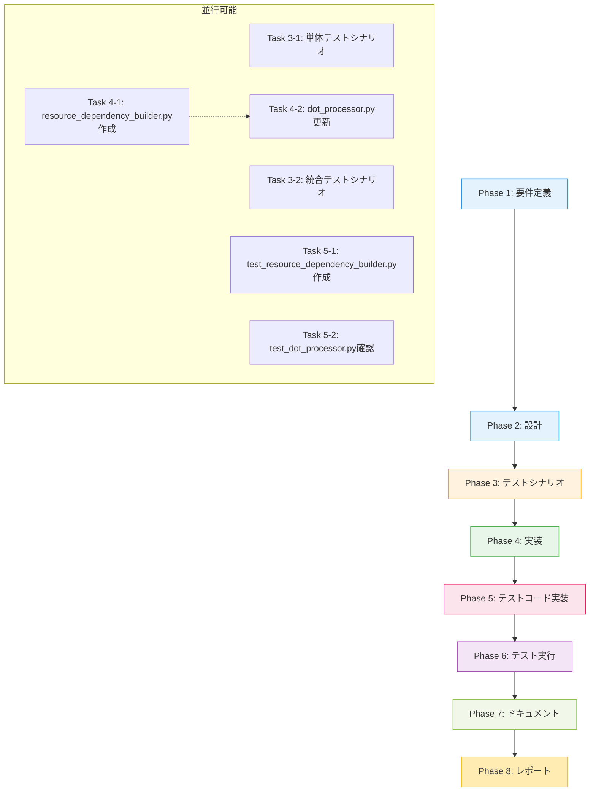

# プロジェクト計画書: Issue #463

## Issue情報

- **Issue番号**: #463
- **タイトル**: [Refactor] dot_processor.py - Phase 2-3: ResourceDependencyBuilderクラスの抽出
- **URL**: https://github.com/tielec/infrastructure-as-code/issues/463
- **親Issue**: #448
- **依存Issue**:
  - #460 (Phase 1: 基盤整備)
  - #461 (Phase 2-1: UrnProcessor) ※並行作業可能

---

## 1. Issue分析

### 複雑度: 中程度

**判定根拠**:
- 新規クラスの作成が必要（ResourceDependencyBuilder）
- 既存クラス（DotFileProcessor）からのロジック抽出
- 依存関係グラフ構築という複雑なドメインロジックを扱う
- 単体テストのカバレッジ80%以上という品質要件
- ただし、既存コードが既に動作しており、抽出がメイン作業

### 見積もり工数: 8~12時間

**根拠**:
- Phase 1（要件定義）: 1~1.5h - 既存の依存関係処理ロジックの分析
- Phase 2（設計）: 1.5~2h - クラス設計とインターフェース定義
- Phase 3（テストシナリオ）: 1~1.5h - 既存テストの分析と新規テストシナリオ作成
- Phase 4（実装）: 3~4h - クラス抽出と既存コードの修正
- Phase 5（テストコード実装）: 2~3h - 単体テスト実装（カバレッジ80%）
- Phase 6（テスト実行）: 0.5~1h - テスト実行と修正
- Phase 7（ドキュメント）: 0.5~1h - docstring、コメント、README更新
- Phase 8（レポート）: 0.5~1h - 完了レポート作成

### リスク評価: 中

**主なリスク**:
1. **技術的リスク（中）**: 依存関係グラフの複雑なロジックを正しく抽出できるか
2. **品質リスク（中）**: カバレッジ80%達成と既存テストの維持
3. **統合リスク（低）**: 既存のDotFileProcessorとの連携

---

## 2. 実装戦略判断

### 実装戦略: REFACTOR

**判断根拠**:
- 既存のDotFileProcessorから依存関係処理ロジックを抽出して新規クラスに分離
- 既存機能を維持しながら、コードの構造を改善することが目的
- 新規機能追加ではなく、責務分離によるリファクタリング
- Issue #448の段階的リファクタリング計画のPhase 2-3に該当

### テスト戦略: UNIT_INTEGRATION

**判断根拠**:
- **UNIT（必須）**: ResourceDependencyBuilderクラス単独での動作を検証
  - 依存関係グラフ構築ロジックの正確性
  - 依存関係検証ロジックの動作
  - エッジケース（循環依存、未定義URN参照など）の処理
  - カバレッジ80%以上を達成
- **INTEGRATION（必須）**: DotFileProcessorとの統合を検証
  - 既存の統合テスト（test_dot_processor.py）が全てパス
  - DotFileProcessor経由でResourceDependencyBuilderが正しく呼び出される
  - end-to-endでDOTファイル生成が正常に動作

**BDDが不要な理由**:
- エンドユーザー向け機能ではなく、内部リファクタリング
- ユーザーストーリーよりも技術的な正確性が重要
- 既存テストとの後方互換性が要件

### テストコード戦略: BOTH_TEST

**判断根拠**:
- **CREATE_TEST**: `test_resource_dependency_builder.py` を新規作成
  - ResourceDependencyBuilderクラス専用の単体テスト
  - 依存関係グラフ構築の詳細な検証
  - 80%以上のカバレッジを目標
- **EXTEND_TEST**: 既存の `test_dot_processor.py` を更新
  - DotFileProcessorからResourceDependencyBuilderへの呼び出しを検証
  - 既存の統合テストが引き続きパスすることを保証
  - リグレッションテストとして機能

---

## 3. 影響範囲分析

### 既存コードへの影響

#### 変更が必要なファイル:

1. **dot_processor.py（修正）**:
   - `DotFileGenerator._add_resource_dependencies()` メソッド
   - `DotFileGenerator._create_urn_to_node_mapping()` メソッド
   - `DotFileGenerator._add_dependencies_for_resource()` メソッド
   - `DotFileGenerator._add_direct_dependencies()` メソッド
   - `DotFileGenerator._add_parent_dependency()` メソッド
   - `DotFileGenerator._add_property_dependencies()` メソッド
   - 上記メソッドをResourceDependencyBuilderへの呼び出しに置き換え

2. **resource_dependency_builder.py（新規作成）**:
   - 依存関係グラフ構築ロジック
   - 依存関係検証ロジック
   - URNマッピング管理

3. **test_dot_processor.py（拡張）**:
   - 既存テストの動作確認
   - 統合テストとしての位置づけを明確化

4. **test_resource_dependency_builder.py（新規作成）**:
   - ResourceDependencyBuilder単体テスト
   - カバレッジ80%以上

### 依存関係の変更

#### 新規依存:
- **なし** - 標準ライブラリのみ使用（typing, re）

#### 既存依存の変更:
- `DotFileGenerator`が`ResourceDependencyBuilder`に依存
- `ResourceDependencyBuilder`は独立したモジュール（循環依存なし）

### マイグレーション要否

- **不要** - 外部APIやデータベーススキーマの変更なし
- **既存機能の互換性**: 完全に維持（外部インターフェースは不変）

---

## 4. タスク分割

### Phase 1: 要件定義 (見積もり: 1~1.5h)

- [x] Task 1-1: 既存の依存関係処理ロジックの詳細分析 (0.5~1h)
  - `DotFileGenerator._add_resource_dependencies()`の動作を完全に理解
  - `_create_urn_to_node_mapping()`の役割を特定
  - `_add_dependencies_for_resource()`以下の6メソッドの責務を整理
  - 現在の依存関係処理の入力・出力を明確化
- [x] Task 1-2: ResourceDependencyBuilderの責務と境界の定義 (0.5h)
  - 依存関係グラフ構築の責務範囲を決定
  - DotFileGeneratorとの責務分担を明確化
  - パブリックAPI（メソッド）を定義

### Phase 2: 設計 (見積もり: 1.5~2h)

- [x] Task 2-1: ResourceDependencyBuilderクラスの設計 (1~1.5h)
  - クラス構造の設計（静的メソッドかインスタンスメソッドか）
  - パブリックメソッドのシグネチャ設計
  - プライベートメソッドの役割分担
  - データ構造の設計（URNマッピング、依存関係グラフ）
- [x] Task 2-2: DotFileGeneratorとの統合インターフェース設計 (0.5h)
  - 呼び出し方法の設計
  - エラーハンドリングの方針
  - 既存のDOT lines構造との整合性確保

### Phase 3: テストシナリオ (見積もり: 1~1.5h)

- [ ] Task 3-1: 単体テストシナリオの作成 (0.5~1h)
  - URNマッピング作成のテストシナリオ
  - 直接依存関係追加のテストシナリオ
  - 親依存関係追加のテストシナリオ
  - プロパティ依存関係追加のテストシナリオ
  - エッジケース（循環依存、空リソース、不正URNなど）
- [ ] Task 3-2: 統合テストシナリオの確認 (0.5h)
  - 既存のtest_dot_processor.pyの依存関係テストを確認
  - end-to-endでの動作を保証するシナリオを特定
  - カバレッジ測定方法の決定

### Phase 4: 実装 (見積もり: 3~4h)

- [ ] Task 4-1: resource_dependency_builder.pyの新規作成 (2~2.5h)
  - ファイルとクラスの基本構造を作成
  - `create_urn_to_node_mapping()`メソッドの実装
  - `add_resource_dependencies()`メソッドの実装
  - `_add_dependencies_for_resource()`プライベートメソッドの実装
  - `_add_direct_dependencies()`の実装
  - `_add_parent_dependency()`の実装
  - `_add_property_dependencies()`の実装
  - docstringとコメントの記述
- [ ] Task 4-2: dot_processor.pyの更新 (1~1.5h)
  - ResourceDependencyBuilderのimport追加
  - `_add_resource_dependencies()`をResourceDependencyBuilderの呼び出しに置き換え
  - 既存の依存関係処理メソッドの削除
  - 動作確認（簡易的な手動テスト）

### Phase 5: テストコード実装 (見積もり: 2~3h)

- [ ] Task 5-1: test_resource_dependency_builder.pyの新規作成 (1.5~2h)
  - テストファイルの基本構造作成
  - URNマッピング作成のテスト実装
  - 直接依存関係のテスト実装
  - 親依存関係のテスト実装
  - プロパティ依存関係のテスト実装
  - エッジケースのテスト実装
  - fixtureとサンプルデータの準備
- [ ] Task 5-2: test_dot_processor.pyの統合テスト確認 (0.5~1h)
  - 既存の依存関係テストが引き続き動作することを確認
  - 必要に応じてテストケースを追加
  - カバレッジ測定とギャップ分析

### Phase 6: テスト実行 (見積もり: 0.5~1h)

- [ ] Task 6-1: 単体テストの実行と修正 (0.3~0.5h)
  - pytest実行とエラー確認
  - 失敗テストの修正
  - カバレッジ80%以上の確認
- [ ] Task 6-2: 統合テストの実行と修正 (0.2~0.5h)
  - 既存のtest_dot_processor.pyの全テスト実行
  - リグレッションの確認と修正
  - end-to-endでの動作確認

### Phase 7: ドキュメント (見積もり: 0.5~1h)

- [ ] Task 7-1: ResourceDependencyBuilderのdocstring整備 (0.3~0.5h)
  - クラスレベルのdocstring
  - 各メソッドのdocstring（Args, Returns, Examples）
  - 使用例のコメント追加
- [ ] Task 7-2: README更新とコメント追加 (0.2~0.5h)
  - リファクタリング内容の記録
  - 設計判断の理由を記載
  - 今後の拡張性についてのノート

### Phase 8: レポート (見積もり: 0.5~1h)

- [ ] Task 8-1: 完了レポートの作成 (0.5~1h)
  - 実装内容のサマリー
  - テストカバレッジの報告
  - 既存テストの動作確認結果
  - 発見した課題や改善提案

---

## 5. 依存関係



**依存関係の説明**:
- Phase 1-3は順次実行（設計前に要件を理解し、テストシナリオを先に作成）
- Task 4-1とTask 4-2は、4-1を先に作成してから4-2で統合（点線矢印）
- Task 5-1とTask 5-2は並行実行可能（独立したテストファイル）
- Phase 6以降は順次実行

---

## 6. リスクと軽減策

### リスク1: 依存関係グラフロジックの抽出ミス
- **影響度**: 高
- **確率**: 中
- **軽減策**:
  - Phase 1で既存ロジックを完全に理解してから抽出
  - 既存テストを必ず全てパスさせる（リグレッションテスト）
  - 小さな単位でコミットし、動作確認を繰り返す
  - URNマッピング、直接依存、親依存、プロパティ依存を1つずつ実装してテスト

### リスク2: テストカバレッジ80%未達成
- **影響度**: 中
- **確率**: 低
- **軽減策**:
  - Phase 3でテストシナリオを網羅的に作成
  - pytest-covを使用してカバレッジを継続的に測定
  - カバレッジレポートを確認し、未テスト箇所を特定して追加テスト実装
  - エッジケースを重点的にテスト

### リスク3: 既存の統合テスト失敗
- **影響度**: 高
- **確率**: 中
- **軽減策**:
  - Phase 6で既存テストを必ず実行
  - 失敗したテストは即座に修正
  - DotFileGeneratorの外部インターフェースを変更しない
  - 抽出したロジックと元のロジックが完全に同じ動作をすることを保証

### リスク4: スコープクリープ（追加機能の実装）
- **影響度**: 中
- **確率**: 低
- **軽減策**:
  - Issue #463のタスクのみに集中（依存関係処理の抽出のみ）
  - 新機能追加は別Issueで対応
  - 既存機能の互換性を最優先

### リスク5: 工数オーバー
- **影響度**: 中
- **確率**: 中
- **軽減策**:
  - 各フェーズで見積もり時間を超えそうな場合は早めに報告
  - 最小限の実装で動作するようにし、段階的に拡張
  - テストシナリオを優先度順に実装（カバレッジ80%を最優先）

---

## 7. 品質ゲート

### Phase 1: 要件定義
- [x] 既存の依存関係処理ロジックが完全に理解されている
- [x] ResourceDependencyBuilderの責務が明確に定義されている
- [x] DotFileGeneratorとの責務分担が明確である
- [x] 入力・出力データ構造が明確に定義されている

### Phase 2: 設計
- [x] 実装戦略（REFACTOR）の判断根拠が明記されている
- [x] テスト戦略（UNIT_INTEGRATION）の判断根拠が明記されている
- [x] テストコード戦略（BOTH_TEST）の判断根拠が明記されている
- [x] ResourceDependencyBuilderのパブリックAPIが設計されている
- [x] DotFileGeneratorとの統合方法が設計されている
- [x] データ構造（URNマッピング、依存グラフ）が設計されている

### Phase 3: テストシナリオ
- [ ] 単体テストシナリオが網羅的に作成されている（80%カバレッジ目標）
- [ ] 統合テストシナリオが既存テストと整合している
- [ ] エッジケース（循環依存、空リソースなど）がカバーされている
- [ ] テストデータ（fixture）の準備計画ができている

### Phase 4: 実装
- [ ] ResourceDependencyBuilderクラスが実装されている
- [ ] すべての依存関係処理メソッドが実装されている
- [ ] DotFileProcessorがResourceDependencyBuilderを正しく呼び出している
- [ ] docstringとコメントが適切に記述されている
- [ ] コードが静的解析（flake8, mypy）をパスしている

### Phase 5: テストコード実装
- [ ] test_resource_dependency_builder.pyが実装されている
- [ ] 単体テストが80%以上のカバレッジを達成している
- [ ] test_dot_processor.pyの統合テストが実装/更新されている
- [ ] すべてのエッジケースがテストされている

### Phase 6: テスト実行
- [ ] すべての単体テストがパスしている
- [ ] カバレッジが80%以上である
- [ ] 既存の統合テスト（test_dot_processor.py）が全てパスしている
- [ ] リグレッションが発生していない

### Phase 7: ドキュメント
- [ ] ResourceDependencyBuilderのdocstringが完全である
- [ ] 使用例とコメントが適切に記述されている
- [ ] README/設計ドキュメントが更新されている
- [ ] リファクタリング内容が記録されている

### Phase 8: レポート
- [ ] 完了レポートが作成されている
- [ ] 実装内容とテスト結果がサマライズされている
- [ ] 発見した課題や改善提案が記載されている
- [ ] Issue #463の完了条件を全て満たしている

---

## 8. 完了条件（Issue #463より）

以下の条件を全て満たすこと:

- [ ] `ResourceDependencyBuilder`クラスが単独で動作すること
- [ ] 単体テストのカバレッジが80%以上であること
- [ ] 既存の統合テストが全てパスすること

---

## 9. 付録: 既存コード分析

### DotFileGenerator._add_resource_dependencies()

現在の実装（dot_processor.py: L159-L173）:
```python
@staticmethod
def _add_resource_dependencies(resources: List[Dict], dot_lines: List[str]):
    """リソース間の依存関係を追加（汎用版）"""
    if len(resources) <= 1:
        return

    dot_lines.extend(['', '    // リソース間の依存関係'])

    # リソースのURNからIDへのマッピングを作成
    urn_to_node_id = DotFileGenerator._create_urn_to_node_mapping(resources)

    # 各リソースの依存関係を処理
    for i, resource in enumerate(resources):
        DotFileGenerator._add_dependencies_for_resource(
            i, resource, urn_to_node_id, dot_lines
        )
```

**抽出対象メソッド**:
1. `_create_urn_to_node_mapping()` (L176-L182)
2. `_add_dependencies_for_resource()` (L184-L204)
3. `_add_direct_dependencies()` (L206-L218)
4. `_add_parent_dependency()` (L220-L231)
5. `_add_property_dependencies()` (L233-L248)

### ResourceDependencyBuilderの役割

**責務**:
- リソース依存関係グラフの構築
- URNからノードIDへのマッピング管理
- 依存関係エッジ（直接、親、プロパティ）の追加

**非責務**（DotFileGeneratorが保持）:
- DOT形式の文字列生成
- プロバイダー別の色設定
- エスケープ処理

---

## 10. 参考情報

- **親Issue**: #448 - dot_processor.pyの段階的リファクタリング計画
- **依存Issue**:
  - #460 - Phase 1: 基盤整備
  - #461 - Phase 2-1: UrnProcessorクラスの抽出（完了）
- **関連ファイル**:
  - `src/dot_processor.py` - 既存コード
  - `src/urn_processor.py` - Phase 2-1で抽出済み
  - `src/node_label_generator.py` - Phase 2-2で抽出済み
  - `tests/test_dot_processor.py` - 既存テスト
  - `tests/conftest.py` - テストfixture

---

**計画書作成日**: 2025-01-XX
**計画書バージョン**: 1.0
**作成者**: AI Planning Agent (Phase 0)
