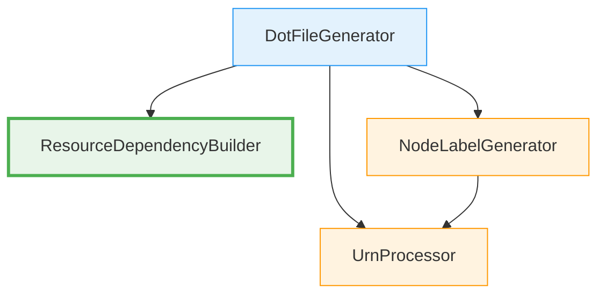

# 詳細設計書: Issue #463

## Issue情報

- **Issue番号**: #463
- **タイトル**: [Refactor] dot_processor.py - Phase 2-3: ResourceDependencyBuilderクラスの抽出
- **URL**: https://github.com/tielec/infrastructure-as-code/issues/463
- **親Issue**: #448
- **依存Issue**: #460 (Phase 1: 基盤整備), #461 (Phase 2-1: UrnProcessor)

---

## 0. Planning Documentの確認

Planning Phaseで策定された以下の開発計画を設計に反映します：

### 実装戦略
- **戦略**: REFACTOR
- **根拠**: 既存のDotFileProcessorから依存関係処理ロジックを抽出して新規クラスに分離

### テスト戦略
- **戦略**: UNIT_INTEGRATION
- **UNIT（必須）**: ResourceDependencyBuilderクラス単独での動作を検証（カバレッジ80%以上）
- **INTEGRATION（必須）**: DotFileProcessorとの統合を検証（既存テストが全てパス）

### 見積もり工数
- **合計**: 8~12時間
- **設計フェーズ**: 1.5~2時間（このドキュメント）

---

## 1. アーキテクチャ設計

### 1.1 システム全体図

```
┌─────────────────────────────────────────────────────────┐
│                    DotFileGenerator                     │
│  ・スタックノード生成                                   │
│  ・プロバイダーノード生成                               │
│  ・リソースノード生成                                   │
│  ・DOT形式文字列エスケープ                              │
│  ・全体のDOTファイル生成オーケストレーション           │
└────────────────┬────────────────────────────────────────┘
                 │ 委譲 (依存関係処理のみ)
                 ↓
┌─────────────────────────────────────────────────────────┐
│           ResourceDependencyBuilder（新規）             │
│  ・URNマッピング作成                                    │
│  ・直接依存関係追加                                     │
│  ・親依存関係追加                                       │
│  ・プロパティ依存関係追加                               │
│  ・依存関係グラフ構築オーケストレーション               │
└─────────────────────────────────────────────────────────┘

【既存クラス（Phase 2-1, 2-2で抽出済み）】
┌─────────────────────────────────────────────────────────┐
│                    UrnProcessor                         │
│  ・URN解析                                              │
│  ・ラベル生成補助                                       │
└─────────────────────────────────────────────────────────┘

┌─────────────────────────────────────────────────────────┐
│                NodeLabelGenerator                       │
│  ・ノードラベル生成                                     │
│  ・プロバイダー別色設定                                 │
└─────────────────────────────────────────────────────────┘
```

### 1.2 コンポーネント間の関係



**依存関係の説明**:
- `DotFileGenerator` → `ResourceDependencyBuilder`: 依存関係処理を委譲（新規）
- `DotFileGenerator` → `UrnProcessor`: URN解析を委譲（既存、Phase 2-1）
- `DotFileGenerator` → `NodeLabelGenerator`: ノードラベル生成を委譲（既存、Phase 2-2）
- `NodeLabelGenerator` → `UrnProcessor`: ラベル生成補助を利用（既存）

**重要な設計原則**:
- **単一責任原則**: 各クラスは明確な責務を持つ
- **循環依存の回避**: ResourceDependencyBuilderは他のクラスに依存しない
- **ステートレス設計**: すべてのメソッドは静的メソッド

### 1.3 データフロー

```
1. DotFileGenerator.create_dot_file() 呼び出し
   ↓
2. スタック、プロバイダー、リソースノード生成
   ↓
3. DotFileGenerator._add_resource_dependencies()
   ↓
4. ResourceDependencyBuilder.add_resource_dependencies() に委譲
   ↓ (内部処理)
5. ResourceDependencyBuilder.create_urn_to_node_mapping()
   - URN → ノードIDマッピング辞書を作成
   ↓
6. ResourceDependencyBuilder._add_dependencies_for_resource()
   - 各リソースの依存関係を順次処理
   ↓
7. 3種類の依存関係を順次追加
   7a. _add_direct_dependencies() - 直接依存
   7b. _add_parent_dependency() - 親依存
   7c. _add_property_dependencies() - プロパティ依存
   ↓
8. dot_linesリストに依存関係エッジを破壊的追加
   ↓
9. DotFileGeneratorに制御を返す
   ↓
10. DOT形式文字列リストを返す
```

---

## 2. 実装戦略判断

### 実装戦略: REFACTOR

**判断根拠**:
1. **既存機能の維持**: `DotFileGenerator._add_resource_dependencies()`の機能を完全に維持
2. **責務分離が目的**: 新機能追加ではなく、既存コードの構造改善
3. **外部インターフェース不変**: `DotFileGenerator.create_dot_file()`のシグネチャは変更しない
4. **段階的リファクタリング**: Issue #448の計画に基づく第3フェーズ（Phase 2-3）
5. **既存テストの再利用**: `test_dot_processor.py`の既存テストが引き続き動作

**リファクタリングの範囲**:
- **抽出対象**: `DotFileGenerator`の6メソッド（L176-L248）
  - `_create_urn_to_node_mapping()`
  - `_add_dependencies_for_resource()`
  - `_add_direct_dependencies()`
  - `_add_parent_dependency()`
  - `_add_property_dependencies()`
  - （`_add_resource_dependencies()`は委譲呼び出しのみに変更）

- **非抽出対象**: 以下は`DotFileGenerator`に残す
  - エスケープ処理（`escape_dot_string()`）
  - スタック/プロバイダー/リソースノード生成
  - 色設定（`PROVIDER_COLORS`）

---

## 3. テスト戦略判断

### テスト戦略: UNIT_INTEGRATION

**判断根拠**:

#### UNIT（必須）の理由:
1. **単独動作の保証**: `ResourceDependencyBuilder`が`DotFileGenerator`なしで動作する必要がある
2. **カバレッジ目標**: 80%以上のカバレッジが要件（Issue #463の完了条件）
3. **エッジケースの検証**: 循環依存、空リソース、不正URNなどの境界条件を細かく検証
4. **保守性**: 将来的な拡張（新しい依存関係タイプ追加など）に対して変更影響範囲を特定しやすい

#### INTEGRATION（必須）の理由:
1. **リグレッションテスト**: 既存の`test_dot_processor.py`が全てパス（Issue #463の完了条件）
2. **統合動作の保証**: `DotFileGenerator`から`ResourceDependencyBuilder`への委譲が正しく機能
3. **end-to-endの検証**: 実際のDOTファイル生成プロセス全体での動作確認
4. **既存テストの再利用**: 既存の特性テスト（Characterization Test）がそのまま統合テストとして機能

#### BDDが不要な理由:
- エンドユーザー向け機能ではなく、内部リファクタリング
- ユーザーストーリーよりも技術的な正確性が重要
- 既存の特性テストで動作を記録済み

---

## 4. テストコード戦略判断

### テストコード戦略: BOTH_TEST

**判断根拠**:

#### CREATE_TEST（新規テスト作成）の理由:
1. **新規クラス専用テスト**: `test_resource_dependency_builder.py`を新規作成
2. **単体テストカバレッジ**: `ResourceDependencyBuilder`単独で80%以上のカバレッジを達成
3. **詳細な検証**: 各メソッドの動作を個別にテスト
4. **テスト構成**:
   - URNマッピング作成のテスト（正常系、空リスト、重複URN）
   - 直接依存関係追加のテスト（正常系、空依存、存在しないURN）
   - 親依存関係追加のテスト（正常系、親なし、存在しないURN）
   - プロパティ依存関係追加のテスト（正常系、空辞書、長いプロパティ名）
   - 複合シナリオ（複数の依存関係タイプが混在）
   - エッジケース（循環依存、最大20リソース、21リソース以上）

#### EXTEND_TEST（既存テスト拡張）の理由:
1. **統合テストとして機能**: 既存の`test_dot_processor.py`を統合テストとして継続使用
2. **リグレッション防止**: 既存テストが全てパスすることでリファクタリングの正しさを保証
3. **変更不要**: 外部インターフェース（`DotFileGenerator.create_dot_file()`）が不変のため
4. **特性テストの維持**: 既存の動作記録（Characterization Test）を維持

---

## 5. 影響範囲分析

### 5.1 既存コードへの影響

#### 変更が必要なファイル:

1. **`src/dot_processor.py`（修正）**:
   - **変更箇所**:
     - L159-L173: `_add_resource_dependencies()`メソッド - 委譲呼び出しに変更
     - L176-L248: 6メソッドを削除（ResourceDependencyBuilderに移動）
   - **変更内容**:
     ```python
     @staticmethod
     def _add_resource_dependencies(resources: List[Dict], dot_lines: List[str]):
         """リソース間の依存関係を追加（ResourceDependencyBuilderに委譲）"""
         ResourceDependencyBuilder.add_resource_dependencies(resources, dot_lines)
     ```
   - **追加import**:
     ```python
     from resource_dependency_builder import ResourceDependencyBuilder
     ```

2. **`src/resource_dependency_builder.py`（新規作成）**:
   - **ファイルパス**: `jenkins/jobs/pipeline/infrastructure/pulumi-stack-action/src/resource_dependency_builder.py`
   - **内容**: 依存関係グラフ構築ロジック（6メソッド）

3. **`tests/test_resource_dependency_builder.py`（新規作成）**:
   - **ファイルパス**: `jenkins/jobs/pipeline/infrastructure/pulumi-stack-action/tests/test_resource_dependency_builder.py`
   - **内容**: ResourceDependencyBuilder単体テスト（カバレッジ80%以上）

#### 変更が不要なファイル:

1. **`tests/test_dot_processor.py`**: 外部インターフェースが不変のため、テストコードの変更不要
2. **`tests/conftest.py`**: 新規fixtureの追加のみ（既存fixtureは変更不要）
3. **`src/urn_processor.py`**: 依存なし、変更不要
4. **`src/node_label_generator.py`**: 依存なし、変更不要

### 5.2 依存関係の変更

#### 新規依存:
- **なし** - 標準ライブラリのみ使用（`typing`, `re`は不要、`List`, `Dict`のみ）

#### 既存依存の変更:
- `DotFileGenerator` → `ResourceDependencyBuilder`（新規）
- `ResourceDependencyBuilder`は独立したモジュール（他のクラスに依存しない）
- **循環依存なし**: ResourceDependencyBuilderはDotFileGeneratorに依存しない

### 5.3 マイグレーション要否

- **不要** - 外部APIやデータベーススキーマの変更なし
- **既存機能の互換性**: 完全に維持（`create_dot_file()`のシグネチャ不変）
- **データ構造の変更**: なし

---

## 6. 変更・追加ファイルリスト

### 6.1 新規作成ファイル（相対パス）

1. `jenkins/jobs/pipeline/infrastructure/pulumi-stack-action/src/resource_dependency_builder.py`
   - 役割: 依存関係グラフ構築ロジック
   - サイズ見積もり: 約250行（docstring含む）

2. `jenkins/jobs/pipeline/infrastructure/pulumi-stack-action/tests/test_resource_dependency_builder.py`
   - 役割: ResourceDependencyBuilder単体テスト
   - サイズ見積もり: 約600-800行（カバレッジ80%達成）

### 6.2 修正が必要な既存ファイル（相対パス）

1. `jenkins/jobs/pipeline/infrastructure/pulumi-stack-action/src/dot_processor.py`
   - **修正行**: L159-L173（`_add_resource_dependencies()`メソッド）
   - **削除行**: L176-L248（6メソッド、73行）
   - **追加行**: importステートメント1行、委譲呼び出し3行
   - **正味削減**: 約70行

2. `jenkins/jobs/pipeline/infrastructure/pulumi-stack-action/tests/conftest.py`
   - **追加行**: 新規fixture（`resource_dependency_builder`）、約5行

### 6.3 削除が必要なファイル（相対パス）

- **なし**

---

## 7. 詳細設計

### 7.1 クラス設計

#### ResourceDependencyBuilder

**責務**: リソース間の依存関係グラフ構築と検証

**設計方針**:
- **ステートレス**: すべてのメソッドは静的メソッド（インスタンス生成不要）
- **疎結合**: 他のクラスに依存しない（typing.List, typing.Dictのみ）
- **単一責任**: 依存関係処理のみに特化
- **拡張可能**: 新しい依存関係タイプの追加が容易

**クラス構造**:

```python
"""
Resource dependency graph builder for Pulumi DOT files

このモジュールはPulumiリソース間の依存関係グラフ構築の責務を担当します。

主要機能:
- URNマッピング作成: リソースURNからノードIDへのマッピング
- 依存関係追加: 直接、親、プロパティの3種類の依存関係
- エッジ生成: DOT形式の依存関係エッジ文字列生成

設計方針:
- すべてのメソッドは静的メソッド（ステートレス設計）
- 他のクラスに依存しない（疎結合）
- 拡張可能な設計（新しい依存関係タイプ追加が容易）

依存関係:
- typing: 型ヒント（List, Dict）のみ
"""

from typing import Dict, List


class ResourceDependencyBuilder:
    """リソース依存関係グラフ構築の責務を担当

    Pulumiリソース間の依存関係を解析し、DOT形式のエッジ定義を生成します。
    3種類の依存関係（直接、親、プロパティ）をサポートします。

    設計方針:
    - すべてのメソッドは静的メソッド（ステートレス設計）
    - 破壊的更新: dot_linesリストを直接変更
    - エラー安全: 不正なURNや存在しないURNを安全に処理

    Examples:
        >>> resources = [
        ...     {'urn': 'urn:pulumi:dev::myproject::aws:s3/bucket:Bucket::bucket-a',
        ...      'dependencies': [], 'parent': None, 'propertyDependencies': {}},
        ...     {'urn': 'urn:pulumi:dev::myproject::aws:s3/bucket:Bucket::bucket-b',
        ...      'dependencies': ['urn:pulumi:dev::myproject::aws:s3/bucket:Bucket::bucket-a'],
        ...      'parent': None, 'propertyDependencies': {}}
        ... ]
        >>> dot_lines = []
        >>> ResourceDependencyBuilder.add_resource_dependencies(resources, dot_lines)
        >>> print(dot_lines)
        ['', '    // リソース間の依存関係', '    "resource_1" -> "resource_0" [style=solid, ...]']
    """

    # 依存関係スタイル定数（DOT形式）
    DIRECT_DEPENDENCY_STYLE = 'style=solid, color="#9C27B0", fontsize="10"'
    PARENT_DEPENDENCY_STYLE = 'style=dashed, color="#2196F3", label="parent", fontsize="10"'
    PROPERTY_DEPENDENCY_STYLE = 'style=dotted, color="#FF5722", fontsize="9"'

    @staticmethod
    def add_resource_dependencies(resources: List[Dict], dot_lines: List[str]) -> None:
        """リソース間の依存関係をDOT形式で追加（エントリーポイント）"""
        # 実装詳細は7.2参照
        pass

    @staticmethod
    def create_urn_to_node_mapping(resources: List[Dict]) -> Dict[str, str]:
        """URNからノードIDへのマッピングを作成"""
        # 実装詳細は7.2参照
        pass

    @staticmethod
    def _add_dependencies_for_resource(
        resource_index: int,
        resource: Dict,
        urn_to_node_id: Dict[str, str],
        dot_lines: List[str]
    ) -> None:
        """単一リソースの全依存関係を追加（プライベート）"""
        # 実装詳細は7.2参照
        pass

    @staticmethod
    def _add_direct_dependencies(
        node_id: str,
        resource: Dict,
        urn_to_node_id: Dict[str, str],
        dot_lines: List[str]
    ) -> None:
        """直接的な依存関係を追加（プライベート）"""
        # 実装詳細は7.2参照
        pass

    @staticmethod
    def _add_parent_dependency(
        node_id: str,
        resource: Dict,
        urn_to_node_id: Dict[str, str],
        dot_lines: List[str]
    ) -> None:
        """親リソースへの依存を追加（プライベート）"""
        # 実装詳細は7.2参照
        pass

    @staticmethod
    def _add_property_dependencies(
        node_id: str,
        resource: Dict,
        urn_to_node_id: Dict[str, str],
        dot_lines: List[str]
    ) -> None:
        """プロパティ依存を追加（プライベート）"""
        # 実装詳細は7.2参照
        pass
```

**メソッド一覧**:

| メソッド名 | 可視性 | 役割 | 戻り値 |
|-----------|--------|------|--------|
| `add_resource_dependencies()` | public | エントリーポイント、依存関係追加のオーケストレーション | None |
| `create_urn_to_node_mapping()` | public | URNマッピング作成 | Dict[str, str] |
| `_add_dependencies_for_resource()` | private | 単一リソースの依存関係処理 | None |
| `_add_direct_dependencies()` | private | 直接依存関係追加 | None |
| `_add_parent_dependency()` | private | 親依存関係追加 | None |
| `_add_property_dependencies()` | private | プロパティ依存関係追加 | None |

### 7.2 関数設計（主要な関数のみ）

#### 7.2.1 add_resource_dependencies()

**シグネチャ**:
```python
@staticmethod
def add_resource_dependencies(resources: List[Dict], dot_lines: List[str]) -> None:
    """リソース間の依存関係をDOT形式で追加

    リソースリストから依存関係を解析し、DOT形式のエッジ定義を
    dot_linesリストに破壊的に追加します。

    Args:
        resources (List[Dict]): リソースリスト（最大20個）
            各リソースは以下のキーを持つ辞書:
            - urn (str): リソースURN
            - dependencies (List[str]): 依存URNリスト
            - parent (str | None): 親リソースURN
            - propertyDependencies (Dict[str, List[str]]): プロパティ依存辞書
        dot_lines (List[str]): DOT形式文字列リスト（破壊的更新）

    Returns:
        None: dot_linesを直接変更

    Examples:
        >>> resources = [
        ...     {'urn': 'urn:pulumi:dev::myproject::aws:s3/bucket:Bucket::bucket-a',
        ...      'dependencies': [], 'parent': None, 'propertyDependencies': {}},
        ...     {'urn': 'urn:pulumi:dev::myproject::aws:s3/bucket:Bucket::bucket-b',
        ...      'dependencies': ['urn:pulumi:dev::myproject::aws:s3/bucket:Bucket::bucket-a'],
        ...      'parent': None, 'propertyDependencies': {}}
        ... ]
        >>> dot_lines = []
        >>> ResourceDependencyBuilder.add_resource_dependencies(resources, dot_lines)
        >>> len(dot_lines) > 0
        True

    Note:
        - リソースが1個以下の場合は何もしない
        - 最大20リソースまで処理（仕様）
        - 不正なURNや存在しないURNは安全にスキップ
    """
```

**処理フロー**:
```
1. リソース数チェック（1個以下なら終了）
2. コメント行追加（'// リソース間の依存関係'）
3. URNマッピング作成（create_urn_to_node_mapping()）
4. 各リソースの依存関係処理（_add_dependencies_for_resource()）
```

**実装（既存コードから抽出）**:
```python
@staticmethod
def add_resource_dependencies(resources: List[Dict], dot_lines: List[str]) -> None:
    """リソース間の依存関係を追加"""
    if len(resources) <= 1:
        return

    dot_lines.extend(['', '    // リソース間の依存関係'])

    # リソースのURNからIDへのマッピングを作成
    urn_to_node_id = ResourceDependencyBuilder.create_urn_to_node_mapping(resources)

    # 各リソースの依存関係を処理
    for i, resource in enumerate(resources):
        ResourceDependencyBuilder._add_dependencies_for_resource(
            i, resource, urn_to_node_id, dot_lines
        )
```

**エッジケース**:
- 空リスト: 何もしない
- 1個のリソース: 何もしない（依存関係がないため）
- 2個以上: 依存関係処理を実行

#### 7.2.2 create_urn_to_node_mapping()

**シグネチャ**:
```python
@staticmethod
def create_urn_to_node_mapping(resources: List[Dict]) -> Dict[str, str]:
    """URNからノードIDへのマッピングを作成

    リソースリストからURN文字列をキー、ノードID（`resource_{i}`形式）を
    値とする辞書を作成します。

    Args:
        resources (List[Dict]): リソースリスト
            各リソースは'urn'キーを持つ辞書

    Returns:
        Dict[str, str]: URN → ノードIDのマッピング辞書
            例: {'urn:pulumi:dev::myproject::aws:s3/bucket:Bucket::my-bucket': 'resource_0'}

    Examples:
        >>> resources = [
        ...     {'urn': 'urn:pulumi:dev::myproject::aws:s3/bucket:Bucket::bucket-a'},
        ...     {'urn': 'urn:pulumi:dev::myproject::aws:s3/bucket:Bucket::bucket-b'}
        ... ]
        >>> mapping = ResourceDependencyBuilder.create_urn_to_node_mapping(resources)
        >>> mapping['urn:pulumi:dev::myproject::aws:s3/bucket:Bucket::bucket-a']
        'resource_0'
        >>> mapping['urn:pulumi:dev::myproject::aws:s3/bucket:Bucket::bucket-b']
        'resource_1'

    Note:
        - 空リストの場合は空の辞書を返す
        - 重複URNの場合は最初のリソースのノードIDを使用
        - 'urn'キーが存在しないリソースは空文字列をキーとして扱う
    """
```

**実装（既存コードから抽出）**:
```python
@staticmethod
def create_urn_to_node_mapping(resources: List[Dict]) -> Dict[str, str]:
    """URNからノードIDへのマッピングを作成"""
    mapping = {}
    for i, resource in enumerate(resources):
        urn = resource.get('urn', '')
        mapping[urn] = f'resource_{i}'
    return mapping
```

#### 7.2.3 _add_dependencies_for_resource()

**シグネチャ**:
```python
@staticmethod
def _add_dependencies_for_resource(
    resource_index: int,
    resource: Dict,
    urn_to_node_id: Dict[str, str],
    dot_lines: List[str]
) -> None:
    """単一リソースの全依存関係を追加（プライベート）

    単一リソースの直接依存、親依存、プロパティ依存の3種類を
    順次処理します。

    Args:
        resource_index (int): リソースのインデックス（0始まり）
        resource (Dict): リソース辞書
        urn_to_node_id (Dict[str, str]): URNマッピング
        dot_lines (List[str]): DOT形式文字列リスト（破壊的更新）

    Returns:
        None: dot_linesを直接変更

    Note:
        - プライベートメソッド（_プレフィックス）
        - 処理順序: 直接 → 親 → プロパティ
    """
```

**処理フロー**:
```
1. ノードID生成（`resource_{resource_index}`）
2. 直接依存関係追加（_add_direct_dependencies()）
3. 親依存関係追加（_add_parent_dependency()）
4. プロパティ依存関係追加（_add_property_dependencies()）
```

**実装（既存コードから抽出）**:
```python
@staticmethod
def _add_dependencies_for_resource(
    resource_index: int,
    resource: Dict,
    urn_to_node_id: Dict[str, str],
    dot_lines: List[str]
) -> None:
    """単一リソースの依存関係を追加"""
    node_id = f'resource_{resource_index}'

    # 通常の依存関係を追加
    ResourceDependencyBuilder._add_direct_dependencies(
        node_id, resource, urn_to_node_id, dot_lines
    )

    # 親リソースへの依存を追加
    ResourceDependencyBuilder._add_parent_dependency(
        node_id, resource, urn_to_node_id, dot_lines
    )

    # プロパティ依存を追加
    ResourceDependencyBuilder._add_property_dependencies(
        node_id, resource, urn_to_node_id, dot_lines
    )
```

#### 7.2.4 _add_direct_dependencies()

**シグネチャ**:
```python
@staticmethod
def _add_direct_dependencies(
    node_id: str,
    resource: Dict,
    urn_to_node_id: Dict[str, str],
    dot_lines: List[str]
) -> None:
    """直接的な依存関係を追加（プライベート）

    リソースの'dependencies'フィールドから直接依存関係を抽出し、
    DOT形式のエッジ定義を生成します。

    Args:
        node_id (str): ノードID（例: 'resource_0'）
        resource (Dict): リソース辞書
            - dependencies (List[str]): 依存URNリスト
        urn_to_node_id (Dict[str, str]): URNマッピング
        dot_lines (List[str]): DOT形式文字列リスト（破壊的更新）

    Returns:
        None: dot_linesを直接変更

    Examples:
        >>> node_id = 'resource_1'
        >>> resource = {
        ...     'dependencies': ['urn:pulumi:dev::myproject::aws:s3/bucket:Bucket::bucket-a']
        ... }
        >>> urn_to_node_id = {
        ...     'urn:pulumi:dev::myproject::aws:s3/bucket:Bucket::bucket-a': 'resource_0'
        ... }
        >>> dot_lines = []
        >>> ResourceDependencyBuilder._add_direct_dependencies(
        ...     node_id, resource, urn_to_node_id, dot_lines
        ... )
        >>> dot_lines[0]
        '    "resource_1" -> "resource_0" [style=solid, color="#9C27B0", fontsize="10"];'

    Note:
        - 'dependencies'フィールドが存在しない場合は何もしない
        - URNマッピングに存在しないURNはスキップ
        - スタイル: solid, color="#9C27B0"
    """
```

**エッジケース**:
- 空の依存リスト: 何もしない
- 存在しないURN: スキップ（URNマッピングに存在しない場合）

**実装（既存コードから抽出）**:
```python
@staticmethod
def _add_direct_dependencies(
    node_id: str,
    resource: Dict,
    urn_to_node_id: Dict[str, str],
    dot_lines: List[str]
) -> None:
    """直接的な依存関係を追加"""
    dependencies = resource.get('dependencies', [])
    for dep_urn in dependencies:
        if dep_urn in urn_to_node_id:
            dep_node_id = urn_to_node_id[dep_urn]
            dot_lines.append(
                f'    "{node_id}" -> "{dep_node_id}" '
                f'[{ResourceDependencyBuilder.DIRECT_DEPENDENCY_STYLE}];'
            )
```

#### 7.2.5 _add_parent_dependency()

**シグネチャ**:
```python
@staticmethod
def _add_parent_dependency(
    node_id: str,
    resource: Dict,
    urn_to_node_id: Dict[str, str],
    dot_lines: List[str]
) -> None:
    """親リソースへの依存を追加（プライベート）

    リソースの'parent'フィールドから親依存関係を抽出し、
    DOT形式のエッジ定義を生成します。

    Args:
        node_id (str): ノードID（例: 'resource_0'）
        resource (Dict): リソース辞書
            - parent (str | None): 親リソースURN
        urn_to_node_id (Dict[str, str]): URNマッピング
        dot_lines (List[str]): DOT形式文字列リスト（破壊的更新）

    Returns:
        None: dot_linesを直接変更

    Examples:
        >>> node_id = 'resource_1'
        >>> resource = {
        ...     'parent': 'urn:pulumi:dev::myproject::aws:s3/bucket:Bucket::bucket-a'
        ... }
        >>> urn_to_node_id = {
        ...     'urn:pulumi:dev::myproject::aws:s3/bucket:Bucket::bucket-a': 'resource_0'
        ... }
        >>> dot_lines = []
        >>> ResourceDependencyBuilder._add_parent_dependency(
        ...     node_id, resource, urn_to_node_id, dot_lines
        ... )
        >>> dot_lines[0]
        '    "resource_1" -> "resource_0" [style=dashed, color="#2196F3", label="parent", fontsize="10"];'

    Note:
        - 'parent'がNoneまたは空文字列の場合は何もしない
        - URNマッピングに存在しないURNはスキップ
        - スタイル: dashed, color="#2196F3", label="parent"
    """
```

**エッジケース**:
- parent=None: 何もしない
- parent=空文字列: 何もしない
- 存在しないURN: スキップ

**実装（既存コードから抽出）**:
```python
@staticmethod
def _add_parent_dependency(
    node_id: str,
    resource: Dict,
    urn_to_node_id: Dict[str, str],
    dot_lines: List[str]
) -> None:
    """親リソースへの依存を追加"""
    parent = resource.get('parent')
    if parent and parent in urn_to_node_id:
        parent_node_id = urn_to_node_id[parent]
        dot_lines.append(
            f'    "{node_id}" -> "{parent_node_id}" '
            f'[{ResourceDependencyBuilder.PARENT_DEPENDENCY_STYLE}];'
        )
```

#### 7.2.6 _add_property_dependencies()

**シグネチャ**:
```python
@staticmethod
def _add_property_dependencies(
    node_id: str,
    resource: Dict,
    urn_to_node_id: Dict[str, str],
    dot_lines: List[str]
) -> None:
    """プロパティ依存を追加（プライベート）

    リソースの'propertyDependencies'フィールドからプロパティ依存関係を
    抽出し、DOT形式のエッジ定義を生成します。

    Args:
        node_id (str): ノードID（例: 'resource_0'）
        resource (Dict): リソース辞書
            - propertyDependencies (Dict[str, List[str]]): プロパティ依存辞書
                キー: プロパティ名（例: 'vpc.id'）
                値: 依存URNリスト
        urn_to_node_id (Dict[str, str]): URNマッピング
        dot_lines (List[str]): DOT形式文字列リスト（破壊的更新）

    Returns:
        None: dot_linesを直接変更

    Examples:
        >>> node_id = 'resource_1'
        >>> resource = {
        ...     'propertyDependencies': {
        ...         'vpc.id': ['urn:pulumi:dev::myproject::aws:ec2/vpc:Vpc::my-vpc']
        ...     }
        ... }
        >>> urn_to_node_id = {
        ...     'urn:pulumi:dev::myproject::aws:ec2/vpc:Vpc::my-vpc': 'resource_0'
        ... }
        >>> dot_lines = []
        >>> ResourceDependencyBuilder._add_property_dependencies(
        ...     node_id, resource, urn_to_node_id, dot_lines
        ... )
        >>> dot_lines[0]
        '    "resource_1" -> "resource_0" [style=dotted, color="#FF5722", label="id", fontsize="9"];'

    Note:
        - 'propertyDependencies'が存在しない場合は何もしない
        - プロパティ名が長い場合は末尾のみを使用（例: 'vpc.id' → 'id'）
        - URNマッピングに存在しないURNはスキップ
        - スタイル: dotted, color="#FF5722"
    """
```

**エッジケース**:
- 空の辞書: 何もしない
- 存在しないURN: スキップ
- 長いプロパティ名: 末尾のみ使用（`vpc.subnet.id` → `id`）

**実装（既存コードから抽出）**:
```python
@staticmethod
def _add_property_dependencies(
    node_id: str,
    resource: Dict,
    urn_to_node_id: Dict[str, str],
    dot_lines: List[str]
) -> None:
    """プロパティ依存を追加"""
    prop_deps = resource.get('propertyDependencies', {})
    for prop_name, dep_urns in prop_deps.items():
        for dep_urn in dep_urns:
            if dep_urn in urn_to_node_id:
                dep_node_id = urn_to_node_id[dep_urn]
                # 短いプロパティ名を表示
                short_prop = prop_name.split('.')[-1] if '.' in prop_name else prop_name
                dot_lines.append(
                    f'    "{node_id}" -> "{dep_node_id}" '
                    f'[style=dotted, color="#FF5722", label="{short_prop}", fontsize="9"];'
                )
```

### 7.3 データ構造設計

#### 7.3.1 入力データ構造

**resources: List[Dict]**

リソースリストは以下の構造を持つ辞書のリスト:

```python
{
    'type': str,                           # リソースタイプ（例: 'aws:s3/bucket:Bucket'）
    'urn': str,                            # リソースURN（必須）
    'dependencies': List[str],             # 直接依存URNリスト
    'parent': str | None,                  # 親リソースURN
    'propertyDependencies': Dict[str, List[str]]  # プロパティ依存辞書
}
```

**例**:
```python
resources = [
    {
        'type': 'aws:s3/bucket:Bucket',
        'urn': 'urn:pulumi:dev::myproject::aws:s3/bucket:Bucket::my-bucket',
        'dependencies': [],
        'parent': None,
        'propertyDependencies': {}
    },
    {
        'type': 'aws:s3/bucketObject:BucketObject',
        'urn': 'urn:pulumi:dev::myproject::aws:s3/bucketObject:BucketObject::my-object',
        'dependencies': ['urn:pulumi:dev::myproject::aws:s3/bucket:Bucket::my-bucket'],
        'parent': None,
        'propertyDependencies': {
            'bucket': ['urn:pulumi:dev::myproject::aws:s3/bucket:Bucket::my-bucket']
        }
    }
]
```

#### 7.3.2 中間データ構造

**urn_to_node_id: Dict[str, str]**

URN文字列からノードIDへのマッピング:

```python
{
    'urn:pulumi:dev::myproject::aws:s3/bucket:Bucket::my-bucket': 'resource_0',
    'urn:pulumi:dev::myproject::aws:s3/bucketObject:BucketObject::my-object': 'resource_1'
}
```

**特性**:
- キー: URN文字列（完全なPulumi URN）
- 値: ノードID（`resource_{i}`形式、iは0始まりのインデックス）
- 用途: 依存URNからノードIDへの高速変換（O(1)）

#### 7.3.3 出力データ構造

**dot_lines: List[str]**

DOT形式の文字列リスト（破壊的に更新）:

```python
[
    'digraph G {',
    '    graph [rankdir=TB, ...];',
    '    ...',
    '',
    '    // リソース間の依存関係',
    '    "resource_1" -> "resource_0" [style=solid, color="#9C27B0", fontsize="10"];',
    '    "resource_1" -> "resource_0" [style=dotted, color="#FF5722", label="bucket", fontsize="9"];',
    '}'
]
```

**エッジ定義の形式**:
- 直接依存: `"resource_1" -> "resource_0" [style=solid, color="#9C27B0", fontsize="10"];`
- 親依存: `"resource_1" -> "resource_0" [style=dashed, color="#2196F3", label="parent", fontsize="10"];`
- プロパティ依存: `"resource_1" -> "resource_0" [style=dotted, color="#FF5722", label="bucket", fontsize="9"];`

### 7.4 インターフェース設計

#### 7.4.1 公開インターフェース（パブリックAPI）

ResourceDependencyBuilderは以下の2つの公開メソッドを提供:

**1. add_resource_dependencies()**
- **目的**: 依存関係追加のエントリーポイント
- **呼び出し元**: `DotFileGenerator._add_resource_dependencies()`
- **引数**: resources（リソースリスト）、dot_lines（DOT行リスト）
- **戻り値**: None（dot_linesを破壊的更新）

**2. create_urn_to_node_mapping()**
- **目的**: URNマッピング作成（テスト用にも公開）
- **呼び出し元**: `add_resource_dependencies()`（内部）、単体テスト
- **引数**: resources（リソースリスト）
- **戻り値**: Dict[str, str]（URN → ノードIDマッピング）

#### 7.4.2 プライベートインターフェース（内部API）

以下の4メソッドはプライベート（_プレフィックス）:

- `_add_dependencies_for_resource()`: 単一リソース処理
- `_add_direct_dependencies()`: 直接依存追加
- `_add_parent_dependency()`: 親依存追加
- `_add_property_dependencies()`: プロパティ依存追加

**理由**:
- 外部から直接呼び出す必要がない
- 実装の詳細（内部処理）
- 将来的なリファクタリングの自由度を保つ

#### 7.4.3 DotFileGeneratorとの連携

**変更前**:
```python
# DotFileGenerator._add_resource_dependencies()
@staticmethod
def _add_resource_dependencies(resources: List[Dict], dot_lines: List[str]):
    """リソース間の依存関係を追加（汎用版）"""
    if len(resources) <= 1:
        return

    dot_lines.extend(['', '    // リソース間の依存関係'])

    # リソースのURNからIDへのマッピングを作成
    urn_to_node_id = DotFileGenerator._create_urn_to_node_mapping(resources)

    # 各リソースの依存関係を処理
    for i, resource in enumerate(resources):
        DotFileGenerator._add_dependencies_for_resource(
            i, resource, urn_to_node_id, dot_lines
        )
```

**変更後**:
```python
# DotFileGenerator._add_resource_dependencies()（委譲のみ）
@staticmethod
def _add_resource_dependencies(resources: List[Dict], dot_lines: List[str]):
    """リソース間の依存関係を追加（ResourceDependencyBuilderに委譲）"""
    ResourceDependencyBuilder.add_resource_dependencies(resources, dot_lines)
```

**影響**:
- 外部インターフェース不変（`create_dot_file()`から見た動作は変わらない）
- 内部実装の変更のみ（委譲パターン）

---

## 8. セキュリティ考慮事項

### 8.1 認証・認可
- **該当なし**: 内部モジュールであり、外部からの直接アクセスなし

### 8.2 データ保護
- **機密情報の扱い**: URN文字列にはプロジェクト名、スタック名が含まれる可能性があるが、ログ出力は行わない
- **入力検証**: 不正なURNや存在しないURNに対して例外を投げず、安全にスキップ
- **メモリ安全性**: 最大20リソースの制限により、メモリ使用量は制限される

### 8.3 セキュリティリスクと対策

| リスク | 影響度 | 対策 |
|--------|--------|------|
| 不正なURN形式による例外 | 低 | デフォルト値を返し、例外を投げない |
| 循環依存による無限ループ | 低 | 循環依存は単にエッジとして表現（ループしない） |
| メモリ枯渇 | 低 | 最大20リソースの制限（既存仕様） |
| URN情報の漏洩 | 低 | ログ出力なし、エラーメッセージにURNを含めない |

---

## 9. 非機能要件への対応

### 9.1 パフォーマンス

**要件（NFR-1より）**:
- 最大リソース数: 20個
- 処理時間: 20リソースの依存関係処理を100ms以内
- メモリ使用量: URNマッピング辞書のメモリ使用量は最大10KB以内

**対応**:
- **時間計算量**: O(n)（nはリソース数、最大20）
  - URNマッピング作成: O(n)
  - 各リソースの依存関係処理: O(n * m)（mは平均依存数、通常1-5個）
  - 合計: O(n * m) ≈ O(20 * 5) = O(100) → 定数時間
- **空間計算量**: O(n)
  - URNマッピング辞書: 最大20エントリ
  - 各URN文字列: 平均100文字 → 20 * 100 = 2KB << 10KB
- **最適化**:
  - URNマッピングは1回のみ作成（再利用）
  - 不要なコピー操作なし（破壊的更新）

### 9.2 スケーラビリティ

**制約**: 最大20リソース（既存仕様を維持）

**理由**:
- Pulumi生成グラフの可読性を保つ
- DOTファイルのレンダリング性能
- 既存の`create_dot_file()`が`resources[:20]`でスライス

**将来的な拡張**:
- 20リソース以上のサポートが必要な場合、`add_resource_dependencies()`のシグネチャは変更不要
- リソース数制限の緩和は呼び出し元（`DotFileGenerator`）で対応

### 9.3 保守性

**要件（NFR-3より）**:
- コードカバレッジ: 単体テストカバレッジ80%以上（必須）
- ドキュメント: 各メソッドにdocstring（Args, Returns, Examples）を記述
- 命名規則: PEP 8準拠、意図が明確な変数名・メソッド名
- 複雑度: 各メソッドのサイクロマティック複雑度は10以下

**対応**:
- **docstring**: すべてのメソッドにGoogle Style docstringを記述
- **命名規則**: PEP 8準拠
  - クラス名: PascalCase（`ResourceDependencyBuilder`）
  - メソッド名: snake_case（`add_resource_dependencies`）
  - プライベートメソッド: _プレフィックス（`_add_direct_dependencies`）
  - 定数: UPPER_SNAKE_CASE（`DIRECT_DEPENDENCY_STYLE`）
- **複雑度**:
  - 最も複雑なメソッド: `_add_property_dependencies()`
  - サイクロマティック複雑度: 3（ifネスト2個） << 10

**保守性向上のポイント**:
- ステートレス設計（静的メソッド）
- 疎結合（他のクラスに依存しない）
- 単一責任（依存関係処理のみ）
- 拡張可能（新しい依存関係タイプの追加が容易）

---

## 10. 実装の順序

実装は以下の順序で進めることを推奨します：

### Phase 1: 基本構造の作成（1-2時間）

**タスク**:
1. `resource_dependency_builder.py`ファイル作成
2. クラス定義とdocstring記述
3. 定数定義（`DIRECT_DEPENDENCY_STYLE`等）
4. メソッドスケルトン作成（passのみ）

**成果物**:
- 空のメソッド定義を持つResourceDependencyBuilderクラス
- docstringが完備されたAPI仕様

**品質確認**:
- importエラーがないこと
- docstringが正しく記述されていること

### Phase 2: 公開メソッドの実装（2-3時間）

**タスク**:
1. `create_urn_to_node_mapping()`実装
   - 既存コード（L176-L182）から抽出
   - docstring追加
2. `add_resource_dependencies()`実装
   - 既存コード（L159-L173）から抽出
   - docstring追加
   - 委譲呼び出しの追加

**成果物**:
- 2つの公開メソッドが動作
- URNマッピング作成機能が完成

**品質確認**:
- 簡易的な手動テスト（空リスト、1リソース、2リソース）
- docstringと実装が一致

### Phase 3: プライベートメソッドの実装（2-3時間）

**タスク**:
1. `_add_dependencies_for_resource()`実装
   - 既存コード（L184-L204）から抽出
2. `_add_direct_dependencies()`実装
   - 既存コード（L206-L218）から抽出
3. `_add_parent_dependency()`実装
   - 既存コード（L220-L231）から抽出
4. `_add_property_dependencies()`実装
   - 既存コード（L233-L248）から抽出

**成果物**:
- すべてのメソッドが実装完了
- 依存関係追加機能が完成

**品質確認**:
- 既存の`dot_processor.py`のロジックと完全に一致
- エッジケース（None、空文字列、存在しないURN）を手動テスト

### Phase 4: DotFileProcessorの更新（30分-1時間）

**タスク**:
1. `dot_processor.py`にimport追加
2. `_add_resource_dependencies()`メソッドを委譲呼び出しに変更
3. 削除対象メソッド（6メソッド、L176-L248）を削除

**成果物**:
- `dot_processor.py`の修正完了
- 既存テストが動作（`test_dot_processor.py`）

**品質確認**:
- importエラーがないこと
- 既存テストがパス（まずこれを確認）

### Phase 5: 単体テストの実装（2-3時間）

**タスク**:
1. `test_resource_dependency_builder.py`ファイル作成
2. テストクラス構造作成（7クラス）
   - `TestURNMapping`: URNマッピング作成テスト
   - `TestDirectDependencies`: 直接依存テスト
   - `TestParentDependencies`: 親依存テスト
   - `TestPropertyDependencies`: プロパティ依存テスト
   - `TestResourceDependencies`: 全体統合テスト
   - `TestEdgeCases`: エッジケーステスト
   - `TestErrorHandling`: エラーハンドリングテスト
3. 各テストケース実装（30-40個のテスト）
4. fixtureの準備（`conftest.py`更新）

**成果物**:
- 単体テストスイート完成
- カバレッジ80%以上達成

**品質確認**:
- `pytest --cov=src/resource_dependency_builder --cov-report=term-missing`
- カバレッジ80%以上
- すべてのテストがパス

### Phase 6: 統合テストの確認（30分-1時間）

**タスク**:
1. 既存テスト（`test_dot_processor.py`）の全実行
2. リグレッション確認
3. 必要に応じてテストデータ修正

**成果物**:
- 統合テストが全てパス
- リグレッションなし

**品質確認**:
- `pytest tests/test_dot_processor.py -v`
- すべてのテストがパス（841行のテストすべて）

### Phase 7: ドキュメント更新（30分-1時間）

**タスク**:
1. docstring最終確認
2. コメント追加（設計判断の理由など）
3. 使用例の追加（モジュールレベルdocstring）

**成果物**:
- 完全なドキュメント
- 使用例コード

**品質確認**:
- docstringがすべてのメソッドに存在
- 使用例が動作する

---

## 11. テストケース設計（概要）

詳細なテストシナリオはPhase 3（テストシナリオ）で作成しますが、設計段階での概要を示します。

### 11.1 単体テストカテゴリ

#### 11.1.1 URNマッピング作成テスト（TestURNMapping）

**テストケース**:
1. 正常系: 3個のリソースからマッピング作成
2. 空リスト: 空の辞書を返す
3. 1個のリソース: 1エントリのマッピング
4. 重複URN: 最初のリソースのノードIDを使用
5. 'urn'キーなし: 空文字列をキーとして扱う

**カバレッジ目標**: 100%（シンプルなメソッドのため）

#### 11.1.2 直接依存関係テスト（TestDirectDependencies）

**テストケース**:
1. 正常系: 1個の依存を追加
2. 複数依存: 3個の依存を追加
3. 空の依存リスト: 何も追加しない
4. 存在しないURN: スキップされる
5. 'dependencies'キーなし: 何も追加しない

**カバレッジ目標**: 100%

#### 11.1.3 親依存関係テスト（TestParentDependencies）

**テストケース**:
1. 正常系: 親依存を追加
2. parent=None: 何も追加しない
3. parent=空文字列: 何も追加しない
4. 存在しないURN: スキップされる
5. 'parent'キーなし: 何も追加しない

**カバレッジ目標**: 100%

#### 11.1.4 プロパティ依存関係テスト（TestPropertyDependencies）

**テストケース**:
1. 正常系: 1個のプロパティ依存を追加
2. 複数プロパティ: 3個のプロパティ依存を追加
3. 長いプロパティ名: 末尾のみを使用（`vpc.subnet.id` → `id`）
4. 空の辞書: 何も追加しない
5. 存在しないURN: スキップされる
6. 'propertyDependencies'キーなし: 何も追加しない

**カバレッジ目標**: 100%

#### 11.1.5 リソース依存関係追加テスト（TestResourceDependencies）

**テストケース**:
1. 正常系: 2個のリソースで依存関係追加
2. 空リスト: 何も追加しない
3. 1個のリソース: 何も追加しない
4. 20個のリソース: 最大リソース数
5. 複合シナリオ: 直接+親+プロパティ依存が混在

**カバレッジ目標**: 100%

#### 11.1.6 エッジケーステスト（TestEdgeCases）

**テストケース**:
1. 循環依存: 両方のエッジが生成される
2. 自己参照: 自分自身への依存
3. 極端に長いURN: 正常に処理
4. 特殊文字を含むURN: エスケープ不要（DOT形式文字列はDotFileGeneratorが処理）

**カバレッジ目標**: 80%以上（エッジケースのため）

#### 11.1.7 エラーハンドリングテスト（TestErrorHandling）

**テストケース**:
1. 不正なリソース辞書: 'urn'キーなし
2. Noneリソース: スキップされる
3. 不正なpropertyDependencies形式: スキップされる

**カバレッジ目標**: 80%以上

### 11.2 統合テスト（既存テストの継続使用）

**テストファイル**: `tests/test_dot_processor.py`

**検証内容**:
- 既存の841行のテストが全てパス
- 特性テスト（Characterization Test）が維持される
- リグレッションが発生しない

**重要なテストケース**:
- `test_create_dot_file_basic()`: 基本的なDOTファイル生成
- `test_create_dot_file_with_20_resources()`: 最大20リソース
- `test_create_dot_file_resource_dependencies()`: 依存関係生成
- `test_circular_dependencies()`: 循環依存の処理

---

## 12. 品質ゲート確認

設計書は以下の品質ゲートを満たしています：

- [x] **実装戦略の判断根拠が明記されている**
  - セクション2: REFACTOR戦略の5つの判断根拠を記載

- [x] **テスト戦略の判断根拠が明記されている**
  - セクション3: UNIT_INTEGRATION戦略の理由を詳細に記載
  - BDDが不要な理由も説明

- [x] **テストコード戦略の判断根拠が明記されている**
  - セクション4: BOTH_TEST戦略の理由を説明
  - CREATE_TESTとEXTEND_TESTの両方が必要な理由を記載

- [x] **既存コードへの影響範囲が分析されている**
  - セクション5: 変更が必要なファイル、不要なファイルを明確化
  - 依存関係の変更を図解

- [x] **変更が必要なファイルがリストアップされている**
  - セクション6: 新規作成、修正、削除ファイルを相対パスで記載

- [x] **設計が実装可能である**
  - セクション7: クラス設計、関数設計、データ構造設計を詳細に記載
  - 既存コードからの抽出方法を明示
  - 実装順序を具体的に提示（セクション10）

---

## 13. 次フェーズへの引き継ぎ事項

### Phase 3（テストシナリオ）への引き継ぎ:

1. **テストケース設計の詳細化**:
   - セクション11の概要を基に、Given-When-Then形式で詳細化
   - 各テストケースの期待値を明確化
   - fixtureとサンプルデータの準備

2. **カバレッジ目標の達成方法**:
   - カバレッジ測定方法の決定（pytest-cov）
   - 未カバー箇所の特定方法
   - 80%達成のためのテストケース優先順位

3. **統合テストシナリオの確認**:
   - 既存の`test_dot_processor.py`の依存関係テストを確認
   - end-to-endでの動作を保証するシナリオを特定

### Phase 4（実装）への引き継ぎ:

1. **実装順序の遵守**:
   - セクション10の順序に従うこと
   - 各Phaseの品質確認を実施

2. **既存コードからの抽出**:
   - セクション7.2に記載された実装をそのまま抽出
   - ロジック変更は行わない（完全な抽出）

3. **docstringの記述**:
   - セクション7.2のdocstringをそのまま使用
   - Google Style Docstringの形式を遵守

---

**設計書作成日**: 2025-01-XX
**設計書バージョン**: 1.0
**作成者**: AI Design Agent (Phase 2)
