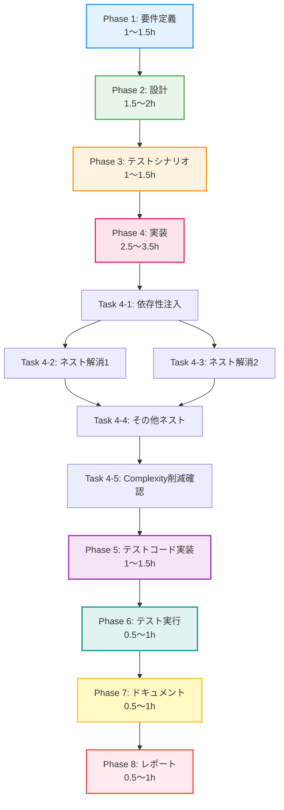

# プロジェクト計画書 - Issue #464

## Issue情報

- **Issue番号**: #464
- **タイトル**: [Refactor] dot_processor.py - Phase 3: 統合とネスト解消
- **親Issue**: #448
- **依存Issue**: #461 (Phase 2-1: UrnProcessor), #462 (Phase 2-2: NodeLabelGenerator), #463 (Phase 2-3: ResourceDependencyBuilder)
- **状態**: open
- **ラベル**: refactor, code-quality

---

## 1. Issue分析

### 複雑度
**中程度**

**判定理由**:
- 単一ファイル（`dot_processor.py`）のリファクタリング
- 既存の新規クラス（Phase 2-1〜2-3で作成済み）を統合する作業
- ネスト構造の平坦化（早期リターンパターン適用）
- 既存の機能を維持しながらの構造改善
- 統合テストによる回帰確認が必要

### 見積もり工数
**8〜12時間**

**根拠**:
- Phase 1（要件定義）: 1〜1.5h
- Phase 2（設計）: 1.5〜2h
- Phase 3（テストシナリオ）: 1〜1.5h
- Phase 4（実装）: 2.5〜3.5h
- Phase 5（テストコード実装）: 1〜1.5h
- Phase 6（テスト実行）: 0.5〜1h
- Phase 7（ドキュメント）: 0.5〜1h
- Phase 8（レポート）: 0.5〜1h

リファクタリング作業のため、慎重な統合テストと回帰確認が必要であることを考慮。

### リスク評価
**中**

**理由**:
- **技術的リスク（中）**: 依存性注入パターンの適用、循環参照の回避
- **品質リスク（中）**: 既存機能の維持、Cyclomatic Complexityの削減確認
- **スコープリスク（低）**: 要件は明確（新規クラス統合とネスト解消）

---

## 2. 実装戦略判断

### 実装戦略: REFACTOR

**判断根拠**:
- **既存コードの構造改善が中心**: `dot_processor.py`の既存クラス（`DotFileProcessor`、`DotFileGenerator`）に新規クラス（`UrnProcessor`、`NodeLabelGenerator`、`ResourceDependencyBuilder`）を統合
- **機能追加ではない**: 既存機能を維持しながら、コード品質を向上
- **ネストレベルの削減**: 深いネスト構造（3以上）を早期リターンパターンで平坦化
- **Cyclomatic Complexity削減**: 目標値10未満を達成

この作業は既存コードのリファクタリングであり、新規機能追加や既存機能の拡張ではないため、**REFACTOR戦略**が適切です。

### テスト戦略: UNIT_INTEGRATION

**判断根拠**:
- **UNIT**: 新規統合箇所（依存性注入、早期リターン化メソッド）の単体テスト
- **INTEGRATION**: クラス間の協調動作テスト（`DotFileProcessor` ↔ `UrnProcessor` ↔ `NodeLabelGenerator` ↔ `ResourceDependencyBuilder`）
- **BDDは不要**: エンドユーザー向け機能変更ではなく、内部構造改善のため

リファクタリング作業では、既存の振る舞いを維持することが最優先です。既存のCharacterization Test（特性テスト）を活用し、新規統合箇所には単体テストを追加します。

### テストコード戦略: EXTEND_TEST

**判断根拠**:
- **既存テストファイルの拡張**: `tests/test_dot_processor.py`に統合テストを追加
- **Characterization Testの活用**: 既存の特性テストで回帰を検証
- **新規テストファイルは不要**: 統合対象のクラス（`UrnProcessor`等）は既にテストファイルが存在

リファクタリングの性質上、既存の振る舞いを維持することが重要です。既存のテストを拡張し、新規統合箇所をカバーする統合テストを追加します。

---

## 3. 影響範囲分析

### 既存コードへの影響

#### 修正が必要なファイル
1. **`src/dot_processor.py`**（主要な修正対象）
   - `DotFileProcessor`クラス: 新規クラスの依存性注入、ネスト解消
   - `DotFileGenerator`クラス: 新規クラスの依存性注入（影響小）
   - `_enhance_pulumi_graph()`: ネスト解消（早期リターン化）
   - `_process_node_definition()`: ネスト解消
   - その他の深いネスト構造（3以上）を持つメソッド

2. **`tests/test_dot_processor.py`**（テスト拡張）
   - 統合テストの追加（新規クラスとの協調動作）
   - Characterization Testの実行（回帰確認）

#### 影響を受けるクラス
- **`DotFileProcessor`**: 最も大きな影響（依存性注入、ネスト解消）
- **`DotFileGenerator`**: 中程度の影響（依存性注入）
- **新規クラス（Phase 2作成済み）**: 影響なし（利用される側）
  - `UrnProcessor`（`src/urn_processor.py`）
  - `NodeLabelGenerator`（`src/node_label_generator.py`）
  - `ResourceDependencyBuilder`（`src/resource_dependency_builder.py`）

### 依存関係の変更

#### 新規依存の追加
- **なし**（Phase 2-1〜2-3で既に依存関係は確立済み）
- `dot_processor.py`は既に以下をインポート済み:
  ```python
  from urn_processor import UrnProcessor
  from node_label_generator import NodeLabelGenerator
  from resource_dependency_builder import ResourceDependencyBuilder
  ```

#### 既存依存の変更
- **循環参照の確認と解決**:
  - `NodeLabelGenerator` → `DotFileProcessor.PROVIDER_COLORS`（遅延インポートで既に回避済み）
  - 統合時に新たな循環参照が発生しないよう注意

### マイグレーション要否
**不要**

- データベーススキーマ変更なし
- 設定ファイル変更なし
- API変更なし（内部リファクタリングのみ）

---

## 4. タスク分割

### Phase 1: 要件定義 (見積もり: 1〜1.5h)

- [ ] Task 1-1: 既存コードの詳細分析 (0.5〜1h)
  - `dot_processor.py`の現在のネストレベルを測定
  - Cyclomatic Complexityの現状を測定（radon等のツール使用）
  - 深いネスト（3以上）を持つメソッドをリストアップ
  - 新規クラスの統合ポイントを特定

- [ ] Task 1-2: リファクタリング要件の明確化 (0.5h)
  - ネスト解消の優先順位を決定（`_enhance_pulumi_graph`、`_process_node_definition`を優先）
  - 依存性注入パターンの適用方針を決定（コンストラクタ注入 vs 静的メソッド維持）
  - Cyclomatic Complexity目標値の確認（< 10）
  - 既存機能の維持確認基準を定義（Characterization Test全パス）

### Phase 2: 設計 (見積もり: 1.5〜2h)

- [x] Task 2-1: 統合アーキテクチャ設計 (0.5〜1h)
  - 依存性注入パターンの詳細設計（静的メソッドを維持する場合の設計）
  - クラス図の更新（新規クラスとの関係を明記）
  - シーケンス図の作成（`apply_graph_styling` → `_enhance_pulumi_graph` → `UrnProcessor`, `NodeLabelGenerator`の流れ）

- [x] Task 2-2: ネスト解消設計 (0.5〜1h)
  - `_enhance_pulumi_graph`メソッドの早期リターンパターン設計
  - `_process_node_definition`メソッドの早期リターンパターン設計
  - その他の深いネストメソッドの改善設計
  - ネスト解消前後のコード比較サンプル作成

- [x] Task 2-3: 循環参照回避設計 (0.5h)
  - 既存の循環参照（`NodeLabelGenerator` → `DotFileProcessor.PROVIDER_COLORS`）の確認
  - 新規統合時の循環参照リスク評価
  - 回避策の設計（遅延インポート継続、または定数の移動）

### Phase 3: テストシナリオ (見積もり: 1〜1.5h)

- [x] Task 3-1: 統合テストシナリオ作成 (0.5〜1h)
  - 新規クラス統合後の協調動作シナリオ（`DotFileProcessor` → `UrnProcessor` → `NodeLabelGenerator`）
  - エッジケースシナリオ（不正URN、長いリソース名、循環依存）
  - パフォーマンステストシナリオ（20リソース処理時間）

- [x] Task 3-2: 回帰テストシナリオ作成 (0.5h)
  - 既存Characterization Testの実行計画
  - リファクタリング前後の振る舞い比較計画
  - Cyclomatic Complexity測定計画（radon使用）

### Phase 4: 実装 (見積もり: 2.5〜3.5h)

- [ ] Task 4-1: 依存性注入の適用 (0.5〜1h)
  - `DotFileProcessor`への依存性注入実装（必要に応じてコンストラクタ追加）
  - `DotFileGenerator`への依存性注入実装（ResourceDependencyBuilder使用箇所）
  - 既存の静的メソッド呼び出しを維持（互換性確保）

- [ ] Task 4-2: ネスト解消（`_enhance_pulumi_graph`） (0.5〜1h)
  - 現状のネストレベル確認（3以上）
  - 早期リターンパターン適用（ガード節の追加）
  - ネストレベル削減（目標: 3以下）
  - 可読性向上の確認

- [ ] Task 4-3: ネスト解消（`_process_node_definition`） (0.5〜1h)
  - 現状のネストレベル確認
  - 早期リターンパターン適用
  - ネストレベル削減（目標: 3以下）

- [ ] Task 4-4: その他の深いネスト構造の平坦化 (0.5h)
  - 深いネスト（3以上）を持つメソッドの洗い出し
  - 早期リターンパターン適用
  - ネストレベル削減

- [ ] Task 4-5: Cyclomatic Complexity削減確認 (0.5h)
  - radonツールでCyclomatic Complexity測定
  - 目標値（< 10）達成確認
  - 未達成の場合は追加リファクタリング

### Phase 5: テストコード実装 (見積もり: 1〜1.5h)

- [ ] Task 5-1: 統合テストの実装 (0.5〜1h)
  - `test_dot_processor.py`に統合テストクラス追加（`TestDotProcessorIntegration`）
  - 新規クラス協調動作テスト（`UrnProcessor`, `NodeLabelGenerator`, `ResourceDependencyBuilder`）
  - エッジケーステスト（不正URN、長いリソース名）

- [ ] Task 5-2: 回帰テストの拡張 (0.5h)
  - Characterization Testマーカー（`@pytest.mark.characterization`）の確認
  - リファクタリング前後の振る舞い比較テスト
  - パフォーマンステスト（20リソース処理時間）

### Phase 6: テスト実行 (見積もり: 0.5〜1h)

- [ ] Task 6-1: 単体テスト実行 (0.2h)
  - `pytest tests/test_dot_processor.py -v`
  - 新規統合テストの実行
  - テスト失敗の修正

- [ ] Task 6-2: 回帰テスト実行 (0.3〜0.5h)
  - Characterization Testの実行（`pytest -m characterization`）
  - 既存の振る舞い維持確認
  - 差分がある場合は原因調査と修正

- [ ] Task 6-3: Cyclomatic Complexity測定 (0.2h)
  - radonツールでの測定（`radon cc src/dot_processor.py -s`）
  - 目標値（< 10）達成確認
  - 測定結果の記録

### Phase 7: ドキュメント (見積もり: 0.5〜1h)

- [ ] Task 7-1: コード内ドキュメントの更新 (0.3〜0.5h)
  - `dot_processor.py`のdocstring更新（依存性注入、早期リターンの説明）
  - 新規統合箇所のコメント追加
  - リファクタリング前後の比較コメント

- [ ] Task 7-2: 設計ドキュメントの更新 (0.2〜0.5h)
  - アーキテクチャ図の更新（クラス図、シーケンス図）
  - リファクタリング理由の記録
  - Cyclomatic Complexity改善結果の記録

### Phase 8: レポート (見積もり: 0.5〜1h)

- [ ] Task 8-1: Issue完了レポート作成 (0.5〜1h)
  - リファクタリング前後の比較（ネストレベル、Cyclomatic Complexity）
  - テスト結果の報告（全テストパス、回帰なし）
  - 品質メトリクス（Cyclomatic Complexity < 10達成）
  - 次フェーズへの引き継ぎ事項（なし）

---

## 5. 依存関係

タスク間の依存関係をMermaid形式で図示：



---

## 6. リスクと軽減策

### リスク1: 循環参照の発生

- **影響度**: 中
- **確率**: 低
- **軽減策**:
  - 既存の循環参照（`NodeLabelGenerator` → `DotFileProcessor.PROVIDER_COLORS`）は遅延インポートで回避済み
  - 新規統合時は依存方向を明確にする（`DotFileProcessor` → 新規クラス、逆方向の依存は作らない）
  - Phase 2-3（循環参照回避設計）で事前に確認

### リスク2: Characterization Testの失敗（振る舞いの変化）

- **影響度**: 高
- **確率**: 中
- **軽減策**:
  - Phase 3-2で既存テストの実行計画を明確化
  - リファクタリング前に全テストがパスすることを確認
  - 小さな変更ごとにテスト実行（インクリメンタルリファクタリング）
  - 失敗時は即座にロールバックして原因調査

### リスク3: Cyclomatic Complexity目標未達成（< 10）

- **影響度**: 中
- **確率**: 低
- **軽減策**:
  - Phase 4-5でradonツールによる測定を実施
  - 未達成の場合は追加リファクタリング時間を確保（バッファ0.5h）
  - 早期リターンパターンの徹底適用
  - 必要に応じてメソッド分割を追加検討

### リスク4: 実装時間の超過

- **影響度**: 低
- **確率**: 中
- **軽減策**:
  - Phase 4をタスク単位で細分化（Task 4-1〜4-5）
  - 各タスク完了時にテストを実行（早期問題検出）
  - Task 4-5（Complexity削減確認）で目標未達成の場合は、追加作業時間を見積もり
  - 見積もり工数に20%のバッファを含める（8〜12h = 10h ± 20%）

### リスク5: 依存性注入パターンの設計ミス

- **影響度**: 中
- **確率**: 低
- **軽減策**:
  - Phase 2-1で依存性注入パターンの詳細設計を実施
  - 既存の静的メソッド呼び出しを維持（互換性確保）
  - コンストラクタ注入を追加する場合は、デフォルト引数でバックワード互換性を確保
  - Phase 5-1の統合テストで協調動作を検証

---

## 7. 品質ゲート

### Phase 1: 要件定義

- [ ] **既存コードのネストレベルが測定されている**
- [ ] **Cyclomatic Complexityの現状が測定されている**
- [ ] **深いネスト（3以上）を持つメソッドがリストアップされている**
- [ ] **リファクタリング要件が明確に記載されている**
- [ ] **既存機能の維持確認基準が定義されている**

### Phase 2: 設計

- [x] **実装戦略（REFACTOR）の判断根拠が明記されている**
- [x] **テスト戦略（UNIT_INTEGRATION）の判断根拠が明記されている**
- [x] **テストコード戦略（EXTEND_TEST）の判断根拠が明記されている**
- [x] **依存性注入パターンの詳細設計が完了している**
- [x] **ネスト解消の具体的設計（早期リターンパターン）が完了している**
- [x] **循環参照回避設計が完了している**
- [x] **クラス図、シーケンス図が更新されている**

### Phase 3: テストシナリオ

- [x] **統合テストシナリオが作成されている**
- [x] **回帰テストシナリオが作成されている**
- [x] **エッジケースが網羅されている**
- [x] **パフォーマンステストシナリオが定義されている**

### Phase 4: 実装

- [ ] **依存性注入が正しく実装されている**
- [ ] **`_enhance_pulumi_graph`のネストレベルが3以下に削減されている**
- [ ] **`_process_node_definition`のネストレベルが3以下に削減されている**
- [ ] **その他の深いネスト構造が平坦化されている**
- [ ] **Cyclomatic Complexityが10未満を達成している**
- [ ] **既存の静的メソッド呼び出しが維持されている（互換性）**

### Phase 5: テストコード実装

- [ ] **統合テストが実装されている**
- [ ] **Characterization Testが実行可能である**
- [ ] **エッジケーステストが実装されている**
- [ ] **パフォーマンステストが実装されている**

### Phase 6: テスト実行

- [ ] **全単体テストがパスしている**
- [ ] **全Characterization Testがパスしている（回帰なし）**
- [ ] **Cyclomatic Complexityが目標値（< 10）を達成している**
- [ ] **パフォーマンス劣化がない（20リソース処理時間）**

### Phase 7: ドキュメント

- [ ] **コード内ドキュメント（docstring）が更新されている**
- [ ] **アーキテクチャ図（クラス図、シーケンス図）が更新されている**
- [ ] **リファクタリング理由と結果が記録されている**

### Phase 8: レポート

- [ ] **Issue完了レポートが作成されている**
- [ ] **リファクタリング前後の比較が記載されている**
- [ ] **テスト結果が報告されている**
- [ ] **品質メトリクスが記録されている**

---

## 8. 成功基準

このプロジェクトは以下の条件を**すべて**満たした場合に成功とみなします：

1. **機能維持**: 全Characterization Testがパス（回帰なし）
2. **ネスト削減**: ネストレベルが3以下に削減（`_enhance_pulumi_graph`、`_process_node_definition`を含む）
3. **Complexity削減**: Cyclomatic Complexityが10未満を達成（全メソッド）
4. **統合成功**: 新規クラス（`UrnProcessor`、`NodeLabelGenerator`、`ResourceDependencyBuilder`）が正しく統合されている
5. **テストカバレッジ**: 統合テストで新規統合箇所がカバーされている
6. **パフォーマンス維持**: 20リソース処理時間が劣化していない

---

## 9. 参考情報

### 関連ファイル
- **対象ファイル**: `jenkins/jobs/pipeline/infrastructure/pulumi-stack-action/src/dot_processor.py`
- **テストファイル**: `jenkins/jobs/pipeline/infrastructure/pulumi-stack-action/tests/test_dot_processor.py`
- **新規クラス（Phase 2作成済み）**:
  - `src/urn_processor.py`（Issue #461）
  - `src/node_label_generator.py`（Issue #462）
  - `src/resource_dependency_builder.py`（Issue #463）

### 関連Issue
- **親Issue**: #448（dot_processor.pyの全体リファクタリング計画）
- **Phase 2-1**: #461（UrnProcessor作成 - 完了）
- **Phase 2-2**: #462（NodeLabelGenerator作成 - 完了）
- **Phase 2-3**: #463（ResourceDependencyBuilder作成 - 完了）

### 測定ツール
- **Cyclomatic Complexity測定**: radon（`pip install radon`）
  - コマンド例: `radon cc src/dot_processor.py -s`
- **ネストレベル測定**: 手動レビュー、またはlintツール（flake8, pylint）

---

## 10. 次のアクション

このプロジェクト計画書のレビュー完了後、以下の順序で作業を開始します：

1. **Phase 1（要件定義）**: 既存コードの詳細分析、ネストレベル・Cyclomatic Complexity測定
2. **Phase 2（設計）**: 依存性注入、ネスト解消、循環参照回避の詳細設計
3. **Phase 3（テストシナリオ）**: 統合テスト、回帰テストのシナリオ作成
4. **Phase 4（実装）**: 依存性注入適用、ネスト解消実装
5. **Phase 5〜8**: テストコード実装 → テスト実行 → ドキュメント → レポート

---

**作成日**: 2025年01月（計画書作成時点）
**最終更新**: 2025年01月（計画書作成時点）
