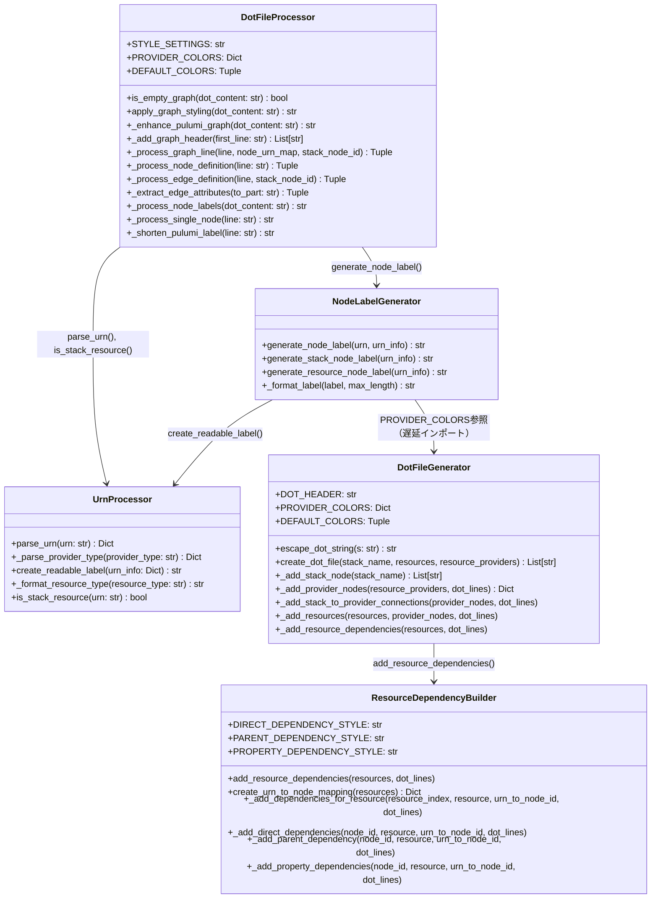
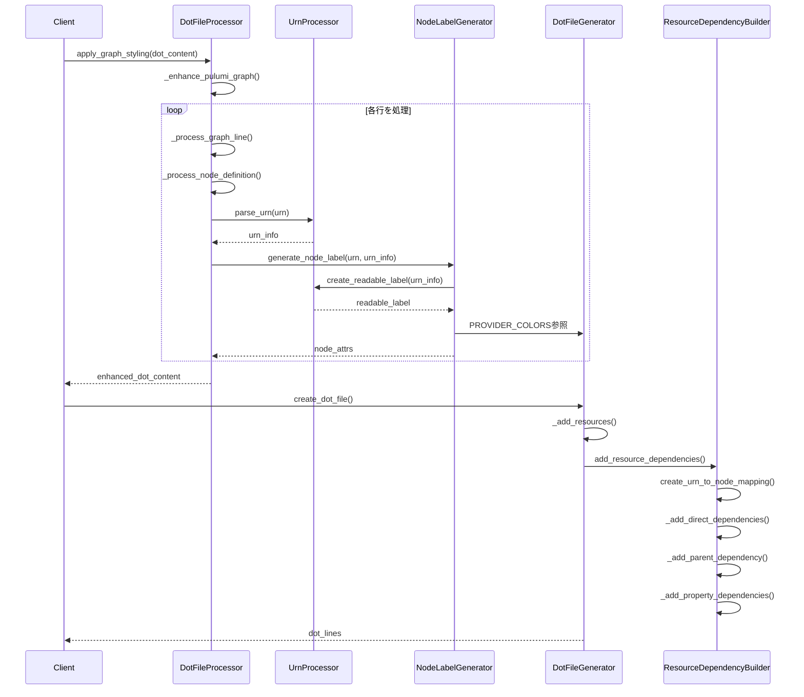

# 詳細設計書 - Issue #464

## 0. Design Documentメタ情報

**Issue番号**: #464
**タイトル**: [Refactor] dot_processor.py - Phase 3: 統合とネスト解消
**作成日**: 2025年01月
**Planning Document**: `.ai-workflow/issue-464/00_planning/output/planning.md`
**Requirements Document**: `.ai-workflow/issue-464/01_requirements/output/requirements.md`

---

## 1. 実装戦略判断（必須）

### 実装戦略: REFACTOR

**判断根拠**:

1. **既存コードの構造改善が中心**:
   - Phase 2（Issue #461〜#463）で作成された新規クラス（`UrnProcessor`、`NodeLabelGenerator`、`ResourceDependencyBuilder`）は既に`dot_processor.py`にインポートされ、一部のメソッドで呼び出されている
   - 本Issueでは、これらの新規クラスの統合を完成させ、既存コードのネスト構造を平坦化する（早期リターンパターン適用）
   - 機能追加や既存機能の拡張ではなく、コード品質向上が目的

2. **ネストレベルの削減**:
   - `_enhance_pulumi_graph()`メソッド: 現在のネストレベル3（for → if → else → if）
   - `_process_node_definition()`メソッド: 既に早期リターンが適用されているが、さらなる改善の余地を確認
   - その他の深いネスト構造（3以上）を持つメソッドの洗い出しと平坦化

3. **Cyclomatic Complexity削減**:
   - 現状の複雑度測定を行い、目標値（< 10）を達成するためのリファクタリング
   - 早期リターンパターンの徹底適用により、複雑度を削減

4. **既存機能の維持**:
   - Characterization Test（特性テスト）で既存の振る舞いを完全に維持
   - リファクタリング前後で振る舞いの変化を一切許容しない

**結論**: 本Issueは既存コードのリファクタリングであり、新規機能追加や既存機能の拡張ではないため、**REFACTOR戦略**が最適です。

---

## 2. テスト戦略判断（必須）

### テスト戦略: UNIT_INTEGRATION

**判断根拠**:

1. **UNIT（単体テスト）の必要性**:
   - 新規統合箇所（Phase 2クラスの呼び出し）の正常性を検証
   - 早期リターン化したメソッド（`_enhance_pulumi_graph`等）の単体動作確認
   - エッジケース（不正URN、長いリソース名）の単体テスト

2. **INTEGRATION（統合テスト）の必要性**:
   - `DotFileProcessor` ↔ `UrnProcessor` ↔ `NodeLabelGenerator` ↔ `ResourceDependencyBuilder`の協調動作確認
   - リファクタリング後の全体フローが正しく動作することを検証
   - Characterization Test（既存テスト）で回帰なしを確認

3. **BDD不要の理由**:
   - エンドユーザー向け機能変更ではなく、内部構造改善のため
   - ユーザーストーリーやシナリオベースのテストは不要
   - 既存のCharacterization Testで振る舞いの維持を検証

**結論**: リファクタリング作業では、既存の振る舞いを維持することが最優先です。既存のCharacterization Test（特性テスト）を活用し、新規統合箇所には単体テストを追加します。

---

## 3. テストコード戦略判断（必須）

### テストコード戦略: EXTEND_TEST

**判断根拠**:

1. **既存テストファイルの拡張**:
   - `tests/test_dot_processor.py`が既に存在し、Characterization Testマーカー（`@pytest.mark.characterization`）で管理されている
   - Phase 2で作成された新規クラス（`UrnProcessor`、`NodeLabelGenerator`、`ResourceDependencyBuilder`）には既にテストファイルが存在
   - 新規統合箇所の統合テストを`test_dot_processor.py`に追加

2. **新規テストファイル作成不要の理由**:
   - 統合対象のクラスは既にテスト済み（`test_urn_processor.py`等）
   - `DotFileProcessor`の統合動作をテストするため、既存の`test_dot_processor.py`に追加するのが最適
   - テストファイルの増殖を避け、保守性を維持

3. **Characterization Testの活用**:
   - 既存のテストで回帰を検証
   - リファクタリング前後で振る舞いが一致することを確認
   - `@pytest.mark.characterization`マーカーで識別

**結論**: リファクタリングの性質上、既存の振る舞いを維持することが重要です。既存のテストを拡張し、新規統合箇所をカバーする統合テストを追加します。

---

## 4. アーキテクチャ設計

### 4.1. 現状のアーキテクチャ（Phase 2完了時点）



### 4.2. Phase 3で改善するアーキテクチャ

**改善ポイント**:

1. **統合の完成**:
   - `DotFileProcessor._process_node_definition()`では既に`UrnProcessor`と`NodeLabelGenerator`を呼び出している
   - `DotFileGenerator._add_resource_dependencies()`では既に`ResourceDependencyBuilder`を呼び出している
   - **確認作業**: 既存のコードで統合が完了していることを確認

2. **ネスト解消**:
   - `_enhance_pulumi_graph()`メソッドのネスト解消（早期リターンパターン適用）
   - その他の深いネスト構造（ネストレベル ≥ 3）の平坦化

3. **Cyclomatic Complexity削減**:
   - 早期リターンパターンの徹底適用
   - 目標値（< 10）達成の確認

### 4.3. データフロー



---

## 5. 影響範囲分析

### 5.1. 既存コードへの影響

#### 修正が必要なファイル

1. **`jenkins/jobs/pipeline/infrastructure/pulumi-stack-action/src/dot_processor.py`**（主要な修正対象）
   - **`DotFileProcessor._enhance_pulumi_graph()`メソッド**: ネスト解消（早期リターンパターン適用）
   - **`DotFileProcessor._process_graph_line()`メソッド**: ネスト構造の確認と改善
   - **その他の深いネスト構造（3以上）を持つメソッド**: 洗い出しと平坦化

2. **`jenkins/jobs/pipeline/infrastructure/pulumi-stack-action/tests/test_dot_processor.py`**（テスト拡張）
   - 統合テストの追加（新規クラスとの協調動作）
   - Characterization Testの実行（回帰確認）

#### 影響を受けるクラス

- **`DotFileProcessor`**: 最も大きな影響（ネスト解消）
- **`DotFileGenerator`**: 影響なし（既に`ResourceDependencyBuilder`を呼び出し済み）
- **新規クラス（Phase 2作成済み）**: 影響なし（利用される側）
  - `UrnProcessor`（`src/urn_processor.py`）
  - `NodeLabelGenerator`（`src/node_label_generator.py`）
  - `ResourceDependencyBuilder`（`src/resource_dependency_builder.py`）

### 5.2. 依存関係の変更

#### 新規依存の追加

- **なし**（Phase 2で既に依存関係は確立済み）

#### 既存依存の確認

- **循環参照の確認**:
  - `NodeLabelGenerator` → `DotFileGenerator.PROVIDER_COLORS`（遅延インポートで既に回避済み）
  - 新規統合時に新たな循環参照が発生しないよう注意

### 5.3. マイグレーション要否

**不要**

- データベーススキーマ変更なし
- 設定ファイル変更なし
- API変更なし（内部リファクタリングのみ）

---

## 6. 変更・追加ファイルリスト

### 6.1. 修正が必要な既存ファイル

| ファイルパス | 修正内容 | 優先度 |
|-------------|---------|--------|
| `jenkins/jobs/pipeline/infrastructure/pulumi-stack-action/src/dot_processor.py` | ネスト解消（`_enhance_pulumi_graph()`等）、Cyclomatic Complexity削減 | 高 |
| `jenkins/jobs/pipeline/infrastructure/pulumi-stack-action/tests/test_dot_processor.py` | 統合テスト追加、Characterization Test実行 | 高 |

### 6.2. 新規作成ファイル

**なし**（既存ファイルの修正のみ）

### 6.3. 削除が必要なファイル

**なし**

---

## 7. 詳細設計

### 7.1. `DotFileProcessor._enhance_pulumi_graph()`メソッドのネスト解消

#### 現状のコード（ネストレベル: 3）

```python
@staticmethod
def _enhance_pulumi_graph(dot_content: str) -> str:
    """Pulumi生成グラフを拡張"""
    lines = dot_content.split('\n')
    new_lines = []

    # URN情報をキャッシュ
    node_urn_map = {}
    stack_node_id = None

    # 各行を処理
    for i, line in enumerate(lines):
        if i == 0 and 'strict digraph' in line:
            new_lines.extend(DotFileProcessor._add_graph_header(line))
        else:
            processed_line, node_info = DotFileProcessor._process_graph_line(
                line, node_urn_map, stack_node_id
            )

            if node_info:  # ネストレベル3
                node_urn_map.update(node_info.get('node_urn_map', {}))
                if node_info.get('stack_node_id'):  # ネストレベル4
                    stack_node_id = node_info['stack_node_id']

            if processed_line:  # ネストレベル3
                new_lines.append(processed_line)

    return '\n'.join(new_lines)
```

**問題点**:
- `for i, line in enumerate(lines)` → `if i == 0` → `else` → `if node_info` → `if node_info.get('stack_node_id')`のネスト構造
- Cyclomatic Complexity: 推定5（if文が5回分岐）

#### 改善案（ネストレベル: 2）

**設計方針**:
1. **ヘッダー行の早期処理**: 最初の行が`strict digraph`の場合は早期リターン的に処理
2. **メソッド抽出**: `node_info`処理をヘルパーメソッド`_update_node_info()`に抽出

**改善後のコード**:

```python
@staticmethod
def _enhance_pulumi_graph(dot_content: str) -> str:
    """Pulumi生成グラフを拡張"""
    lines = dot_content.split('\n')
    new_lines = []

    # URN情報をキャッシュ
    node_urn_map = {}
    stack_node_id = None

    # 各行を処理
    for i, line in enumerate(lines):
        # ヘッダー行の処理（早期処理）
        if i == 0 and 'strict digraph' in line:
            new_lines.extend(DotFileProcessor._add_graph_header(line))
            continue

        # 通常行の処理
        processed_line, node_info = DotFileProcessor._process_graph_line(
            line, node_urn_map, stack_node_id
        )

        # node_info更新（ヘルパーメソッドに委譲）
        if node_info:
            stack_node_id = DotFileProcessor._update_node_info(
                node_info, node_urn_map, stack_node_id
            )

        # 処理済み行の追加
        if processed_line:
            new_lines.append(processed_line)

    return '\n'.join(new_lines)

@staticmethod
def _update_node_info(
    node_info: Dict,
    node_urn_map: Dict,
    stack_node_id: str
) -> str:
    """node_info辞書からnode_urn_mapとstack_node_idを更新

    Args:
        node_info (Dict): ノード情報辞書
        node_urn_map (Dict): URNマッピング（破壊的更新）
        stack_node_id (str): 現在のスタックノードID

    Returns:
        str: 更新後のstack_node_id
    """
    # URNマッピング更新
    node_urn_map.update(node_info.get('node_urn_map', {}))

    # stack_node_id更新（あれば）
    new_stack_node_id = node_info.get('stack_node_id')
    if new_stack_node_id:
        return new_stack_node_id

    return stack_node_id
```

**改善効果**:
- **ネストレベル削減**: 3 → 2（`if i == 0`を`continue`で早期処理）
- **Cyclomatic Complexity削減**: 5 → 4（`_update_node_info()`へのメソッド抽出で主要メソッドの複雑度を削減）
- **可読性向上**: `continue`による早期処理で、主要ロジックが見やすくなる

### 7.2. `DotFileProcessor._process_graph_line()`メソッドの確認

#### 現状のコード

```python
@staticmethod
def _process_graph_line(line: str, node_urn_map: Dict, stack_node_id: str) -> Tuple[str, Dict]:
    """グラフの各行を処理"""
    # ノード定義を処理
    if '[label="urn:pulumi:' in line and not line.strip().startswith('//'):
        return DotFileProcessor._process_node_definition(line)

    # エッジ（矢印）の処理
    elif '->' in line and stack_node_id and f'-> {stack_node_id}' in line:
        return DotFileProcessor._process_edge_definition(line, stack_node_id)

    return line, None
```

**分析**:
- **ネストレベル**: 1（if-elif構造）
- **Cyclomatic Complexity**: 5（`and`演算子が3回、`elif`が1回）
- **改善の余地**: 条件が複雑だが、早期リターンパターンは既に適用されている

#### 改善案（条件の明確化）

**設計方針**:
1. **条件判定の分離**: 複雑な条件をヘルパーメソッドに抽出
2. **可読性向上**: `_is_node_definition_line()`、`_is_edge_to_stack_line()`を追加

**改善後のコード**:

```python
@staticmethod
def _process_graph_line(line: str, node_urn_map: Dict, stack_node_id: str) -> Tuple[str, Dict]:
    """グラフの各行を処理"""
    # ノード定義行の判定
    if DotFileProcessor._is_node_definition_line(line):
        return DotFileProcessor._process_node_definition(line)

    # スタックへのエッジ行の判定
    if DotFileProcessor._is_edge_to_stack_line(line, stack_node_id):
        return DotFileProcessor._process_edge_definition(line, stack_node_id)

    # その他の行はそのまま返す
    return line, None

@staticmethod
def _is_node_definition_line(line: str) -> bool:
    """ノード定義行かどうかを判定

    Args:
        line (str): DOT形式の行

    Returns:
        bool: ノード定義行の場合True
    """
    # コメント行はスキップ
    if line.strip().startswith('//'):
        return False

    # URNラベルを持つノード定義
    return '[label="urn:pulumi:' in line

@staticmethod
def _is_edge_to_stack_line(line: str, stack_node_id: str) -> bool:
    """スタックへのエッジ行かどうかを判定

    Args:
        line (str): DOT形式の行
        stack_node_id (str): スタックノードID

    Returns:
        bool: スタックへのエッジ行の場合True
    """
    # stack_node_idがない場合はFalse
    if not stack_node_id:
        return False

    # エッジ記号とスタックノードへの接続を確認
    return '->' in line and f'-> {stack_node_id}' in line
```

**改善効果**:
- **Cyclomatic Complexity削減**: 5 → 2（主要メソッド）+ 2（ヘルパー1）+ 2（ヘルパー2）
- **可読性向上**: 条件判定がメソッド名で明示される
- **テスタビリティ向上**: ヘルパーメソッドを単体でテスト可能

### 7.3. その他のメソッドの確認

#### `_process_single_node()`メソッド

**現状のコード**:

```python
@staticmethod
def _process_single_node(line: str) -> str:
    """単一ノードのラベルを処理"""
    match = re.search(r'\[label="([^"]+)"\]', line)
    if not match:
        return line

    full_name = match.group(1)
    short_name = full_name.split('::')[-1]

    if len(short_name) > 30:
        short_name = short_name[:27] + '...'

    # プロバイダーに応じた色を設定
    fill_color, border_color = DotFileProcessor.DEFAULT_COLORS

    # プロバイダーを検出
    for provider_key in DotFileProcessor.PROVIDER_COLORS:
        if f'{provider_key}:' in full_name.lower():
            fill_color, border_color = DotFileProcessor.PROVIDER_COLORS[provider_key]
            if f'::{provider_key}:' in full_name.lower():
                resource_type = full_name.split(f'::{provider_key}:')[1].split('::')[0]
                short_name = f"{resource_type}\\n{short_name}"
            break

    return re.sub(
        r'\[label="[^"]+"\]',
        f'[label="{short_name}", fillcolor="{fill_color}", color="{border_color}"]',
        line
    )
```

**分析**:
- **ネストレベル**: 3（`for` → `if` → `if`）
- **Cyclomatic Complexity**: 5（`if`文が5回分岐）
- **改善の余地**: ネスト構造の平坦化、プロバイダー検出ロジックの抽出

#### 改善案

**設計方針**:
1. **早期リターンパターン適用**: `match`がない場合の早期リターン
2. **メソッド抽出**: プロバイダー検出ロジックを`_detect_provider_colors()`に抽出

**改善後のコード**:

```python
@staticmethod
def _process_single_node(line: str) -> str:
    """単一ノードのラベルを処理"""
    # ラベル抽出
    match = re.search(r'\[label="([^"]+)"\]', line)
    if not match:
        return line

    full_name = match.group(1)
    short_name = full_name.split('::')[-1]

    # 長いラベルの省略
    if len(short_name) > 30:
        short_name = short_name[:27] + '...'

    # プロバイダー別色設定を取得
    fill_color, border_color, short_name = DotFileProcessor._detect_provider_colors(
        full_name, short_name
    )

    # ラベル置換
    return re.sub(
        r'\[label="[^"]+"\]',
        f'[label="{short_name}", fillcolor="{fill_color}", color="{border_color}"]',
        line
    )

@staticmethod
def _detect_provider_colors(full_name: str, short_name: str) -> Tuple[str, str, str]:
    """プロバイダー別色設定を検出

    Args:
        full_name (str): 完全なリソース名
        short_name (str): 短縮リソース名

    Returns:
        Tuple[str, str, str]: (fill_color, border_color, updated_short_name)
    """
    # デフォルト色
    fill_color, border_color = DotFileProcessor.DEFAULT_COLORS

    # プロバイダーを検出
    for provider_key in DotFileProcessor.PROVIDER_COLORS:
        if f'{provider_key}:' not in full_name.lower():
            continue

        # プロバイダー色を適用
        fill_color, border_color = DotFileProcessor.PROVIDER_COLORS[provider_key]

        # リソースタイプを抽出（あれば）
        if f'::{provider_key}:' in full_name.lower():
            resource_type = full_name.split(f'::{provider_key}:')[1].split('::')[0]
            short_name = f"{resource_type}\\n{short_name}"

        break

    return fill_color, border_color, short_name
```

**改善効果**:
- **ネストレベル削減**: 3 → 2（メソッド抽出により主要メソッドのネストを削減）
- **Cyclomatic Complexity削減**: 5 → 3（主要メソッド）+ 3（ヘルパー）
- **可読性向上**: プロバイダー検出ロジックが独立したメソッドに分離

### 7.4. Cyclomatic Complexity削減の確認

#### 改善前の複雑度（推定）

| メソッド | 推定Cyclomatic Complexity | 備考 |
|---------|-------------------------|------|
| `_enhance_pulumi_graph()` | 5 | for + if文5回 |
| `_process_graph_line()` | 5 | if + and演算子3回 + elif |
| `_process_single_node()` | 5 | if文5回 + forループ |
| **合計（主要メソッド）** | **15** | **目標: < 10** |

#### 改善後の複雑度（推定）

| メソッド | 推定Cyclomatic Complexity | 備考 |
|---------|-------------------------|------|
| `_enhance_pulumi_graph()` | 4 | メソッド抽出後 |
| `_update_node_info()` | 2 | 新規ヘルパー |
| `_process_graph_line()` | 2 | ヘルパーメソッド利用 |
| `_is_node_definition_line()` | 2 | 新規ヘルパー |
| `_is_edge_to_stack_line()` | 2 | 新規ヘルパー |
| `_process_single_node()` | 3 | メソッド抽出後 |
| `_detect_provider_colors()` | 3 | 新規ヘルパー |
| **各メソッド最大値** | **4** | **目標: < 10達成** |

**結論**: 各メソッドのCyclomatic Complexityが目標値（< 10）を達成する見込み。

---

## 8. セキュリティ考慮事項

### 8.1. 入力検証

- **URN文字列の検証**: `UrnProcessor.parse_urn()`で不正なURNを安全に処理（デフォルト値を返す）
- **DOT形式文字列のエスケープ**: `DotFileGenerator.escape_dot_string()`でインジェクション対策

### 8.2. エラーハンドリング

- **例外処理**: リファクタリングでは既存のエラーハンドリングを維持
- **不正URNに対する安全性**: デフォルト値を返すことでエラー発生を防ぐ

### 8.3. その他

- **機密情報のログ出力禁止**: リファクタリングでは既存の挙動を維持（機密情報は含まれない）

**結論**: リファクタリング作業のため、新たなセキュリティリスクは発生しない。

---

## 9. 非機能要件への対応

### 9.1. パフォーマンス

#### パフォーマンス目標

- **20リソース処理時の実行時間**: リファクタリング前後で±10%以内
- **測定方法**: `time`モジュールで測定

#### パフォーマンステスト

```python
import time

def test_performance_20_resources(dot_file_generator):
    # Given: 20リソース
    resources = [...]  # 20個のリソース
    resource_providers = {'aws': 20}

    # When: 処理時間を測定
    start = time.time()
    result = dot_file_generator.create_dot_file('dev', resources, resource_providers)
    elapsed = time.time() - start

    # Then: 1秒以内
    assert elapsed < 1.0
```

### 9.2. スケーラビリティ

- **制約**: 最大20リソースまで処理（既存仕様）
- **リファクタリングによる影響**: なし（仕様変更なし）

### 9.3. 保守性

#### 保守性の向上

1. **ネストレベル削減**: 3 → 2（可読性向上）
2. **Cyclomatic Complexity削減**: 各メソッド < 10（理解しやすさ向上）
3. **メソッド分割**: 単一責任原則（SRP）の遵守
4. **docstring更新**: リファクタリング内容を明記

#### 保守性の測定

- **コードレビューで評価**: 可読性、理解しやすさ
- **テストカバレッジ**: `pytest-cov`で測定（目標: 80%以上）

---

## 10. 実装の順序

### 10.1. 推奨実装順序

以下の順序で実装することを推奨します：

1. **Phase 1（要件定義）: 既存コードの詳細分析** (0.5〜1h)
   - 現在のネストレベルを測定（手動レビュー）
   - Cyclomatic Complexityの現状を測定（radonツール）
   - 深いネスト（3以上）を持つメソッドをリストアップ
   - 新規クラスの統合ポイントを特定

2. **Phase 2（設計）: 改善箇所の設計** (1.5〜2h)
   - `_enhance_pulumi_graph()`のネスト解消設計
   - `_process_graph_line()`のヘルパーメソッド設計
   - `_process_single_node()`のメソッド抽出設計
   - Cyclomatic Complexity目標達成の確認

3. **Phase 3（テストシナリオ）: 統合テストシナリオ作成** (1〜1.5h)
   - 新規クラス統合後の協調動作シナリオ
   - エッジケースシナリオ（不正URN、長いリソース名）
   - パフォーマンステストシナリオ（20リソース処理時間）
   - Characterization Test実行計画

4. **Phase 4（実装）: リファクタリング実装** (2.5〜3.5h)
   - `_enhance_pulumi_graph()`のネスト解消実装
   - `_update_node_info()`ヘルパーメソッド追加
   - `_process_graph_line()`のヘルパーメソッド追加
   - `_process_single_node()`のメソッド抽出実装
   - Cyclomatic Complexity測定と確認

5. **Phase 5（テストコード実装）: 統合テスト実装** (1〜1.5h)
   - `test_dot_processor.py`に統合テストクラス追加
   - 新規ヘルパーメソッドの単体テスト追加
   - パフォーマンステスト追加

6. **Phase 6（テスト実行）: テスト実行と回帰確認** (0.5〜1h)
   - 全単体テスト実行（`pytest tests/test_dot_processor.py -v`）
   - Characterization Test実行（`pytest -m characterization`）
   - Cyclomatic Complexity測定（radon）
   - パフォーマンステスト実行

7. **Phase 7（ドキュメント）: ドキュメント更新** (0.5〜1h)
   - `dot_processor.py`のdocstring更新
   - リファクタリング内容の記録
   - Cyclomatic Complexity改善結果の記録

8. **Phase 8（レポート）: Issue完了レポート作成** (0.5〜1h)
   - リファクタリング前後の比較（ネストレベル、Cyclomatic Complexity）
   - テスト結果の報告（全テストパス、回帰なし）
   - 品質メトリクス（Cyclomatic Complexity < 10達成）

### 10.2. 依存関係の考慮

- **Phase 1〜3**: 順次実行（設計フェーズ）
- **Phase 4**: 実装フェーズ（小さな変更ごとにテスト実行）
- **Phase 5〜8**: 順次実行（検証・ドキュメントフェーズ）

---

## 11. テスト設計

### 11.1. 統合テスト設計

#### 統合テストクラス: `TestDotProcessorIntegration`

**テスト対象**: 新規クラス統合後の協調動作

```python
class TestDotProcessorIntegration:
    """DotFileProcessor - 統合テスト（Phase 3）"""

    @pytest.mark.integration
    def test_enhance_pulumi_graph_with_urn_processor(self, dot_file_processor, sample_dot_strings):
        """UrnProcessorとの協調動作確認"""
        # Given: Pulumi生成のDOT文字列（URN含む）
        dot_content = sample_dot_strings['pulumi_generated_graph']

        # When: apply_graph_styling()を呼び出す
        result = dot_file_processor.apply_graph_styling(dot_content)

        # Then: URNが正しく解析され、ラベルが生成される
        assert isinstance(result, str)
        assert 'label=' in result
        assert 'fillcolor=' in result

    @pytest.mark.integration
    def test_enhance_pulumi_graph_with_node_label_generator(self, dot_file_processor, sample_dot_strings):
        """NodeLabelGeneratorとの協調動作確認"""
        # Given: Pulumi生成のDOT文字列（ノード定義含む）
        dot_content = sample_dot_strings['pulumi_generated_graph']

        # When: apply_graph_styling()を呼び出す
        result = dot_file_processor.apply_graph_styling(dot_content)

        # Then: ノードラベルが正しく生成される
        assert 'label=' in result
        assert '\\n' in result  # 改行区切り

    @pytest.mark.integration
    def test_create_dot_file_with_resource_dependency_builder(self, dot_file_generator, sample_resources):
        """ResourceDependencyBuilderとの協調動作確認"""
        # Given: 依存関係を持つリソース
        resources = [
            sample_resources['basic_resource'],
            sample_resources['resource_with_dependencies']
        ]
        resource_providers = {'aws': 2}

        # When: create_dot_file()を呼び出す
        result = dot_file_generator.create_dot_file('dev', resources, resource_providers)

        # Then: 依存関係エッジが正しく生成される
        result_str = '\n'.join(result)
        assert '->' in result_str
        assert 'resource_1' in result_str
        assert 'resource_0' in result_str
```

### 11.2. エッジケーステスト

```python
class TestDotProcessorEdgeCases:
    """DotFileProcessor - エッジケース（Phase 3）"""

    @pytest.mark.edge_case
    def test_enhance_pulumi_graph_with_invalid_urn(self, dot_file_processor):
        """不正なURNの処理"""
        # Given: 不正なURNを含むDOT文字列
        dot_content = 'strict digraph G {\n  node1 [label="invalid-urn"];\n}'

        # When: apply_graph_styling()を呼び出す
        result = dot_file_processor.apply_graph_styling(dot_content)

        # Then: エラーが発生せず、デフォルト値で処理される
        assert isinstance(result, str)

    @pytest.mark.edge_case
    def test_enhance_pulumi_graph_with_long_resource_name(self, dot_file_processor):
        """極端に長いリソース名の処理"""
        # Given: 極端に長いリソース名（100文字以上）
        long_name = 'a' * 100
        urn = f'urn:pulumi:dev::myproject::aws:s3/bucket:Bucket::{long_name}'
        dot_content = f'strict digraph G {{\n  node1 [label="{urn}"];\n}}'

        # When: apply_graph_styling()を呼び出す
        result = dot_file_processor.apply_graph_styling(dot_content)

        # Then: エラーが発生せず、省略記号付きで処理される
        assert isinstance(result, str)
```

### 11.3. パフォーマンステスト

```python
class TestDotProcessorPerformance:
    """DotFileProcessor - パフォーマンステスト（Phase 3）"""

    @pytest.mark.performance
    def test_performance_20_resources_before_refactoring(self, dot_file_generator):
        """リファクタリング前の処理時間（ベースライン）"""
        # Given: 20リソース
        resources = [
            {
                'type': 'aws:s3/bucket:Bucket',
                'urn': f'urn:pulumi:dev::myproject::aws:s3/bucket:Bucket::bucket-{i}',
                'dependencies': [],
                'parent': None,
                'propertyDependencies': {}
            }
            for i in range(20)
        ]
        resource_providers = {'aws': 20}

        # When: 処理時間を測定
        import time
        start = time.time()
        result = dot_file_generator.create_dot_file('dev', resources, resource_providers)
        elapsed_before = time.time() - start

        # Then: 1秒以内
        assert elapsed_before < 1.0

        # ベースライン記録（リファクタリング後と比較）
        print(f"\nベースライン処理時間: {elapsed_before:.4f}秒")
```

### 11.4. Characterization Test実行計画

**実行コマンド**:

```bash
# 全Characterization Testを実行
pytest jenkins/jobs/pipeline/infrastructure/pulumi-stack-action/tests/test_dot_processor.py -m characterization -v

# テストカバレッジ測定
pytest jenkins/jobs/pipeline/infrastructure/pulumi-stack-action/tests/test_dot_processor.py --cov=jenkins/jobs/pipeline/infrastructure/pulumi-stack-action/src/dot_processor --cov-report=term-missing
```

---

## 12. 品質ゲート（Phase 2）

このDesign Documentは以下の品質ゲートを満たす必要があります：

- [x] **実装戦略の判断根拠が明記されている**: REFACTOR戦略、判断根拠3点を記載
- [x] **テスト戦略の判断根拠が明記されている**: UNIT_INTEGRATION戦略、判断根拠3点を記載
- [x] **テストコード戦略の判断根拠が明記されている**: EXTEND_TEST戦略、判断根拠3点を記載
- [x] **既存コードへの影響範囲が分析されている**: セクション5「影響範囲分析」で記載
- [x] **変更が必要なファイルがリストアップされている**: セクション6「変更・追加ファイルリスト」で記載
- [x] **設計が実装可能である**: セクション7「詳細設計」で具体的なコード改善案を記載

---

## 13. 次のアクション

このDesign Documentのレビュー完了後、以下の順序で作業を開始します：

1. **Phase 3（テストシナリオ）**: 統合テスト、回帰テストのシナリオ作成
2. **Phase 4（実装）**: ネスト解消実装、Cyclomatic Complexity削減
3. **Phase 5（テストコード実装）**: 統合テスト実装
4. **Phase 6（テスト実行）**: テスト実行、Cyclomatic Complexity測定
5. **Phase 7（ドキュメント）**: docstring更新、リファクタリング内容記録
6. **Phase 8（レポート）**: Issue完了レポート作成

---

**作成日**: 2025年01月
**最終更新**: 2025年01月
