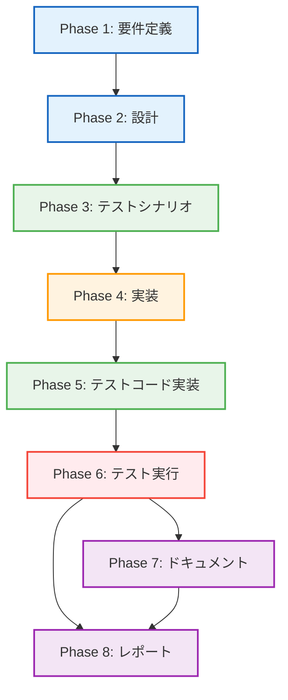

# プロジェクト計画書: Issue #465

## Issue概要

- **Issue番号**: #465
- **タイトル**: [Refactor] dot_processor.py - Phase 4: レビューと最適化
- **親Issue**: #448
- **依存Issue**: #464 (Phase 3: 統合とネスト解消)
- **URL**: https://github.com/tielec/infrastructure-as-code/issues/465

## 1. Issue分析

### 複雑度

**中程度**

#### 判定根拠

- **対象ファイル数**: 5ファイル（dot_processor.py + テストファイル3個 + README.md）
- **作業内容**: コードレビュー、パフォーマンステスト、ドキュメント更新が中心
- **技術的複雑度**: リファクタリング後の品質保証のため、既存コードの理解が必要
- **新規実装**: 最小限（主にドキュメントとテスト）

### 見積もり工数

**12~18時間**

#### 根拠

| タスク | 見積もり時間 | 理由 |
|--------|-------------|------|
| Phase 1: 要件定義 | 1~2h | レビュー観点の整理、ドキュメント要件定義 |
| Phase 2: 設計 | 1~2h | パフォーマンステスト設計、アーキテクチャ図設計 |
| Phase 3: テストシナリオ | 1~2h | 統合テストシナリオ、パフォーマンステストシナリオ |
| Phase 4: 実装 | 2~3h | パフォーマンステスト実装、コードレビュー対応 |
| Phase 5: テストコード実装 | 2~3h | 統合テストケース追加、ベンチマーク比較 |
| Phase 6: テスト実行 | 1~2h | 全テスト実行、カバレッジ確認 |
| Phase 7: ドキュメント | 2~3h | アーキテクチャ図、クラス図、README更新 |
| Phase 8: レポート | 2~3h | レビュー報告書、パフォーマンス比較レポート |

### リスク評価

**中**

#### リスク要因

1. **パフォーマンス劣化のリスク**: Phase 1~3のリファクタリング後の性能が±10%以内に収まらない可能性
2. **ドキュメント不整合のリスク**: Phase 1~3の変更がドキュメントに正しく反映されていない可能性
3. **テストカバレッジ不足のリスク**: Phase 3で追加されたヘルパーメソッドのテストが不十分な可能性

---

## 2. 実装戦略判断

### 実装戦略: EXTEND

#### 判断根拠

- **Phase 4の性質**: リファクタリング完了後のレビューと最適化フェーズ
- **新規コード**: 最小限（パフォーマンステストコードとドキュメントが中心）
- **既存コード変更**: ほぼなし（レビュー指摘事項への軽微な修正のみ）
- **ドキュメント**: 新規作成（アーキテクチャ図、クラス図）+ 既存更新（README）

Phase 4は主に**品質保証とドキュメント整備**であり、既存のリファクタリング成果物を検証・補強する作業が中心です。そのため、CREATEやREFACTORではなく、EXTENDが適切です。

### テスト戦略: INTEGRATION_BDD

#### 判断根拠

**INTEGRATION_BDD**を選択する理由：

1. **統合テストの重要性**:
   - Phase 1~3のリファクタリング後、4つのクラス（DotFileGenerator、DotFileProcessor、UrnProcessor、NodeLabelGenerator、ResourceDependencyBuilder）の協調動作を検証する必要がある
   - 統合テストがPhase 4の中心タスク

2. **BDDテストの必要性**:
   - エンドユーザー（開発者）のユースケース検証が重要
   - 「Pulumi生成グラフを読み込んで可視化する」というシナリオベースのテスト
   - Given-When-Then形式で既にテストが記述されている（既存テストを拡張）

3. **ユニットテストが不要な理由**:
   - Phase 1~3で既にユニットテストが十分にカバーされている（合計114ケース）
   - Phase 4は新規クラス・メソッド追加がない（パフォーマンステストのみ）

### テストコード戦略: EXTEND_TEST

#### 判断根拠

**EXTEND_TEST**を選択する理由：

1. **既存テストファイルへの追加**:
   - `test_dot_processor.py`: パフォーマンステストクラスを追加
   - 新規テストファイル作成は不要（Phase 1~3で既に分離済み）

2. **新規テストの性質**:
   - 統合テストの補強（エッジケース、パフォーマンステスト）
   - 既存テスト構造との整合性を保つ

3. **テストコード量**:
   - 追加テストケース数: 5~10ケース程度（少量）
   - 既存テストケース数: 114ケース（大量）

---

## 3. 影響範囲分析

### 既存コードへの影響

#### 最小限の影響

| ファイル | 影響内容 | 影響度 |
|---------|---------|--------|
| `dot_processor.py` | レビュー指摘事項への軽微な修正のみ | 低 |
| `urn_processor.py` | 影響なし（Phase 1で完了） | なし |
| `node_label_generator.py` | 影響なし（Phase 2で完了） | なし |
| `resource_dependency_builder.py` | 影響なし（Phase 3で完了） | なし |
| `test_dot_processor.py` | パフォーマンステストクラス追加 | 低 |
| `tests/README.md` | ドキュメント更新 | 低 |

#### レビュー指摘事項の例

- コメント改善（Docstring追加、説明の明確化）
- 変数名の改善（より意味のある名前へ）
- エラーメッセージの改善
- 不要なコードの削除

### 依存関係の変更

**変更なし**

- Phase 4は既存のリファクタリング成果を検証するフェーズ
- 新規依存ライブラリの追加なし
- 既存依存関係の変更なし

### マイグレーション要否

**不要**

- データベーススキーマ変更なし
- 設定ファイル変更なし
- API変更なし

---

## 4. タスク分割

### Phase 1: 要件定義 (見積もり: 1~2h)

- [x] Task 1-1: レビュー観点の整理 (30~45分)
  - Phase 1~3のリファクタリング内容の確認
  - コードレビューチェックリスト作成（可読性、保守性、パフォーマンス、セキュリティ）
  - レビュー基準の定義（ブロッカー、メジャー、マイナー）

- [x] Task 1-2: パフォーマンステスト要件定義 (30~45分)
  - ベンチマーク基準の決定（±10%以内）
  - テスト対象メソッドの選定（create_dot_file、apply_graph_styling等）
  - リソース数の決定（1, 5, 10, 20リソース）

- [x] Task 1-3: ドキュメント要件定義 (30~45分)
  - アーキテクチャ図の要件（4クラスの関係図）
  - クラス図の要件（各クラスの詳細設計）
  - README更新項目の洗い出し（Phase 4の変更点）

### Phase 2: 設計 (見積もり: 1~2h)

- [x] Task 2-1: パフォーマンステスト設計 (30~60分)
  - ベンチマーク計測方法の設計（timeitモジュール使用）
  - テストケース設計（正常系、境界値、大量データ）
  - 結果フォーマット設計（CSV、Markdown表）

- [x] Task 2-2: アーキテクチャ図設計 (30~60分)
  - Mermaid形式のクラス図フォーマット
  - 4クラスの依存関係図（DotFileGenerator → UrnProcessor等）
  - レイヤー分離の視覚化（生成層、処理層、ユーティリティ層）

- [x] Task 2-3: レビュー実施計画 (15~30分)
  - レビュー対象ファイルのリスト化
  - レビュー順序の決定（DotFileProcessor → UrnProcessor → ...）
  - レビュー時間の見積もり

### Phase 3: テストシナリオ (見積もり: 1~2h)

- [x] Task 3-1: 統合テストシナリオ作成 (30~60分)
  - エンドツーエンドシナリオ（Pulumi生成データ → DOT出力）
  - エラーハンドリングシナリオ（不正URN、空データ）
  - 境界値シナリオ（0リソース、20リソース、21リソース）

- [x] Task 3-2: パフォーマンステストシナリオ作成 (30~60分)
  - ベンチマークシナリオ（リソース数変動: 1, 5, 10, 20）
  - メモリ使用量シナリオ（大量データ処理）
  - リファクタリング前後比較シナリオ

- [ ] Task 3-3: ドキュメントレビューシナリオ作成 (15~30分)
  - README整合性チェックシナリオ
  - Docstring網羅性チェックシナリオ
  - アーキテクチャ図の正確性検証シナリオ

### Phase 4: 実装 (見積もり: 2~3h)

- [x] Task 4-1: コードレビュー実施 (60~90分)
  - dot_processor.pyのレビュー（可読性、保守性）
  - urn_processor.pyのレビュー（Phase 1成果確認）
  - node_label_generator.pyのレビュー（Phase 2成果確認）
  - resource_dependency_builder.pyのレビュー（Phase 3成果確認）
  - レビュー指摘事項の記録

- [x] Task 4-2: レビュー指摘事項の修正 (30~60分)
  - ブロッカー修正（もしあれば）
  - メジャー修正（可読性、命名規則）
  - マイナー修正（コメント、フォーマット）

- [x] Task 4-3: パフォーマンステストコード実装 (30~60分)
  - ベンチマーク計測コード実装
  - テストデータ生成コード実装
  - 結果保存コード実装

### Phase 5: テストコード実装 (見積もり: 2~3h)

- [x] Task 5-1: 統合テストケース追加 (60~90分)
  - エンドツーエンドテストケース（5ケース）
  - エラーハンドリングテストケース（3ケース）
  - 境界値テストケース（3ケース）

- [x] Task 5-2: パフォーマンステスト実装 (30~60分)
  - リソース数変動テスト（4ケース: 1, 5, 10, 20リソース）
  - リファクタリング前後比較テスト（ベースライン比較）

- [ ] Task 5-3: テストコードレビュー (30~45分)
  - Given-When-Then形式の確認
  - アサーションの妥当性確認
  - テストカバレッジ確認

### Phase 6: テスト実行 (見積もり: 1~2h)

- [ ] Task 6-1: 全テスト実行 (30~45分)
  - 既存テスト実行（114ケース）
  - 新規テスト実行（11ケース）
  - テスト失敗の修正

- [ ] Task 6-2: カバレッジ確認 (15~30分)
  - カバレッジ測定（pytest-cov）
  - 80%目標達成の確認
  - 未カバー箇所の分析

- [ ] Task 6-3: パフォーマンス比較 (30~60分)
  - ベンチマーク結果の集計
  - リファクタリング前後の比較（±10%以内の確認）
  - パフォーマンスレポート作成

### Phase 7: ドキュメント (見積もり: 2~3h)

- [ ] Task 7-1: アーキテクチャ図作成 (60~90分)
  - 4クラスの関係図（Mermaid形式）
  - レイヤー分離の図解
  - 依存関係の明確化

- [ ] Task 7-2: クラス図作成 (30~60分)
  - 各クラスの詳細設計図（Mermaid形式）
  - メソッド一覧と責務の明記
  - 静的メソッド設計の説明

- [ ] Task 7-3: README更新 (30~60分)
  - Phase 4の変更点を反映
  - パフォーマンステスト実行方法の追加
  - アーキテクチャ図・クラス図へのリンク追加
  - トラブルシューティング情報の更新

### Phase 8: レポート (見積もり: 2~3h)

- [ ] Task 8-1: レビュー報告書作成 (60~90分)
  - レビュー指摘事項のサマリー
  - 修正内容の詳細
  - 品質改善効果の記録

- [ ] Task 8-2: パフォーマンス比較レポート作成 (30~60分)
  - ベンチマーク結果の可視化（グラフ、表）
  - リファクタリング前後の比較分析
  - パフォーマンスボトルネックの分析

- [ ] Task 8-3: Phase 4完了レポート作成 (30~60分)
  - Phase 4の成果サマリー
  - 全タスクの完了状況確認
  - 次Issueへの引き継ぎ事項（もしあれば）

---

## 5. 依存関係

### タスク間の依存関係

| フェーズ | ブロッキング依存 | 理由 |
|---------|----------------|------|
| Phase 2 | Phase 1完了 | レビュー観点が確定しないとテスト設計できない |
| Phase 3 | Phase 2完了 | テスト設計が確定しないとシナリオ作成できない |
| Phase 4 | Phase 3完了 | テストシナリオに基づいてレビュー実施 |
| Phase 5 | Phase 4完了 | レビュー指摘事項を反映したテストコード実装 |
| Phase 6 | Phase 5完了 | テストコード実装完了後にテスト実行 |
| Phase 7 | Phase 6完了 | テスト結果を踏まえたドキュメント作成 |
| Phase 8 | Phase 6, 7完了 | テスト結果とドキュメントを統合したレポート作成 |

---

## 6. リスクと軽減策

### リスク1: パフォーマンス劣化（±10%超過）

- **影響度**: 高
- **確率**: 中
- **軽減策**:
  - Phase 1~3で性能に配慮した設計を確認（静的メソッド、ステートレス設計）
  - 早期にベンチマーク計測を実施（Phase 4-3）
  - ボトルネック特定ツール使用（cProfile、line_profiler）
  - 劣化が見つかった場合の緊急対応プラン（ホットパス最適化）

### リスク2: テストカバレッジ不足（80%未達）

- **影響度**: 中
- **確率**: 低
- **軽減策**:
  - Phase 1~3で既に114テストケース作成済み
  - Phase 6-2でカバレッジ確認を早期実施
  - 未カバー箇所は優先度付けして追加テスト作成
  - プライベートメソッドは公開メソッド経由でテスト

### リスク3: ドキュメント不整合

- **影響度**: 中
- **確率**: 中
- **軽減策**:
  - Phase 1~3の変更履歴を徹底確認
  - アーキテクチャ図をコードと突き合わせて検証
  - READMEのサンプルコードを実際に実行して確認
  - レビュー段階でドキュメント整合性をチェック

### リスク4: レビュー指摘事項の対応漏れ

- **影響度**: 中
- **確率**: 低
- **軽減策**:
  - レビュー指摘事項をGitHub Issueで管理
  - ブロッカー、メジャー、マイナーの優先度付け
  - Phase 4-2で確実に対応（修正完了をテストで検証）
  - レビュー指摘事項のチェックリスト化

### リスク5: Phase 1~3の成果物に重大な問題が発見される

- **影響度**: 高
- **確率**: 低
- **軽減策**:
  - Phase 4のレビュー範囲を明確化（品質保証が目的）
  - 重大な問題が見つかった場合は別Issueで対応
  - 軽微な問題のみPhase 4で修正
  - エスカレーション基準の明確化（ブロッカー定義）

---

## 7. 品質ゲート

### Phase 1: 要件定義

- [ ] レビューチェックリストが明確に定義されている
- [ ] パフォーマンステスト基準（±10%以内）が明記されている
- [ ] ドキュメント要件が具体的に記載されている
- [ ] 受け入れ基準が測定可能である

### Phase 2: 設計

- [ ] **実装戦略が明確に決定されている**（EXTEND）
- [ ] **テスト戦略が明確に決定されている**（INTEGRATION_BDD）
- [ ] **テストコード戦略が明確に決定されている**（EXTEND_TEST）
- [ ] パフォーマンステスト設計が実装可能である
- [ ] アーキテクチャ図フォーマットが決定している

### Phase 3: テストシナリオ

- [ ] 統合テストシナリオが網羅的である（正常系、異常系、境界値）
- [ ] パフォーマンステストシナリオが測定可能である
- [ ] ドキュメントレビューシナリオが明確である
- [ ] Given-When-Then形式で記述されている

### Phase 4: 実装

- [ ] コードレビューが完了している（4ファイル）
- [ ] レビュー指摘事項が記録されている
- [ ] ブロッカー指摘事項がすべて修正されている
- [ ] パフォーマンステストコードが実装されている

### Phase 5: テストコード実装

- [x] 統合テストケースが追加されている（11ケース）
- [x] パフォーマンステストが実装されている（4ケース）
- [x] Given-When-Then形式で記述されている
- [ ] テストコードがレビューされている

### Phase 6: テスト実行

- [ ] 全テストがパスしている（125ケース: 既存114 + 新規11）
- [ ] カバレッジが80%以上である
- [ ] パフォーマンスが±10%以内である
- [ ] ベンチマーク結果が記録されている

### Phase 7: ドキュメント

- [ ] アーキテクチャ図が作成されている（Mermaid形式）
- [ ] クラス図が作成されている（Mermaid形式）
- [ ] READMEが更新されている（Phase 4の変更点反映）
- [ ] ドキュメントがコードと整合している

### Phase 8: レポート

- [ ] レビュー報告書が作成されている
- [ ] パフォーマンス比較レポートが作成されている
- [ ] Phase 4完了レポートが作成されている
- [ ] Issue #465の完了条件がすべて満たされている

---

## 8. 完了条件（Issue #465の要件）

Issue #465で定義された完了条件：

- [ ] **コードレビューが承認されていること**
  - Phase 4-1でレビュー実施
  - Phase 4-2でレビュー指摘事項を修正
  - Phase 8-1でレビュー報告書作成

- [ ] **パフォーマンスに大きな劣化がないこと（±10%以内）**
  - Phase 6-3でベンチマーク比較
  - Phase 8-2でパフォーマンスレポート作成

- [ ] **ドキュメントが最新の状態に更新されていること**
  - Phase 7-1でアーキテクチャ図作成
  - Phase 7-2でクラス図作成
  - Phase 7-3でREADME更新

- [ ] **全テストがパスすること**
  - Phase 6-1で全テスト実行（125ケース）
  - Phase 6-2でカバレッジ確認（80%以上）

---

## 9. 成果物一覧

### コード成果物

1. **パフォーマンステストコード**: `tests/test_dot_processor.py`に追加
2. **統合テストコード**: `tests/test_dot_processor.py`に追加
3. **レビュー指摘事項修正**: `dot_processor.py`等への軽微な修正

### ドキュメント成果物

1. **アーキテクチャ図**: `ARCHITECTURE.md`（Mermaid形式）
2. **クラス図**: `CLASS_DIAGRAM.md`（Mermaid形式）
3. **README更新**: `tests/README.md`

### レポート成果物

1. **レビュー報告書**: `REVIEW_REPORT.md`
2. **パフォーマンス比較レポート**: `PERFORMANCE_REPORT.md`
3. **Phase 4完了レポート**: `PHASE4_COMPLETION.md`

---

## 10. 参考情報

### 既存ドキュメント

- `jenkins/jobs/pipeline/infrastructure/pulumi-stack-action/src/dot_processor.py`
- `jenkins/jobs/pipeline/infrastructure/pulumi-stack-action/tests/test_dot_processor.py`
- `jenkins/jobs/pipeline/infrastructure/pulumi-stack-action/tests/README.md`

### Issue履歴

- Issue #448: 親Issue（リファクタリング全体計画）
- Issue #461: Phase 1 - URN処理の分離
- Issue #462: Phase 2 - ノードラベル生成の分離
- Issue #463: Phase 3 - リソース依存関係の分離
- Issue #464: Phase 3 - 統合とネスト解消

### 技術スタック

- **言語**: Python 3.8以上
- **テストフレームワーク**: pytest 7.4.3
- **カバレッジツール**: pytest-cov 4.1.0
- **ドキュメント**: Markdown, Mermaid

---

## 11. 備考

### Phase 4の位置づけ

Phase 4は、Phase 1~3のリファクタリング成果を検証・補強するフェーズです。新規実装は最小限に抑え、品質保証とドキュメント整備に注力します。

### Phase 4完了後の状態

- **コード品質**: レビュー承認済み、カバレッジ80%以上
- **パフォーマンス**: リファクタリング前後で±10%以内
- **ドキュメント**: アーキテクチャ図、クラス図、README最新化
- **テスト**: 125ケース（既存114 + 新規11）がすべてパス

### 次Issueへの引き継ぎ

Phase 4完了後、Issue #448（親Issue）の完了判定が行われます。Phase 4で発見された改善点があれば、別Issueで対応します。
