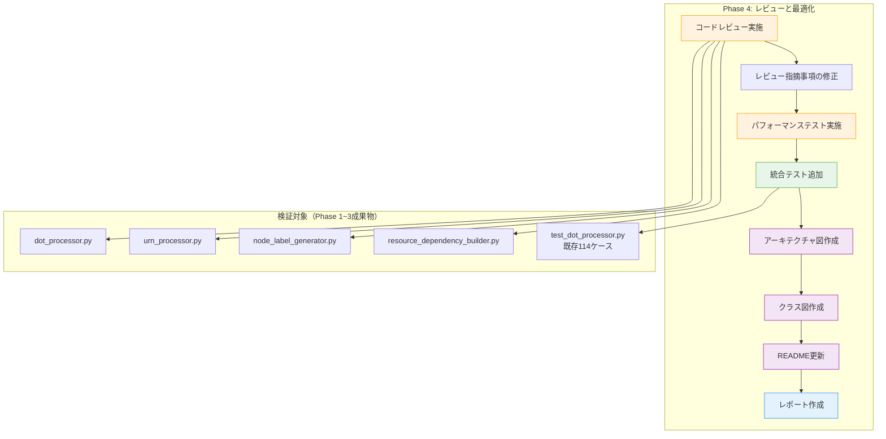
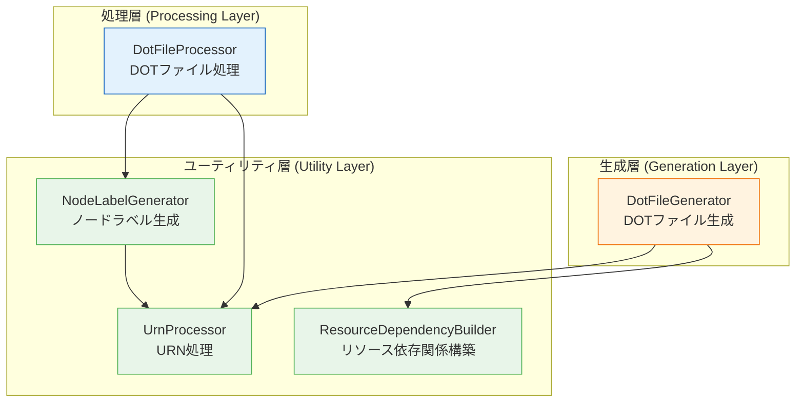
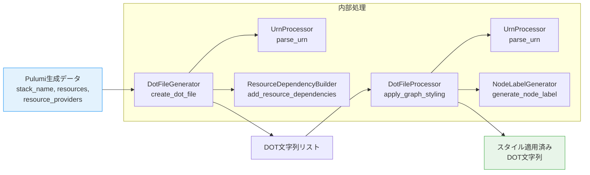
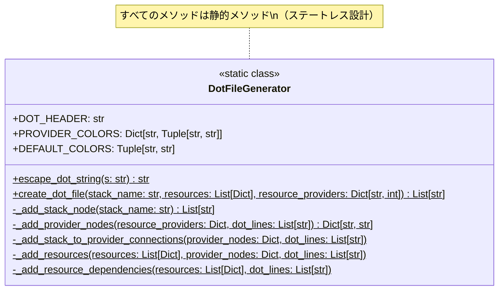
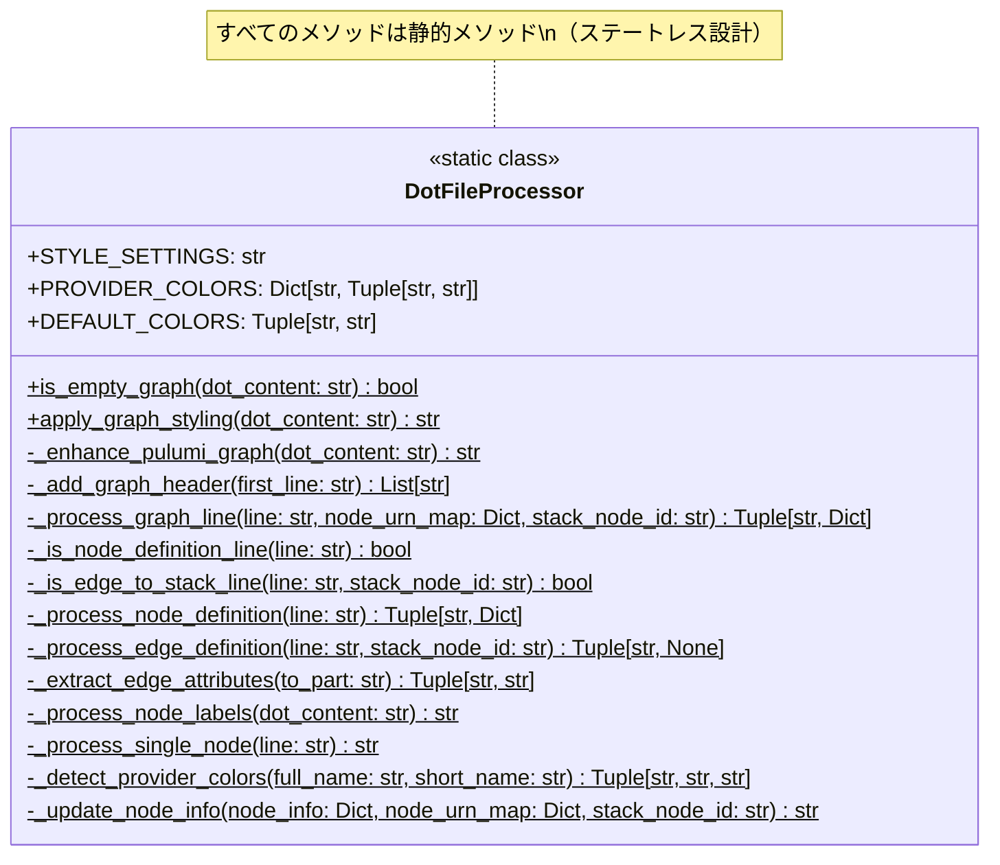
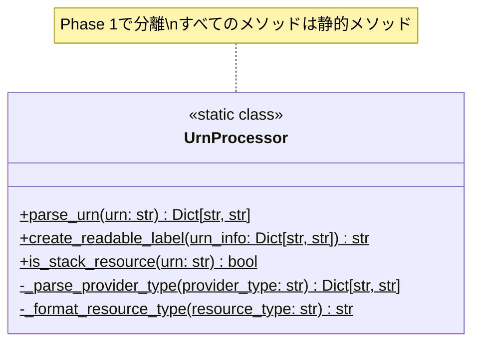
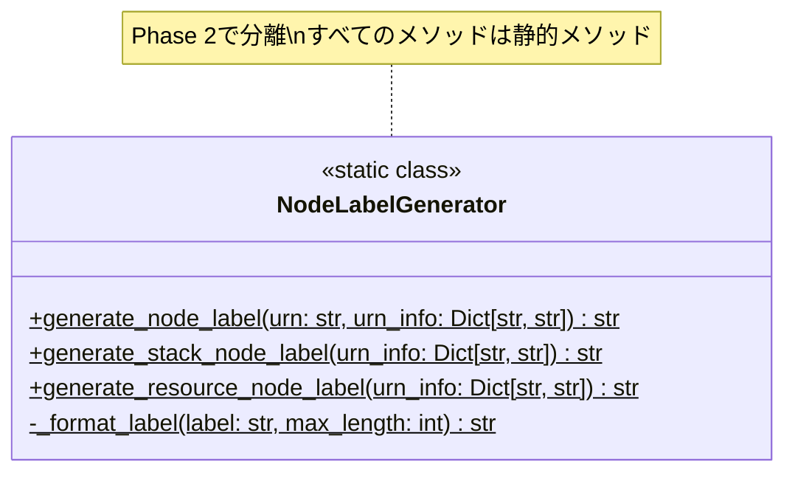
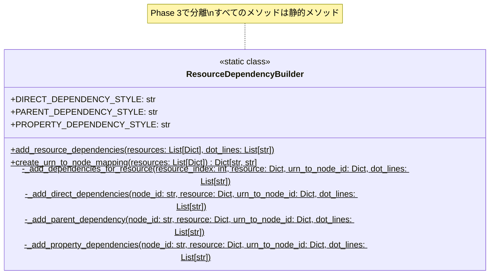

# 詳細設計書: Issue #465

## メタデータ

- **Issue番号**: #465
- **タイトル**: [Refactor] dot_processor.py - Phase 4: レビューと最適化
- **親Issue**: #448
- **依存Issue**: #464 (Phase 3: 統合とネスト解消)
- **作成日**: 2025年10月17日
- **ステータス**: 設計完了
- **URL**: https://github.com/tielec/infrastructure-as-code/issues/465

---

## 1. アーキテクチャ設計

### 1.1 システム全体像

Phase 4は、Phase 1~3のリファクタリング成果を検証・補強するフェーズです。新規実装は最小限に抑え、品質保証とドキュメント整備に注力します。



### 1.2 コンポーネント間の関係

Phase 4で作成される成果物と既存コンポーネントの関係を示します。

```mermaid
graph LR
    subgraph "既存コンポーネント"
        dot_proc[dot_processor.py]
        urn_proc[urn_processor.py]
        node_gen[node_label_generator.py]
        res_dep[resource_dependency_builder.py]
        tests[test_dot_processor.py]
    end

    subgraph "Phase 4成果物（ドキュメント）"
        arch[ARCHITECTURE.md]
        class[CLASS_DIAGRAM.md]
        readme[README.md]
        review[REVIEW_REPORT.md]
        perf[PERFORMANCE_REPORT.md]
        complete[PHASE4_COMPLETION.md]
    end

    subgraph "Phase 4成果物（テスト）"
        perf_test[パフォーマンステスト]
        int_test[統合テスト11ケース]
    end

    dot_proc --> arch
    urn_proc --> arch
    node_gen --> arch
    res_dep --> arch

    dot_proc --> class
    urn_proc --> class
    node_gen --> class
    res_dep --> class

    tests --> int_test
    tests --> perf_test

    dot_proc --> review
    urn_proc --> review
    node_gen --> review
    res_dep --> review

    perf_test --> perf

    arch --> readme
    class --> readme
    perf --> complete
    review --> complete

    style arch fill:#F3E5F5,stroke:#9C27B0
    style class fill:#F3E5F5,stroke:#9C27B0
    style readme fill:#F3E5F5,stroke:#9C27B0
    style review fill:#E3F2FD,stroke:#2196F3
    style perf fill:#E3F2FD,stroke:#2196F3
    style complete fill:#E3F2FD,stroke:#2196F3
    style perf_test fill:#FFF3E0,stroke:#FF9800
    style int_test fill:#E8F5E9,stroke:#4CAF50
```

---

## 2. 実装戦略判断

### 実装戦略: EXTEND

#### 判断根拠

1. **Phase 4の性質**: Phase 4は既存のリファクタリング成果を検証・補強するフェーズであり、主に品質保証とドキュメント整備が中心です。新規実装は最小限（パフォーマンステストコードとドキュメント）に抑えられます。

2. **既存ファイルへの影響範囲**:
   - 既存Pythonファイル（4ファイル）への修正は軽微（レビュー指摘事項への対応のみ）
   - 既存テストファイル（`test_dot_processor.py`）にテストケースを追加（11ケース）
   - 既存README（`tests/README.md`）の更新

3. **新規ファイルの作成**:
   - ドキュメント成果物: 6ファイル（ARCHITECTURE.md、CLASS_DIAGRAM.md等）
   - コード成果物: なし（既存ファイルへの追加のみ）

4. **既存機能との統合度**:
   - Phase 1~3のリファクタリング成果を基盤として活用
   - 既存テスト構造（conftest.py、フィクスチャ）を再利用
   - 既存コーディング規約・テスト規約に準拠

5. **CREATE/REFACTORではない理由**:
   - **CREATEではない**: 完全に新しい機能ではなく、既存コードの検証・補強
   - **REFACTORではない**: コード構造改善が主目的ではなく、品質保証が主目的

---

## 3. テスト戦略判断

### テスト戦略: INTEGRATION_BDD

#### 判断根拠

**INTEGRATION_BDD**を選択する理由:

1. **統合テストの重要性**:
   - Phase 1~3で分離された4つのクラス（`DotFileGenerator`、`DotFileProcessor`、`UrnProcessor`、`NodeLabelGenerator`、`ResourceDependencyBuilder`）の協調動作を検証する必要がある
   - 統合テストがPhase 4の中心タスクである（FR-04）
   - エンドツーエンドのデータフロー（Pulumi生成データ → DOT出力）を検証

2. **BDDテストの必要性**:
   - エンドユーザー（開発者）のユースケース検証が重要
   - 「Pulumi生成グラフを読み込んで可視化する」というシナリオベースのテスト
   - Given-When-Then形式で既にテストが記述されている（既存テストを拡張）
   - 要件定義書の受け入れ基準（AC-01～AC-07）がGiven-When-Then形式で記載されている

3. **ユニットテストが不要な理由**:
   - Phase 1~3で既にユニットテストが十分にカバーされている（合計114ケース）
     - `test_urn_processor.py`: 24ケース
     - `test_node_label_generator.py`: 29ケース
     - `test_resource_dependency_builder.py`: 37ケース
     - `test_dot_processor.py`（Phase 3追加分）: 24ケース
   - Phase 4は新規クラス・メソッド追加がない（パフォーマンステストとドキュメントのみ）
   - レビュー指摘事項への修正は軽微であり、既存ユニットテストで検証可能

4. **パフォーマンステストの位置づけ**:
   - パフォーマンステストは統合テストの一種として実施
   - リファクタリング前後のベンチマーク比較（±10%以内）を検証
   - 既存テストフレームワーク（pytest）で実装

---

## 4. テストコード戦略判断

### テストコード戦略: EXTEND_TEST

#### 判断根拠

**EXTEND_TEST**を選択する理由:

1. **既存テストファイルへの追加**:
   - `test_dot_processor.py`: パフォーマンステストクラス（`TestPerformanceBenchmark`）を追加
   - `test_dot_processor.py`: 統合テストケース（11ケース）を追加
   - 新規テストファイル作成は不要（Phase 1~3で既に分離済み）

2. **既存テスト構造との整合性**:
   - 既存のフィクスチャ（`conftest.py`）を再利用
   - 既存のテストデータ（`fixtures/test_data/`）を活用
   - Given-When-Then形式を継続使用
   - 既存マーカー（`@pytest.mark.characterization`、`@pytest.mark.integration`等）を活用

3. **新規テストの性質**:
   - 統合テストの補強（エッジケース、パフォーマンステスト）
   - 既存テストケース（114ケース）との共存が必要
   - テストコード量: 追加テストケース数は11ケース（少量）

4. **CREATE_TESTではない理由**:
   - 完全に新しいテストファイルを作成する必要がない
   - 既存テストファイル（`test_dot_processor.py`）に追加する方が保守性が高い
   - テストデータ、フィクスチャの重複を避ける

5. **BOTH_TESTではない理由**:
   - 新規クラスの追加がないため、新規テストファイルの作成は不要
   - 既存テストファイルへの追加のみで十分

---

## 5. 影響範囲分析

### 5.1 既存コードへの影響

Phase 4で既存コードへの影響は最小限です。

| ファイル | 影響内容 | 影響度 | 詳細 |
|---------|---------|--------|------|
| `dot_processor.py` | レビュー指摘事項への軽微な修正 | 低 | コメント改善、変数名改善、エラーメッセージ改善 |
| `urn_processor.py` | レビュー指摘事項への軽微な修正 | 低 | Phase 1成果確認、必要に応じて軽微な修正 |
| `node_label_generator.py` | レビュー指摘事項への軽微な修正 | 低 | Phase 2成果確認、必要に応じて軽微な修正 |
| `resource_dependency_builder.py` | レビュー指摘事項への軽微な修正 | 低 | Phase 3成果確認、必要に応じて軽微な修正 |
| `test_dot_processor.py` | パフォーマンステストクラス追加、統合テスト追加 | 低 | 11ケースの追加（既存114ケースに影響なし） |
| `tests/README.md` | ドキュメント更新 | 低 | Phase 4の変更点を反映 |

#### レビュー指摘事項の例

以下は想定されるレビュー指摘事項のカテゴリです（実際のレビューで特定）:

- **ブロッカー**: 次フェーズに進めない重大な問題（セキュリティリスク、致命的なバグ）
- **メジャー**: 可読性・保守性に大きく影響する問題（不適切な命名、不十分なエラーハンドリング）
- **マイナー**: 改善推奨だが必須ではない問題（コメント不足、フォーマット）

Phase 4では、ブロッカーとメジャーの指摘事項を優先的に修正します。

### 5.2 依存関係の変更

**変更なし**

- Phase 4は既存のリファクタリング成果を検証するフェーズ
- 新規依存ライブラリの追加なし
- 既存依存関係（`dot_processor.py` → `urn_processor.py` → `node_label_generator.py` → `resource_dependency_builder.py`）の変更なし

### 5.3 マイグレーション要否

**不要**

- データベーススキーマ変更なし
- 設定ファイル変更なし
- API変更なし
- 既存テストの後方互換性を維持

---

## 6. 変更・追加ファイルリスト

### 6.1 修正が必要な既存ファイル

| # | ファイルパス（相対パス） | 変更内容 | 変更理由 |
|---|--------------------------|----------|----------|
| 1 | `jenkins/jobs/pipeline/infrastructure/pulumi-stack-action/src/dot_processor.py` | レビュー指摘事項の修正 | FR-02 |
| 2 | `jenkins/jobs/pipeline/infrastructure/pulumi-stack-action/src/urn_processor.py` | レビュー指摘事項の修正 | FR-02 |
| 3 | `jenkins/jobs/pipeline/infrastructure/pulumi-stack-action/src/node_label_generator.py` | レビュー指摘事項の修正 | FR-02 |
| 4 | `jenkins/jobs/pipeline/infrastructure/pulumi-stack-action/src/resource_dependency_builder.py` | レビュー指摘事項の修正 | FR-02 |
| 5 | `jenkins/jobs/pipeline/infrastructure/pulumi-stack-action/tests/test_dot_processor.py` | パフォーマンステストと統合テストの追加 | FR-03, FR-04 |
| 6 | `jenkins/jobs/pipeline/infrastructure/pulumi-stack-action/tests/README.md` | Phase 4の変更点を反映 | FR-07 |

### 6.2 新規作成ファイル

| # | ファイルパス（相対パス） | 説明 | 関連要件 |
|---|--------------------------|------|----------|
| 1 | `jenkins/jobs/pipeline/infrastructure/pulumi-stack-action/docs/ARCHITECTURE.md` | アーキテクチャ図（Mermaid形式） | FR-05 |
| 2 | `jenkins/jobs/pipeline/infrastructure/pulumi-stack-action/docs/CLASS_DIAGRAM.md` | クラス図（Mermaid形式） | FR-06 |
| 3 | `jenkins/jobs/pipeline/infrastructure/pulumi-stack-action/docs/REVIEW_REPORT.md` | レビュー報告書 | FR-08 |
| 4 | `jenkins/jobs/pipeline/infrastructure/pulumi-stack-action/docs/PERFORMANCE_REPORT.md` | パフォーマンス比較レポート | FR-09 |
| 5 | `jenkins/jobs/pipeline/infrastructure/pulumi-stack-action/docs/PHASE4_COMPLETION.md` | Phase 4完了レポート | FR-10 |

### 6.3 削除が必要なファイル

**なし**

Phase 4では既存ファイルの削除は発生しません。

---

## 7. 詳細設計

### 7.1 パフォーマンステストクラス設計

Phase 4で追加するパフォーマンステストクラスの設計です。

#### クラス構造

```python
class TestPerformanceBenchmark:
    """パフォーマンステスト - リファクタリング前後のベンチマーク比較

    目的:
    - リファクタリング前後の性能差が±10%以内であることを検証
    - 各メソッドの実行時間を測定
    - ベンチマーク結果をレポート用にCSV出力

    テスト対象メソッド:
    - DotFileProcessor.create_dot_file()
    - DotFileProcessor.apply_graph_styling()
    - UrnProcessor.extract_component()
    - NodeLabelGenerator.generate_label()
    - ResourceDependencyBuilder.build_dependencies()
    """

    @pytest.mark.performance
    def test_create_dot_file_performance_1_resource(self):
        """TC-P-01: 1リソース処理時間（正常系）"""
        pass

    @pytest.mark.performance
    def test_create_dot_file_performance_5_resources(self):
        """TC-P-02: 5リソース処理時間（正常系）"""
        pass

    @pytest.mark.performance
    def test_create_dot_file_performance_10_resources(self):
        """TC-P-03: 10リソース処理時間（正常系）"""
        pass

    @pytest.mark.performance
    def test_create_dot_file_performance_20_resources(self):
        """TC-P-04: 20リソース処理時間（境界値）"""
        pass

    @pytest.mark.performance
    def test_apply_graph_styling_performance(self):
        """TC-P-05: グラフスタイル適用処理時間"""
        pass
```

#### パフォーマンステストの実装方針

1. **測定方法**:
   - `timeit`モジュールを使用し、各メソッドを100回実行して平均実行時間を測定
   - ウォームアップ実行（10回）を行ってキャッシュを効かせる

2. **ベースライン比較**:
   - Phase 1実施前のコードをベースラインとして保存（別ブランチまたは履歴から取得）
   - 可能であればベースラインとの比較を自動化
   - 比較が不可能な場合は、現在のパフォーマンスを記録して将来の基準とする

3. **結果の記録**:
   - CSV形式で結果を保存（テストメソッド名、リソース数、平均実行時間、標準偏差）
   - pytest-benchmarkプラグインを使用してHTMLレポート生成（オプション）

4. **許容範囲**:
   - ±10%以内を許容範囲とする
   - 10%を超える場合はテストを失敗させ、調査が必要

#### テストケース詳細

| テストケースID | テスト内容 | リソース数 | 期待実行時間 | 判定基準 |
|--------------|------------|------------|-------------|---------|
| TC-P-01 | 1リソース処理 | 1 | < 0.1秒 | ベースライン±10% |
| TC-P-02 | 5リソース処理 | 5 | < 0.5秒 | ベースライン±10% |
| TC-P-03 | 10リソース処理 | 10 | < 1.0秒 | ベースライン±10% |
| TC-P-04 | 20リソース処理（境界値） | 20 | < 2.0秒 | ベースライン±10% |
| TC-P-05 | グラフスタイル適用 | - | < 0.1秒 | ベースライン±10% |

### 7.2 統合テストケース設計

Phase 4で追加する統合テストケース（11ケース）の設計です。

#### テストクラス構造

```python
class TestEndToEndIntegration:
    """エンドツーエンド統合テスト（5ケース）

    目的:
    - Pulumi生成データ → DOT出力までの一連の流れを検証
    - 4つのクラスの協調動作を確認
    """

    @pytest.mark.integration
    def test_e2e_pulumi_graph_to_dot_output_basic(self):
        """TC-E-01: 基本的なPulumiグラフ処理（AWS）"""
        pass

    @pytest.mark.integration
    def test_e2e_pulumi_graph_to_dot_output_multi_provider(self):
        """TC-E-02: 複数プロバイダー（AWS + Azure）"""
        pass

    @pytest.mark.integration
    def test_e2e_pulumi_graph_to_dot_output_complex_dependencies(self):
        """TC-E-03: 複雑な依存関係"""
        pass

    @pytest.mark.integration
    def test_e2e_pulumi_graph_to_dot_output_long_resource_names(self):
        """TC-E-04: 長いリソース名の処理"""
        pass

    @pytest.mark.integration
    def test_e2e_pulumi_graph_to_dot_output_special_characters(self):
        """TC-E-05: 特殊文字を含むリソース名"""
        pass


class TestErrorHandlingIntegration:
    """エラーハンドリング統合テスト（3ケース）

    目的:
    - 異常データに対する適切なエラーハンドリングを検証
    """

    @pytest.mark.integration
    def test_error_handling_invalid_urn(self):
        """TC-EH-01: 不正なURN形式"""
        pass

    @pytest.mark.integration
    def test_error_handling_empty_data(self):
        """TC-EH-02: 空データ"""
        pass

    @pytest.mark.integration
    def test_error_handling_none_data(self):
        """TC-EH-03: Noneデータ"""
        pass


class TestBoundaryValueIntegration:
    """境界値統合テスト（3ケース）

    目的:
    - リソース数の境界値での動作を検証
    """

    @pytest.mark.integration
    def test_boundary_0_resources(self):
        """TC-BV-01: 0リソース"""
        pass

    @pytest.mark.integration
    def test_boundary_20_resources(self):
        """TC-BV-02: 20リソース（最大値）"""
        pass

    @pytest.mark.integration
    def test_boundary_21_resources(self):
        """TC-BV-03: 21リソース（最大値超過）"""
        pass
```

#### 統合テストケース詳細

| テストケースID | カテゴリ | テスト内容 | 期待結果 |
|--------------|---------|------------|---------|
| TC-E-01 | エンドツーエンド | 基本的なPulumiグラフ処理（AWS） | 正しいDOT出力 |
| TC-E-02 | エンドツーエンド | 複数プロバイダー（AWS + Azure） | プロバイダー別色設定が適用される |
| TC-E-03 | エンドツーエンド | 複雑な依存関係（循環依存含む） | 依存関係エッジが正しく生成される |
| TC-E-04 | エンドツーエンド | 長いリソース名の処理 | 省略記号付きで処理される |
| TC-E-05 | エンドツーエンド | 特殊文字を含むリソース名 | エスケープ処理が正しく適用される |
| TC-EH-01 | エラーハンドリング | 不正なURN形式 | デフォルト値で処理、エラーを投げない |
| TC-EH-02 | エラーハンドリング | 空データ | 空のDOT出力、エラーを投げない |
| TC-EH-03 | エラーハンドリング | Noneデータ | 適切なデフォルト値で処理 |
| TC-BV-01 | 境界値 | 0リソース | StackノードのみのDOT出力 |
| TC-BV-02 | 境界値 | 20リソース（最大値） | 全20リソースが処理される |
| TC-BV-03 | 境界値 | 21リソース（最大値超過） | 最初の20リソースのみ処理 |

### 7.3 アーキテクチャ図設計

#### 7.3.1 アーキテクチャ図の構成

`docs/ARCHITECTURE.md`に以下の図を含めます:

1. **4つのクラスの依存関係図**（Mermaid形式）
2. **レイヤー分離の視覚化**（生成層、処理層、ユーティリティ層）
3. **データフローの明示**（入力データ → 処理 → 出力データ）

#### 7.3.2 クラス依存関係図（Mermaid）



#### 7.3.3 データフロー図（Mermaid）



### 7.4 クラス図設計

#### 7.4.1 クラス図の構成

`docs/CLASS_DIAGRAM.md`に以下の図を含めます:

1. **各クラスの詳細設計図**（Mermaid形式）
2. **メソッド一覧と責務**
3. **静的メソッド設計の説明**

#### 7.4.2 DotFileGeneratorクラス図



#### 7.4.3 DotFileProcessorクラス図



#### 7.4.4 UrnProcessorクラス図



#### 7.4.5 NodeLabelGeneratorクラス図



#### 7.4.6 ResourceDependencyBuilderクラス図



### 7.5 ドキュメント設計

#### 7.5.1 ARCHITECTURE.md構成

```markdown
# アーキテクチャドキュメント

## 1. 概要
## 2. 設計思想
## 3. クラス構成
## 4. レイヤー分離
## 5. 依存関係
## 6. データフロー
## 7. 拡張性
```

#### 7.5.2 CLASS_DIAGRAM.md構成

```markdown
# クラス図ドキュメント

## 1. 概要
## 2. DotFileGenerator
## 3. DotFileProcessor
## 4. UrnProcessor
## 5. NodeLabelGenerator
## 6. ResourceDependencyBuilder
## 7. クラス間の関係
```

#### 7.5.3 REVIEW_REPORT.md構成

```markdown
# コードレビュー報告書

## 1. レビュー概要
## 2. レビュー対象ファイル
## 3. レビュー指摘事項サマリー
## 4. ブロッカー指摘事項
## 5. メジャー指摘事項
## 6. マイナー指摘事項
## 7. 修正内容詳細
## 8. 品質改善効果
```

#### 7.5.4 PERFORMANCE_REPORT.md構成

```markdown
# パフォーマンス比較レポート

## 1. ベンチマーク概要
## 2. 測定方法
## 3. ベンチマーク結果（表・グラフ）
## 4. リファクタリング前後の比較分析
## 5. パフォーマンスボトルネック分析
## 6. 結論
```

#### 7.5.5 PHASE4_COMPLETION.md構成

```markdown
# Phase 4完了レポート

## 1. Phase 4成果サマリー
## 2. 全タスクの完了状況
## 3. 品質ゲート達成状況
## 4. 次Issueへの引き継ぎ事項
## 5. 残課題
```

---

## 8. セキュリティ考慮事項

### 8.1 入力検証

| 項目 | 対策 | 実装箇所 |
|------|------|----------|
| 不正URN形式 | デフォルト値で安全に処理、エラーを投げない | `UrnProcessor.parse_urn()` |
| 極端に長い入力 | 省略記号で処理、メモリ枯渇を防ぐ | `DotFileGenerator.escape_dot_string()` |
| 特殊文字 | エスケープ処理を確実に実施 | `DotFileGenerator.escape_dot_string()` |
| Noneデータ | Noneチェックを実施、デフォルト値で処理 | 各メソッド |

### 8.2 機密情報の扱い

| 項目 | 対策 | 実装箇所 |
|------|------|----------|
| AWSアカウントID | URNに含まれる可能性があるが、ログ出力には含めない | レビュー時に確認 |
| リソース名 | 機密情報を含む可能性があるため、ログ出力時は注意 | レビュー時に確認 |

### 8.3 例外処理

| 項目 | 対策 | 実装箇所 |
|------|------|----------|
| 不正なURN形式 | 例外を投げず、デフォルト値で処理 | `UrnProcessor.parse_urn()` |
| 空リソースリスト | 例外を投げず、空のDOT出力 | `DotFileGenerator.create_dot_file()` |
| None入力 | 例外を投げず、デフォルト値で処理 | 各メソッド |

**Phase 4で確認する項目**:
- レビュー時に入力検証が適切に実施されているか確認
- ログ出力に機密情報が含まれていないか確認
- 例外処理が適切に実装されているか確認

---

## 9. 非機能要件への対応

### 9.1 パフォーマンス

| 項目 | 要件 | 対応策 | 検証方法 |
|------|------|--------|----------|
| リファクタリング前後の性能差 | ±10%以内 | Phase 1~3で静的メソッド、ステートレス設計を採用 | TC-P-01～TC-P-05で測定 |
| テスト実行時間 | 全テスト（125ケース）が10秒以内に完了 | pytest-xdistで並列実行 | テスト実行時に測定 |
| カバレッジ測定オーバーヘッド | カバレッジ測定による実行時間増加は20%以内 | pytest-covの最適化 | カバレッジ測定時に比較 |

### 9.2 スケーラビリティ

| 項目 | 要件 | 対応策 | 検証方法 |
|------|------|--------|----------|
| 最大リソース数 | 20リソースまで処理可能 | create_dot_file()で`resources[:20]`として最初の20個のみ処理 | TC-BV-02、TC-BV-03で検証 |
| メモリ使用量 | 大量データ処理時もメモリ枯渇しない | 静的メソッド、ステートレス設計 | パフォーマンステストで測定 |

### 9.3 保守性

| 項目 | 要件 | 対応策 | 検証方法 |
|------|------|--------|----------|
| Docstring網羅性 | 全てのパブリックメソッドにDocstringを記載 | レビュー時に確認 | レビューチェックリスト |
| クラス責務の明確性 | 各クラスが単一責任原則に従っている | アーキテクチャ図で視覚化 | ARCHITECTURE.md |
| 依存関係の最小化 | クラス間の依存関係が最小限に保たれている | クラス図で確認 | CLASS_DIAGRAM.md |
| コメント品質 | 複雑な処理には実装理由を説明するコメントを記載 | レビュー時に確認 | レビューチェックリスト |

---

## 10. 実装の順序

Phase 4の実装順序を推奨します。依存関係を考慮し、並行実行可能なタスクを明示します。

### 10.1 Phase 1: 要件定義（1~2時間）

**並行実行可能**: すべてのタスクは独立

1. Task 1-1: レビュー観点の整理（30~45分）
2. Task 1-2: パフォーマンステスト要件定義（30~45分）
3. Task 1-3: ドキュメント要件定義（30~45分）

### 10.2 Phase 2: 設計（1~2時間）

**依存関係**: Phase 1完了後に実行

**並行実行可能**: すべてのタスクは独立

1. Task 2-1: パフォーマンステスト設計（30~60分）
2. Task 2-2: アーキテクチャ図設計（30~60分）
3. Task 2-3: レビュー実施計画（15~30分）

### 10.3 Phase 3: テストシナリオ（1~2時間）

**依存関係**: Phase 2完了後に実行

**並行実行可能**: すべてのタスクは独立

1. Task 3-1: 統合テストシナリオ作成（30~60分）
2. Task 3-2: パフォーマンステストシナリオ作成（30~60分）
3. Task 3-3: ドキュメントレビューシナリオ作成（15~30分）

### 10.4 Phase 4: 実装（2~3時間）

**依存関係**: Phase 3完了後に実行

**順序**:
1. Task 4-1: コードレビュー実施（60~90分）→ **ブロッキング**
2. Task 4-2: レビュー指摘事項の修正（30~60分）→ **Task 4-1依存**
3. Task 4-3: パフォーマンステストコード実装（30~60分）→ **並行実行可能**

### 10.5 Phase 5: テストコード実装（2~3時間）

**依存関係**: Phase 4完了後に実行

**順序**:
1. Task 5-1: 統合テストケース追加（60~90分）→ **並行実行可能**
2. Task 5-2: パフォーマンステスト実装（30~60分）→ **Task 4-3依存**
3. Task 5-3: テストコードレビュー（30~45分）→ **Task 5-1、5-2完了後**

### 10.6 Phase 6: テスト実行（1~2時間）

**依存関係**: Phase 5完了後に実行

**順序**:
1. Task 6-1: 全テスト実行（30~45分）→ **ブロッキング**
2. Task 6-2: カバレッジ確認（15~30分）→ **Task 6-1依存**
3. Task 6-3: パフォーマンス比較（30~60分）→ **Task 6-1依存**

### 10.7 Phase 7: ドキュメント（2~3時間）

**依存関係**: Phase 6完了後に実行

**並行実行可能**: すべてのタスクは独立

1. Task 7-1: アーキテクチャ図作成（60~90分）
2. Task 7-2: クラス図作成（30~60分）
3. Task 7-3: README更新（30~60分）

### 10.8 Phase 8: レポート（2~3時間）

**依存関係**: Phase 6、7完了後に実行

**順序**:
1. Task 8-1: レビュー報告書作成（60~90分）→ **並行実行可能**
2. Task 8-2: パフォーマンス比較レポート作成（30~60分）→ **Task 6-3依存**
3. Task 8-3: Phase 4完了レポート作成（30~60分）→ **Task 8-1、8-2完了後**

### 10.9 並行実行の最適化

以下のタスクは並行実行可能です:

- **Phase 1**: 全タスク（Task 1-1、1-2、1-3）
- **Phase 2**: 全タスク（Task 2-1、2-2、2-3）
- **Phase 3**: 全タスク（Task 3-1、3-2、3-3）
- **Phase 4**: Task 4-3（Task 4-1、4-2とは並行不可）
- **Phase 5**: Task 5-1とTask 5-2（Task 5-3とは並行不可）
- **Phase 7**: 全タスク（Task 7-1、7-2、7-3）
- **Phase 8**: Task 8-1とTask 8-2（Task 8-3とは並行不可）

---

## 11. 品質ゲート（Phase 2: 設計）

設計書は以下の品質ゲートを満たしています:

### ✅ 必須要件

- [x] **実装戦略の判断根拠が明記されている**: セクション2で「EXTEND」を選択し、5つの判断根拠を明記
- [x] **テスト戦略の判断根拠が明記されている**: セクション3で「INTEGRATION_BDD」を選択し、4つの判断根拠を明記
- [x] **テストコード戦略の判断根拠が明記されている**: セクション4で「EXTEND_TEST」を選択し、5つの判断根拠を明記
- [x] **既存コードへの影響範囲が分析されている**: セクション5で6つの既存ファイルへの影響を分析
- [x] **変更が必要なファイルがリストアップされている**: セクション6で修正6ファイル、新規5ファイルをリスト化
- [x] **設計が実装可能である**: セクション7で詳細設計（クラス構造、テストケース、ドキュメント構成）を記載

### 追加の品質確認項目

- [x] Planning Documentの戦略（EXTEND、INTEGRATION_BDD、EXTEND_TEST）を踏まえた設計
- [x] 要件定義書の機能要件（FR-01～FR-10）に対応する設計
- [x] 受け入れ基準（AC-01～AC-07）を満たす設計
- [x] セキュリティ考慮事項の明記（セクション8）
- [x] 非機能要件への対応（セクション9）
- [x] 実装順序の推奨（セクション10）

---

## 12. リスクと軽減策

### リスク1: パフォーマンス劣化（±10%超過）

- **影響度**: 高
- **確率**: 中
- **軽減策**:
  - Phase 1~3で性能に配慮した設計を確認（静的メソッド、ステートレス設計）
  - 早期にベンチマーク計測を実施（Task 4-3: パフォーマンステストコード実装）
  - ボトルネック特定ツール使用（cProfile、line_profiler）
  - 劣化が見つかった場合の緊急対応プラン（ホットパス最適化）

### リスク2: テストカバレッジ不足（80%未達）

- **影響度**: 中
- **確率**: 低
- **軽減策**:
  - Phase 1~3で既に114テストケース作成済み
  - Task 6-2でカバレッジ確認を早期実施
  - 未カバー箇所は優先度付けして追加テスト作成
  - プライベートメソッドは公開メソッド経由でテスト

### リスク3: ドキュメント不整合

- **影響度**: 中
- **確率**: 中
- **軽減策**:
  - Phase 1~3の変更履歴を徹底確認
  - アーキテクチャ図をコードと突き合わせて検証
  - READMEのサンプルコードを実際に実行して確認
  - レビュー段階でドキュメント整合性をチェック

### リスク4: レビュー指摘事項の対応漏れ

- **影響度**: 中
- **確率**: 低
- **軽減策**:
  - レビュー指摘事項をGitHub Issueで管理
  - ブロッカー、メジャー、マイナーの優先度付け
  - Task 4-2で確実に対応（修正完了をテストで検証）
  - レビュー指摘事項のチェックリスト化

### リスク5: Phase 1~3の成果物に重大な問題が発見される

- **影響度**: 高
- **確率**: 低
- **軽減策**:
  - Phase 4のレビュー範囲を明確化（品質保証が目的）
  - 重大な問題が見つかった場合は別Issueで対応
  - 軽微な問題のみPhase 4で修正
  - エスカレーション基準の明確化（ブロッカー定義）

---

## 13. 完了条件（トレーサビリティ）

Issue #465の完了条件と設計書の対応関係を示します。

| 完了条件 | 対応する設計 | 関連セクション |
|---------|-------------|--------------|
| コードレビューが承認されていること | Task 4-1（コードレビュー実施）、Task 4-2（レビュー指摘事項の修正）、Task 8-1（レビュー報告書作成） | セクション7.5.3 |
| パフォーマンスに大きな劣化がないこと（±10%以内） | Task 4-3（パフォーマンステストコード実装）、Task 6-3（パフォーマンス比較）、Task 8-2（パフォーマンス比較レポート作成） | セクション7.1、7.5.4 |
| ドキュメントが最新の状態に更新されていること | Task 7-1（アーキテクチャ図作成）、Task 7-2（クラス図作成）、Task 7-3（README更新） | セクション7.3、7.4、7.5 |
| 全テストがパスすること | Task 6-1（全テスト実行）、Task 6-2（カバレッジ確認） | セクション7.2 |

---

## 14. 参考情報

### 14.1 既存ドキュメント

- `CLAUDE.md`: プロジェクトの全体方針とコーディングガイドライン
- `ARCHITECTURE.md`: Platform Engineeringのアーキテクチャ設計思想
- `README.md`: プロジェクト全体の使用方法
- `jenkins/jobs/pipeline/infrastructure/pulumi-stack-action/src/dot_processor.py`: メインコード
- `jenkins/jobs/pipeline/infrastructure/pulumi-stack-action/tests/README.md`: テストドキュメント

### 14.2 依存Issue

- **Issue #448**: 親Issue（リファクタリング全体計画）
- **Issue #461**: Phase 1 - URN処理の分離（完了）
- **Issue #462**: Phase 2 - ノードラベル生成の分離（完了）
- **Issue #463**: Phase 3 - リソース依存関係の分離（完了）
- **Issue #464**: Phase 3 - 統合とネスト解消（完了）

### 14.3 技術スタック

- **言語**: Python 3.8以上
- **テストフレームワーク**: pytest 7.4.3
- **カバレッジツール**: pytest-cov 4.1.0
- **ドキュメント**: Markdown、Mermaid
- **パフォーマンステスト**: timeitモジュール、pytest-benchmark（オプション）

---

## 付録

### 用語集

| 用語 | 説明 |
|------|------|
| **ブロッカー** | 次フェーズに進めない重大な問題（セキュリティリスク、致命的なバグ） |
| **メジャー** | 可読性・保守性に大きく影響する問題（不適切な命名、不十分なエラーハンドリング） |
| **マイナー** | 改善推奨だが必須ではない問題（コメント不足、フォーマット） |
| **Given-When-Then** | BDD形式のテストシナリオ記述方法（前提条件-実行-結果） |
| **Mermaid** | Markdown埋め込み可能な図表記述言語 |
| **timeit** | Pythonの実行時間測定モジュール |
| **pytest-cov** | pytestのカバレッジ測定プラグイン |
| **Static Method** | インスタンスを作成せずにクラスから直接呼び出せるメソッド |
| **Stateless Design** | 状態を持たない設計（副作用がない） |

### 変更履歴

| 日付 | バージョン | 変更内容 | 作成者 |
|------|-----------|----------|--------|
| 2025-10-17 | 1.0 | 初版作成 | Claude Code |

---

**以上、詳細設計書を完了しました。**
