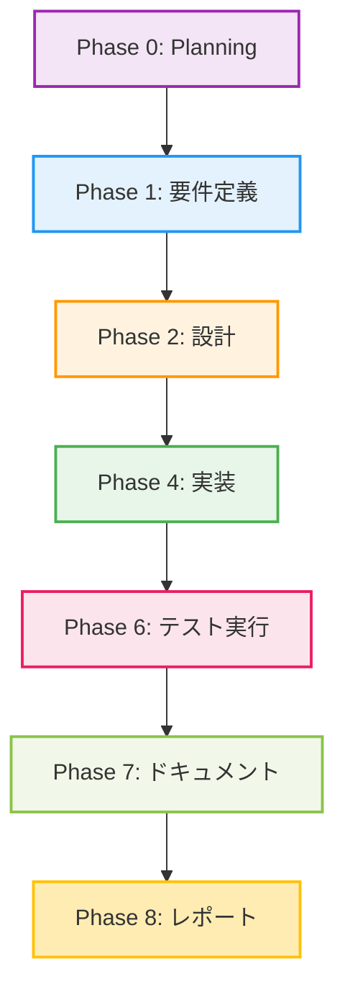

# プロジェクト計画書: Issue #475

**Issue番号**: #475
**タイトル**: [BugFix] dot_processor.py インポートエラーの修正
**作成日**: 2025-01-17
**優先度**: Critical

---

## 1. Issue分析

### 複雑度

**判定**: 簡単（Easy）

**根拠**:
- 問題は単一ディレクトリ（`src/`）に`__init__.py`が存在しないことが原因
- 修正内容は空の`__init__.py`ファイルを1つ作成するのみ
- 影響範囲は限定的（Pythonパッケージ認識の問題）
- 実装済みのコードには変更不要（すべてのモジュールが既に存在）

### 見積もり工数

**合計**: 1~2時間

**内訳**:
- Phase 1 (要件定義): 0.5h
- Phase 2 (設計): 0.5h
- Phase 3 (テストシナリオ): 0h（テスト不要）
- Phase 4 (実装): 0.25h（`__init__.py`作成のみ）
- Phase 5 (テストコード実装): 0h（テスト不要）
- Phase 6 (テスト実行): 0.5h（既存テストの実行確認）
- Phase 7 (ドキュメント): 0.25h
- Phase 8 (レポート): 0.5h

### リスク評価

**総合リスク**: 低（Low）

**技術的リスク**: 極めて低
- 既存コードへの変更なし
- Pythonの標準的な問題（`__init__.py`不足）
- 解決方法が明確

**スコープリスク**: なし
- 要件が明確（`__init__.py`の追加）

**依存リスク**: なし
- 外部システムへの依存なし

---

## 2. 実装戦略判断

### 実装戦略: CREATE

**判断根拠**:

新規ファイルの作成が中心であるため、**CREATE**を選択します。

**詳細な判断理由**:
1. **新規ファイル作成**: `src/__init__.py`を新規作成（空ファイル）
2. **既存コード変更なし**: `dot_processor.py`、`urn_processor.py`、`node_label_generator.py`、`resource_dependency_builder.py`はすべて実装済み
3. **構造的変更なし**: ディレクトリ構造やモジュール構成の変更なし

**補足**: Issueの説明では「これらのモジュールが実際には作成されていない」とありましたが、調査の結果、すべてのモジュールが既に実装済みであることが判明しました。問題の根本原因は`src/__init__.py`の欠落です。

---

### テスト戦略: UNIT_ONLY

**判断根拠**:

既存のユニットテストが正常に実行できることの確認のみで十分なため、**UNIT_ONLY**を選択します。

**詳細な判断理由**:
1. **既存テスト活用**: `tests/test_dot_processor.py`が既に存在
2. **機能追加なし**: 新規機能の追加はなく、既存機能の修復のみ
3. **外部依存なし**: インポートエラーの修正は内部モジュール解決の問題
4. **BDD不要**: ユーザーストーリーの変更なし（既存機能の修復）
5. **統合テスト不要**: 外部システム連携やAPI呼び出しの変更なし

**検証内容**:
- 既存ユニットテストが正常に実行できることを確認
- インポートエラーが解消されていることを確認

---

### テストコード戦略: EXTEND_TEST

**判断根拠**:

新規テストコード作成は不要で、既存テストが正常に実行できることの確認のみで十分なため、**EXTEND_TEST**を選択します（ただし、実際には拡張も不要）。

**詳細な判断理由**:
1. **既存テスト十分**: `test_dot_processor.py`が既に存在し、モジュールのインポートと基本機能をテスト済み
2. **機能変更なし**: `__init__.py`の追加は機能変更ではなく、Pythonパッケージ認識の修正
3. **テスト拡張不要**: 追加のテストケースは不要（既存テストで十分）

**実施内容**:
- 既存テストが正常に実行できることを確認
- 必要に応じて、インポートエラーの回帰テストを追加（オプション）

---

## 3. 影響範囲分析

### 既存コードへの影響

**変更対象**: なし

**影響を受けるファイル**:
- `src/__init__.py` - **新規作成**（空ファイル）

**変更不要なファイル**:
- `src/main.py` - 変更不要（既存のインポート文が正常に動作する）
- `src/dot_processor.py` - 変更不要（実装済み）
- `src/urn_processor.py` - 変更不要（実装済み）
- `src/node_label_generator.py` - 変更不要（実装済み）
- `src/resource_dependency_builder.py` - 変更不要（実装済み）
- `src/report_generator.py` - 変更不要（既存のインポート文が正常に動作する）
- `src/graph_processor.py` - 変更不要（既存のインポート文が正常に動作する）

### 依存関係の変更

**新規依存**: なし

**依存関係の変更**: なし

**補足**: `__init__.py`の追加により、Pythonが`src/`ディレクトリをパッケージとして認識するようになります。これにより、既存のインポート文（`from urn_processor import ...`）が正常に動作します。

### マイグレーション要否

**データベーススキーマ変更**: なし

**設定ファイル変更**: なし

**環境変数変更**: なし

**その他のマイグレーション**: なし

---

## 4. タスク分割

### Phase 1: 要件定義 (見積もり: 0.5h)

- [ ] Task 1-1: Issue内容の詳細確認 (0.25h)
  - Issue #475の記述内容を精査
  - エラーメッセージの確認（`ModuleNotFoundError: No module named 'urn_processor'`）
  - 関連Issue（#448, #463）の確認
- [ ] Task 1-2: 根本原因の特定 (0.25h)
  - `src/`ディレクトリの構造確認
  - `__init__.py`の有無確認
  - Pythonパッケージ認識の問題であることの確認

### Phase 2: 設計 (見積もり: 0.5h)

- [x] Task 2-1: 解決方法の設計 (0.25h)
  - `src/__init__.py`の作成（空ファイル）
  - Pythonパッケージ認識のメカニズム確認
- [x] Task 2-2: 影響範囲の確認 (0.25h)
  - 既存のインポート文が正常に動作することの確認
  - Jenkinsfile内のファイルコピー処理への影響確認
  - テストコードへの影響確認

### Phase 3: テストシナリオ (見積もり: 0h)

**スキップ理由**: 既存テストの実行確認のみで十分（新規テストシナリオ不要）

### Phase 4: 実装 (見積もり: 0.25h)

- [x] Task 4-1: `src/__init__.py`の作成 (0.25h)
  - 空の`__init__.py`ファイルを作成
  - ファイル権限の設定（644）
  - コミット対象への追加

### Phase 5: テストコード実装 (見積もり: 0h)

**スキップ理由**: 既存テストの実行確認のみで十分（新規テストコード不要）

### Phase 6: テスト実行 (見積もり: 0.5h)

- [ ] Task 6-1: 既存ユニットテストの実行 (0.25h)
  - `tests/test_dot_processor.py`の実行
  - インポートエラーが解消されていることの確認
  - すべてのテストケースが成功することの確認
- [ ] Task 6-2: 実行環境での動作確認 (0.25h)
  - `main.py`の実行確認（dry-run）
  - Jenkinsfileでのファイルコピー処理の確認（ドキュメントレビュー）

### Phase 7: ドキュメント (見積もり: 0.25h)

- [ ] Task 7-1: Issue #475のクローズ準備 (0.25h)
  - 修正内容のサマリー作成
  - 根本原因と解決方法の記載
  - 関連Issueへの言及（#448, #463）

### Phase 8: レポート (見積もり: 0.5h)

- [ ] Task 8-1: 実装レポート作成 (0.25h)
  - 修正内容の詳細
  - テスト結果の報告
  - リスク評価結果
- [ ] Task 8-2: プルリクエスト作成 (0.25h)
  - PR説明文の作成
  - Issue #475へのリンク
  - レビュアーの指定

---

## 5. 依存関係



**注**: Phase 3（テストシナリオ）とPhase 5（テストコード実装）はスキップします。

---

## 6. リスクと軽減策

### リスク1: Jenkinsfileのファイルコピー処理への影響

- **影響度**: 低
- **確率**: 低
- **軽減策**:
  - Jenkinsfile（line 806-813）を確認し、`__init__.py`も自動的にコピーされることを検証
  - 必要に応じて、Jenkinsfileに`__init__.py`の明示的なコピー処理を追加
  - ただし、現在のワイルドカード処理（`cp ${JENKINS_REPO_DIR}/${SCRIPT_PATH}/*.py .`は存在しない）では個別コピーのため、明示的追加が必要な可能性あり
  - **対応**: Jenkinsfileに`__init__.py`のコピー処理を追加（`cp ${JENKINS_REPO_DIR}/${SCRIPT_PATH}/__init__.py . || true`）

### リスク2: 既存テストの実行環境に問題がある

- **影響度**: 中
- **確率**: 低
- **軽減策**:
  - テスト実行前に依存パッケージのインストール確認
  - Python仮想環境の正しいセットアップ確認
  - エラー発生時は詳細ログを取得して分析

### リスク3: Issue記述と実態の齟齬

- **影響度**: 低（既に発見済み）
- **確率**: 確定（発生済み）
- **軽減策**:
  - Issue作成時の調査不足が原因
  - 実態は「モジュールが作成されていない」ではなく「`__init__.py`が欠落」
  - Issue #475のコメントに正しい根本原因を記載

---

## 7. 品質ゲート

### Phase 1: 要件定義

- [ ] 根本原因が明確に特定されている（`src/__init__.py`の欠落）
- [ ] エラーメッセージの内容が理解されている
- [ ] 影響範囲が把握されている（`src/`ディレクトリ内のモジュール）

### Phase 2: 設計

- [x] 実装戦略の判断根拠が明記されている（CREATE）
- [x] テスト戦略の判断根拠が明記されている（UNIT_ONLY）
- [x] 既存コードへの影響が分析されている（変更不要）

### Phase 4: 実装

- [ ] `src/__init__.py`が作成されている
- [ ] ファイル権限が適切に設定されている（644）
- [ ] Gitリポジトリに追加されている

### Phase 6: テスト実行

- [ ] 既存ユニットテストが正常に実行できる
- [ ] インポートエラーが解消されている
- [ ] すべてのテストケースが成功している
- [ ] `main.py`が正常に実行できる（dry-run）

### Phase 7: ドキュメント

- [ ] Issue #475に根本原因と解決方法が記載されている
- [ ] 関連Issue（#448, #463）への言及がある
- [ ] コミットメッセージが適切である

### Phase 8: レポート

- [ ] 実装レポートが完成している
- [ ] プルリクエストが作成されている
- [ ] レビュアーが指定されている
- [ ] CI/CDパイプラインが成功している

---

## 8. 補足情報

### 調査結果の詳細

**Issue #475の記述内容**:
> これらのモジュールが実際には作成されていません：
> - `urn_processor.py` - `UrnProcessor`クラス
> - `node_label_generator.py` - `NodeLabelGenerator`クラス
> - `resource_dependency_builder.py` - `ResourceDependencyBuilder`クラス

**実態**:
- **すべてのモジュールが既に実装済み**であることを確認
- `urn_processor.py`: 296行、詳細なドキュメント付き
- `node_label_generator.py`: 177行、詳細なドキュメント付き
- `resource_dependency_builder.py`: 342行、詳細なドキュメント付き
- `dot_processor.py`: 463行、すべてのインポートが正しく記述されている

**根本原因**:
- **`src/__init__.py`が存在しない**ため、Pythonが`src/`ディレクトリをパッケージとして認識できない
- これにより、`from urn_processor import UrnProcessor`のようなインポート文が`ModuleNotFoundError`を引き起こす

**Jenkinsfileでの実行方法**:
- Line 806-813でPythonスクリプトを個別にコピー
- `__init__.py`は明示的にコピーされていない可能性あり（要確認）

### 推奨される追加対応

**Jenkinsfileの更新（オプション）**:

現在のコピー処理（line 806-813）に`__init__.py`の明示的なコピーを追加することを推奨します：

```groovy
# Pythonスクリプトファイルのコピー
echo "Pythonスクリプトファイルのコピー..."
cp ${JENKINS_REPO_DIR}/${SCRIPT_PATH}/__init__.py . || true
cp ${JENKINS_REPO_DIR}/${SCRIPT_PATH}/main.py .
cp ${JENKINS_REPO_DIR}/${SCRIPT_PATH}/config.py .
cp ${JENKINS_REPO_DIR}/${SCRIPT_PATH}/dot_processor.py .
cp ${JENKINS_REPO_DIR}/${SCRIPT_PATH}/report_generator.py .
cp ${JENKINS_REPO_DIR}/${SCRIPT_PATH}/data_processor.py .
cp ${JENKINS_REPO_DIR}/${SCRIPT_PATH}/charts.py .
cp ${JENKINS_REPO_DIR}/${SCRIPT_PATH}/graph_processor.py .
cp ${JENKINS_REPO_DIR}/${SCRIPT_PATH}/urn_processor.py .
cp ${JENKINS_REPO_DIR}/${SCRIPT_PATH}/node_label_generator.py .
cp ${JENKINS_REPO_DIR}/${SCRIPT_PATH}/resource_dependency_builder.py .
```

**理由**:
- 現在の処理では`__init__.py`が明示的にコピーされていない
- `|| true`を付けることで、ファイルが存在しない場合でもエラーにならない（後方互換性）

---

## まとめ

**Issue #475の解決方法**:
1. `src/__init__.py`を作成（空ファイル）
2. 既存テストの実行確認
3. Jenkinsfileに`__init__.py`のコピー処理を追加（推奨）

**工数**: 1~2時間

**リスク**: 低

**優先度**: Critical（本番環境のCI/CDパイプラインに影響）

**次のステップ**: Phase 1（要件定義）を開始し、Phase 2（設計）に進む。
