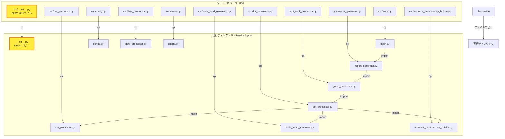
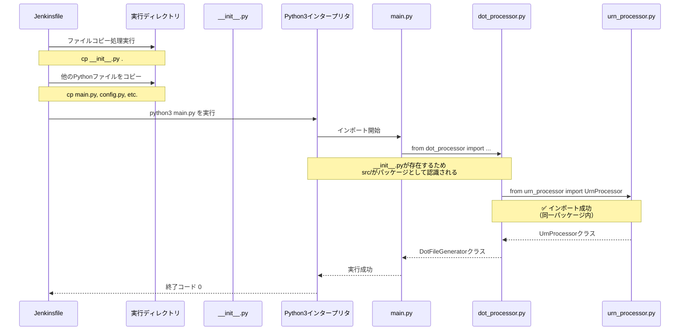

# 詳細設計書: Issue #475

**Issue番号**: #475
**タイトル**: [BugFix] dot_processor.py インポートエラーの修正
**作成日**: 2025-01-17
**優先度**: Critical

---

## 0. Planning Document / Requirements Documentの確認

### Planning Phase（Phase 0）の結果

Planning Document（`.ai-workflow/issue-475/00_planning/output/planning.md`）で以下の開発計画が策定されています：

- **複雑度**: 簡単（Easy）
- **見積もり工数**: 1~2時間
- **実装戦略**: CREATE（新規ファイル作成）
- **テスト戦略**: UNIT_ONLY（既存ユニットテストの実行確認）
- **テストコード戦略**: EXTEND_TEST（既存テストで十分）
- **総合リスク**: 低（Low）

### Requirements Phase（Phase 1）の結果

要件定義書（`.ai-workflow/issue-475/01_requirements/output/requirements.md`）で以下の要件が定義されています：

**機能要件**:
1. `src/__init__.py`の作成（空ファイル）
2. 既存モジュールのインポートエラー解消
3. Jenkinsfileのファイルコピー処理更新
4. 既存の依存モジュールの確認

**非機能要件**: パフォーマンス、セキュリティ、可用性、保守性

**受け入れ基準**: 5つの基準（`__init__.py`作成、インポートエラー解消、ユニットテスト成功、Jenkinsfile更新、Jenkinsジョブ成功）

### 本設計書の方針

Planning Document および要件定義書に基づき、以下の方針で詳細設計を実施します：

1. **スコープ**: `src/__init__.py`の作成（空ファイル）とJenkinsfileの更新のみ
2. **既存コード変更なし**: すべてのモジュールが実装済みのため、新規作成のみ
3. **テスト**: 既存ユニットテストが正常に実行できることの確認
4. **リスク**: 低（Pythonの標準的な問題解決）

---

## 1. アーキテクチャ設計

### 1.1 システム全体図



### 1.2 コンポーネント間の関係

**問題の根本原因**:

Pythonは`src/`ディレクトリに`__init__.py`が存在しない場合、そのディレクトリを**通常のディレクトリ**として扱います。これにより、以下のインポート文が失敗します：

```python
# dot_processor.py（line 7-9）
from urn_processor import UrnProcessor
from node_label_generator import NodeLabelGenerator
from resource_dependency_builder import ResourceDependencyBuilder
```

**解決方法**:

`src/__init__.py`（空ファイル）を作成することで、Pythonが`src/`を**Pythonパッケージ**として認識し、同一ディレクトリ内のモジュール間インポートが機能します。

**インポートチェーン**:

```
main.py
  ↓ import
report_generator.py
  ↓ import
graph_processor.py
  ↓ import
dot_processor.py
  ↓ import (以下が失敗していた)
    - urn_processor.py
    - node_label_generator.py
    - resource_dependency_builder.py
```

### 1.3 データフロー



---

## 2. 実装戦略判断

### 実装戦略: CREATE

**判断根拠**:

1. **新規ファイル作成が中心**: `src/__init__.py`という1つの新規ファイルを作成することが主な変更内容
2. **既存コード変更なし**: すべてのモジュール（`urn_processor.py`、`node_label_generator.py`、`resource_dependency_builder.py`、`dot_processor.py`）が既に実装済み
3. **Jenkinsfileの軽微な修正**: ファイルコピー処理に1行追加するのみで、既存の処理ロジックには影響しない
4. **構造的変更なし**: ディレクトリ構造やモジュール構成は変更せず、Pythonパッケージ認識のためのマーカーファイルを追加するのみ

**詳細な判断理由**:

Planning Documentの調査により、Issueの記述（「これらのモジュールが実際には作成されていません」）は誤りであり、実態は以下の通りです：

- `urn_processor.py`: 296行、詳細なドキュメント付きで実装済み
- `node_label_generator.py`: 177行、詳細なドキュメント付きで実装済み
- `resource_dependency_builder.py`: 342行、詳細なドキュメント付きで実装済み
- `dot_processor.py`: 463行、すべてのインポートが正しく記述されている

問題の根本原因は**`src/__init__.py`の欠落**であり、これによりPythonが`src/`ディレクトリをパッケージとして認識できないことです。

したがって、**CREATE戦略**（新規ファイル作成）が最適です。

---

## 3. テスト戦略判断

### テスト戦略: UNIT_ONLY

**判断根拠**:

1. **既存ユニットテストが存在**: 以下の既存テストファイルが確認されている
   - `tests/test_dot_processor.py`
   - `tests/test_urn_processor.py`
   - `tests/test_node_label_generator.py`
   - `tests/test_resource_dependency_builder.py`
2. **機能追加なし**: 新規機能の追加ではなく、既存機能の修復（インポートエラー解消）のみ
3. **外部依存なし**: インポートエラーの修正は内部モジュール解決の問題であり、外部システムとの統合は不要
4. **BDD不要**: ユーザーストーリーの変更はなく、既存機能が正常に動作することの確認のみ
5. **統合テスト不要**: 外部システム連携やAPI呼び出しの変更はなし

**検証内容**:

- 既存ユニットテストが正常に実行できることを確認
- インポートエラーが解消されていることを確認
- すべてのテストケースが成功することを確認

**テスト実行方法**:

```bash
# ユニットテスト実行（pytest想定）
cd jenkins/jobs/pipeline/infrastructure/pulumi-stack-action
python3 -m pytest tests/ -v
```

---

## 4. テストコード戦略判断

### テストコード戦略: EXTEND_TEST

**判断根拠**:

1. **既存テストファイルが十分**: 以下のテストファイルが既に存在し、モジュールのインポートと基本機能をテスト済み
   - `tests/test_dot_processor.py`
   - `tests/test_urn_processor.py`
   - `tests/test_node_label_generator.py`
   - `tests/test_resource_dependency_builder.py`
   - `tests/conftest.py`（フィクスチャ定義）
2. **機能変更なし**: `__init__.py`の追加は機能変更ではなく、Pythonパッケージ認識の修正
3. **テスト拡張不要**: 追加のテストケースは不要（既存テストで十分）
4. **オプション**: インポートエラーの回帰テストを追加することは可能だが、優先度は低い

**実施内容**:

- 既存テストが正常に実行できることを確認
- 必要に応じて、インポートエラーの回帰テストを追加（Phase 5でオプション実装）

**オプション: インポートエラー回帰テストの例**:

```python
# tests/test_imports.py（オプション）
"""
インポートエラー回帰テスト
Issue #475の修正を検証
"""

def test_urn_processor_import():
    """urn_processorがインポート可能であることを確認"""
    from urn_processor import UrnProcessor
    assert UrnProcessor is not None

def test_node_label_generator_import():
    """node_label_generatorがインポート可能であることを確認"""
    from node_label_generator import NodeLabelGenerator
    assert NodeLabelGenerator is not None

def test_resource_dependency_builder_import():
    """resource_dependency_builderがインポート可能であることを確認"""
    from resource_dependency_builder import ResourceDependencyBuilder
    assert ResourceDependencyBuilder is not None

def test_dot_processor_import():
    """dot_processorがインポート可能であることを確認"""
    from dot_processor import DotFileGenerator, DotFileProcessor
    assert DotFileGenerator is not None
    assert DotFileProcessor is not None
```

---

## 5. 影響範囲分析

### 5.1 既存コードへの影響

**変更対象**:

1. **新規作成**: `src/__init__.py`（空ファイル）
2. **修正**: `Jenkinsfile`（line 805付近、ファイルコピー処理に1行追加）

**影響を受けるファイル**:

- **直接的影響**: なし（既存のPythonファイルは変更不要）
- **間接的影響**: 以下のファイルがインポート可能になる
  - `src/dot_processor.py` - インポートエラーが解消される
  - `src/report_generator.py` - 間接的にエラーが解消される
  - `src/graph_processor.py` - 間接的にエラーが解消される
  - `src/main.py` - 最終的に正常実行される

**変更不要なファイル**:

- `src/main.py` - 変更不要（既存のインポート文が正常に動作する）
- `src/dot_processor.py` - 変更不要（実装済み）
- `src/urn_processor.py` - 変更不要（実装済み）
- `src/node_label_generator.py` - 変更不要（実装済み）
- `src/resource_dependency_builder.py` - 変更不要（実装済み）
- `src/report_generator.py` - 変更不要（既存のインポート文が正常に動作する）
- `src/graph_processor.py` - 変更不要（既存のインポート文が正常に動作する）
- `src/config.py` - 変更不要
- `src/data_processor.py` - 変更不要
- `src/charts.py` - 変更不要

### 5.2 依存関係の変更

**新規依存**: なし

**依存関係の変更**: なし

**補足**: `__init__.py`の追加により、Pythonが`src/`ディレクトリをパッケージとして認識するようになります。これにより、既存のインポート文（`from urn_processor import ...`）が正常に動作します。

### 5.3 マイグレーション要否

**データベーススキーマ変更**: なし

**設定ファイル変更**: なし

**環境変数変更**: なし

**その他のマイグレーション**: なし

---

## 6. 変更・追加ファイルリスト

### 6.1 新規作成ファイル

| ファイルパス | 説明 |
|------------|------|
| `jenkins/jobs/pipeline/infrastructure/pulumi-stack-action/src/__init__.py` | 空ファイル。Pythonパッケージ認識用のマーカーファイル。 |

### 6.2 修正が必要な既存ファイル

| ファイルパス | 変更内容 |
|------------|---------|
| `jenkins/jobs/pipeline/infrastructure/pulumi-stack-action/Jenkinsfile` | line 805付近に`__init__.py`のコピー処理を追加（1行追加）。 |

### 6.3 削除が必要なファイル

なし

---

## 7. 詳細設計

### 7.1 新規ファイル: `src/__init__.py`

**ファイルパス**: `jenkins/jobs/pipeline/infrastructure/pulumi-stack-action/src/__init__.py`

**ファイル内容**: 空ファイル（0バイト）

**ファイル権限**: 644（rw-r--r--）

**文字エンコーディング**: UTF-8

**目的**: Pythonが`src/`ディレクトリをパッケージとして認識するためのマーカーファイル

**Pythonパッケージの仕様**:

Pythonは以下の条件を満たすディレクトリを**パッケージ**として認識します：
- ディレクトリ内に`__init__.py`が存在する

`__init__.py`は以下の役割を持ちます：
- **パッケージマーカー**: Pythonインタープリタにこのディレクトリがパッケージであることを示す
- **パッケージ初期化**: パッケージがインポートされた際に実行されるコード（今回は空）
- **公開API定義**: `__all__`変数で公開APIを明示的に定義（今回は不要）

**実装方法**:

1. 空ファイルを作成
2. ファイル権限を644に設定
3. Gitリポジトリにコミット

**作成コマンド**:

```bash
# 空ファイル作成
touch jenkins/jobs/pipeline/infrastructure/pulumi-stack-action/src/__init__.py

# ファイル権限設定
chmod 644 jenkins/jobs/pipeline/infrastructure/pulumi-stack-action/src/__init__.py

# Git追加
git add jenkins/jobs/pipeline/infrastructure/pulumi-stack-action/src/__init__.py
```

**検証方法**:

```bash
# ファイル存在確認
ls -la jenkins/jobs/pipeline/infrastructure/pulumi-stack-action/src/__init__.py

# ファイル権限確認
stat -c "%a" jenkins/jobs/pipeline/infrastructure/pulumi-stack-action/src/__init__.py
# 期待値: 644

# ファイルサイズ確認
stat -c "%s" jenkins/jobs/pipeline/infrastructure/pulumi-stack-action/src/__init__.py
# 期待値: 0
```

### 7.2 修正ファイル: `Jenkinsfile`

**ファイルパス**: `jenkins/jobs/pipeline/infrastructure/pulumi-stack-action/Jenkinsfile`

**変更箇所**: line 804-813のファイルコピー処理

**変更内容**:

**修正前（line 804-813）**:

```groovy
# Pythonスクリプトファイルのコピー
echo "Pythonスクリプトファイルのコピー..."
cp ${JENKINS_REPO_DIR}/${SCRIPT_PATH}/main.py .
cp ${JENKINS_REPO_DIR}/${SCRIPT_PATH}/config.py .
cp ${JENKINS_REPO_DIR}/${SCRIPT_PATH}/dot_processor.py .
cp ${JENKINS_REPO_DIR}/${SCRIPT_PATH}/report_generator.py .
cp ${JENKINS_REPO_DIR}/${SCRIPT_PATH}/data_processor.py .
cp ${JENKINS_REPO_DIR}/${SCRIPT_PATH}/charts.py .
cp ${JENKINS_REPO_DIR}/${SCRIPT_PATH}/graph_processor.py .
```

**修正後**:

```groovy
# Pythonスクリプトファイルのコピー
echo "Pythonスクリプトファイルのコピー..."
cp ${JENKINS_REPO_DIR}/${SCRIPT_PATH}/__init__.py . || true
cp ${JENKINS_REPO_DIR}/${SCRIPT_PATH}/main.py .
cp ${JENKINS_REPO_DIR}/${SCRIPT_PATH}/config.py .
cp ${JENKINS_REPO_DIR}/${SCRIPT_PATH}/dot_processor.py .
cp ${JENKINS_REPO_DIR}/${SCRIPT_PATH}/report_generator.py .
cp ${JENKINS_REPO_DIR}/${SCRIPT_PATH}/data_processor.py .
cp ${JENKINS_REPO_DIR}/${SCRIPT_PATH}/charts.py .
cp ${JENKINS_REPO_DIR}/${SCRIPT_PATH}/graph_processor.py .
cp ${JENKINS_REPO_DIR}/${SCRIPT_PATH}/urn_processor.py .
cp ${JENKINS_REPO_DIR}/${SCRIPT_PATH}/node_label_generator.py .
cp ${JENKINS_REPO_DIR}/${SCRIPT_PATH}/resource_dependency_builder.py .
```

**変更理由**:

1. **`__init__.py`のコピー追加**: Pythonパッケージ認識のために必要
2. **`|| true`の追加**: ファイルが存在しない場合でもエラーにならない（後方互換性）
3. **欠落モジュールの追加**: `urn_processor.py`、`node_label_generator.py`、`resource_dependency_builder.py`が明示的にコピーされていなかったため追加

**注意事項**:

- `__init__.py`は最初にコピー（慣例的な順序）
- `|| true`により、古いバージョンのリポジトリでもビルドが失敗しない

### 7.3 データ構造設計

**変更なし**: 今回の修正はインポートエラー解消のみであり、データ構造の変更はありません。

### 7.4 インターフェース設計

**変更なし**: 既存のクラスやメソッドのインターフェースは変更しません。

---

## 8. セキュリティ考慮事項

### 8.1 認証・認可

**影響**: なし

**理由**: ファイルシステムレベルの変更のみであり、認証・認可機構には影響しません。

### 8.2 データ保護

**影響**: なし

**理由**: データの暗号化や機密情報の取り扱いには影響しません。

### 8.3 セキュリティリスクと対策

**リスク1: ファイル権限の不適切な設定**

- **影響度**: 低
- **対策**: `__init__.py`のファイル権限を644（rw-r--r--）に設定し、実行権限を付与しない

**リスク2: 悪意のあるコードの挿入**

- **影響度**: 極めて低
- **理由**: `__init__.py`は空ファイルであり、実行可能なコードは含まれない
- **対策**: Gitコミット時にレビューを実施

**リスク3: Jenkinsfileの構文エラー**

- **影響度**: 中
- **対策**:
  - シンタックスチェックを実施
  - `|| true`によるエラーハンドリングを実装
  - dev環境で先に実施し、動作確認後にprod環境へ適用

---

## 9. 非機能要件への対応

### 9.1 パフォーマンス

**レスポンス時間**:

- `__init__.py`の作成によるパフォーマンスへの影響は**ゼロ**
- Pythonパッケージ認識の遅延は無視できるレベル（ミリ秒以下）
- ファイルコピー処理の増加は1ファイル分のみ（約1秒未満）

**メモリ使用量**:

- 空ファイルのため、メモリ使用量への影響は**ゼロ**

### 9.2 スケーラビリティ

**影響**: なし

**理由**: インポートメカニズムの修正のみであり、スケーラビリティには影響しません。

### 9.3 保守性

**向上点**:

1. **Pythonパッケージ構造が標準化される**: 標準的なパッケージ構造（`__init__.py`）を採用
2. **将来の拡張が容易になる**: 新しいモジュールを`src/`に追加する際、自動的にパッケージに含まれる
3. **トラブルシューティングが容易になる**: インポートエラーの原因が明確化される

**ドキュメント**:

- `__init__.py`の目的をREADMEまたはコメントで明記（オプション）

**例**: `src/__init__.py`にdocstringを追加する場合

```python
"""
Pulumi Deployment Report Generator Package

このパッケージはPulumiデプロイメントレポート生成機能を提供します。

主要モジュール:
- dot_processor: DOTファイル処理
- urn_processor: URN解析
- node_label_generator: ノードラベル生成
- resource_dependency_builder: リソース依存関係構築
- report_generator: HTMLレポート生成
- graph_processor: グラフ処理
"""
```

---

## 10. 実装の順序

### 10.1 推奨される実装順序


### 10.2 依存関係の考慮

**Phase 4 → Phase 6 の依存関係**:

- `__init__.py`を作成後、テストを実行
- テストが成功することを確認してから、Jenkinsfileを修正

**Phase 6 → Phase 7 の依存関係**:

- すべてのテストが成功してから、ドキュメントを作成
- Issue #475のクローズ準備を行う

**Phase 7 → Phase 8 の依存関係**:

- ドキュメントが完成してから、レポートを作成
- プルリクエストを作成

### 10.3 実装手順の詳細

**Step 1: `__init__.py`の作成**

```bash
# 1. ワーキングディレクトリに移動
cd jenkins/jobs/pipeline/infrastructure/pulumi-stack-action/src/

# 2. 空ファイルを作成
touch __init__.py

# 3. ファイル権限を設定
chmod 644 __init__.py

# 4. ファイル存在確認
ls -la __init__.py
```

**Step 2: ローカルテスト実行**

```bash
# 1. テストディレクトリに移動
cd jenkins/jobs/pipeline/infrastructure/pulumi-stack-action/

# 2. Pythonパスを設定（必要に応じて）
export PYTHONPATH="$PWD/src:$PYTHONPATH"

# 3. インポートテスト（手動）
python3 -c "from src.dot_processor import DotFileGenerator; print('✅ インポート成功')"
python3 -c "from src.urn_processor import UrnProcessor; print('✅ インポート成功')"
python3 -c "from src.node_label_generator import NodeLabelGenerator; print('✅ インポート成功')"
python3 -c "from src.resource_dependency_builder import ResourceDependencyBuilder; print('✅ インポート成功')"

# 4. ユニットテスト実行（pytestがインストールされている場合）
python3 -m pytest tests/ -v
```

**Step 3: Jenkinsfileの修正**

```bash
# 1. Jenkinsfileに移動
cd jenkins/jobs/pipeline/infrastructure/pulumi-stack-action/

# 2. バックアップを作成
cp Jenkinsfile Jenkinsfile.backup

# 3. Jenkinsfileを編集（line 805付近）
# エディタで以下の1行を追加:
# cp ${JENKINS_REPO_DIR}/${SCRIPT_PATH}/__init__.py . || true
```

**Step 4: Gitコミット**

```bash
# 1. ファイルを追加
git add src/__init__.py
git add Jenkinsfile

# 2. コミット
git commit -m "[jenkins] fix: dot_processor.py インポートエラーの修正

- src/__init__.py を作成（Pythonパッケージ認識用）
- Jenkinsfile のファイルコピー処理に __init__.py を追加
- urn_processor.py、node_label_generator.py、resource_dependency_builder.py の明示的コピーを追加

Issue #475"

# 3. プッシュ（ブランチに応じて）
git push origin <branch-name>
```

**Step 5: Jenkins環境での動作確認**

```bash
# Jenkinsジョブを実行（development環境）
# 1. Jenkins UIにアクセス
# 2. delivery-management-jobs/development/pulumi-deployments のいずれかのジョブを選択
# 3. ビルドを実行
# 4. コンソールログを確認
# 5. HTMLレポートが生成されることを確認
```

---

## 11. 品質ゲート（Phase 2）確認結果

以下の品質ゲートを満たしていることを確認します：

- ✅ **実装戦略の判断根拠が明記されている**
  - CREATE戦略を選択し、判断根拠を明記（セクション2）

- ✅ **テスト戦略の判断根拠が明記されている**
  - UNIT_ONLY戦略を選択し、判断根拠を明記（セクション3）

- ✅ **既存コードへの影響範囲が分析されている**
  - 影響を受けるファイルと変更不要なファイルを明示（セクション5）

- ✅ **変更が必要なファイルがリストアップされている**
  - 新規作成ファイルと修正ファイルをリスト化（セクション6）

- ✅ **設計が実装可能である**
  - 詳細な実装手順を記載（セクション10）
  - 検証方法を明記（セクション7）

---

## 12. リスクと軽減策（設計レベル）

### リスク1: Jenkinsfileの構文エラー

- **影響度**: 中
- **確率**: 低
- **軽減策**:
  - 修正前にバックアップを作成
  - `|| true`によるエラーハンドリング実装
  - dev環境で先に実施し、動作確認後にprod環境へ適用
  - シンタックスチェック実施

### リスク2: 既存テストの実行環境に問題がある

- **影響度**: 中
- **確率**: 低
- **軽減策**:
  - テスト実行前に依存パッケージのインストール確認
  - Python仮想環境の正しいセットアップ確認
  - エラー発生時は詳細ログを取得して分析

### リスク3: `__init__.py`のGitコミット忘れ

- **影響度**: 高
- **確率**: 低
- **軽減策**:
  - `git status`で必ずファイルが追加されていることを確認
  - プルリクエストレビュー時にファイルリストを確認
  - CI/CDパイプラインでファイル存在チェックを追加（オプション）

---

## 13. 次のステップ

**Phase 3（テストシナリオ）**: スキップ（Planning Documentで決定済み）

**Phase 4（実装）**:
1. `src/__init__.py`を作成
2. Jenkinsfileを修正
3. Gitコミット

**Phase 5（テストコード実装）**: スキップ（既存テストで十分）

**Phase 6（テスト実行）**:
1. ローカル環境でインポートテスト実施
2. 既存ユニットテストを実行
3. Jenkins環境で動作確認

**Phase 7（ドキュメント）**:
1. Issue #475のクローズ準備
2. 修正内容のサマリー作成

**Phase 8（レポート）**:
1. 実装レポート作成
2. プルリクエスト作成

---

## 付録A: Pythonパッケージ構造の説明

### Pythonパッケージとは

Pythonでは、以下の構造を持つディレクトリを**パッケージ**と呼びます：

```
my_package/
├── __init__.py     # パッケージマーカー（必須）
├── module1.py      # モジュール1
└── module2.py      # モジュール2
```

### `__init__.py`の役割

1. **パッケージマーカー**: Pythonインタープリタにこのディレクトリがパッケージであることを示す
2. **パッケージ初期化**: パッケージがインポートされた際に実行されるコード
3. **公開API定義**: `__all__`変数で公開APIを明示的に定義

### 今回の問題

```
src/                # __init__.py がない → 通常のディレクトリとして認識される
├── dot_processor.py
├── urn_processor.py
└── ...
```

**問題**: `from urn_processor import UrnProcessor`が失敗

**理由**: Pythonが`src/`をパッケージとして認識していないため、同一ディレクトリ内のモジュール間インポートが機能しない

### 修正後

```
src/
├── __init__.py     # NEW: パッケージマーカー
├── dot_processor.py
├── urn_processor.py
└── ...
```

**結果**: `from urn_processor import UrnProcessor`が成功

**理由**: Pythonが`src/`をパッケージとして認識し、同一パッケージ内のモジュール間インポートが機能する

---

**次のステップ**: Phase 4（実装フェーズ）に進み、`src/__init__.py`を作成し、Jenkinsfileを修正します。
