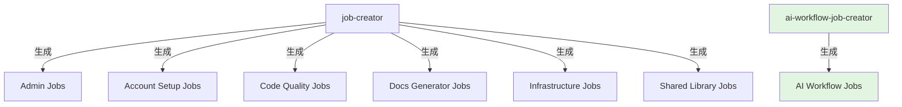
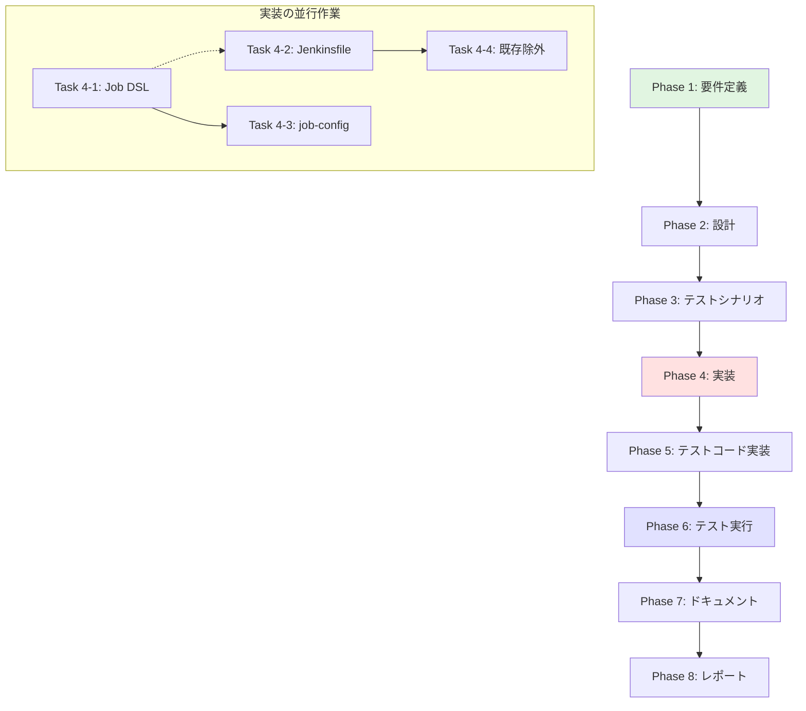

# プロジェクト計画書: AI Workflow用シードジョブ分離

**Issue**: #477
**タイトル**: [Feature] AI Workflow用のシードジョブを分離
**作成日**: 2025-01-17
**複雑度**: 中程度

---

## 1. Issue分析

### 複雑度判定: 中程度

**判定根拠**:
- 複数ファイルの変更が必要（Job DSLファイル5個、設定ファイル2個、シードジョブ関連3個以上）
- 既存システムへの影響が限定的（AI Workflowジョブのみ）
- 新規シードジョブの作成と既存シードジョブからの分離という明確な作業範囲
- アーキテクチャの大幅な変更はなく、既存パターンの複製と調整

### 見積もり工数: 10〜14時間

**内訳**:
- Phase 1 (要件定義): 2時間
- Phase 2 (設計): 2〜3時間
- Phase 3 (テストシナリオ): 1〜2時間
- Phase 4 (実装): 3〜4時間
- Phase 5 (テストコード実装): 0時間（Job DSLテストは実装しない）
- Phase 6 (テスト実行): 1〜2時間
- Phase 7 (ドキュメント): 1時間

### リスク評価: 低

**理由**:
- AI Workflowは独立したシステムであり、他のジョブへの影響が極めて限定的
- 既存のシードジョブ（job-creator）がテンプレートとして存在
- Job DSLの構文とパターンは確立されており、新規要素は少ない
- 動作確認が容易（シードジョブ実行 → ジョブ生成確認）

---

## 2. 実装戦略判断

### 実装戦略: CREATE + EXTEND

**判断根拠**:

**CREATE部分（60%）**:
- 新規シードジョブ`Admin_Jobs/ai-workflow-job-creator`の作成
  - 専用のJenkinsfile
  - 専用のDSLローダースクリプト
- AI Workflow専用の設定ファイル
  - `ai-workflow-job-config.yaml`（または既存job-config.yamlに統合）
  - `ai-workflow-folder-config.yaml`（フォルダ定義）

**EXTEND部分（40%）**:
- 既存`job-config.yaml`の修正
  - 新シードジョブの定義を追加
- 既存`folders.groovy`の修正（AI Workflowフォルダ定義の移動は不要、folder-config.yamlで管理）
- 既存`job-creator`からAI Workflow関連の読み込みを除外

**REFACTORは最小限**:
- 既存のシードジョブ構造はそのまま維持
- AI Workflow関連のみを分離・移動

### テスト戦略: INTEGRATION_ONLY

**判断根拠**:

**INTEGRATION_ONLYを選択した理由**:
- Job DSLは宣言的な記述であり、ユニットテストの価値が低い
- 実際の動作確認（シードジョブ実行 → ジョブ生成）が最も重要
- Jenkinsとの統合テストで以下を検証:
  - シードジョブが正常に実行される
  - AI Workflowジョブが正しく生成される
  - フォルダ構造が正しく作成される
  - 既存ジョブに影響がない

**UNIT_ONLYを選択しない理由**:
- Job DSLのユニットテストは複雑で、実装コストが高い
- Jenkins Test Harnessのセットアップが必要
- 実際の動作確認（統合テスト）のほうが信頼性が高い

**BDDテストを選択しない理由**:
- エンドユーザー向けのストーリーテストではない
- 内部的なシードジョブの分離であり、ユーザー視点のシナリオは不要

### テストコード戦略: CREATE_TEST

**判断根拠**:

**CREATE_TESTを選択した理由**:
- 新規シードジョブのインテグレーションテストを作成
- テストスクリプトは以下を検証:
  - シードジョブ実行の成功
  - 生成されたジョブの数と名前の確認
  - フォルダ構造の確認
  - パラメータの正しさの確認

**EXTEND_TESTを選択しない理由**:
- 既存のjob-creatorテストがあったとしても、AI Workflow専用テストは独立して作成すべき

**BOTH_TESTを選択しない理由**:
- 既存シードジョブのテストは変更不要（AI Workflow除外のみ）
- 新規シードジョブのテストのみで十分

---

## 3. 影響範囲分析

### 既存コードへの影響

**変更が必要なファイル**:

1. **job-config.yaml**
   - 新規シードジョブ`ai_workflow_job_creator`の定義を追加
   - AI Workflow関連ジョブの`skipJenkinsfileValidation: true`設定は維持

2. **folder-config.yaml**
   - AI Workflowフォルダ定義は既に存在（変更不要）

3. **既存のjob-creator Jenkinsfile**
   - AI Workflow関連DSLファイルの読み込み除外ロジックを追加

4. **AI Workflow関連DSLファイル（5個）**
   - 読み込み元の変更（job-creator → ai-workflow-job-creator）
   - ただし、DSLファイル自体の内容は変更不要

**新規作成が必要なファイル**:

1. **jenkins/jobs/pipeline/_seed/ai-workflow-job-creator/Jenkinsfile**
   - AI Workflow専用シードジョブパイプライン

2. **jenkins/jobs/pipeline/_seed/ai-workflow-job-creator/ai-workflow-job-config.yaml**（オプション）
   - AI Workflowジョブ定義（既存job-config.yamlから分離するか検討）

3. **jenkins/jobs/dsl/admin/admin_ai_workflow_job_creator.groovy**
   - 新規シードジョブのJob DSL定義

### 依存関係の変更

**新規依存**:
- なし（既存の依存関係を維持）

**既存依存の変更**:
- AI WorkflowジョブがAI Workflow専用シードジョブに依存
- job-creatorからAI Workflowジョブへの依存を削除

**依存関係図**:

### マイグレーション要否

**不要**:
- データベーススキーマ変更なし
- 設定ファイルの後方互換性維持
- 既存ジョブは自動的に新シードジョブで再生成される

---

## 4. タスク分割

### Phase 1: 要件定義 (見積もり: 2h)

- [ ] Task 1-1: 新規シードジョブの機能要件定義 (1h)
  - AI Workflow専用シードジョブの責務を明確化
  - 生成対象ジョブの一覧化（5つのDSLファイル）
  - フォルダ構造の確認（AI_Workflow配下10フォルダ）
  - 実行トリガー条件の定義

- [ ] Task 1-2: 分離対象の識別と受け入れ基準の定義 (1h)
  - job-creatorから除外すべきDSLファイルのリスト化
  - 新シードジョブが生成すべきジョブのリスト化
  - テスト検証項目の洗い出し
  - 受け入れ基準（Done Criteria）の明確化

### Phase 2: 設計 (見積もり: 2〜3h)

- [x] Task 2-1: ディレクトリ構造設計 (0.5h)
  - `jenkins/jobs/pipeline/_seed/ai-workflow-job-creator/`の構成
  - 設定ファイルの配置（Jenkinsfile、job-config、folder-config）

- [x] Task 2-2: 新規シードジョブのJob DSL設計 (1h)
  - `admin_ai_workflow_job_creator.groovy`の設計
  - パラメータ定義（実行環境、ブランチ等）
  - トリガー条件の設計

- [x] Task 2-3: 新規Jenkinsfileのパイプライン設計 (1〜1.5h)
  - 既存job-creatorのJenkinsfileをベースに設計
  - AI Workflow専用のDSL読み込みロジック
  - 設定ファイル読み込みロジック
  - エラーハンドリング

- [x] Task 2-4: 既存job-creatorからの除外ロジック設計 (0.5h)
  - AI Workflow関連DSLファイルの除外方法
  - 条件分岐ロジックの設計

### Phase 3: テストシナリオ (見積もり: 1〜2h)

- [x] Task 3-1: インテグレーションテストシナリオ作成 (0.5〜1h)
  - シードジョブ実行の成功確認
  - 生成されたジョブ数の確認（5ジョブ × 10フォルダ = 50ジョブ）
  - フォルダ構造の確認（AI_Workflow配下10フォルダ）
  - パラメータの正しさの確認

- [x] Task 3-2: 既存システムへの影響確認シナリオ (0.5〜1h)
  - 既存job-creatorの実行確認（AI Workflowジョブが生成されないこと）
  - 他のジョブカテゴリ（Admin、Code Quality等）への影響なし確認
  - 両シードジョブの並行実行確認

### Phase 4: 実装 (見積もり: 3〜4h)

- [x] Task 4-1: 新規シードジョブのJob DSL作成 (0.5h)
  - `jenkins/jobs/dsl/admin/admin_ai_workflow_job_creator.groovy`
  - pipelineJobブロック
  - パラメータ定義
  - リポジトリ・Jenkinsfile指定

- [x] Task 4-2: 新規シードジョブのJenkinsfile作成 (1.5〜2h)
  - `jenkins/jobs/pipeline/_seed/ai-workflow-job-creator/Jenkinsfile`
  - 設定ファイル読み込み（job-config.yaml、folder-config.yaml）
  - folders.groovyの実行（フォルダ生成）
  - AI Workflow専用DSLファイルの実行（5ファイル）
  - エラーハンドリングとログ出力

- [x] Task 4-3: job-config.yamlへの新シードジョブ定義追加 (0.5h)
  - `ai_workflow_job_creator`エントリの追加
  - displayName、dslfile、jenkinsfileの設定

- [x] Task 4-4: 既存job-creatorからのAI Workflow除外 (0.5〜1h)
  - Jenkinsfileに除外ロジックを追加
  - AI Workflow関連DSLファイルをスキップ
  - ログ出力の追加（"Skipping AI Workflow DSL files..."）

### Phase 5: テストコード実装 (見積もり: 0h)

- [x] Task 5-1: テストは手動統合テストのみ実施
  - Job DSLの自動テストは実装しない
  - Phase 6で手動統合テストを実施

### Phase 6: テスト実行 (見積もり: 1〜2h)

- [x] Task 6-1: 新規シードジョブの動作確認 (0.5〜1h)
  - Admin_Jobs/ai-workflow-job-creator を実行
  - AI Workflowジョブが生成されることを確認
  - フォルダ構造（AI_Workflow/develop, stable-1〜9）の確認
  - 生成されたジョブのパラメータ確認

- [x] Task 6-2: 既存job-creatorの影響確認 (0.5〜1h)
  - Admin_Jobs/job-creator を実行
  - AI Workflowジョブが生成されないことを確認
  - 他のジョブカテゴリが正常に生成されることを確認
  - エラーログの確認

### Phase 7: ドキュメント (見積もり: 1h)

- [ ] Task 7-1: jenkins/CONTRIBUTION.md更新 (0.5h)
  - シードジョブパターンセクションに新シードジョブを追加
  - AI Workflow専用シードジョブの使用方法
  - 既存job-creatorとの使い分け

- [ ] Task 7-2: jenkins/README.md更新 (0.5h)
  - AI Workflowセクションにシードジョブ情報を追加
  - シードジョブ実行手順の記載

### Phase 8: レポート (見積もり: 0.5h)

- [ ] Task 8-1: 実装完了レポート作成 (0.5h)
  - 変更内容のサマリ
  - テスト結果のまとめ
  - 既知の制限事項・今後の改善点

---

## 5. 依存関係

**クリティカルパス**:
Phase 1 → Phase 2 → Phase 3 → Phase 4 → Phase 6 → Phase 7 → Phase 8

**Phase 5（テストコード実装）はスキップ**: Job DSLの自動テストは実装せず、手動統合テストのみで検証

---

## 6. リスクと軽減策

### リスク1: 既存job-creatorからの除外ロジックが複雑化

- **影響度**: 中
- **確率**: 中
- **軽減策**:
  - シンプルなファイル名パターンマッチングで除外（`ai_workflow_*.groovy`）
  - 除外ロジックをコメント付きで明示的に記述
  - テスト時に既存ジョブへの影響を必ず確認

### リスク2: AI Workflowフォルダ定義の重複管理

- **影響度**: 低
- **確率**: 低
- **軽減策**:
  - folder-config.yamlは既存のまま使用（重複管理しない）
  - 両シードジョブがfolder-config.yamlを参照する設計
  - フォルダ定義の変更は1箇所のみで済む

### リスク3: シードジョブ実行順序による競合

- **影響度**: 低
- **確率**: 低
- **軽減策**:
  - 両シードジョブは独立して動作する設計
  - Job DSLのフォルダ作成は冪等性あり（既存フォルダは上書きされない）
  - disableConcurrentBuilds()で並行実行を制限

### リスク4: ドキュメント更新漏れ

- **影響度**: 低
- **確率**: 中
- **軽減策**:
  - Phase 7でドキュメント更新を必須タスク化
  - jenkins/CONTRIBUTION.mdとjenkins/README.mdの両方を更新
  - レビュー時にドキュメント確認を品質ゲートに含める

---

## 7. 品質ゲート

### Phase 1: 要件定義

- [ ] 新規シードジョブの機能要件が明確に記載されている
- [ ] 分離対象のDSLファイルがすべてリストアップされている
- [ ] 受け入れ基準が具体的かつ測定可能である
- [ ] AI Workflowフォルダ構造（10フォルダ）が確認されている

### Phase 2: 設計

- [x] 実装戦略の判断根拠が明記されている（CREATE + EXTEND）
- [x] テスト戦略の判断根拠が明記されている（INTEGRATION_ONLY）
- [x] ディレクトリ構造が既存パターンに準拠している
- [x] 新規Jenkinsfileの設計が既存job-creatorと整合している
- [x] 既存システムへの影響が最小化されている

### Phase 3: テストシナリオ

- [x] インテグレーションテストシナリオが具体的である
- [x] 検証項目がすべて網羅されている（ジョブ生成、フォルダ作成、パラメータ）
- [x] 既存システムへの影響確認シナリオが含まれている

### Phase 4: 実装

- [x] コーディング規約（jenkins/CONTRIBUTION.md）に準拠している
- [x] 新規Job DSLがpipelineJobパターンを使用している
- [x] Jenkinsfileにエラーハンドリングが含まれている
- [x] 既存job-creatorからの除外ロジックが明確である
- [x] job-config.yamlに新シードジョブが正しく定義されている

### Phase 6: テスト実行

- [x] 新規シードジョブがAI Workflowジョブを正しく生成する
- [x] AI Workflowフォルダ構造（10フォルダ）が正しく作成される
- [x] 既存job-creatorがAI Workflowジョブを生成しない
- [x] 既存ジョブカテゴリへの影響がない
- [x] エラーログが出力されない

### Phase 7: ドキュメント

- [ ] jenkins/CONTRIBUTION.mdにシードジョブ情報が追加されている
- [ ] jenkins/README.mdにAI Workflowシードジョブ情報が追加されている
- [ ] 使用方法が明確に記載されている

### Phase 8: レポート

- [ ] 実装内容のサマリが記載されている
- [ ] テスト結果が記載されている
- [ ] 既知の制限事項が記載されている（あれば）

---

## 8. 成功基準（プロジェクト全体）

このプロジェクトは、以下の条件をすべて満たした場合に成功とみなします：

### 機能要件

1. **新規シードジョブの動作**
   - [ ] Admin_Jobs/ai-workflow-job-creator が正常に実行される
   - [ ] AI Workflowジョブ（5種類）が各フォルダ（10個）に生成される
   - [ ] 生成されたジョブのパラメータが正しい

2. **既存システムへの影響なし**
   - [ ] Admin_Jobs/job-creator がAI Workflowジョブを生成しない
   - [ ] 既存ジョブカテゴリが正常に生成される
   - [ ] エラーログが出力されない

3. **保守性の向上**
   - [ ] AI Workflow関連の変更が独立して実施できる
   - [ ] シードジョブ実行時間が短縮される（AI Workflow分が分離）

### 非機能要件

1. **ドキュメント**
   - [ ] jenkins/CONTRIBUTION.md に新シードジョブ情報が追加
   - [ ] jenkins/README.md に使用方法が追加

2. **テスト**
   - [ ] インテグレーションテストシナリオが実施済み
   - [ ] すべてのテスト項目が合格

---

## 9. 次のステップ

Phase 1（要件定義）を開始し、以下を明確にします：

1. 新規シードジョブの詳細な機能要件
2. 分離対象のDSLファイルとフォルダの確認
3. 受け入れ基準の具体化

Phase 1完了後、Planning Phaseのレビューを実施し、品質ゲートを確認します。
