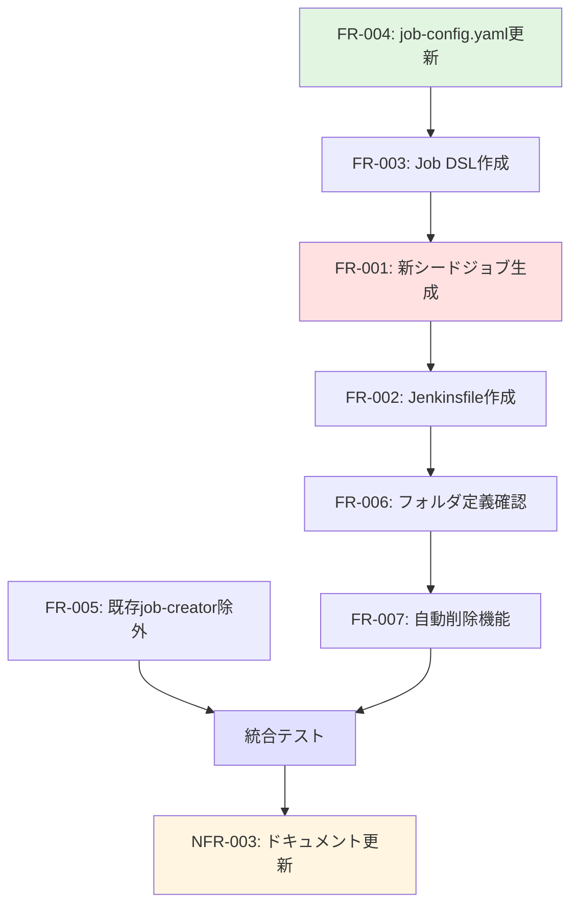

# 要件定義書: AI Workflow用シードジョブ分離

**Issue**: #477
**タイトル**: [Feature] AI Workflow用のシードジョブを分離
**作成日**: 2025-01-17
**バージョン**: 1.0
**Planning Document**: [planning.md](../../00_planning/output/planning.md)

---

## 0. Planning Documentの確認

### Planning Phase成果物のサマリー

本要件定義は、Planning Phaseで策定された以下の方針に基づいています：

#### 実装戦略
- **CREATE + EXTEND** (60% CREATE / 40% EXTEND)
  - 新規: AI Workflow専用シードジョブ、Jenkinsfile、DSLファイル
  - 拡張: 既存job-config.yaml、既存job-creatorからの除外ロジック

#### テスト戦略
- **INTEGRATION_ONLY**
  - Job DSLの自動テストは実装しない
  - 手動統合テスト（シードジョブ実行 → ジョブ生成確認）のみ実施
  - 理由: Job DSLは宣言的で、実際の動作確認（統合テスト）が最も信頼性が高い

#### リスク評価
- **リスクレベル: 低**
  - AI Workflowは独立システムで影響範囲が限定的
  - 既存のシードジョブ（job-creator）がテンプレートとして存在
  - 動作確認が容易

#### 見積もり工数
- **合計: 10〜14時間**
  - 要件定義: 2h
  - 設計: 2〜3h
  - テストシナリオ: 1〜2h
  - 実装: 3〜4h
  - テスト実行: 1〜2h
  - ドキュメント: 1h

---

## 1. 概要

### 1.1 背景

現在、全Jenkinsジョブの生成を担う単一のシードジョブ（`Admin_Jobs/job-creator`）が存在し、以下の問題が発生しています：

1. **実行時間の長期化**: AI Workflowジョブを含む全ジョブを一括生成するため、実行に時間がかかる
2. **責務の混在**: AI Workflow（頻繁に更新）と他のジョブ（安定）の管理が同一ジョブで実施
3. **開発サイクルの制約**: AI Workflowの変更時に他のジョブも含めた検証が必要
4. **保守性の低下**: AI Workflowの変更が他のジョブ管理ロジックに影響を与える可能性

### 1.2 目的

AI Workflow専用のシードジョブを分離することで、以下を実現します：

1. **実行時間の短縮**: AI Workflowジョブのみの更新時、専用シードジョブのみを実行（実行時間: 数分 → 数十秒）
2. **責務の分離**: AI Workflowジョブ管理を独立化し、保守性を向上
3. **開発サイクルの独立化**: AI Workflow開発チームが他のジョブに影響を与えずに変更可能
4. **トラブルシューティングの容易化**: AI Workflow関連の問題を専用シードジョブで切り分け可能

### 1.3 ビジネス価値

- **開発効率の向上**: AI Workflowの変更を迅速にJenkins環境に反映（フィードバックサイクル短縮）
- **コスト削減**: 実行時間短縮によるJenkinsエージェントのリソース使用量削減
- **リスク低減**: AI Workflow変更時の他ジョブへの影響リスクを排除

### 1.4 技術的価値

- **Single Responsibility Principle (SRP)の適用**: 各シードジョブが単一の責務を持つ
- **スケーラビリティ**: 将来的に他のジョブカテゴリも専用シードジョブに分離可能な設計パターンを確立
- **Infrastructure as Codeの強化**: ジョブ管理の自動化をさらに推進

---

## 2. 機能要件

### FR-001: 新規AI Workflow専用シードジョブの作成

**優先度**: 高

**説明**: AI Workflowジョブを生成する専用のシードジョブを新規作成する。

**詳細要件**:
- シードジョブ名: `Admin_Jobs/ai-workflow-job-creator`
- 配置フォルダ: `Admin_Jobs`（既存のjob-creatorと同じフォルダ）
- 実行方法: 手動実行（Build with Parameters）
- パラメータ: なし（設定ファイルから全情報を取得）

**受け入れ基準**:
- Given: job-config.yamlに新シードジョブ定義が存在
- When: Admin_Jobs/job-creatorを実行
- Then: Admin_Jobs/ai-workflow-job-creatorジョブが生成される

### FR-002: AI Workflow専用Jenkinsfileの作成

**優先度**: 高

**説明**: AI Workflowジョブを生成するパイプラインロジックを実装したJenkinsfileを作成する。

**詳細要件**:
- ファイルパス: `jenkins/jobs/pipeline/_seed/ai-workflow-job-creator/Jenkinsfile`
- 実行エージェント: `built-in`（masterノード）
- 処理フロー:
  1. 設定ファイル（job-config.yaml、folder-config.yaml）の読み込み
  2. 設定ファイルの検証（存在チェック、DSL/Jenkinsfileパスチェック）
  3. folders.groovyの実行（AI Workflowフォルダ生成）
  4. AI Workflow関連DSLファイル（5個）の実行
  5. 実行結果のサマリー表示

**受け入れ基準**:
- Given: ai-workflow-job-creatorジョブが存在
- When: ジョブを手動実行
- Then: エラーなく完了し、AI Workflowフォルダとジョブ（5種 × 10フォルダ = 50ジョブ）が生成される

### FR-003: AI Workflow専用Job DSLの作成

**優先度**: 高

**説明**: 新規シードジョブ自体を生成するJob DSLスクリプトを作成する。

**詳細要件**:
- ファイルパス: `jenkins/jobs/dsl/admin/admin_ai_workflow_job_creator.groovy`
- ジョブタイプ: `pipelineJob`
- 設定内容:
  - displayName: 'AI Workflow Job Creator'
  - description: AI Workflowジョブ専用のシードジョブ
  - Jenkinsfileパス: `jenkins/jobs/pipeline/_seed/ai-workflow-job-creator/Jenkinsfile`
  - リポジトリ: infrastructure-as-code（既存シードジョブと同じ）
  - ブランチ: `*/main`
  - クレデンシャル: `github-app-credentials`

**受け入れ基準**:
- Given: DSLスクリプトが存在
- When: job-creatorシードジョブを実行
- Then: ai-workflow-job-creatorジョブが正しく生成される

### FR-004: job-config.yamlへの新シードジョブ定義追加

**優先度**: 高

**説明**: 新規シードジョブの定義を既存のjob-config.yamlに追加する。

**詳細要件**:
- 追加セクション: `jenkins-jobs`配下に`ai_workflow_job_creator`エントリ
- 必須フィールド:
  - `name`: 'ai_workflow_job_creator'
  - `displayName`: 'AI Workflow Job Creator'
  - `dslfile`: jenkins/jobs/dsl/admin/admin_ai_workflow_job_creator.groovy
  - `jenkinsfile`: jenkins/jobs/pipeline/_seed/ai-workflow-job-creator/Jenkinsfile

**受け入れ基準**:
- Given: job-config.yamlに新定義が追加
- When: YAMLパーサーでファイルを読み込み
- Then: シンタックスエラーなく、新定義が認識される

### FR-005: 既存job-creatorからのAI Workflow除外

**優先度**: 高

**説明**: 既存のjob-creatorシードジョブからAI Workflow関連DSLファイルの読み込みを除外する。

**詳細要件**:
- 除外対象DSLファイル（5個）:
  1. `jenkins/jobs/dsl/ai-workflow/ai_workflow_all_phases_job.groovy`
  2. `jenkins/jobs/dsl/ai-workflow/ai_workflow_preset_job.groovy`
  3. `jenkins/jobs/dsl/ai-workflow/ai_workflow_single_phase_job.groovy`
  4. `jenkins/jobs/dsl/ai-workflow/ai_workflow_rollback_job.groovy`
  5. `jenkins/jobs/dsl/ai-workflow/ai_workflow_auto_issue_job.groovy`
- 除外方法: Jenkinsfileに除外ロジックを追加（ファイルパターンマッチング）
- ログ出力: 除外されたファイルをログに明示

**受け入れ基準**:
- Given: job-creatorにAI Workflow除外ロジックが実装
- When: job-creatorを実行
- Then: AI Workflowジョブが生成されず、除外ログが出力される

### FR-006: AI Workflowフォルダ定義の管理

**優先度**: 中

**説明**: AI Workflowフォルダ（親フォルダ + 10サブフォルダ）の定義を既存folder-config.yamlで管理する。

**詳細要件**:
- 対象フォルダ（11個）:
  - `AI_Workflow`（親フォルダ）
  - `AI_Workflow/develop`
  - `AI_Workflow/stable-1` 〜 `AI_Workflow/stable-9`
- 管理方法: 既存folder-config.yamlを使用（重複管理しない）
- 両シードジョブ（job-creator、ai-workflow-job-creator）がfolder-config.yamlを参照

**受け入れ基準**:
- Given: folder-config.yamlにAI Workflowフォルダ定義が存在
- When: ai-workflow-job-creatorを実行
- Then: AI_Workflowフォルダとサブフォルダ（10個）が生成される

### FR-007: 自動削除機能の維持

**優先度**: 中

**説明**: Job DSLから削除されたジョブを自動的に削除する既存機能を維持する。

**詳細要件**:
- ai-workflow-job-creatorでも以下の設定を適用:
  - `removedJobAction: 'DELETE'`
  - `removedViewAction: 'DELETE'`
  - `removedConfigFilesAction: 'DELETE'`
- 動作: AI Workflow関連DSLから削除されたジョブのみを削除（他のジョブには影響なし）

**受け入れ基準**:
- Given: AI Workflow関連DSLファイルからジョブ定義を削除
- When: ai-workflow-job-creatorを実行
- Then: 削除されたジョブのみがJenkinsから削除される

---

## 3. 非機能要件

### NFR-001: パフォーマンス要件

**シードジョブ実行時間**:
- 目標: AI Workflowジョブのみの更新時、60秒以内に完了
- 許容範囲: 90秒以内
- 測定条件: AI_Workflowフォルダ配下の50ジョブ（5種 × 10フォルダ）を生成

**既存job-creator実行時間**:
- 改善目標: AI Workflow除外により、実行時間を10〜15%短縮
- 測定方法: 分離前後の実行時間を比較

### NFR-002: 可用性要件

**シードジョブの独立性**:
- job-creatorとai-workflow-job-creatorは独立して動作
- 一方のシードジョブが失敗しても、他方に影響を与えない
- 両シードジョブの並行実行が可能（フォルダ生成の冪等性により）

**エラーハンドリング**:
- 設定ファイル読み込みエラー: エラーメッセージを明示し、ビルドを失敗させる
- DSL実行エラー: エラーの発生したDSLファイル名と行番号を出力
- リトライ機能: なし（手動再実行を想定）

### NFR-003: 保守性要件

**コーディング規約準拠**:
- jenkins/CONTRIBUTION.md に従う
- パラメータ定義: DSLファイルで実施（Jenkinsfileでは定義しない）
- 文字列処理: シングルクォート優先、環境変数経由でBash変数展開
- コメント: 日本語で処理の意図を明記

**ドキュメント整合性**:
- jenkins/README.md: AI Workflow専用シードジョブの使用方法を追加
- jenkins/CONTRIBUTION.md: シードジョブパターンセクションに新シードジョブを追加

### NFR-004: セキュリティ要件

**認証・認可**:
- シードジョブ実行権限: Adminロールのみ（既存job-creatorと同じ）
- クレデンシャル管理: `github-app-credentials`を使用（環境変数から取得）
- 機密情報: ハードコーディング禁止、SSM Parameter StoreまたはJenkinsクレデンシャルストアで管理

**監査ログ**:
- シードジョブ実行履歴をJenkinsビルド履歴で追跡可能
- 生成されたジョブの変更履歴をJob DSLプラグインで追跡可能

### NFR-005: 拡張性要件

**将来的なシードジョブ分離の準備**:
- 今回の実装パターンを他のジョブカテゴリにも適用可能な設計
- 設定ファイル（job-config.yaml、folder-config.yaml）の共通化を維持
- 除外ロジックの再利用性を考慮

**スケーラビリティ**:
- AI Workflowフォルダが10個 → 20個に増加しても対応可能
- 新規ジョブタイプ追加時、DSLファイル追加のみで対応可能

---

## 4. 制約事項

### 4.1 技術的制約

**Job DSLプラグインのバージョン**:
- 使用バージョン: Job DSL Plugin 1.87以上
- 制約: `removedJobAction: 'DELETE'`機能を使用するため、1.60以上が必須

**Jenkinsバージョン**:
- 使用バージョン: Jenkins 2.426.1以上
- 制約: Pipeline Job Plugin、Git Plugin、Credentials Pluginが必須

**既存ファイル構造の維持**:
- folder-config.yaml: 既存の構造を変更しない（AI Workflowフォルダ定義は既に存在）
- folders.groovy: 既存のロジックを変更しない（AI Workflowフォルダ生成ロジックは既存）

### 4.2 リソース制約

**時間制約**:
- 実装期間: 10〜14時間（Planning Documentの見積もりに基づく）
- テスト期間: 1〜2時間（手動統合テストのみ）

**人員制約**:
- 開発者: 1名
- レビュアー: 1名（コードレビュー時）

### 4.3 ポリシー制約

**コーディング規約**:
- jenkins/CONTRIBUTION.md の全規約を遵守
- パラメータ定義ルール: Jenkinsfileでのパラメータ定義は禁止
- コメント言語: 日本語

**コミットメッセージ規約**:
- フォーマット: `[jenkins] {action}: {詳細な説明}`
- 例: `[jenkins] add: AI Workflow専用シードジョブを追加`

**セキュリティポリシー**:
- クレデンシャルのハードコーディング禁止
- 機密情報のログ出力禁止
- IAMロール最小権限の原則

---

## 5. 前提条件

### 5.1 システム環境

**Jenkins環境**:
- Jenkins 2.426.1以上
- 必須プラグイン:
  - Job DSL Plugin 1.87以上
  - Pipeline Job Plugin
  - Git Plugin
  - GitHub Branch Source Plugin
  - Credentials Plugin

**実行エージェント**:
- シードジョブ: `built-in`（Jenkinsマスターノード）
- 理由: Job DSL実行にはmasterノードでの実行が必要

### 5.2 依存コンポーネント

**既存シードジョブ**:
- `Admin_Jobs/job-creator`: 新シードジョブを生成するための既存シードジョブ
- 動作状態: 正常に動作していること

**設定ファイル**:
- `jenkins/jobs/pipeline/_seed/job-creator/job-config.yaml`: 既存のジョブ定義
- `jenkins/jobs/pipeline/_seed/job-creator/folder-config.yaml`: 既存のフォルダ定義
- `jenkins/jobs/dsl/folders.groovy`: 既存のフォルダ生成ロジック

**AI Workflow関連ファイル**:
- AI Workflow関連DSLファイル（5個）: 既に存在し、動作確認済み
- AI Workflowフォルダ定義: folder-config.yamlに既に存在

### 5.3 外部システム連携

**GitHubリポジトリ**:
- リポジトリURL: `https://github.com/tielec/infrastructure-as-code`
- ブランチ: `main`
- アクセス方法: GitHub App認証（`github-app-credentials`）

**クレデンシャル**:
- Jenkins Credentials Store: `github-app-credentials`が既に登録済み
- 環境変数: `env.GITHUB_APP_CREDENTIALS_ID`で参照可能

---

## 6. 受け入れ基準

### AC-001: 新規シードジョブの正常動作

**Given**: job-config.yamlに新シードジョブ定義が追加され、関連ファイルがすべて作成されている
**When**: `Admin_Jobs/ai-workflow-job-creator`を手動実行
**Then**:
- ジョブが成功完了する（ビルド結果: SUCCESS）
- AI_Workflowフォルダ配下に以下が生成される:
  - フォルダ: develop、stable-1〜stable-9（10個）
  - ジョブ: all_phases、preset、single_phase、rollback、auto_issue（各フォルダに5個、合計50ジョブ）
- ビルドログに「✅ Job DSL execution completed!」が表示される

### AC-002: 既存job-creatorからのAI Workflow除外

**Given**: job-creatorにAI Workflow除外ロジックが実装されている
**When**: `Admin_Jobs/job-creator`を実行
**Then**:
- AI Workflowジョブが生成されない
- ビルドログに「Skipping AI Workflow DSL files...」が表示される
- 他のジョブカテゴリ（Admin、Code Quality、Docs Generator等）は正常に生成される

### AC-003: フォルダ構造の正しさ

**Given**: ai-workflow-job-creatorが実行済み
**When**: Jenkins UIでAI_Workflowフォルダを確認
**Then**:
- 親フォルダ: `AI_Workflow`が存在
- サブフォルダ: `develop`、`stable-1`〜`stable-9`（10個）が存在
- フォルダ表示名: folder-config.yamlの定義と一致
- フォルダ説明: folder-config.yamlの定義と一致

### AC-004: パラメータの正しさ

**Given**: ai-workflow-job-creatorが実行済み
**When**: 生成されたAI Workflowジョブ（例: `AI_Workflow/develop/all_phases`）のパラメータを確認
**Then**:
- パラメータがDSLファイルの定義と一致
- ジョブ実行時にパラメータ入力画面が表示される
- デフォルト値が正しく設定されている

### AC-005: 両シードジョブの並行実行

**Given**: job-creatorとai-workflow-job-creatorが両方存在
**When**: 両シードジョブを同時に手動実行
**Then**:
- 両ジョブがエラーなく完了する
- フォルダ生成で競合が発生しない（冪等性により）
- 各シードジョブが生成するジョブが正しく分離されている

### AC-006: 自動削除機能の動作

**Given**: AI Workflow関連DSLファイルから特定のジョブ定義を削除
**When**: ai-workflow-job-creatorを実行
**Then**:
- 削除されたジョブがJenkinsから削除される
- 他のAI Workflowジョブは影響を受けない
- 他のジョブカテゴリ（Admin、Code Quality等）は影響を受けない

### AC-007: ドキュメントの更新

**Given**: 実装が完了
**When**: jenkins/README.mdとjenkins/CONTRIBUTION.mdを確認
**Then**:
- README.md: AI Workflow専用シードジョブの使用方法が記載されている
- CONTRIBUTION.md: シードジョブパターンセクションに新シードジョブが追加されている
- 既存のシードジョブ（job-creator）との使い分けが明記されている

---

## 7. スコープ外

### 7.1 明確にスコープ外とする事項

**AI Workflow関連DSLファイルの変更**:
- 5個のDSLファイル（`ai_workflow_*.groovy`）の内容は変更しない
- ジョブの動作ロジックは変更しない
- パラメータ定義は変更しない

**AI Workflow関連Jenkinsfileの変更**:
- ai-workflow-agentリポジトリのJenkinsfileは変更しない
- ジョブの実行ロジックは変更しない

**既存job-creatorの大幅な変更**:
- AI Workflow除外ロジックの追加のみ実施
- 他のジョブ生成ロジックは変更しない
- パフォーマンスチューニングは実施しない

**自動テストの実装**:
- Job DSLのユニットテストは実装しない（Planning Documentの方針に従う）
- Jenkinsfileのユニットテストは実装しない
- 統合テストは手動実行のみ

**他のジョブカテゴリの分離**:
- Code Quality、Docs Generator等の他のカテゴリは分離しない
- 今回はAI Workflowのみを対象

### 7.2 将来的な拡張候補

**他のジョブカテゴリの専用シードジョブ化**:
- Code Quality専用シードジョブ
- Docs Generator専用シードジョブ
- Infrastructure Management専用シードジョブ

**シードジョブの自動実行化**:
- job-config.yaml変更検知による自動実行
- GitHub Webhook連携による自動実行

**シードジョブ実行結果の通知**:
- Slack通知
- メール通知

**パフォーマンス最適化**:
- DSLファイルの並列実行
- キャッシュ機構の導入

---

## 8. 依存関係

### 8.1 実装順序の依存関係

**クリティカルパス**:
FR-004 → FR-003 → FR-001 → FR-002 → FR-006 → FR-007 → 統合テスト → ドキュメント更新

**並行作業可能**:
- FR-005（既存job-creator除外）は他の機能要件と並行して実装可能
- ドキュメント更新（NFR-003）は実装完了後に実施

### 8.2 外部依存

**既存システム**:
- job-creator: 新シードジョブを生成するために必要
- folder-config.yaml: AI Workflowフォルダ定義が既に存在
- folders.groovy: フォルダ生成ロジックが既に存在

**プラグイン**:
- Job DSL Plugin: バージョン1.87以上が必須
- Pipeline Job Plugin: パイプラインジョブ生成に必要

---

## 9. 成功基準（プロジェクト全体）

このプロジェクトは、以下の条件をすべて満たした場合に成功とみなします：

### 9.1 機能要件の充足

- [ ] **FR-001〜FR-007のすべてが実装済み**
  - 新規シードジョブが存在し、正常に動作する
  - AI Workflowジョブ（5種 × 10フォルダ = 50ジョブ）が生成される
  - 既存job-creatorからAI Workflowジョブが除外される

### 9.2 非機能要件の充足

- [ ] **NFR-001: パフォーマンス要件を満たす**
  - ai-workflow-job-creator実行時間: 60秒以内（許容: 90秒）
  - job-creator実行時間: 分離前比で10〜15%短縮

- [ ] **NFR-002: 可用性要件を満たす**
  - 両シードジョブが独立して動作
  - エラーハンドリングが適切に実装されている

- [ ] **NFR-003: 保守性要件を満たす**
  - コーディング規約に準拠
  - ドキュメントが更新されている

- [ ] **NFR-004: セキュリティ要件を満たす**
  - クレデンシャルが適切に管理されている
  - 機密情報のハードコーディングなし

### 9.3 受け入れ基準の達成

- [ ] **AC-001〜AC-007のすべてが合格**
  - 新規シードジョブの正常動作確認済み
  - 既存job-creatorからの除外確認済み
  - フォルダ構造、パラメータ、並行実行、自動削除すべて正常
  - ドキュメント更新済み

### 9.4 品質ゲート（Phase 1）の達成

- [ ] **機能要件が明確に記載されている** ✅
  - FR-001〜FR-007として具体的に定義済み

- [ ] **受け入れ基準が定義されている** ✅
  - AC-001〜AC-007としてGiven-When-Then形式で定義済み

- [ ] **スコープが明確である** ✅
  - スコープ内: AI Workflow専用シードジョブの分離
  - スコープ外: 他のジョブカテゴリ、自動テスト実装、自動実行化

- [ ] **論理的な矛盾がない** ✅
  - 機能要件と受け入れ基準が対応
  - 非機能要件と制約事項が矛盾なく定義
  - Planning Documentの方針と整合

---

## 10. 次のステップ

Phase 2（設計フェーズ）に進み、以下を明確にします：

1. **ディレクトリ構造設計** (Task 2-1)
   - `jenkins/jobs/pipeline/_seed/ai-workflow-job-creator/`の構成
   - 設定ファイルの配置

2. **新規シードジョブのJob DSL設計** (Task 2-2)
   - `admin_ai_workflow_job_creator.groovy`の設計
   - パラメータ定義、トリガー条件の設計

3. **新規Jenkinsfileのパイプライン設計** (Task 2-3)
   - 既存job-creatorのJenkinsfileをベースに設計
   - AI Workflow専用のDSL読み込みロジック
   - エラーハンドリング

4. **既存job-creatorからの除外ロジック設計** (Task 2-4)
   - AI Workflow関連DSLファイルの除外方法
   - 条件分岐ロジックの設計

Phase 1（要件定義）完了後、クリティカルシンキングレビューが実施され、品質ゲートを確認します。

---

## 付録A: 用語集

| 用語 | 定義 |
|------|------|
| シードジョブ | 他のJenkinsジョブを自動生成するためのジョブ |
| Job DSL | Jenkinsジョブを宣言的に定義するためのGroovyベースのDSL |
| Jenkinsfile | パイプラインジョブの実行ロジックを定義するGroovyスクリプト |
| job-config.yaml | ジョブ定義を集約した設定ファイル |
| folder-config.yaml | フォルダ構造を定義した設定ファイル |
| folders.groovy | フォルダを生成するJob DSLスクリプト |
| removedJobAction | Job DSLから削除されたジョブに対するアクション（DELETE等） |

---

## 付録B: 参考資料

- [Planning Document](../../00_planning/output/planning.md) - 本プロジェクトの開発計画
- [jenkins/CONTRIBUTION.md](../../../../jenkins/CONTRIBUTION.md) - Jenkins開発ガイドライン
- [jenkins/README.md](../../../../jenkins/README.md) - Jenkins使用方法
- [CLAUDE.md](../../../../CLAUDE.md) - プロジェクト全体の方針
- [Issue #477](https://github.com/tielec/infrastructure-as-code/issues/477) - GitHub Issue

---

**要件定義書バージョン**: 1.0
**作成日**: 2025-01-17
**最終更新日**: 2025-01-17
**ステータス**: レビュー待ち
