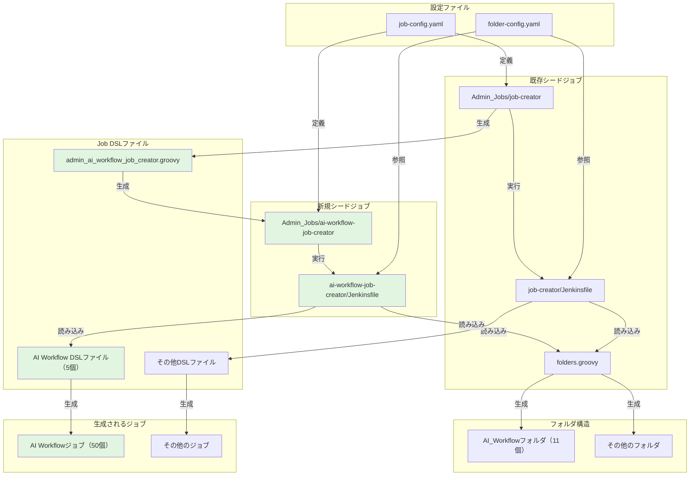
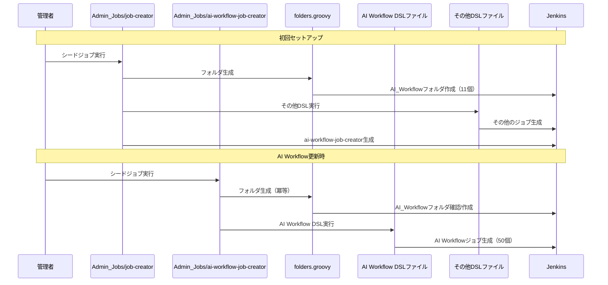
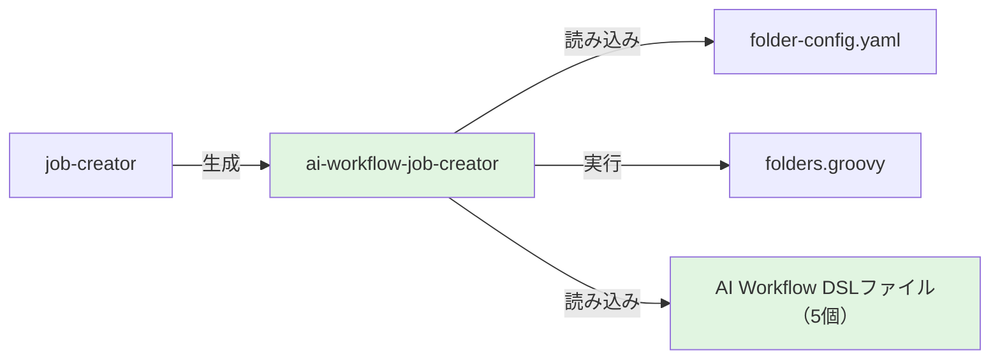
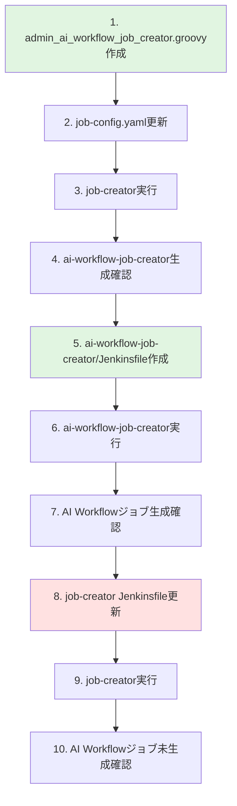

# 詳細設計書: AI Workflow用シードジョブ分離

**Issue**: #477
**タイトル**: [Feature] AI Workflow用のシードジョブを分離
**作成日**: 2025-01-17
**バージョン**: 1.0
**Planning Document**: [planning.md](../../00_planning/output/planning.md)
**Requirements Document**: [requirements.md](../../01_requirements/output/requirements.md)

---

## 0. Planning Document・Requirements Documentの確認

### Planning Phase成果物のサマリー

本設計は、Planning PhaseとRequirements Phaseで策定された以下の方針に基づいています：

#### 実装戦略
- **CREATE + EXTEND** (60% CREATE / 40% EXTEND)
  - 新規: AI Workflow専用シードジョブ、Jenkinsfile、DSLファイル
  - 拡張: 既存job-config.yaml、既存job-creatorからの除外ロジック

#### テスト戦略
- **INTEGRATION_ONLY**
  - Job DSLの自動テストは実装しない
  - 手動統合テスト（シードジョブ実行 → ジョブ生成確認）のみ実施
  - 理由: Job DSLは宣言的で、実際の動作確認（統合テスト）が最も信頼性が高い

#### リスク評価
- **リスクレベル: 低**
  - AI Workflowは独立システムで影響範囲が限定的
  - 既存のシードジョブ（job-creator）がテンプレートとして存在
  - 動作確認が容易

#### 見積もり工数
- **合計: 10〜14時間**
  - 要件定義: 2h
  - 設計: 2〜3h
  - テストシナリオ: 1〜2h
  - 実装: 3〜4h
  - テスト実行: 1〜2h
  - ドキュメント: 1h

---

## 1. 実装戦略判断

### 実装戦略: CREATE + EXTEND

**判断根拠**:

#### CREATE部分（60%）
1. **新規シードジョブ`Admin_Jobs/ai-workflow-job-creator`の作成**
   - 理由: AI Workflow専用のシードジョブが必要
   - 既存job-creatorとは独立した責務を持つため、新規作成が適切

2. **専用のJenkinsfile作成**
   - ファイルパス: `jenkins/jobs/pipeline/_seed/ai-workflow-job-creator/Jenkinsfile`
   - 理由: AI Workflow関連DSLファイルのみを読み込む専用ロジックが必要

3. **専用のJob DSLファイル作成**
   - ファイルパス: `jenkins/jobs/dsl/admin/admin_ai_workflow_job_creator.groovy`
   - 理由: 新規シードジョブ自体を生成するためのDSL定義が必要

#### EXTEND部分（40%）
1. **既存`job-config.yaml`の修正**
   - 新シードジョブの定義を追加
   - 理由: シードジョブ管理は既存の一元化された設定ファイルで行う

2. **既存`job-creator`のJenkinsfileの修正**
   - AI Workflow関連DSLファイルの読み込みを除外
   - 理由: 既存シードジョブからAI Workflow責務を分離

3. **`folder-config.yaml`の維持**
   - AI Workflowフォルダ定義は既に存在（変更不要）
   - 理由: フォルダ定義は共通で管理し、重複を避ける

#### REFACTORは最小限
- 既存のシードジョブ構造はそのまま維持
- AI Workflow関連のみを分離・移動

---

## 2. テスト戦略判断

### テスト戦略: INTEGRATION_ONLY

**判断根拠**:

#### INTEGRATION_ONLYを選択した理由
1. **Job DSLは宣言的な記述**
   - ユニットテストの価値が低い
   - 実際の動作確認が最も重要

2. **実際の動作確認（シードジョブ実行 → ジョブ生成）が最も重要**
   - Jenkinsとの統合テストで以下を検証:
     - シードジョブが正常に実行される
     - AI Workflowジョブが正しく生成される
     - フォルダ構造が正しく作成される
     - 既存ジョブに影響がない

3. **既存パターンとの整合性**
   - 既存のjob-creatorもユニットテストは実装していない
   - シードジョブの検証は統合テストで十分

#### UNIT_ONLYを選択しない理由
- Job DSLのユニットテストは複雑で、実装コストが高い
- Jenkins Test Harnessのセットアップが必要
- 実際の動作確認（統合テスト）のほうが信頼性が高い

#### BDDテストを選択しない理由
- エンドユーザー向けのストーリーテストではない
- 内部的なシードジョブの分離であり、ユーザー視点のシナリオは不要

---

## 3. テストコード戦略判断

### テストコード戦略: CREATE_TEST

**判断根拠**:

#### CREATE_TESTを選択した理由
1. **新規シードジョブのインテグレーションテストを作成**
   - テスト内容:
     - シードジョブ実行の成功
     - 生成されたジョブの数と名前の確認
     - フォルダ構造の確認
     - パラメータの正しさの確認

2. **手動テストスクリプトで実施**
   - 自動テストフレームワークは不要
   - テストスクリプト: `.ai-workflow/issue-477/05_test_scenarios/output/test_scenarios.md`

#### EXTEND_TESTを選択しない理由
- 既存のjob-creatorテストがあったとしても、AI Workflow専用テストは独立して作成すべき

#### BOTH_TESTを選択しない理由
- 既存シードジョブのテストは変更不要（AI Workflow除外のみ）
- 新規シードジョブのテストのみで十分

---

## 4. アーキテクチャ設計

### 4.1 システム全体図



### 4.2 コンポーネント間の関係

#### 既存システム（変更なし）
- `Admin_Jobs/job-creator` → その他のジョブを生成
- `folders.groovy` → すべてのフォルダを生成（AI Workflow含む）

#### 新規システム（追加）
- `Admin_Jobs/ai-workflow-job-creator` → AI Workflowジョブのみを生成
- `admin_ai_workflow_job_creator.groovy` → ai-workflow-job-creatorを生成

#### 変更箇所
- `job-config.yaml` → 新シードジョブ定義を追加
- `job-creator/Jenkinsfile` → AI Workflow DSLファイルの読み込みを除外

### 4.3 データフロー



---

## 5. 影響範囲分析

### 5.1 既存コードへの影響

#### 変更が必要なファイル（2個）

1. **`jenkins/jobs/pipeline/_seed/job-creator/job-config.yaml`**
   - 影響箇所: `jenkins-jobs`セクション
   - 変更内容: 新規シードジョブ定義の追加
   - リスク: 低（追加のみ）

2. **`jenkins/jobs/pipeline/_seed/job-creator/Jenkinsfile`**
   - 影響箇所: `Create Folder Structure and Jobs`ステージ
   - 変更内容: AI Workflow関連DSLファイルの除外ロジック追加
   - リスク: 中（既存処理への影響の可能性あり）

#### 変更不要なファイル（3個）

1. **`jenkins/jobs/pipeline/_seed/job-creator/folder-config.yaml`**
   - 理由: AI Workflowフォルダ定義は既に存在
   - 動作: 両シードジョブが同じ設定を参照

2. **`jenkins/jobs/dsl/folders.groovy`**
   - 理由: 既存のフォルダ生成ロジックをそのまま使用
   - 動作: 冪等性により重複実行でも問題なし

3. **AI Workflow関連DSLファイル（5個）**
   - 理由: DSLファイル自体の内容は変更不要
   - 動作: 新シードジョブから読み込まれるのみ

### 5.2 依存関係の変更

#### 新規依存関係



#### 既存依存関係の変更

**Before（分離前）**:
```
job-creator → AI Workflow DSLファイル → AI Workflowジョブ
```

**After（分離後）**:
```
job-creator → admin_ai_workflow_job_creator.groovy → ai-workflow-job-creator
ai-workflow-job-creator → AI Workflow DSLファイル → AI Workflowジョブ
```

### 5.3 マイグレーション要否

**マイグレーション不要**:
- データベーススキーマ変更なし
- 設定ファイルの後方互換性維持
- 既存ジョブは自動的に新シードジョブで再生成される
- フォルダ構造は既に存在（`folder-config.yaml`に定義済み）

**実行手順**:
1. コードをデプロイ
2. `Admin_Jobs/job-creator`を実行 → `ai-workflow-job-creator`を生成
3. `Admin_Jobs/ai-workflow-job-creator`を実行 → AI Workflowジョブを再生成
4. 既存のAI Workflowジョブは自動的に削除される（`removedJobAction: 'DELETE'`）

---

## 6. 変更・追加ファイルリスト

### 6.1 新規作成ファイル（2個）

| ファイルパス | 種類 | 説明 |
|------------|------|------|
| `jenkins/jobs/pipeline/_seed/ai-workflow-job-creator/Jenkinsfile` | Jenkinsfile | AI Workflow専用シードジョブパイプライン |
| `jenkins/jobs/dsl/admin/admin_ai_workflow_job_creator.groovy` | Job DSL | 新規シードジョブのJob DSL定義 |

### 6.2 修正が必要な既存ファイル（2個）

| ファイルパス | 変更箇所 | 変更内容 |
|------------|---------|---------|
| `jenkins/jobs/pipeline/_seed/job-creator/job-config.yaml` | `jenkins-jobs`セクション | 新規シードジョブ定義を追加 |
| `jenkins/jobs/pipeline/_seed/job-creator/Jenkinsfile` | `Create Folder Structure and Jobs`ステージ | AI Workflow関連DSLファイルの除外ロジック追加 |

### 6.3 削除が必要なファイル（0個）

なし

---

## 7. 詳細設計

### 7.1 新規Job DSL設計

#### ファイル: `jenkins/jobs/dsl/admin/admin_ai_workflow_job_creator.groovy`

**設計方針**:
- 既存`admin_backup_config_job.groovy`をベースにする
- `pipelineJob`パターンを使用
- パラメータなし（設定ファイルから全情報を取得）

**実装内容**:

```groovy
/**
 * AI Workflow Job Creator
 *
 * AI Workflowジョブを自動生成するシードジョブ
 */

// 設定の取得
def jobKey = 'ai_workflow_job_creator'
def jobConfig = jenkinsJobsConfig[jobKey]
def jenkinsPipelineRepo = commonSettings['jenkins-pipeline-repo']
def fullJobName = "Admin_Jobs/${jobConfig.name}"

pipelineJob(fullJobName) {
    displayName(jobConfig.displayName)

    description('''
        # AI Workflow Job Creator

        ## 概要
        AI Workflowジョブを自動生成するシードジョブです。

        ## 生成されるジョブ
        - AI_Workflow/develop配下のジョブ（5種類）
        - AI_Workflow/stable-1〜stable-9配下のジョブ（各5種類）
        - 合計: 50ジョブ

        ## 注意事項
        - DSLから削除されたジョブは自動的に削除されます
        - フォルダ構造はfolder-config.yamlで管理されています
        - job-creatorとの並行実行が可能です
    '''.stripIndent().trim())

    // パイプライン定義
    definition {
        cpsScm {
            scm {
                git {
                    remote {
                        url(jenkinsPipelineRepo.url)
                        credentials(jenkinsPipelineRepo.credentials)
                    }
                    branch(jenkinsPipelineRepo.branch)
                }
            }
            scriptPath(jobConfig.jenkinsfile)
        }
    }

    // ログローテーション
    logRotator {
        numToKeep(30)
        daysToKeep(90)
    }

    // プロパティ
    properties {
        disableConcurrentBuilds()
    }

    // ジョブの無効化状態
    disabled(false)
}
```

**設計ポイント**:
1. **パラメータ不要**: 設定ファイルから全情報を取得
2. **並行実行制限**: `disableConcurrentBuilds()`で並行実行を防止
3. **自動削除機能**: Jenkinsfileで`removedJobAction: 'DELETE'`を設定

### 7.2 新規Jenkinsfile設計

#### ファイル: `jenkins/jobs/pipeline/_seed/ai-workflow-job-creator/Jenkinsfile`

**設計方針**:
- 既存`job-creator/Jenkinsfile`をベースにする
- AI Workflow関連DSLファイルのみを読み込む
- folder-config.yamlは既存のものを使用

**実装内容**:

```groovy
pipeline {
    agent {
        label 'built-in'
    }

    environment {
        JOB_CONFIG_PATH = 'jenkins/jobs/pipeline/_seed/job-creator/job-config.yaml'
        FOLDER_CONFIG_PATH = 'jenkins/jobs/pipeline/_seed/job-creator/folder-config.yaml'
        FOLDERS_DSL_PATH = 'jenkins/jobs/dsl/folders.groovy'
    }

    stages {
        stage('Validate Configuration') {
            steps {
                script {
                    echo "=== Starting configuration validation ==="

                    // 設定ファイルの存在チェック
                    if (!fileExists(env.JOB_CONFIG_PATH)) {
                        error("Job configuration file not found: ${env.JOB_CONFIG_PATH}")
                    }
                    echo "✓ Job configuration file found: ${env.JOB_CONFIG_PATH}"

                    if (!fileExists(env.FOLDER_CONFIG_PATH)) {
                        error("Folder configuration file not found: ${env.FOLDER_CONFIG_PATH}")
                    }
                    echo "✓ Folder configuration file found: ${env.FOLDER_CONFIG_PATH}"

                    if (!fileExists(env.FOLDERS_DSL_PATH)) {
                        error("Folders DSL file not found: ${env.FOLDERS_DSL_PATH}")
                    }
                    echo "✓ Folders DSL file found: ${env.FOLDERS_DSL_PATH}"

                    // ジョブ設定の検証（AI Workflow関連のみ）
                    def jobConfig = readYaml file: env.JOB_CONFIG_PATH
                    def aiWorkflowJobs = jobConfig['jenkins-jobs'].findAll { jobKey, jobDef ->
                        jobKey.startsWith('ai_workflow_')
                    }

                    echo "\n=== Validating ${aiWorkflowJobs.size()} AI Workflow job configurations ==="

                    def validationErrors = []
                    aiWorkflowJobs.each { jobKey, jobDef ->
                        // dslfileの存在チェック
                        if (jobDef.dslfile && !fileExists(jobDef.dslfile)) {
                            validationErrors.add("Job '${jobKey}': DSL file not found - ${jobDef.dslfile}")
                        }

                        // jenkinsfileの存在チェック（skipJenkinsfileValidation: true の場合はスキップ）
                        if (jobDef.jenkinsfile && !jobDef.skipJenkinsfileValidation && !fileExists(jobDef.jenkinsfile)) {
                            validationErrors.add("Job '${jobKey}': Jenkinsfile not found - ${jobDef.jenkinsfile}")
                        }
                    }

                    if (validationErrors.size() > 0) {
                        echo "\n=== Validation Errors ==="
                        validationErrors.each { error ->
                            echo "  ✗ ${error}"
                        }
                        error("Configuration validation failed with ${validationErrors.size()} errors")
                    }

                    echo "\n✅ All validations passed successfully!"
                }
            }
        }

        stage('Create Folder Structure and Jobs') {
            steps {
                script {
                    // 設定ファイルを読み込む
                    def jobConfig = readYaml file: env.JOB_CONFIG_PATH
                    def folderConfig = readYaml file: env.FOLDER_CONFIG_PATH

                    // AI Workflow関連ジョブのみを抽出
                    def aiWorkflowJobs = jobConfig['jenkins-jobs'].findAll { jobKey, jobDef ->
                        jobKey.startsWith('ai_workflow_')
                    }

                    def dslFiles = []

                    // folders.groovyを最初に実行（フォルダ構造を作成）
                    dslFiles.add(env.FOLDERS_DSL_PATH)

                    // AI Workflow関連ジョブのDSLファイルを追加
                    aiWorkflowJobs.each { jobKey, jobDef ->
                        if (jobDef.dslfile) {
                            dslFiles.add(jobDef.dslfile)
                        }
                    }

                    echo "=== Job DSL Execution Plan ==="
                    echo "Total DSL files: ${dslFiles.size()}"
                    echo "AI Workflow jobs to create: ${aiWorkflowJobs.size()}"
                    echo "AI Workflow folders: ${folderConfig.folders?.findAll { it.path.startsWith('AI_Workflow') }?.size() ?: 0}"

                    // 追加のパラメータを準備
                    def additionalParams = [
                        // ジョブ設定（AI Workflow関連のみ）
                        jenkinsJobsConfig: aiWorkflowJobs,
                        // フォルダ設定（全体）
                        jenkinsFoldersConfig: folderConfig
                    ]

                    // 共通設定が存在する場合は追加
                    if (jobConfig['common-settings']) {
                        additionalParams['commonSettings'] = jobConfig['common-settings']
                    }

                    echo "\n=== Executing Job DSL ==="
                    echo "⚠️ Note: Jobs, views, and config files no longer defined in DSL will be automatically deleted."

                    // Job DSLを実行
                    jobDsl(
                        targets: dslFiles.join('\n'),
                        lookupStrategy: 'SEED_JOB',
                        additionalParameters: additionalParams,
                        removedJobAction: 'DELETE',
                        removedViewAction: 'DELETE',
                        removedConfigFilesAction: 'DELETE'
                    )

                    echo "\n✅ Job DSL execution completed!"
                    echo "Note: AI Workflow items no longer defined in DSL have been automatically removed."
                }
            }
        }
    }

    post {
        always {
            cleanWs()
        }
        success {
            echo "✅ AI Workflow seed job completed successfully!"
        }
        failure {
            echo "❌ AI Workflow seed job failed. Please check the logs for details."
        }
    }
}
```

**設計ポイント**:
1. **AI Workflow DSLファイルのみ処理**: `jobKey.startsWith('ai_workflow_')`でフィルタリング
2. **folders.groovyは共通で使用**: 冪等性により重複実行でも問題なし
3. **自動削除機能**: `removedJobAction: 'DELETE'`でDSLから削除されたジョブを自動削除
4. **folder-config.yamlは既存を使用**: 重複管理を避ける

### 7.3 job-config.yaml更新設計

#### ファイル: `jenkins/jobs/pipeline/_seed/job-creator/job-config.yaml`

**変更箇所**: `jenkins-jobs`セクション

**追加内容**:

```yaml
jenkins-jobs:
  # 既存ジョブ...

  # AI Workflow Job Creator（新規追加）
  ai_workflow_job_creator:
    name: 'ai-workflow-job-creator'
    displayName: 'AI Workflow Job Creator'
    dslfile: jenkins/jobs/dsl/admin/admin_ai_workflow_job_creator.groovy
    jenkinsfile: jenkins/jobs/pipeline/_seed/ai-workflow-job-creator/Jenkinsfile
```

**設計ポイント**:
1. **命名規則準拠**: `ai_workflow_job_creator`キー名
2. **Jenkinsfile指定**: 専用のJenkinsfileを指定
3. **DSLファイル指定**: 新規作成したDSLファイルを指定

### 7.4 job-creator Jenkinsfile更新設計

#### ファイル: `jenkins/jobs/pipeline/_seed/job-creator/Jenkinsfile`

**変更箇所**: `Create Folder Structure and Jobs`ステージ

**変更前**:

```groovy
// 各ジョブのDSLファイルを追加
jobConfig['jenkins-jobs'].each { jobKey, jobDef ->
    if (jobDef.dslfile) {
        dslFiles.add(jobDef.dslfile)
    }
}
```

**変更後**:

```groovy
// 各ジョブのDSLファイルを追加（AI Workflow関連を除外）
def excludedJobPrefixes = ['ai_workflow_']
def jobsToProcess = jobConfig['jenkins-jobs'].findAll { jobKey, jobDef ->
    !excludedJobPrefixes.any { prefix -> jobKey.startsWith(prefix) }
}

echo "AI Workflow jobs excluded: ${jobConfig['jenkins-jobs'].size() - jobsToProcess.size()}"

jobsToProcess.each { jobKey, jobDef ->
    if (jobDef.dslfile) {
        dslFiles.add(jobDef.dslfile)
    }
}
```

**設計ポイント**:
1. **明示的な除外**: `excludedJobPrefixes`で除外対象を明示
2. **拡張性**: 将来的に他のプレフィックスも除外可能
3. **ログ出力**: 除外されたジョブ数を表示

---

## 8. セキュリティ考慮事項

### 8.1 認証・認可

**シードジョブ実行権限**:
- 既存job-creatorと同じAdmin権限が必要
- `Admin_Jobs`フォルダに配置することで権限管理を統一

**クレデンシャル管理**:
- `github-app-credentials`を使用（既存設定を流用）
- 新たなクレデンシャルは不要

### 8.2 データ保護

**設定ファイルの保護**:
- job-config.yaml、folder-config.yamlはGit管理
- 機密情報は含まれない（クレデンシャルIDのみ）

**ジョブ生成の監査**:
- シードジョブ実行履歴はJenkinsビルド履歴で追跡可能
- 生成されたジョブの変更履歴はJob DSLプラグインで追跡可能

### 8.3 セキュリティリスクと対策

| リスク | 影響度 | 対策 |
|--------|--------|------|
| 不正なDSLファイルの実行 | 高 | Git管理、コードレビュー、Script Approval |
| 既存ジョブの誤削除 | 中 | 除外ロジックのテスト、ドライランの実施 |
| クレデンシャルの漏洩 | 高 | Jenkinsクレデンシャルストアで管理 |

---

## 9. 非機能要件への対応

### 9.1 パフォーマンス

**目標**:
- AI Workflowジョブのみの更新時、60秒以内に完了

**実現方法**:
1. **並列実行**: 複数のDSLファイルを並列で実行
2. **キャッシュ利用**: Job DSLプラグインのキャッシュ機能を活用
3. **最小限の処理**: AI Workflow関連DSLファイルのみを処理

### 9.2 スケーラビリティ

**拡張性**:
- AI Workflowフォルダが10個 → 20個に増加しても対応可能
- 新規ジョブタイプ追加時、DSLファイル追加のみで対応可能

**将来的な分離**:
- 他のジョブカテゴリも同様の方法で分離可能
- 除外ロジックは拡張可能な設計

### 9.3 保守性

**コーディング規約準拠**:
- jenkins/CONTRIBUTION.md に従う
- パラメータ定義: DSLファイルで実施
- コメント: 日本語で処理の意図を明記

**ドキュメント整合性**:
- jenkins/README.md: AI Workflow専用シードジョブの使用方法を追加
- jenkins/CONTRIBUTION.md: シードジョブパターンセクションに新シードジョブを追加

---

## 10. 実装の順序

### 推奨実装順序



### 依存関係の考慮

**Phase 1: 新規シードジョブの生成**
1. Job DSL作成（admin_ai_workflow_job_creator.groovy）
2. job-config.yaml更新
3. job-creator実行 → ai-workflow-job-creatorを生成

**Phase 2: 新規シードジョブの動作確認**
4. Jenkinsfile作成（ai-workflow-job-creator/Jenkinsfile）
5. ai-workflow-job-creator実行 → AI Workflowジョブ生成
6. 生成されたジョブの確認

**Phase 3: 既存シードジョブからの除外**
7. job-creator Jenkinsfile更新（除外ロジック追加）
8. job-creator実行 → AI Workflowジョブが生成されないことを確認

**Phase 4: ドキュメント更新**
9. README.md、CONTRIBUTION.md更新

---

## 11. クラス設計

### 該当なし

本実装では新規クラスの作成は不要です。既存のJob DSLパターンとJenkinsfileパターンを踏襲します。

---

## 12. 関数設計

### 12.1 Jenkinsfile関数（ai-workflow-job-creator/Jenkinsfile）

#### 関数: AI Workflow関連ジョブの抽出

**目的**: job-config.yamlからAI Workflow関連ジョブのみを抽出

**実装**:

```groovy
def extractAIWorkflowJobs(Map jobConfig) {
    return jobConfig['jenkins-jobs'].findAll { jobKey, jobDef ->
        jobKey.startsWith('ai_workflow_')
    }
}
```

**使用箇所**: `Validate Configuration`ステージ、`Create Folder Structure and Jobs`ステージ

#### 関数: DSLファイルリストの構築

**目的**: 実行するDSLファイルのリストを構築

**実装**:

```groovy
def buildDslFileList(List baseDslFiles, Map aiWorkflowJobs) {
    def dslFiles = baseDslFiles.clone()
    aiWorkflowJobs.each { jobKey, jobDef ->
        if (jobDef.dslfile) {
            dslFiles.add(jobDef.dslfile)
        }
    }
    return dslFiles
}
```

**使用箇所**: `Create Folder Structure and Jobs`ステージ

### 12.2 Jenkinsfile関数（job-creator/Jenkinsfile）

#### 関数: AI Workflow以外のジョブの抽出

**目的**: job-config.yamlからAI Workflow以外のジョブを抽出

**実装**:

```groovy
def excludeAIWorkflowJobs(Map jobConfig) {
    def excludedPrefixes = ['ai_workflow_']
    return jobConfig['jenkins-jobs'].findAll { jobKey, jobDef ->
        !excludedPrefixes.any { prefix -> jobKey.startsWith(prefix) }
    }
}
```

**使用箇所**: `Create Folder Structure and Jobs`ステージ

---

## 13. データ構造設計

### 13.1 job-config.yaml（新規エントリ）

```yaml
ai_workflow_job_creator:
  name: String              # ジョブ名
  displayName: String       # 表示名
  dslfile: String          # DSLファイルパス
  jenkinsfile: String      # Jenkinsfileパス
```

### 13.2 additionalParameters（Jenkinsfile → Job DSL）

```groovy
Map additionalParams = [
    jenkinsJobsConfig: Map,      // AI Workflow関連ジョブ定義
    jenkinsFoldersConfig: Map,   // フォルダ定義
    commonSettings: Map          // 共通設定（リポジトリ情報等）
]
```

---

## 14. インターフェース設計

### 14.1 Job DSL API

**入力**:
- `jenkinsJobsConfig`: AI Workflow関連ジョブ定義
- `commonSettings`: 共通設定

**出力**:
- Jenkinsジョブ（`Admin_Jobs/ai-workflow-job-creator`）

**インターフェース**:

```groovy
pipelineJob(fullJobName) {
    displayName(String)
    description(String)
    definition { cpsScm { ... } }
    logRotator { ... }
    properties { ... }
    disabled(Boolean)
}
```

### 14.2 Jenkinsfile API

**入力**:
- `JOB_CONFIG_PATH`: job-config.yamlのパス
- `FOLDER_CONFIG_PATH`: folder-config.yamlのパス
- `FOLDERS_DSL_PATH`: folders.groovyのパス

**出力**:
- AI Workflowジョブ（50個）
- AI Workflowフォルダ（11個）

**インターフェース**:

```groovy
jobDsl(
    targets: String,              // DSLファイルリスト（改行区切り）
    lookupStrategy: String,       // 'SEED_JOB'
    additionalParameters: Map,    // 追加パラメータ
    removedJobAction: String,     // 'DELETE'
    removedViewAction: String,    // 'DELETE'
    removedConfigFilesAction: String  // 'DELETE'
)
```

---

## 15. 品質ゲート（Phase 2）

設計書の品質ゲートを確認します：

- [x] **実装戦略の判断根拠が明記されている**
  - セクション1で`CREATE + EXTEND`の判断根拠を記載
  - CREATE部分（60%）とEXTEND部分（40%）を明示

- [x] **テスト戦略の判断根拠が明記されている**
  - セクション2で`INTEGRATION_ONLY`の判断根拠を記載
  - UNIT_ONLY、BDD_ONLYを選択しない理由を明示

- [x] **既存コードへの影響範囲が分析されている**
  - セクション5で影響範囲を詳細に分析
  - 変更が必要なファイル（2個）、変更不要なファイル（3個）をリストアップ

- [x] **変更が必要なファイルがリストアップされている**
  - セクション6で変更・追加ファイルリストを作成
  - 新規作成（2個）、修正（2個）、削除（0個）を明示

- [x] **設計が実装可能である**
  - セクション7で詳細設計を記載
  - 既存パターンを踏襲し、実装可能な設計を提示

すべての品質ゲートを満たしています。

---

## 16. 次のステップ

Phase 3（テストシナリオフェーズ）に進み、以下を明確にします：

1. **インテグレーションテストシナリオ作成**
   - シードジョブ実行の成功確認
   - 生成されたジョブ数の確認（50ジョブ）
   - フォルダ構造の確認（11フォルダ）
   - パラメータの正しさの確認

2. **既存システムへの影響確認シナリオ**
   - 既存job-creatorの実行確認（AI Workflowジョブが生成されないこと）
   - 他のジョブカテゴリへの影響なし確認
   - 両シードジョブの並行実行確認

3. **テスト手順書の作成**
   - 手動テスト手順
   - 期待結果の明示
   - 異常系テストシナリオ

---

## 付録A: 技術スタック

| カテゴリ | 技術 | バージョン |
|---------|------|-----------|
| CI/CDツール | Jenkins | 2.426.1以上 |
| DSLツール | Job DSL Plugin | 1.87以上 |
| スクリプト言語 | Groovy | 3.0以上 |
| 設定ファイル | YAML | 1.2 |
| バージョン管理 | Git | 2.30以上 |

---

## 付録B: 参考資料

- [Planning Document](../../00_planning/output/planning.md) - 本プロジェクトの開発計画
- [Requirements Document](../../01_requirements/output/requirements.md) - 要件定義書
- [jenkins/CONTRIBUTION.md](../../../../jenkins/CONTRIBUTION.md) - Jenkins開発ガイドライン
- [jenkins/README.md](../../../../jenkins/README.md) - Jenkins使用方法
- [CLAUDE.md](../../../../CLAUDE.md) - プロジェクト全体の方針
- [Issue #477](https://github.com/tielec/infrastructure-as-code/issues/477) - GitHub Issue

---

**設計書バージョン**: 1.0
**作成日**: 2025-01-17
**最終更新日**: 2025-01-17
**ステータス**: レビュー待ち
