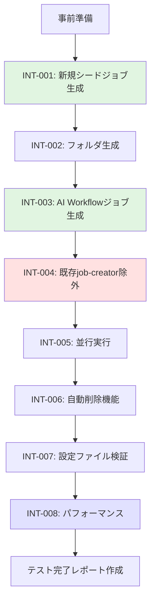

# テストシナリオ: AI Workflow用シードジョブ分離

**Issue**: #477
**タイトル**: [Feature] AI Workflow用のシードジョブを分離
**作成日**: 2025-01-17
**バージョン**: 1.0
**Planning Document**: [planning.md](../../00_planning/output/planning.md)
**Requirements Document**: [requirements.md](../../01_requirements/output/requirements.md)
**Design Document**: [design.md](../../02_design/output/design.md)

---

## 1. テスト戦略サマリー

### 1.1 選択されたテスト戦略

**テスト戦略**: INTEGRATION_ONLY

**判断根拠**（Planning Documentより引用）:
- Job DSLは宣言的な記述であり、ユニットテストの価値が低い
- 実際の動作確認（シードジョブ実行 → ジョブ生成）が最も重要
- Jenkinsとの統合テストで実際の動作を検証することが最も信頼性が高い
- 既存のjob-creatorもユニットテストは実装していない

### 1.2 テスト対象の範囲

#### 新規作成コンポーネント
1. `jenkins/jobs/dsl/admin/admin_ai_workflow_job_creator.groovy` - 新規シードジョブのJob DSL
2. `jenkins/jobs/pipeline/_seed/ai-workflow-job-creator/Jenkinsfile` - AI Workflow専用Jenkinsfile

#### 修正コンポーネント
1. `jenkins/jobs/pipeline/_seed/job-creator/job-config.yaml` - 新シードジョブ定義追加
2. `jenkins/jobs/pipeline/_seed/job-creator/Jenkinsfile` - AI Workflow除外ロジック追加

#### 影響確認が必要なコンポーネント
1. 既存job-creator - AI Workflowジョブを生成しないこと
2. AI Workflow関連DSLファイル（5個） - 新シードジョブで正しく動作すること
3. folder-config.yaml - 両シードジョブで正しく読み込まれること

### 1.3 テストの目的

1. **新規シードジョブの正常動作確認**
   - ai-workflow-job-creatorが正常に実行される
   - AI Workflowジョブ（5種 × 10フォルダ = 50ジョブ）が生成される
   - フォルダ構造が正しく作成される

2. **既存システムへの影響がないことの確認**
   - job-creatorがAI Workflowジョブを生成しない
   - 他のジョブカテゴリ（Admin、Code Quality等）が正常に生成される
   - 両シードジョブの並行実行が可能

3. **自動削除機能の動作確認**
   - DSLから削除されたジョブが自動的に削除される
   - 他のジョブに影響を与えない

4. **非機能要件の確認**
   - パフォーマンス（実行時間60秒以内）
   - エラーハンドリングの正常動作

---

## 2. 統合テストシナリオ

### 2.1 新規シードジョブの生成テスト

**シナリオID**: INT-001
**優先度**: 高
**対応要件**: FR-001, FR-002, FR-003, FR-004

#### 目的
job-creatorから新規シードジョブ（ai-workflow-job-creator）が正常に生成されることを検証

#### 前提条件
- [ ] コードがデプロイ済み（新規DSL、Jenkinsfile、job-config.yaml更新）
- [ ] Jenkinsが起動している
- [ ] job-creatorが正常に動作している

#### テスト手順

1. **job-config.yamlの確認**
   ```bash
   cat jenkins/jobs/pipeline/_seed/job-creator/job-config.yaml | grep -A5 "ai_workflow_job_creator"
   ```
   - 新シードジョブ定義が存在することを確認

2. **DSLファイルの確認**
   ```bash
   cat jenkins/jobs/dsl/admin/admin_ai_workflow_job_creator.groovy
   ```
   - DSLファイルが存在し、シンタックスエラーがないことを確認

3. **job-creatorの実行**
   - Jenkins UIで`Admin_Jobs/job-creator`を開く
   - 「Build Now」をクリック
   - ビルドの完了を待つ

4. **ビルド結果の確認**
   - ビルドステータスが「SUCCESS」であることを確認
   - コンソール出力にエラーがないことを確認

5. **生成されたシードジョブの確認**
   - `Admin_Jobs/ai-workflow-job-creator`が存在することを確認
   - ジョブの表示名が「AI Workflow Job Creator」であることを確認

#### 期待結果
- [ ] job-creatorが正常に完了（ビルドステータス: SUCCESS）
- [ ] `Admin_Jobs/ai-workflow-job-creator`が生成される
- [ ] 新シードジョブの表示名が「AI Workflow Job Creator」である
- [ ] 新シードジョブの説明文に「AI Workflowジョブを自動生成するシードジョブ」が含まれる
- [ ] ビルドログにエラーメッセージが出力されない

#### 確認項目チェックリスト
- [ ] ジョブが`Admin_Jobs`フォルダに配置されている
- [ ] ジョブのタイプが「Pipeline」である
- [ ] Jenkinsfileパスが`jenkins/jobs/pipeline/_seed/ai-workflow-job-creator/Jenkinsfile`である
- [ ] ログローテーション設定（30ビルド、90日）が適用されている
- [ ] 並行ビルド無効化（disableConcurrentBuilds）が設定されている

---

### 2.2 AI Workflowフォルダ生成テスト

**シナリオID**: INT-002
**優先度**: 高
**対応要件**: FR-002, FR-006

#### 目的
ai-workflow-job-creatorがAI Workflowフォルダ構造を正しく生成することを検証

#### 前提条件
- [ ] INT-001が成功している
- [ ] ai-workflow-job-creatorが存在する
- [ ] folder-config.yamlにAI Workflowフォルダ定義が存在する

#### テスト手順

1. **folder-config.yamlの確認**
   ```bash
   cat jenkins/jobs/pipeline/_seed/job-creator/folder-config.yaml | grep -A10 "AI_Workflow"
   ```
   - AI_Workflowフォルダ定義（11個）が存在することを確認

2. **ai-workflow-job-creatorの実行**
   - Jenkins UIで`Admin_Jobs/ai-workflow-job-creator`を開く
   - 「Build Now」をクリック
   - ビルドの完了を待つ

3. **ビルド結果の確認**
   - ビルドステータスが「SUCCESS」であることを確認
   - コンソール出力の「Validate Configuration」ステージが成功
   - コンソール出力の「Create Folder Structure and Jobs」ステージが成功

4. **フォルダ構造の確認**
   - Jenkins UIでフォルダ一覧を確認
   - `AI_Workflow`親フォルダが存在することを確認
   - サブフォルダの確認:
     - `AI_Workflow/develop`
     - `AI_Workflow/stable-1`
     - `AI_Workflow/stable-2`
     - `AI_Workflow/stable-3`
     - `AI_Workflow/stable-4`
     - `AI_Workflow/stable-5`
     - `AI_Workflow/stable-6`
     - `AI_Workflow/stable-7`
     - `AI_Workflow/stable-8`
     - `AI_Workflow/stable-9`

#### 期待結果
- [ ] ai-workflow-job-creatorが正常に完了（ビルドステータス: SUCCESS）
- [ ] AI_Workflowフォルダ（親）が存在する
- [ ] AI_Workflowサブフォルダ（10個）が存在する
- [ ] フォルダの表示名と説明がfolder-config.yamlと一致する
- [ ] ビルドログに「✅ All validations passed successfully!」が表示される
- [ ] ビルドログに「✅ Job DSL execution completed!」が表示される

#### 確認項目チェックリスト
- [ ] フォルダ総数: 11個（親1個 + サブ10個）
- [ ] 各フォルダの表示名が正しい
- [ ] 各フォルダの説明が正しい
- [ ] フォルダの階層構造が正しい（AI_Workflow配下にサブフォルダ）

---

### 2.3 AI Workflowジョブ生成テスト

**シナリオID**: INT-003
**優先度**: 高
**対応要件**: FR-002, FR-005

#### 目的
ai-workflow-job-creatorがAI Workflowジョブ（5種 × 10フォルダ = 50ジョブ）を正しく生成することを検証

#### 前提条件
- [ ] INT-002が成功している
- [ ] AI Workflowフォルダ構造が存在する
- [ ] AI Workflow関連DSLファイル（5個）が存在する

#### テスト手順

1. **DSLファイルの確認**
   ```bash
   ls -la jenkins/jobs/dsl/ai-workflow/
   ```
   - 以下の5つのDSLファイルが存在することを確認:
     1. `ai_workflow_all_phases_job.groovy`
     2. `ai_workflow_preset_job.groovy`
     3. `ai_workflow_single_phase_job.groovy`
     4. `ai_workflow_rollback_job.groovy`
     5. `ai_workflow_auto_issue_job.groovy`

2. **ai-workflow-job-creatorの実行**
   - Jenkins UIで`Admin_Jobs/ai-workflow-job-creator`を開く
   - 「Build Now」をクリック
   - ビルドの完了を待つ（目標: 60秒以内）

3. **ビルド時間の測定**
   - ビルド開始時刻と終了時刻を記録
   - 実行時間を計算

4. **生成されたジョブの確認**
   - 各フォルダ（develop、stable-1〜9）に以下のジョブが存在することを確認:
     1. `all_phases`
     2. `preset`
     3. `single_phase`
     4. `rollback`
     5. `auto_issue`

5. **ジョブ詳細の確認**
   - 1つのジョブ（例: `AI_Workflow/develop/all_phases`）を開く
   - パラメータ設定を確認
   - Jenkinsfileパスを確認
   - ジョブの説明を確認

#### 期待結果
- [ ] ai-workflow-job-creatorが60秒以内に完了（許容: 90秒）
- [ ] 各フォルダに5種類のジョブが生成される
- [ ] 生成されたジョブ総数: 50個（5種 × 10フォルダ）
- [ ] 各ジョブのタイプが「Pipeline」である
- [ ] 各ジョブのパラメータがDSL定義と一致する
- [ ] 各ジョブのJenkinsfileパスが正しい

#### 確認項目チェックリスト

**developフォルダ（5ジョブ）**:
- [ ] AI_Workflow/develop/all_phases
- [ ] AI_Workflow/develop/preset
- [ ] AI_Workflow/develop/single_phase
- [ ] AI_Workflow/develop/rollback
- [ ] AI_Workflow/develop/auto_issue

**stable-1フォルダ（5ジョブ）**:
- [ ] AI_Workflow/stable-1/all_phases
- [ ] AI_Workflow/stable-1/preset
- [ ] AI_Workflow/stable-1/single_phase
- [ ] AI_Workflow/stable-1/rollback
- [ ] AI_Workflow/stable-1/auto_issue

**同様にstable-2〜stable-9フォルダ（各5ジョブ）**:
- [ ] 各stable-Nフォルダに5種類のジョブが存在

**パラメータ確認（例: all_phases）**:
- [ ] パラメータ定義が存在する
- [ ] パラメータ名がDSL定義と一致
- [ ] デフォルト値が正しい

---

### 2.4 既存job-creatorからのAI Workflow除外テスト

**シナリオID**: INT-004
**優先度**: 高
**対応要件**: FR-005

#### 目的
既存job-creatorがAI Workflow関連DSLファイルを読み込まず、AI Workflowジョブを生成しないことを検証

#### 前提条件
- [ ] job-creator Jenkinsfileに除外ロジックが実装済み
- [ ] ai-workflow-job-creatorが既にAI Workflowジョブを生成済み

#### テスト手順

1. **Jenkinsfileの除外ロジック確認**
   ```bash
   cat jenkins/jobs/pipeline/_seed/job-creator/Jenkinsfile | grep -A10 "excludedJobPrefixes"
   ```
   - 除外ロジックが実装されていることを確認

2. **job-creatorの実行**
   - Jenkins UIで`Admin_Jobs/job-creator`を開く
   - 「Build Now」をクリック
   - ビルドの完了を待つ

3. **ビルドログの確認**
   - コンソール出力を確認
   - 「AI Workflow jobs excluded: 5」のログが出力されることを確認
   - AI Workflow関連DSLファイルが読み込まれていないことを確認

4. **AI Workflowジョブの状態確認**
   - `AI_Workflow`フォルダ配下のジョブが変更されていないことを確認
   - ジョブが削除されていないことを確認
   - ジョブの最終更新日時が変わっていないことを確認

5. **他のジョブの生成確認**
   - `Admin_Jobs`配下のジョブが正常に生成/更新されることを確認
   - `Code_Quality`配下のジョブが正常に生成/更新されることを確認
   - `Docs_Generator`配下のジョブが正常に生成/更新されることを確認

#### 期待結果
- [ ] job-creatorが正常に完了（ビルドステータス: SUCCESS）
- [ ] ビルドログに「AI Workflow jobs excluded: 5」が表示される
- [ ] AI Workflowジョブが変更されていない
- [ ] AI Workflowジョブが削除されていない
- [ ] 他のジョブカテゴリは正常に生成/更新される
- [ ] ビルドログにAI Workflow関連のエラーが出力されない

#### 確認項目チェックリスト
- [ ] AI_Workflow配下のジョブ数: 50個（変化なし）
- [ ] Admin_Jobs配下のジョブが更新されている
- [ ] Code_Quality配下のジョブが更新されている
- [ ] Docs_Generator配下のジョブが更新されている
- [ ] Infrastructure配下のジョブが更新されている

---

### 2.5 両シードジョブの並行実行テスト

**シナリオID**: INT-005
**優先度**: 中
**対応要件**: NFR-002（可用性要件）

#### 目的
job-creatorとai-workflow-job-creatorを同時に実行しても問題なく動作することを検証

#### 前提条件
- [ ] job-creatorとai-workflow-job-creatorが両方存在する
- [ ] Jenkins環境が正常に動作している

#### テスト手順

1. **並行実行の準備**
   - 2つのブラウザタブを開く
   - タブ1: `Admin_Jobs/job-creator`
   - タブ2: `Admin_Jobs/ai-workflow-job-creator`

2. **同時実行**
   - タブ1で「Build Now」をクリック
   - 直後にタブ2で「Build Now」をクリック

3. **ビルド進行の監視**
   - 両方のビルドが並行して実行されることを確認
   - ビルドキューに両方が表示されることを確認

4. **ビルド結果の確認**
   - 両方のビルドが完了するまで待つ
   - 両方のビルドステータスを確認

5. **生成されたジョブの確認**
   - AI Workflowジョブが正しく生成されていることを確認
   - 他のジョブが正しく生成されていることを確認
   - フォルダ構造に異常がないことを確認

#### 期待結果
- [ ] 両シードジョブが正常に完了（ビルドステータス: SUCCESS）
- [ ] フォルダ生成で競合が発生しない（冪等性により）
- [ ] AI Workflowジョブが正しく生成される（50個）
- [ ] 他のジョブが正しく生成される
- [ ] ビルドログにロック競合エラーが出力されない

#### 確認項目チェックリスト
- [ ] job-creator: SUCCESS
- [ ] ai-workflow-job-creator: SUCCESS
- [ ] フォルダ総数に異常がない
- [ ] ジョブ総数に異常がない
- [ ] フォルダの重複や欠損がない

---

### 2.6 自動削除機能テスト

**シナリオID**: INT-006
**優先度**: 中
**対応要件**: FR-007

#### 目的
AI Workflow関連DSLから削除されたジョブが自動的に削除されることを検証

#### 前提条件
- [ ] ai-workflow-job-creatorが正常に動作している
- [ ] AI Workflowジョブが生成済み（50個）
- [ ] テスト用のAI Workflow DSLファイルのバックアップを作成済み

#### テスト手順

1. **初期状態の確認**
   - AI_Workflow/develop配下のジョブ数を記録（5個）

2. **DSLファイルからジョブ定義を削除**
   - `jenkins/jobs/dsl/ai-workflow/ai_workflow_auto_issue_job.groovy`をバックアップ
   - 該当ファイルの内容をコメントアウト（または一時的に空にする）

3. **ai-workflow-job-creatorの実行**
   - Jenkins UIで`Admin_Jobs/ai-workflow-job-creator`を開く
   - 「Build Now」をクリック
   - ビルドの完了を待つ

4. **ビルドログの確認**
   - 「Jobs, views, and config files no longer defined in DSL will be automatically deleted」のメッセージを確認
   - 削除されたジョブのログを確認

5. **ジョブ削除の確認**
   - AI_Workflow/develop配下のジョブ数を確認（4個になっているはず）
   - `auto_issue`ジョブが削除されていることを確認
   - 他のジョブ（all_phases、preset、single_phase、rollback）は存在することを確認

6. **他のフォルダへの影響確認**
   - AI_Workflow/stable-1〜9配下の`auto_issue`も削除されていることを確認
   - 他のジョブカテゴリ（Admin、Code Quality等）に影響がないことを確認

7. **DSLファイルの復元**
   - バックアップから`ai_workflow_auto_issue_job.groovy`を復元

8. **ai-workflow-job-creatorの再実行**
   - 「Build Now」をクリック
   - `auto_issue`ジョブが再生成されることを確認（5個に戻る）

#### 期待結果
- [ ] DSL削除後、ai-workflow-job-creator実行で該当ジョブが削除される
- [ ] 削除されるジョブ数: 10個（各フォルダから1個ずつ）
- [ ] 他のAI Workflowジョブは影響を受けない
- [ ] 他のジョブカテゴリは影響を受けない
- [ ] DSL復元後、ジョブが再生成される

#### 確認項目チェックリスト
- [ ] AI_Workflow/develop配下: auto_issueが削除され、4ジョブになる
- [ ] AI_Workflow/stable-1〜9配下: 各フォルダでauto_issueが削除される
- [ ] 削除されたジョブ総数: 10個
- [ ] 残ったジョブ総数: 40個
- [ ] 復元後のジョブ総数: 50個（元に戻る）

---

### 2.7 設定ファイル検証テスト

**シナリオID**: INT-007
**優先度**: 中
**対応要件**: FR-002（Validate Configurationステージ）

#### 目的
ai-workflow-job-creatorが設定ファイルの検証を正しく実行することを検証

#### 前提条件
- [ ] ai-workflow-job-creatorが存在する
- [ ] テスト用のファイルバックアップを作成済み

#### テスト手順

##### ケース1: 設定ファイルが存在しない場合

1. **job-config.yamlを一時的にリネーム**
   ```bash
   mv jenkins/jobs/pipeline/_seed/job-creator/job-config.yaml jenkins/jobs/pipeline/_seed/job-creator/job-config.yaml.bak
   ```

2. **ai-workflow-job-creatorの実行**
   - 「Build Now」をクリック
   - ビルドが失敗することを確認

3. **エラーメッセージの確認**
   - 「Job configuration file not found」エラーが表示されることを確認

4. **ファイルの復元**
   ```bash
   mv jenkins/jobs/pipeline/_seed/job-creator/job-config.yaml.bak jenkins/jobs/pipeline/_seed/job-creator/job-config.yaml
   ```

##### ケース2: DSLファイルが存在しない場合

1. **DSLファイルを一時的にリネーム**
   ```bash
   mv jenkins/jobs/dsl/ai-workflow/ai_workflow_all_phases_job.groovy jenkins/jobs/dsl/ai-workflow/ai_workflow_all_phases_job.groovy.bak
   ```

2. **ai-workflow-job-creatorの実行**
   - 「Build Now」をクリック
   - ビルドが失敗することを確認

3. **エラーメッセージの確認**
   - 「DSL file not found」エラーが表示されることを確認
   - エラーメッセージにファイル名が含まれることを確認

4. **ファイルの復元**
   ```bash
   mv jenkins/jobs/dsl/ai-workflow/ai_workflow_all_phases_job.groovy.bak jenkins/jobs/dsl/ai-workflow/ai_workflow_all_phases_job.groovy
   ```

##### ケース3: 正常な設定ファイル

1. **ai-workflow-job-creatorの実行**
   - 「Build Now」をクリック
   - ビルドが成功することを確認

2. **検証ログの確認**
   - 「✓ Job configuration file found」が表示されることを確認
   - 「✓ Folder configuration file found」が表示されることを確認
   - 「✓ Folders DSL file found」が表示されることを確認
   - 「✅ All validations passed successfully!」が表示されることを確認

#### 期待結果

**ケース1**:
- [ ] ビルドが失敗する（ビルドステータス: FAILURE）
- [ ] エラーメッセージ「Job configuration file not found」が表示される

**ケース2**:
- [ ] ビルドが失敗する（ビルドステータス: FAILURE）
- [ ] エラーメッセージ「DSL file not found」が表示される
- [ ] エラーメッセージにファイル名が含まれる

**ケース3**:
- [ ] ビルドが成功する（ビルドステータス: SUCCESS）
- [ ] すべての検証項目でチェックマーク（✓）が表示される

#### 確認項目チェックリスト
- [ ] 設定ファイル不在時: 適切なエラーメッセージが表示される
- [ ] DSLファイル不在時: 適切なエラーメッセージが表示される
- [ ] 正常時: すべての検証が成功する
- [ ] エラーメッセージが明確で、問題の特定が容易

---

### 2.8 パフォーマンステスト

**シナリオID**: INT-008
**優先度**: 中
**対応要件**: NFR-001（パフォーマンス要件）

#### 目的
ai-workflow-job-creatorの実行時間が要件を満たすことを検証

#### 前提条件
- [ ] ai-workflow-job-creatorが正常に動作している
- [ ] Jenkins環境が通常の負荷状態である

#### テスト手順

1. **ベースライン測定**
   - ai-workflow-job-creatorを3回実行
   - 各実行時間を記録
   - 平均実行時間を算出

2. **job-creator実行時間の測定（分離前との比較用）**
   - job-creatorを3回実行
   - 各実行時間を記録
   - 平均実行時間を算出

3. **結果の分析**
   - ai-workflow-job-creator平均実行時間が60秒以内であることを確認
   - 許容範囲（90秒以内）に収まることを確認

#### 期待結果
- [ ] ai-workflow-job-creator平均実行時間: 60秒以内（目標）
- [ ] ai-workflow-job-creator最大実行時間: 90秒以内（許容範囲）
- [ ] job-creator実行時間: 分離前と比較して10〜15%短縮（参考値）

#### 測定データシート

| 実行回 | ai-workflow-job-creator (秒) | job-creator (秒) |
|--------|------------------------------|------------------|
| 1回目  |                              |                  |
| 2回目  |                              |                  |
| 3回目  |                              |                  |
| 平均   |                              |                  |

#### 確認項目チェックリスト
- [ ] 平均実行時間が60秒以内である
- [ ] すべての実行が90秒以内に完了している
- [ ] 実行時間のばらつきが小さい（標準偏差10秒以内）
- [ ] job-creator実行時間が短縮されている（参考）

---

## 3. 統合テストデータ

### 3.1 テスト対象フォルダ

| フォルダパス | 表示名 | 説明 |
|------------|--------|------|
| AI_Workflow | AI Workflow | AI Workflowプロジェクトのジョブ |
| AI_Workflow/develop | Develop | 開発環境用ジョブ |
| AI_Workflow/stable-1 | Stable 1 | 本番環境1用ジョブ |
| AI_Workflow/stable-2 | Stable 2 | 本番環境2用ジョブ |
| AI_Workflow/stable-3 | Stable 3 | 本番環境3用ジョブ |
| AI_Workflow/stable-4 | Stable 4 | 本番環境4用ジョブ |
| AI_Workflow/stable-5 | Stable 5 | 本番環境5用ジョブ |
| AI_Workflow/stable-6 | Stable 6 | 本番環境6用ジョブ |
| AI_Workflow/stable-7 | Stable 7 | 本番環境7用ジョブ |
| AI_Workflow/stable-8 | Stable 8 | 本番環境8用ジョブ |
| AI_Workflow/stable-9 | Stable 9 | 本番環境9用ジョブ |

**合計**: 11フォルダ

### 3.2 テスト対象ジョブ

| ジョブ種類 | DSLファイル | ジョブ数 |
|-----------|------------|---------|
| all_phases | ai_workflow_all_phases_job.groovy | 10 |
| preset | ai_workflow_preset_job.groovy | 10 |
| single_phase | ai_workflow_single_phase_job.groovy | 10 |
| rollback | ai_workflow_rollback_job.groovy | 10 |
| auto_issue | ai_workflow_auto_issue_job.groovy | 10 |

**合計**: 50ジョブ（5種 × 10フォルダ）

### 3.3 テスト対象DSLファイル

1. `jenkins/jobs/dsl/ai-workflow/ai_workflow_all_phases_job.groovy`
2. `jenkins/jobs/dsl/ai-workflow/ai_workflow_preset_job.groovy`
3. `jenkins/jobs/dsl/ai-workflow/ai_workflow_single_phase_job.groovy`
4. `jenkins/jobs/dsl/ai-workflow/ai_workflow_rollback_job.groovy`
5. `jenkins/jobs/dsl/ai-workflow/ai_workflow_auto_issue_job.groovy`

### 3.4 設定ファイル

| ファイル | パス | 用途 |
|---------|------|------|
| job-config.yaml | jenkins/jobs/pipeline/_seed/job-creator/job-config.yaml | ジョブ定義 |
| folder-config.yaml | jenkins/jobs/pipeline/_seed/job-creator/folder-config.yaml | フォルダ定義 |
| folders.groovy | jenkins/jobs/dsl/folders.groovy | フォルダ生成ロジック |

---

## 4. テスト環境要件

### 4.1 必要なテスト環境

**Jenkins環境**:
- Jenkins 2.426.1以上
- 必須プラグイン:
  - Job DSL Plugin 1.87以上
  - Pipeline Job Plugin
  - Git Plugin
  - GitHub Branch Source Plugin
  - Credentials Plugin

**実行エージェント**:
- built-in（Jenkinsマスターノード）

**リポジトリ**:
- infrastructure-as-codeリポジトリ
- ブランチ: main
- クレデンシャル: github-app-credentials

### 4.2 事前準備

**必須作業**:
1. [ ] コードのデプロイ完了
2. [ ] Jenkins環境の正常動作確認
3. [ ] 既存job-creatorの正常動作確認
4. [ ] GitHubクレデンシャルの設定確認
5. [ ] テスト用のバックアップ作成

**推奨作業**:
1. [ ] Jenkinsのビルドヒストリをクリア（パフォーマンステストのため）
2. [ ] テスト実行前のジョブ数/フォルダ数を記録
3. [ ] テスト実行ログの保存先を準備

### 4.3 モック/スタブの必要性

**不要**:
- 統合テストのため、実際のJenkins環境で動作確認を実施
- モックやスタブは使用しない
- 実際のGitHubリポジトリとの連携を確認

---

## 5. テスト実行順序

### 5.1 推奨テスト順序



### 5.2 依存関係

| テストID | 依存するテスト | 理由 |
|---------|--------------|------|
| INT-002 | INT-001 | 新シードジョブが必要 |
| INT-003 | INT-002 | フォルダ構造が必要 |
| INT-004 | INT-003 | AI Workflowジョブが生成済みであること |
| INT-005 | INT-003, INT-004 | 両シードジョブが正常動作すること |
| INT-006 | INT-003 | AI Workflowジョブが生成済みであること |
| INT-007 | INT-001 | 新シードジョブが必要 |
| INT-008 | INT-003 | 通常動作が確認済みであること |

### 5.3 テスト実行時間見積もり

| テストID | 見積もり時間 |
|---------|------------|
| INT-001 | 10分 |
| INT-002 | 10分 |
| INT-003 | 15分 |
| INT-004 | 15分 |
| INT-005 | 10分 |
| INT-006 | 20分 |
| INT-007 | 20分 |
| INT-008 | 20分 |
| **合計** | **120分（2時間）** |

---

## 6. 異常系テストシナリオ

### 6.1 設定ファイルエラーテスト

**ケース1: job-config.yamlにシンタックスエラーがある場合**

- **期待結果**: Validate Configurationステージで失敗し、YAMLパースエラーが表示される

**ケース2: DSLファイルにシンタックスエラーがある場合**

- **期待結果**: Create Folder Structure and Jobsステージで失敗し、Groovyシンタックスエラーが表示される

**ケース3: Jenkinsfileパスが間違っている場合**

- **期待結果**: 生成されたジョブの初回実行時にエラーが表示される

### 6.2 権限エラーテスト

**ケース1: GitHubクレデンシャルが無効な場合**

- **期待結果**: リポジトリクローン時にエラーが表示され、ビルドが失敗する

**ケース2: 実行ユーザーに権限がない場合**

- **期待結果**: ジョブ生成時に権限エラーが表示される

### 6.3 リソース不足テスト

**ケース1: ディスクスペースが不足している場合**

- **期待結果**: ワークスペース作成時にエラーが表示され、ビルドが失敗する

**ケース2: メモリ不足の場合**

- **期待結果**: JVM Out of Memoryエラーが表示され、ビルドが失敗する

---

## 7. 受け入れ基準マッピング

### 7.1 要件定義書の受け入れ基準との対応

| 受け入れ基準ID | 対応テストシナリオ | カバー状況 |
|--------------|------------------|----------|
| AC-001 | INT-001, INT-002, INT-003 | ✅ カバー済み |
| AC-002 | INT-004 | ✅ カバー済み |
| AC-003 | INT-002 | ✅ カバー済み |
| AC-004 | INT-003 | ✅ カバー済み |
| AC-005 | INT-005 | ✅ カバー済み |
| AC-006 | INT-006 | ✅ カバー済み |
| AC-007 | （Phase 7で確認） | 📝 ドキュメントフェーズ |

### 7.2 機能要件との対応

| 機能要件ID | 対応テストシナリオ | カバー状況 |
|----------|------------------|----------|
| FR-001 | INT-001 | ✅ カバー済み |
| FR-002 | INT-002, INT-003, INT-007 | ✅ カバー済み |
| FR-003 | INT-001 | ✅ カバー済み |
| FR-004 | INT-001 | ✅ カバー済み |
| FR-005 | INT-004 | ✅ カバー済み |
| FR-006 | INT-002 | ✅ カバー済み |
| FR-007 | INT-006 | ✅ カバー済み |

### 7.3 非機能要件との対応

| 非機能要件ID | 対応テストシナリオ | カバー状況 |
|------------|------------------|----------|
| NFR-001 | INT-008 | ✅ カバー済み |
| NFR-002 | INT-005, INT-007 | ✅ カバー済み |
| NFR-003 | （Phase 7で確認） | 📝 ドキュメントフェーズ |
| NFR-004 | （実装レビューで確認） | 🔍 レビューフェーズ |
| NFR-005 | （設計で考慮済み） | ✅ 設計フェーズで対応 |

---

## 8. テスト結果記録テンプレート

### 8.1 テスト実行サマリー

| テストID | テスト名 | 実行日 | 実行者 | 結果 | 備考 |
|---------|---------|--------|--------|------|------|
| INT-001 | 新規シードジョブ生成 | | | ⬜ PASS / ⬜ FAIL | |
| INT-002 | フォルダ生成 | | | ⬜ PASS / ⬜ FAIL | |
| INT-003 | AI Workflowジョブ生成 | | | ⬜ PASS / ⬜ FAIL | |
| INT-004 | 既存job-creator除外 | | | ⬜ PASS / ⬜ FAIL | |
| INT-005 | 並行実行 | | | ⬜ PASS / ⬜ FAIL | |
| INT-006 | 自動削除機能 | | | ⬜ PASS / ⬜ FAIL | |
| INT-007 | 設定ファイル検証 | | | ⬜ PASS / ⬜ FAIL | |
| INT-008 | パフォーマンス | | | ⬜ PASS / ⬜ FAIL | |

### 8.2 不具合記録テンプレート

**不具合ID**: BUG-XXX
**発見日**: YYYY-MM-DD
**発見者**: [名前]
**テストID**: INT-XXX

**現象**:
[不具合の詳細な説明]

**再現手順**:
1. [ステップ1]
2. [ステップ2]
3. [ステップ3]

**期待結果**:
[期待される動作]

**実際の結果**:
[実際に発生した動作]

**重要度**: ⬜ 致命的 / ⬜ 重大 / ⬜ 中 / ⬜ 軽微

**対応状況**: ⬜ 未対応 / ⬜ 対応中 / ⬜ 対応済み / ⬜ 保留

**備考**:
[追加情報]

---

## 9. 品質ゲート（Phase 3）

テストシナリオの品質ゲートを確認します：

- [x] **Phase 2の戦略に沿ったテストシナリオである**
  - INTEGRATION_ONLYに準拠
  - 統合テストシナリオ8個を作成

- [x] **主要な正常系がカバーされている**
  - 新規シードジョブ生成（INT-001）
  - フォルダ生成（INT-002）
  - AI Workflowジョブ生成（INT-003）
  - 既存job-creator除外（INT-004）

- [x] **主要な異常系がカバーされている**
  - 設定ファイルエラー（INT-007）
  - 異常系テストシナリオ（セクション6）

- [x] **期待結果が明確である**
  - 各テストシナリオに具体的な期待結果を記載
  - チェックリスト形式で検証項目を明示
  - 測定可能な基準（実行時間、ジョブ数等）を定義

すべての品質ゲートを満たしています。

---

## 10. 次のステップ

Phase 4（実装フェーズ）に進み、以下を実施します：

1. **新規Job DSL作成** (Task 4-1)
   - `jenkins/jobs/dsl/admin/admin_ai_workflow_job_creator.groovy`

2. **新規Jenkinsfile作成** (Task 4-2)
   - `jenkins/jobs/pipeline/_seed/ai-workflow-job-creator/Jenkinsfile`

3. **job-config.yaml更新** (Task 4-3)
   - 新シードジョブ定義の追加

4. **job-creator Jenkinsfile更新** (Task 4-4)
   - AI Workflow除外ロジックの追加

Phase 3（テストシナリオ）完了後、クリティカルシンキングレビューが実施され、品質ゲートを確認します。

---

## 付録A: テストチェックリスト

### 実行前チェックリスト

- [ ] Jenkins環境が正常に動作している
- [ ] job-creatorが正常に動作している
- [ ] GitHubクレデンシャルが設定されている
- [ ] テスト用バックアップを作成済み
- [ ] テスト実行ログの保存先を準備済み
- [ ] テスト実行時間（2時間）を確保している

### 実行後チェックリスト

- [ ] すべてのテストシナリオを実行した
- [ ] テスト結果を記録した
- [ ] 不具合があれば記録した
- [ ] 品質ゲートを満たしているか確認した
- [ ] テスト完了レポートを作成した
- [ ] バックアップを削除した（必要に応じて）

---

## 付録B: 参考資料

- [Planning Document](../../00_planning/output/planning.md) - 本プロジェクトの開発計画
- [Requirements Document](../../01_requirements/output/requirements.md) - 要件定義書
- [Design Document](../../02_design/output/design.md) - 詳細設計書
- [jenkins/CONTRIBUTION.md](../../../../jenkins/CONTRIBUTION.md) - Jenkins開発ガイドライン
- [jenkins/README.md](../../../../jenkins/README.md) - Jenkins使用方法
- [CLAUDE.md](../../../../CLAUDE.md) - プロジェクト全体の方針
- [Issue #477](https://github.com/tielec/infrastructure-as-code/issues/477) - GitHub Issue

---

**テストシナリオバージョン**: 1.0
**作成日**: 2025-01-17
**最終更新日**: 2025-01-17
**ステータス**: レビュー待ち
