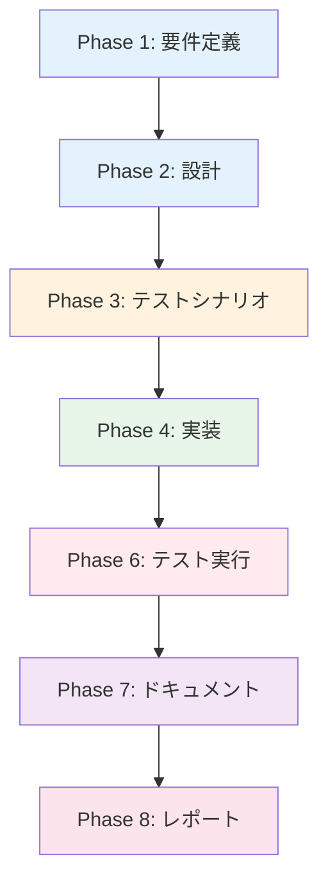

# プロジェクト計画書: AI Workflow用シードジョブの設定ファイル分離

## Issue情報

- **Issue番号**: #479
- **タイトル**: [Feature] AI Workflow用シードジョブの設定ファイル分離
- **URL**: https://github.com/tielec/infrastructure-as-code/issues/479
- **関連Issue**: #477 ([Feature] AI Workflow用のシードジョブを分離)

## 1. Issue分析

### 複雑度
**簡単**

### 見積もり工数
**3~5時間**

#### 根拠
- 新規ファイル作成: 2ファイル（job-config.yaml、folder-config.yaml）
- 既存ファイル修正: 3ファイル（2つのJenkinsfile、2つのYAML設定ファイル）
- 作業内容は明確で、既存設定のコピー・編集と除外処理の削除が中心
- テストは両シードジョブの実行確認のみで済む
- 依存関係が少なく、他システムへの影響範囲が限定的

#### 工数内訳
- 新規設定ファイル作成: 1~1.5時間
- 既存設定ファイル修正: 1時間
- Jenkinsfile修正: 0.5時間
- 動作確認とテスト: 1~2時間

### リスク評価
**低**

#### 理由
- 影響範囲が明確（シードジョブの設定ファイルのみ）
- 既存の動作を分離するだけで、新機能追加ではない
- ロールバックが容易（Git revertで復元可能）
- シードジョブは管理タスクのため、本番サービスへの直接的影響はない

## 2. 実装戦略判断

### 実装戦略: CREATE

#### 判断根拠
このタスクは主に**新規ファイルの作成**が中心です：

**CREATE要素**:
- `jenkins/jobs/pipeline/_seed/ai-workflow-job-creator/job-config.yaml` - 新規作成
- `jenkins/jobs/pipeline/_seed/ai-workflow-job-creator/folder-config.yaml` - 新規作成

**REFACTOR要素**（副次的）:
- `job-creator/job-config.yaml` - AI Workflow定義の削除
- `job-creator/folder-config.yaml` - AI Workflowフォルダ定義の削除
- `job-creator/Jenkinsfile` - 除外ロジックの削除（コード簡素化）
- `ai-workflow-job-creator/Jenkinsfile` - パス参照の更新

新規ファイル作成が作業の中心であり、既存ファイルの修正は削除とパス変更のみのため、**CREATE**戦略が適切です。

### テスト戦略: INTEGRATION_ONLY

#### 判断根拠
このタスクには単体テストが不要であり、統合テストのみで十分です：

**INTEGRATION_ONLYが適切な理由**:
- **設定ファイル中心**: YAMLファイルとJenkinsfileの修正のみ
- **ロジックなし**: 複雑なビジネスロジックや計算処理が存在しない
- **統合確認が重要**: 2つのシードジョブが正しく独立して動作するかの確認が主要な検証ポイント
- **Jenkins環境での実行確認**: 設定ファイルの文法チェックだけでなく、実際のジョブ作成が成功するかの確認が必須

**統合テスト内容**:
1. job-creator シードジョブの実行 → AI Workflow以外のジョブが作成されることを確認
2. ai-workflow-job-creator シードジョブの実行 → AI Workflow関連の5ジョブのみが作成されることを確認
3. 両シードジョブの並行実行 → 競合が発生しないことを確認

### テストコード戦略: 該当なし

#### 判断根拠
このタスクはテストコード実装が不要です：

**テストコード不要な理由**:
- **設定ファイルのみの変更**: 実行可能なコードではなく、YAMLとGroovy DSLの宣言的な設定
- **Jenkins内蔵の検証機能**: Job DSLプラグインが設定ファイルの文法と整合性を自動検証
- **手動実行による確認**: シードジョブの実行結果を目視確認することが最も確実
- **自動テスト作成コスト**: 設定ファイルのテストコードを書くコストが、手動確認のコストを上回る

**検証方法**:
- シードジョブの手動実行による動作確認（Phase 6: テスト実行で実施）
- 作成されたジョブの存在確認とパラメータ検証

## 3. 影響範囲分析

### 既存コードへの影響

#### 変更が必要なファイル
1. **jenkins/jobs/pipeline/_seed/ai-workflow-job-creator/job-config.yaml** (新規作成)
   - AI Workflow関連の5ジョブ定義を記載
   - job-creator/job-config.yaml からコピーして編集

2. **jenkins/jobs/pipeline/_seed/ai-workflow-job-creator/folder-config.yaml** (新規作成)
   - AI_Workflowフォルダ定義（親 + develop + stable 1-9）を記載
   - job-creator/folder-config.yaml からコピーして編集

3. **jenkins/jobs/pipeline/_seed/ai-workflow-job-creator/Jenkinsfile** (修正)
   - `JOB_CONFIG_PATH` の値を変更
   - `FOLDER_CONFIG_PATH` の値を変更

4. **jenkins/jobs/pipeline/_seed/job-creator/job-config.yaml** (修正)
   - AI Workflow関連の5ジョブ定義を削除（行274-310）

5. **jenkins/jobs/pipeline/_seed/job-creator/folder-config.yaml** (修正)
   - AI_Workflowフォルダ定義を削除（行323-515）

6. **jenkins/jobs/pipeline/_seed/job-creator/Jenkinsfile** (修正)
   - AI Workflow除外ロジックを削除（行127-133）
   - ジョブカウントのログ出力を修正

### 依存関係の変更
**なし**

- 新規依存の追加なし
- 既存依存の変更なし
- パッケージ・ライブラリの変更なし

### マイグレーション要否
**不要**

- データベーススキーマ変更なし
- 設定ファイルフォーマット変更なし
- 既存ジョブへの影響なし（シードジョブは既存ジョブを再作成するだけ）

## 4. タスク分割

### Phase 1: 要件定義 (見積もり: 0.5h)

- [ ] Task 1-1: AI Workflow専用設定ファイルの要件確認 (0.25h)
  - job-config.yaml に含めるべきジョブ定義の特定（5ジョブ）
  - folder-config.yaml に含めるべきフォルダ定義の特定（11フォルダ）
  - 既存ファイルとの差分の明確化

- [ ] Task 1-2: 除外ロジック削除の影響範囲確認 (0.25h)
  - job-creator/Jenkinsfile の除外ロジック箇所の特定
  - 除外ロジック削除後の動作検証ポイントの洗い出し

### Phase 2: 設計 (見積もり: 0.5h)

- [x] Task 2-1: 設定ファイル分離の設計 (0.5h)
  - job-config.yaml の構造設計（AI Workflow関連ジョブのみ抽出）
  - folder-config.yaml の構造設計（AI_Workflowフォルダのみ抽出）
  - パス参照の変更箇所リストアップ

### Phase 3: テストシナリオ (見積もり: 0.5h)

- [ ] Task 3-1: 統合テストシナリオの作成 (0.5h)
  - job-creator シードジョブの実行テスト手順
  - ai-workflow-job-creator シードジョブの実行テスト手順
  - 並行実行テストの手順
  - 期待される結果の定義

### Phase 4: 実装 (見積もり: 2~3h)

- [x] Task 4-1: AI Workflow専用設定ファイルの作成 (1~1.5h)
  - job-config.yaml の作成（5ジョブ定義をコピー）
  - folder-config.yaml の作成（11フォルダ定義をコピー）
  - ファイルフォーマットと構文の確認

- [x] Task 4-2: ai-workflow-job-creator/Jenkinsfile の修正 (0.25h)
  - JOB_CONFIG_PATH の値を新規ファイルパスに変更
  - FOLDER_CONFIG_PATH の値を新規ファイルパスに変更

- [x] Task 4-3: 共通設定ファイルからAI Workflow定義を削除 (0.5h)
  - job-creator/job-config.yaml からAI Workflow関連ジョブを削除
  - job-creator/folder-config.yaml からAI_Workflowフォルダ定義を削除

- [x] Task 4-4: job-creator/Jenkinsfile の簡素化 (0.25~0.5h)
  - AI Workflow除外ロジックの削除（行127-133）
  - ログ出力の修正（ジョブカウント表示）
  - コードの可読性向上

### Phase 5: テストコード実装 (見積もり: 0h)

**該当なし**（設定ファイルのため自動テストコード不要）

### Phase 6: テスト実行 (見積もり: 1~2h)

- [ ] Task 6-1: job-creator シードジョブの動作確認 (0.5~1h)
  - シードジョブの手動実行
  - AI Workflow関連ジョブが作成されないことの確認
  - 一般ジョブが正常に作成されることの確認
  - ログ出力の検証

- [ ] Task 6-2: ai-workflow-job-creator シードジョブの動作確認 (0.5~1h)
  - シードジョブの手動実行
  - AI Workflow関連の5ジョブのみが作成されることの確認
  - AI_Workflowフォルダ構造の検証（親 + develop + stable 1-9）
  - ジョブパラメータの検証

### Phase 7: ドキュメント (見積もり: 0.5h)

- [x] Task 7-1: README更新の確認 (0.25h)
  - jenkins/README.md の更新要否確認
  - 必要に応じてシードジョブの説明を更新

- [x] Task 7-2: コミットメッセージとPR説明の作成 (0.25h)
  - 変更内容の要約
  - 動作確認結果の記載
  - 関連Issueへのリンク

### Phase 8: レポート (見積もり: 0.5h)

- [x] Task 8-1: 実装結果レポートの作成 (0.5h)
  - 変更ファイル一覧
  - テスト結果サマリー
  - スクリーンショット（シードジョブ実行結果）
  - 今後の課題・改善点

## 5. 依存関係



**注記**: Phase 5（テストコード実装）はスキップ

## 6. リスクと軽減策

### リスク1: シードジョブ実行時の競合
- **影響度**: 低
- **確率**: 低
- **軽減策**:
  - 各シードジョブは独立したジョブセットを管理するため競合しない
  - 念のため、並行実行テストでフォルダ構造の整合性を確認

### リスク2: 設定ファイルのコピーミス
- **影響度**: 中
- **確率**: 中
- **軽減策**:
  - コピー後に差分チェックツール（diff）で確認
  - 不要な定義が残っていないか目視確認
  - シードジョブ実行結果で作成ジョブ数を確認

### リスク3: Jenkinsfile修正ミス
- **影響度**: 中
- **確率**: 低
- **軽減策**:
  - パス文字列は慎重にコピー&ペースト
  - 除外ロジック削除時、周辺コードを誤って削除しないよう注意
  - シンタックスエラーはJenkinsが検出するため、実行前に気づける

### リスク4: ドキュメント更新漏れ
- **影響度**: 低
- **確率**: 中
- **軽減策**:
  - CLAUDE.md のドキュメント更新チェックリストに従う
  - PR作成前にドキュメント更新要否を再確認

## 7. 品質ゲート

### Phase 1: 要件定義
- [ ] AI Workflow関連の5ジョブがリストアップされている
- [ ] AI_Workflowフォルダ定義（11個）がリストアップされている
- [ ] 既存設定ファイルとの差分が明確になっている

### Phase 2: 設計
- [x] 実装戦略（CREATE）の判断根拠が明記されている
- [x] テスト戦略（INTEGRATION_ONLY）の判断根拠が明記されている
- [x] 変更ファイル一覧が作成されている
- [x] パス変更箇所が特定されている

### Phase 3: テストシナリオ
- [x] job-creator のテストシナリオが記載されている
- [x] ai-workflow-job-creator のテストシナリオが記載されている
- [x] 並行実行テストのシナリオが記載されている
- [x] 期待される結果が定義されている

### Phase 4: 実装
- [ ] ai-workflow-job-creator/job-config.yaml が作成されている
- [ ] ai-workflow-job-creator/folder-config.yaml が作成されている
- [ ] ai-workflow-job-creator/Jenkinsfile のパス参照が更新されている
- [ ] job-creator/job-config.yaml からAI Workflow定義が削除されている
- [ ] job-creator/folder-config.yaml からAI_Workflowフォルダ定義が削除されている
- [ ] job-creator/Jenkinsfile から除外ロジックが削除されている

### Phase 6: テスト実行
- [ ] job-creator シードジョブが正常に実行される
- [ ] AI Workflow関連ジョブが作成されない
- [ ] 一般ジョブが正常に作成される
- [ ] ai-workflow-job-creator シードジョブが正常に実行される
- [ ] AI Workflow関連の5ジョブのみが作成される
- [ ] AI_Workflowフォルダ構造（親 + develop + stable 1-9）が正しく作成される

### Phase 7: ドキュメント
- [ ] README.md の更新要否が確認されている
- [ ] 必要に応じてドキュメントが更新されている
- [ ] コミットメッセージが規約に従っている

### Phase 8: レポート
- [x] 変更ファイル一覧が記載されている
- [x] テスト結果が記録されている
- [x] スクリーンショットが添付されている

## 8. 成功基準

このプロジェクトは以下の条件を満たした場合に成功とみなされます：

1. **設定ファイル分離**: AI Workflow専用の設定ファイルが正しく作成されている
2. **独立動作**: 両シードジョブが独立して正常に動作する
3. **除外ロジック削除**: job-creator からAI Workflow関連の除外処理が削除されている
4. **コード簡素化**: job-creator/Jenkinsfile が簡潔になっている
5. **テスト完了**: すべての統合テストが成功している
6. **ドキュメント整備**: 必要なドキュメントが更新されている

## 9. 補足情報

### Issue #477 との関連
- Issue #477 で ai-workflow-job-creator が作成された
- 本Issue (#479) でその設定ファイルを完全分離する
- 2段階で実施することで段階的な検証が可能

### ファイル構造
```
jenkins/jobs/pipeline/_seed/
├── job-creator/
│   ├── Jenkinsfile                 # 修正: 除外ロジック削除
│   ├── job-config.yaml             # 修正: AI Workflow定義削除
│   └── folder-config.yaml          # 修正: AI_Workflowフォルダ削除
└── ai-workflow-job-creator/
    ├── Jenkinsfile                 # 修正: パス参照更新
    ├── job-config.yaml             # 新規作成
    └── folder-config.yaml          # 新規作成
```

### AI Workflow関連ジョブ一覧（5個）
1. ai_workflow_all_phases_job
2. ai_workflow_preset_job
3. ai_workflow_single_phase_job
4. ai_workflow_rollback_job
5. ai_workflow_auto_issue_job

### AI_Workflowフォルダ定義一覧（11個）
1. AI_Workflow（親フォルダ）
2. AI_Workflow/develop
3. AI_Workflow/stable-1
4. AI_Workflow/stable-2
5. AI_Workflow/stable-3
6. AI_Workflow/stable-4
7. AI_Workflow/stable-5
8. AI_Workflow/stable-6
9. AI_Workflow/stable-7
10. AI_Workflow/stable-8
11. AI_Workflow/stable-9

---

**作成日**: 2025年1月19日
**最終更新**: 2025年1月19日
**ステータス**: Draft
