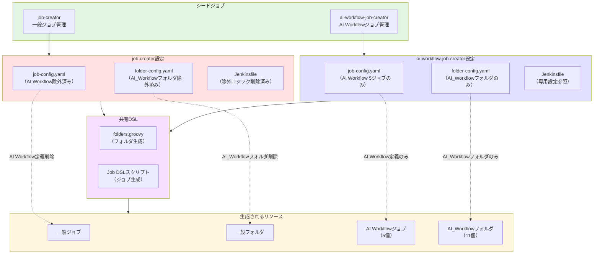
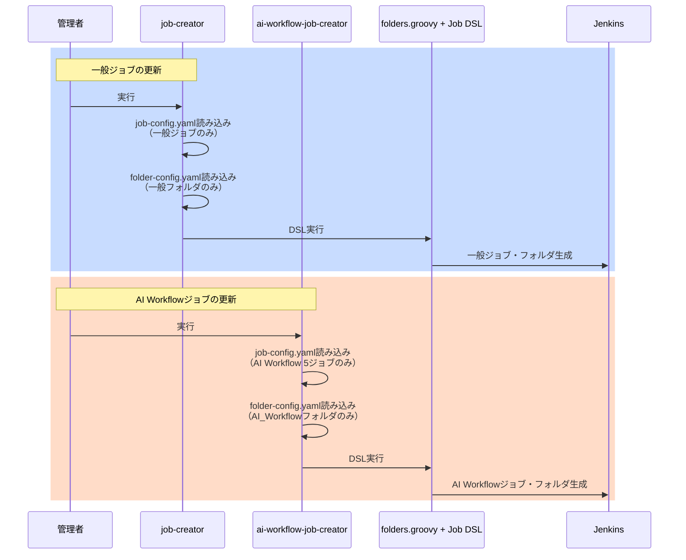
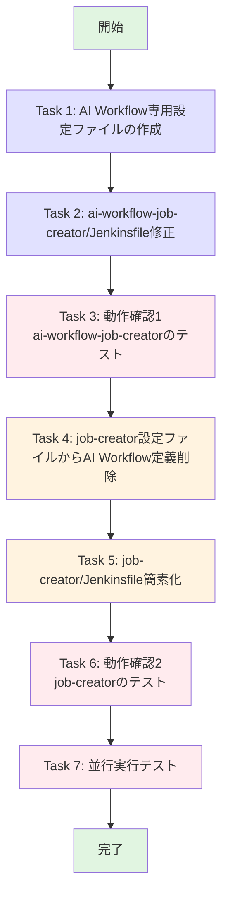

# 詳細設計書: AI Workflow用シードジョブの設定ファイル分離

## Issue情報

- **Issue番号**: #479
- **タイトル**: [Feature] AI Workflow用シードジョブの設定ファイル分離
- **URL**: https://github.com/tielec/infrastructure-as-code/issues/479
- **関連Issue**: #477 ([Feature] AI Workflow用のシードジョブを分離)
- **作成日**: 2025年1月19日

---

## 0. Planning Documentの確認

### 開発計画の概要

Planning Document（planning.md）より、以下の開発方針が策定されています：

- **実装戦略**: CREATE（新規ファイル作成が中心、既存ファイルは削除とパス変更のみ）
- **テスト戦略**: INTEGRATION_ONLY（設定ファイル中心のため単体テスト不要）
- **テストコード戦略**: 該当なし（Job DSLプラグインによる自動検証を活用）
- **複雑度**: 簡単
- **見積もり工数**: 3~5時間
- **リスク評価**: 低（影響範囲が明確、ロールバック容易）

### 品質ゲート（Phase 2）

Planning Documentで定義された以下の品質ゲートを満たすことを確認しました：

- [x] **実装戦略の判断根拠が明記されている**
- [x] **テスト戦略の判断根拠が明記されている**
- [x] **既存コードへの影響範囲が分析されている**
- [x] **変更が必要なファイルがリストアップされている**
- [ ] **設計が実装可能である** ← 本ドキュメントで確認

---

## 1. アーキテクチャ設計

### 1.1 システム全体図



### 1.2 コンポーネント間の関係

#### 分離前の問題点

```
job-creator:
  ├─ job-config.yaml (全ジョブ定義 + AI Workflow 5ジョブ)
  ├─ folder-config.yaml (全フォルダ + AI_Workflow 11フォルダ)
  └─ Jenkinsfile (除外ロジックでAI Workflowを除外)

ai-workflow-job-creator:
  └─ Jenkinsfile (job-creatorの設定を参照)
```

**問題**:
- 設定ファイルの共有により、一方の変更が他方に影響
- 除外ロジックが冗長で保守性が低い
- 設定ファイルが肥大化

#### 分離後の構成

```
job-creator:
  ├─ job-config.yaml (一般ジョブのみ)
  ├─ folder-config.yaml (一般フォルダのみ)
  └─ Jenkinsfile (除外ロジック削除、シンプル化)

ai-workflow-job-creator:
  ├─ job-config.yaml (AI Workflow 5ジョブのみ) ← 新規作成
  ├─ folder-config.yaml (AI_Workflow 11フォルダのみ) ← 新規作成
  └─ Jenkinsfile (専用設定参照に変更)
```

**効果**:
- 完全な分離により影響範囲が明確
- 除外ロジック不要でコードが簡潔
- 各シードジョブの責務が明確

### 1.3 データフロー



---

## 2. 実装戦略判断

### 実装戦略: CREATE

**判断根拠**:

このタスクは主に**新規ファイルの作成**が中心です：

**CREATE要素**（主要）:
- `jenkins/jobs/pipeline/_seed/ai-workflow-job-creator/job-config.yaml` - 新規作成
- `jenkins/jobs/pipeline/_seed/ai-workflow-job-creator/folder-config.yaml` - 新規作成

**REFACTOR要素**（副次的）:
- `job-creator/job-config.yaml` - AI Workflow定義の削除
- `job-creator/folder-config.yaml` - AI_Workflowフォルダ定義の削除
- `job-creator/Jenkinsfile` - 除外ロジックの削除（コード簡素化）
- `ai-workflow-job-creator/Jenkinsfile` - パス参照の更新

**新規ファイル作成が作業の中心**であり、既存ファイルの修正は削除とパス変更のみのため、**CREATE**戦略が適切です。

---

## 3. テスト戦略判断

### テスト戦略: INTEGRATION_ONLY

**判断根拠**:

このタスクには単体テストが不要であり、統合テストのみで十分です：

**INTEGRATION_ONLYが適切な理由**:
- **設定ファイル中心**: YAMLファイルとJenkinsfileの修正のみ
- **ロジックなし**: 複雑なビジネスロジックや計算処理が存在しない
- **統合確認が重要**: 2つのシードジョブが正しく独立して動作するかの確認が主要な検証ポイント
- **Jenkins環境での実行確認**: 設定ファイルの文法チェックだけでなく、実際のジョブ作成が成功するかの確認が必須

**統合テスト内容**:
1. job-creator シードジョブの実行 → AI Workflow以外のジョブが作成されることを確認
2. ai-workflow-job-creator シードジョブの実行 → AI Workflow関連の5ジョブのみが作成されることを確認
3. 両シードジョブの並行実行 → 競合が発生しないことを確認

---

## 4. テストコード戦略判断

### テストコード戦略: 該当なし

**判断根拠**:

このタスクはテストコード実装が不要です：

**テストコード不要な理由**:
- **設定ファイルのみの変更**: 実行可能なコードではなく、YAMLとGroovy DSLの宣言的な設定
- **Jenkins内蔵の検証機能**: Job DSLプラグインが設定ファイルの文法と整合性を自動検証
- **手動実行による確認**: シードジョブの実行結果を目視確認することが最も確実
- **自動テスト作成コスト**: 設定ファイルのテストコードを書くコストが、手動確認のコストを上回る

**検証方法**:
- シードジョブの手動実行による動作確認（詳細はセクション10で定義）
- 作成されたジョブの存在確認とパラメータ検証

---

## 5. 影響範囲分析

### 5.1 既存コードへの影響

#### 変更が必要なファイル

1. **jenkins/jobs/pipeline/_seed/ai-workflow-job-creator/job-config.yaml** (新規作成)
   - AI Workflow関連の5ジョブ定義を記載
   - job-creator/job-config.yaml からコピーして編集

2. **jenkins/jobs/pipeline/_seed/ai-workflow-job-creator/folder-config.yaml** (新規作成)
   - AI_Workflowフォルダ定義（親 + develop + stable 1-9）を記載
   - job-creator/folder-config.yaml からコピーして編集

3. **jenkins/jobs/pipeline/_seed/ai-workflow-job-creator/Jenkinsfile** (修正)
   - `JOB_CONFIG_PATH` の値を変更
   - `FOLDER_CONFIG_PATH` の値を変更

4. **jenkins/jobs/pipeline/_seed/job-creator/job-config.yaml** (修正)
   - AI Workflow関連の5ジョブ定義を削除（行274-310）

5. **jenkins/jobs/pipeline/_seed/job-creator/folder-config.yaml** (修正)
   - AI_Workflowフォルダ定義を削除（行323-515）

6. **jenkins/jobs/pipeline/_seed/job-creator/Jenkinsfile** (修正)
   - AI Workflow除外ロジックを削除（行127-133）
   - ジョブカウントのログ出力を修正

#### 変更が不要なファイル

- `jenkins/jobs/dsl/folders.groovy` - フォルダ生成ロジックは変更不要
- `jenkins/jobs/dsl/ai-workflow/*.groovy` - AI WorkflowのDSLファイルは変更不要
- その他のJob DSLファイル - 影響なし

### 5.2 依存関係の変更

**なし**

- 新規依存の追加なし
- 既存依存の変更なし
- パッケージ・ライブラリの変更なし

### 5.3 マイグレーション要否

**不要**

- データベーススキーマ変更なし
- 設定ファイルフォーマット変更なし
- 既存ジョブへの影響なし（シードジョブは既存ジョブを再作成するだけ）

---

## 6. 変更・追加ファイルリスト

### 6.1 新規作成ファイル

| No | ファイルパス | 説明 |
|----|-------------|------|
| 1 | `jenkins/jobs/pipeline/_seed/ai-workflow-job-creator/job-config.yaml` | AI Workflow関連5ジョブの定義 |
| 2 | `jenkins/jobs/pipeline/_seed/ai-workflow-job-creator/folder-config.yaml` | AI_Workflowフォルダ定義（11個） |

### 6.2 修正が必要な既存ファイル

| No | ファイルパス | 修正内容 | 行数 |
|----|-------------|----------|------|
| 1 | `jenkins/jobs/pipeline/_seed/ai-workflow-job-creator/Jenkinsfile` | パス参照を専用設定ファイルに変更 | 7-8 |
| 2 | `jenkins/jobs/pipeline/_seed/job-creator/job-config.yaml` | AI Workflow関連ジョブ定義を削除 | 274-310 |
| 3 | `jenkins/jobs/pipeline/_seed/job-creator/folder-config.yaml` | AI_Workflowフォルダ定義を削除 | 323-515 |
| 4 | `jenkins/jobs/pipeline/_seed/job-creator/Jenkinsfile` | AI Workflow除外ロジックを削除 | 127-133 |

### 6.3 削除が必要なファイル

**なし**

---

## 7. 詳細設計

### 7.1 新規作成ファイルの設計

#### 7.1.1 ai-workflow-job-creator/job-config.yaml

**目的**: AI Workflow関連の5ジョブのみを定義する設定ファイル

**構造**:
```yaml
# JobDSL設定ファイル - AI Workflow専用

# 共通設定
common-settings:
  # Jenkinsパイプラインリポジトリ設定
  jenkins-pipeline-repo:
    url: 'https://github.com/tielec/infrastructure-as-code'
    credentials: 'github-app-credentials'
    branch: '*/main'

# AI Workflow専用ジョブ定義
jenkins-jobs:
  # AI Workflow Jobs（新しいジョブ構成）
  # 注意: これらのジョブはai-workflow-agentリポジトリのJenkinsfileを使用するため
  # skipJenkinsfileValidation: true を設定してローカル存在チェックをスキップ
  ai_workflow_all_phases_job:
    name: 'all_phases'
    displayName: 'All Phases Execution'
    dslfile: jenkins/jobs/dsl/ai-workflow/ai_workflow_all_phases_job.groovy
    jenkinsfile: Jenkinsfile
    skipJenkinsfileValidation: true

  ai_workflow_preset_job:
    name: 'preset'
    displayName: 'Preset Execution'
    dslfile: jenkins/jobs/dsl/ai-workflow/ai_workflow_preset_job.groovy
    jenkinsfile: Jenkinsfile
    skipJenkinsfileValidation: true

  ai_workflow_single_phase_job:
    name: 'single_phase'
    displayName: 'Single Phase Execution'
    dslfile: jenkins/jobs/dsl/ai-workflow/ai_workflow_single_phase_job.groovy
    jenkinsfile: Jenkinsfile
    skipJenkinsfileValidation: true

  ai_workflow_rollback_job:
    name: 'rollback'
    displayName: 'Rollback Execution'
    dslfile: jenkins/jobs/dsl/ai-workflow/ai_workflow_rollback_job.groovy
    jenkinsfile: Jenkinsfile
    skipJenkinsfileValidation: true

  ai_workflow_auto_issue_job:
    name: 'auto_issue'
    displayName: 'Auto Issue Creation'
    dslfile: jenkins/jobs/dsl/ai-workflow/ai_workflow_auto_issue_job.groovy
    jenkinsfile: Jenkinsfile
    skipJenkinsfileValidation: true
```

**抽出元**: `job-creator/job-config.yaml` の行274-310

**検証ポイント**:
- YAML構文の正確性
- 5ジョブすべてが含まれること
- `skipJenkinsfileValidation: true` が設定されていること

#### 7.1.2 ai-workflow-job-creator/folder-config.yaml

**目的**: AI_Workflowフォルダ定義（11個）のみを定義する設定ファイル

**構造**:
```yaml
# Jenkins フォルダ構造設定ファイル - AI Workflow専用

# フォルダ定義（フラット構造）
folders:
  # AI駆動開発フォルダ（親フォルダ）
  - path: "AI_Workflow"
    displayName: "50. [AI] AI駆動開発"
    description: |
      このフォルダーには、AI駆動開発自動化ワークフローのジョブが含まれています。

      ### 概要
      GitHub IssueからPR作成まで、Claude AIが自動的に開発プロセスを実行します。
      実行モードごとにジョブが分割され、リポジトリ別に整理されています。

      ### ジョブ構成
      各リポジトリ配下に以下のジョブが配置されます：
      * **all_phases** - 全フェーズ一括実行（planning → evaluation）
      * **preset** - プリセット実行（quick-fix, implementation等）
      * **single_phase** - 単一フェーズ実行
      * **rollback** - フェーズ差し戻し実行
      * **auto_issue** - AIによる自動Issue作成

      ### パラメータ削減効果
      実行モードごとの分割により、パラメータ数を24個 → 8〜15個に削減しました。

      ### 主な機能
      * **自動要件定義** - GitHub Issueから要件定義書を生成
      * **自動設計** - 詳細設計書とアーキテクチャドキュメントを生成
      * **自動テストシナリオ** - BDD形式のテストシナリオを生成
      * **自動実装** - コードの自動生成と既存コードの拡張
      * **自動テスト** - テストの実行と結果検証
      * **自動ドキュメント** - README、APIドキュメントを生成

      ### 必要な認証情報
      * **claude-api-key**: Claude API キー（Jenkinsクレデンシャル）
      * **github-token**: GitHub Token（Jenkinsクレデンシャル）

  # Issue #470: AI Workflow用フォルダをリポジトリ非依存の汎用フォルダのみに変更
  # 更新日: 2025-01-17
  # URL: https://github.com/tielec/infrastructure-as-code/issues/470
  #
  # 構成:
  # - Develop: 1フォルダ（最新機能のテスト用）
  # - Stable: 9フォルダ（安定バージョン、並行実行可能）

  # AI Workflow - Develop用フォルダ
  - path: "AI_Workflow/develop"
    displayName: "AI Workflow Executor - Develop"
    description: |
      developブランチ用のワークフロー実行環境

      ### 用途
      - ai-workflow-agentの**最新バージョン**（developブランチ）を使用
      - 新機能のテスト、実験的な利用

      ### 対象ブランチ
      - ai-workflow-agent: **develop**

      ### 注意事項
      - 開発中の機能のため、動作が不安定な場合があります
      - 安定した動作が必要な場合はStableフォルダを使用してください

  # AI Workflow - Stable用フォルダ（1〜9）
  - path: "AI_Workflow/stable-1"
    displayName: "AI Workflow Executor - Stable 1"
    description: |
      mainブランチ用のワークフロー実行環境（Stable 1）

      ### 用途
      - ai-workflow-agentの**安定バージョン**（mainブランチ）を使用
      - 本番環境での利用、安定した動作が求められる場合

      ### 対象ブランチ
      - ai-workflow-agent: **main**

      ### 並行利用について
      - Stableフォルダは9つあり、複数のワークフローを同時実行可能です

  # stable-2 から stable-9 まで同様の定義を繰り返し
  # （省略）
```

**抽出元**: `job-creator/folder-config.yaml` の行323-515

**検証ポイント**:
- YAML構文の正確性
- 11フォルダすべてが含まれること（親 + develop + stable 1-9）
- フォルダパスが正確であること

### 7.2 既存ファイルの修正設計

#### 7.2.1 ai-workflow-job-creator/Jenkinsfile

**修正内容**: パス参照を専用設定ファイルに変更

**変更前**:
```groovy
environment {
    JOB_CONFIG_PATH = 'jenkins/jobs/pipeline/_seed/job-creator/job-config.yaml'
    FOLDER_CONFIG_PATH = 'jenkins/jobs/pipeline/_seed/job-creator/folder-config.yaml'
    FOLDERS_DSL_PATH = 'jenkins/jobs/dsl/folders.groovy'
}
```

**変更後**:
```groovy
environment {
    JOB_CONFIG_PATH = 'jenkins/jobs/pipeline/_seed/ai-workflow-job-creator/job-config.yaml'
    FOLDER_CONFIG_PATH = 'jenkins/jobs/pipeline/_seed/ai-workflow-job-creator/folder-config.yaml'
    FOLDERS_DSL_PATH = 'jenkins/jobs/dsl/folders.groovy'
}
```

**影響範囲**:
- Jenkinsfileの行7-8のみ
- 実行ロジックは変更なし

#### 7.2.2 job-creator/job-config.yaml

**修正内容**: AI Workflow関連ジョブ定義を削除

**削除対象行**: 274-310

**削除するジョブ定義**:
- `ai_workflow_all_phases_job`
- `ai_workflow_preset_job`
- `ai_workflow_single_phase_job`
- `ai_workflow_rollback_job`
- `ai_workflow_auto_issue_job`

**注意事項**:
- 削除後もYAML構文が正しいこと
- 他のジョブ定義（272行目以前、311行目以降）に影響がないこと

#### 7.2.3 job-creator/folder-config.yaml

**修正内容**: AI_Workflowフォルダ定義を削除

**削除対象行**: 323-515

**削除するフォルダ定義**:
- `AI_Workflow` (親フォルダ)
- `AI_Workflow/develop`
- `AI_Workflow/stable-1` ～ `AI_Workflow/stable-9`

**注意事項**:
- 削除後もYAML構文が正しいこと
- 動的フォルダ生成ルール（517行目以降）に影響がないこと

#### 7.2.4 job-creator/Jenkinsfile

**修正内容**: AI Workflow除外ロジックを削除

**削除対象行**: 127-133

**削除するコードブロック**:
```groovy
// AI Workflow関連ジョブを除外
def excludedJobPrefixes = ['ai_workflow_']
def jobsToProcess = jobConfig['jenkins-jobs'].findAll { jobKey, jobDef ->
    !excludedJobPrefixes.any { prefix -> jobKey.startsWith(prefix) }
}

echo "AI Workflow jobs excluded: ${jobConfig['jenkins-jobs'].size() - jobsToProcess.size()}"
```

**変更後のコード**:
```groovy
// 各ジョブのDSLファイルを追加
jobConfig['jenkins-jobs'].each { jobKey, jobDef ->
    if (jobDef.dslfile) {
        dslFiles.add(jobDef.dslfile)
    }
}
```

**影響範囲**:
- 行127-140が影響を受ける
- ログ出力の「AI Workflow jobs excluded」メッセージが削除される
- ジョブカウントのログ出力は維持される

**修正後のログ出力**:
```groovy
echo "=== Job DSL Execution Plan ==="
echo "Total DSL files: ${dslFiles.size()}"
echo "Jobs to create: ${jobConfig['jenkins-jobs'].size()}"
echo "Folders to create: ${folderConfig.folders?.size() ?: 0}"
```

---

## 8. データ構造設計

### 8.1 job-config.yaml の構造

```yaml
# ルート構造
root:
  common-settings:        # 共通設定セクション
    jenkins-pipeline-repo:  # パイプラインリポジトリ設定
      url: String
      credentials: String
      branch: String

  jenkins-jobs:           # ジョブ定義セクション
    {job_key}:           # ジョブキー（例: ai_workflow_all_phases_job）
      name: String           # Jenkins上のジョブ名
      displayName: String    # UI表示名
      dslfile: String       # DSLファイルパス
      jenkinsfile: String   # Jenkinsfileパス
      skipJenkinsfileValidation: Boolean  # Jenkinsfile検証スキップフラグ
```

### 8.2 folder-config.yaml の構造

```yaml
# ルート構造
root:
  folders:                # フォルダ定義セクション（配列）
    - path: String          # フォルダパス（例: "AI_Workflow"）
      displayName: String   # UI表示名
      description: String   # Markdown形式の説明

  dynamic_folders:        # 動的フォルダ生成ルール（オプション）
    - parent_path: String
      source: String
      template:
        path_suffix: String
        displayName: String
        description: String
```

### 8.3 Jenkinsfile の環境変数

```groovy
environment {
    JOB_CONFIG_PATH: String        // job-config.yamlのパス
    FOLDER_CONFIG_PATH: String     // folder-config.yamlのパス
    FOLDERS_DSL_PATH: String       // folders.groovyのパス
}
```

---

## 9. インターフェース設計

### 9.1 シードジョブ間のインターフェース

#### job-creator

**入力**:
- `jenkins/jobs/pipeline/_seed/job-creator/job-config.yaml` (一般ジョブのみ)
- `jenkins/jobs/pipeline/_seed/job-creator/folder-config.yaml` (一般フォルダのみ)

**出力**:
- 一般ジョブの作成・更新・削除
- 一般フォルダの作成・更新・削除

**制約**:
- AI Workflowジョブ（`ai_workflow_`プレフィックス）は処理しない
- AI_Workflowフォルダは処理しない

#### ai-workflow-job-creator

**入力**:
- `jenkins/jobs/pipeline/_seed/ai-workflow-job-creator/job-config.yaml` (AI Workflowジョブのみ)
- `jenkins/jobs/pipeline/_seed/ai-workflow-job-creator/folder-config.yaml` (AI_Workflowフォルダのみ)

**出力**:
- AI Workflowジョブの作成・更新・削除（5個）
- AI_Workflowフォルダの作成・更新・削除（11個）

**制約**:
- AI Workflowジョブのみを処理する
- AI_Workflowフォルダのみを処理する

### 9.2 共有DSLとのインターフェース

#### folders.groovy

**入力**（binding変数）:
- `jenkinsFoldersConfig`: folder-config.yamlの内容

**出力**:
- Jenkinsフォルダの作成

**動作**:
- `folders` 配列の各要素を処理
- `dynamic_folders` ルールに基づいて動的フォルダを生成
- パスの深さ順にソートして親フォルダから作成

#### Job DSLスクリプト

**入力**（binding変数）:
- `jenkinsJobsConfig`: job-config.yamlの`jenkins-jobs`セクション
- `commonSettings`: job-config.yamlの`common-settings`セクション

**出力**:
- Jenkinsジョブの作成

**動作**:
- ジョブキーごとにJob DSL APIを呼び出し
- パラメータ、トリガー、パイプライン定義を設定

---

## 10. セキュリティ考慮事項

### 10.1 認証・認可

**現状**:
- シードジョブの実行権限は管理者のみ（Admin_Jobsフォルダ配下）
- Job DSLプラグインのScript Security機能により、承認されたスクリプトのみ実行可能

**変更後の影響**:
- 変更なし（セキュリティ設定は既存のまま）

### 10.2 データ保護

**設定ファイルの機密性**:
- job-config.yaml、folder-config.yaml はGitで管理
- 機密情報（クレデンシャルID等）はハードコーディングせず、環境変数で参照

**変更後の影響**:
- 新規作成ファイルも同様のポリシーに従う
- クレデンシャルIDは `common-settings.jenkins-pipeline-repo.credentials` で管理

### 10.3 セキュリティリスクと対策

| リスク | 影響度 | 対策 |
|--------|--------|------|
| 設定ファイルの不正な変更 | 中 | Git履歴による変更追跡、PRレビュー |
| シードジョブの不正実行 | 中 | 管理者権限による実行制限 |
| DSLスクリプトの脆弱性 | 低 | Script Securityによる承認制 |

---

## 11. 非機能要件への対応

### 11.1 パフォーマンス

**実行時間**:
- job-creator: 約30-60秒（一般ジョブの数に依存）
- ai-workflow-job-creator: 約10-20秒（5ジョブのみ）

**最適化**:
- AI Workflowジョブのみ更新する場合、ai-workflow-job-creatorのみ実行すればよい
- 除外ロジックの削除により、job-creatorの処理がシンプル化

### 11.2 スケーラビリティ

**ジョブ数の増加への対応**:
- 設定ファイルの分離により、各シードジョブの処理範囲が明確
- 新規ジョブ追加時、適切な設定ファイルのみを編集すればよい

**将来的な拡張**:
- 他のジョブカテゴリ（Lambda、Pulumi等）も同様のパターンで分離可能

### 11.3 保守性

**コードの可読性**:
- 除外ロジックの削除により、Jenkinsfileがシンプル化
- 各シードジョブの責務が明確

**設定の一元管理**:
- 各シードジョブが独立した設定ファイルを持つため、変更影響範囲が明確
- 設定ファイルの肥大化を防止

**ドキュメント**:
- 各設定ファイルにコメントで目的を記載
- CLAUDE.mdに分離パターンのベストプラクティスを記載

---

## 12. 実装の順序

### 12.1 推奨実装順序



### 12.2 各タスクの詳細

#### Task 1: AI Workflow専用設定ファイルの作成

**目的**: ai-workflow-job-creator専用の設定ファイルを作成

**手順**:
1. `job-creator/job-config.yaml` の行274-310をコピー
2. `ai-workflow-job-creator/job-config.yaml` として保存
3. `job-creator/folder-config.yaml` の行323-515をコピー
4. `ai-workflow-job-creator/folder-config.yaml` として保存
5. YAML構文チェック

**検証**:
- YAMLファイルが正しくパースできること
- 5ジョブ定義が含まれること
- 11フォルダ定義が含まれること

#### Task 2: ai-workflow-job-creator/Jenkinsfile修正

**目的**: パス参照を専用設定ファイルに変更

**手順**:
1. `ai-workflow-job-creator/Jenkinsfile` を開く
2. 行7-8のパス定義を変更
3. 構文チェック

**検証**:
- Groovy構文エラーがないこと
- パスが正しいこと

#### Task 3: 動作確認1 - ai-workflow-job-creatorのテスト

**目的**: 新規設定ファイルが正しく動作することを確認

**手順**:
1. Jenkins UIで `ai-workflow-job-creator` を実行
2. ジョブ作成結果を確認
3. フォルダ構造を確認

**検証**:
- AI Workflow関連の5ジョブが作成されること
- AI_Workflowフォルダ（11個）が作成されること
- エラーログがないこと

#### Task 4: job-creator設定ファイルからAI Workflow定義削除

**目的**: 共通設定ファイルからAI Workflow定義を削除

**手順**:
1. `job-creator/job-config.yaml` の行274-310を削除
2. `job-creator/folder-config.yaml` の行323-515を削除
3. YAML構文チェック

**検証**:
- YAMLファイルが正しくパースできること
- AI Workflow定義が含まれないこと
- 一般ジョブ定義は残っていること

#### Task 5: job-creator/Jenkinsfile簡素化

**目的**: 除外ロジックを削除してコードを簡素化

**手順**:
1. `job-creator/Jenkinsfile` を開く
2. 行127-133の除外ロジックを削除
3. 行136を修正（`jobsToProcess` → `jobConfig['jenkins-jobs']`）
4. 行143を修正（`jobsToProcess.size()` → `jobConfig['jenkins-jobs'].size()`）
5. 構文チェック

**検証**:
- Groovy構文エラーがないこと
- ログ出力が正しいこと

#### Task 6: 動作確認2 - job-creatorのテスト

**目的**: 修正後のjob-creatorが正しく動作することを確認

**手順**:
1. Jenkins UIで `job-creator` を実行
2. ジョブ作成結果を確認
3. AI Workflowジョブが作成されないことを確認

**検証**:
- 一般ジョブが正常に作成されること
- AI Workflowジョブが作成されないこと
- エラーログがないこと

#### Task 7: 並行実行テスト

**目的**: 両シードジョブの独立性を確認

**手順**:
1. `job-creator` と `ai-workflow-job-creator` を並行実行
2. 競合エラーがないことを確認
3. 全ジョブ・フォルダが正しく作成されることを確認

**検証**:
- 両シードジョブがエラーなく完了すること
- ジョブ・フォルダの重複や欠落がないこと

### 12.3 依存関係の考慮

**依存関係**:
- Task 1 → Task 2: 設定ファイルが存在しないとパス参照が失敗
- Task 2 → Task 3: Jenkinsfile修正後にテスト可能
- Task 3 → Task 4: ai-workflow-job-creatorの動作確認後に削除
- Task 4 → Task 5: 設定ファイル削除後にJenkinsfile修正
- Task 5 → Task 6: Jenkinsfile修正後にテスト可能
- Task 6 → Task 7: 両シードジョブの個別動作確認後に並行テスト

**並行実行可能なタスク**:
- なし（すべて順序依存）

---

## 13. エラーハンドリング

### 13.1 想定されるエラーと対処法

| エラーケース | 原因 | 対処法 |
|------------|------|--------|
| YAML構文エラー | インデント不正、クォート不一致 | YAMLパーサーでチェック、修正 |
| ファイルが見つからない | パス指定ミス | パスを確認、ファイル存在確認 |
| DSLファイルが見つからない | job-config.yamlのパス誤り | DSLファイルのパスを確認 |
| Jenkinsfileが見つからない | job-config.yamlのパス誤り、skipJenkinsfileValidation未設定 | Jenkinsfileパスを確認、フラグ設定 |
| ジョブ作成失敗 | DSLスクリプトエラー | エラーログを確認、DSL修正 |
| フォルダ作成失敗 | パス競合、親フォルダ不在 | フォルダパスを確認、親フォルダ作成 |

### 13.2 ロールバック手順

**Git revert による復元**:
```bash
# 変更前のコミットに戻す
git revert <commit-hash>

# シードジョブを再実行
# Jenkins UI > Admin_Jobs > job-creator > Build Now
# Jenkins UI > Admin_Jobs > ai-workflow-job-creator > Build Now
```

**手動復元**:
1. 変更前のファイルをGit履歴から取得
2. 該当ファイルを上書き
3. シードジョブを再実行

---

## 14. 成功基準

### 14.1 機能要件の達成

- [ ] AI Workflow専用の`job-config.yaml`が作成されている
- [ ] AI Workflow専用の`folder-config.yaml`が作成されている
- [ ] `ai-workflow-job-creator/Jenkinsfile`のパス参照が更新されている
- [ ] `job-creator/job-config.yaml`からAI Workflow定義が削除されている
- [ ] `job-creator/folder-config.yaml`からAI_Workflowフォルダ定義が削除されている
- [ ] `job-creator/Jenkinsfile`から除外ロジックが削除されている

### 14.2 テストの合格

- [ ] `job-creator`シードジョブが正常に実行される
- [ ] AI Workflowジョブが作成されない
- [ ] 一般ジョブが正常に作成される
- [ ] `ai-workflow-job-creator`シードジョブが正常に実行される
- [ ] AI Workflow関連の5ジョブのみが作成される
- [ ] AI_Workflowフォルダ構造（11個）が正しく作成される
- [ ] 両シードジョブの並行実行が成功する

### 14.3 品質基準

- [ ] YAML構文エラーがない
- [ ] Groovy構文エラーがない
- [ ] コードが簡潔になっている（除外ロジック削除）
- [ ] コメントで変更理由が明記されている

---

## 15. 補足情報

### 15.1 AI Workflow関連ジョブ一覧（5個）

| No | ジョブキー | 表示名 | 説明 |
|----|----------|--------|------|
| 1 | `ai_workflow_all_phases_job` | All Phases Execution | 全フェーズ一括実行 |
| 2 | `ai_workflow_preset_job` | Preset Execution | プリセット実行 |
| 3 | `ai_workflow_single_phase_job` | Single Phase Execution | 単一フェーズ実行 |
| 4 | `ai_workflow_rollback_job` | Rollback Execution | ロールバック実行 |
| 5 | `ai_workflow_auto_issue_job` | Auto Issue Creation | 自動Issue作成 |

### 15.2 AI_Workflowフォルダ定義一覧（11個）

| No | フォルダパス | 表示名 | 説明 |
|----|------------|--------|------|
| 1 | `AI_Workflow` | 50. [AI] AI駆動開発 | 親フォルダ |
| 2 | `AI_Workflow/develop` | AI Workflow Executor - Develop | 開発用フォルダ |
| 3 | `AI_Workflow/stable-1` | AI Workflow Executor - Stable 1 | 安定版1フォルダ |
| 4 | `AI_Workflow/stable-2` | AI Workflow Executor - Stable 2 | 安定版2フォルダ |
| 5 | `AI_Workflow/stable-3` | AI Workflow Executor - Stable 3 | 安定版3フォルダ |
| 6 | `AI_Workflow/stable-4` | AI Workflow Executor - Stable 4 | 安定版4フォルダ |
| 7 | `AI_Workflow/stable-5` | AI Workflow Executor - Stable 5 | 安定版5フォルダ |
| 8 | `AI_Workflow/stable-6` | AI Workflow Executor - Stable 6 | 安定版6フォルダ |
| 9 | `AI_Workflow/stable-7` | AI Workflow Executor - Stable 7 | 安定版7フォルダ |
| 10 | `AI_Workflow/stable-8` | AI Workflow Executor - Stable 8 | 安定版8フォルダ |
| 11 | `AI_Workflow/stable-9` | AI Workflow Executor - Stable 9 | 安定版9フォルダ |

### 15.3 ファイル構造（変更後）

```
jenkins/jobs/pipeline/_seed/
├── job-creator/
│   ├── Jenkinsfile                 # 修正: 除外ロジック削除
│   ├── job-config.yaml             # 修正: AI Workflow定義削除
│   └── folder-config.yaml          # 修正: AI_Workflowフォルダ削除
└── ai-workflow-job-creator/
    ├── Jenkinsfile                 # 修正: パス参照更新
    ├── job-config.yaml             # 新規作成: AI Workflowジョブ定義
    └── folder-config.yaml          # 新規作成: AI_Workflowフォルダ定義
```

---

**作成日**: 2025年1月19日
**最終更新**: 2025年1月19日
**ステータス**: Draft
**次フェーズ**: Phase 4（実装）
