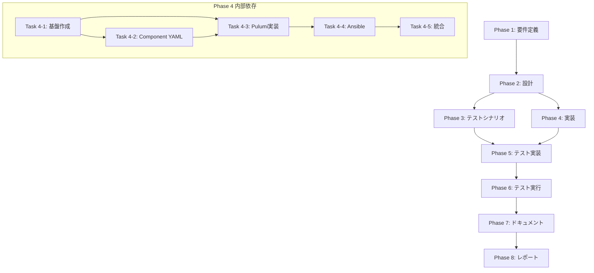

# プロジェクト計画書: Issue #496

## EC2 Image BuilderでECS Fargate Agent Dockerイメージの自動ビルド

**作成日**: 2025-01-14
**Issue URL**: https://github.com/tielec/infrastructure-as-code/issues/496

---

## 1. Issue分析

### 1.1 概要
現在、ECS Fargate Agent用のDockerイメージは手作業でビルド・ECRへプッシュしている。既存の`jenkins-agent-ami`スタックで使用しているEC2 Image Builder（AMI作成用）と同様のアプローチで、コンテナイメージのビルドも自動化する。

### 1.2 複雑度: **中程度**

**判定理由**:
- 既存の`jenkins-agent-ami`スタックが参考実装として存在し、パターンを踏襲可能
- EC2 Image BuilderのContainerRecipe機能は既存のImageRecipeと類似のAPI構造
- 新規Pulumiスタックの作成が必要だが、既存パターンに従う
- DockerfileからImage Builder Component形式への変換が必要（技術的な変換作業）
- AnsibleプレイブックやSSMパラメータの追加が必要

### 1.3 見積もり工数: **12〜16時間**

| フェーズ | 見積もり |
|---------|---------|
| 要件定義 | 1〜2h |
| 設計 | 2〜3h |
| テストシナリオ | 1〜2h |
| 実装 | 5〜6h |
| テスト実装・実行 | 2〜3h |
| ドキュメント | 0.5〜1h |
| レポート | 0.5h |

**根拠**:
- 参考実装（jenkins-agent-ami）があり、パターン踏襲で効率的に実装可能
- EC2 Image Builder ContainerRecipeはPulumiで十分サポートされている
- 既存のDockerfile（約100行）をComponent YAML形式に変換する作業が主要な技術作業
- 統合テストは実際のAWSリソース作成を伴うため時間がかかる可能性

### 1.4 リスク評価: **中**

**理由**:
- EC2 Image Builderのコンテナビルドは、Dockerfileの一部機能に制限あり（multi-stage build等）
- entrypoint.shの扱いをComponent YAMLで対応する必要あり
- 実際のイメージビルドには30分〜1時間程度かかり、デバッグサイクルが長い

---

## 2. 実装戦略判断

### 2.1 実装戦略: **CREATE**

**判断根拠**:
- 新規Pulumiスタック `pulumi/jenkins-agent-ecs-image/` を完全に新規作成
- 既存の `pulumi/jenkins-agent-ami/index.ts` をテンプレートとして使用するが、コードは新規作成
- 新規のComponent YAML（`component.yml`）を作成
- 新規のAnsibleプレイブック・ロールの作成
- 既存コードの修正ではなく、新規モジュールの追加が中心

### 2.2 テスト戦略: **INTEGRATION_ONLY**

**判断根拠**:
- Pulumiスタックは主にAWSリソースのプロビジョニングを行う
- ユニットテストの対象となる複雑なビジネスロジックは存在しない
- 実際のAWSリソース（ECR、Image Builder）との統合確認が主なテスト対象
- BDDはエンドユーザー向け機能ではないため不要
- 既存の`tests/integration/ecs-fargate/`パターンに従う

### 2.3 テストコード戦略: **CREATE_TEST**

**判断根拠**:
- 新規機能のため、新規テストファイルを作成
- `tests/integration/ecs-image/` ディレクトリを新規作成
- テストスクリプト: `test_ecs_image_pipeline.sh`（パイプラインリソース検証）
- 既存のテストファイルへの追加は不要

---

## 3. 影響範囲分析

### 3.1 既存コードへの影響

| ファイル/ディレクトリ | 影響 | 詳細 |
|----------------------|------|------|
| `pulumi/` | 新規追加 | `jenkins-agent-ecs-image/` スタック追加 |
| `ansible/playbooks/jenkins/deploy/` | 新規追加 | デプロイ用プレイブック追加 |
| `ansible/playbooks/jenkins/remove/` | 新規追加 | 削除用プレイブック追加 |
| `ansible/roles/` | 新規追加 | `jenkins_agent_ecs_image` ロール追加 |
| `pulumi/jenkins-agent/index.ts` | 変更なし | 既存のECRリポジトリ定義はそのまま使用 |
| `docker/jenkins-agent-ecs/` | 変更なし | 既存Dockerfile/entrypoint.shは参照のみ |

### 3.2 依存関係の変更

**新規依存の追加**:
- `jenkins-agent-ecs-image` スタックは以下に依存:
  - `jenkins-network`（VPC、サブネット）
  - `jenkins-security`（セキュリティグループ）
  - `jenkins-agent`（ECRリポジトリ）← 既存のECRを使用

**既存依存の変更**:
- なし（新規スタックの追加のみ）

### 3.3 マイグレーション要否

**データベーススキーマ変更**: 不要

**設定ファイル変更**:
- SSMパラメータの追加（`/jenkins-infra/{env}/agent-ecs-image/*`）
- Ansible変数の追加（`ansible/inventory/group_vars/all.yml`への項目追加は検討）

---

## 4. タスク分割

### Phase 1: 要件定義 (見積もり: 1〜2h)

- [ ] Task 1-1: 機能要件の詳細化 (0.5h)
  - EC2 Image Builder ContainerRecipeの仕様確認
  - 既存Dockerfileの分析と変換可能性の確認
  - entrypoint.shの取り扱い方法の決定
- [ ] Task 1-2: 技術要件の明確化 (0.5h)
  - Pulumi ContainerRecipe APIの確認
  - ECRリポジトリとの連携方法の確認
  - 既存の`jenkins-agent`スタックとの統合方法の決定
- [ ] Task 1-3: 受け入れ基準の定義 (0.5h)
  - Image Builderパイプラインが正常に作成される
  - パイプライン実行後、ECRにイメージがプッシュされる
  - SSMパラメータにパイプラインARN等が保存される

### Phase 2: 設計 (見積もり: 2〜3h)

- [ ] Task 2-1: Pulumiスタック設計 (1h)
  - `pulumi/jenkins-agent-ecs-image/index.ts` の構造設計
  - リソース定義（ContainerRecipe, InfrastructureConfiguration, DistributionConfiguration, ImagePipeline）
  - SSMパラメータ出力の設計
- [ ] Task 2-2: Component YAML設計 (1h)
  - `component.yml` の構造設計
  - Dockerfileからの変換マッピング
  - entrypoint.shのコピー/設定方法の設計
- [ ] Task 2-3: Ansibleプレイブック設計 (0.5h)
  - デプロイ/削除プレイブックの構造
  - ロール定義の設計
- [ ] Task 2-4: 依存関係とデプロイ順序の設計 (0.5h)
  - `jenkins-agent` → `jenkins-agent-ecs-image` の依存関係確認
  - jenkins_setup_pipeline.ymlへの統合方法

### Phase 3: テストシナリオ (見積もり: 1〜2h)

- [ ] Task 3-1: 統合テストシナリオ定義 (1h)
  - Pulumiリソース作成の検証シナリオ
  - SSMパラメータ出力の検証シナリオ
  - Image Builderパイプライン状態の検証シナリオ
- [ ] Task 3-2: 手動検証シナリオ定義 (0.5h)
  - パイプライン実行テストシナリオ
  - ECRへのイメージプッシュ確認シナリオ
  - イメージからのコンテナ起動確認シナリオ

### Phase 4: 実装 (見積もり: 5〜6h)

- [ ] Task 4-1: Pulumiスタック基盤の作成 (1h)
  - `pulumi/jenkins-agent-ecs-image/` ディレクトリ作成
  - `Pulumi.yaml`, `package.json`, `tsconfig.json` の作成
  - 依存パッケージのインストール確認
- [ ] Task 4-2: Component YAMLの作成 (1.5h)
  - `component.yml` の作成
  - Dockerfileの各ステップをImage Builder形式に変換
  - entrypoint.shのコピーとパーミッション設定
  - validate phaseの実装
- [ ] Task 4-3: Pulumiスタックの実装 (2h)
  - `index.ts` の実装
  - IAMロール（Image Builder用）の作成
  - ContainerRecipeの作成
  - InfrastructureConfigurationの作成
  - DistributionConfiguration（ECR配布設定）の作成
  - ImagePipelineの作成
  - SSMパラメータへのエクスポート
- [ ] Task 4-4: Ansibleプレイブック・ロールの作成 (1h)
  - `ansible/roles/jenkins_agent_ecs_image/` ロール作成
  - `ansible/playbooks/jenkins/deploy/deploy_jenkins_agent_ecs_image.yml` 作成
  - `ansible/playbooks/jenkins/remove/remove_jenkins_agent_ecs_image.yml` 作成
- [ ] Task 4-5: パイプライン統合 (0.5h)
  - `jenkins_setup_pipeline.yml` への統合（オプション）
  - タグ `ecs-image` の追加

### Phase 5: テストコード実装 (見積もり: 1〜1.5h)

- [ ] Task 5-1: 統合テストスクリプトの作成 (1h)
  - `tests/integration/ecs-image/test_ecs_image_pipeline.sh` の作成
  - SSMパラメータ存在確認
  - Image Builderリソース状態確認
  - ECRリポジトリ設定確認
- [ ] Task 5-2: テストヘルパーの作成 (0.5h)
  - 共通ユーティリティ関数の作成（既存パターン踏襲）

### Phase 6: テスト実行 (見積もり: 1〜1.5h)

- [ ] Task 6-1: Pulumiプレビュー実行 (0.5h)
  - `pulumi preview` でリソース作成計画を確認
  - エラーがないことを確認
- [ ] Task 6-2: テストスクリプトのドライラン (0.5h)
  - 構文チェック（shellcheck）
  - モック環境での動作確認
- [ ] Task 6-3: 統合テストレポート作成 (0.5h)
  - テスト結果のドキュメント化
  - 手動検証が必要な項目のリスト化

### Phase 7: ドキュメント (見積もり: 0.5〜1h)

- [ ] Task 7-1: README.mdの更新 (0.5h)
  - `pulumi/README.md` への新スタック追加
  - 依存関係図の更新
- [ ] Task 7-2: CONTRIBUTION.mdの確認 (0.25h)
  - 開発ガイドラインへの適合確認
- [ ] Task 7-3: 運用ドキュメントの追加 (0.25h)
  - パイプライン手動実行手順
  - トラブルシューティング情報

### Phase 8: レポート (見積もり: 0.5h)

- [ ] Task 8-1: 完了レポートの作成 (0.5h)
  - 実装サマリー
  - テスト結果サマリー
  - 残課題・今後の改善提案

---

## 5. 依存関係



### タスク間の依存関係詳細

| タスク | 前提タスク | 説明 |
|--------|-----------|------|
| Task 4-2 | Task 4-1 | 基盤ディレクトリ作成後にComponent YAML作成 |
| Task 4-3 | Task 4-1, 4-2 | Component YAMLを読み込むため |
| Task 4-4 | Task 4-3 | Pulumiスタック完成後にAnsibleラッパー作成 |
| Task 5-1 | Task 4-3 | テスト対象のリソース定義が必要 |
| Task 6-1 | Task 4-3 | Pulumiスタック完成後にプレビュー可能 |

---

## 6. リスクと軽減策

### リスク1: EC2 Image Builder ContainerRecipeの機能制限
- **影響度**: 中
- **確率**: 中
- **説明**: Dockerfileのmulti-stage buildやARG、一部のRUN命令がImage Builder形式で表現できない可能性
- **軽減策**:
  - Phase 1で詳細な技術調査を実施
  - 代替アプローチ（単一ステージ化、ビルド時間増加を許容）を事前に検討
  - 最悪の場合、CodeBuildを使用したDocker buildへのフォールバック計画を用意

### リスク2: entrypoint.shの取り扱い
- **影響度**: 中
- **確率**: 低
- **説明**: entrypoint.shをコンテナイメージ内の正しい場所に配置し、実行権限を設定する必要がある
- **軽減策**:
  - Component YAMLのbuildフェーズでファイルコピーと権限設定を実装
  - 既存のDockerfile内のCOPY/RUN命令を参考に変換
  - validateフェーズでentrypointの存在と権限を確認

### リスク3: イメージビルド時間の長さによるデバッグサイクルの遅延
- **影響度**: 中
- **確率**: 高
- **説明**: Image Builderでのコンテナビルドは30分〜1時間かかり、問題発生時のデバッグが困難
- **軽減策**:
  - ローカルでのDockerビルド確認を先行実施
  - Component YAMLの各ステップを小さく分割し、失敗箇所を特定しやすくする
  - validateフェーズを充実させ、早期にエラーを検出

### リスク4: ECRリポジトリへの配布設定
- **影響度**: 低
- **確率**: 低
- **説明**: DistributionConfigurationでECRへのイメージプッシュ設定が正しく動作しない可能性
- **軽減策**:
  - 既存の`jenkins-agent`スタックで作成済みのECRリポジトリを使用
  - DistributionConfigurationのtargetRepositoryパラメータを正確に設定
  - IAMポリシーにECRへのプッシュ権限を含める

### リスク5: 既存のECRリポジトリとの統合
- **影響度**: 低
- **確率**: 低
- **説明**: `jenkins-agent`スタックで作成されたECRリポジトリを別スタックから参照する際のSSMパラメータ整合性
- **軽減策**:
  - SSMパラメータ `/jenkins-infra/{env}/agent/ecr-repository-url` を読み取り専用で使用
  - スタック間の依存関係を明確にドキュメント化

---

## 7. 品質ゲート

### Phase 1: 要件定義
- [ ] EC2 Image Builder ContainerRecipeの技術仕様が理解されている
- [ ] 既存Dockerfileの全ステップがImage Builder形式に変換可能か確認済み
- [ ] 機能要件が明確に記載されている
- [ ] 受け入れ基準が定義されている
- [ ] 技術的制約・制限事項が文書化されている

### Phase 2: 設計
- [ ] 実装戦略の判断根拠が明記されている（CREATE）
- [ ] テスト戦略の判断根拠が明記されている（INTEGRATION_ONLY）
- [ ] テストコード戦略の判断根拠が明記されている（CREATE_TEST）
- [ ] Pulumiリソースの構成図が作成されている
- [ ] Component YAMLの構造が設計されている
- [ ] SSMパラメータ出力が定義されている
- [ ] 既存スタックとの依存関係が明確化されている

### Phase 3: テストシナリオ
- [ ] 統合テストシナリオが網羅的に定義されている
- [ ] 各テストケースに期待結果が記載されている
- [ ] 手動検証が必要な項目が識別されている

### Phase 4: 実装
- [ ] Pulumiスタックが`pulumi preview`でエラーなく実行される
- [ ] Component YAMLが有効なImage Builder形式である
- [ ] 既存のコーディング規約（CONTRIBUTION.md）に準拠している
- [ ] SSMパラメータ出力が設計通り実装されている
- [ ] Ansibleプレイブックが正常に実行される

### Phase 5: テスト実装
- [ ] テストスクリプトがshellcheckでエラーなし
- [ ] 既存のテストパターン（tests/integration/）に準拠している
- [ ] テストカバレッジが要件を満たしている

### Phase 6: テスト実行
- [ ] すべての自動テストがパスしている
- [ ] Pulumiプレビューが成功している
- [ ] 手動検証項目がリスト化されている

### Phase 7: ドキュメント
- [ ] README.mdが更新されている
- [ ] 新規スタックの使用方法が記載されている
- [ ] 依存関係図が更新されている

### Phase 8: レポート
- [ ] 実装サマリーが記載されている
- [ ] テスト結果サマリーが記載されている
- [ ] 残課題・改善提案が記載されている

---

## 8. 技術詳細（参考情報）

### 8.1 既存リソースの参照

**jenkins-agent-amiスタック（参考実装）**:
- 場所: `pulumi/jenkins-agent-ami/index.ts`
- Component YAML: `component-x86.yml`, `component-arm.yml`
- バージョン管理: `1.YYMMDD.secondsOfDay` 形式

**既存のDockerfile**:
- 場所: `docker/jenkins-agent-ecs/Dockerfile`
- ベースイメージ: `amazoncorretto:21-al2023`
- multi-stage build（builder + runtime）
- 含まれるツール: Git, Java 21, Node.js 20, AWS CLI, Pulumi, Ansible, Docker CLI

**既存のECRリポジトリ**:
- 作成元: `pulumi/jenkins-agent/index.ts`
- SSMパラメータ: `/jenkins-infra/{env}/agent/ecr-repository-url`

### 8.2 新規作成リソース

**Pulumiスタック**: `jenkins-agent-ecs-image`
- ContainerRecipe
- InfrastructureConfiguration
- DistributionConfiguration
- ImagePipeline
- SSMパラメータ（pipeline-arn, component-version等）

**SSMパラメータ（新規）**:
- `/jenkins-infra/{env}/agent-ecs-image/pipeline-arn`
- `/jenkins-infra/{env}/agent-ecs-image/component-version`
- `/jenkins-infra/{env}/agent-ecs-image/recipe-version`

### 8.3 Image Builder ContainerRecipe構造

```typescript
// Pulumi TypeScript例
const containerRecipe = new aws.imagebuilder.ContainerRecipe("ecs-agent-recipe", {
    name: `${projectName}-ecs-agent-recipe-${environment}`,
    version: recipeVersion,
    containerType: "DOCKER",
    parentImage: "arn:aws:imagebuilder:ap-northeast-1:aws:image/amazon-linux-x86-latest/x.x.x",
    targetRepository: {
        repositoryName: ecrRepositoryName,
        service: "ECR",
    },
    components: [{
        componentArn: componentArn,
    }],
    dockerfileTemplateData: `FROM {{{ imagebuilder:parentImage }}}
{{{ imagebuilder:environments }}}
{{{ imagebuilder:components }}}
COPY entrypoint.sh /entrypoint.sh
RUN chmod +x /entrypoint.sh
ENTRYPOINT ["/entrypoint.sh"]
`,
});
```

---

## 9. 承認・レビュー

| 項目 | 状態 | 日付 | 担当者 |
|------|------|------|--------|
| 計画書作成 | 完了 | 2025-01-14 | - |
| クリティカルシンキングレビュー | 未実施 | - | - |
| 計画承認 | 未実施 | - | - |

---

## 10. 品質ゲートチェックリスト（Phase 0）

- [x] **実装戦略が明確に決定されている**（CREATE）
- [x] **テスト戦略が明確に決定されている**（INTEGRATION_ONLY）
- [x] **テストコード戦略が明確に決定されている**（CREATE_TEST）
- [x] **影響範囲が分析されている**
- [x] **タスク分割が適切な粒度である**（1タスク = 1〜4時間）
- [x] **リスクが洗い出されている**（5件のリスクと軽減策）

---

*この計画書はIssue #496の実装に向けた初期計画です。Phase 1（要件定義）で詳細な技術調査を行い、必要に応じて計画を更新します。*
