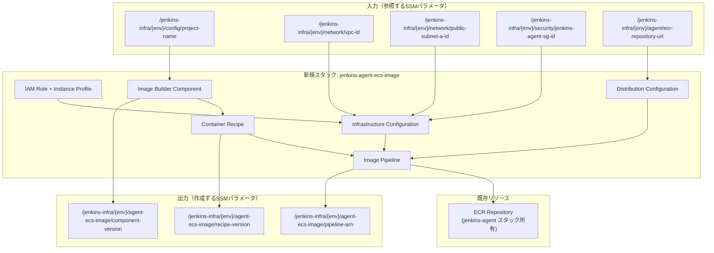
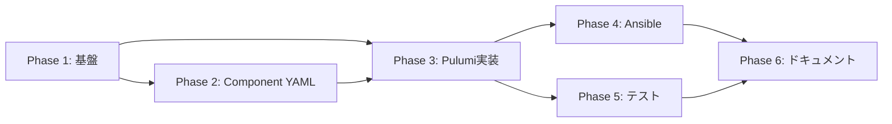

# 詳細設計書: Issue #496

## EC2 Image BuilderでECS Fargate Agent Dockerイメージの自動ビルド

**作成日**: 2025-01-14
**Issue URL**: https://github.com/tielec/infrastructure-as-code/issues/496
**対応する要件定義書**: `.ai-workflow/issue-496/01_requirements/output/requirements.md`
**対応するPlanning Document**: `.ai-workflow/issue-496/00_planning/output/planning.md`

---

## 1. 戦略判断

### 1.1 実装戦略: CREATE

**判断根拠**:
- 新規Pulumiスタック `pulumi/jenkins-agent-ecs-image/` を完全に新規作成する
- 既存の `pulumi/jenkins-agent-ami/index.ts` をテンプレートとして参考にするが、コードは新規作成
- 新規のComponent YAML（`component.yml`）を作成
- 新規のAnsibleロール・プレイブックを作成
- 既存のコードへの修正は不要で、新規モジュールの追加が中心

### 1.2 テスト戦略: INTEGRATION_ONLY

**判断根拠**:
- Pulumiスタックは主にAWSリソースのプロビジョニングを行う
- ユニットテストの対象となる複雑なビジネスロジックは存在しない
- 実際のAWSリソース（ECR、Image Builder）との統合確認が主なテスト対象
- BDDはエンドユーザー向け機能ではないため不要
- 既存の`tests/integration/ecs-fargate/`パターンに従う

### 1.3 テストコード戦略: CREATE_TEST

**判断根拠**:
- 新規機能のため、新規テストファイルを作成
- `tests/integration/ecs-image/` ディレクトリを新規作成
- 既存の `tests/integration/ecs-fargate/` とは別機能のため、独立したテストディレクトリが適切
- 既存テストファイルへの追加は不要

---

## 2. アーキテクチャ設計

### 2.1 システム全体図

```
┌─────────────────────────────────────────────────────────────────────┐
│                        Ansible Layer                                 │
│  ┌─────────────────────────────────────────────────────────────┐   │
│  │  playbooks/jenkins/deploy/deploy_jenkins_agent_ecs_image.yml │   │
│  │  playbooks/jenkins/remove/remove_jenkins_agent_ecs_image.yml │   │
│  └──────────────────────────┬──────────────────────────────────┘   │
│                              │                                       │
│  ┌──────────────────────────▼──────────────────────────────────┐   │
│  │           roles/jenkins_agent_ecs_image/                     │   │
│  │    ├── tasks/main.yml                                        │   │
│  │    ├── tasks/deploy.yml                                      │   │
│  │    ├── tasks/destroy.yml                                     │   │
│  │    └── meta/main.yml (依存: pulumi_helper, ssm_parameter_store)│  │
│  └──────────────────────────┬──────────────────────────────────┘   │
└─────────────────────────────┼───────────────────────────────────────┘
                              │ include_role: pulumi_helper
                              ▼
┌─────────────────────────────────────────────────────────────────────┐
│                        Pulumi Layer                                  │
│  ┌─────────────────────────────────────────────────────────────┐   │
│  │            pulumi/jenkins-agent-ecs-image/                   │   │
│  │    ├── index.ts (メインエントリ)                             │   │
│  │    ├── component.yml (Image Builder Component定義)           │   │
│  │    ├── Pulumi.yaml, package.json, tsconfig.json              │   │
│  └──────────────────────────┬──────────────────────────────────┘   │
│                              │                                       │
│  リソース作成:                                                       │
│   • IAMロール (Image Builder用)                                      │
│   • Image Builder Component (ツールインストール)                     │
│   • Container Recipe (Dockerfileテンプレート)                        │
│   • Infrastructure Configuration (ビルド用EC2設定)                   │
│   • Distribution Configuration (ECR配布設定)                         │
│   • Image Pipeline (パイプライン定義)                               │
│   • SSM Parameters (出力値の保存)                                    │
└─────────────────────────────┬───────────────────────────────────────┘
                              │
                              ▼
┌─────────────────────────────────────────────────────────────────────┐
│                         AWS Resources                                │
│                                                                      │
│  ┌─────────────────┐    ┌─────────────────┐    ┌─────────────────┐ │
│  │ EC2 Image       │    │ Container       │    │ ECR Repository  │ │
│  │ Builder         │───▶│ Image           │───▶│ (既存: jenkins- │ │
│  │ Pipeline        │    │ (Docker)        │    │ agent-ecs-{env})│ │
│  └─────────────────┘    └─────────────────┘    └─────────────────┘ │
│                                                                      │
│  ┌─────────────────┐    ┌─────────────────┐                        │
│  │ SSM Parameter   │    │ VPC/Subnet      │                        │
│  │ Store           │    │ (既存)          │                        │
│  └─────────────────┘    └─────────────────┘                        │
└─────────────────────────────────────────────────────────────────────┘
```

### 2.2 コンポーネント間の関係



### 2.3 データフロー

```
1. デプロイ時のデータフロー:
   ┌─────────────┐
   │ ansible-    │
   │ playbook    │
   └──────┬──────┘
          │ (env, trigger_build)
          ▼
   ┌─────────────┐
   │ Ansible     │
   │ Role        │──┬──▶ pulumi_helper (init_stack)
   └─────────────┘  ├──▶ pulumi_helper (preview)
                    ├──▶ pulumi_helper (deploy)
                    ├──▶ ssm_parameter_store (get_parameter)
                    └──▶ aws_cli_helper (start pipeline)

2. Image Builder実行時のデータフロー:
   ┌─────────────┐
   │ Pipeline    │
   │ Trigger     │
   └──────┬──────┘
          │
          ▼
   ┌─────────────┐    ┌─────────────┐    ┌─────────────┐
   │ Build EC2   │───▶│ Component   │───▶│ Container   │
   │ Instance    │    │ Execution   │    │ Image       │
   └─────────────┘    └─────────────┘    └──────┬──────┘
                                                 │
                                                 ▼
                                         ┌─────────────┐
                                         │ ECR Push    │
                                         │ (tags:      │
                                         │  latest,    │
                                         │  buildDate) │
                                         └─────────────┘
```

---

## 3. 影響範囲分析

### 3.1 既存コードへの影響

| ファイル/ディレクトリ | 影響 | 詳細 |
|----------------------|------|------|
| `pulumi/` | 新規追加 | `jenkins-agent-ecs-image/` スタック追加 |
| `ansible/roles/` | 新規追加 | `jenkins_agent_ecs_image/` ロール追加 |
| `ansible/playbooks/jenkins/deploy/` | 新規追加 | `deploy_jenkins_agent_ecs_image.yml` |
| `ansible/playbooks/jenkins/remove/` | 新規追加 | `remove_jenkins_agent_ecs_image.yml` |
| `tests/integration/` | 新規追加 | `ecs-image/` ディレクトリ追加 |
| `pulumi/jenkins-agent/index.ts` | **変更なし** | 既存のECRリポジトリ定義はそのまま使用 |
| `docker/jenkins-agent-ecs/` | **変更なし** | 既存Dockerfile/entrypoint.shは参照のみ |
| `pulumi/README.md` | 更新推奨 | 新スタックの説明追加 |

### 3.2 依存関係の変更

**新規依存の追加**:
- `jenkins-agent-ecs-image` スタックは以下に依存:
  - `jenkins-ssm-init`（project-name）
  - `jenkins-network`（VPC、サブネット）
  - `jenkins-security`（セキュリティグループ）
  - `jenkins-agent`（ECRリポジトリ）

**既存依存の変更**: なし

### 3.3 マイグレーション要否

**データベーススキーマ変更**: 不要

**設定ファイル変更**:
- SSMパラメータの新規追加（`/jenkins-infra/{env}/agent-ecs-image/*`）
- 既存パラメータへの影響なし

---

## 4. 変更・追加ファイルリスト

### 4.1 新規作成ファイル

```
pulumi/jenkins-agent-ecs-image/
├── index.ts                    # メインPulumiスタック
├── component.yml               # Image Builder Component定義
├── Pulumi.yaml                 # Pulumiプロジェクト設定
├── package.json                # Node.js依存関係
└── tsconfig.json               # TypeScript設定

ansible/roles/jenkins_agent_ecs_image/
├── meta/main.yml               # 依存関係定義
└── tasks/
    ├── main.yml                # エントリーポイント
    ├── deploy.yml              # デプロイタスク
    └── destroy.yml             # 削除タスク

ansible/playbooks/jenkins/deploy/
└── deploy_jenkins_agent_ecs_image.yml

ansible/playbooks/jenkins/remove/
└── remove_jenkins_agent_ecs_image.yml

tests/integration/ecs-image/
└── test_ecs_image_pipeline.sh  # 統合テストスクリプト
```

### 4.2 修正が必要な既存ファイル

```
pulumi/README.md                # 新スタックの説明追加（推奨）
```

### 4.3 削除が必要なファイル

なし

---

## 5. 詳細設計

### 5.1 Pulumiスタック設計 (index.ts)

#### 5.1.1 ファイルヘッダーとインポート

```typescript
/**
 * pulumi/jenkins-agent-ecs-image/index.ts
 *
 * Jenkins Agent用のECSコンテナイメージをEC2 Image Builderで作成するPulumiスクリプト
 * 既存のDockerfile (docker/jenkins-agent-ecs/Dockerfile) の内容をImage Builder形式に変換
 */
import * as pulumi from "@pulumi/pulumi";
import * as aws from "@pulumi/aws";
import * as fs from "fs";
import * as path from "path";
```

#### 5.1.2 リソース構成

| リソース名 | リソースタイプ | 説明 |
|-----------|--------------|------|
| `imagebuilder-role` | `aws.iam.Role` | Image Builder実行用IAMロール |
| `imagebuilder-profile` | `aws.iam.InstanceProfile` | インスタンスプロファイル |
| `ecs-agent-component` | `aws.imagebuilder.Component` | ツールインストール定義 |
| `ecs-agent-recipe` | `aws.imagebuilder.ContainerRecipe` | コンテナレシピ |
| `ecs-agent-infra` | `aws.imagebuilder.InfrastructureConfiguration` | ビルド用EC2設定 |
| `ecs-agent-dist` | `aws.imagebuilder.DistributionConfiguration` | ECR配布設定 |
| `ecs-agent-pipeline` | `aws.imagebuilder.ImagePipeline` | パイプライン |
| `pipeline-arn` | `aws.ssm.Parameter` | パイプラインARN保存 |
| `component-version` | `aws.ssm.Parameter` | コンポーネントバージョン保存 |
| `recipe-version` | `aws.ssm.Parameter` | レシピバージョン保存 |

#### 5.1.3 バージョン管理

```typescript
// バージョン管理（自動インクリメント）
// Image Builderは X.Y.Z 形式のセマンティックバージョンのみ受け付ける
const now = new Date();
const year = String(now.getFullYear()).slice(-2);
const month = String(now.getMonth() + 1).padStart(2, '0');
const day = String(now.getDate()).padStart(2, '0');
const dateStr = `${year}${month}${day}`;
const secondsOfDay = now.getHours() * 3600 + now.getMinutes() * 60 + now.getSeconds();

const config = new pulumi.Config();
const componentVersion = config.get("componentVersion") || `1.${dateStr}.${secondsOfDay}`;
const recipeVersion = config.get("recipeVersion") || `1.${dateStr}.${secondsOfDay}`;
```

#### 5.1.4 ContainerRecipe設計

```typescript
// ContainerRecipeの構造
const containerRecipe = new aws.imagebuilder.ContainerRecipe(`ecs-agent-recipe`, {
    name: pulumi.interpolate`${projectName}-ecs-agent-recipe-${environment}`,
    version: recipeVersion,
    containerType: "DOCKER",
    parentImage: "amazonlinux:2023",  // ベースイメージ
    targetRepository: {
        repositoryName: ecrRepositoryName,  // 既存ECRリポジトリ
        service: "ECR",
    },
    components: [{
        componentArn: ecsAgentComponent.arn,
    }],
    dockerfileTemplateData: pulumi.interpolate`
FROM {{{ imagebuilder:parentImage }}}
{{{ imagebuilder:environments }}}
{{{ imagebuilder:components }}}
# Java環境変数
ENV JAVA_HOME=/usr/lib/jvm/java-21-amazon-corretto
ENV JENKINS_AGENT_HOME=/home/jenkins
# エントリーポイント設定
COPY entrypoint.sh /entrypoint.sh
RUN chmod +x /entrypoint.sh
USER jenkins
WORKDIR /home/jenkins
ENTRYPOINT ["/entrypoint.sh"]
`,
    tags: {
        Name: pulumi.interpolate`${projectName}-ecs-agent-recipe-${environment}`,
        Environment: environment,
    },
}, {
    replaceOnChanges: ["version", "components[0].componentArn"],
});
```

#### 5.1.5 IAMポリシー設計

```typescript
// Image Builder用IAMロールに必要なポリシー
const requiredPolicies = [
    "arn:aws:iam::aws:policy/EC2InstanceProfileForImageBuilder",
    "arn:aws:iam::aws:policy/AmazonSSMManagedInstanceCore",
    "arn:aws:iam::aws:policy/EC2InstanceProfileForImageBuilderECRContainerBuilds",
];

// ECRプッシュ用のカスタムポリシー
const ecrPushPolicy = new aws.iam.Policy(`imagebuilder-ecr-policy`, {
    name: pulumi.interpolate`${projectName}-imagebuilder-ecr-policy-${environment}`,
    policy: pulumi.all([ecrRepositoryArn]).apply(([repoArn]) => JSON.stringify({
        Version: "2012-10-17",
        Statement: [{
            Effect: "Allow",
            Action: [
                "ecr:GetAuthorizationToken",
                "ecr:BatchCheckLayerAvailability",
                "ecr:InitiateLayerUpload",
                "ecr:UploadLayerPart",
                "ecr:CompleteLayerUpload",
                "ecr:PutImage",
            ],
            Resource: repoArn,
        }],
    })),
});
```

### 5.2 Component YAML設計 (component.yml)

#### 5.2.1 全体構造

```yaml
name: JenkinsAgentECSSetup
description: Install and configure Jenkins Agent for ECS Fargate container
schemaVersion: 1.0

phases:
  - name: build
    steps:
      # 1. システム更新
      - name: UpdateSystem
      # 2. 基本パッケージインストール
      - name: InstallBasicPackages
      # 3. Java 21インストール
      - name: InstallJava
      # 4. Node.js 20インストール
      - name: InstallNodeJS
      # 5. AWS CLI v2インストール
      - name: InstallAwsCli
      # 6. Pulumiインストール
      - name: InstallPulumi
      # 7. Ansibleインストール
      - name: InstallAnsible
      # 8. Jenkinsユーザー作成
      - name: CreateJenkinsUser
      # 9. Jenkins remoting JARダウンロード
      - name: DownloadJenkinsRemoting
      # 10. エントリーポイントスクリプト配置
      - name: SetupEntrypoint
      # 11. キャッシュクリーンアップ
      - name: CleanupCache

  - name: validate
    steps:
      # ツールバージョン検証
      - name: ValidateInstallation
```

#### 5.2.2 主要ステップの詳細設計

**InstallJava:**
```yaml
- name: InstallJava
  action: ExecuteBash
  inputs:
    commands:
      - dnf install -y java-21-amazon-corretto
      - java -version
      - |
        echo 'export JAVA_HOME=/usr/lib/jvm/java-21-amazon-corretto' >> /etc/profile.d/java.sh
```

**InstallAwsCli:**
```yaml
- name: InstallAwsCli
  action: ExecuteBash
  inputs:
    commands:
      - curl "https://awscli.amazonaws.com/awscli-exe-linux-x86_64.zip" -o "awscliv2.zip"
      - unzip awscliv2.zip
      - ./aws/install --install-dir /opt/aws-cli --bin-dir /usr/local/bin
      - rm -rf aws awscliv2.zip
      - aws --version
```

**InstallPulumi:**
```yaml
- name: InstallPulumi
  action: ExecuteBash
  inputs:
    commands:
      - curl -fsSL https://get.pulumi.com/releases/sdk/pulumi-v3.115.0-linux-x64.tar.gz | tar -xz -C /opt
      - ln -s /opt/pulumi/pulumi /usr/local/bin/pulumi
      - pulumi version
```

**CreateJenkinsUser:**
```yaml
- name: CreateJenkinsUser
  action: ExecuteBash
  inputs:
    commands:
      - groupadd -g 1000 jenkins
      - useradd -u 1000 -g jenkins -d /home/jenkins -m jenkins
      - mkdir -p /home/jenkins/.jenkins
      - chown -R jenkins:jenkins /home/jenkins
```

**DownloadJenkinsRemoting:**
```yaml
- name: DownloadJenkinsRemoting
  action: ExecuteBash
  inputs:
    commands:
      - |
        REMOTING_VERSION="3206.vb_15dcf73f6a_9"
        curl -fsSL "https://repo.jenkins-ci.org/public/org/jenkins-ci/main/remoting/${REMOTING_VERSION}/remoting-${REMOTING_VERSION}.jar" \
          -o /home/jenkins/agent.jar
        chown jenkins:jenkins /home/jenkins/agent.jar
```

**SetupEntrypoint:**
```yaml
- name: SetupEntrypoint
  action: ExecuteBash
  inputs:
    commands:
      - |
        cat > /entrypoint.sh << 'ENTRYPOINT_EOF'
        #!/bin/bash
        # Jenkins Agent JNLP Entrypoint for ECS Fargate
        set -e

        log() {
            echo "[$(date '+%Y-%m-%d %H:%M:%S')] $*"
        }

        log "Starting Jenkins Agent..."

        JENKINS_AGENT_HOME="${JENKINS_AGENT_HOME:-/home/jenkins}"
        WORKDIR="${JENKINS_AGENT_HOME}/agent"
        mkdir -p "${WORKDIR}"

        log "Received arguments: $*"

        if [ "$1" = "-url" ] && [ $# -eq 4 ]; then
            JENKINS_URL="$2"
            SECRET="$3"
            AGENT_NAME="$4"

            log "Converted to new format with WebSocket:"
            log "  URL: ${JENKINS_URL}"
            log "  Agent Name: ${AGENT_NAME}"

            exec java -jar "${JENKINS_AGENT_HOME}/agent.jar" \
                -url "${JENKINS_URL}" \
                -secret "${SECRET}" \
                -name "${AGENT_NAME}" \
                -workDir "${WORKDIR}" \
                -webSocket
        else
            log "Using arguments as-is"
            exec java -jar "${JENKINS_AGENT_HOME}/agent.jar" \
                -workDir "${WORKDIR}" \
                "$@"
        fi
        ENTRYPOINT_EOF
      - chmod +x /entrypoint.sh
      - chown jenkins:jenkins /entrypoint.sh
```

**ValidateInstallation:**
```yaml
- name: ValidateInstallation
  action: ExecuteBash
  inputs:
    commands:
      - java -version
      - git --version
      - node --version
      - npm --version
      - python3 --version
      - aws --version
      - pulumi version
      - ansible --version
      - test -f /home/jenkins/agent.jar
      - test -x /entrypoint.sh
      - id jenkins
```

### 5.3 Ansibleロール設計

#### 5.3.1 meta/main.yml

```yaml
---
# Jenkins Agent ECS Image Builder role dependencies
dependencies:
  - role: aws_setup
  - role: aws_cli_helper
  - role: pulumi_helper
  - role: ssm_parameter_store
```

#### 5.3.2 tasks/main.yml

```yaml
---
# Jenkins Agent ECS Image Builder main tasks
- name: Include deploy tasks
  ansible.builtin.include_tasks: deploy.yml
  when: operation | default('deploy') == 'deploy'

- name: Include destroy tasks
  ansible.builtin.include_tasks: destroy.yml
  when: operation | default('deploy') == 'destroy'
```

#### 5.3.3 tasks/deploy.yml

```yaml
---
# Jenkins Agent ECS Image Builder deployment tasks

- name: Display deployment start
  ansible.builtin.debug:
    msg: "Deploying Jenkins Agent ECS Image Builder for {{ env_name }} environment"

- name: Deploy ECS Image Builder Infrastructure with Pulumi
  block:
    - name: Set deployment variables
      ansible.builtin.set_fact:
        pulumi_dir: "{{ pulumi_path }}/jenkins-agent-ecs-image"
        env: "{{ env_name }}"

    # Pulumi stack init
    - name: Initialize Pulumi stack for Jenkins Agent ECS Image
      ansible.builtin.include_role:
        name: pulumi_helper
        tasks_from: init_stack
      vars:
        pulumi_project_path: "{{ pulumi_dir }}"
        stack_name: "{{ env }}"

    # Pulumi preview
    - name: Preview ECS Image deployment
      ansible.builtin.include_role:
        name: pulumi_helper
        tasks_from: preview
      vars:
        pulumi_project_path: "{{ pulumi_dir }}"

    # Pulumi deploy
    - name: Deploy Jenkins Agent ECS Image Builder infrastructure
      ansible.builtin.include_role:
        name: pulumi_helper
        tasks_from: deploy
      vars:
        pulumi_project_path: "{{ pulumi_dir }}"

    # Get pipeline ARN for triggering (only if needed)
    - name: Get pipeline ARN from SSM Parameter Store
      when: (trigger_image_build | default(true)) | bool
      block:
        - name: Get pipeline ARN from SSM Parameter Store
          ansible.builtin.include_role:
            name: ssm_parameter_store
            tasks_from: get_parameter
          vars:
            parameter_name: "/jenkins-infra/{{ env }}/agent-ecs-image/pipeline-arn"
            store_as: "pipeline_arn"

    - name: Display deployment summary
      ansible.builtin.debug:
        msg: "Jenkins Agent ECS Image Builder deployed successfully for {{ env }} environment"

    # パイプラインを自動トリガー（デフォルトで有効）
    - name: Trigger Image Builder pipeline
      when:
        - (trigger_image_build | default(true)) | bool
        - pipeline_arn is defined
      ansible.builtin.include_role:
        name: aws_cli_helper
        tasks_from: execute
      vars:
        aws_command: "aws imagebuilder start-image-pipeline-execution --image-pipeline-arn {{ pipeline_arn }}"
        operation_name: "Start ECS Image Builder pipeline"
        parse_output: true

    - name: Display pipeline trigger status
      when: (trigger_image_build | default(true)) | bool
      ansible.builtin.debug:
        msg: "Image Builder pipeline triggered. Container image builds typically take 30-45 minutes."

  rescue:
    - name: Display deployment failure message
      ansible.builtin.debug:
        msg: "ERROR: ECS Image Builder deployment failed. See error details above."

    - name: Fail the playbook
      ansible.builtin.fail:
        msg: "ECS Image Builder deployment failed"
```

#### 5.3.4 tasks/destroy.yml

```yaml
---
# Jenkins Agent ECS Image Builder destruction tasks

- name: Display destruction start
  ansible.builtin.debug:
    msg: "Destroying Jenkins Agent ECS Image Builder for {{ env_name }} environment"

- name: Destroy ECS Image Builder Infrastructure
  block:
    - name: Set destruction variables
      ansible.builtin.set_fact:
        pulumi_dir: "{{ pulumi_path }}/jenkins-agent-ecs-image"
        env: "{{ env_name }}"

    # Pulumiスタック初期化（存在確認）
    - name: Initialize Pulumi stack for destruction
      ansible.builtin.include_role:
        name: pulumi_helper
        tasks_from: init_stack
      vars:
        pulumi_project_path: "{{ pulumi_dir }}"
        stack_name: "{{ env }}"

    # Pulumiリソース削除
    - name: Destroy Jenkins Agent ECS Image Builder infrastructure
      ansible.builtin.include_role:
        name: pulumi_helper
        tasks_from: destroy
      vars:
        pulumi_project_path: "{{ pulumi_dir }}"
        force_destroy: "{{ force | default(false) }}"

    # Pulumiスタック削除（オプション）
    - name: Remove Pulumi stack
      when: (remove_stack | default(true)) | bool
      ansible.builtin.include_role:
        name: pulumi_helper
        tasks_from: remove_stack
      vars:
        pulumi_project_path: "{{ pulumi_dir }}"
        stack_name: "{{ env }}"

    - name: Display destruction summary
      ansible.builtin.debug:
        msg: "Jenkins Agent ECS Image Builder destroyed successfully for {{ env }} environment"

  rescue:
    - name: Display destruction failure message
      ansible.builtin.debug:
        msg: "ERROR: ECS Image Builder destruction failed. See error details above."

    - name: Fail the playbook
      ansible.builtin.fail:
        msg: "ECS Image Builder destruction failed"
```

### 5.4 プレイブック設計

#### 5.4.1 deploy_jenkins_agent_ecs_image.yml

```yaml
---
# Jenkins Agent ECS Image Builderのデプロイ
#
# 実行例
# ======
#
# 基本実行:
#   ansible-playbook playbooks/jenkins/deploy/deploy_jenkins_agent_ecs_image.yml -e "env=dev"
#
# パイプラインをトリガーせずにデプロイのみ:
#   ansible-playbook playbooks/jenkins/deploy/deploy_jenkins_agent_ecs_image.yml -e "env=dev trigger_image_build=false"
#

- name: Deploy Jenkins Agent ECS Image Builder
  hosts: localhost
  gather_facts: no

  pre_tasks:
    - name: Load group_vars/all.yml variables
      ansible.builtin.include_vars:
        file: "{{ inventory_dir }}/group_vars/all.yml"

    - name: Display deployment information
      ansible.builtin.debug:
        msg: |
          ==========================================
          Jenkins Agent ECS Image Builder Deployment
          ==========================================
          Environment: {{ env | default('dev') }}
          Trigger Build: {{ trigger_image_build | default(true) }}
          ==========================================

  tasks:
    - name: Execute Jenkins Agent ECS Image Builder deployment
      ansible.builtin.include_role:
        name: jenkins_agent_ecs_image
      vars:
        env_name: "{{ env | default('dev') }}"
        operation: deploy
        trigger_image_build: "{{ trigger_image_build | default(true) }}"
```

#### 5.4.2 remove_jenkins_agent_ecs_image.yml

```yaml
---
# Jenkins Agent ECS Image Builderの削除
#
# 実行例
# ======
#
# 削除確認付き:
#   ansible-playbook playbooks/jenkins/remove/remove_jenkins_agent_ecs_image.yml -e "env=dev confirm=true"
#
# スタックも削除:
#   ansible-playbook playbooks/jenkins/remove/remove_jenkins_agent_ecs_image.yml -e "env=dev confirm=true remove_stack=true"
#

- name: Remove Jenkins Agent ECS Image Builder
  hosts: localhost
  gather_facts: no

  pre_tasks:
    - name: Load group_vars/all.yml variables
      ansible.builtin.include_vars:
        file: "{{ inventory_dir }}/group_vars/all.yml"

    - name: Verify confirmation flag
      ansible.builtin.fail:
        msg: "削除を実行するには confirm=true を指定してください"
      when: not (confirm | default(false)) | bool

    - name: Display removal warning
      ansible.builtin.debug:
        msg: |
          ==========================================
          ⚠️  Jenkins Agent ECS Image Builder REMOVAL
          ==========================================
          Environment: {{ env | default('dev') }}
          Remove Stack: {{ remove_stack | default(true) }}

          この操作は以下のリソースを削除します：
          - Image Builder Pipeline
          - Container Recipe
          - Infrastructure Configuration
          - Distribution Configuration
          - Image Builder Component
          - IAM Role/Instance Profile
          - SSM Parameters
          ==========================================

    - name: Countdown before removal
      ansible.builtin.pause:
        seconds: 10
        prompt: "10秒後に削除を開始します。キャンセルするにはCtrl+Cを押してください..."

  tasks:
    - name: Execute Jenkins Agent ECS Image Builder removal
      ansible.builtin.include_role:
        name: jenkins_agent_ecs_image
      vars:
        env_name: "{{ env | default('dev') }}"
        operation: destroy
        remove_stack: "{{ remove_stack | default(true) }}"
```

### 5.5 テストスクリプト設計

#### 5.5.1 test_ecs_image_pipeline.sh

```bash
#!/bin/bash
# ============================================================================
# Test: ECS Image Builder Pipeline Validation
# ============================================================================
# Description:
#   EC2 Image BuilderでECSコンテナイメージパイプラインが正しく
#   構成されていることを検証する統合テストスクリプト
#
# Usage:
#   ./test_ecs_image_pipeline.sh [environment]
#
# Arguments:
#   environment - テスト対象環境 (default: dev)
#
# Prerequisites:
#   - AWS CLI configured
#   - jq installed
#   - Deployed jenkins-agent-ecs-image stack
# ============================================================================

set -euo pipefail

# 環境設定
ENV="${1:-dev}"
SSM_PREFIX="/jenkins-infra/${ENV}"
SCRIPT_DIR="$(cd "$(dirname "${BASH_SOURCE[0]}")" && pwd)"

# カラー出力
RED='\033[0;31m'
GREEN='\033[0;32m'
YELLOW='\033[1;33m'
NC='\033[0m' # No Color

log_info() {
    echo -e "${GREEN}[INFO]${NC} $*"
}

log_warn() {
    echo -e "${YELLOW}[WARN]${NC} $*"
}

log_error() {
    echo -e "${RED}[ERROR]${NC} $*"
}

log_test() {
    echo -e "${GREEN}[TEST]${NC} $*"
}

# ============================================================================
# Test Cases
# ============================================================================

test_ssm_parameters_exist() {
    log_test "INT-ECS-IMG-001: SSMパラメータの存在確認"

    local params=(
        "${SSM_PREFIX}/agent-ecs-image/pipeline-arn"
        "${SSM_PREFIX}/agent-ecs-image/component-version"
        "${SSM_PREFIX}/agent-ecs-image/recipe-version"
    )

    local failed=0
    for param in "${params[@]}"; do
        if aws ssm get-parameter --name "$param" --query 'Parameter.Value' --output text 2>/dev/null; then
            log_info "✓ Parameter exists: $param"
        else
            log_error "✗ Parameter missing: $param"
            failed=1
        fi
    done

    return $failed
}

test_pipeline_status() {
    log_test "INT-ECS-IMG-002: Image Builderパイプラインのステータス確認"

    local pipeline_arn
    pipeline_arn=$(aws ssm get-parameter \
        --name "${SSM_PREFIX}/agent-ecs-image/pipeline-arn" \
        --query 'Parameter.Value' --output text 2>/dev/null) || {
        log_error "Failed to get pipeline ARN"
        return 1
    }

    local status
    status=$(aws imagebuilder get-image-pipeline \
        --image-pipeline-arn "$pipeline_arn" \
        --query 'imagePipeline.status' --output text 2>/dev/null) || {
        log_error "Failed to get pipeline status"
        return 1
    }

    if [ "$status" == "ENABLED" ]; then
        log_info "✓ Pipeline status: ENABLED"
        return 0
    else
        log_warn "Pipeline status: $status (expected: ENABLED)"
        return 1
    fi
}

test_container_recipe_exists() {
    log_test "INT-ECS-IMG-003: ContainerRecipeの存在確認"

    local pipeline_arn
    pipeline_arn=$(aws ssm get-parameter \
        --name "${SSM_PREFIX}/agent-ecs-image/pipeline-arn" \
        --query 'Parameter.Value' --output text 2>/dev/null) || {
        log_error "Failed to get pipeline ARN"
        return 1
    }

    local recipe_arn
    recipe_arn=$(aws imagebuilder get-image-pipeline \
        --image-pipeline-arn "$pipeline_arn" \
        --query 'imagePipeline.containerRecipeArn' --output text 2>/dev/null) || {
        log_error "Failed to get container recipe ARN"
        return 1
    }

    if [ -n "$recipe_arn" ] && [ "$recipe_arn" != "None" ]; then
        log_info "✓ Container recipe exists: $recipe_arn"
        return 0
    else
        log_error "✗ Container recipe not found"
        return 1
    fi
}

test_ecr_repository_target() {
    log_test "INT-ECS-IMG-004: ECRリポジトリ配布設定の確認"

    local ecr_url
    ecr_url=$(aws ssm get-parameter \
        --name "${SSM_PREFIX}/agent/ecr-repository-url" \
        --query 'Parameter.Value' --output text 2>/dev/null) || {
        log_error "Failed to get ECR repository URL"
        return 1
    }

    if [ -n "$ecr_url" ]; then
        log_info "✓ Target ECR repository: $ecr_url"
        return 0
    else
        log_error "✗ ECR repository URL not found"
        return 1
    fi
}

test_iam_role_permissions() {
    log_test "INT-ECS-IMG-005: IAMロールの権限確認"

    local role_name="jenkins-infra-imagebuilder-role-${ENV}"

    # ロールの存在確認
    if aws iam get-role --role-name "$role_name" &>/dev/null; then
        log_info "✓ IAM role exists: $role_name"
    else
        log_error "✗ IAM role not found: $role_name"
        return 1
    fi

    # アタッチされたポリシーの確認
    local policies
    policies=$(aws iam list-attached-role-policies \
        --role-name "$role_name" \
        --query 'AttachedPolicies[].PolicyArn' --output text 2>/dev/null) || {
        log_error "Failed to list attached policies"
        return 1
    }

    log_info "Attached policies:"
    for policy in $policies; do
        log_info "  - $policy"
    done

    return 0
}

# ============================================================================
# Main
# ============================================================================

main() {
    echo "=============================================="
    echo "ECS Image Builder Pipeline Integration Tests"
    echo "=============================================="
    echo "Environment: ${ENV}"
    echo "SSM Prefix: ${SSM_PREFIX}"
    echo "=============================================="
    echo ""

    local total=0
    local passed=0
    local failed=0

    local tests=(
        "test_ssm_parameters_exist"
        "test_pipeline_status"
        "test_container_recipe_exists"
        "test_ecr_repository_target"
        "test_iam_role_permissions"
    )

    for test_func in "${tests[@]}"; do
        total=$((total + 1))
        echo ""
        if $test_func; then
            passed=$((passed + 1))
        else
            failed=$((failed + 1))
        fi
    done

    echo ""
    echo "=============================================="
    echo "Test Results"
    echo "=============================================="
    echo "Total:  $total"
    echo "Passed: $passed"
    echo "Failed: $failed"
    echo "=============================================="

    if [ $failed -gt 0 ]; then
        exit 1
    fi

    exit 0
}

main "$@"
```

---

## 6. セキュリティ考慮事項

### 6.1 認証・認可

| 項目 | 対策 |
|------|------|
| IAMロール | 最小権限原則に従い、Image Builder実行に必要な権限のみ付与 |
| ECRアクセス | 既存ECRリポジトリへのプッシュ権限のみ付与（リポジトリ作成権限は不要） |
| SSMパラメータ | 読み取り専用アクセス（他スタック所有のパラメータ） |

### 6.2 データ保護

| 項目 | 対策 |
|------|------|
| ビルドログ | CloudWatch Logsに自動記録（30日保持） |
| コンテナイメージ | ECRでの自動スキャン有効 |
| 秘密情報 | ハードコーディング禁止、必要に応じてSSM SecureString使用 |

### 6.3 ネットワークセキュリティ

| 項目 | 対策 |
|------|------|
| ビルドインスタンス | パブリックサブネット内で実行（NAT経由のインターネットアクセスが必要） |
| セキュリティグループ | 既存の`jenkins-agent-sg`を使用（アウトバウンドのみ許可） |
| 自動終了 | `terminateInstanceOnFailure: true`でビルド失敗時も自動終了 |

---

## 7. 非機能要件への対応

### 7.1 パフォーマンス

| 要件 | 対応 |
|------|------|
| イメージビルド時間 | 目標60分以内（既存Dockerfileのビルドと同等） |
| Pulumi preview | 30秒以内（リソース数が限定的のため達成可能） |
| Pulumi up | 5分以内（初回デプロイ時を除く） |

### 7.2 スケーラビリティ

- 手動トリガーまたはスケジュール実行に対応
- 将来的にGit pushトリガーへの拡張が可能な設計

### 7.3 保守性

| 項目 | 対応 |
|------|------|
| コード構造 | 既存の`jenkins-agent-ami`と同じパターンを採用 |
| バージョン管理 | セマンティックバージョニング（1.YYMMDD.秒数形式） |
| ドキュメント | README.mdに新スタックの説明を追加 |
| コーディング規約 | CONTRIBUTION.mdに準拠 |

---

## 8. 実装の順序

### 8.1 推奨実装順序

```
Phase 1: Pulumiスタック基盤 (1時間)
├── 1.1 ディレクトリ作成
├── 1.2 Pulumi.yaml, package.json, tsconfig.json作成
└── 1.3 依存パッケージ確認

Phase 2: Component YAML作成 (1.5時間)
├── 2.1 component.yml基本構造作成
├── 2.2 build phaseのステップ実装
└── 2.3 validate phaseの実装

Phase 3: Pulumiスタック実装 (2時間)
├── 3.1 index.ts - SSMパラメータ参照
├── 3.2 index.ts - IAMロール作成
├── 3.3 index.ts - Image Builderリソース作成
└── 3.4 index.ts - SSMパラメータ出力

Phase 4: Ansibleロール/プレイブック (1時間)
├── 4.1 meta/main.yml作成
├── 4.2 tasks/main.yml, deploy.yml, destroy.yml作成
└── 4.3 プレイブック作成

Phase 5: テスト実装・検証 (1.5時間)
├── 5.1 test_ecs_image_pipeline.sh作成
├── 5.2 pulumi preview実行
└── 5.3 構文チェック（shellcheck）

Phase 6: ドキュメント (0.5時間)
└── 6.1 pulumi/README.md更新
```

### 8.2 依存関係



---

## 9. 品質ゲートチェックリスト（Phase 2）

### 必須要件

- [x] **実装戦略の判断根拠が明記されている** (CREATE)
  - 新規Pulumiスタック、Ansibleロール、テストディレクトリの作成が中心
  - 既存コードへの修正は不要

- [x] **テスト戦略の判断根拠が明記されている** (INTEGRATION_ONLY)
  - Pulumiリソースの統合テストが主対象
  - ビジネスロジックが存在しないためユニットテストは不要

- [x] **既存コードへの影響範囲が分析されている**
  - 新規追加のみ、既存コードへの変更なし
  - 依存関係は既存スタック（jenkins-network, jenkins-security, jenkins-agent）を参照

- [x] **変更が必要なファイルがリストアップされている**
  - 新規作成: 13ファイル
  - 修正推奨: 1ファイル（pulumi/README.md）
  - 削除: なし

- [x] **設計が実装可能である**
  - 既存の`jenkins-agent-ami`を参考実装として使用
  - EC2 Image Builder ContainerRecipe APIを活用
  - 既存のAnsibleヘルパーロールを活用

---

## 10. 承認・レビュー

| 項目 | 状態 | 日付 | 担当者 |
|------|------|------|--------|
| 設計書作成 | 完了 | 2025-01-14 | - |
| クリティカルシンキングレビュー | 未実施 | - | - |
| 設計承認 | 未実施 | - | - |

---

*この設計書はIssue #496の詳細設計を定義しています。Phase 3（テストシナリオ）では、この設計に基づいてテストシナリオを作成します。*
